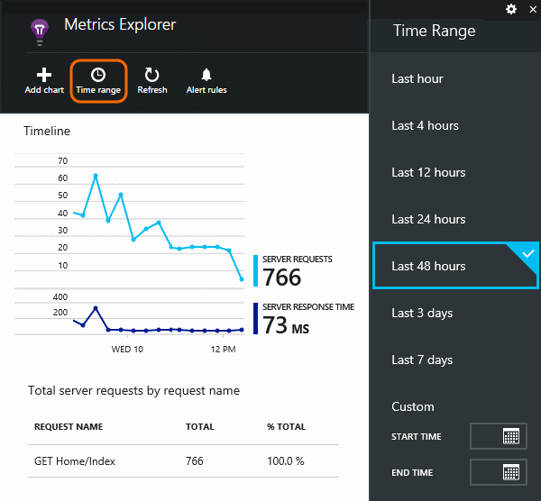
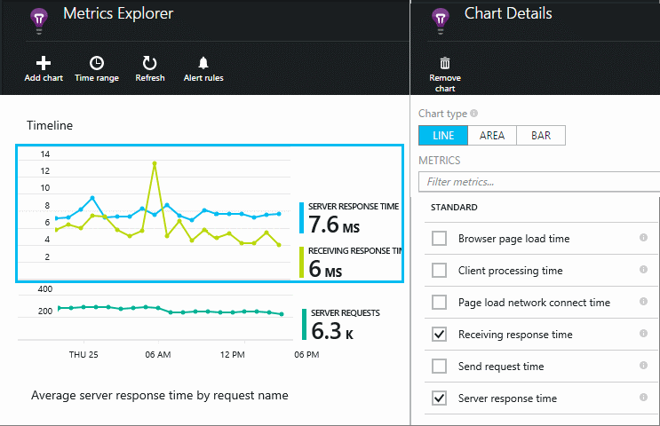
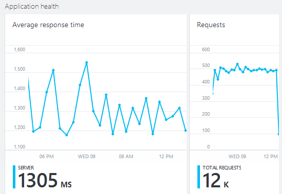
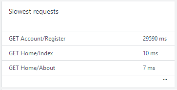
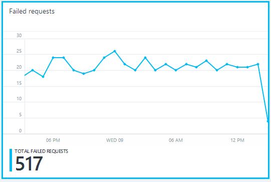
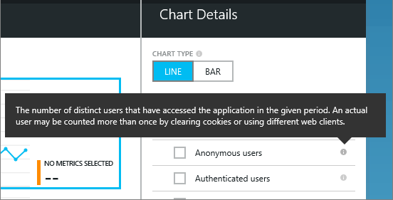
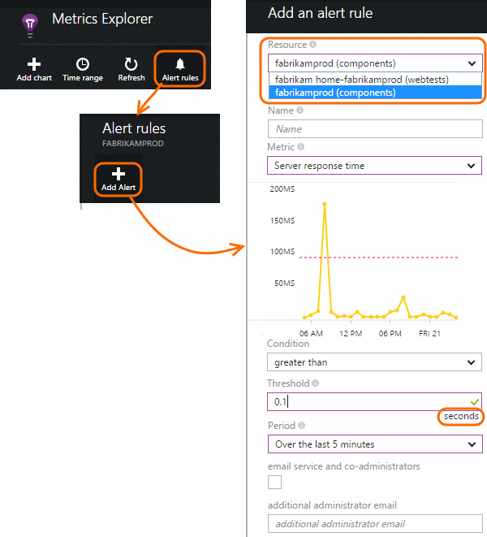

<properties 
    pageTitle="Überwachen Sie Ihrer app Gesundheit und Verwendung mit Anwendung Einsichten" 
    description="Erste Schritte mit der Anwendung Einsichten. Verwendung, Verfügbarkeit und Leistung von Ihrem lokalen oder Microsoft Azure Applications zu analysieren." 
    services="application-insights" 
    documentationCenter=""
    authors="alancameronwills" 
    manager="douge"/>

<tags 
    ms.service="application-insights" 
    ms.workload="tbd" 
    ms.tgt_pltfrm="ibiza" 
    ms.devlang="na" 
    ms.topic="article" 
    ms.date="11/25/2015" 
    ms.author="awills"/>
 
# Überwachen der Leistung in Webanwendungen

*Anwendung Einsichten ist in der Vorschau.*

Stellen Sie sicher, dass die Anwendung ordnungsgemäß arbeitet, und informieren Sie sich schnell über alle Fehler. [Anwendung Einsichten] [ start] informieren Sie über alle Leistungsprobleme und Ausnahmen, und suchen und die Hauptursachen diagnostizieren.

Anwendung Einsichten können überwachen, Java und ASP.NET Webanwendungen und Dienste, WCF-Dienste. Sie können werden lokal gehostet, auf virtuellen Computern oder als Microsoft Azure-Websites. 

Auf dem Client kann die Anwendung Einsichten werden von Webseiten und eine Vielzahl von Geräten einschließlich iOS, Android und Windows Store-apps dauern.

## Einrichten von Leistung Überwachung

Wenn Sie noch Anwendung Einsichten zu Ihrem Projekt hinzugefügt haben (d. h., wenn es ApplicationInsights.config vorhanden ist), wählen Sie eine der folgenden Methoden zur Seite Erste Schritte:

* [ASP.NET Web apps](app-insights-asp-net.md)
 * [Überwachen Ausnahme hinzufügen](app-insights-asp-net-exceptions.md)
 * [Abhängigkeit Überwachung hinzufügen](app-insights-monitor-performance-live-website-now.md)
* [J2EE Web apps](app-insights-java-get-started.md)
 * [Abhängigkeit Überwachung hinzufügen](app-insights-java-agent.md)

## Untersuchen der Leistungswerte

Navigieren Sie [Azure-Portal](https://portal.azure.com)zu der Anwendung Einsichten Ressource, die Sie für die Anwendung haben eingerichtet. Das Blade Übersicht zeigt grundlegende Leistungsdaten:

Klicken Sie auf jedes Diagramm, um mehr Details anzuzeigen, und verlängern Ergebnisse angezeigt. Beispielsweise klicken Sie auf die Kachel Serviceanfragen, und wählen Sie dann einen Zeitraum:

Klicken Sie auf ein Diagramm zum Auswählen von denen metrische zeigt an, oder fügen Sie ein neues Diagramm hinzu und deren Kennzahlen auswählen:

> [AZURE.NOTE] **Deaktivieren Sie alle die Kriterien** , um die gesamte Auswahl anzuzeigen, die zur Verfügung. Die Metrik fallen in Gruppen; Wenn alle Mitglieder einer Gruppe ausgewählt ist, werden nur die andere Mitglieder dieser Gruppe angezeigt.

## Was bedeutet das? Kacheln Leistung und Berichten

Es gibt eine Vielzahl von Performance-Werte, die Sie abrufen können. Beginnen wir mit Personen, die in der Anwendung Blade standardmäßig angezeigt werden.

### Besprechungsanfragen

Die Anzahl der HTTP-Anfragen empfangen, eine bestimmte Periode zurück. Vergleichen Sie dies mit den Ergebnissen auf anderen Berichte, um zu sehen, wie Ihre app als die Last verhält sich variiert.

HTTP ebenfalls alle GET oder POST Anfragen für Seiten, Daten und Bilder.

Klicken Sie auf die Kachel zählt für bestimmte URLs abrufen.

### Durchschnittliche Reaktionszeiten

Gibt die Zeit zwischen einer Web-Anforderung eingeben Ihrer Anwendung und die Antwort zurückgegeben wird.

Die Punkte zeigen Sie einen gleitenden Durchschnitt. Wenn es zahlreiche Besprechungsanfragen gibt, es möglicherweise einige, die von den Mittelwert ohne eine offensichtlich Höchstwert abweichen oder Übergang in das Diagramm.

Suchen Sie nach ungewöhnliche Spitzen an. Im Allgemeinen erwarten Sie Antwortzeit mit einer zunehmenden Anfragen steigen. Ist der zunehmenden einem möglicherweise Ihre app Berührung werden beispielsweise CPU oder die Kapazität einer Services verwendeten Ressourcen maximal.

Klicken Sie auf die Kachel Zeiten für bestimmte URLs abrufen.

### Langsamste Besprechungsanfragen

Zeigt an, welche Anfragen eventuell besser Leistung zu optimieren.

### Fehler beim Besprechungsanfragen

Anzahl der Anfragen, die nicht abgefangene Ausnahmen ausgelöst hat.

Klicken Sie auf die Kachel, um die Details der bestimmte Fehler anzeigen möchten, und wählen Sie eine einzelne Anforderung, um die Details anzuzeigen. 

Nur eine Vertreter Stichprobe der Fehler wird für einzelne Prüfung beibehalten.

### Anderer Größen

Sehen Sie, was andere Kennzahlen können Sie anzeigen, klicken Sie auf ein Diagramm und deaktivieren Sie dann alle Kriterien in der vollständigen verfügbar finden Sie unter festlegen. Klicken Sie auf (i), um jede Metrik der Definition anzuzeigen.

Auswählen einer Metrik werden die anderen deaktivieren, die nicht in demselben Diagramm angezeigt werden können.

## Festlegen von Benachrichtigungen

Wenn Sie per e-Mail von einer Metrik ungewöhnliche Werte benachrichtigt werden, fügen Sie eine Benachrichtigung hinzu. Sie können entweder die e-Mail zu senden, können Sie das Konto-Administratoren oder bestimmte e-Mail-Adressen auswählen.

Festlegen der Ressource, bevor Sie die anderen Eigenschaften an. Wählen Sie die Webtest Ressourcen nicht, wenn Sie die Leistung oder Einsatz Kennzahlen Benachrichtigungen festlegen möchten.

Achten Sie darauf, dass die Einheiten zu beachten, in denen Sie aufgefordert werden, den Schwellenwert eingeben.

*Die Benachrichtigung hinzufügen Schaltfläche wird nicht angezeigt.* -Handelt es sich um eine Gruppe Konto, dem Sie schreibgeschützten Zugriff haben? Wenden Sie sich an den Kontoadministrator.

## Diagnostizieren von Problemen

Hier sind ein paar Tipps zum Suchen von Personen und Analyse von Leistungsproblemen:

* Einrichten von [Webtests] [ availability] benachrichtigt werden, wenn Ihre Website nach unten wechselt oder falsch oder langsam reagiert. 
* Vergleichen Sie die Anzahl der Anforderung mit anderen Kennzahlen, um festzustellen, ob Fehlern oder langsam Antwort verwandt sind, um zu laden.
* [Einfügen, und suchen Sie die Anweisungen Spur] [ diagnostic] in Ihrem Code pinpoint-Problemen helfen.

## Nächste Schritte

[Web Tests] [ availability] -Webanfragen an Ihrer Anwendung in regelmäßigen Abständen aus der ganzen Welt gesendet haben.

[Erfassen und Suchen von Diagnoseprotokollen auf] [ diagnostic] – einfügen Spur Anrufe und über die Ergebnisse zu Problemen pinpoint sift.

[Verwendung der Überwachung] [ usage] -finden Sie heraus, wie Personen Ihrer Anwendung verwenden.

[Problembehandlung bei] [ qna] - und f & A

## Video

[AZURE.VIDEO performance-monitoring-application-insights]

<!--Link references-->

[availability]: app-insights-monitor-web-app-availability.md
[diagnostic]: app-insights-diagnostic-search.md
[greenbrown]: app-insights-asp-net.md
[qna]: app-insights-troubleshoot-faq.md
[redfield]: app-insights-monitor-performance-live-website-now.md
[start]: app-insights-overview.md
[usage]: app-insights-web-track-usage.md

 
