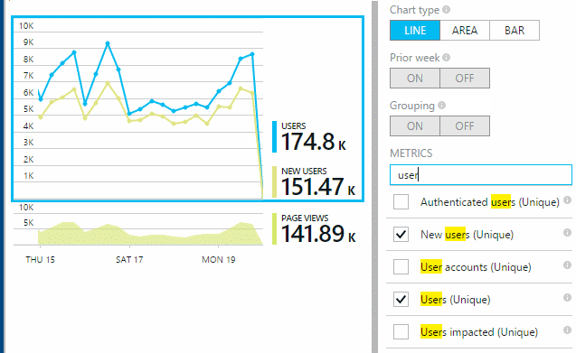

<properties 
    pageTitle="Der Verwendungsanalyse für Webanwendungen mit Anwendung Einsichten" 
    description="Übersicht über Nutzungsanalysen für Web-apps mit Anwendung Einsichten" 
    services="application-insights" 
    documentationCenter=""
    authors="alancameronwills" 
    manager="douge"/>

<tags 
    ms.service="application-insights" 
    ms.workload="tbd" 
    ms.tgt_pltfrm="ibiza" 
    ms.devlang="na" 
    ms.topic="article" 
    ms.date="06/12/2016" 
    ms.author="awills"/>
 
# <a name="usage-analysis-for-web-applications-with-application-insights"></a>Der Verwendungsanalyse für Webanwendungen mit Anwendung Einsichten

Wissen, wie Personen eine Anwendung verwenden, können Sie die Szenarien, die besonders wichtig sind Ihre Entwicklungsarbeit konzentrieren und gewinnen Sie Einsichten in die Ziele, die sie einfacher oder schwieriger zu erzielen finden. 

Visual Studio-Anwendung Einsichten bietet zwei Ebenen der Verwendung nachverfolgen:

* **Benutzer, die Sitzung und die Seite anzeigen von Daten** - einsatzbereiten.  
* **Benutzerdefinierte werden** – Sie [Schreiben von Code] [ api] Ihre Benutzer über Ihre app Benutzerfunktionalität zu verfolgen. 

## <a name="setting-up"></a>Einrichten von

Öffnen Sie eine Anwendung Einsichten Ressource im [Portal Azure](https://portal.azure.com), klicken Sie auf die leere Seite lädt Diagramm Browser, und führen Sie die Anweisungen zum einrichten.

[Weitere Informationen](app-insights-javascript.md) 


## <a name="how-popular-is-my-web-application"></a>Wie beliebte ist meine Webanwendung?

Melden Sie sich bei der [Azure-Portal][portal], navigieren Sie zu Ihrer Anwendungsressource, und klicken Sie auf Verwendung:


* **Benutzer:** Die Anzahl der distinct aktive Benutzer über den Zeitbereich des Diagramms. 
* **Sitzungen:** Die Anzahl der aktiven Sitzungen
* **Seitenansichten** Ermittelt die Anzahl von Aufrufen für trackPageView(), in der Regel einmal in jeder Webseite aufgerufen.

Klicken Sie auf den Diagrammtypen, um mehr Details anzuzeigen. Beachten Sie, dass Sie den Zeitbereich des die Diagramme ändern können.

### <a name="where-do-my-users-live"></a>Wo Leben meiner Benutzer?

Klicken Sie auf das Diagramm Benutzer, um mehr Details anzuzeigen, aus dem Blade Verwendung:


 
### <a name="what-browsers-or-operating-systems-do-they-use"></a>Welche Browser oder Betriebssysteme verwenden sie?

(Segment) Gruppendaten von einer Eigenschaft wie Browser, Betriebssystem oder Ort:


## <a name="sessions"></a>Sitzungen

Die Sitzung ist ein zentrales Konzept in Anwendung Einblicken, umso, jeder werden – wie Besprechungsanfragen, Seitenansichten, Ausnahmen, oder mehrere benutzerdefinierte Ereignisse Sie Code selbst - mit einer bestimmten Benutzer-Sitzung zugeordnet werden soll. 

Rich-Kontext Daten über jede Sitzung, z. B. Gerät Merkmale, Geo Speicherort, Betriebssystem usw. erfasst.

Wenn Sie Client und Server Instrumentieren ([ASP.NET] [ greenbrown] oder [J2EE][java]), die SDKs werden die Id für eine Sitzung zwischen Client und Server, verteilen, sodass Ereignisse beidseitiges Beziehung gesetzt werden können.

Beim [Diagnostizieren von Problemen][diagnostic], finden Sie alle werden, die im Zusammenhang mit der Sitzung in dem ein Problem aufgetreten ist, einschließlich aller Besprechungsanfragen und Ereignissen, Ausnahmen oder Spuren, die protokolliert wurden.

Sitzungen bieten als Maßstab für die Beliebtheit von Kontexten wie Gerät, das Betriebssystem oder Ort. Durch die Anzahl der Sitzungen gruppiert nach Gerät angezeigt wird, erhalten Sie beispielsweise genauere Anzahl der wie dieses Gerät-App, als häufig ausgeführt wird durch zählen der Seitenansichten. Dies ist eine Eingabe hilfreich, um von einem beliebigen Gerät-spezifische Problem Sichten.


#### <a name="whats-a-session"></a>Was ist eine Sitzung?

Eine Sitzung stellt einen einzelnen Kontakt zwischen dem Benutzer und der app. In ihrer einfachsten Form Sitzung beginnt mit einem Benutzer die app gestartet und endet, wenn der Benutzer die app lässt. Web apps beendet wird standardmäßig die Sitzung nach 30 Minuten oder nach einer Aktivität 24 Stunden. 

Sie können diese Standardeinstellungen ändern, indem Sie den Codeausschnitt bearbeiten:

    <script type="text/javascript">
        var appInsights= ... { ... }({
            instrumentationKey: "...",
            sessionRenewalMs: 3600000,
            sessionExpirationMs: 172800000
        });

* `sessionRenewalMs`: Die Zeit in Millisekunden an, die Sitzung aufgrund des Benutzers inaktiv abläuft. Standard: 30 Minuten.
* `sessionExpirationMs`: Die Sitzung maximale Länge in Millisekunden. Wenn der Benutzer nach Ablauf dieser Zeit aktiv bleibt, wird eine andere Sitzung gezählt. Standard: 24 Stunden.

**Dauer der Sitzung** ist eine [Metrik] [ metrics] , in der Zeitraum zwischen den vor- und Nachnamen werden Elemente der Sitzung aufgezeichnet. (Es wird nicht das Timeout einschließen.)

**Anzahl der Sitzung** in einem bestimmten Zeitintervall wird als die Anzahl der eindeutigen Sitzungen mit einigen Aktivität während dieses Intervalls definiert. Wenn Sie nach der letzten Woche in einem Bereich viel Zeit, wie z. B. tägliche Sitzung zählen suchen möchten, ist dies die Gesamtzahl der Sitzungen normalerweise entspricht. 

Allerdings werden, wenn Sie beispielsweise stündlich Körnung kürzere Zeiträume untersuchen, eine lange Sitzung, die mehrere Stunden dauern für jede Stunde berücksichtigt werden in denen die Sitzung aktiv war. 

## <a name="users-and-user-counts"></a>Benutzer und der Anzahl der Benutzer


Jeder Benutzer Sitzung ist eine eindeutige Benutzer-Id zugeordnet. 

Standardmäßig wird der Benutzer durch Platzieren eines Cookies identifiziert. Ein Benutzer, die mehrere Browser oder Geräte verwendet wird nur einmal gezählt. (Aber finden Sie unter [Authentifizierte Benutzer](#authenticated-users))


Die **Benutzeranzahl** Metrik in einem bestimmten Zeitintervall wird als die Anzahl der eindeutigen Benutzer mit aufgezeichneten Aktivität während dieses Intervalls definiert. Daher möglicherweise Benutzer mit langen Sitzungen mehrmals, berücksichtigt werden beim Festlegen eines Zeitraums, sodass die Körnung weniger als einer Stunde ist oder.

**Neue Benutzer** zählt die Benutzer, dessen ersten Sitzungen mit der app in diesem Intervall aufgetreten. Wenn die Standardmethode zum Zählen von Benutzern von Cookies verwendet wird, werden diese auch aufgenommen Benutzer, wer ihre Cookies deaktiviert haben, oder ein neues Gerät oder Browser, die zum Zugreifen auf Ihre app zum ersten Mal verwenden.


### <a name="authenticated-users"></a>Authentifizierte Benutzer

Web app anmelden Benutzer zulässt, können Sie genauere ermitteln können, indem Sie die Anwendung Einsichten mit einem eindeutigen Benutzer-ID. Sie müssen nicht ihren Namen oder dieselbe Id, die in der app verwendet, werden. Sobald die app den Benutzer identifiziert hat, verwenden Sie diesen Code ein:


*JavaScript-Client*

      appInsights.setAuthenticatedUserContext(userId);

Wenn Ihre app Benutzer in Konten gruppiert, können Sie auch einen Bezeichner für das Konto übergeben. 

      appInsights.setAuthenticatedUserContext(userId, accountId);

Benutzer- und Konto-Ids darf keine Leerzeichen oder die Zeichen enthalten.`,;=|`


Im [Explorer Kennzahlen](app-insights-metrics-explorer.md)können Sie ein Diagramm der **Authentifizierte Benutzer** und **Konten**erstellen. 

## <a name="synthetic-traffic"></a>Synthetische Datenverkehr

Synthetische Verkehr umfasst Anfragen Verfügbarkeit und beim Laden überprüft, Search Engine Suchmaschinen und andere Agents. 

Anwendung Einsichten versucht ist bemüht, automatisch ermitteln und klassifizieren synthetische Datenverkehr und entsprechend zu kennzeichnen. In den meisten Fällen wird synthetische Datenverkehr keine das SDK JavaScript aufgerufen, sodass die Benutzer und Sitzung zählen diese Aktivität ausgeschlossen ist. 

Jedoch für die Anwendung Einsichten [Webtests][availability], die Benutzer-Id wird automatisch auf der Basis POP-Speicherort und Id für eine Sitzung auf Testlauf-Id Basis festgelegt ist. Unter Berichte synthetische Datenverkehr standardmäßig gefiltert wird die diese Benutzer und Sitzungen ausgeschlossen werden. Wenn synthetische Datenverkehr enthalten ist, kann dies vergrößert sich die Gesamtzahl der Benutzer und zählt Sitzung führen.
 
## <a name="page-usage"></a>Verwendung der Seite

Klicken Sie auf, bis Seite Ansichten Diagramm, um eine weitere verkleinert Add-in Version zusammen mit einer der am häufigsten verwendeten Seiten Projektstrukturplan-Codes zu erhalten:


 
Im oben genannten Beispiel befindet sich in einer Spiele-Website. Es können wir sofort angezeigt werden:

* Verwendung noch nicht in der letzten Woche verbessert. Vielleicht sollten wir suchmaschinenoptimierung anzustellen?
* Viele weniger Personen finden Sie unter Spiele Seiten als der Homepage. Warum wird nicht unsere Startseite Personen spielen aufmerksam zu machen?
* 'Kreuzworträtseln' ist die am häufigsten verwendeten Spiel. Wir sollten Priorität auf neue Ideen und es Verbesserungen gewähren.

## <a name="custom-tracking"></a>Benutzerdefinierte Verlauf

Angenommen, statt jedes Spiel in einer separaten Webseite zu implementieren, doch Sie können alle in der gleichen einseitige-app für die meisten Funktionen codierten als JavaScript-Code in die Webseite zu gestalten. Dies kann der Benutzer schnell zwischen ein Spiel und einen anderen wechseln oder sogar mehrere Spiele auf einer Seite haben. 

Und möchten Sie noch Anwendung Einsichten zu melden Sie sich an, wie oft jedes Spiel auf genau die gleiche Weise wie geöffnet wird, wenn sie auf separaten Webseiten waren. Das ist ganz einfach: Legen Sie einen Anruf an das Modul werden nur in Ihrer JavaScript, für den Datensatz, der eine neue Seite geöffnet hat möchten:

    appInsights.trackPageView(game.Name);

## <a name="custom-events"></a>Benutzerdefinierte Ereignisse

Schreiben Sie benutzerdefinierte werden, um bestimmte Ereignisse protokollieren. Besonders in einer app einseitige möchten Sie wissen, wie oft der Benutzer werden bestimmte Ziele erreicht oder bestimmte Aktionen ausgeführt wird: 

    appInsights.trackEvent("GameEnd");

Wenn Sie beispielsweise einen Link melden:

    <a href="target.htm" onclick="appInsights.trackEvent('linkClick');return true;">my link</a>


## <a name="view-counts-of-custom-events"></a>Anzeigen von benutzerdefinierten Ereignissen zählt

Öffnen Sie Kennzahlen Explorer, und fügen Sie ein Diagramm, um Ereignisse anzuzeigen. Segmentieren Sie nach Namen:


## <a name="drill-into-specific-events"></a>Detailliert auswerten bestimmte Ereignisse

Um besser zu verstehen, wie eine normale Sitzung geht zu erhalten, sollten Sie auf eine bestimmte Benutzer Sitzung konzentrieren, die einen bestimmten Typ von Ereignis enthält. 

In diesem Beispiel codierten wir ein benutzerdefiniertes Ereignis "NoGame", die bei der Anmeldung des Benutzers ohne tatsächlich ein Spiel starten aufgerufen wird. Warum sollte ein Benutzer erledigen? Wenn wir einen Drilldown in einige bestimmten Vorkommen durchführen, erhalten wir vielleicht einen Hinweis können. 

Die benutzerdefinierten Ereignisse in der app empfangen werden anhand des Namens auf das Blade Übersicht aufgelistet:


 
Klicken Sie auf, bis das Ereignis relevante, und wählen Sie ein bestimmtes aktuelle vorkommen:


 
Sehen wir uns die alle werden für die Sitzung in der dieses Ereignis NoGame aufgetreten ist. 


 
Es wurden keine Ausnahmen, damit der Benutzer daran gehindert wurde nicht, indem einige Fehler bei der Wiedergabe.
 
Wir können alle Arten von werden mit Ausnahme der Seitenansichten für diese Sitzung herausfiltern:


 
Und jetzt können wir sehen, dass diese Benutzer angemeldet, einfach, um die neuesten Ergebnisse zu überprüfen. Vielleicht sollten wir die Entwicklung von eines Textabschnitts, der erledigen erleichtert. (Und wir sollten ein benutzerdefiniertes Ereignis Bericht tritt dieses bestimmten Geschichte implementieren.)

## <a name="filter-search-and-segment-your-data-with-properties"></a>Filtern, suchen und Segmentieren von Daten mit Eigenschaften
Sie können beliebige Tags und numerische Werte an Ereignisse anfügen.
 

*JavaScript-Client*

```JavaScript

    appInsights.trackEvent("WinGame",
        // String properties:
        {Game: currentGame.name, Difficulty: currentGame.difficulty},
        // Numeric measurements:
        {Score: currentGame.score, Opponents: currentGame.opponentCount}
    );
```

*C#-Servers*

```C#

    // Set up some properties:
    var properties = new Dictionary <string, string> 
        {{"game", currentGame.Name}, {"difficulty", currentGame.Difficulty}};
    var measurements = new Dictionary <string, double>
        {{"Score", currentGame.Score}, {"Opponents", currentGame.OpponentCount}};

    // Send the event:
    telemetry.TrackEvent("WinGame", properties, measurements);
```

*VB am server*

```VB

    ' Set up some properties:
    Dim properties = New Dictionary (Of String, String)
    properties.Add("game", currentGame.Name)
    properties.Add("difficulty", currentGame.Difficulty)

    Dim measurements = New Dictionary (Of String, Double)
    measurements.Add("Score", currentGame.Score)
    measurements.Add("Opponents", currentGame.OpponentCount)

    ' Send the event:
    telemetry.TrackEvent("WinGame", properties, measurements)
```

Fügen Sie Eigenschaften auf die gleiche Weise wie auf der Seitenansichten an:

*JavaScript-Client*

```JS

    appInsights.trackPageView("Win", 
        url,
        {Game: currentGame.Name}, 
        {Score: currentGame.Score});
```

Diagnose suchen zeigen Sie die Eigenschaften an, indem Sie durch eine einzelne Eintreten eines Ereignisses auf.


 
Verwenden Sie das Suchfeld ein, um Ereignis Vorkommen mit einem bestimmten Eigenschaftswert anzuzeigen.


## <a name="a--b-testing"></a>A | B testen

Wenn Sie nicht wissen, welche Variante des ein Feature mehr hergestellt werden kann, lassen Sie beide zu ausführenden jedes können andere Benutzer. Den Erfolg der einzelnen messen, und klicken Sie dann auf eine einheitliche Version verschieben.

Für dieses Verfahren ordnen Sie distinct Kategorien, für alle werden, die von den einzelnen Versionen der app gesendet wird. Sie können das erreichen, indem Sie Eigenschaften in der aktiven TelemetryContext definieren. Diese Standardeigenschaften werden auf alle werden Nachrichten, die von der Anwendung gesendet – nicht nur Ihre benutzerdefinierten Nachrichten, aber auch die Standardansicht werden hinzugefügt. 

Im Portal Anwendung Einblicken, dann können zwar zu filtern und gruppieren (Segment) Ihre Daten auf der Kategorien, weitere verschiedene Versionen vergleichen.

*C#-Servers*

```C#

    using Microsoft.ApplicationInsights.DataContracts;

    var context = new TelemetryContext();
    context.Properties["Game"] = currentGame.Name;
    var telemetry = new TelemetryClient(context);
    // Now all telemetry will automatically be sent with the context property:
    telemetry.TrackEvent("WinGame");
```

*VB am server*

```VB

    Dim context = New TelemetryContext
    context.Properties("Game") = currentGame.Name
    Dim telemetry = New TelemetryClient(context)
    ' Now all telemetry will automatically be sent with the context property:
    telemetry.TrackEvent("WinGame")
```

Einzelne werden kann die Standardwerte außer Kraft setzen.

Sie können eine universal Initialisierung einrichten, dass alle neuen TelemetryClients automatisch Kontext verwenden.

```C#


    // Telemetry initializer class
    public class MyTelemetryInitializer : ITelemetryInitializer
    {
        public void Initialize (ITelemetry telemetry)
        {
            telemetry.Properties["AppVersion"] = "v2.1";
        }
    }
```

In der app-Initialisierung wie Global.asax.cs:

```C#

    protected void Application_Start()
    {
        // ...
        TelemetryConfiguration.Active.TelemetryInitializers
        .Add(new MyTelemetryInitializer());
    }
```


## <a name="build---measure---learn"></a>Generator - Measure - Informationen

Wenn Sie Analytics verwenden, wird es sich um einen integrierten Teil Ihres Entwicklungszyklus – nicht nur eines Beitrags Meinung Pfeile zum Lösen von Problemen. Hier sind einige Tipps:

* Ermitteln Sie die Taste Metrik Ihrer Anwendung. Möchten Sie so viele Benutzer wie möglich, oder möchten Sie lieber eine kleine Gruppe von Benutzern sehr zufrieden? Möchten Sie besuchen oder Sales maximieren?
* Planen Sie für jeden Textabschnitt messen. Wenn Sie einen neuen Benutzertextabschnitt skizzieren oder Feature oder Plan aktualisieren eine vorhandenen immer überlegen Sie, wie Sie den Erfolg der Änderung messen werden. Vor dem Codieren gestartet wird, bitten Sie "welche Auswirkung dies auf unsere Kennzahlen, hat, wenn er immer funktioniert? Sollten wir alle neuen Ereignisse nachverfolgen?"
Und natürlich, wenn das Feature live ist, stellen Sie sicher, Sie sehen Sie sich die Analytics und wirken sich auf die Ergebnisse. 
* Die wichtigsten Metrik betreffen Sie anderer Größen. Beispielsweise, wenn Sie ein Feature "Favoriten" hinzufügen, Sie möchten wissen, wie oft "Favoriten" Hinzufügen von Benutzern. Aber es sieht vielleicht interessant zu wissen, wie oft sie wieder zu ihren Favoriten stammen. Und der wichtigste Benutzer von Favoriten schließlich kaufe Weitere Ihres Produkts?
* Kanarischen testen. Richten Sie ein Feature wechseln, die Ihnen ermöglicht, ein neues Feature nur für einige Benutzer sichtbar zu machen. Verwenden Sie Anwendung Einblicken, um festzustellen, ob das neue Feature verarbeitet verwendet wird, die Sie beabsichtigten. Nehmen Sie Anpassungen vor, und klicken Sie dann einem breiteren Publikum freigegeben Sie werden soll.
* Sprechen Sie Ihren Benutzern! Analytics reicht nicht eigenständig, aber Komplement zur Verwaltung der einer gute Kunden Beziehung.


## <a name="references"></a>Verweise

* [Mithilfe der API - Übersicht][api]
* [JavaScript-API-Referenz](https://github.com/Microsoft/ApplicationInsights-JS/blob/master/API-reference.md)

## <a name="video"></a>Video

> [AZURE.VIDEO usage-monitoring-application-insights]


<!--Link references-->

[api]: app-insights-api-custom-events-metrics.md
[availability]: app-insights-monitor-web-app-availability.md
[client]: app-insights-javascript.md
[diagnostic]: app-insights-diagnostic-search.md
[greenbrown]: app-insights-asp-net.md
[java]: app-insights-java-get-started.md
[metrics]: app-insights-metrics-explorer.md
[portal]: http://portal.azure.com/
[windows]: app-insights-windows-get-started.md

 
