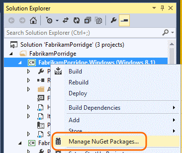
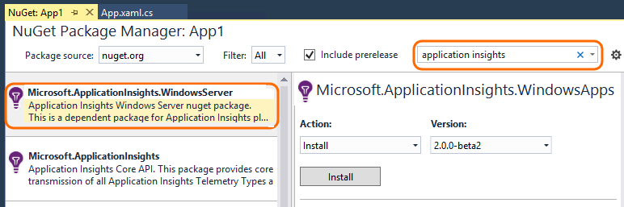
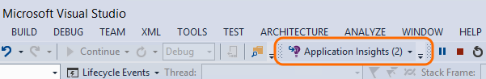
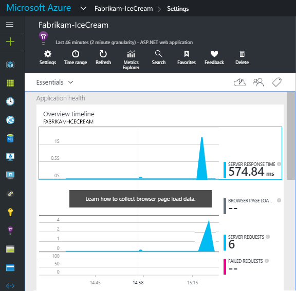
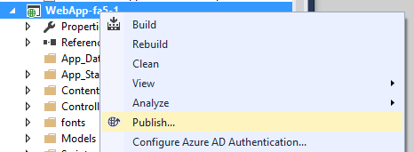

<properties
    pageTitle="Einsichten für Windows Anwendungsdienste und Worker-Rollen | Microsoft Azure"
    description="Manuell hinzufügen der Anwendung Einsichten SDK an Ihrer Anwendung ASP.NET Verwendung, Verfügbarkeit und Leistung zu analysieren."
    services="application-insights"
    documentationCenter=".net"
    authors="alancameronwills"
    manager="douge"/>

<tags
    ms.service="application-insights"
    ms.workload="tbd"
    ms.tgt_pltfrm="ibiza"
    ms.devlang="na"
    ms.topic="get-started-article"
    ms.date="08/30/2016"
    ms.author="awills"/>

# Manuelles Konfigurieren von Anwendung Einsichten für Applikationen ASP.NET 4

*Anwendung Einsichten ist in der Vorschau.*

[AZURE.INCLUDE [app-insights-selector-get-started](../../includes/app-insights-selector-get-started.md)]

Sie können [Visual Studio Anwendung Einsichten](app-insights-overview.md) zum Überwachen der Windows-Dienste, Worker-Rollen und anderen ASP.NET Applications manuell konfigurieren. Bei Web apps beträgt manuelle Konfiguration eine Alternative zum die [automatische Einrichtung](app-insights-asp-net.md) von Visual Studio angeboten.

Anwendung Einsichten hilft Ihnen, Probleme und Überwachen der Leistung und die Verwendung in Ihrer Anwendung live diagnostizieren.

#### Bevor Sie beginnen

Du brauchst:

* Ein [Microsoft Azure](http://azure.com)-Abonnement. Wenn Ihr Team oder der Organisation ein Azure-Abonnement verfügt, kann der Besitzer Sie hinzufügen, mit Ihrem [Microsoft-Konto](http://live.com).
* Visual Studio 2013 oder höher.

## 1. erstellen Sie 1. eine Anwendung Einsichten Ressource

Melden Sie sich bei der [Azure-Portal](https://portal.azure.com/), und erstellen Sie eine neue Anwendung Einsichten Ressource. Wählen Sie als den Anwendungstyp ASP.NET aus.

Eine [Ressource](app-insights-resources-roles-access-control.md) in Azure ist eine Instanz eines Diensts. Diese Ressource ist, werden aus der app analysiert und zur Verfügung gestellt werden.

Die Wahl der Anwendungstyp legt den Standardinhalt der Ressource Blades und die Eigenschaften in Windows [Explorer Kennzahlen](app-insights-metrics-explorer.md).

#### Kopieren Sie die Taste Instrumentation

Die Taste identifiziert die Ressource aus, und installieren Sie es bald im SDK von Daten, die der Ressource direkte.

Die Schritte, die Sie soeben vorgenommen haben, um eine neue Ressource erstellen sind eine gute Möglichkeit, Überwachung eine Anwendung zu starten. Jetzt können Sie die Daten zu senden.

## 2. installieren Sie das SDK in Ihrer Anwendung

Installieren und Konfigurieren der Anwendung Einsichten SDK abhängig von der Plattform, an denen, der Sie arbeiten. Für ASP.NET apps ganz einfach.

1. Bearbeiten Sie in Visual Studio NuGet Pakete des Web-app-Projekt aus.

    

2. Installieren von Anwendung Einsichten SDK für Web Apps.

    

    *Kann ich andere Pakete verwenden?*

    Ja. Wählen Sie die Core-API (Microsoft.ApplicationInsights), wenn Sie nur die API verwenden, um eigene werden senden möchten. Das Windows Server-Paket enthält automatisch die Core-API sowie eine Anzahl von anderen Paketen wie Leistung Zähler Websitesammlung und Abhängigkeit für die Überwachung. 

#### Upgrade auf zukünftige SDK-Versionen

Von Zeit zu Zeit veröffentlichen wir eine neue Version des SDK.

Öffnen Sie zum Aktualisieren auf eine [neue Version des SDK](https://github.com/Microsoft/ApplicationInsights-dotnet-server/releases/)NuGet-Paket-Manager erneut und Filtern auf installierten Pakete. Wählen Sie **Microsoft.ApplicationInsights.Web** aus, und wählen Sie die **zu aktualisieren**.

Wenn Sie alle Anpassungen ApplicationInsights.config haben, speichern Sie eine Kopie der vor dem upgrade, und anschließend die Änderungen in die neue Version zusammenführen.

## 3 senden Sie 3 Ihren werden

**Wenn Sie nur das Core API-Paket installiert haben:**

* Legen Sie die Taste Instrumentation Code, z. B. `main()`: 

    `TelemetryConfiguration.Active.InstrumentationKey = "`*der Schlüssel*`";` 

* [Schreiben Sie Ihre eigenen werden mithilfe der-API](app-insights-api-custom-events-metrics.md#ikey).

**Wenn Sie andere Pakete Einsichten Anwendung installiert haben** , können Sie auf Wunsch, verwenden Sie die config-Datei für die Instrumentation festlegen:

* ApplicationInsights.config bearbeiten (hinzugefügt wurde, die durch die NuGet-Installation). Fügen Sie unmittelbar vor dem schließenden Tag folgt ein:

    `<InstrumentationKey>`*die Instrumentation-Taste, die Sie kopiert haben.*`</InstrumentationKey>`

* Stellen Sie sicher, dass die Eigenschaften des ApplicationInsights.config in Lösung Explorer festgelegt sind **Build Action = Inhalte Copy to Output Directory = kopieren**.

## Führen Sie Ihr Projekt

Verwenden Sie die **F5** , führen Sie die Anwendung, und probieren es aus: Öffnen von anderen Seiten, um einige werden generieren.

In Visual Studio sehen Sie die Anzahl der Ereignisse aus, die gesendet wurden.

## Zeigen Sie Ihrer werden an

Kehren Sie zu der [Azure-Portal](https://portal.azure.com/) zurück, und navigieren Sie zu Ihrer Anwendung Einsichten Ressource.

Suchen Sie nach Daten in der Übersicht Diagramme. Zuerst sehen Sie nur eine oder zwei Punkten. Beispiel:

Klicken Sie auf, bis alle Diagramm ausführlichere Metrik finden Sie unter. [Weitere Informationen zu Kennzahlen.](app-insights-web-monitor-performance.md)

#### Keine Daten?

* Verwenden Sie die Anwendung, die andere Seiten öffnen, damit es einige werden generiert.
* Öffnen Sie die Kachel " [Suchen](app-insights-diagnostic-search.md) ", um einzelne Ereignisse anzuzeigen. Unter Umständen dauert es Ereignisse etwas während Sie mehr über die Kennzahlen Verkaufspipeline anzuzeigen.
* Warten Sie einige Sekunden, und klicken Sie auf **Aktualisieren**. Diagramme selbst regelmäßig aktualisieren, aber Sie können manuell aktualisieren, wenn Sie für einige Daten warten angezeigt.
* Lesen Sie [Problembehandlung](app-insights-troubleshoot-faq.md).

## Veröffentlichen Sie Ihre app

Jetzt die Anwendung auf dem Server oder auf Azure bereitstellen, und schauen Sie sich die Daten zu sammeln.

Wenn Sie im Debuggen-Modus ausführen, ist werden durch die Verkaufspipeline geliefert, damit Sie innerhalb von Sekunden angezeigte Daten erhalten sollen. Wenn Sie die app im Release-Konfiguration bereitstellen, addiert alle Daten langsamer ein.

#### Keine Daten nach dem Veröffentlichen auf dem Server?

Öffnen Sie diese Ports für ausgehenden Datenverkehr in des Servers firewall

+ `dc.services.visualstudio.com:443`
+ `f5.services.visualstudio.com:443`

#### Probleme auf dem Server erstellen?

Finden Sie [dieses Element Problembehandlung](app-insights-asp-net-troubleshoot-no-data.md#NuGetBuild).

> [AZURE.NOTE]Wenn Ihre app werden viele generiert (und dabei die ASP.NET SDK Version 2.0.0-beta3 oder höher), das Modul adaptive werden wird automatisch verringern die Lautstärke, die mit dem Portal per nur einen Vertreter Bruch von Ereignissen gesendet wird. Jedoch Ereignisse, die mit der gleichen Anforderung zusammenhängen werden aktivieren oder deaktivieren als Gruppe, damit Sie zwischen verwandten Ereignisse navigieren können. 
> Sie [erhalten grundlegende Informationen zu werden](app-insights-sampling.md).

## Nächste Schritte

* [Weitere telemetrieprotokoll hinzufügen](app-insights-asp-net-more.md) , um die Ansicht 360-Grad der Anwendung abzurufen.

