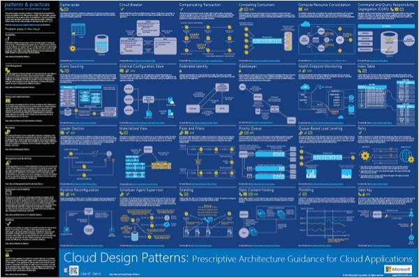
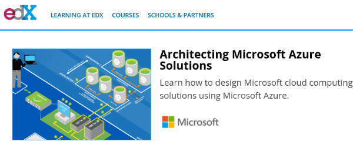
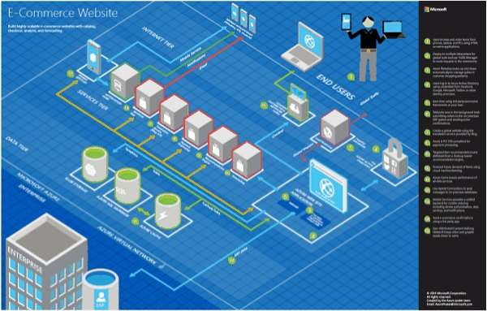
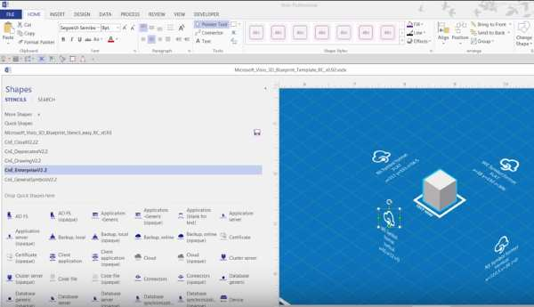
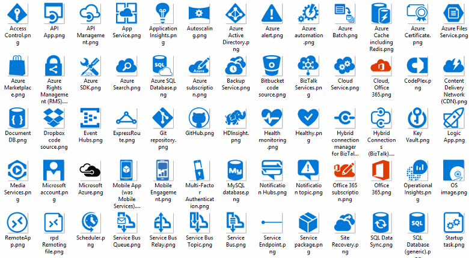
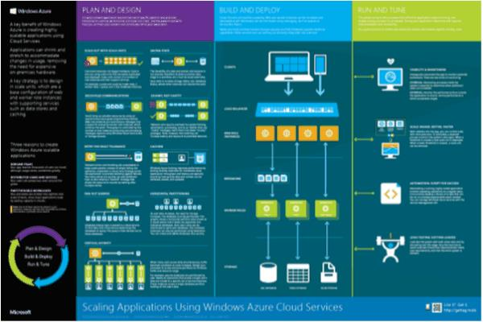

<properties 
    pageTitle="Anwendungsarchitektur auf Microsoft Azure | Microsoft Azure" 
    description="Übersicht über die Architektur, die allgemeine entwurfmustern behandelt." 
    services="" 
    documentationCenter="" 
    authors="Rboucher" 
    manager="jwhit" 
    editor="mattshel"/>

<tags 
    ms.service="multiple" 
    ms.workload="na" 
    ms.tgt_pltfrm="na" 
    ms.devlang="na" 
    ms.topic="article" 
    ms.date="09/13/2016" 
    ms.author="robb"/>

#Klicken Sie auf Microsoft Azure Architektur der Anwendung
Ressourcen zum Erstellen von Clientanwendungen, die Microsoft Azure verwenden. Dies umfasst Tools, damit Sie die Diagramme zeichnen, um die Softwaresysteme visuell zu beschreiben. 

##Entwurf Mustern poster

Microsoft- Leitfaden veröffentlicht im Adressbuch [Cloud Entwurfmustern](http://msdn.microsoft.com/library/dn568099.aspx) das sowohl auf MSDN und PDF-Download erhältlich ist. Es gibt auch ein großes Format Poster verfügbar der alle Muster aufgeführt sind. 

##Microsoft-Architektur Zertifizierungskurs

Microsoft erstellt einen Architektur Kurs unterstützen von Microsoft-Zertifizierung Prüfung 70-534. Es ist [auf EDX.ORG kostenlos zur Verfügung](https://www.edx.org/course/architecting-microsoft-azure-solutions-microsoft-dev205x).  Es verwendet die [3D Entwurf Visio-Vorlage](#3d-blueprint-visio-template). 

##Microsoft-Lösungen

Microsoft veröffentlicht eine Reihe von hoher Ebene [Lösungsarchitekturen](http://aka.ms/azblueprints) gezeigt wird, wie bestimmte Dokumenttypen Systeme mithilfe von Microsoft-Produkten zu erstellen. 

In früheren Versionen veröffentlicht Microsoft eine Reihe von Entwürfen mit Beispiel Architekturen. Die durch die Lösungsarchitekturen zuvor erwähnt ersetzt wurden und der Entwurf Link zu verknüpft umgeleitet wurde. Wenn Sie Zugriff auf die vorherige Entwürfen Materialien aus irgendeinem Grund benötigen, e-Mail- [CnESymbols@microsoft.com](mailto:CnESymbols@microsoft.com) mit Anforderung.   

Die Pläne und Lösung Architekturen Diagramme verwenden Teile der [Cloud und Enterprise-Symbolsatz](#Drawing-symbol-and-icon-sets)aus.   

##3D-Entwurf Visio-Vorlage

3D-Versionen die nun nicht mehr [Microsoft Architektur Entwürfen](http://aka.ms/azblueprints) wurden zunächst in ein nicht-Microsoft-Tool erstellt. Visio-Vorlage (und höhere) 2013 im Lieferumfang auf 5 Aug 2015 als Teil eines [Microsoft-Architektur Zertifizierung Schulungskurs auf EDX.ORG verteilt](#microsoft-architecture-certification-course).

Die Vorlage steht auch außerhalb des Kurses. 

- [Anzeigen der Ausbildung video](http://aka.ms/3dBlueprintTemplateVideo) ersten, damit Sie wissen, was sie tun kann   
- Herunterladen der [Microsoft 3d Entwurf Visio-Vorlage](http://aka.ms/3DBlueprintTemplate)
- Herunterladen der [Cloud und Enterprise Symbole](#drawing-symbol-and-icon-sets) zur Verwendung mit 3D-Vorlage. 

Per e-Mail senden Sie uns [CnESymbols@microsoft.com](mailto:CnESymbols@microsoft.com) für bestimmte Fragen nicht beantwortet haben, indem Sie die-Schulungsunterlagen oder um Feedback anzuzeigen. Die Vorlage ist nicht mehr in der aktiven Entwicklung, aber es immer noch nützlich und relevant ist, da es verwenden kann, eine PNG- oder die [Cloud und Enterprise-Symbolen](#drawing-symbol-and-icon-sets), die aktualisiert werden.  

##Symbol und Symbol legt Zeichnung 

[Zeigen Sie die Visio und Symbole Schulung Video](http://aka.ms/CnESymbolsVideo) und dann auf [Herunterladen der Cloud und Enterprise-Symbolsatz](http://aka.ms/CnESymbols) verwaltenden technische Materialien, die beschreiben Azure, Windows Server, SQL Server und mehr. Verwenden Sie die Symbole in Diagramme zur Unternehmensarchitektur,-Schulungsunterlagen, Präsentationen, Datenblätter, Infographics, Whitepapers und sogar 3rd Party Bücher, wenn das Adressbuch Personen mit Microsoft-Produkten Schulung. Jedoch werden nicht für die Verwendung in Benutzeroberflächen auffällt.

Die Symbole CnE sind in Visio, SVG und PNG-Format. Weitere Informationen dazu, wie auf einfache Weise verwenden verwenden Sie die Symbole in PowerPoint in der Gruppe enthalten sind. 

Im Symbolsatz wird vierteljährlich ausgeliefert und wird aktualisiert, sobald neue Dienste freigegeben werden. 

Weitere Symbole für Microsoft Office und verwandte Technologien stehen in der [Microsoft Office Visio-Schablone](http://www.microsoft.com/en-us/download/details.aspx?id=35772), obwohl sie nicht für Architektur Diagramme, wie die Menge CnE optimiert werden.   

**Feedback:** Wenn Sie die Symbole CnE verwendet haben, füllen Sie die kurzen 5 Frage [Umfrage](http://aka.ms/azuresymbolssurveyv2) oder uns eine e-Mail an [CnESymbols@microsoft.com](mailto:CnESymbols@microsoft.com) für bestimmte Fragen und Probleme. Wir möchten Meinung einschließlich positive Feedback, damit wir wissen, dass weiterhin Zeit in diese investieren. 

##Architektur Infographics

Microsoft veröffentlicht mehrere Architektur Zusammenhang Poster/Infographics. Sie umfassen [Gebäude praktisches Cloud Applikationen](https://azure.microsoft.com/documentation/infographics/building-real-world-cloud-apps/) und [Skalierung mit Cloud-Diensten](https://azure.microsoft.com/documentation/infographics/cloud-services/) . 

