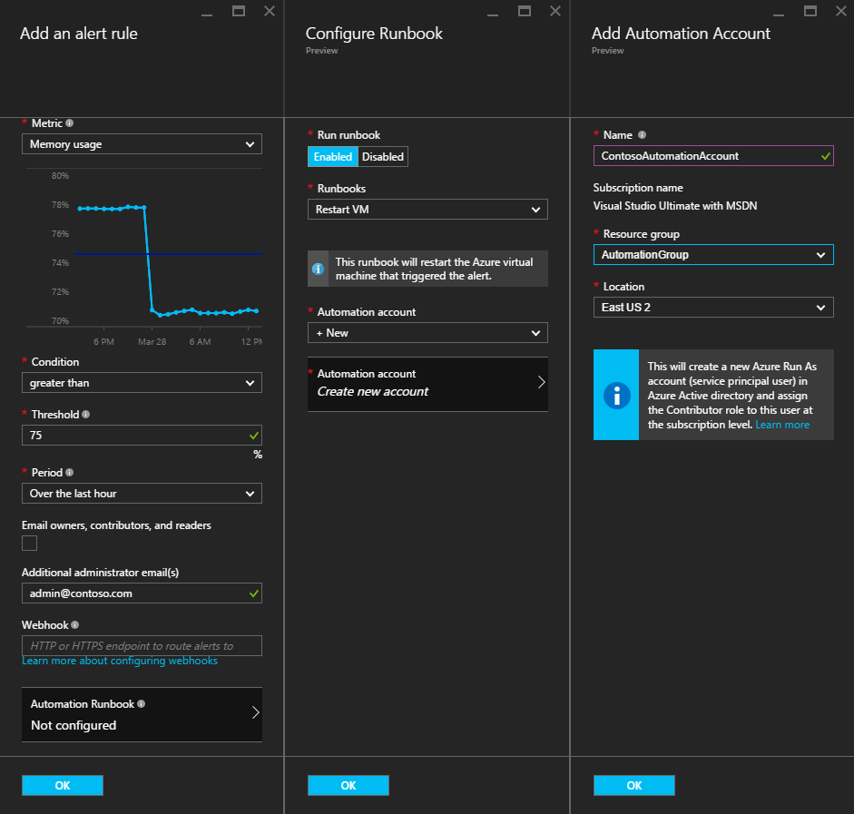
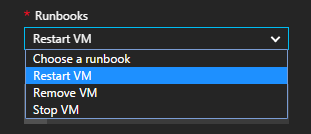
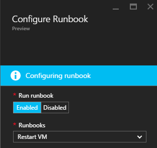
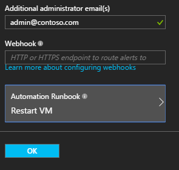

<properties
    pageTitle=" Behebung von Azure-virtuellen Computer Benachrichtigungen mit Automatisierung Runbooks | Microsoft Azure"
    description="In diesem Artikel wird veranschaulicht, wie integrieren Azure-virtuellen Computern Benachrichtigungen Azure Automatisierung Runbooks und automatisch beheben von Problemen"
    services="automation"
    documentationCenter=""
    authors="mgoedtel"
    manager="jwhit"
    editor="tysonn" />    
<tags
    ms.service="automation"
    ms.devlang="na"
    ms.topic="article"
    ms.tgt_pltfrm="na"
    ms.workload="infrastructure-services"
    ms.date="06/14/2016"
    ms.author="csand;magoedte" />

# <a name="azure-automation-scenario---remediate-azure-vm-alerts"></a>Azure Automatisierung Szenario - Behebung Azure-virtuellen Computer Benachrichtigungen

Azure Automatisierung und Azure-virtuellen Computern freigegeben haben ein neues Feature ermöglicht es Ihnen, Konfigurieren von Benachrichtigungen virtueller virtuellen Computern (Computer), um Automatisierung Runbooks auszuführen. Dieser neuen Funktion können Sie standard Behebung automatisch als Antwort auf virtuellen Computer Benachrichtigungen, wie neu starten oder beenden den virtuellen Computer ausführen.

In früheren Versionen konnten während der Erstellung von virtuellen Computer benachrichtigen Regel Sie zu einer Runbooks [Angeben einer Automatisierung Webhook](https://azure.microsoft.com/blog/using-azure-automation-to-take-actions-on-azure-alerts/) um des Runbooks ausgeführt werden, wenn die Benachrichtigung ausgelöst wurde. Allerdings muss dies Sie zum Erstellen des Runbooks, erstellen die Webhook für des Runbooks, und klicken Sie dann kopieren und Einfügen der Webhook während der Erstellung der Regel Arbeit erledigen. Mit dieser neuen Version ist der Prozess viel einfacher, da Sie eine Runbooks direkt aus einer Liste, während der Erstellung der Regel auswählen können, und Sie können ein Automatisierung Konto Ausführen des Runbooks wird, oder erstellen Sie einfach ein Konto auswählen.

In diesem Artikel werden wir Sie anzeigen, wie einfach es ist, eine Warnung Azure-virtuellen Computer einrichten und Konfigurieren einer Automatisierung Runbooks nach jedem der Warnung ausgeführt werden. Beispielszenarien gehören Neustarten eines virtuellen Computers aus, wenn die arbeitsspeicherauslastung einige überschreitet aufgrund einer Anwendung des virtuellen Computers mit Speicher freigegeben, oder ein virtuellen Computers beendet, wenn der Benutzer CPU-Zeit für vergangenen Stunde weniger als 1 % wurde und nicht verwendet wird. Wie die automatische Erstellung von einem Dienst in Ihrem Konto Automatisierung Hauptbenutzer für die Verwendung von Runbooks in Azure benachrichtigen Behebung vereinfacht wird auch erläutert.

## <a name="create-an-alert-on-a-vm"></a>Erstellen einer Benachrichtigung eines virtuellen Computers

Führen Sie die folgenden Schritte aus, um eine Benachrichtigung, um eine Runbooks starten, wenn dessen Schwellenwert erfüllt ist zu konfigurieren.

>[AZURE.NOTE] In dieser Version unterstützen wir nur Version 2-virtuellen Computern und Support für Classic, die virtuellen Computern bald hinzugefügt werden.  

1. Melden Sie sich bei der Azure-Portal an, und klicken Sie auf **virtuellen Computern**.  
2. Wählen Sie eine Ihrer virtuellen Maschinen.  Das virtuellen Computern Dashboard Blade wird angezeigt und die **Einstellungen** Blade rechts daneben.  
3. Wählen Sie aus dem Blade **Einstellungen** unter Abschnitt Überwachung **Warnungsregeln**aus.
4. Klicken Sie auf das Blade **Warnungsregeln** auf **Benachrichtigung hinzufügen**.

Daraufhin wird von das **Hinzufügen einer Regel** Blade, wo Sie die Bedingungen für die Benachrichtigung konfigurieren und zwischen eine oder alle der folgenden Optionen auswählen können: e-Mail an eine Person senden, verwenden Sie eine Webhook, um die Benachrichtigung an ein anderes System weiterleiten und/oder Ausführen einer Automatisierung Runbooks Antwort Versuch, um das Problem zu beheben.

## <a name="configure-a-runbook"></a>Konfigurieren eines Runbooks

Wählen Sie zum Konfigurieren einer Runbooks zur Ausführung beim der Schwellenwert für den virtuellen Computer benachrichtigen erfüllt ist **Automatisierung Runbooks**aus. In das Blade **Runbooks konfigurieren** können Sie die Runbooks ausführen und das Konto Automatisierung des Runbooks für die Profildatenbank auswählen.



>[AZURE.NOTE] In dieser Version können Sie aus drei Runbooks, der der Dienst bietet – neu starten virtueller Computer, beenden virtueller Computer oder Entfernen virtueller Computer auswählen (löschen).  Die Möglichkeit zum Auswählen von anderen Runbooks oder eine eigene Runbooks in zukünftigen Versionen zur Verfügung.



Nachdem Sie eine der drei verfügbaren Runbooks ausgewählt haben, wird die **Automatisierung Konto** Dropdown-Liste angezeigt wird, und Sie können auswählen, eine Automatisierung-Konto, des Runbooks ausgeführt wird. Runbooks müssen im Kontext eines [Automatisierung Konto](automation-security-overview.md) ausgeführt werden, die in Ihrem Abonnement Azure ist. Sie können ein Konto Automatisierung auswählen, dass Sie bereits erstellt haben, oder Sie können ein neues Automatisierung-Konto für Sie erstellt haben.

Die Runbooks, die bereitgestellt werden authentifizieren sich mit einem Dienst Tilgungsanteile Azure. Wenn Sie zum Ausführen des Runbooks in einem Ihrer vorhandenen Automatisierung Konten auswählen, erstellt wir den Dienst wichtigsten für Sie automatisch. Wenn Sie zum Erstellen eines neuen Kontos mit Automatisierung auswählen, dann erstellt wir das Konto sowie die Tilgungsanteile Dienst automatisch. In beiden Fällen werden zwei Anlagen auch in das Konto Automatisierung – ein Zertifikat Objekt mit dem Namen **AzureRunAsCertificate** und eine Verbindung Objekt mit dem Namen **AzureRunAsConnection**erstellt werden. Die Runbooks werden **AzureRunAsConnection** verwenden, um mit Azure authentifizieren, um die Aktion Management gegen den virtuellen Computer ausführen zu können.

>[AZURE.NOTE] Die Tilgungsanteile Service wird in den Bereich Abonnement erstellt und der Teilnehmerrolle zugeordnet ist. Diese Rolle ist für das Konto verfügen über die Berechtigung zum Ausführen von Automatisierung Runbooks zum Verwalten von Azure-virtuellen Computern erforderlich.  Die Erstellung von Automaton Firma und/oder Service Hauptbenutzer ist ein einmaliges Ereignis. Nachdem sie erstellt wurden, können Sie dieses Konto verwenden, Runbooks für andere Alarme Azure-virtuellen Computer ausführen.

Wenn Sie auf **OK** geklickt wird die Benachrichtigung konfiguriert ist und wenn Sie die Option zum Erstellen eines neuen Kontos mit Automatisierung ausgewählt haben, erstellt wird zusammen mit dem Dienst Hauptbenutzer.  Dies kann einige Sekunden dauern.  



Nach Abschluss die Konfiguration sehen Sie den Namen des Runbooks das **Hinzufügen einer Regel** Blade angezeigt werden.



Klicken Sie auf **OK** in das **Hinzufügen eine Regel** Blade- und die Regel erstellt werden, und Aktivieren des virtuellen Computers aktiv ist.

### <a name="enable-or-disable-a-runbook"></a>Aktivieren oder Deaktivieren einer Runbooks

Wenn Sie eine Runbooks für eine Benachrichtigung konfiguriert haben, können Sie es deaktivieren, ohne die Konfiguration Runbooks entfernen. So können Sie behalten die Benachrichtigung ausgeführt und Testen Sie vielleicht einen Teil der Warnungsregeln und dann später wieder aktivieren des Runbooks.

## <a name="create-a-runbook-that-works-with-an-azure-alert"></a>Erstellen einer Runbooks, mit denen eine Benachrichtigung Azure zusammenarbeitet

Wenn Sie eine Runbooks als Teil einer Azure benachrichtigen Regel auswählen, muss des Runbooks aufweisen Logik enthält, der für die Benachrichtigung Daten verwalten, die zum weitergegeben wird.  Wenn eine Runbooks in einer Regel konfiguriert ist, wird eine Webhook für des Runbooks erstellt. die Webhook wird dann zum des Runbooks jedes Mal starten der eine Warnung auslöst.  Das tatsächliche Aufrufen des Runbooks starten ist eine HTTP POST-Anforderung an den URL Webhook. Hauptteil der Anforderung Beitrag enthält ein JSON-formatierte Objekt, das nützliche Eigenschaften, die im Zusammenhang mit der Warnung enthält.  Wie unten sehen ist, enthält die Benachrichtigung Daten wie SubscriptionID, ResourceGroupName, Ressourcenname und ResourceType Details aus.

### <a name="example-of-alert-data"></a>Beispiel für benachrichtigen Daten
```
{
    "WebhookName": "AzureAlertTest",
    "RequestBody": "{
    \"status\":\"Activated\",
    \"context\": {
        \"id\":\"/subscriptions/<subscriptionId>/resourceGroups/MyResourceGroup/providers/microsoft.insights/alertrules/AlertTest\",
        \"name\":\"AlertTest\",
        \"description\":\"\",
        \"condition\": {
            \"metricName\":\"CPU percentage guest OS\",
            \"metricUnit\":\"Percent\",
            \"metricValue\":\"4.26337916666667\",
            \"threshold\":\"1\",
            \"windowSize\":\"60\",
            \"timeAggregation\":\"Average\",
            \"operator\":\"GreaterThan\"},
        \"subscriptionId\":\<subscriptionID> \",
        \"resourceGroupName\":\"TestResourceGroup\",
        \"timestamp\":\"2016-04-24T23:19:50.1440170Z\",
        \"resourceName\":\"TestVM\",
        \"resourceType\":\"microsoft.compute/virtualmachines\",
        \"resourceRegion\":\"westus\",
        \"resourceId\":\"/subscriptions/<subscriptionId>/resourceGroups/TestResourceGroup/providers/Microsoft.Compute/virtualMachines/TestVM\",
        \"portalLink\":\"https://portal.azure.com/#resource/subscriptions/<subscriptionId>/resourceGroups/TestResourceGroup/providers/Microsoft.Compute/virtualMachines/TestVM\"
        },
    \"properties\":{}
    }",
    "RequestHeader": {
        "Connection": "Keep-Alive",
        "Host": "<webhookURL>"
    }
}
```

Wenn der Automatisierung Webhook-Dienst des HTTP POST erhält extrahiert die Benachrichtigung Daten und übergibt diese an des Runbooks im WebhookData Runbooks Eingabeparameter.  Es folgt eine Stichprobe Runbooks, die so verwenden Sie den Parameter WebhookData und die Benachrichtigung Daten extrahieren und ihre Verwendung zum Azure Ressource verwalten, die die Warnung ausgelöst wird.

### <a name="example-runbook"></a>Beispiel für Runbooks

```
#  This runbook will restart an ARM (V2) VM in response to an Azure VM alert.

[OutputType("PSAzureOperationResponse")]

param ( [object] $WebhookData )

if ($WebhookData)
{
    # Get the data object from WebhookData
    $WebhookBody = (ConvertFrom-Json -InputObject $WebhookData.RequestBody)

    # Assure that the alert status is 'Activated' (alert condition went from false to true)
    # and not 'Resolved' (alert condition went from true to false)
    if ($WebhookBody.status -eq "Activated")
    {
        # Get the info needed to identify the VM
        $AlertContext = [object] $WebhookBody.context
        $ResourceName = $AlertContext.resourceName
        $ResourceType = $AlertContext.resourceType
        $ResourceGroupName = $AlertContext.resourceGroupName
        $SubId = $AlertContext.subscriptionId

        # Assure that this is the expected resource type
        Write-Verbose "ResourceType: $ResourceType"
        if ($ResourceType -eq "microsoft.compute/virtualmachines")
        {
            # This is an ARM (V2) VM

            # Authenticate to Azure with service principal and certificate
            $ConnectionAssetName = "AzureRunAsConnection"
            $Conn = Get-AutomationConnection -Name $ConnectionAssetName
            if ($Conn -eq $null) {
                throw "Could not retrieve connection asset: $ConnectionAssetName. Check that this asset exists in the Automation account."
            }
            Add-AzureRMAccount -ServicePrincipal -Tenant $Conn.TenantID -ApplicationId $Conn.ApplicationID -CertificateThumbprint $Conn.CertificateThumbprint | Write-Verbose
            Set-AzureRmContext -SubscriptionId $SubId -ErrorAction Stop | Write-Verbose

            # Restart the VM
            Restart-AzureRmVM -Name $ResourceName -ResourceGroupName $ResourceGroupName
        } else {
            Write-Error "$ResourceType is not a supported resource type for this runbook."
        }
    } else {
        # The alert status was not 'Activated' so no action taken
        Write-Verbose ("No action taken. Alert status: " + $WebhookBody.status)
    }
} else {
    Write-Error "This runbook is meant to be started from an Azure alert only."
}
```

## <a name="summary"></a>Zusammenfassung

Wenn Sie eine Benachrichtigung ein Azure-virtuellen Computers konfigurieren, haben Sie jetzt die Möglichkeit, einfach Konfigurieren einer Automatisierung Runbooks um Behebungsaktion automatisch ausgeführt, wenn der eine Warnung auslöst. In dieser Version können Sie von Runbooks neu starten, beenden oder Löschen eines virtuellen Computers abhängig von Ihrem Szenario benachrichtigen auswählen. Dies ist nur am Anfang des Szenarien Sie die Aktionen (Benachrichtigung zur Behandlung von Problemen Behebung), die automatisch ausgeführt wird steuern, wenn eine Warnung zu aktivieren.

## <a name="next-steps"></a>Nächste Schritte

- Um mit grafisch Runbooks anzufangen, finden Sie unter [Meine erste grafisch Runbooks](automation-first-runbook-graphical.md)
- Um mit PowerShell Workflow Runbooks anzufangen, finden Sie unter [Meine erste PowerShell Workflow Runbooks](automation-first-runbook-textual.md)
- Weitere Informationen zu Datentypen Runbooks, deren vor- und Nachteile finden Sie unter [Azure Automatisierung Runbooks Typen](automation-runbook-types.md)
