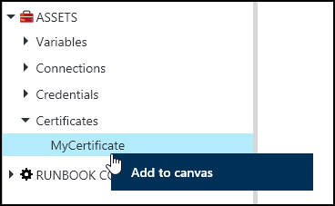
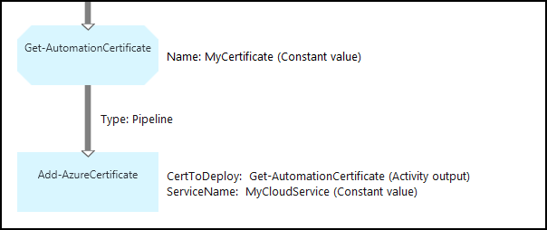

<properties 
   pageTitle="Das Zertifikat Anlagen in Azure Automatisierung | Microsoft Azure"
   description="Zertifikate können sicher in Azure Automatisierung gespeichert werden, damit sie nach dem Runbooks oder DSC Konfigurationen authentifizieren Azure und Drittanbieter-Ressourcen zugegriffen werden kann.  In diesem Artikel wird erläutert, die Details der Zertifikate und Anweisungen zum Verfassen von Text und Grafiken mit ihnen zu arbeiten."
   services="automation"
   documentationCenter=""
   authors="mgoedtel"
   manager="stevenka"
   editor="tysonn" />
<tags 
   ms.service="automation"
   ms.devlang="na"
   ms.topic="article"
   ms.tgt_pltfrm="na"
   ms.workload="infrastructure-services"
   ms.date="02/23/2016"
   ms.author="magoedte;bwren" />

# Zertifikat Anlagen in Azure Automatisierung

Zertifikate können sicher in Azure Automatisierung gespeichert werden, damit sie nach dem Runbooks oder DSC Konfigurationen mithilfe der **Get-AutomationCertificate** Aktivität zugegriffen werden kann. Dadurch können Sie zum Erstellen von Runbooks und DSC Konfigurationen, die für die Authentifizierung Zertifikate verwenden oder Azure oder Drittanbieter-Ressourcen hinzugefügt.

>[AZURE.NOTE] Sichere Anlagen in Azure Automatisierung beziehen Sie Anmeldeinformationen, Zertifikate, Verbindungen und verschlüsselte Variablen. Diese Ressourcen werden verschlüsselt und bei der Azure-Automatisierung mit einem eindeutigen Schlüssel ist für jedes Konto Automatisierung gespeichert. Dieser Schlüssel ist von einem master Zertifikat verschlüsselt und im Azure Automatisierung gespeichert. Vor dem Speichern einer sicheren Anlage, die Taste für das Konto Automatisierung ist mit dem master Zertifikat entschlüsselt und dann verwendet, um die Anlage verschlüsseln.

## Windows PowerShell-Cmdlets

Die Cmdlets in der folgenden Tabelle werden zum Erstellen und Verwalten von Automatisierung Zertifikat Anlagen mit Windows PowerShell. Diese liefern als Teil des [Azure PowerShell-Modul](../powershell-install-configure.md) für die Verwendung in Automatisierung Runbooks und DSC Konfigurationen verfügbar ist.

|Cmdlets|Beschreibung|
|:---|:---|
|[Get-AzureAutomationCertificate](http://msdn.microsoft.com/library/dn913765.aspx)|Ruft Informationen zu einem Zertifikat. Sie können nur das Zertifikat selbst aus Get-AutomationCertificate Aktivität abrufen.|
|[Neue AzureAutomationCertificate](http://msdn.microsoft.com/library/dn913764.aspx)|Ein neues Zertifikat importiert in Azure Automatisierung.|
|[Entfernen - AzureAutomationCertificate](http://msdn.microsoft.com/library/dn913773.aspx)|Ein Zertifikat entfernt Azure Automatisierung.|
|[Set - AzureAutomationCertificate](http://msdn.microsoft.com/library/dn913763.aspx)|Legt die Eigenschaften für ein vorhandenes Zertifikat, einschließlich die Zertifikatsdatei hochladen und Festlegen des Kennworts für einer PFX-Datei.|

## Aktivitäten auf Zertifikate zugreifen

Die Aktivitäten in der folgenden Tabelle werden verwendet, um die Zertifikate in einer Runbooks oder DSC Konfiguration zugreifen.

|Aktivitäten|Beschreibung|
|:---|:---|
|Get-AutomationCertificate|Ruft ein Zertifikat zur Verwendung in einem Runbooks oder DSC Konfiguration ab.|

>[AZURE.NOTE] Vermeiden Sie die Verwendung von Variablen in den – Parameter Name der Get-AutomationCertificate, da dies kann Erkennen von Abhängigkeiten zwischen Runbooks oder DSC Konfigurationen erschweren, SSL und Anlagen zur Entwurfszeit an.

## Erstellen ein neues Zertifikat.

Wenn Sie ein neues Zertifikat erstellen, laden Sie eine CER oder PFX-Datei in Azure Automatisierung hoch. Wenn Sie das Zertifikat als exportiert kennzeichnen möchten, können Sie es aus dem Azure Automatisierung Zertifikat Store übertragen. Wenn es nicht exportiert werden kann, kann dann es nur verwendet werden zum Signieren innerhalb des Runbooks oder DSC Konfiguration.

### So erstellen ein neues Zertifikat mit dem klassischen Azure-portal

1. Klicken Sie auf **Posten** am oberen Rand des Fensters, über Ihr Konto Automatisierung.
1. Am unteren Rand des Fensters klicken Sie auf **Hinzufügen**.
1. Klicken Sie auf **Anmeldeinformationen hinzuzufügen**.
2. Wählen Sie in der Dropdownliste den **Typ der Anmeldeinformationen** **Zertifikat**ein.
3. Geben Sie im Feld **Name** einen Namen für das Zertifikat ein, und klicken Sie auf den Pfeil nach rechts.
4. Suchen Sie nach einer CER oder PFX-Datei.  Wenn Sie eine PFX-Datei auswählen, geben Sie ein Kennwort und gibt an, ob es werden darf exportiert werden soll.
1. Klicken Sie auf das Häkchen, um die Zertifikatsdatei hochladen, und speichern die neue Zertifikat Anlage.

### So erstellen ein neues Zertifikat mit dem Azure-portal

1. Klicken Sie über Ihr Konto Automatisierung auf das Webpart **Posten** , um das Blade **Anlagen** zu öffnen.
1. Klicken Sie auf das Webpart **Zertifikate** , um das Blade **Zertifikate** zu öffnen.
1. Klicken Sie auf **Add ein Zertifikat** am oberen Rand der Blade.
2. Geben Sie im Feld **Name** einen Namen für das Zertifikat ein.
2. Klicken Sie auf **Wählen Sie eine Datei aus** , klicken Sie unter **Hochladen einer Zertifikatsdatei** , um nach einer CER oder PFX-Datei zu suchen.  Wenn Sie eine PFX-Datei auswählen, geben Sie ein Kennwort und gibt an, ob es werden darf exportiert werden soll.
1. Klicken Sie auf **Erstellen** , um die neue Zertifikat Anlage speichern.

### So erstellen ein neues Zertifikat mit Windows PowerShell

Im folgenden Beispielbefehle zeigen, wie Sie ein neues Automatisierung Zertifikat erstellen und kennzeichnet exportiert. Hiermit wird eine vorhandene PFX-Datei importiert.

    $certName = 'MyCertificate'
    $certPath = '.\MyCert.pfx'
    $certPwd = ConvertTo-SecureString -String 'P@$$w0rd' -AsPlainText -Force
    
    New-AzureAutomationCertificate -AutomationAccountName "MyAutomationAccount" -Name $certName -Path $certPath –Password $certPwd -Exportable

## Verwenden ein Zertifikat

Sie müssen die Aktivität **Get-AutomationCertificate** verwenden, um ein Zertifikat verwenden. Sie können nicht das Cmdlet " [Get-AzureAutomationCertificate](http://msdn.microsoft.com/library/dn913765.aspx) " verwenden, da sie Informationen über das Zertifikat Anlage aber nicht das Zertifikat selbst zurückgibt.

### Textbasierte Runbooks Stichprobe

Der folgende Code veranschaulicht, wie ein Zertifikat für einen Clouddienst in einer Runbooks hinzuzufügen. In diesem Beispiel wird das Kennwort aus einer verschlüsselten Automation-Variable abgerufen.

    $serviceName = 'MyCloudService'
    $cert = Get-AutomationCertificate -Name 'MyCertificate'
    $certPwd = Get-AutomationVariable –Name 'MyCertPassword'
    Add-AzureCertificate -ServiceName $serviceName -CertToDeploy $cert

### Grafische Runbooks Stichprobe

Fügen Sie eine **Get-AutomationCertificate** hinzu einer grafisch Runbooks, indem mit der rechten Maustaste auf das Zertifikat des grafischen-Editors im Bereich Bibliothek und **Hinzufügen zu Zeichnungsbereich**.

Die folgende Abbildung zeigt ein Beispiel für ein Zertifikat in einem grafisch Runbooks.  Dies ist das gleiche Beispiel zum Hinzufügen eines Zertifikats auf einen Clouddienst aus einer Textform Runbooks abgebildet.  

In diesem Beispiel wird den **UseConnectionObject** Parameter einrichten für die **Senden-TwilioSMS** Aktivität, die ein Verbindungsobjekt für die Authentifizierung an den Dienst verwendet.  Einen [Link Verkaufspipeline](automation-graphical-authoring-intro.md#links-and-workflow) muss hier verwendet werden, da ein Sequenz Link eine Auflistung ein einzelnes Objekt, das als Parameter für die Verbindung nicht erwartet wird mit zurückkehren möchten.

## Siehe auch

- [Grafische beim Verfassen von links](automation-graphical-authoring-intro.md#links-and-workflow) 
