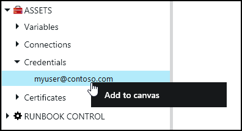
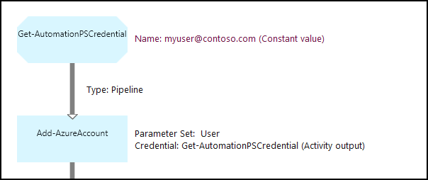

<properties 
   pageTitle="Posten in Azure Automatisierung von Anmeldeinformationen | Microsoft Azure"
   description="Anlagen können Sie Anmeldeinformationen in Azure Automatisierung enthalten Sicherheitsanmeldeinformationen, die auf Ressourcen geöffnet, wenn die Runbooks oder DSC Konfiguration Authentifizierung verwendet werden können. Dieser Artikel beschreibt, wie Anmeldeinformationen Posten erstellen und diese in einer Runbooks oder DSC Konfiguration verwenden."
   services="automation"
   documentationCenter=""
   authors="mgoedtel"
   manager="jwhit"
   editor="tysonn" />
<tags 
   ms.service="automation"
   ms.devlang="na"
   ms.topic="article"
   ms.tgt_pltfrm="na"
   ms.workload="infrastructure-services"
   ms.date="06/09/2016"
   ms.author="bwren" />

# Anlagen können Sie Anmeldeinformationen in Azure Automatisierung

Eine Automatisierung Anmeldeinformationen Anlage enthält ein [PSCredential](http://msdn.microsoft.com/library/system.management.automation.pscredential) -Objekt, das Sicherheitsanmeldeinformationen, wie etwa einen Benutzernamen und ein Kennwort enthält. Runbooks und DSC Konfigurationen möglicherweise Cmdlets, die für ein Objekt PSCredential für die Authentifizierung akzeptiert verwenden, oder sie möglicherweise extrahieren Sie den Benutzernamen und das Kennwort für das Objekt PSCredential einige Anwendung oder einen bestimmten Dienst anfordern der Authentifizierung zur Verfügung stellen. Die Eigenschaften für einen Eintrag in Azure Automatisierung sicher gespeichert werden und in der DSC-Konfiguration, mit der [Get-AutomationPSCredential](http://msdn.microsoft.com/library/system.management.automation.pscredential.aspx) Aktivität oder Runbooks zugegriffen werden können.

>[AZURE.NOTE] Sichere Anlagen in Azure Automatisierung beziehen Sie Anmeldeinformationen, Zertifikate, Verbindungen und verschlüsselte Variablen. Diese Ressourcen werden verschlüsselt und bei der Azure-Automatisierung mit einem eindeutigen Schlüssel ist für jedes Konto Automatisierung gespeichert. Dieser Schlüssel ist von einem master Zertifikat verschlüsselt und im Azure Automatisierung gespeichert. Vor dem Speichern einer sicheren Anlage, die Taste für das Konto Automatisierung ist mit dem master Zertifikat entschlüsselt und dann verwendet, um die Anlage verschlüsseln. 

## Windows PowerShell-cmdlets

Die Cmdlets in der folgenden Tabelle werden zum Erstellen und Verwalten von Automatisierung Anmeldeinformationen Anlagen mit Windows PowerShell.  Diese liefern als Teil des [Azure PowerShell-Modul](../powershell-install-configure.md) für die Verwendung in Automatisierung Runbooks und DSC Konfigurationen verfügbar ist.

|Cmdlets|Beschreibung|
|:---|:---|
|[Get-AzureAutomationCredential](http://msdn.microsoft.com/library/dn913781.aspx)|Ruft Informationen zu einer Anlage Anmeldeinformationen an. Sie können nur die Anmeldeinformationen selbst aus **Get-AutomationPSCredential** Aktivität abrufen.|
|[Neue AzureAutomationCredential](http://msdn.microsoft.com/library/azure/jj554330.aspx)|Erstellt eine neue Automatisierung Anmeldeinformationen an.|
|[Entfernen - AzureAutomationCredential](http://msdn.microsoft.com/library/azure/jj554330.aspx)|Entfernt eine Automatisierung Anmeldeinformationen an.|
|[Set - AzureAutomationCredential](http://msdn.microsoft.com/library/azure/jj554330.aspx)|Legt die Eigenschaften für eine vorhandene Automatisierung Anmeldeinformationen an.|

## Runbooks Aktivitäten

Die Aktivitäten in der folgenden Tabelle werden verwendet, um die Anmeldeinformationen in einem Runbooks und DSC Konfigurationen zugreifen.

|Aktivitäten|Beschreibung|
|:---|:---|
|Get-AutomationPSCredential|Ruft einen Eintrag zur Verwendung in einem Runbooks oder DSC Konfiguration ab. Gibt ein [System.Management.Automation.PSCredential](http://msdn.microsoft.com/library/system.management.automation.pscredential) Objekt.|

>[AZURE.NOTE] Vermeiden Sie die Verwendung von Variablen in den – Parameter Name der Get-AutomationPSCredential, da dies können Sie erkennen von Abhängigkeiten zwischen Runbooks oder DSC Konfigurationen erschweren und Anmeldeinformationen Posten zur Entwurfszeit an.

## Erstellen eine neue Anlage von Anmeldeinformationen

### So erstellen eine neue Anlage von Anmeldeinformationen mit dem klassischen Azure-portal

1. Klicken Sie auf **Posten** am oberen Rand des Fensters, über Ihr Konto Automatisierung.
1. Am unteren Rand des Fensters klicken Sie auf **Hinzufügen**.
1. Klicken Sie auf **Anmeldeinformationen hinzuzufügen**.
2. Wählen Sie in der Dropdownliste den **Typ der Anmeldeinformationen** **PowerShell-Anmeldeinformationen**ein.
1. Schließen Sie des Assistenten ab aus, und klicken Sie auf das Kontrollkästchen, um die neuen Anmeldeinformationen speichern.

### So erstellen Sie eine neue Anlage von Anmeldeinformationen mit der Azure-portal

1. Klicken Sie über Ihr Konto Automatisierung auf das Webpart **Posten** , um das Blade **Anlagen** zu öffnen.
1. Klicken Sie auf das Webpart **Anmeldeinformationen** , um das Blade **Anmeldeinformationen** zu öffnen.
1. Klicken Sie auf **Add Anmeldeinformationen** am oberen Rand der Blade.
1. Füllen Sie das Formular, und klicken Sie auf **Erstellen** , um die neuen Anmeldeinformationen speichern.

### So erstellen Sie eine neue Anlage von Anmeldeinformationen mit Windows PowerShell

Im folgenden Beispielbefehle anzeigen zum Erstellen einer neuen Automatisierung Anmeldeinformationen Ein Objekt PSCredential wird zunächst mit den Namen und das Kennwort erstellt und dann verwendet, um die Anlage Anmeldeinformationen zu erstellen. Alternativ können Sie das Cmdlet " **Get-Credential** " aus, geben Sie einen Namen und ein Kennwort angegeben werden.

    $user = "MyDomain\MyUser"
    $pw = ConvertTo-SecureString "PassWord!" -AsPlainText -Force
    $cred = New-Object –TypeName System.Management.Automation.PSCredential –ArgumentList $user, $pw
    New-AzureAutomationCredential -AutomationAccountName "MyAutomationAccount" -Name "MyCredential" -Value $cred

## Verwendung von Anmeldeinformationen PowerShell

Eine Anmeldeinformationen-Anlage in einer Runbooks oder DSC Konfiguration mit der **Get-AutomationPSCredential** Aktivität abgerufen werden. Dies gibt ein [PSCredential Objekt](http://msdn.microsoft.com/library/system.management.automation.pscredential.aspx) , das Sie verwenden können, mit einer Aktivität oder Cmdlet, das ein PSCredential Parameter erforderlich ist. Sie können auch die Eigenschaften des Objekts Anmeldeinformationen einzeln verwenden abrufen. Das Objekt verfügt über eine Eigenschaft für den Benutzernamen und das Kennwort secure, oder Sie können die Methode **GetNetworkCredential** ein [NetworkCredential](http://msdn.microsoft.com/library/system.net.networkcredential.aspx) -Objekt zurück, der eine ungeschützte Version des Kennworts bereitstellt.

### Textbasierte Runbooks Stichprobe

Im folgenden Beispielbefehle zeigen, wie in einer Runbooks PowerShell Anmeldeinformationen verwenden. In diesem Beispiel die Anmeldeinformationen abgerufen und seinen Benutzernamen und Kennwort Variablen zugewiesen.

    $myCredential = Get-AutomationPSCredential -Name 'MyCredential'
    $userName = $myCredential.UserName
    $securePassword = $myCredential.Password
    $password = $myCredential.GetNetworkCredential().Password

### Grafische Runbooks Stichprobe

Sie hinzufügen **Get-AutomationPSCredential** Aktivitäten zu einem grafisch Runbooks an, indem Sie mit der rechten Maustaste auf die Anmeldeinformationen des grafischen-Editors im Bereich Bibliothek und auswählen **zu Zeichnungsbereich hinzufügen**.

Die folgende Abbildung zeigt ein Beispiel für die Verwendung von Anmeldeinformationen in einem grafisch Runbooks.  In diesem Fall ist es für die Authentifizierung für eine Runbooks zu Azure Ressourcen in [Runbooks mit Azure AD-Benutzerkonto authentifizieren](automation-sec-configure-aduser-account.md)beschriebenen verwendet wird.  Die erste Aktivität Ruft die Anmeldeinformationen, die auf das Abonnement Azure zugreifen können.  Die Aktivität **Hinzufügen-AzureAccount** verwendet dann diese Anmeldeinformationen für die Authentifizierung für alle Aktivitäten, die sie folgen.  Einen [Link Verkaufspipeline](automation-graphical-authoring-intro.md#links-and-workflow) ist hier da **Get-AutomationPSCredential** ein einzelnes Objekt erwartet.  

## Verwendung von PowerShell Anmeldeinformationen in DSC
Während der DSC Konfigurationen in Azure Automatisierung Anmeldeinformationen Anlagen mithilfe von **Get-AutomationPSCredential**verwiesen werden können, können Anmeldeinformationen Posten auch über Parameter, übergeben werden bei Bedarf. Weitere Informationen finden Sie unter [Kompilieren Konfigurationen in Azure Automatisierung DSC](automation-dsc-compile.md#credential-assets).

## Nächste Schritte

- Weitere Informationen zu Links in grafisch authoring finden Sie unter [Links grafisch authoring](automation-graphical-authoring-intro.md#links-and-workflow)
- Die verschiedenen Authentifizierungsmethoden mit Automatisierung finden Sie unter [Azure Automatisierung Sicherheit](automation-security-overview.md)
- Um mit grafisch Runbooks anzufangen, finden Sie unter [Meine erste grafisch Runbooks](automation-first-runbook-graphical.md)
- Um mit PowerShell Workflow Runbooks anzufangen, finden Sie unter [Meine erste PowerShell Workflow Runbooks](automation-first-runbook-textual.md) 

 
