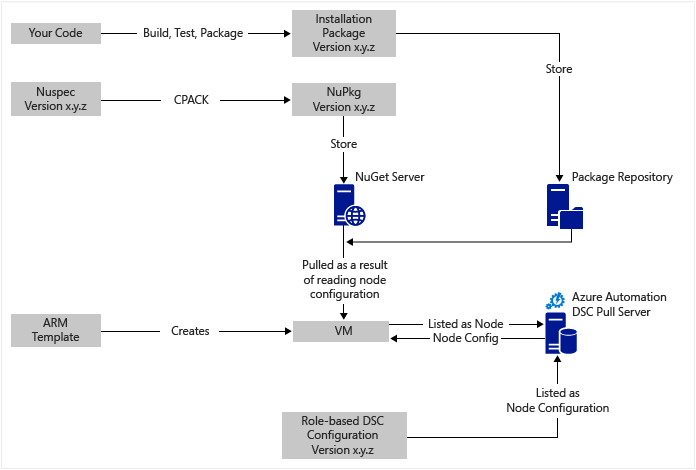
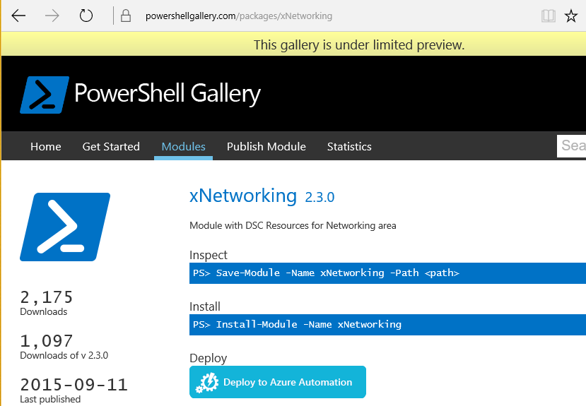

<properties
   pageTitle="Fortlaufender Azure Automatisierung DSC-Bereitstellung mit Chocolatey | Microsoft Azure"
   description="Fortlaufender Bereitstellung DevOps mit Azure Automatisierung DSC und Chocolatey Paketmanager.  Beispiel mit vollständigen JSON-Cloud-Vorlage und PowerShell-Quelle."
   services="automation"
   documentationCenter=""
   authors="sebastus"
   manager="stevenka"
   editor=""/>

<tags
   ms.service="automation"
   ms.devlang="na"
   ms.topic="article"
   ms.tgt_pltfrm="vm-windows"
   ms.workload="na"
   ms.date="08/08/2016"
   ms.author="golive"/>

# Beispiel für die Verwendung: Fortlaufender Bereitstellung auf virtuellen Computern mit Automatisierung DSC und Chocolatey

Es gibt viele Tools in der Verkaufspipeline fortlaufende Integration mit verschiedenen Punkten unterstützen, in einer DevOps Welt.  Azure Automatisierung optimalen Zustand Konfiguration (DSC) ist eine Willkommen Ergänzung zu den Optionen, die die DevOps Teams einsetzen können.  In diesem Artikel wird das Festlegen von fortlaufender Bereitstellung (CD) für einen Windows-Computer veranschaulicht.  Sie können einfach die Methode zum Einschließen von möglichst viele Windows-Computer nach Bedarf in die Rolle (beispielsweise eine Website) und von dort sowie zusätzliche Rollen erweitern.

## Auf hoher Ebene

Es ist ziemlich etwas hier passiert, aber glücklicherweise in beiden wesentlichen Prozesse unterbrochen werden kann: 

  - Schreiben von Code und testen es, klicken Sie dann erstellen und Veröffentlichen von Installationspaketen für Haupt- und Nebenversionen Versionen des Systems. 
  - Erstellen und Verwalten von virtuellen Computern, die zu installieren und den Code in den Paketen ausführen.  

Nachdem Sie diese beiden Core Vorgänge vorhanden sind, ist es einen kurzen Schritt, damit das Paket eines bestimmten virtuellen Computers ausgeführt wird, wenn neuere Versionen erstellt und bereitgestellt werden automatisch aktualisiert.

## Übersicht über die Komponente

Paket-Manager, wie z. B. [apt Get](https://en.wikipedia.org/wiki/Advanced_Packaging_Tool) sind ziemlich bekannten in der Welt Linux, aber nicht so viele in der Windows-Welt.  [Chocolatey](https://chocolatey.org/) ist eine solche Klasse haben und Scott Hanselmans [Blog](http://www.hanselman.com/blog/IsTheWindowsUserReadyForAptget.aspx) zum Thema ist eine hervorragende Einführung.  Kurz gesagt ermöglicht Chocolatey Pakete aus einem zentralen Repository Pakete in einem Windows-System über die Befehlszeile zu installieren.  Sie können das Erstellen und Verwalten Ihrer eigenen Repository und Chocolatey kann Pakete installieren, über eine beliebige Anzahl von Repositorys, die Sie festlegen.

Gewünschte Zustand Konfiguration (DSC) ([Übersicht](https://technet.microsoft.com/library/dn249912.aspx)) ist ein PowerShell-Tool, mit dem Sie die Konfiguration deklarieren, die Sie für einen Computer verwenden möchten.  Angenommen, können Sie sagen Sie "Ich möchte Chocolatey installiert, ich möchte IIS installiert, ich möchte Port 80 geöffnet, ich möchte die Version 1.0.0 meiner Website installiert."  DSC lokale Konfiguration Manager (KGV) implementiert die Konfiguration. Eine DSC extrahieren Server verfügt über eine Sammlung von Konfigurationen für Ihre Computer. Die KGV auf jedem Computer wird regelmäßig um festzustellen, ob die Konfiguration die gespeicherte Konfiguration entspricht. Es kann Berichten Status oder versuchen, den Computer wieder mit der gespeicherten Konfiguration Ausrichtung zu machen. Sie können die gespeicherte Konfiguration auf dem Server abrufen, einen Computer oder eine Gruppe von Autos Ausrichtung mit geänderter Konfiguration eingeführt verursachen bearbeiten.

Azure Automatisierung ist eine verwaltete-Dienst in Microsoft Azure, die Sie zum Automatisieren von verschiedenen Aufgaben mit Runbooks, Knoten, Anmeldeinformationen, Ressourcen und wie Zeitpläne und globale Variablen ermöglicht. Azure Automatisierung DSC erweitert diese Funktion Automatisierung PowerShell DSC Tools aufnehmen möchten.  Hier ist eine gute [Übersicht](automation-dsc-overview.md)aus.

Eine DSC-Ressource ist ein Codemodul, die bestimmte Funktionen, wie das Verwalten von Active Directory oder SQL Server-Netzwerk verfügt.  DSC Ressource Chocolatey weiß, wie Sie Zugriff auf einen NuGet Server (unter anderem), Pakete herunterladen, installieren Sie Pakete usw..  Es gibt viele andere DSC Ressourcen in der [PowerShell-Katalog](http://www.powershellgallery.com/packages?q=dsc+resources&prerelease=&sortOrder=package-title)aus.  Diese Module in Ihren Azure DSC extrahieren Automatisierungsserver (von Ihnen) installiert werden, damit sie von Ihrem Konfigurationen verwendet werden können.

Cloud-Vorlagen bieten deklarativ generieren Ihrer Infrastruktur - Aspekten wie Netzwerke, Subnetze, Netzwerk Sicherheit und routing, laden Sie Balancers, NICs, virtuellen Computern und usw..  Hier ist ein [Artikel](../resource-manager-deployment-model.md) , die das Cloud Modell zur Bereitstellung (deklarativen) mit dem Azure Service Management (ASM oder Classic) vergleicht Modell zur Bereitstellung von (Notwendigkeit).  Und eine andere [Artikel](../virtual-machines/virtual-machines-windows-compare-deployment-models.md) über die Core Ressourcenanbieter, Datenverarbeitung, Speicher und Netzwerk.

Eine der wichtigsten Features einer Cloud-Vorlage ist die Möglichkeit, eine Erweiterung virtueller Computer in den virtuellen Computer installieren, wie es bereitgestellt wird.  Bestimmte Funktionen, wie Sie ein benutzerdefiniertes Skript ausgeführt, der Installation von Antivirensoftware oder Ausführen eines DSC Konfigurationsskripts die Erweiterung virtueller Computer hat.  Es gibt viele andere Arten von virtuellen Computer Erweiterungen.

## Um das Diagramm Symbolleiste Geschäftsreise

Am Anfang beginnen, fügen Sie Ihren Code, erstellen und prüfen und dann ein Installationspaket erstellen.  Chocolatey kann verschiedene Arten von Installationspakete, wie MSI, MSU, ZIP behandeln.  Und Sie müssen den ganzen Leistungsumfang von PowerShell bei die eigentliche Installation nicht ganz bis zu Chocolatey des systemeigenen Funktionen sind nicht.  Setzen Sie in an erreichbar – ein Repository Paket das Paket ein.  In diesem Verwendungsbeispiel verwendet einen öffentlichen Ordner in einem Azure Blob-Speicher-Konto, aber an einer beliebigen Stelle werden können.  Chocolatey funktioniert systembedingt mit NuGet Servers und einige andere Personen für die Verwaltung von Metadaten Pakets.  [In diesem Artikel](https://github.com/chocolatey/choco/wiki/How-To-Host-Feed) werden die Optionen.  In diesem Verwendungsbeispiel verwendet NuGet.  Ein Nuspec ist Metadaten über Ihre Pakete.  Der Nuspecs sind in den NuPkg "kompiliert" und in einem NuGet-Server gespeichert.  Wenn Ihre Konfiguration ein Pakets anhand des Namens anfordert und verweist auf einen Server NuGet, greift das Paket Chocolatey DSC Ressource (jetzt auf dem virtuellen Computer), und installiert es für Sie.  Sie können auch eine bestimmte Version eines Pakets anfordern.

In der unteren linken Bereich des Bilds ist es eine Vorlage Azure Ressource Manager (Cloud).  In diesem Beispiel für die Verwendung registriert die Erweiterung virtueller Computer den virtuellen Computer mit der Azure Automatisierung DSC Abruf Server (d. h., ein Abruf) als Knoten.  Die Konfiguration wird in den Abruf Server gespeichert.  Tatsächlich, gespeichert ist zweimal: einmal als nur-Text und nach dem Kompilieren als MOF-Datei (für diejenigen, die solche Dinge kennen.)  Im Portal ist MOF "Knotenkonfiguration" (im Gegensatz zu einfach "Konfiguration").  Es ist das Element, das mit einem Knoten verbunden ist, damit der Knoten seine Konfiguration wissen, aus.  Details unten zeigen, wie die Knotenkonfiguration den Knoten zuweisen.

Vermutlich sind Sie bereits das Bit am Anfang oder am häufigsten davon ausführen.  Erstellen der Nuspec, kompilieren und speichern in einem Server NuGet ist eine geringe Funktionalität.  Und Sie sind bereits virtuellen Computern verwaltet werden.  Machen Sie den nächsten Schritt mit fortlaufender Bereitstellung erfordert zum Einrichten des Abruf-Servers (einmal), Registrieren der Knoten (einmal), und erstellen und speichern die Konfiguration es (Anfangs).  Aktualisieren Sie die Konfiguration und Konfiguration Knoten dann Pakete aktualisiert und an die Repository bereitgestellt werden Server den Abruf (je nach Bedarf wiederholen).

Wenn Sie nicht mit einer Vorlage Cloud gestartet werden, ist das auch in Ordnung.  Es gibt PowerShell-Cmdlets Ihrer virtuellen Computer mit dem Server abrufen und den Rest für alle registrieren können. Weitere Informationen hierzu finden Sie unter in diesem Artikel: [Onboarding Autos für die Verwaltung durch Azure Automatisierung DSC](automation-dsc-onboarding.md)

## Schritt 1: Einrichten des Kontos Abruf, Server und Automatisierung

In einer authentifizierten (Hinzufügen-AzureRmAccount) PowerShell Befehlszeile: (kann einige Minuten dauern, während der Abruf Server eingerichtet ist)

    New-AzureRmResourceGroup –Name MY-AUTOMATION-RG –Location MY-RG-LOCATION-IN-QUOTES
    New-AzureRmAutomationAccount –ResourceGroupName MY-AUTOMATION-RG –Location MY-RG-LOCATION-IN-QUOTES –Name MY-AUTOMATION-ACCOUNT 

Sie können Ihr Konto Automatisierung in eine der folgenden Regionen (QuickInfos Speicherort) setzen: ostasiatischen US 2, Süd zentralen USA, uns Gov Virginia, Westen Europa, oder Asien, Japan Osten, zentralen Indien und Australien oder.

## Schritt 2: Virtueller Computer Erweiterung Optimierungen vor in die Cloud-Vorlage

Ausführliche Informationen zu virtuellen Computer Registrierung (mit der Erweiterung PowerShell DSC virtueller Computer) in dieser [Vorlage für Azure Schnellstart](https://github.com/Azure/azure-quickstart-templates/tree/master/dsc-extension-azure-automation-pullserver)bereitgestellt.  Dieser Schritt registriert Ihrer neuen virtuellen Computer mit dem Server abrufen, in der Liste der DSC-Knoten.  Teil diese Registrierung ist die Knotenkonfiguration den Knoten angewendet werden soll.  Dieser Knotenkonfiguration keinen noch auf dem Server Abruf vorhanden, sodass es OK, Schritt 4 ist, in dem dies zum ersten Mal erfolgt.  Aber hier müssen Sie in Schritt2 den Namen des Knotens sowie den Namen der Konfiguration entschieden haben.  In diesem Beispiel für die Verwendung der Knoten 'Isvbox' und 'ISVBoxConfig' die Konfiguration richtig ist.  Somit ist der Name des Knoten-Konfiguration (um in DeploymentTemplate.json angegeben werden muss) 'ISVBoxConfig.isvbox'.  

## Schritt 3: Hinzufügen von erforderlichen DSC Ressourcen auf dem Server abrufen

Der PowerShell-Katalog wird instrumentiert, um DSC Ressourcen in Ihr Konto Azure Automatisierung zu installieren.  Navigieren Sie zu der Ressource, und klicken Sie auf die Schaltfläche "Bereitstellen zu Azure Automatisierung".

Eine andere Methode zuletzt hinzugefügten Azure-Portal können Sie in neuen Modulen ziehen, oder aktualisieren Sie vorhandene Module. Klicken Sie durch die Automatisierung Konto Ressource, die Kachel Posten und schließlich die Kachel Module.  Das Symbol Gallery durchsuchen können Sie finden in der Liste der Module im Katalog, eines Drilldowns in Details und schließlich in Ihr Konto Automatisierung importieren möchten. Dies ist eine großartige Möglichkeit, um Ihre Module von Zeit zu Zeit auf dem neuesten Stand zu bleiben. Und die Funktion zum Importieren überprüft Abhängigkeiten mit anderen Modulen, um sicherzustellen, dass nichts synchron abruft.

Oder beim manuellen vorgehen vorhanden ist.  Die Ordnerstruktur eines PowerShell-Integration-Moduls für Windows-Computer ist ein wenig anders aus der Ordnerstruktur durch die Automatisierung Azure erwartet.  Setzt ihrerseits etwas angepasst.  Aber es ist nicht schwer, und erfolgt nur einmal pro Ressource (es sei denn, Sie es in Zukunft aktualisieren möchten.)  Weitere Informationen über das Erstellen von PowerShell-Integrationsmodule, finden Sie in diesem Artikel: [Authoring Integrationsmodule für Azure Automatisierung](https://azure.microsoft.com/blog/authoring-integration-modules-for-azure-automation/)

-   Installieren Sie das Modul, das Sie auf Ihrem Computer, müssen Sie wie folgt:
    -   Installieren von [Windows Management Framework, v5](http://aka.ms/wmf5latest) (nicht für Windows 10 erforderlich)
    -   `Install-Module –Name MODULE-NAME`< – greift das Modul aus dem Katalog PowerShell 
-   Kopieren Sie den Ordner Modul aus `c:\Program Files\WindowsPowerShell\Modules\MODULE-NAME` in einen Ordner temp 
-   Löschen von Beispielen und der Dokumentation aus dem Hauptfenster Ordner 
-   Packen Sie klicken Sie im Hauptfenster Ordner benennen die ZIP-Datei genau wie den Ordner 
-   Setzen Sie die ZIP-Datei in einem erreichbar HTTP-Speicherort, beispielsweise in einem Speicher-Konto Azure Blob-Speicher.
-   Führen Sie diese PowerShell aus:

        New-AzureRmAutomationModule `
            -ResourceGroupName MY-AUTOMATION-RG -AutomationAccountName MY-AUTOMATION-ACCOUNT `
            -Name MODULE-NAME –ContentLink "https://STORAGE-URI/CONTAINERNAME/MODULE-NAME.zip"
        

Im Beispiel führt Schritte für cChoco und xNetworking. Finden Sie die [Notizen](#notes) für spezielle Behandlung für cChoco aus.

## Schritt 4: Hinzufügen der Knoten-Konfigurations auf dem Server abrufen

Es gibt keine Besonderheiten beim ersten die Konfiguration in den Abruf Server und kompilierte zu importieren.  Alle nachfolgenden importieren/kompiliert der gleichen Konfiguration aussehen genau gleich.  Bei jedem Ihrem Paket aktualisieren und es zu Herstellung schieben müssen Aktionen Sie diesen Schritt stellen Sie sicher, dass die Konfigurationsdatei richtig ist – einschließlich der neuen Version von Ihrem Paket.  Hier ist die Konfigurationsdatei und PowerShell:

ISVBoxConfig.ps1:

    Configuration ISVBoxConfig 
    { 
        Import-DscResource -ModuleName cChoco 
        Import-DscResource -ModuleName xNetworking
    
        Node "isvbox" {   
    
            cChocoInstaller installChoco 
            { 
                InstallDir = "C:\choco" 
            }
    
            WindowsFeature installIIS 
            { 
                Ensure="Present" 
                Name="Web-Server" 
            }
    
            xFirewall WebFirewallRule 
            { 
                Direction = "Inbound" 
                Name = "Web-Server-TCP-In" 
                DisplayName = "Web Server (TCP-In)" 
                Description = "IIS allow incoming web site traffic." 
                DisplayGroup = "IIS Incoming Traffic" 
                State = "Enabled" 
                Access = "Allow" 
                Protocol = "TCP" 
                LocalPort = "80" 
                Ensure = "Present" 
            }
    
            cChocoPackageInstaller trivialWeb 
            {            
                Name = "trivialweb" 
                Version = "1.0.0" 
                Source = “MY-NUGET-V2-SERVER-ADDRESS” 
                DependsOn = "[cChocoInstaller]installChoco", 
                "[WindowsFeature]installIIS" 
            } 
        }    
    }

Neu-ConfigurationScript.ps1:

    Import-AzureRmAutomationDscConfiguration ` 
        -ResourceGroupName MY-AUTOMATION-RG –AutomationAccountName MY-AUTOMATION-ACCOUNT ` 
        -SourcePath C:\temp\AzureAutomationDsc\ISVBoxConfig.ps1 ` 
        -Published –Force
    
    $jobData = Start-AzureRmAutomationDscCompilationJob ` 
        -ResourceGroupName MY-AUTOMATION-RG –AutomationAccountName MY-AUTOMATION-ACCOUNT ` 
        -ConfigurationName ISVBoxConfig 
    
    $compilationJobId = $jobData.Id
    
    Get-AzureRmAutomationDscCompilationJob ` 
        -ResourceGroupName MY-AUTOMATION-RG –AutomationAccountName MY-AUTOMATION-ACCOUNT ` 
        -Id $compilationJobId

Diese Schritte Ergebnis in einer neuen Konfiguration der Knoten mit dem Namen "ISVBoxConfig.isvbox" auf dem Server Abruf platziert wird.  Der Name der Konfiguration Knoten wird als "configurationName.nodeName" erstellt.

## Schritt 5: Erstellen und Verwalten von Metadaten Pakets

Für jedes Paket, das Sie in das Paket Repository investieren, benötigen Sie eine Nuspec, die es beschreibt.  Die Nuspec muss kompiliert und in Ihrem NuGet-Server gespeichert werden. Dieses Verfahren wird beschrieben, [hier](http://docs.nuget.org/create/creating-and-publishing-a-package).  Sie können MyGet.org als NuGet Server verwenden.  Sie verkaufen diesen Dienst, aber Sie haben ein Starter SKU, die kostenlose ist.  Unter "NuGet.org" finden Sie die Anweisungen zur Installation von Ihrer eigenen NuGet Server für Ihre privaten Pakete.

## Schritt 6: Letzte Schritte

Jedes Mal eine Version übergibt f & a und genehmigt ist für Bereitstellung, das Paket wird erstellt, Nuspec und Nupkg aktualisiert und auf dem Server NuGet bereitgestellt.  Darüber hinaus muss die Konfiguration (Schritt 4 oben) aktualisiert werden, um mit der neuen Versionsnummer stimmen.  Sie müssen auf dem Server Abruf gesendet und kompiliert werden.  Von diesem Zeitpunkt an ist es mit den virtuellen Computern, die auf dieser Konfiguration, ziehen Sie das Update, und installieren Sie es abhängig sind.  Diese Updates werden einfache - eine einfache Linie oder zwei der PowerShell.  Wenn Visual Studio Team Services sind einige Felder in eigene Aufgaben gekapselt, die in einem Build verkettet werden können.  Dieser [Artikel](https://www.visualstudio.com/en-us/docs/alm-devops-feature-index#continuous-delivery) enthält weitere Informationen.  Diese [GitHub Repo](https://github.com/Microsoft/vso-agent-tasks) werden die verschiedenen verfügbare Build Schritte erläutert.

## Notizen

In diesem Verwendungsbeispiel beginnt mit eines virtuellen Computers aus einem generische Windows Server 2012 R2 Bild aus dem Katalog Azure.  Sie können aus einem beliebigen gespeicherten Bild starten, und gibt dann von dort mit der Konfiguration DSC.  Ändern der Konfiguration, die integrierten wird in ein Bild ist jedoch viel schwieriger als dynamisches Aktualisieren der Konfigurations DSC verwenden.

Sie müssen keiner Cloud-Vorlage und die Erweiterung virtuellen Computer verwenden, um dieses Verfahren mit Ihrer virtuellen Computer verwendet.  Und Ihre virtuellen Computern nicht auf Azure werden unter Verwaltung CD sein.  Erforderlich ist lediglich, dass Chocolatey installiert sein und die KGV konfiguriert des virtuellen Computers, damit es weiß, wo finde ich die fehl.  

Wenn Sie ein Paket eines virtuellen Computers, die in Betrieb ist aktualisieren, müssen Sie natürlich diesen virtuellen Computer Abmelden bei Drehung übernehmen, während das Update installiert ist.  Die Vorgehensweise variiert.  Beispielsweise können mit hinter einem Lastenausgleich Azure eines virtuellen Computers, Sie eine benutzerdefinierte Prüfpunkt hinzufügen.  Müssen Sie beim Aktualisieren des virtuellen Computer den Prüfpunkt Endpunkt einer 400 zurückzukehren.  Die erforderlich sind, um diese Änderung dazu führen, dass Tweak möglich innerhalb der Konfiguration, können Sie die Tweak, um es wieder eine 200 zurückgeben, nachdem die Aktualisierung abgeschlossen ist.

Die vollständige Quelle für dieses Beispiel für die Verwendung ist in [dieses Projekt Visual Studio](https://github.com/sebastus/ARM/tree/master/CDIaaSVM) auf GitHub.

##Verwandte Artikel##

- [Azure Automatisierung DSC Übersicht] (Automatisierung dsc overview.md)
- [Azure Automatisierung DSC Cmdlets] (https://msdn.microsoft.com/library/mt244122.aspx)
- [Onboarding Autos für die Verwaltung durch Azure Automatisierung DSC] (Automatisierung dsc onboarding.md)
