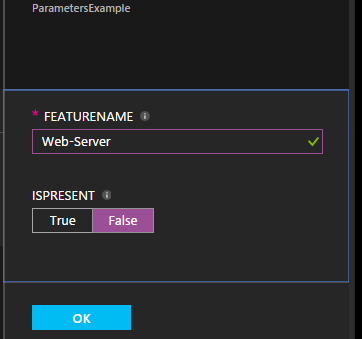

<properties 
   pageTitle="Konfigurationen in Azure Automatisierung DSC kompilieren | Microsoft Azure" 
   description="Übersicht über zwei Methoden zum gewünschten Zustand Konfiguration (DSC) Konfigurationen kompilieren: Azure-Portal, und klicken Sie mit der Windows PowerShell. " 
   services="automation" 
   documentationCenter="na" 
   authors="coreyp-at-msft" 
   manager="stevenka" 
   editor="tysonn"/>

<tags
   ms.service="automation"
   ms.devlang="na"
   ms.topic="article"
   ms.tgt_pltfrm="powershell"
   ms.workload="na" 
   ms.date="01/25/2016"
   ms.author="coreyp"/>
   
#Konfigurationen in Azure Automatisierung DSC kompilieren#

Können Sie die gewünschten Zustand Konfiguration (DSC) Konfigurationen auf zwei Arten mit Azure Automatisierung kompilieren: Azure-Portal, und klicken Sie mit der Windows PowerShell. In der folgenden Tabelle helfen festzustellen, welche Methode anhand der Merkmale der einzelnen verwenden: 

###Vorschau der Azure-portal###
- Einfachste Methode mit interaktiven Benutzeroberfläche
- Formular zum einfachen Parameterwerte bereitstellen
- Nachverfolgen Sie einfaches Job-Status
- Zugriff mit Azure Anmeldung authentifiziert

###Windows PowerShell###
- Rufen Sie über die Befehlszeile mit Windows PowerShell-cmdlets
- Können in automatisierte Lösung mit mehreren Schritten einbezogen werden
- Einfache und komplexe Parameterwerte bereitstellen
- Nachverfolgen von Job-Status
- Client-Unterstützung von PowerShell-Cmdlets erforderlich sind
- Übergeben ConfigurationData
- Kompilieren Sie Konfigurationen, in denen Anmeldeinformationen verwendet.

Nachdem Sie für eine Kompilierung Methode entschieden haben, können Sie die entsprechenden Verfahren unten, und beginnen kompilieren folgen.

##Kompilieren eines DSC Konfiguration mit Azure-portal##

1.  Klicken Sie auf Ihr Konto Automatisierung **Konfigurationen**.
2.  Klicken Sie auf eine Konfiguration, um deren Blade zu öffnen.
3.  Klicken Sie auf **Kompilieren**.
4.  Wenn die Konfiguration keine Parameter besitzt, werden Sie aufgefordert, zu bestätigen, dass er kompiliert werden soll. Die Konfiguration Parameter umfasst, öffnet das Blade **Kompilieren Konfiguration** , damit Sie Parameterwerte bereitstellen können. <a href="#basic-parameters">**Grundlegende**</a> im Abschnitt finden Sie unter Weitere Details auf Parameter.
5.  Das **Position der Kompilierung** Blade kann geöffnet werden, damit Sie nachverfolgen können, die Kompilierung Projektstatus und die Knoten Konfigurationen (MOF-Konfigurationsdokumente) es verursacht, klicken Sie auf den Azure DSC extrahieren Automatisierungsserver platziert werden.

##Kompilieren einer DSC-Konfigurations mit Windows PowerShell##

Sie können [`Start-AzureRmAutomationDscCompilationJob`](https://msdn.microsoft.com/library/mt244118.aspx) Kompilierung mit Windows PowerShell starten. Der folgende Code startet Kompilierung einer DSC Konfiguration **SampleConfig**bezeichnet.

    Start-AzureRmAutomationDscCompilationJob -ResourceGroupName "MyResourceGroup" -AutomationAccountName "MyAutomationAccount" -ConfigurationName "SampleConfig" 
 
`Start-AzureRmAutomationDscCompilationJob`Gibt eine Kompilierung Job-Objekts, das Sie verwenden können, um deren Status zu verfolgen. Anschließend können Sie diese Kompilierung Job-Objekts mit [`Get-AzureRmAutomationDscCompilationJob`](https://msdn.microsoft.com/library/mt244120.aspx) den Status des Projekts Kompilierung, ermitteln und [`Get-AzureRmAutomationDscCompilationJobOutput`](https://msdn.microsoft.com/library/mt244103.aspx) seine Streams (Ausgabe) anzeigen. Der folgende Code Kompilierung der Konfiguration **SampleConfig** beginnt, wartet, bis er abgeschlossen hat, und klicken Sie dann seine Streams angezeigt.
    
    $CompilationJob = Start-AzureRmAutomationDscCompilationJob -ResourceGroupName "MyResourceGroup" -AutomationAccountName "MyAutomationAccount" -ConfigurationName "SampleConfig"
    
    while($CompilationJob.EndTime –eq $null -and $CompilationJob.Exception –eq $null)           
    {
        $CompilationJob = $CompilationJob | Get-AzureRmAutomationDscCompilationJob
        Start-Sleep -Seconds 3
    }
    
    $CompilationJob | Get-AzureRmAutomationDscCompilationJobOutput –Stream Any 

##Grundlegende Parameter##

Parameterdeklaration in DSC Konfigurationen, einschließlich der Parametertypen und Eigenschaften, funktioniert wie in Azure Automatisierung Runbooks. Erfahren Sie mehr über Runbooks Parameter [Starten einer Runbooks in Azure Automatisierung](automation-starting-a-runbook.md) finden Sie unter.

Im folgende Beispiel verwendet zwei Parameter **FeatureName** und **IsPresent**, um die Werte von Eigenschaften in der **ParametersExample.sample** Knotenkonfiguration, die bei der Kompilierung generierte zu bestimmen.

    Configuration ParametersExample
    {
        param(
            [Parameter(Mandatory=$true)]
    
            [string] $FeatureName,
    
            [Parameter(Mandatory=$true)]
            [boolean] $IsPresent
        )
    
        $EnsureString = "Present"
        if($IsPresent -eq $false)
        {
            $EnsureString = "Absent"
        }
    
        Node "sample"
        {
            WindowsFeature ($FeatureName + "Feature")
            {
                Ensure = $EnsureString
                Name = $FeatureName
            }
        }
    }

Sie können DSC Konfigurationen kompilieren, die grundlegenden Parameter im Portal Azure Automatisierung DSC oder mit Azure PowerShell verwenden:

###Portal###

Im Portal können Sie nach dem Klicken auf **Kompilieren**Parameterwerte eingeben.

###PowerShell###

PowerShell erfordert Parameter in einer [Hashtable](http://technet.microsoft.com/library/hh847780.aspx) , wo die Taste entspricht dem Namen des Parameters, und der Wert gleich dem Parameterwert an.

    $Parameters = @{
            "FeatureName" = "Web-Server"
            "IsPresent" = $False
    }
    
    
    Start-AzureRmAutomationDscCompilationJob -ResourceGroupName "MyResourceGroup" -AutomationAccountName "MyAutomationAccount" -ConfigurationName "ParametersExample" -Parameters $Parameters 
    

Informationen zu PSCredentials als Parameter zu übergeben finden Sie unter <a href="#credential-assets">**Anmeldeinformationen Anlagen**</a> unten.

##ConfigurationData##

**ConfigurationData** können Sie strukturelle Konfiguration von Umgebung spezielle Konfiguration während der Verwendung von PowerShell DSC trennen. Finden Sie weitere Informationen zu **ConfigurationData** ["Was" von "Wenn" in der PowerShell DSC extrahieren](http://blogs.msdn.com/b/powershell/archive/2014/01/09/continuous-deployment-using-dsc-with-minimal-change.aspx) .

>[AZURE.NOTE] **ConfigurationData** können beim Kompilieren in Azure Automatisierung DSC mithilfe der PowerShell Azure, aber nicht in der Azure-Portal.

Im folgende Beispiel DSC Konfiguration wird über die Schlüsselwörter **$ConfigurationData** und **$AllNodes** **ConfigurationData** verwendet. Sie benötigen die [ **xWebAdministration** Modul](https://www.powershellgallery.com/packages/xWebAdministration/) auch in diesem Beispiel:

     Configuration ConfigurationDataSample
     {
        Import-DscResource -ModuleName xWebAdministration -Name MSFT_xWebsite
    
        Write-Verbose $ConfigurationData.NonNodeData.SomeMessage 
    
        Node $AllNodes.Where{$_.Role -eq "WebServer"}.NodeName
        {
            xWebsite Site
            {
                Name = $Node.SiteName
                PhysicalPath = $Node.SiteContents
                Ensure   = "Present"
            }
        }
    }

Sie können die Konfiguration DSC über mit PowerShell kompilieren. Die unter PowerShell addiert Sie zwei Knoten Konfigurationen für den Azure DSC extrahieren Automatisierungsserver: **ConfigurationDataSample.MyVM1** und **ConfigurationDataSample.MyVM3**:

    $ConfigData = @{
        AllNodes = @(
            @{
                NodeName = "MyVM1"
                Role = "WebServer"
            },
            @{
                NodeName = "MyVM2"
                Role = "SQLServer"
            },
            @{
                NodeName = "MyVM3"
                Role = "WebServer"
    
            }
    
        )
    
        NonNodeData = @{
            SomeMessage = "I love Azure Automation DSC!"
    
        }
    
    } 
    
    Start-AzureRmAutomationDscCompilationJob -ResourceGroupName "MyResourceGroup" -AutomationAccountName "MyAutomationAccount" -ConfigurationName "ConfigurationDataSample" -ConfigurationData $ConfigData

##Posten##

Anlage Verweise sind in Azure Automatisierung DSC Konfigurationen und Runbooks gleich. Finden Sie hier weitere Informationen:

- [Zertifikate](automation-certificates.md)
- [Verbindungen](automation-connections.md)
- [Anmeldeinformationen](automation-credentials.md)
- [Variablen](automation-variables.md)

###Anmeldeinformationen Anlagen###
Während der DSC Konfigurationen in Azure Automatisierung Anmeldeinformationen Anlagen mithilfe von **Get-AzureRmAutomationCredential**verwiesen werden können, können Anmeldeinformationen Posten auch über Parameter, übergeben werden bei Bedarf. Wenn eine Konfiguration einen Parameter vom Typ **PSCredential** dauert, müssen Sie den Namen der Anlage Anmeldeinformationen Azure Automatisierung als Wert des Parameters wird anstelle eines Objekts PSCredential übergeben. Hintergrundinformationen wird die Automatisierung Azure Anmeldeinformationen Anlage mit dem Namen abgerufen und an der Konfiguration übergeben werden.

Anmeldeinformationen planmäßigen erfordert secure in Knoten Konfigurationen (MOF-Konfigurationsdokumente) Verschlüsseln der Anmeldeinformationen in der Konfigurationsdatei MOF-Knotens. Azure Automatisierung führt diese einen Schritt weiter und verschlüsselt die gesamte MOF-Datei. Allerdings müssen aktuell Sie PowerShell DSC erkennen, dass es für die Anmeldeinformationen ein, die im nur-Text ausgegeben werden, während der Knoten Konfiguration MOF Generierung, Ordnung ist, da PowerShell DSC wissen nicht, dass Azure Automatisierung die gesamte MOF-Datei nach der Generation über eine Kompilierungsauftrag verschlüsseln werden, wird.

Sie können PowerShell DSC erkennen, dass sie jetzt für die Anmeldeinformationen ein, die im nur-Text in der Knotenkonfiguration generierte MOF-Dateien mit <a href="#configurationdata">**ConfigurationData**</a>ausgegeben werden. Sollten Sie übergeben `PSDscAllowPlainTextPassword = $true` über **ConfigurationData** für jeden Knoten-Block Namen, die in der Konfiguration DSC angezeigt wird und die Anmeldeinformationen verwendet.

Im folgenden Beispiel wird eine DSC-Konfiguration, die eine Automatisierung Anmeldeinformationen Anlage verwendet.

    Configuration CredentialSample
    {
       $Cred = Get-AzureRmAutomationCredential -Name "SomeCredentialAsset"
    
        Node $AllNodes.NodeName
        { 
            File ExampleFile
            { 
                SourcePath = "\\Server\share\path\file.ext" 
                DestinationPath = "C:\destinationPath" 
                Credential = $Cred 
            }
        }
    }

Sie können die Konfiguration DSC über mit PowerShell kompilieren. Die unter PowerShell addiert Sie zwei Knoten Konfigurationen für den Azure DSC extrahieren Automatisierungsserver: **CredentialSample.MyVM1** und **CredentialSample.MyVM2**.

    $ConfigData = @{
        AllNodes = @(
            @{
                NodeName = "*"
                PSDscAllowPlainTextPassword = $True
            },
            @{
                NodeName = "MyVM1"
            },
            @{
                NodeName = "MyVM2"
            }
        )
    }
    
    Start-AzureRmAutomationDscCompilationJob -ResourceGroupName "MyResourceGroup" -AutomationAccountName "MyAutomationAccount" -ConfigurationName "CredentialSample" -ConfigurationData $ConfigData
