<properties
   pageTitle="Erste Schritte mit Azure Automatisierung DSC"
   description="Erläuterung und Beispiele für die am häufigsten verwendeten Aufgaben in Azure Automatisierung gewünscht Zustand Konfiguration (DSC)"
   services="automation" 
   documentationCenter="na" 
   authors="eslesar" 
   manager="dongill" 
   editor="tysonn"/>

<tags
   ms.service="automation"
   ms.devlang="na"
   ms.topic="article"
   ms.tgt_pltfrm="powershell"
   ms.workload="na" 
   ms.date="06/06/2016"
   ms.author="magoedte;eslesar"/>
   

# <a name="getting-started-with-azure-automation-dsc"></a>Erste Schritte mit Azure Automatisierung DSC

In diesem Thema wird erläutert, wie die am häufigsten verwendeten Aufgaben mit Azure Automatisierung gewünscht Zustand Konfiguration (DSC), z. B. erstellen, importieren und Kompilieren Konfigurationen, Onboarding Autos zu verwalten und Anzeigen von Berichten ausführen. Übersicht über was Azure Automatisierung DSC ist finden Sie unter [Azure Automatisierung DSC Übersicht](automation-dsc-overview.md). DSC Dokumentation finden Sie in [Windows PowerShell gewünscht State Konfiguration Overview](https://msdn.microsoft.com/PowerShell/dsc/overview).

Dieses Thema enthält eine schrittweise Anleitung zum Verwenden von Azure Automatisierung DSC. Wenn Sie eine Beispiel-Umgebung möchten, die bereits eingerichtet ist, ohne die in diesem Artikel beschriebenen Schritte befolgen, können Sie [die folgenden Cloud-Vorlage](https://github.com/azureautomation/automation-packs/tree/master/102-sample-automation-setup). Diese Vorlage richtet einer abgeschlossenen Azure Automatisierung DSC-Umgebung, einschließlich einer Azure-virtuellen Computer, die von Azure Automatisierung DSC verwaltet wird.
 
## <a name="prerequisites"></a>Erforderliche Komponenten

Wenn Sie in den Beispielen in diesem Thema abgeschlossen haben, wird Folgendes benötigt:

- Ein Automatisierung Azure-Konto. Erstellen Sie ein Konto Azure Automatisierung ausführen als Anweisungen finden Sie unter [Ausführen als Konto Azure](automation-sec-configure-azure-runas-account.md).
- Ein Azure Ressourcenmanager VM (nicht klassischen) unter Windows Server 2008 R2 oder höher. Anweisungen zum Erstellen eines virtuellen Computers finden Sie unter [Erstellen Ihrer ersten Windows virtuellen Computers Azure-Portal](../virtual-machines/virtual-machines-windows-hero-tutorial.md)

## <a name="creating-a-dsc-configuration"></a>Erstellen einer DSC-Konfiguration

Wir werden eine einfache [DSC Konfiguration](https://msdn.microsoft.com/powershell/dsc/configurations) erstellen, die entweder vorhanden sind oder nicht von **Webserver** Windows Feature (IIS), je nachdem, wie Sie Knoten weisen sicherstellen.

1. Starten der Windows PowerShell ISE (oder einem beliebigen Texteditor).

2. Geben Sie den folgenden Text ein:

    ```powershell
    configuration TestConfig
    {
        Node WebServer
        {
            WindowsFeature IIS
            {
                Ensure               = 'Present'
                Name                 = 'Web-Server'
                IncludeAllSubFeature = $true

            }
        }

        Node NotWebServer
        {
            WindowsFeature IIS
            {
                Ensure               = 'Absent'
                Name                 = 'Web-Server'

            }
        }
        }
    ```
3. Speichern Sie die Datei als `TestConfig.ps1`.

Diese Konfiguration Ruft eine Ressource in jeder Knoten Block, [WindowsFeature Ressourcen](https://msdn.microsoft.com/powershell/dsc/windowsfeatureresource), die Anwesenheit oder Abwesenheit des **Webserver** Features: Damit ist sichergestellt.

## <a name="importing-a-configuration-into-azure-automation"></a>Importieren eine Konfiguration in Azure Automatisierung

Als Nächstes werden wir die Konfiguration in die Automatisierung-Konto importieren.

1. Melden Sie sich mit dem [Azure-Portal](https://portal.azure.com)aus.

2. Klicken Sie im Menü Hub auf **alle Ressourcen** , und klicken Sie dann den Namen Ihres Kontos Automatisierung.

3. Klicken Sie auf das **Konto Automatisierung** Blade **DSC Konfigurationen**auf.

4. Klicken Sie auf das Blade **DSC Konfigurationen** **Hinzufügen einer Konfiguration**aus.

5. Klicken Sie auf das Blade **Konfiguration importieren** , navigieren Sie zu der `TestConfig.ps1` Datei auf Ihrem Computer.
    
    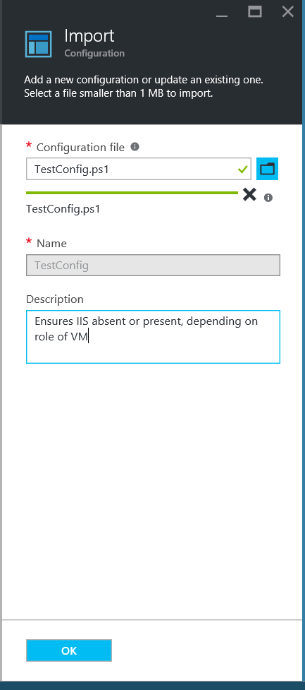
    

6. Klicken Sie auf **OK**.

## <a name="viewing-a-configuration-in-azure-automation"></a>Anzeigen einer Konfigurations in Azure Automatisierung

Nachdem Sie eine Konfiguration importiert haben, können Sie es im Azure-Portal anzeigen.

1. Melden Sie sich mit dem [Azure-Portal](https://portal.azure.com)aus.

2. Klicken Sie im Menü Hub auf **alle Ressourcen** , und klicken Sie dann den Namen Ihres Kontos Automatisierung.

3. Klicken Sie auf das **Konto Automatisierung** Blade auf **DSC Konfigurationen**

4. Klicken Sie auf das Blade **DSC Konfigurationen** auf **TestConfig** (Dies ist der Name der Konfiguration, die Sie im vorangehenden Verfahren importiert haben).

5. Klicken Sie auf das Blade **TestConfig-Konfiguration** auf **die Konfiguration Datenursprung anzeigen**.

    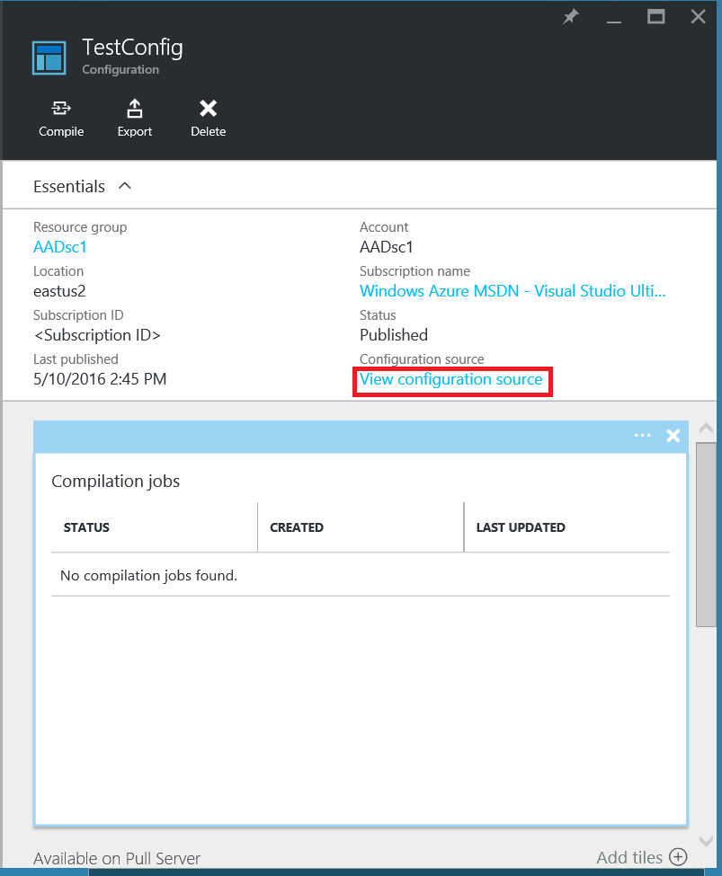
    
    Eine Blade **TestConfig Konfigurations-Quelle** wird geöffnet, und zeigt den PowerShell-Code für die Konfiguration an.
    
## <a name="compiling-a-configuration-in-azure-automation"></a>Kompilieren einer Konfigurations in Azure Automatisierung

Bevor Sie einen gewünschten Zustand zu einem Knoten anwenden können, muss eine DSC Konfiguration definieren diesen Status in eine oder mehrere Knoten Konfigurationen (MOF-Dokument) kompiliert und auf den DSC extrahieren Automatisierungsserver platziert werden. Eine ausführlichere Beschreibung der Konfigurationen in Azure Automatisierung DSC kompilieren finden Sie unter [Kompilieren Konfigurationen in Azure Automatisierung DSC](automation-dsc-compile.md). Weitere Informationen zu Konfigurationen kompilieren finden Sie unter [DSC Konfigurationen](https://msdn.microsoft.com/PowerShell/DSC/configurations).

1. Melden Sie sich mit dem [Azure-Portal](https://portal.azure.com)aus.

2. Klicken Sie im Menü Hub auf **alle Ressourcen** , und klicken Sie dann den Namen Ihres Kontos Automatisierung.

3. Klicken Sie auf das **Konto Automatisierung** Blade auf **DSC Konfigurationen**

4. Klicken Sie auf das Blade **DSC Konfigurationen** auf **TestConfig** (der Name der zuvor importierten Konfiguration).

5. Klicken Sie auf das Blade **TestConfig Konfiguration** klicken Sie auf **Kompilieren**, und klicken Sie dann auf **Ja**. Hierdurch wird eine Kompilierung Position.
    
    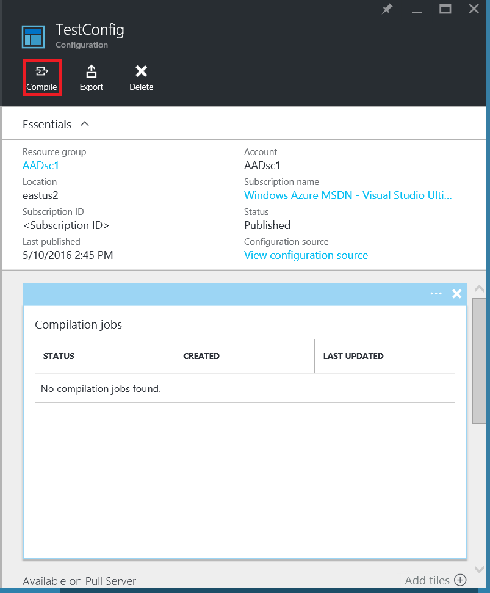
    
> [AZURE.NOTE] Beim Kompilieren einer Konfigurations in Azure Automatisierung werden automatisch alle erstellten Knotenkonfiguration MOF-Dateien auf dem Server Abruf bereitstellt.

## <a name="viewing-a-compilation-job"></a>Anzeigen eines Auftrags Kompilierung

Nachdem Sie eine Kompilierung gestartet haben, können Sie es in der Kachel **Kompilierungsaufträge** in der **Konfiguration** Blade anzeigen. Die Kachel **Kompilierungsaufträge** gerade ausgeführt wird, abgeschlossen und Einzelvorgänge nicht. Wenn Sie eine Kompilierung Auftrag Blade öffnen, es zeigt Informationen zu diesen Auftrag einschließlich Fehlern und Warnungen festgestellt, Eingabeparameter, die in der Konfiguration, und klicken Sie auf eine Kompilierung Protokolle verwendet werden.

1. Melden Sie sich mit dem [Azure-Portal](https://portal.azure.com)aus.

2. Klicken Sie im Menü Hub auf **alle Ressourcen** , und klicken Sie dann den Namen Ihres Kontos Automatisierung.

3. Klicken Sie auf das **Konto Automatisierung** Blade **DSC Konfigurationen**auf.

4. Klicken Sie auf das Blade **DSC Konfigurationen** auf **TestConfig** (der Name der zuvor importierten Konfiguration).

5. Klicken Sie auf die Kachel **Kompilierungsaufträge** des Blades **TestConfig Konfiguration** klicken Sie auf einen der aufgelisteten Aufträge. Eine **Kompilierungsauftrag** Blade wird geöffnet, mit der Bezeichnung und das Datum, das der Kompilierungsauftrag eingeleitet wurde.

    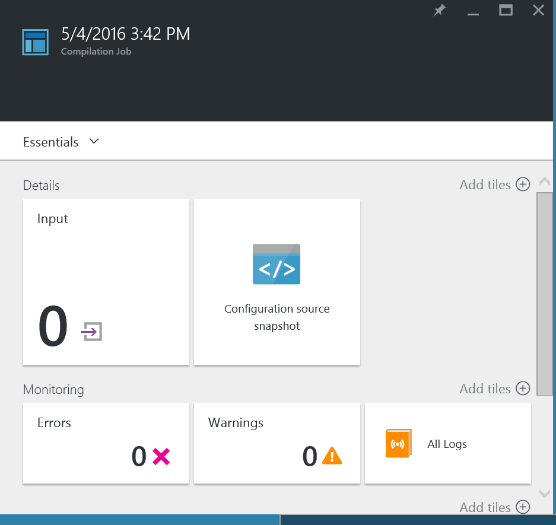
  
6. Klicken Sie auf eine beliebige Kachel in das Blade **Kompilierung Position** auf Weitere Details zu den Auftrag angezeigt.

## <a name="viewing-node-configurations"></a>Anzeigen von Konfigurationen Knoten

Erfolgreichen Abschluss eines Auftrags Kompilierung erstellt eine oder mehrere neue Knoten Konfigurationen. Eine Knotenkonfiguration ist ein MOF-Dokument, das bereitgestellt wird, auf dem Server abrufen und bereit sind, wurden und von einem oder mehreren Knoten angewendet werden. Sie können die Knoten Konfigurationen in Ihr Konto Automatisierung in das Blade **DSC Knoten Konfigurationen** anzeigen. Eine Knotenkonfiguration hat einen Namen für das Formular *ConfigurationName*. *NodeName*.

1. Melden Sie sich mit dem [Azure-Portal](https://portal.azure.com)aus.

2. Klicken Sie im Menü Hub auf **alle Ressourcen** , und klicken Sie dann den Namen Ihres Kontos Automatisierung.

3. Klicken Sie auf das **Konto Automatisierung** Blade **DSC Knoten Konfigurationen**auf.

    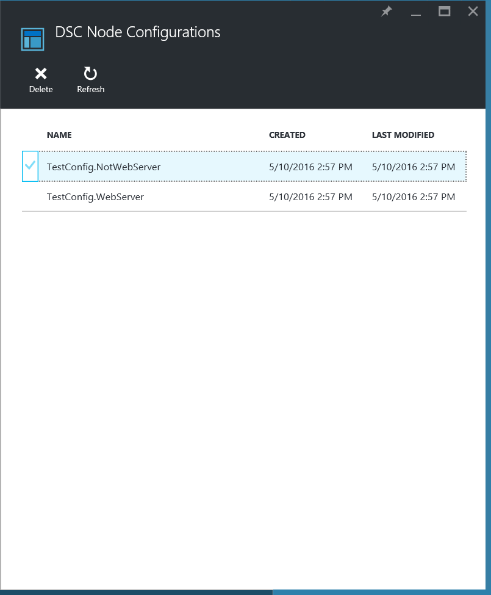
    
## <a name="onboarding-an-azure-vm-for-management-with-azure-automation-dsc"></a>Onboarding einer Azure virtueller Computer für die Verwaltung mit Azure Automatisierung DSC

Azure Automatisierung DSC können Sie um Azure-virtuellen Computern (klassische und Ressourcenmanager), lokalen virtuellen Computern, Linux Maschinen, AWS virtuellen Computern und lokale physische Computer zu verwalten. In diesem Thema, und Fragestellungen wie integrierte nur Azure Ressourcenmanager virtuellen Computern. Informationen zu Onboarding andere Arten von Maschinen, finden Sie unter [Onboarding Autos für die Verwaltung durch Azure Automatisierung DSC](automation-dsc-onboarding.md).

### <a name="to-onboard-an-azure-resource-manager-vm-for-management-by-azure-automation-dsc"></a>Zu integrierten einer Azure Ressourcenmanager VM für die Verwaltung durch Azure Automatisierung DSC

1. Melden Sie sich mit dem [Azure-Portal](https://portal.azure.com)aus.

2. Klicken Sie im Menü Hub auf **alle Ressourcen** , und klicken Sie dann den Namen Ihres Kontos Automatisierung.

3. Klicken Sie auf das **Konto Automatisierung** Blade **DSC-Knoten**aus.

4. Klicken Sie in das Blade **DSC Knoten** **Hinzufügen Azure virtueller Computer**auf.

    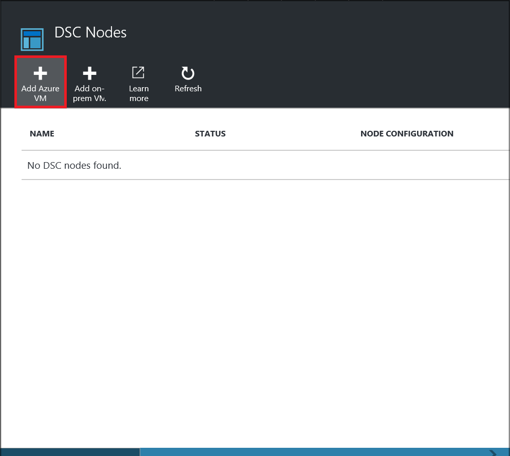

5. Klicken Sie in das Blade **Hinzufügen Azure virtuellen Computern** auf **virtuellen Computern zu integrierten auswählen**.

6. Wählen Sie in das Blade **Wählen Sie virtuellen Computern** den virtuellen Computer integrierten soll, und klicken Sie auf **OK**.

    >[AZURE.IMPORTANT] Dies muss eine Azure Ressourcenmanager VM unter Windows Server 2008 R2 oder höher.
    
7. Klicken Sie in das Blade **Hinzufügen Azure virtuellen Computern** **Konfigurieren Registrierungsdaten**auf.

8. Geben Sie den Namen der Knotenkonfiguration, die Sie auf dem virtuellen Computer im Feld **Name der Konfiguration Knoten** anwenden möchten, klicken Sie in der **Registrierung** Blade. Dies muss exakt den Namen einer Knotenkonfiguration in der Automatisierung Konto übereinstimmen. Hinzufügen eines Namens an diesem Punkt ist optional. Sie können die Knotenkonfiguration zugeordneten nach Onboarding den Knoten ändern.
Aktivieren Sie **Bei Bedarf Knoten neu zu starten**, und klicken Sie dann auf **OK**.
    
    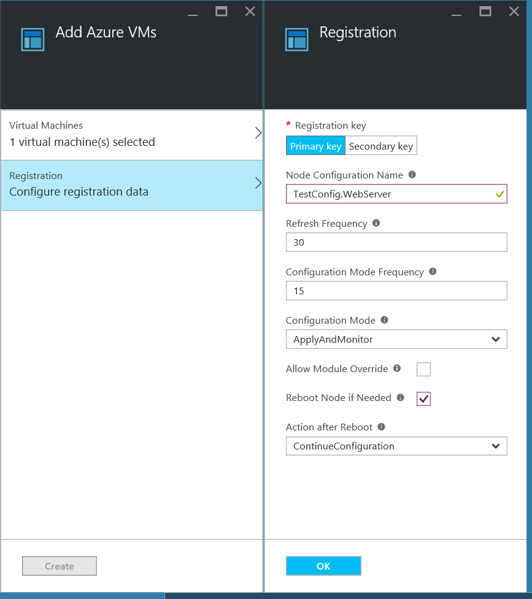
    
    Die Konfiguration der Knoten die angegebene auf den virtuellen Computer durch die **Konfiguration Modus Häufigkeit**angegebenen Intervall angewendet werden, und der virtuellen Computer wird nach Updates suchen, an der Knotenkonfiguration durch die **Häufigkeit aktualisieren**angegebenen Intervall aktivieren. Weitere Informationen darüber, wie diese Werte verwendet werden finden Sie unter [Konfigurieren der lokalen Konfigurations-Manager](https://msdn.microsoft.com/PowerShell/DSC/metaConfig).
    
9. Klicken Sie in das Blade **Hinzufügen Azure virtuellen Computern** auf **Erstellen**.

Azure wird den Vorgang des Onboarding den virtuellen Computer gestartet. Wenn es abgeschlossen ist, wird der virtuellen Computer in vorher **DSC-Knoten** in der Automatisierung Konto angezeigt.

## <a name="viewing-the-list-of-dsc-nodes"></a>Anzeigen der Liste der DSC Knoten

Sie können die Liste aller Computer anzeigen, die für die Verwaltung Ihres Kontos Automatisierung in das Blade **DSC Knoten** Onboarded wurden.

1. Melden Sie sich mit dem [Azure-Portal](https://portal.azure.com)aus.

2. Klicken Sie im Menü Hub auf **alle Ressourcen** , und klicken Sie dann den Namen Ihres Kontos Automatisierung.

3. Klicken Sie auf das **Konto Automatisierung** Blade **DSC-Knoten**aus.

## <a name="viewing-reports-for-dsc-nodes"></a>Anzeigen von Berichten für DSC Knoten

Jedes Mal Azure Automatisierung DSC eine Überprüfung Konsistenz für einen verwalteten Knoten, führt sendet der Knoten einen Statusbericht an den Server abrufen. Sie können diese Berichte auf dem Blade für diesen Knoten anzeigen.

1. Melden Sie sich mit dem [Azure-Portal](https://portal.azure.com)aus.

2. Klicken Sie im Menü Hub auf **alle Ressourcen** , und klicken Sie dann den Namen Ihres Kontos Automatisierung.

3. Klicken Sie auf das **Konto Automatisierung** Blade **DSC-Knoten**aus.

4. Klicken Sie auf die Kachel **Berichte** auf die Berichte in der Liste auf.

    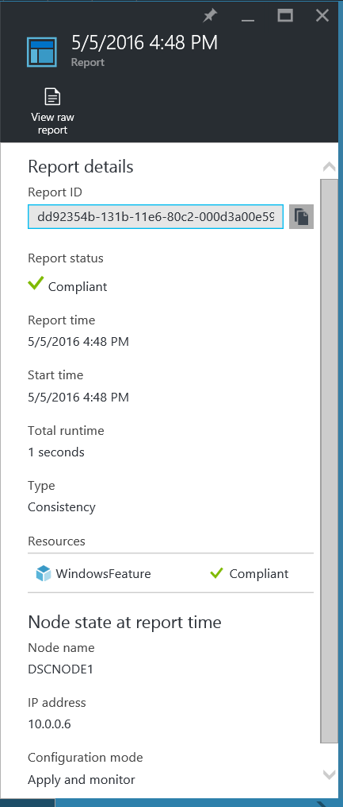

Klicken Sie auf das Blade für eine einzelne Bericht sehen Sie die folgenden Statusinformationen bei der entsprechenden Konsistenz-Überprüfung:

- Der Berichtstatus –, ob der Knoten "Kompatibel", "Fehlgeschlagen", die Konfiguration ist oder der Knoten "Nicht kompatibel. ist" (wenn der Knoten befindet sich im **Applyandmonitor** Modus und Computer nicht im gewünschten Status ist).
- Überprüfen Sie die Startzeit für die Konsistenz.
- Gesamten Laufzeit für die Konsistenz-Überprüfung.
- Die Art des Konsistenz überprüfen.
- Fehler, einschließlich der Fehlercode und eine Fehlermeldung angezeigt. 
- DSC Ressourcen verwendet die Konfiguration, und der Status der einzelnen Ressourcen (gibt an, ob der Knoten im gewünschten Status für die betreffende Ressource ist) – klicken Sie auf jede Ressource um ausführlichere Informationen für diese Ressource zu erhalten.
- Der Name, IP-Adresse und Konfigurationsmodus des Knotens.

Sie können auch **unformatierten Bericht anzeigen** , um die tatsächlichen Daten anzuzeigen, die auf dem Server der Knoten sendet klicken. Weitere Informationen zu diesen Daten verwenden finden Sie unter [einen Berichtsserver DSC verwenden](https://msdn.microsoft.com/powershell/dsc/reportserver).

Es dauert einige Zeit, nachdem ein Knoten Onboarded ist, bevor der erste Bericht zur Verfügung steht. Möglicherweise müssen Sie bis zu 30 Minuten für den ersten Bericht nach dem integrierten einen Knoten warten.

## <a name="reassigning-a-node-to-a-different-node-configuration"></a>Neuzuweisen von einem Knoten zu einer anderen Knotenkonfiguration

Sie können einen Knoten mit einer anderen Knotenkonfiguration als die, die Sie ursprünglich zugewiesen zuweisen.

1. Melden Sie sich mit dem [Azure-Portal](https://portal.azure.com)aus.

2. Klicken Sie im Menü Hub auf **alle Ressourcen** , und klicken Sie dann den Namen Ihres Kontos Automatisierung.

3. Klicken Sie auf das **Konto Automatisierung** Blade **DSC-Knoten**aus.

4. Klicken Sie auf das Blade **DSC Knoten** auf den Namen des Knotens ein, die Sie neu zuweisen möchten.

5. Klicken Sie auf das Blade für diesen Knoten klicken Sie auf **Knoten zuweisen**.

    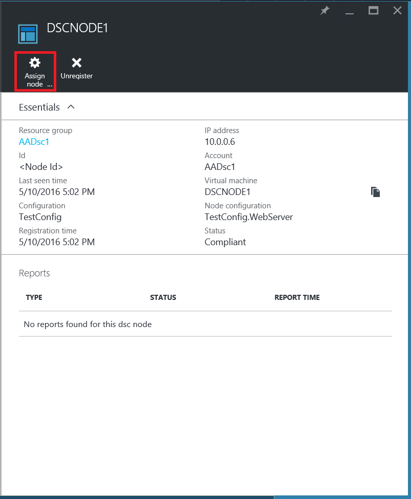

6. Klicken Sie auf das Blade **Knotenkonfiguration zuweisen** wählen Sie die Knotenkonfiguration, die Sie den Knoten zuweisen möchten, und klicken Sie dann auf **OK**.

    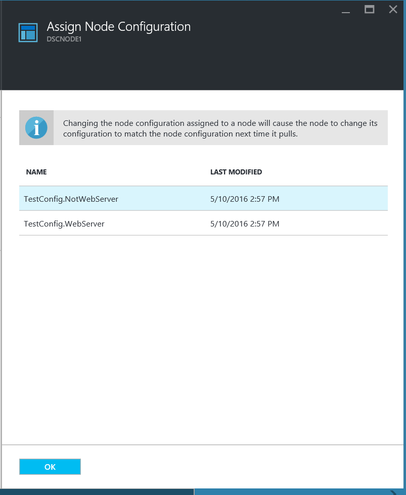
    
## <a name="unregistering-a-node"></a>Aufheben der Registrierung von einem Knoten

Wenn Sie einen Knoten von Azure Automatisierung DSC verwaltet werden nicht mehr benötigen, können Sie die Registrierung aufheben.

1. Melden Sie sich mit dem [Azure-Portal](https://portal.azure.com)aus.

2. Klicken Sie im Menü Hub auf **alle Ressourcen** , und klicken Sie dann den Namen Ihres Kontos Automatisierung.

3. Klicken Sie auf das **Konto Automatisierung** Blade **DSC-Knoten**aus.

4. Klicken Sie auf das Blade **DSC Knoten** klicken Sie auf den Namen des Knotens werden aufgehoben werden soll.

5. Klicken Sie auf das Blade für diesen Knoten klicken Sie auf **Registrierung**.

    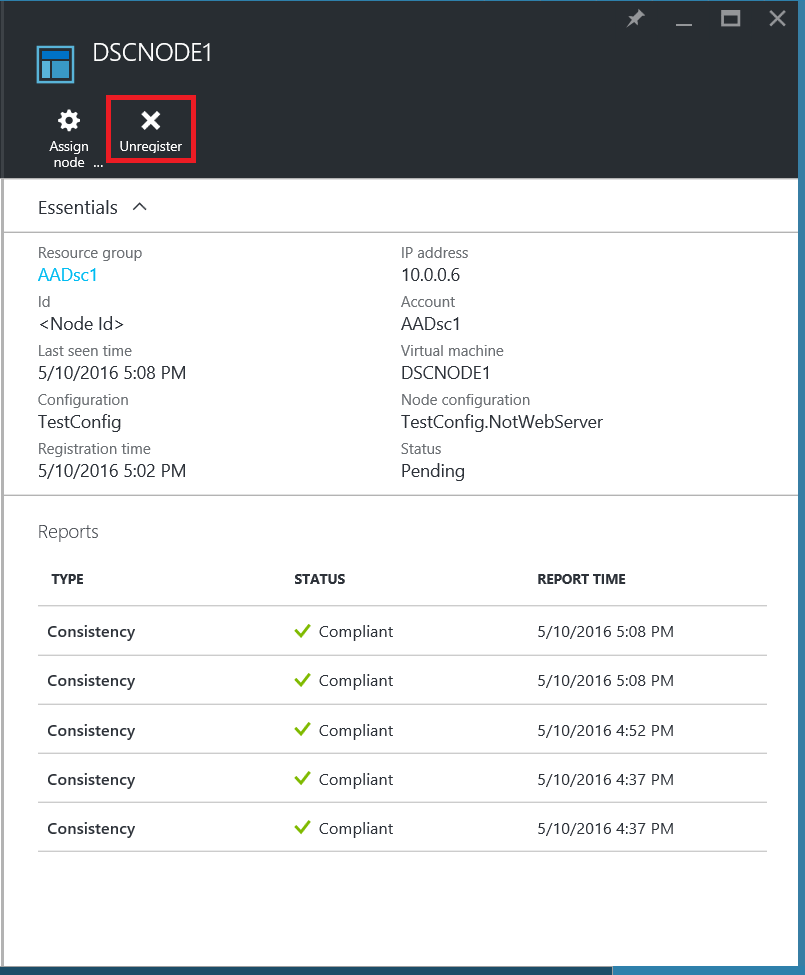

## <a name="related-articles"></a>Verwandte Artikel
* [Azure Automatisierung DSC (Übersicht)](automation-dsc-overview.md)
* [Onboarding Autos für die Verwaltung durch Azure Automatisierung DSC](automation-dsc-onboarding.md)
* [Windows PowerShell gewünscht staatliche Konfiguration (Übersicht)](https://msdn.microsoft.com/powershell/dsc/overview)
* [Azure Automatisierung DSC-cmdlets](https://msdn.microsoft.com/library/mt244122.aspx)
* [Azure Automatisierung DSC Preise](https://azure.microsoft.com/pricing/details/automation/)

