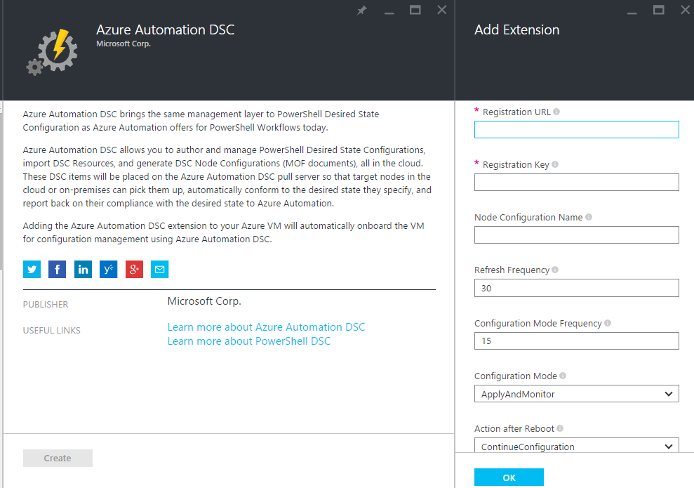
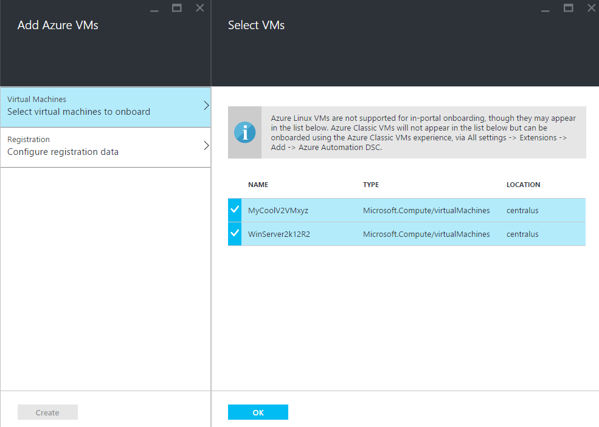
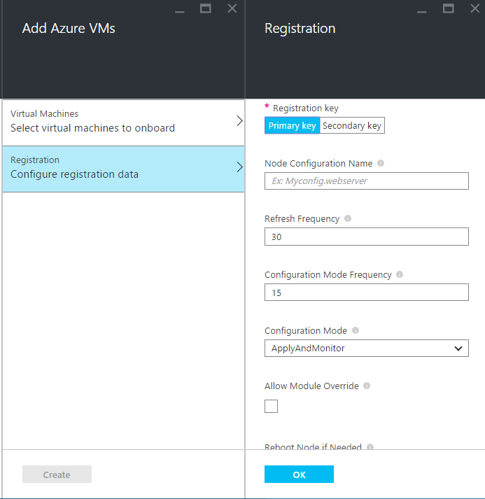
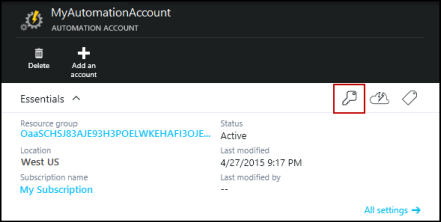
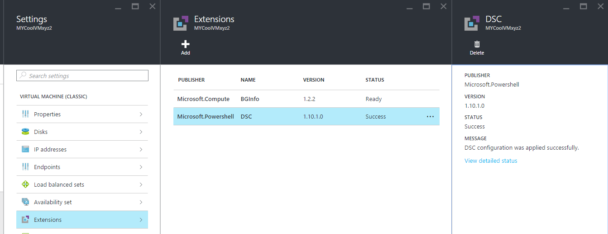

<properties 
   pageTitle="Onboarding physischen und virtuellen Computern für die Verwaltung durch Azure Automatisierung DSC | Microsoft Azure" 
   description="Zum Einrichten der Computer für die Verwaltung von mit Azure Automatisierung DSC" 
   services="automation" 
   documentationCenter="dev-center-name" 
   authors="coreyp-at-msft" 
   manager="stevenka" 
   editor="tysonn"/>

<tags
   ms.service="automation"
   ms.devlang="NA"
   ms.topic="article"
   ms.tgt_pltfrm="powershell"
   ms.workload="TBD" 
   ms.date="04/22/2016"
   ms.author="coreyp"/>

# Onboarding Autos für die Verwaltung durch Azure Automatisierung DSC

## Gründe für das Verwalten von Autos mit Azure Automatisierung DSC

Wie [PowerShell gewünscht Zustand Konfiguration](https://technet.microsoft.com/library/dn249912.aspx)ist Azure Automatisierung gewünscht Zustand Konfiguration eine einfache, aber leistungsfähige, Konfiguration Verwaltungsdienst für DSC Knoten (physischen und virtuellen Computern) in der Cloud oder lokalen Datencenters. Sie können Skalierbarkeit über Tausende von Autos schnell und einfach von einem zentralen, sicheren Ort. Können Sie problemlos integrierte Maschinen, zuweisen, die diese deklarativen Konfigurationen und Anzeigen von Berichten mit jeder Computer des Compliance zum gewünschten Status, die, den Sie angegeben haben. Die Azure Automatisierung DSC Managementebene befindet sich DSC was der Azure Automatisierung Management Layer zu PowerShell-Skripting. Kurzum, auf die gleiche Weise, mit dem Azure Automatisierung Sie PowerShell-Skripts verwalten können, ist es hilfreich auch Sie DSC Konfigurationen verwalten. Erfahren Sie mehr über die Vorteile der Verwendung von Azure Automatisierung DSC, finden Sie unter [Übersicht über die Azure Automatisierung DSC](automation-dsc-overview.md). 

Azure Automatisierung DSC kann zum Verwalten von einer Vielzahl von Autos verwendet werden:

*    Azure-virtuellen Computern (klassisch)
*    Azure-virtuellen Computern
*    Amazon Web Services (AWS) virtuellen Computern
*    Windows physischen/virtuellen Computern lokal oder in der Cloud als Azure/AWS
*    Linux physischen/virtuellen Computern lokal in Azure oder in einen Cloud als Azure

Wenn Sie nicht zum Verwalten der Konfiguration des Computers aus der Cloud bereit sind, können darüber hinaus Azure Automatisierung DSC auch als einen Bericht nur Endpunkt verwendet. So können Sie (Pushbenachrichtigungen) die gewünschte Konfiguration über DSC lokalen festlegen und Anzeigen von Rich-Berichtsdetails auf Knoten Einhaltung der gewünschten Status in Azure Automatisierung.

Den folgenden Abschnitten wird beschrieben, wie Sie jeden Typ des Computers zum Azure Automatisierung DSC integrierte können.

## Azure-virtuellen Computern (klassisch)

Mit Azure Automatisierung DSC können Sie problemlos integrierte-Azure-virtuellen Computern (klassisch) für Konfigurations-Management mit dem Azure-Portal oder einem PowerShell aus. Erweiterte Einstellungen, und ohne ein Administrator remote in den virtuellen Computer müssen registriert die Erweiterung Azure virtueller Computer gewünscht Zustand Konfiguration den virtuellen Computer mit Azure Automatisierung DSC an. Da die Erweiterung Azure virtueller Computer gewünscht Zustand Konfiguration ausführt, Schritte aus, um den Fortschritt nachverfolgen oder Behandeln von Problemen mit asynchronen, es werden bereitgestellt im Abschnitt [**Problembehandlung Azure-virtuellen Computern Onboarding**](#troubleshooting-azure-virtual-machine-onboarding) .

### Azure-portal

Klicken Sie auf **Durchsuchen**, im [Portal Azure](http://portal.azure.com/)- -> **virtuellen Computern (klassische)**. Wählen Sie den Windows virtuellen Computer integrierten soll. Klicken Sie auf **Alle Einstellungen**des virtuellen Computers Dashboard Blade, -> **Erweiterungen** -> **Hinzufügen** -> **Azure Automatisierung DSC** -> **Erstellen**. Geben Sie die [Werte PowerShell DSC lokale Konfigurations-Manager](https://msdn.microsoft.com/powershell/dsc/metaconfig4) für Ihre Anwendungsfall-, Ihres Kontos Automatisierung Registrierungsschlüssel und Registrierung URL und optional eine Knotenkonfiguration zuweisen an den virtuellen Computer erforderlich.

Um die Registrierung finden-Konto URL und Schlüssel für die Automatisierung zu integrierten den Computer, um den Abschnitt [**sichere Registrierung**](#secure-registration) anzuzeigen.

### PowerShell

    # log in to both Azure Service Management and Azure Resource Manager
    Add-AzureAccount
    Add-AzureRmAccount
    
    # fill in correct values for your VM/Automation account here
    $VMName = ""
    $ServiceName = ""
    $AutomationAccountName = ""
    $AutomationAccountResourceGroup = ""

    # fill in the name of a Node Configuration in Azure Automation DSC, for this VM to conform to
    $NodeConfigName = ""

    # get Azure Automation DSC registration info
    $Account = Get-AzureRmAutomationAccount -ResourceGroupName $AutomationAccountResourceGroup -Name $AutomationAccountName
    $RegistrationInfo = $Account | Get-AzureRmAutomationRegistrationInfo

    # use the DSC extension to onboard the VM for management with Azure Automation DSC
    $VM = Get-AzureVM -Name $VMName -ServiceName $ServiceName
    
    $PublicConfiguration = ConvertTo-Json -Depth 8 @{
      SasToken = ""
      ModulesUrl = "https://eus2oaasibizamarketprod1.blob.core.windows.net/automationdscpreview/RegistrationMetaConfigV2.zip"
      ConfigurationFunction = "RegistrationMetaConfigV2.ps1\RegistrationMetaConfigV2"

    # update these PowerShell DSC Local Configuration Manager defaults if they do not match your use case.
    # See https://technet.microsoft.com/library/dn249922.aspx?f=255&MSPPError=-2147217396 for more details
     Properties = @{
        RegistrationKey = @{
          UserName = 'notused'
          Password = 'PrivateSettingsRef:RegistrationKey'
        }
        RegistrationUrl = $RegistrationInfo.Endpoint
        NodeConfigurationName = $NodeConfigName
        ConfigurationMode = "ApplyAndMonitor"
        ConfigurationModeFrequencyMins = 15
        RefreshFrequencyMins = 30
        RebootNodeIfNeeded = $False
        ActionAfterReboot = "ContinueConfiguration"
        AllowModuleOverwrite = $False
      }
    }

    $PrivateConfiguration = ConvertTo-Json -Depth 8 @{
      Items = @{
         RegistrationKey = $RegistrationInfo.PrimaryKey
      }
    }
    
    $VM = Set-AzureVMExtension `
     -VM $vm `
     -Publisher Microsoft.Powershell `
     -ExtensionName DSC `
     -Version 2.19 `
     -PublicConfiguration $PublicConfiguration `
     -PrivateConfiguration $PrivateConfiguration `
     -ForceUpdate

    $VM | Update-AzureVM

## Azure-virtuellen Computern

Azure Automatisierung DSC können Sie problemlos integrierten Azure-virtuellen Computern für die Verwaltung der Konfiguration von Azure-Portal, Azure Ressourcenmanager Vorlagen oder PowerShell. Erweiterte Einstellungen, und ohne ein Administrator remote in den virtuellen Computer müssen registriert die Erweiterung Azure virtueller Computer gewünscht Zustand Konfiguration den virtuellen Computer mit Azure Automatisierung DSC an. Da die Erweiterung Azure virtueller Computer gewünscht Zustand Konfiguration ausführt, Schritte aus, um den Fortschritt nachverfolgen oder Behandeln von Problemen mit asynchronen, es werden bereitgestellt im Abschnitt [**Problembehandlung Azure-virtuellen Computern Onboarding**](#troubleshooting-azure-virtual-machine-onboarding) .

### Azure-portal

Navigieren Sie im [Azure-Portal](https://portal.azure.com/)mit dem Automatisierung Azure-Konto, in dem Sie integrierten virtuellen Computern möchten. Klicken Sie auf dem Dashboard Automatisierung Konto, auf **DSC Knoten** -> **Hinzufügen Azure virtueller Computer**.

Wählen Sie unter **virtueller Computer für die integrierten auswählen**eine oder mehrere Azure-virtuellen Computern zu integrierten ein.

Geben Sie unter **Konfigurieren Registrierungsdaten**die [Werte der PowerShell DSC lokale Konfigurations-Manager](https://msdn.microsoft.com/powershell/dsc/metaconfig4) für Ihre Anwendungsfall-, und optional eine Knotenkonfiguration erforderlich ist, den virtuellen Computer zuweisen aus.

 
### Azure Ressourcenmanager Vorlagen

Azure-virtuellen Computern bereitgestellt werden kann und Onboarded zu Azure Automatisierung DSC über Ressourcenmanager Azure-Vorlagen. Finden Sie unter [Konfigurieren eines virtuellen Computers über DSC Erweiterung und Azure Automatisierung DSC](https://azure.microsoft.com/documentation/templates/dsc-extension-azure-automation-pullserver/) eine Beispielvorlage dieser Onboards einer vorhandenen virtuellen Computer zu Azure Automatisierung DSC. Zum Suchen von Registrierungsschlüssel und Registrierung URL erfasste als Eingabe in dieser Vorlage finden Sie im Abschnitt [**sichere Registrierung**](#secure-registration) .

### PowerShell

Integrierte virtuellen Computern im Azure-Portal über PowerShell kann das Cmdlet [Register-AzureRmAutomationDscNode](https://msdn.microsoft.com/library/mt603833.aspx) verwendet werden.

## Amazon Web Services (AWS) virtuellen Computern

Sie können ganz einfach integrierten Amazon-Webdiensten virtuellen Computern für die Verwaltung der Konfiguration von Azure Automatisierung DSC mithilfe des AWS DSC Toolkits. Erfahren Sie mehr über das Toolkit [hier](https://blogs.msdn.microsoft.com/powershell/2016/04/20/aws-dsc-toolkit/).

## Windows physischen/virtuellen Computern lokal oder in der Cloud als Azure/AWS

Lokale Windows-Computern und Windows-Computern im nicht Azure Wolken (z. B. Amazon-Webdiensten) können auch Onboarded zu Azure Automatisierung DSC, sein, solange sie mit dem Internet, per wenigen einfachen Schritten ausgehende zugreifen können:

1. Stellen Sie sicher, dass die neueste Version von [WMF 5](http://aka.ms/wmf5latest) auf den Computern installiert ist, die Sie zum Azure Automatisierung DSC integrierten möchten.
2. Führen Sie die Anweisungen im Abschnitt [**Generieren von DSC Metaconfigurations**](#generating-dsc-metaconfigurations) unten zu einen Ordner, enthält die benötigten DSC Metaconfigurations generieren.
3. Wenden Sie die PowerShell DSC Metaconfiguration per Remotezugriff auf den Computern, die Sie integrierte möchten. **Der Computer, die, dem von dieser Befehl ausgeführt wird, müssen die neueste Version von [WMF 5](http://aka.ms/wmf5latest) installiert**:

    `Set-DscLocalConfigurationManager -Path C:\Users\joe\Desktop\DscMetaConfigs -ComputerName MyServer1, MyServer2`

4. Wenn Sie die PowerShell DSC Metaconfigurations Remote anwenden können, kopieren Sie den Ordner Metaconfigurations aus Schritt 2 auf jedem Computer, auf integrierte. **Set-DscLocalConfigurationManager** dann lokal auf jedem Computer auf integrierte aufrufen.
5. Überprüfen Sie mithilfe der Azure-Portal oder Cmdlets, dass der Computer integrierten jetzt als DSC-Knoten in Ihrem Automatisierung Azure-Konto registriert angezeigt.

## Linux physischen/virtuellen Computern lokal in Azure oder in einen Cloud als Azure

Lokale Linux Maschinen, Linux in Azure-Computern und Linux in Wolken nicht Azure-Computern können auch Onboarded zu Azure Automatisierung DSC, sein, solange sie mit dem Internet, per wenigen einfachen Schritten ausgehende zugreifen können:

1. Stellen Sie sicher, dass die neueste Version des [DSC Linux-Agents](http://www.microsoft.com/download/details.aspx?id=49150) auf den Computern installiert ist, die Sie zum Azure Automatisierung DSC integrierten möchten.

2. Wenn die [Standardeinstellungen PowerShell DSC lokale Konfigurations-Manager](https://msdn.microsoft.com/powershell/dsc/metaconfig4) entsprechen der Anwendungsfall-, und zur integrierten Maschinen beispielsweise, dass **sowohl** , ziehen Sie aus, und melden Sie Azure Automatisierung DSC:

    *    Verwenden Sie auf jedem Linux Computer auf integrierte zu Azure Automatisierung DSC Register.py, um integrierte unter Verwendung der Standardeinstellungen PowerShell DSC lokale Konfigurations-Manager:

        `/opt/microsoft/dsc/Scripts/Register.py <Automation account registration key> <Automation account registration URL>`

    *    Die Registrierungsschlüssel sowie die URL der Registrierung für Ihr Konto Automatisierung finden Sie im Abschnitt [**sichere Registrierung**](#secure-registration) .

    Wenn der PowerShell DSC lokale Konfigurations-Manager **kann** **keine** Übereinstimmung standardmäßig, die Ihre Anwendungsfall-, oder Sie integrierte Autos möchten, dass er nur zu Azure Automatisierung DSC melden, führen Sie aber nicht Abruf Konfiguration oder Module PowerShell daraus, führen Sie die Schritte 3-6. Fahren Sie andernfalls direkt mit Schritt 6 fort.

3.  Führen Sie die Anweisungen im Abschnitt [**Metaconfigurations DSC Generieren von**](#generating-dsc-metaconfigurations) unten, um einen Ordner, enthält die benötigten DSC Metaconfigurations generieren.
4.  Remote Anwenden der PowerShell DSC Metaconfiguration auf den Computern, die Sie integrierte möchten:
        
        $SecurePass = ConvertTo-SecureString -String "<root password>" -AsPlainText -Force
        $Cred = New-Object System.Management.Automation.PSCredential "root", $SecurePass
        $Opt = New-CimSessionOption -UseSsl -SkipCACheck -SkipCNCheck -SkipRevocationCheck

        # need a CimSession for each Linux machine to onboard
        
        $Session = New-CimSession -Credential $Cred -ComputerName <your Linux machine> -Port 5986 -Authentication basic -SessionOption $Opt
        
        Set-DscLocalConfigurationManager -CimSession $Session –Path C:\Users\joe\Desktop\DscMetaConfigs
    
Der Computer, die, dem von dieser Befehl ausgeführt wird, müssen die neueste Version von [WMF 5](http://aka.ms/wmf5latest) installiert.

5.  Wenn Sie der PowerShell DSC Metaconfigurations Remote, für jeden Linux-System integriert, kopieren Sie die entsprechende auf diesem Computer im Ordner in Schritt 5 auf dem Computer Linux Metaconfiguration anwenden können. Klicken Sie dann auf Anrufen `SetDscLocalConfigurationManager.py` lokal auf jedem Computer Linux gewünschte zu integrierten zu Azure Automatisierung DSC:

    `/opt/microsoft/dsc/Scripts/SetDscLocalConfigurationManager.py –configurationmof <path to metaconfiguration file>`

6.  Überprüfen Sie mithilfe der Azure-Portal oder Cmdlets, dass der Computer integrierten jetzt als DSC-Knoten in Ihrem Automatisierung Azure-Konto registriert angezeigt.

##DSC Metaconfigurations generieren
In generisch integrierten einem beliebigen Computer zu Azure Automatisierung DSC, eine DSC Metaconfiguration kann werden generiert, die, wenn angewendet wird, wird den DSC-Agent auf dem Computer zu extrahieren von und/oder eines Berichts zu Azure Automatisierung DSC. DSC Metaconfigurations für Azure Automatisierung DSC können entweder eine PowerShell DSC Konfiguration oder die Azure Automatisierung PowerShell-Cmdlets generiert werden.

**Hinweis:** DSC Metaconfigurations enthalten die Kennwörter zu integrierten ein Computer für eine Automatisierung Management berücksichtigen erforderlich. Vergewissern Sie sich, alle DSC Metaconfigurations ordnungsgemäß zu schützen, die Sie erstellen oder löschen sie nach der Verwendung.

###Verwenden einer DSC-Konfigurations
1.  Öffnen Sie die PowerShell ISE als Administrator in einem Computer in Ihrer lokalen Umgebung an. Der Computer muss die neueste Version von [WMF 5](http://aka.ms/wmf5latest) installiert verfügen.

2.  Kopieren Sie das folgende Skript lokal. Dieses Skript enthält eine PowerShell DSC Konfiguration zum Erstellen von Metaconfigurations und einen Befehl zum Deaktivieren der Erstellung Metaconfiguration Starten eines.
    
        # The DSC configuration that will generate metaconfigurations
        [DscLocalConfigurationManager()]
        Configuration DscMetaConfigs 
        { 
            param 
            ( 
                [Parameter(Mandatory=$True)] 
                [String]$RegistrationUrl,
         
                [Parameter(Mandatory=$True)] 
                [String]$RegistrationKey,

                [Parameter(Mandatory=$True)] 
                [String[]]$ComputerName,

                [Int]$RefreshFrequencyMins = 30, 
            
                [Int]$ConfigurationModeFrequencyMins = 15, 
            
                [String]$ConfigurationMode = "ApplyAndMonitor", 
            
                [String]$NodeConfigurationName,

                [Boolean]$RebootNodeIfNeeded= $False,

                [String]$ActionAfterReboot = "ContinueConfiguration",

                [Boolean]$AllowModuleOverwrite = $False,

                [Boolean]$ReportOnly
            )

    
            if(!$NodeConfigurationName -or $NodeConfigurationName -eq "") 
            { 
                $ConfigurationNames = $null 
            } 
            else 
            { 
                $ConfigurationNames = @($NodeConfigurationName) 
            }

            if($ReportOnly)
            {
               $RefreshMode = "PUSH"
            }
            else
            {
               $RefreshMode = "PULL"
            }

            Node $ComputerName
            {

                Settings 
                { 
                    RefreshFrequencyMins = $RefreshFrequencyMins 
                    RefreshMode = $RefreshMode 
                    ConfigurationMode = $ConfigurationMode 
                    AllowModuleOverwrite = $AllowModuleOverwrite 
                    RebootNodeIfNeeded = $RebootNodeIfNeeded 
                    ActionAfterReboot = $ActionAfterReboot 
                    ConfigurationModeFrequencyMins = $ConfigurationModeFrequencyMins 
                }

                if(!$ReportOnly)
                {
                   ConfigurationRepositoryWeb AzureAutomationDSC 
                    { 
                        ServerUrl = $RegistrationUrl 
                        RegistrationKey = $RegistrationKey 
                        ConfigurationNames = $ConfigurationNames 
                    }

                    ResourceRepositoryWeb AzureAutomationDSC 
                    { 
                       ServerUrl = $RegistrationUrl 
                       RegistrationKey = $RegistrationKey 
                    }
                }

                ReportServerWeb AzureAutomationDSC 
                { 
                    ServerUrl = $RegistrationUrl 
                    RegistrationKey = $RegistrationKey 
                }
            } 
        }
        
        # Create the metaconfigurations
        # TODO: edit the below as needed for your use case
        $Params = @{
             RegistrationUrl = '<fill me in>';
             RegistrationKey = '<fill me in>';
             ComputerName = @('<some VM to onboard>', '<some other VM to onboard>');
             NodeConfigurationName = 'SimpleConfig.webserver';
             RefreshFrequencyMins = 30;
             ConfigurationModeFrequencyMins = 15;
             RebootNodeIfNeeded = $False;
             AllowModuleOverwrite = $False;
             ConfigurationMode = 'ApplyAndMonitor';
             ActionAfterReboot = 'ContinueConfiguration';
             ReportOnly = $False;  # Set to $True to have machines only report to AA DSC but not pull from it
        }
        
        # Use PowerShell splatting to pass parameters to the DSC configuration being invoked
        # For more info about splatting, run: Get-Help -Name about_Splatting
        DscMetaConfigs @Params

3.  Füllen Sie die Registrierungsschlüssel sowie die URL für Ihr Konto Automatisierung sowie den Namen der Computer auf integrierte. Alle anderen Parameter sind optional. Die Registrierungsschlüssel sowie die URL der Registrierung für Ihr Konto Automatisierung finden Sie im Abschnitt [**sichere Registrierung**](#secure-registration) .

4.  Wenn Sie möchten die Computer DSC Status Daten Azure Automatisierung DSC melden, aber nicht extrahieren, Konfiguration oder Module PowerShell, setzen Sie den Parameter **ReportOnly** auf True.

5.  Führen Sie das Skript. Sie sollten jetzt einen Ordner namens **DscMetaConfigs** in Ihrem Arbeitsverzeichnis, verfügen, enthält der PowerShell DSC Metaconfigurations für den Computer integrierten.

###Verwenden der Automatisierung Azure-cmdlets
Wenn die Standardeinstellungen PowerShell DSC lokale Konfigurations-Manager der Anwendungsfall-entsprechen, und Sie integrierte Maschinen möchten, sodass beide herausziehen aus und eines zu Azure Automatisierung DSC Berichts, bieten die Cmdlets Azure Automatisierung eine vereinfachte Methode zum Generieren der DSC Metaconfigurations erforderlich:

1.  Öffnen Sie die PowerShell-Konsole oder PowerShell ISE als Administrator in einem Computer in Ihrer lokalen Umgebung an.

2.  Verbinden Sie zu Azure-Ressourcenmanager mithilfe der **Hinzufügen-AzureRmAccount**

3.  Laden Sie die PowerShell DSC Metaconfigurations für die gewünschten Computer auf integrierte aus dem Automatisierung-Konto, das Sie integrierten Knoten möchten:

        # Define the parameters for Get-AzureRmAutomationDscOnboardingMetaconfig using PowerShell Splatting
        $Params = @{
            ResourceGroupName = 'ContosoResources'; # The name of the ARM Resource Group that contains your Azure Automation Account
            AutomationAccountName = 'ContosoAutomation'; # The name of the Azure Automation Account where you want a node on-boarded to
            ComputerName = @('web01', 'web02', 'sql01'); # The names of the computers that the meta configuration will be generated for
            OutputFolder = "$env:UserProfile\Desktop\";
        }
        
        # Use PowerShell splatting to pass parameters to the Azure Automation cmdlet being invoked
        # For more info about splatting, run: Get-Help -Name about_Splatting
        Get-AzureRmAutomationDscOnboardingMetaconfig @Params

Sie sollten jetzt einen Ordner namens ***DscMetaConfigs***, mit der PowerShell DSC Metaconfigurations für den Computer integrierten verfügen.

##Sichere Registrierung

Maschinen können sichere integrierte mit einer Firma Azure Automatisierung über das WMF 5 DSC Registrierung Protokoll, das ein DSC Knoten mit PowerShell DSC Version 2 Ziehen oder Reporting Server (einschließlich Azure Automatisierung DSC) authentifiziert zulässt. Der Knoten registriert auf dem Server bei einer **Registrierung URL**authentifizieren über einen **Registrierungsschlüssel**. Während der Registrierung handeln DSC Knoten und DSC Abruf/Berichtsserver ein eindeutigen Zertifikat für diesen Knoten zur Authentifizierung an den Server nach der Registrierung verwendet. Dieses Verfahren wird verhindert, dass Onboarded Knoten aus Identitätswechsel eine aus einer anderen, beispielsweise wenn ein Knoten gefährdet wird und die Absicht verhält. Nach der Registrierung der Registrierungsschlüssel zur Authentifizierung erneut nicht verwendet wird, und aus dem Knoten gelöscht.

Sie können die Informationen für das Protokoll DSC Registrierung vorher **Schlüssel verwalten** in der Vorschau Azure-Portal erhalten. Öffnen Sie diese Blade, indem Sie auf das Key Symbol in der Systemsteuerung **Essentials** für das Konto Automatisierung.

*    Registrierungsinformationen URL ist das Feld URL in das Blade Schlüssel verwalten.
*    Registrierungsschlüssel ist die Access-Primärschlüssel oder sekundäre Zugriffstaste in das Blade Schlüssel verwalten. Entweder Schlüssel kann verwendet werden.

Zur Erhöhung der Sicherheit können die primären und sekundären Zugriffstasten eines Kontos Automatisierung zu einem beliebigen Zeitpunkt (auf das Blade **Schlüssel verwalten** ) generiert werden, um zu verhindern, dass zukünftige Knoten Registrierungen mithilfe der vorherigen Schlüssel ist.

##Problembehandlung bei Onboarding Azure-virtuellen Computern

Azure Automatisierung DSC können Sie ganz einfach integrierten Azure Windows-virtuellen Computern für die Verwaltung der Konfiguration. Erweiterte Einstellungen wird die Erweiterung Azure virtueller Computer gewünscht Zustand Konfiguration verwendet, um den virtuellen Computer mit Azure Automatisierung DSC zu registrieren. Da die Konfiguration von Azure virtueller Computer gewünscht Zustand Erweiterung asynchrone ausgeführt wird, möglicherweise seine Fortschritts und seine Ausführung Problembehandlung wichtig. 

>[AZURE.NOTE] Andere Methoden zum Onboarding einer Windows Azure virtueller Computer, um Azure Automatisierung DSC, die die Erweiterung Azure virtueller Computer gewünscht Zustand Konfiguration verwendet konnte eine Stunde für den Knoten angezeigt wie in Azure Automatisierung registriert bis dauern. Dies ist aufgrund der Installation von Windows Management Framework 5.0 des virtuellen Computers von der Azure-virtuellen Computer DSC-Erweiterung, die auf integrierte erforderlich ist den virtuellen Computer zu Azure Automatisierung DSC.

Zum Behandeln von Problemen mit oder Anzeigen des Status der Erweiterung Azure virtueller Computer gewünscht Zustand Konfiguration, die Azure Portal navigieren Sie zu dem virtuellen Computer Onboarded wird, und klicken Sie dann auf -> **Alle Einstellungen** -> **Erweiterungen** -> **DSC**. Weitere Informationen hierzu können Sie einen **detaillierten Status anzeigen**klicken.

## Ablauf von Zertifikaten und erneute

Nach der Registrierung von eines Computers als DSC Knoten in Azure Automatisierung DSC, gibt es eine Reihe von Gründe, warum Sie möglicherweise den Knoten in der Zukunft zu registrieren:

* Nach dem registrieren, handelt jeder Knoten automatisch eine eindeutige Zertifikat für die Authentifizierung, die nach einem Jahr abläuft aus. Derzeit kann nicht das PowerShell DSC Registrierung Protokoll Zertifikate automatisch erneuern, wenn diese Ablauf, daher Sie die Knoten nach einem Jahr Zeit registrieren müssen nähern. Bevor Sie neu registrieren, stellen Sie sicher, dass jeder Knoten Windows Management Framework 5.0 RTM ausgeführt wird. Wenn ein Knoten Authentifizierungszertifikat läuft ab und der Knoten ist nicht registriert, werden der Knoten werden nicht mit Azure Automatisierung kommunizieren und markiert 'Unresponsive'. Erneute durchgeführt 90 Tagen oder kleiner ab dem Zeitpunkt des Zertifikats Ablauf oder an einer beliebigen Stelle nach dem Zertifikat Ablauf ab, führt zu Fehlern in ein neues Zertifikat generiert und verwendet wird.

* So ändern Sie alle [Werte PowerShell DSC lokale Konfigurations-Manager](https://msdn.microsoft.com/powershell/dsc/metaconfig4) , die während der anfänglichen Registrierung von den Knoten, z. B. ConfigurationMode festgelegt wurden. Diese DSC Agent-Werte können derzeit nur durch erneute geändert werden. Die einzige Ausnahme ist, die dem Knoten zugewiesenen Knoten-Konfiguration – dies kann geändert werden in Azure Automatisierung DSC direkt aus.

Erneute kann auf die gleiche Weise durchgeführt werden Sie zunächst den Knoten registriert verhindert, die in diesem Dokument beschriebenen Onboarding Methoden. Sie müssen keinen Knoten aus Azure Automatisierung DSC Registrierung aufzuheben, bevor Sie neu registrieren es.

## Verwandte Artikel
* [Azure Automatisierung DSC (Übersicht)](automation-dsc-overview.md)
* [Azure Automatisierung DSC-cmdlets](https://msdn.microsoft.com/library/mt244122.aspx)
* [Azure Automatisierung DSC Preise](https://azure.microsoft.com/pricing/details/automation/)

