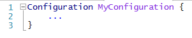
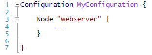
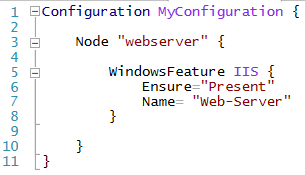
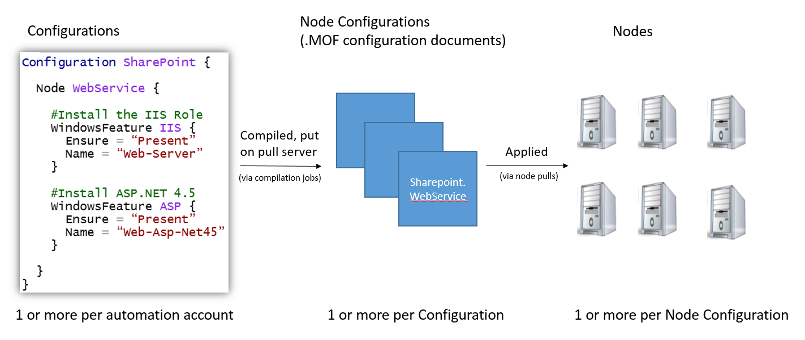
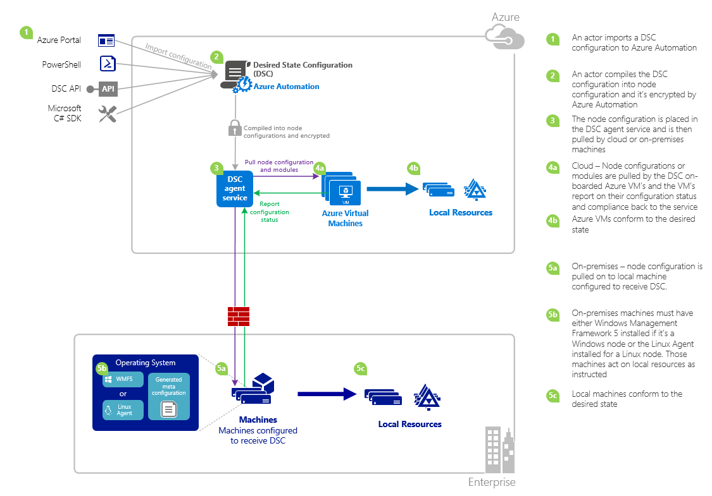

<properties 
   pageTitle="Azure Automatisierung DSC Übersicht | Microsoft Azure" 
   description="Eine Übersicht der Azure Automatisierung gewünscht Zustand Konfiguration (DSC), deren Ausdrücke und bekannte Probleme" 
   services="automation" 
   documentationCenter="dev-center-name" 
   authors="coreyp-at-msft" 
   manager="stevenka" 
   editor="tysonn"
   keywords="PowerShell dsc, Konfiguration gewünschte Status, Powershell dsc Azure"/>

<tags
   ms.service="automation"
   ms.devlang="NA"
   ms.topic="article"
   ms.tgt_pltfrm="powershell"
   ms.workload="TBD" 
   ms.date="05/10/2016"
   ms.author="magoedte;coreyp"/>

# Azure Automatisierung DSC (Übersicht) #

##Was ist die Automatisierung DSC Azure?##
Bereitstellen und Verwalten des gewünschten Status der Server und Anwendungsressourcen langwierig werden können und. Mit Azure Automatisierung gewünschten Zustand Konfiguration (DSC), können Sie konsistente bereitstellen, zuverlässig überwachen und alle Ihre IT-Ressourcen aus der Cloud bei den gewünschten Status automatisch aktualisiert. Auf der Grundlage der PowerShell DSC können Automatisierung DSC Konfiguration des Computers mit einem bestimmten Zustand über physischen und virtuellen Computern (virtuelle Computer), verwenden Windows oder Linux, und in der Cloud oder lokalen ausrichten. Sie können fortlaufender Bereitstellung von IT-Diensten mit konsistent Steuerelement aktivieren und Verwalten von schnellen ändern über Ihre IT-Umgebung für heterogene Hybrid mit Center für erleichterte.

Azure Automatisierung DSC erstellt über die Grundlagen in PowerShell DSC Bereitstellen einer noch einfacher Konfiguration Verwaltungsoption eingeführt werden. Azure Automatisierung DSC bringt derselben Managementebene in [PowerShell gewünscht Zustand Konfiguration](https://msdn.microsoft.com/powershell/dsc/overview) , wie Azure Automatisierung für PowerShell Skripting heute bietet.

Azure Automatisierung DSC ermöglichen Ihnen das [Erstellen und Verwalten von PowerShell gewünscht Zustand Konfigurationen](https://technet.microsoft.com/library/dn249918.aspx), [DSC Ressourcen](https://technet.microsoft.com/library/dn282125.aspx)importieren und DSC Knoten Konfigurationen (MOF-Dokumente), alle in der Cloud zu generieren. Diese Elemente DSC werden, damit Zielknoten (z. B. physischen und virtuellen Computern) in der Cloud oder lokalen können sie abholen, automatisch entsprechen den gewünschten Status, die, den Sie angeben, und melden sich wieder auf die Konformität mit den gewünschten Status auf Azure-Automatisierung auf Azure Automatisierung [DSC extrahieren Server](https://technet.microsoft.com/library/dn249913.aspx) abgelegt.

Möchten Sie lieber auf Lesebereich heraus? Sehen Sie sich die unter Video aus Mai 2015, wann Azure Automatisierung DSC zuerst vorgestellt. **Hinweis:** Während der Konzepte und Lebenszyklus in diesem Video erläutert richtig sind, weist Azure Automatisierung DSC sehr fortgeschritten, da dieses Video aufgezeichnet wurde. Es ist jetzt in der Regel verfügbar, besitzt eine viel umfangreichere Benutzeroberfläche Azure-Portal und viele weitere Funktionen unterstützt.

> [AZURE.VIDEO microsoft-ignite-2015-heterogeneous-configuration-management-using-microsoft-azure-automation]

## Azure Automatisierung DSC Ausdrücke ##
### Konfiguration ###
PowerShell DSC eingeführt, ein neues Konzept namens Konfigurationen. Konfigurationen können Sie über die Syntax der PowerShell, zum gewünschten Status Ihrer Umgebung definieren. Um DSC verwenden, um Ihre Umgebung konfigurieren, zuerst Definieren eines Windows PowerShell-Skript-Blocks mit dem Schlüsselwort Konfiguration, und führen Sie es mit einem Bezeichner, klicken Sie dann mit geschweiften Klammern ({}) zum Begrenzen des Zeitraums.

Innerhalb des Zeitraums Konfiguration können Sie Knoten Konfiguration Blöcke definieren, die angeben, dass die gewünschte Konfiguration für eine Reihe von Knoten (Computer) in Ihrer Umgebung, die sollten genau so konfiguriert ist. Auf diese Weise stellt eine Knotenkonfiguration "Rolle" für einen oder mehrere Knoten anzunehmen. Ein Knoten Konfiguration Block beginnt mit dem Schlüsselwort Knoten. Führen Sie dieses Schlüsselworts mit dem Namen der Rolle, die eine Variable oder einen Ausdruck sein kann. Verwenden Sie nach dem Rollennamen geschweiften Klammern {} zum Begrenzen von des Knoten Konfiguration Blocks ein.

 
Innerhalb des Zeitraums Knoten Konfiguration können Sie die Ressource Bausteinen zum Konfigurieren von bestimmter DSC Ressourcen definieren. Eine Ressource blockieren beginnt mit dem Namen der Ressource, gefolgt von der Kennung, die Sie für den Zeitblock angeben möchten, die und klicken Sie dann geschweifte Klammern {}, um den Textblock zu trennen.

Ausführlichere Informationen über das Schlüsselwort Konfiguration finden Sie unter: [Grundlegendes zu Konfiguration Schlüsselwort Zustand Konfiguration gewünschte](http://blogs.msdn.com/b/powershell/archive/2013/11/05/understanding-configuration-keyword-in-desired-state-configuration.aspx "Grundlegendes zu Konfiguration Schlüsselwort gewünscht Zustand Konfiguration")

Ausführen (Kompilieren) eine DSC Konfiguration erzeugt eine oder mehrere DSC Knoten Konfigurationen (MOF-Dokumente), die sind, was DSC Knoten anwenden, die Einhaltung der gewünschten Status.

Azure Automatisierung DSC ermöglicht, Autor, importieren und Kompilierung DSC Konfigurationen in Azure Automatisierung, ähnlich wie Runbooks importiert werden kann, die verfasst und Azure Automatisierung Schritte.

>[AZURE.IMPORTANT] Eine Konfiguration sollte nur ein Konfiguration-Block mit demselben Namen wie die Konfiguration in Azure Automatisierung DSC enthalten. 

###Knotenkonfiguration###

Wenn eine Konfiguration DSC kompiliert wurde, eine oder mehrere Knoten Konfigurationen je nach der Blöcke Knoten in der Konfiguration Werkzeuge hergestellt werden Eine Knotenkonfiguration ist mit der als "MOF" oder "Konfiguration des Dokuments" (Wenn Sie diese PS DSC Ausdrücken vertraut sind) und "Rolle" darstellt, z. B. Webserver oder Worker, die Bundesstaat gewünscht, einen oder mehrere Knoten nehmen oder Einhaltung überprüfen soll. Namen von Konfigurationen in Azure Automatisierung DSC Knoten werden in der Form von "Name.NodeConfigurationBlockName-Konfiguration".

PS DSC Knoten Knoten Konfigurationen, die sie über die entweder DSC Pushbenachrichtigungen, oder Abruf Methoden widersprechenden sollte bekannt werden. Azure Automatisierung DSC basiert auf der DSC Abruf Methode, ziehen Sie Knoten Anforderung Knoten Konfigurationen, die von der Azure Automatisierung DSC angewendet werden soll, in dem Server. Knoten können sein, da die Knoten die Anfrage an Azure Automatisierung DSC vornehmen möchten, haben Sie hinter Firewalls, alle eingehenden Ports usw. geschlossenen. Sie benötigen nur ausgehenden Zugriff auf das Internet (direkt oder über einen Proxy).

###Knoten###

Alle Computer, auf dem die Konfiguration von DSC verwaltet wird ein DSC-Knoten. Könnte ein Windows oder Linux Azure virtueller Computer lokalen virtuellen Computer / physische Host oder Computer in einem anderen öffentlichen Cloud. Knoten widersprechenden Knoten Konfigurationen um Konvertierung und Verwalten von Compliance mit den gewünschten Status, die, den Sie definieren, und können auch Bericht wieder in einen Berichtsserver über deren Konfigurationsstatus und Compliance im Vergleich zu den gewünschten Status.

Azure Automatisierung DSC Onboarding Knoten für die Verwaltung durch Azure Automatisierung DSC erleichtert und ermöglicht das Ändern der Knotenkonfiguration jedes serverseitige Knoten zugewiesen, damit das nächste Mal ein Knoten wird und nehmen Sie eine andere Rolle ändern geprüft, wie es konfiguriert ist und den Status Konformitätsübersicht Anweisungen auf dem Server es anhand eines Berichts sollte um zu entsprechen.

###Ressource###
DSC Ressourcen sind die Bausteine, die Sie zum Definieren einer Konfigurations von Windows PowerShell gewünscht Zustand Konfiguration (DSC) verwenden können. DSC verfügt über eine Reihe von integrierten Ressourcen wie die Dateien und Ordner, Server-Features und Rollen, registrierungseinstellungen, Umgebungsvariablen und Services und Prozesse. Informationen zu der vollständigen Liste der integrierten DSC Ressourcen und deren Verwendung finden Sie unter [Integrierte Windows PowerShell gewünscht Zustand Konfigurationsressourcen](https://technet.microsoft.com/library/dn249921.aspx).

DSC Ressourcen können auch als Teil der PowerShell-Module das Erweitern des integrierten DSC Ressourcen importiert werden. Nicht standardmäßige Ressourcen werden von DSC Knoten vom Server Abruf DSC abgerufen unten eine Knotenkonfiguration, für die der Knoten vorgesehen ist darin, Verweise auf diese Ressourcen enthält. Informationen zum Erstellen von benutzerdefinierter Ressourcen finden Sie unter [Erstellen benutzerdefinierter Windows PowerShell gewünscht Zustand Konfigurationsressourcen](https://technet.microsoft.com/library/dn249927.aspx).

Azure Automatisierung DSC im Lieferumfang von Ressourcen für alle dieselbe integrierter DSC wie PS DSC unterstützt. Zusätzliche Ressourcen können durch Importieren PowerShell-Module, die mit den Ressourcen in Azure Automatisierung Azure Automatisierung DSC hinzugefügt werden.

###Eine Kompilierung Position###
Eine Kompilierung Position in Azure Automatisierung DSC ist eine Instanz der Kompilierung einer Konfiguration, um eine oder mehrere Knoten Konfigurationen zu erstellen. Diese ähneln Azure Automatisierung Runbooks Aufträge, mit dem Unterschied, dass sie alle Aufgaben mit Ausnahme der zum Erstellen von Konfigurationen Knoten nicht tatsächlich ausführen. Alle Knoten Konfigurationen durch einen Kompilierungsauftrag erstellt werden automatisch auf dem Server der Azure Automatisierung DSC Abruf platziert und frühere Versionen von Konfigurationen Knoten, überschreiben, wenn sie für diese Konfiguration hatten. Der Name des einer Knotenkonfiguration durch einen Kompilierungsauftrag gefertigt hat die Form "ConfigurationName.NodeConfigurationBlockName". Beispielsweise Kompilieren der unterhalb der Konfiguration wären eine einzelnen Knotenkonfiguration namens "MyConfiguration.webserver"

>[AZURE.NOTE] Wie Runbooks können Konfigurationen veröffentlicht werden. Dies ist nicht zum Einfügen von DSC Elementen auf dem Server, Azure Automatisierung DSC Abruf verknüpft. Eine Kompilierungsaufträge verursachen DSC Elemente auf dem Server der Azure Automatisierung DSC Abruf platziert werden. Weitere Informationen über "Veröffentlichen" in Azure Automatisierung finden Sie unter [Veröffentlichen einer Runbooks](https://msdn.microsoft.com/library/dn903765.aspx).

##Azure Automatisierung DSC Lebenszyklus##
In einen verwalteten Satz von ordnungsgemäß konfigurierten Knoten zu wechseln von einem Konto leeren Automatisierung umfasst eine Reihe von Prozessen für Konfigurationen, diese Konfigurationen in Knoten Konfigurationen und Onboarding Knoten Azure Automatisierung DSC und diese Knoten Konfigurationen Umwandlung definieren. Das folgende Diagramm veranschaulicht den Azure Automatisierung DSC Lebenszyklus:

Die folgende Abbildung zeigt die detaillierte Anleitung im Lebenszyklus von DSC. Sie enthält verschiedene Arten, die einer Konfiguration importiert und angewendete Knoten in Azure Automatisierung, Komponenten, die für einen lokalen Computer zur Unterstützung von DSC und Interaktionen zwischen verschiedenen Komponenten erforderlich ist. 

     

##Tricks / bekannte Probleme:##

- Beim Aktualisieren von WMF 5 RTM, wenn der Computer als Knoten in Azure Automatisierung DSC bereits registriert ist, wenden Sie sich bitte heben Sie die Registrierung von Azure Automatisierung DSC und registrieren Sie ihn nach der Aktualisierung der WMF 5 RTM.

- Azure Automatisierung DSC unterstützt teilweise oder zusammengesetzte DSC Konfigurationen zurzeit nicht. Jedoch können in Azure Automatisierung DSC Konfigurationen wie in der lokalen PowerShell Konfiguration Wiederverwendung DSC zusammengesetzte Ressourcen importiert und verwendet werden.

- Die neueste Version von WMF 5 muss für den PowerShell DSC-Agent für Windows kann zur Kommunikation mit Azure Automatisierung installiert sein. Die neueste Version von der PowerShell DSC-Agent für Linux muss für Linux mit Azure Automatisierung kommunizieren können installiert sein.

- Der traditionelle PowerShell DSC Abruf-Server erwartet Modul komprimiert werden, um auf dem Server Abruf im Format platziert werden **ModuleName_Version.zip "**. Azure Automatisierung erwartet PowerShell-Module mit Namen in Form von **ModuleName.zip**importiert werden sollen. Finden Sie [in diesem Blogbeitrag](https://azure.microsoft.com/blog/2014/12/15/authoring-integration-modules-for-azure-automation/) für Weitere Informationen auf der Integration Module Format benötigt, um das Modul in Azure Automatisierung importieren aus. 

- PowerShell-Module in Azure Automatisierung importiert enthalten keine doc- oder DOCX-Dateien. Einige Ressourcen DSC mit PowerShell-Module enthalten die folgenden Dateien, für die Hilfe. Diese Dateien sollte aus Modulen, vor dem import in Azure Automatisierung entfernt werden.

- Wenn ein Knoten zuerst mit einem Automatisierung Azure-Konto registriert ist, oder der Knoten wird geändert, um einen anderen Knoten Konfiguration serverseitigen zugeordnet werden, werden dessen Status 'Kompatibel', auch wenn der Status des Knotens nicht mit der Knotenkonfiguration tatsächlich kompatibel ist, die sie jetzt zugeordnet ist. Nachdem der Knoten seine ersten Abruf führt und seine ersten Bericht nach dem Registrierung oder einem Knoten Konfiguration Zuordnung ändern sendet, kann den Status des vertrauenswürdig sein.

- Wenn konnte Onboarding einer Windows Azure virtueller Computer, für die Verwaltung durch Azure Automatisierung DSC unserer direkte Onboarding Methoden wird verhindert, eine Stunde für den virtuellen Computer angezeigt als DSC Knoten in Azure Automatisierung bis zu dauern. Dies ist aufgrund der Installation von Windows Management Framework 5.0 des virtuellen Computers von der Azure-virtuellen Computer DSC-Erweiterung, die auf integrierte erforderlich ist den virtuellen Computer zu Azure Automatisierung DSC.

- Nach dem registrieren, handelt jeder Knoten automatisch eine eindeutige Zertifikat für die Authentifizierung, die nach einem Jahr abläuft aus. Zu diesem Zeitpunkt kann nicht das Protokoll der PowerShell DSC Registrierung Zertifikate automatisch erneuern, wenn er Ablauf, daher Sie die Knoten nach einem Jahr Zeit registrieren müssen nähern. Bevor Sie neu registrieren, stellen Sie sicher, dass jeder Knoten Windows Management Framework 5.0 RTM ausgeführt wird. Wenn ein Knoten Authentifizierungszertifikat läuft ab und der Knoten ist nicht registriert, werden der Knoten werden nicht mit Azure Automatisierung kommunizieren und markiert 'Unresponsive'. Erneute erfolgt auf die gleiche Weise, Sie zunächst den Knoten registriert. Erneute durchgeführt 90 Tagen oder kleiner ab dem Zeitpunkt des Zertifikats Ablauf oder an einer beliebigen Stelle nach dem Zertifikat Ablauf ab, führt zu Fehlern in ein neues Zertifikat generiert und verwendet wird.

- Beim Aktualisieren von WMF 5 RTM, wenn der Computer als Knoten in Azure Automatisierung DSC bereits registriert ist, wenden Sie sich bitte heben Sie die Registrierung von Azure Automatisierung DSC und registrieren Sie ihn nach der Aktualisierung der WMF 5 RTM. Löschen Sie neu registrieren, bevor Sie die Datei $env:windir\system32\configuration\DSCEngineCache.mof aus.

- DSC PowerShell-Cmdlets funktioniert möglicherweise nicht, wenn WMF 5 RTM auf WMF 5 Herstellung Preview installiert ist. Um dieses Problem zu beheben, führen Sie den folgenden Befehl in einer erhöhten PowerShell-Sitzung (als Administrator ausführen):`mofcomp $env:windir\system32\wbem\DscCoreConfProv.mof`
 

##Verwandte Artikel##

- [Onboarding Autos für die Verwaltung durch Azure Automatisierung DSC] (.. /Automation/Automation-DSC-Onboarding.MD)
- [Kompilieren Konfigurationen in Azure Automatisierung DSC] (.. /Automation/Automation-DSC-Compile.MD)
- [Azure Automatisierung DSC Cmdlets] (https://msdn.microsoft.com/library/mt244122.aspx)
- [Azure Automatisierung DSC Preise] (https://azure.microsoft.com/pricing/details/automation/)
- [Fortlaufender Bereitstellung auf IaaS virtuellen Computern mit Azure Automatisierung DSC und Chocolatey] (Automatisierung-dsc-cd-chocolatey.md)
