<properties
    pageTitle="Meine erste grafisch Runbooks in Azure Automatisierung | Microsoft Azure"
    description="Lernprogramm, in dem Sie durch das Erstellen, testen und Veröffentlichen von einer einfachen grafisch Runbooks geführt."
    services="automation"
    documentationCenter=""
    authors="mgoedtel"
    manager="jwhit"
    editor=""
    keywords="Runbooks, Runbooks Vorlage, Runbooks Automatisierung Azure Runbooks"/>
<tags
    ms.service="automation"
    ms.workload="tbd"
    ms.tgt_pltfrm="na"
    ms.devlang="na"
    ms.topic="get-started-article"
    ms.date="07/06/2016"
    ms.author="magoedte;bwren"/>

# <a name="my-first-graphical-runbook"></a>Meine erste grafisch Runbooks

> [AZURE.SELECTOR] - [Grafische](automation-first-runbook-graphical.md) - [PowerShell](automation-first-runbook-textual-PowerShell.md) - [PowerShell-Workflow](automation-first-runbook-textual.md)

Dieses Lernprogramm führt Sie durch die Erstellung eines [grafischen Runbooks](automation-runbook-types.md#graphical-runbooks) in Azure Automatisierung.  Wir beginnen mit einer einfachen Runbooks, die wir testen und veröffentlichen, während wir erläutert, wie Sie den Status des Runbooks Auftrags überwachen.  Dann wird nun des Runbooks tatsächlich zum Verwalten von Azure Ressourcen, geändert, in diesem Fall ein Azure-virtuellen Computern ab.  Wir werden des Runbooks dann weitere robuste machen, indem Runbooks Parameter und bedingte Links hinzufügen.

## <a name="prerequisites"></a>Erforderliche Komponenten

Damit dieses Lernprogramm abgeschlossen, benötigen Sie Folgendes.

-   Azure-Abonnement.  Wenn Sie noch keine haben, können Sie [die Vorteile Ihres MSDN-Abonnent aktivieren](https://azure.microsoft.com/pricing/member-offers/msdn-benefits-details/) oder <a href="/pricing/free-account/" target="_blank"> [für ein kostenloses Konto anmelden](https://azure.microsoft.com/free/).
-   [Führen Sie als Konto Azure](automation-sec-configure-azure-runas-account.md) des Runbooks halten und auf Azure Ressourcen authentifizieren.  Dieses Konto muss über die Berechtigung zum Starten und Beenden des virtuellen Computers verfügen.
-   Ein Azure-virtuellen Computern.  Wir beenden und Starten von diesem Computer, damit es nicht Herstellung werden sollen.


## <a name="step-1---create-new-runbook"></a>Schritt 1 – Erstellen von neuen Runbooks

Zunächst wird durch das Erstellen einer einfachen Runbooks, die den Text *Hallo Welt*ausgegeben.

1.  Öffnen Sie Ihr Konto Automatisierung im Portal Azure.  
    Die Kontoseite Automatisierung bietet Ihnen einen schnellen Überblick über die Ressourcen in diesem Konto.  Sie sollten bereits einige Vermögenswerte verfügen.  Die meisten Sprachen sind die Module, die automatisch ein neues Automatisierung Konto enthalten sind.  Außerdem sollten Sie die Anlage Anmeldeinformationen verfügen, die die [erforderliche Komponenten](#prerequisites)angegeben ist.
2.  Klicken Sie auf die Kachel **Runbooks** zum Öffnen der Liste von Runbooks.<br> 
3.  Erstellen einer neuen Runbooks, indem Sie auf die Schaltfläche **Hinzufügen einer Runbooks** und klicken Sie dann auf **Erstellen einer neuen Runbooks**an.
4.  Geben Sie den Namen *MyFirstRunbook Grafischen*des Runbooks.
5.  In diesem Fall wird gezeigt, die zum Erstellen eines [grafischen Runbooks](automation-graphical-authoring-intro.md) wählen Sie also **Graphical** für **Runbooks**.<br> 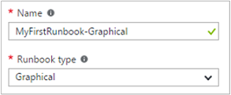<br>
6.  Klicken Sie auf **Erstellen** , um des Runbooks erstellen, und öffnen Sie den grafischen-Editor.

## <a name="step-2---add-activities-to-the-runbook"></a>Schritt 2 – Hinzufügen von Aktivitäten zu des Runbooks

Das Steuerelement Bibliothek auf der linken Seite des Editors können Sie Ihre Runbooks hinzuzufügende Aktivitäten auswählen.  Wir nun ein Cmdlet **Schreiben-Ausgabe** um Text aus des Runbooks Ausgabe hinzufügen.

1.  Klicken Sie in das Suchtextfeld, und geben Sie **Schreiben-Ausgabe**, in der Bibliothek-Steuerelement.  Die Suchergebnisse werden unter angezeigt werden. <br> 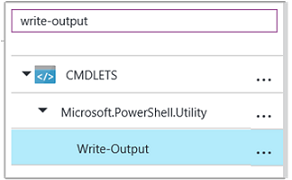
2.  Führen Sie einen Bildlauf nach unten bis zum Ende der Liste.  Sie können entweder klicken Sie mit der rechten Maustaste auf **Schreiben-Ausgabe** , und wählen Sie aus, **um den Zeichnungsbereich hinzufügen** oder klicken Sie auf die Ellipse neben das Cmdlet und wählen Sie dann auf **Hinzufügen, um den Zeichnungsbereich**.
3.  Klicken Sie auf die Aktivität **Schreiben-Ausgabe** auf den Zeichenbereich.  Daraufhin wird die Konfiguration mit dem Bibliothekssteuerungsblade, die Sie die Aktivität konfigurieren kann.
4.  Die **Bezeichnung** wird standardmäßig auf den Namen des Cmdlets, jedoch können wir es aussagekräftigeren ändern. Ändern Sie es zum *Schreiben Hallo Welt ausgeben*.
5.  Klicken Sie auf **Parameter** , um Werte für Parameter des Cmdlets bereitzustellen.  
    Einige Cmdlets stehen mehrere Parametersätze, und Sie müssen auswählen, die Sie verwenden möchten. In diesem Fall weist **Schreiben-Ausgabe** nur einen Parametersatz, damit Sie nicht um eine auszuwählen. <br> 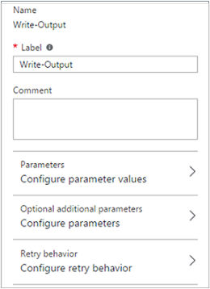
6.  Wählen Sie den Parameter **Eingabeobjekt** aus.  Dies ist der Parameter wir werden, in dem den Text, der in der Ausgabestream senden angeben.
7.  Wählen Sie in der Dropdownliste **Datenquelle** **PowerShell Ausdruck**ein.  Die Dropdownliste **Datenquelle** bietet verschiedene Quellen, die Sie verwenden, einen Parameterwert gefüllt wird.  
    Sie können die Ausgabe aus solchen Quellen wie eine andere Aktivität, eine Anlage Automatisierung oder ein Ausdruck PowerShell verwenden.  In diesem Fall wir nur den Text *Hallo Welt*ausgeben möchten. Wir können mit einem Ausdruck PowerShell, und geben Sie eine Zeichenfolge.
8.  Geben Sie *"Hallo Welt"* , und klicken Sie dann auf **OK** zweimal, um zu den Zeichenbereich zurückzukehren, in das Feld **Ausdruck** .<br> 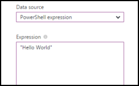
9.  Speichern Sie die Runbooks, indem Sie auf **Speichern**.<br> 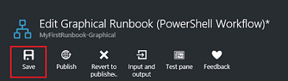

## <a name="step-3---test-the-runbook"></a>Schritt 3: Testen des Runbooks

Bevor wir des Runbooks um Herstellung zurücklegen veröffentlichen, möchten wir es testen, um sicherzustellen, dass sie ordnungsgemäß funktioniert.  Wenn Sie eine Runbooks testen, Sie **deren Entwurfsversion** ausführen und deren Ausgabe interaktiv anzeigen.

1.  Klicken Sie auf **Bereich testen** , um das Blade Test zu öffnen.<br> 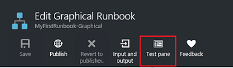
2.  Klicken Sie auf **Starten** , um den Test zu starten.  Dies sollte die einzige aktivierte Option sein.
3.  Ein [Runbooks Auftrag](automation-runbook-execution.md) wird erstellt, und deren Status angezeigt wird, klicken Sie im.  
    Der Status wird als *Ausgabe bereit* , die angibt, dass sie eine Runbooks Worker in der Cloud verfügbar wird wartet gestartet.  Dann wird zum *Starten* verschoben, wenn ein Worker Ansprüche das Projekt, und klicken Sie dann *ausgeführt* , wenn des Runbooks tatsächlich gestartet wird.  
4.  Wenn der Runbooks Auftrag abgeschlossen ist, wird deren Ausgabe angezeigt. In diesem Fall sollte *Hallo Welt*angezeigt werden.<br> 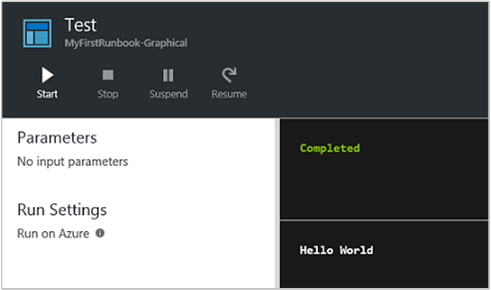
5.  Schließen Sie das Blade testen, um zu den Zeichenbereich zurückzukehren.

## <a name="step-4---publish-and-start-the-runbook"></a>Schritt 4 – veröffentlichen und des Runbooks starten

Des Runbooks, die wir gerade erstellt haben, ist aber weiterhin im Entwurfsmodus. Wir müssen diese veröffentlicht werden, bevor wir in Herstellung ausgeführt werden kann.  Wenn Sie eine Runbooks veröffentlichen, überschreiben Sie vorhandene veröffentlichte Version mit der Entwurfsversion.  In diesem Fall haben nicht wir eine veröffentlichte Version noch, da wir gerade des Runbooks erstellt haben.

1.  Klicken Sie auf **Veröffentlichen** des Runbooks veröffentlichen und dann auf **Ja,** Wenn Sie dazu aufgefordert werden.<br> 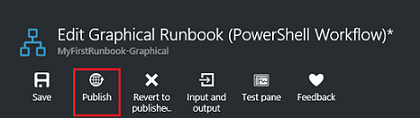
2.  Wenn Sie Links zum Anzeigen des Runbooks in das Blade **Runbooks** Blättern, wird es ein **Status Authoring** **Published**angezeigt.
3.  Führen Sie einen Bildlauf zurück nach rechts, um das Blade für **MyFirstRunbook**anzeigen.  
    Die Optionen im oberen können wir die Starten des Runbooks, Planen sie einige Zeit in der Zukunft oder erstellen eine [Webhook](automation-webhooks.md) , damit er gestartet werden kann über eine HTTP-Anruf.
4.  Wir gerade des Runbooks starten möchten klicken Sie auf **Start** und dann auf **Ja,** Wenn Sie dazu aufgefordert werden.<br> 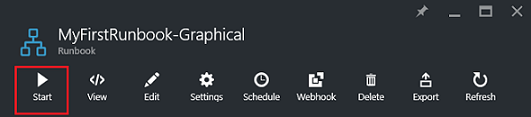
5.  Eine Position Blade ist für den Auftrag Runbooks geöffnet, die wir gerade erstellt haben.  Wir können diese Blade schließen, aber in diesem Fall wir werden offen zu lassen, damit wir den Fortschritt des Projekts anzeigen können.
6.  Der Status im **Auftrag Zusammenfassung** angezeigt wird, und den Status, die wir gesehen haben, wenn wir des Runbooks getestet entspricht.<br> 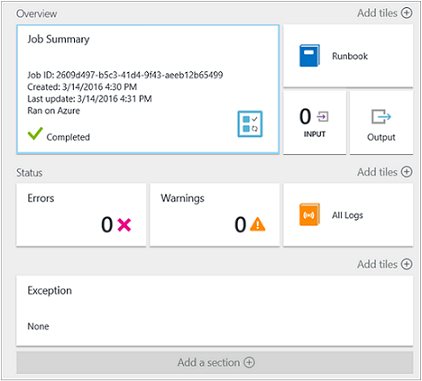
7.  Nachdem Sie der Status des Runbooks *abgeschlossen*angezeigt wird, klicken Sie auf **die Ausgabe**. Das **Ausgabe** Blade wird geöffnet, und wir unserer *Hallo Welt* im Bereich angezeigt werden.<br> 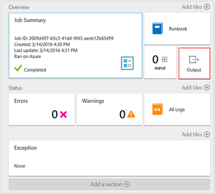  
8.  Schließen Sie das Blade Ausgabe an.
9.  Klicken Sie auf **Alle Protokolle** , um das Blade Streams für das Projekt Runbooks zu öffnen.  Wir *Hallo Welt* in der Ausgabestream nur auftreten, aber dies kann anderen Streams für ein Projekt Runbooks wie ausführlich und Fehler anzeigen, wenn die Runbooks in diese schreibt.<br> 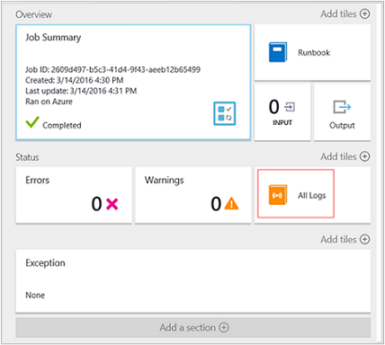
10. Schließen Sie das Blade alle Protokolle und das Projekt Blade, um zu dem Blade MyFirstRunbook zurückzukehren.
11. Klicken Sie auf **Aufträge** , um das Blade Aufträge für diese Runbooks zu öffnen.  Hier werden alle erstellten durch diese Runbooks Aufträge. Wir auftreten nur eine Position aufgeführt, da wir den Auftrag nur einmal ausführen.<br> 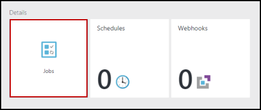
12. Klicken Sie auf diese Position im gleichen Auftrag zu öffnen, die wir angezeigt, wenn wir des Runbooks gestartet.  So können Sie zeitlich zurückgehen, und zeigen Sie die Details für jede Aufgabe, die für einen bestimmten Runbooks erstellt wurde.

## <a name="step-5---create-variable-assets"></a>Schritt 5 – Variable Posten erstellen

Wir haben getestet und unsere Runbooks veröffentlicht haben, aber es keine bisher nicht sinnvoll. Wir möchten haben Azure Ressourcen verwalten.  Bevor wir des Runbooks authentifizieren konfigurieren, erstellen wir eine Variable zum Halten Sie der Abonnement-ID und darauf verweisen, nachdem wir die Aktivität in Schritt 6 unten authentifizieren einrichten.  Einen Verweis auf den Kontext Abonnement einschließlich, können Sie zwischen mehreren Abonnements einfach zu arbeiten.  Kopieren Sie bevor Sie Ihr Abonnement-ID über die Option Abonnements vom im Navigationsbereich aus.  

1. Klicken Sie auf die Kachel " **Websiteobjekte** " das Blade Automatisierung Konten auf, und das **Posten** Blade wird geöffnet.
2. Klicken Sie auf klicken Sie auf die Kachel **Variablen** , in das Blade Posten.
3. Klicken Sie auf das Blade Variablen **Hinzufügen einer Variablen zu speichern**.<br>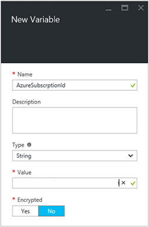
4. Neue Variable vorher, in das Feld **Name** Geben Sie **AzureSubscriptionId** , und geben Sie im Feld **Wert** Ihre Abonnement-ID.  Lassen Sie für **die Verschlüsselung der** *Zeichenfolge* für den **Typ** und den Standardwert.  
5. Klicken Sie auf **Erstellen** , um die Variable erstellen.  


## <a name="step-6---add-authentication-to-manage-azure-resources"></a>Schritt 6 - Authentifizierung zum Verwalten von Azure Ressourcen hinzufügen

Nun verfügen wir über eine Variable für unsere Abonnement-ID, können wir konfigurieren unserer Runbooks mit den Anmeldeinformationen ausführen als Authentifizierung, die in den [Voraussetzungen für](#prerequisites)bezeichnet werden.  Wir dies, indem Sie den Zeichenbereich mit dem Azure ausführen als Verbindung **Anlagen-** und **Hinzufügen-AzureRMAccount** -Cmdlet hinzu.  

1.  Öffnen Sie im grafischen-Editor, indem Sie auf das MyFirstRunbook Blade auf **Bearbeiten** .<br> 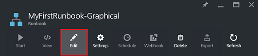
2.  **Schreiben Hallo Welt ausgeben** nicht mehr benötigt, also nach rechts, klicken Sie darauf, und wählen Sie **Löschen**aus.
3.  Das Steuerelement Bibliothek erweitern **Verbindungen** und Hinzufügen von **AzureRunAsConnection** zu den Zeichenbereich, indem Sie **zu Zeichnungsbereich hinzufügen**auswählen.
4.  Wählen Sie auf den Zeichenbereich **AzureRunAsConnection** aus, und geben Sie im Bereich Konfiguration Steuerelement **Ausführen als Verbindung erhalten** , in das Textfeld **Bezeichnung** .  Dies ist die Verbindung 
5.  Geben Sie in der Bibliothek-Steuerelement **Hinzufügen-AzureRmAccount** in das Suchtextfeld ein.
6.  Fügen Sie den Zeichenbereich **Hinzufügen-AzureRmAccount** hinzu.<br> 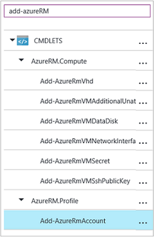
7.  Zeigen Sie auf **Ausführen als Verbindung erhalten** , bis auf der Unterseite der Form ein Kreises angezeigt wird. Klicken Sie auf den Kreis, und ziehen Sie den Pfeil in der **Hinzufügen-AzureRmAccount**.  Der Pfeil, den Sie soeben erstellte ist ein *Link*.  Des Runbooks startet mit **Ausführen als Verbindung abrufen** und führen Sie dann auf **Hinzufügen-AzureRmAccount**.<br> 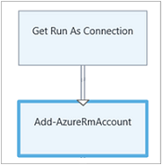
8.  Klicken Sie auf den Zeichenbereich wählen Sie **-AzureRmAccount hinzufügen** , und in der Konfiguration Steuerelementtyp Bereich **Login to Azure** in das Textfeld **Beschriftung** .
9.  Klicken Sie auf **Parameter** und die Aktivität Parameterkonfiguration Blade angezeigt wird. 
10.  **Hinzufügen-AzureRmAccount** weist mehrere Parametersätze, damit wir eine aktivieren, bevor wir Parameterwerte bereitgestellt werden müssen.  Klicken Sie auf **Parameter festlegen** , und wählen Sie dann die **ServicePrincipalCertificate** Parameter festlegen. 
11.  Nachdem Sie die Parameter auszuwählen, werden die Parameter in die Aktivität Parameterkonfiguration Blade angezeigt.  Klicken Sie auf **p**.<br> 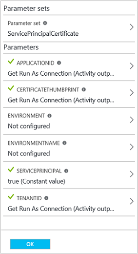
12.  Wählen Sie in das Blade Parameterwert **Aktivität Ausgabe** für die **Datenquelle aus** , und wählen Sie **Ausführen als Verbindung abrufen** aus der Liste in das **Feldpfad** Textfeld Typ **p**, und klicken Sie dann auf **OK**.  Wir sind der Name der Eigenschaft für das Feldpfad angeben, da die Aktivität ein Objekts mit mehreren Eigenschaften ausgegeben.
13.  Klicken Sie auf **CERTIFICATETHUMBPRINT**, und wählen Sie das Blade Parameterwert **Aktivität Ausgabe** für die **Datenquelle**.  Wählen Sie **Ausführen als Verbindung abrufen** aus der Liste in das **Feldpfad** Textfeld Typ **CertificateThumbprint**, und klicken Sie dann auf **OK**. 
14.  Klicken Sie auf **SERVICEPRINCIPAL**, und wählen Sie das Blade Parameterwert **ConstantValue** für die **Datenquelle**, klicken Sie auf die Option **true,**und klicken Sie dann auf **OK**.
15.  Klicken Sie auf **TENANTID**, und wählen Sie das Blade Parameterwert **Aktivität Ausgabe** für die **Datenquelle**.  Wählen Sie **Ausführen als Verbindung abrufen** aus der Liste in das **Feldpfad** Textfeld Typ **TenantId**, und klicken Sie dann zweimal auf **OK** .  
16.  Geben Sie in der Bibliothek-Steuerelement **Festlegen-AzureRmContext** in das Suchtextfeld ein.
17.  Hinzufügen von **Set-AzureRmContext** zu den Zeichenbereich.
18.  Klicken Sie auf den Zeichenbereich wählen Sie **Set-AzureRmContext** und in der Konfiguration Steuerelementtyp Bereich **Angeben Abonnement-Id** in das Textfeld **Bezeichnung** .
19.  Klicken Sie auf **Parameter** und die Aktivität Parameterkonfiguration Blade angezeigt wird. 
20. **Set-AzureRmContext** weist mehrere Parametersätze, damit wir eine aktivieren, bevor wir Parameterwerte bereitgestellt werden müssen.  Klicken Sie auf **Parameter festlegen** , und wählen Sie dann die **SubscriptionId** Parameter festlegen.  
21.  Nachdem Sie die Parameter auszuwählen, werden die Parameter in die Aktivität Parameterkonfiguration Blade angezeigt.  Klicken Sie auf **SubscriptionID**
22.  In das Blade Parameterwert **Variable Wirtschaftsgutes** für die **Datenquelle** auswählen und **AzureSubscriptionId** aus der Liste auswählen, und klicken Sie zweimal auf **OK** .   
23.  Zeigen Sie auf **Login to Azure** , bis auf der Unterseite der Form ein Kreises angezeigt wird. Klicken Sie auf den Kreis, und ziehen Sie den Pfeil **Abonnement**-ID angeben.


Ihre Runbooks sollte nun wie folgt aussehen: <br>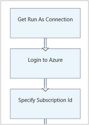

## <a name="step-7---add-activity-to-start-a-virtual-machine"></a>Schritt 7 – Aktivität zum Starten eines virtuellen Computers hinzufügen

Wir werden nun eine **Start-AzureRmVM** Aktivität zum Starten eines virtuellen Computers hinzufügen.  Sie können alle virtuellen Computern in Ihrem Abonnement Azure auswählen, und jetzt zwar wir hartzucodieren, die in das Cmdlet benennen.

1. Geben Sie in der Bibliothek-Steuerelement **Start-AzureRm** in das Suchtextfeld ein.
2. Fügen Sie **Start-AzureRmVM hinzu** , um den Zeichenbereich, und klicken Sie dann auf, und ziehen Sie ihn unter **Abonnement-Id angeben**.
3. Zeigen Sie auf **Abonnement-Id angeben** , bis auf der Unterseite der Form ein Kreises angezeigt wird.  Klicken Sie auf den Kreis, und ziehen Sie den Pfeil in der **Start-AzureRmVM**. 
4.  Wählen Sie **Start-AzureRmVM**aus.  Klicken Sie auf **Parameter** , und klicken Sie dann **Parameter so eingerichtet** zum Anzeigen der Datensätze für den **Start-AzureRmVM**.  Wählen Sie aus der **ResourceGroupNameParameterSetName** Parameter festgelegt ist. Beachten Sie, dass **ResourceGroupName** und **ein** Ausrufezeichen neben haben sie.  Dies zeigt an, dass sie Parameter erforderlich sind.  Beachten Sie auch, dass beide Zeichenfolgenwerte erwartet.
5.  Wählen Sie die **Namen**aus.  Wählen Sie **PowerShell-Ausdruck** für die **Datenquelle** und geben Sie den Namen des virtuellen Computers eingeschlossen in doppelte Anführungszeichen, die wir mit dieser Runbooks gestartet werden kann.  Klicken Sie auf **OK**.<br>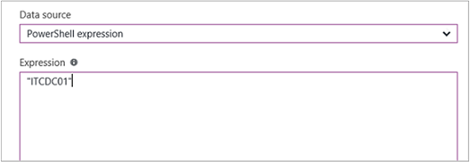
6.  Wählen Sie **ResourceGroupName**aus. Verwenden Sie **PowerShell-Ausdruck** für die **Datenquelle** , und geben Sie den Namen der Ressourcengruppe in doppelte Anführungszeichen gesetzt.  Klicken Sie auf **OK**.<br> 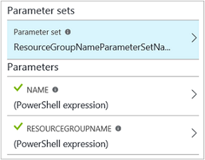
8.  Klicken Sie auf testen, damit wir des Runbooks testen können.
9.  Klicken Sie auf **Starten** , um den Test zu starten.  Sobald sie abgeschlossen ist, überprüfen Sie, dass der virtuelle Computer gestartet wurde.

Ihre Runbooks sollte nun wie folgt aussehen: <br>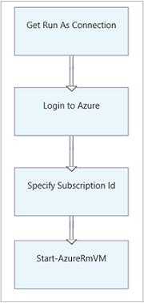

## <a name="step-8---add-additional-input-parameters-to-the-runbook"></a>Schritt 8: Hinzufügen von zusätzlichen Eingabeparameter zu des Runbooks

Unsere Runbooks beginnt des virtuellen Computers derzeit in der Gruppe der Ressource, die wir in das Cmdlet **Start-AzureRmVM** angegeben haben, aber unsere Runbooks wäre sinnvoller, wenn wir beide nach dem Start des Runbooks eingeben können.  Wir werden nun Eingabeparameter des Runbooks eine dieser Funktionalität hinzufügen.

1. Öffnen Sie den grafischen-Editor, indem Sie im Bereich **MyFirstRunbook** auf **Bearbeiten** .
2. Klicken Sie auf **Eingabe und Ausgabe** und dann **Eingabesprache hinzufügen** zum Öffnen des Bereichs Runbooks Eingabeparameter.<br> 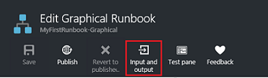
3. Geben Sie *VMName* für den **Namen**ein.  Behalten Sie die *Zeichenfolge* den **Typ**, aber ändern Sie **obligatorisch** auf *Ja*.  Klicken Sie auf **OK**.
4. Erstellen Sie einen zweiten obligatorischen Eingabeparameter *ResourceGroupName* aufgerufen, und klicken Sie dann auf **OK** , um den Bereich **ein- und Ausgabe** zu schließen.<br> 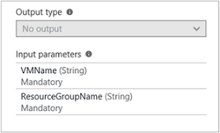
5. Wählen Sie die **Start-AzureRmVM** Aktivität aus, und klicken Sie dann auf **Parameter**.
6. Ändern Sie der **Datenquelle** für **Namen** mit **Runbooks Eingabe** , und wählen Sie dann **VMName**.<br>
7. Ändern Sie der **Datenquelle** für **ResourceGroupName** mit **Runbooks Eingabe** , und wählen Sie dann **ResourceGroupName**.<br> 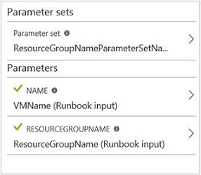
8. Speichern Sie des Runbooks, und öffnen Sie im Bereich testen.  Beachten Sie, dass Sie jetzt Werte für die Eingaben zwei Variablen bereitstellen können, die im Test verwendet wird.
9. Klicken Sie im Bereich Test zu schließen.
10. Klicken Sie auf **Veröffentlichen** , um die neue Version des Runbooks veröffentlichen.
11. Beenden Sie den virtuellen Computern, den Sie im vorherigen Schritt gestartet.
12. Klicken Sie auf **Starten** , um die Runbooks starten.  Geben Sie in der **VMName** und **ResourceGroupName** des virtuellen Computers, den Sie zu starten.<br> 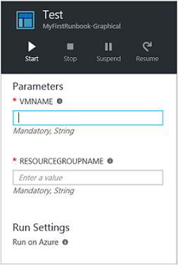
13. Klicken Sie nach Abschluss des Runbooks überprüfen Sie, dass der virtuelle Computer gestartet wurde.

## <a name="step-9---create-a-conditional-link"></a>Schritt 9: Erstellen eines bedingten links

Wir werden nun des Runbooks ändern, sodass er nur versucht, des virtuellen Computers zu starten, wenn er noch nicht gestartet ist.  Wir wird zu diesem Zweck des Runbooks, die den Status der Instanz Ebene des virtuellen Computers zu erhalten, wird ein Cmdlet " **Get-AzureRmVM** " hinzu. Wir werden dann **Erste Status** mit einer Codeausschnitt PowerShell-Code, um festzustellen, ob der Status des virtuellen Computers ausgeführt oder beendet wird aufgerufen Codemodul PowerShell-Workflow hinzufügen.  Bedingter Link aus dem **Status abrufen** Modul wird nur **Start-AzureRmVM** ausgeführt, wenn im aktuelle Zustand des laufende beendet wird.  Wir ausgegeben schließlich wird eine Nachricht ein, die automatisch ein, wenn Sie der virtuellen Computer erfolgreich gestartet wurde, oder verwenden nicht mit dem Schreiben Ausgabe eines PowerShell-Cmdlet zu informieren.

1. Öffnen Sie **MyFirstRunbook** im grafischen-Editor ein.
2. Entfernen Sie die Verknüpfung zwischen **Abonnement-Id angeben** und **Start-AzureRmVM** , indem Sie darauf klicken und dann die *ENTF* -Taste drücken.
3. Geben Sie in der Bibliothek-Steuerelement **Get-AzureRm** in das Suchtextfeld ein.
4. Hinzufügen von **Get-AzureRmVM** zu den Zeichenbereich.
5. Wählen Sie **Get-AzureRmVM** und dann **Parameter festlegen** der Datensätze für **Get-AzureRmVM**anzeigen.  Wählen Sie aus der **GetVirtualMachineInResourceGroupNameParamSet** Parameter festgelegt ist.  Beachten Sie, dass **ResourceGroupName** und **ein** Ausrufezeichen neben haben sie.  Dies zeigt an, dass sie Parameter erforderlich sind.  Beachten Sie auch, dass beide Zeichenfolgenwerte erwartet.
6. Klicken Sie unter **Datenquelle** für **Namen** **Runbooks Eingabe** wählen Sie aus, und wählen Sie **VMName**.  Klicken Sie auf **OK**.
7. Klicken Sie unter **Datenquelle** für **ResourceGroupName** **Runbooks Eingabe** wählen Sie aus, und wählen Sie **ResourceGroupName**.  Klicken Sie auf **OK**.
8. Klicken Sie unter **Datenquelle** für **Status**wählen Sie **konstanter Wert aus** und **true,**klicken Sie dann auf.  Klicken Sie auf **OK**.  
9. Erstellen Sie eine Verknüpfung von **Abonnement-Id angeben** , um **Get-AzureRmVM**.
10. Das Steuerelement Bibliothek **Runbooks Steuerelement** erweitern und Hinzufügen von **Code** zu den Zeichenbereich.  
11. Erstellen Sie eine Verknüpfung von **Get-AzureRmVM** **Code**ein.  
12. Klicken Sie auf **Code** , und ändern Sie im Bereich Konfiguration Etikett in **Status erhalten**.
13. SELECT **Code** Parameter, und das Blade **Code-Editor** wird angezeigt.  
14. Fügen Sie den Code-Editor den folgenden Codeausschnitt:

     ```
     $StatusesJson = $ActivityOutput['Get-AzureRmVM'].StatusesText 
     $Statuses = ConvertFrom-Json $StatusesJson 
     $StatusOut ="" 
     foreach ($Status in $Statuses){ 
     if($Status.Code -eq "Powerstate/running"){$StatusOut = "running"} 
     elseif ($Status.Code -eq "Powerstate/deallocated") {$StatusOut = "stopped"} 
     } 
     $StatusOut 
     ```

15. Erstellen eines Links aus dem **Status abrufen** zu **Start-AzureRmVM**.<br> 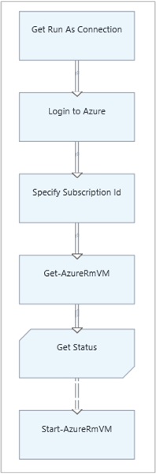  
16. Wählen Sie den Link aus, und ändern Sie im Bereich Konfiguration **Übernehmen Bedingung** auf **Ja**.   Beachten Sie die Verknüpfung in eine gestrichelte Linie, die angibt, dass die Aktivität nur ausgeführt wird, wenn die Bedingung zu aufgelöst wird WAHR.  
17. Geben Sie für den **Ausdruck Bedingung** *$ActivityOutput [' erste Status'] - Eq "Angehalten"*ein.  **Start-AzureRmVM** wird jetzt nur ausgeführt, wenn des virtuellen Computers beendet wird.
18. Erweitern Sie in der Bibliothek-Steuerelement **Cmdlets** und dann **Microsoft.PowerShell.Utility**aus.
19. **Schreiben-Ausgabe** zweimal auf den Zeichenbereich hinzufügen.<br> 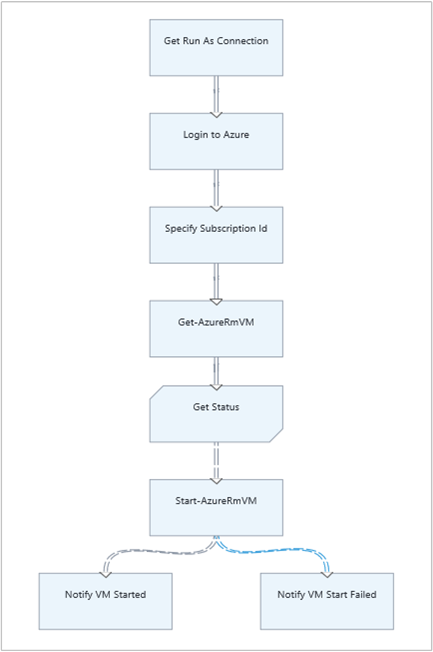
20. Klicken Sie auf das erste Steuerelement der **Ausgabe eines schreiben** klicken Sie auf **Parameter** und ändern Sie den Wert für die **Beschriftung** , *Benachrichtigen virtueller Computer*gestartet.
21. Ändern Sie für **Eingabeobjekt** **Datenquelle** in **PowerShell-Ausdruck** , geben Sie den Ausdruck *"$VMName erfolgreich gestartet"*ein.
22. Klicken Sie auf das zweite **Schreiben-Ausgabe** -Steuerelement klicken Sie auf **Parameter** und ändern Sie den Wert für die **Bezeichnung** in *Benachrichtigen virtueller Computer Fehler beim Starten*
23. Ändern Sie für **Eingabeobjekt** **Datenquelle** in **PowerShell-Ausdruck** , geben Sie den Ausdruck *"$VMName konnte nicht gestartet werden."*ein.
24. Erstellen Sie eine Verknüpfung von **Start-AzureRmVM** **Benachrichtigen virtuellen Computer gestartet** und **Benachrichtigen virtueller Computer Fehler beim Starten**.
25. Wählen Sie den Link **Benachrichtigen virtuellen Computer** gestartet, und ändern Sie **Übernehmen Bedingung** **Wahr**.
26. Geben Sie für den **Ausdruck Bedingung** *$ActivityOutput ['Start-AzureRmVM'] aus. IsSuccessStatusCode - Eq $true*.  Dieses Steuerelement schreiben-Ausgabe wird jetzt nur ausgeführt, wenn des virtuellen Computers erfolgreich gestartet wird.
27. Wählen Sie den Link **Benachrichtigen virtueller Computer Fehler beim Starten** aus, und ändern Sie **Übernehmen Bedingung** **Wahr**.
28. Geben Sie für den **Ausdruck Bedingung** *$ActivityOutput ['Start-AzureRmVM'] aus. IsSuccessStatusCode - neuer $true*.  Dieses Steuerelement schreiben-Ausgabe wird jetzt nur ausgeführt, wenn des virtuellen Computers nicht erfolgreich gestartet ist.
29. Speichern Sie des Runbooks, und öffnen Sie im Bereich testen.
30. Starten des Runbooks mit des virtuellen Computers beendet, und es beginnen soll.

## <a name="next-steps"></a>Nächste Schritte

-   Wenn Sie weitere Informationen zur Erstellung Grafischen finden Sie unter [Graphical authoring in Azure Automatisierung](automation-graphical-authoring-intro.md)
-   Um mit PowerShell Runbooks anzufangen, finden Sie unter [Meine erste PowerShell Runbooks](automation-first-runbook-textual-powershell.md)
-   Um mit PowerShell Workflow Runbooks anzufangen, finden Sie unter [Meine erste PowerShell Workflow Runbooks](automation-first-runbook-textual.md)
