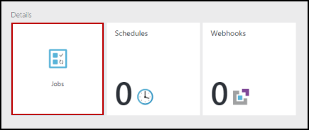

<properties
    pageTitle="Meine erste PowerShell Workflow Runbooks in Azure Automatisierung | Microsoft Azure"
    description="Lernprogramm, in dem Sie durch das Erstellen, testen und Veröffentlichen von einer einfachen Text Runbooks mit PowerShell Workflow geführt."
    services="automation"
    documentationCenter=""
    authors="mgoedtel"
    manager="jwhit"
    editor=""
    keywords="PowerShell-Workflow, Powershell Workflow Beispielen Workflow powershell"/>
<tags
    ms.service="automation"
    ms.workload="tbd"
    ms.tgt_pltfrm="na"
    ms.devlang="na"
    ms.topic="get-started-article"
    ms.date="07/19/2016"
    ms.author="magoedte;bwren"/>

# <a name="my-first-powershell-workflow-runbook"></a>Meine erste PowerShell Workflow Runbooks

> [AZURE.SELECTOR] - [Grafische](automation-first-runbook-graphical.md) - [PowerShell](automation-first-runbook-textual-PowerShell.md) - [PowerShell-Workflow](automation-first-runbook-textual.md)

Dieses Lernprogramm führt Sie durch die Erstellung eines [PowerShell-Workflow Runbooks](automation-runbook-types.md#powerShell-workflow-runbooks) in Azure Automatisierung. Wir beginnen mit einer einfachen Runbooks, die wir testen und veröffentlichen, während wir erläutert, wie Sie den Status des Runbooks Auftrags überwachen. Dann wird nun des Runbooks tatsächlich zum Verwalten von Azure Ressourcen, geändert, in diesem Fall ein Azure-virtuellen Computern ab. Wir werden dann des Runbooks mehr robuste machen Runbooks Parameter hinzufügen.

## <a name="prerequisites"></a>Erforderliche Komponenten

Damit dieses Lernprogramm abgeschlossen, benötigen Sie Folgendes.

-   Azure-Abonnement. Wenn Sie noch keine haben, können Sie [die Vorteile Ihres MSDN-Abonnent aktivieren](https://azure.microsoft.com/pricing/member-offers/msdn-benefits-details/) oder <a href="/pricing/free-account/" target="_blank"> [für ein kostenloses Konto anmelden](https://azure.microsoft.com/free/).
-   [Automatisierung Konto](automation-security-overview.md) des Runbooks halten und auf Azure Ressourcen authentifizieren.  Dieses Konto muss über die Berechtigung zum Starten und Beenden des virtuellen Computers verfügen.
-   Ein Azure-virtuellen Computern. Wir beenden und Starten von diesem Computer, damit es nicht Herstellung werden sollen.

## <a name="step-1---create-new-runbook"></a>Schritt 1 – Erstellen von neuen Runbooks

Zunächst wird durch das Erstellen einer einfachen Runbooks, die den Text *Hallo Welt*ausgegeben.

1.  Öffnen Sie Ihr Konto Automatisierung im Portal Azure.  
    Die Kontoseite Automatisierung bietet Ihnen einen schnellen Überblick über die Ressourcen in diesem Konto. Sie sollten bereits einige Vermögenswerte verfügen. Die meisten Sprachen sind die Module, die automatisch ein neues Automatisierung Konto enthalten sind. Sie sollten auch die Anlage Anmeldeinformationen verfügen, die die [erforderliche Komponenten](#prerequisites)angegeben ist.
2.  Klicken Sie auf die Kachel **Runbooks** zum Öffnen der Liste von Runbooks.<br> 
3.  Erstellen einer neuen Runbooks, indem Sie auf die Schaltfläche **Hinzufügen einer Runbooks** und klicken Sie dann auf **Erstellen einer neuen Runbooks**an.
4.  Geben Sie den Namen *MyFirstRunbook-Workflow*des Runbooks.
5.  In diesem Fall wird gezeigt, die zum Erstellen eines [Workflows PowerShell Runbooks](automation-runbook-types.md#powerShell-workflow-runbooks) wählen Sie also **Powershell Workflow** für **Runbooks**.<br> 
6.  Klicken Sie auf **Erstellen** , um die Runbooks erstellen, und öffnen Sie im Text-Editor.

## <a name="step-2---add-code-to-the-runbook"></a>Schritt 2 – Hinzufügen von Code zu des Runbooks

Können Sie entweder Typcode direkt in die Runbooks, oder Sie können Cmdlets, Runbooks und Anlagen aus der Bibliothek Steuerelement auswählen und diese des Runbooks mit verwandten Parameter hinzugefügt haben. Für diese exemplarische Vorgehensweise werden wir direkt in die Runbooks eingeben.

1.  Unsere Runbooks ist zurzeit leer mit nur das entsprechende *Workflow* Schlüsselwort, den Namen des unsere Runbooks, und die geschweiften Klammern, die den gesamten Workflow encase werden. 

    ```
    Workflow MyFirstRunbook-Workflow
    {
    }
    ```

2.  Typ *Schreiben-Ausgabe "Hallo Welt."* zwischen den geschweiften Klammern. 
   
    ```
    Workflow MyFirstRunbook-Workflow
    {
      Write-Output "Hello World"
    }
    ```

3.  Speichern Sie die Runbooks, indem Sie auf **Speichern**.<br> 

## <a name="step-3---test-the-runbook"></a>Schritt 3: Testen des Runbooks

Bevor wir des Runbooks um Herstellung zurücklegen veröffentlichen, möchten wir es testen, um sicherzustellen, dass sie ordnungsgemäß funktioniert. Wenn Sie eine Runbooks testen, Sie **deren Entwurfsversion** ausführen und deren Ausgabe interaktiv anzeigen.

1.  Klicken Sie auf **Test-Bereich** zum Öffnen des Bereichs testen.<br> 
2.  Klicken Sie auf **Starten** , um den Test zu starten. Dies sollte die einzige aktivierte Option sein.
3.  Ein [Runbooks Auftrag](automation-runbook-execution.md) wird erstellt, und deren Status angezeigt.  
    Der Status wird als *Ausgabe bereit* , die angibt, dass sie eines Runbooks Arbeitskollegen in der Cloud verfügbar kommen wartet gestartet. Dann wird zum *Starten* verschoben, wenn ein Worker Ansprüche das Projekt, und klicken Sie dann *ausgeführt* , wenn des Runbooks tatsächlich gestartet wird.  
4.  Wenn der Runbooks Auftrag abgeschlossen ist, wird deren Ausgabe angezeigt. In diesem Fall sollte *Hallo Welt*angezeigt werden.<br> 
5.  Schließen Sie im Bereich testen, um zu den Zeichenbereich zurückzukehren.

## <a name="step-4---publish-and-start-the-runbook"></a>Schritt 4 – veröffentlichen und des Runbooks starten

Des Runbooks, die wir gerade erstellt haben, ist aber weiterhin im Entwurfsmodus. Wir müssen diese veröffentlicht werden, bevor wir in Herstellung ausgeführt werden kann. Wenn Sie eine Runbooks veröffentlichen, überschreiben Sie vorhandene veröffentlichte Version mit der Entwurfsversion. In diesem Fall haben nicht wir eine veröffentlichte Version noch, da wir gerade des Runbooks erstellt haben.

1.  Klicken Sie auf **Veröffentlichen** des Runbooks veröffentlichen und dann auf **Ja,** Wenn Sie dazu aufgefordert werden.<br> 
2.  Wenn Sie Links führen Sie einen zum des Runbooks jetzt im Bereich **Runbooks** anzeigen Bildlauf, wird es ein **Status Authoring** **Published**angezeigt.
3.  Führen Sie einen Bildlauf zurück nach rechts, um im Bereich für **MyFirstRunbook-Workflow**anzeigen.  
    Die Optionen im oberen können wir die Starten des Runbooks, Planen sie einige Zeit in der Zukunft oder erstellen eine [Webhook](automation-webhooks.md) , damit er gestartet werden kann über eine HTTP-Anruf.
4.  Wir gerade des Runbooks starten möchten klicken Sie auf **Start** und dann auf **Ja,** Wenn Sie dazu aufgefordert werden.<br> 
5.  Klicken Sie im Bereich Auftrag ist für den Auftrag Runbooks geöffnet, die wir gerade erstellt haben. Wir können in diesem Bereich schließen, aber in diesem Fall wir werden offen zu lassen, damit wir den Fortschritt des Projekts anzeigen können.
6.  Der Status im **Auftrag Zusammenfassung** angezeigt wird, und den Status, die wir gesehen haben, wenn wir des Runbooks getestet entspricht.<br> 
7.  Nachdem Sie der Status des Runbooks *abgeschlossen*angezeigt wird, klicken Sie auf **die Ausgabe**. Ausgabebereich wird geöffnet, und wir unserer *Hallo Welt*angezeigt werden.<br>   
8.  Schließen Sie Ausgabebereich ein.
9.  Klicken Sie auf **Streams** zum Öffnen des Streams Bereichs für den Auftrag Runbooks. Wir *Hallo Welt* in der Ausgabestream nur auftreten, aber dies kann anderen Streams für ein Projekt Runbooks wie ausführlich und Fehler anzeigen, wenn die Runbooks in diese schreibt.<br> 
10. Schließen Sie im Bereich Streams und im Auftrag, um in den Bereich MyFirstRunbook zurückzukehren.
11. Klicken Sie auf **Aufträge** zum Öffnen des Bereichs Aufträge für diese Runbooks. Hier werden alle erstellten durch diese Runbooks Aufträge. Wir auftreten nur eine Position aufgeführt, da wir den Auftrag nur einmal ausführen.<br> 
12. Klicken Sie auf diese Position im gleichen Auftrag zu öffnen, die wir angezeigt, wenn wir des Runbooks gestartet. So können Sie zeitlich zurückgehen, und zeigen Sie die Details für jede Aufgabe, die für einen bestimmten Runbooks erstellt wurde.

## <a name="step-5---add-authentication-to-manage-azure-resources"></a>Schritt 5 – Authentifizierung zum Verwalten von Azure Ressourcen hinzufügen

Wir haben getestet und unsere Runbooks veröffentlicht haben, aber es keine bisher nicht sinnvoll. Wir möchten haben Azure Ressourcen verwalten. Sie können nicht mehr erledigen, obwohl es sei denn, wir haben authentifizieren mit den Anmeldeinformationen, die in den [Voraussetzungen für](#prerequisites)bezeichnet werden. Dazu verwenden wir das Cmdlet **AzureRMAccount hinzufügen** .

1.  Öffnen Sie den Text-Editor, indem Sie im Bereich MyFirstRunbook-Workflow auf **Bearbeiten** .<br> 
2.  Die Zeile **Schreiben-Ausgabe** nicht mehr benötigt, also fortfahren und löschen Sie ihn.
3.  Positionieren Sie den Cursor in einer leeren Zeile zwischen den geschweiften Klammern ein.
4.  Geben Sie ein, oder kopieren Sie, und fügen Sie den folgenden Code ein, der die Authentifizierung mit Ihrem Konto Automatisierung ausführen als behandelt:

    ```
    $Conn = Get-AutomationConnection -Name AzureRunAsConnection 
    Add-AzureRMAccount -ServicePrincipal -Tenant $Conn.TenantID `
    -ApplicationId $Conn.ApplicationID -CertificateThumbprint $Conn.CertificateThumbprint
    ```

5.  Klicken Sie auf **Bereich testen** , sodass die Runbooks getestet werden kann.
6.  Klicken Sie auf **Starten** , um den Test zu starten. Sobald sie abgeschlossen ist, erhalten Sie eine Ausgabe ähnlich der folgenden, werden allgemeine Informationen aus Ihrem Konto. Dadurch wird bestätigt, dass die Anmeldeinformationen gültig ist.<br> 

## <a name="step-6---add-code-to-start-a-virtual-machine"></a>Schritt 6: Hinzufügen von Code zum Starten eines virtuellen Computers

Jetzt, da unsere Runbooks unsere Azure-Abonnement authentifiziert, können wir Ressourcen verwalten. Wir werden einen Befehl zum Starten eines virtuellen Computers hinzufügen. Sie können alle virtuellen Computern in Ihrem Abonnement Azure auswählen, und jetzt zwar wir hartzucodieren, die in das Cmdlet benennen.

1.  Geben Sie nach dem *Hinzufügen-AzureRmAccount*, *Start-AzureRmVM-Namen 'VMName' - ResourceGroupName 'NameofResourceGroup'* bereitstellen, den Namen und die Namen der Ressourcengruppe des virtuellen Computers zu starten.  

    ```
    workflow MyFirstRunbook-Workflow
    {
      $Conn = Get-AutomationConnection -Name AzureRunAsConnection
      Add-AzureRMAccount -ServicePrincipal -Tenant $Conn.TenantID -ApplicationId $Conn.ApplicationID -CertificateThumbprint $Conn.CertificateThumbprint
      Start-AzureRmVM -Name 'VMName' -ResourceGroupName 'ResourceGroupName'
    }
    ``` 

2.  Speichern Sie des Runbooks, und klicken Sie dann auf **Bereich testen** , damit wir es testen können.
3.  Klicken Sie auf **Starten** , um den Test zu starten. Sobald sie abgeschlossen ist, überprüfen Sie, dass der virtuelle Computer gestartet wurde.

## <a name="step-7---add-an-input-parameter-to-the-runbook"></a>Schritt 7 – Eingabeparameter zu des Runbooks hinzufügen

Unsere Runbooks aktuell beginnt der virtuelle, dass wir hartcodierte in des Runbooks Computer, aber es wäre hilfreicher Wenn nach dem Start des Runbooks konnten wir des virtuellen Computers eingeben. Wir werden nun Eingabeparameter des Runbooks eine dieser Funktionalität hinzufügen.

1.  Des Runbooks Parameter für *VMName* und *ResourceGroupName* hinzu, und verwenden Sie diese Variablen mit dem **Start-AzureRmVM** -Cmdlet wie im Beispiel unten. 

    ```
    workflow MyFirstRunbook-Workflow
    {
       Param(
        [string]$VMName,
        [string]$ResourceGroupName
       )  
     $Conn = Get-AutomationConnection -Name AzureRunAsConnection 
     Add-AzureRMAccount -ServicePrincipal -Tenant $Conn.TenantID -ApplicationId $Conn.ApplicationID -CertificateThumbprint $Conn.CertificateThumbprint
     Start-AzureRmVM -Name $VMName -ResourceGroupName $ResourceGroupName
    }
    ```

2.  Speichern Sie des Runbooks, und öffnen Sie im Bereich testen. Beachten Sie, dass Sie jetzt Werte für die Eingaben zwei Variablen bereitstellen können, die im Test verwendet wird.
3.  Klicken Sie im Bereich Test zu schließen.
4.  Klicken Sie auf **Veröffentlichen** , um die neue Version des Runbooks veröffentlichen.
5.  Beenden Sie den virtuellen Computern, den Sie im vorherigen Schritt gestartet.
6.  Klicken Sie auf **Starten** , um die Runbooks starten. Geben Sie in der **VMName** und **ResourceGroupName** des virtuellen Computers, den Sie zu starten.<br> 

7.  Klicken Sie nach Abschluss des Runbooks überprüfen Sie, dass der virtuelle Computer gestartet wurde.

## <a name="next-steps"></a>Nächste Schritte

-  Um mit grafisch Runbooks anzufangen, finden Sie unter [Meine erste grafisch Runbooks](automation-first-runbook-graphical.md)
-  Um mit PowerShell Runbooks anzufangen, finden Sie unter [Meine erste PowerShell Runbooks](automation-first-runbook-textual-powershell.md)
-  Weitere Informationen zu Datentypen Runbooks, deren vor- und Nachteile finden Sie unter [Azure Automatisierung Runbooks Typen](automation-runbook-types.md)
-  Weitere Informationen zu PowerShell-Skript unterstützen Sie Feature, finden Sie unter [Native PowerShell-Skript in Azure-Automatisierung unterstützt](https://azure.microsoft.com/blog/announcing-powershell-script-support-azure-automation-2/)