<properties 
    pageTitle="Grafische Authoring in Azure Automatisierung | Microsoft Azure"
    description="Grafische authoring, können Sie Runbooks für Azure Automatisierung zu erstellen, ohne die Arbeit mit Code. Dieser Artikel enthält eine Einführung in grafisch authoring und alle Details zum Erstellen eines grafischen Runbooks erforderlich."
    services="automation"   
    documentationCenter=""
    authors="mgoedtel"
    manager="jwhit"
    editor="tysonn" />
<tags 
    ms.service="automation"
    ms.devlang="na"
    ms.topic="article"
    ms.tgt_pltfrm="na"
    ms.workload="infrastructure-services"
    ms.date="06/03/2016"
    ms.author="magoedte;bwren" />

# Grafische in Azure Automatisierung authoring

## Einführung

Grafische Dokumenterstellung ermöglicht Ihnen, Runbooks für Azure Automatisierung ohne die Komplexität der zugrunde liegenden Windows PowerShell oder PowerShell-Workflow-Code zu erstellen. Fügen Sie Aktivitäten in den Zeichenbereich aus einer Bibliothek mit Cmdlets und Runbooks, sie miteinander zu verknüpfen und so konfigurieren, dass einen Workflow bilden.  Wenn Sie schon einmal mit System Center Orchestrator oder Dienst Management Automatisierung (SMA) gearbeitet haben, sollte klicken Sie dann dies Ihnen vertraut aussehen.   

Dieser Artikel enthält eine Einführung in grafisch authoring und die Konzepte erforderlichen Schritte beim Erstellen eines grafischen Runbooks.

## Grafische runbooks

Alle Runbooks in Azure Automatisierung sind Windows PowerShell-Workflows.  Graphical und grafisch PowerShell Workflow Runbooks generieren PowerShell-Code, der von der Automatisierung Arbeitskräften ausgeführt wird, aber Sie sind nicht mehr anzeigen oder direkt zu ändern.  Eine grafisch Runbooks in einer grafisch PowerShell Workflow Runbooks und umgekehrt konvertiert werden kann, aber sie nicht in einer Textform Runbooks konvertiert werden. Einer vorhandenen Textform Runbooks kann nicht in den grafischen-Editor importiert werden.  

## Übersicht des grafischen-Editors

Sie können den grafischen-Editor im Azure-Portal durch Erstellen oder Bearbeiten eines grafischen Runbooks öffnen.

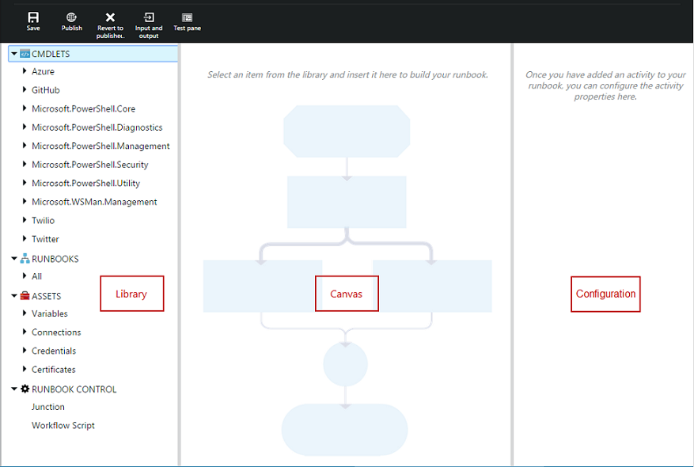

In den folgenden Abschnitten werden die Steuerelemente im grafischen-Editor beschrieben.

### Zeichenbereich
Der Zeichenbereich ist, in dem Sie Ihre Runbooks entwerfen.  Des Runbooks Aktivitäten von den Knoten in der Bibliothek-Steuerelement hinzu, und verbinden diese mit Links zu die Logik der des Runbooks definieren.

Die Steuerelemente können am unteren Rand des Bereichs Sie vergrößern und verkleinern.

### Bibliothek-Steuerelement

Das Steuerelement Bibliothek ist, in dem Sie [Aktivitäten](#activities) Ihrer Runbooks hinzuzufügende auswählen.  Sie hinzufügen können auf die Stelle, an der Sie diese mit anderen Aktivitäten verbinden Zeichenbereich.  Er enthält vier Abschnitten in der folgenden Tabelle beschrieben.

| Im Abschnitt | Beschreibung |
|:---|:---|
| Cmdlets | Ihre Runbooks umfasst alle Cmdlets, die verwendet werden können.  Cmdlets werden vom Modul angezeigt.  Alle Module, die Sie in Ihrem Konto Automatisierung installiert haben stehen zur Verfügung.  |
| Runbooks |  Ihr Konto Automatisierung umfasst der Runbooks. Der Zeichenbereich als untergeordnetes Element Runbooks verwendet werden können diese Runbooks hinzugefügt werden. Nur Runbooks desselben Typs Core als des Runbooks bearbeitet werden, werden angezeigt. für Graphical sind Runbooks nur PowerShell-basierten Runbooks angezeigt, während für den Grafischen PowerShell Workflow Runbooks nur PowerShell-Workflow-basierten Runbooks angezeigt werden.
| Posten | Enthält die [Automatisierung Anlagen](http://msdn.microsoft.com/library/dn939988.aspx) in Ihrem Automatisierung-Konto, die in Ihrem Runbooks verwendet werden kann.  Wenn Sie eine Runbooks eine Anlage hinzufügen, wird es eine Workflow-Aktivität hinzufügen, die die ausgewählte Anlage wird.  Im Falle von Variablen Posten können Sie auswählen, ob eine Aktivität, um die Variable zu erhalten, oder legen Sie die Variable hinzugefügt werden soll.
| Runbooks-Steuerelement | Ihre aktuelle Runbooks umfasst Runbooks Steuerelement Aktivitäten, die verwendet werden können. Eine *Verbindung* mehrere Eingaben akzeptiert und wartet, bis alle abgeschlossen haben, bevor Sie den Workflow fortzusetzen. *Code* -Aktivität führt eine oder mehrere Codezeilen PowerShell oder PowerShell Workflow je nach Typ grafisch Runbooks.  Sie können diese Aktivität von benutzerdefiniertem Code oder für Funktionen, die schwer zu erzielen mit anderen Aktivitäten verwenden.|

### Kontrolle über die Konfiguration

Das Steuerelement Konfiguration ist, in dem Sie die Details für ein Objekt markiert ist, klicken Sie auf den Zeichenbereich ein. In diesem Steuerelement verfügbaren Eigenschaften hängt vom Typ des ausgewählten Objekts ab.  Wenn Sie eine Option im Konfigurations-Steuerelement auswählen, wird sie zusätzliche Blades geöffnet, akzeptieren, um zusätzliche Informationen bereitzustellen.

### Steuerelement zum Testen

Das Steuerelement zum Testen der wird nicht angezeigt, wenn im grafische-Editor zuerst gestartet wird. Es wird geöffnet, wenn Sie interaktiv [Testen einer grafisch Runbooks](#graphical-runbook-procedures).  

## Grafische Runbooks Verfahren 

### Exportieren und Importieren von einer grafisch Runbooks

Sie können nur die veröffentlichte Version von einer grafisch Runbooks exportieren.  Wenn die Runbooks noch nicht veröffentlicht wurde, wird die Schaltfläche **Exportieren veröffentlichten** deaktiviert.  Wenn Sie klicken Sie auf die Schaltfläche **Exportieren veröffentlicht** , wird der Runbooks mit Ihrem lokalen Computer heruntergeladen.  Den Namen des Runbooks mit der Erweiterung *Graphrunbook* mit dem Namen der Datei übereinstimmt.

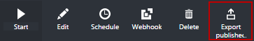

Sie können eine Graphical oder grafisch PowerShell Workflow Runbooks-Datei importieren, indem Sie die Option **Importieren** beim Hinzufügen einer Runbooks auswählen.   Wenn Sie die zu importierende Datei auswählen, können Sie den gleichen **Namen** beibehalten oder Bereitstellen ein neues Kontos.  Nachdem die ausgewählte Datei bewertet und wenn Sie versuchen, einen anderen Typ auszuwählen, der nicht korrekt ist, eine Nachricht behandelt werden beachtet werden mögliche Konflikte vorhanden sind und während der Konvertierung könnte Syntaxfehler, wird im Feld Art Runbooks den Typ des Runbooks angezeigt.  

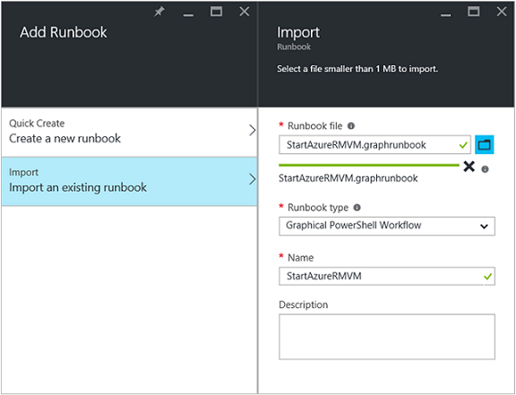

### Testen einer grafisch Runbooks

Sie können die Entwurfsversion der eine Runbooks Azure-Portal testen, während unverändert bei Verlassen der veröffentlichten Version des des Runbooks, oder Sie können eine neue Runbooks testen, bevor sie veröffentlicht wurde. So können Sie überprüfen, ob die Runbooks ordnungsgemäß funktioniert, bevor Sie die veröffentlichte Version ersetzen. Wenn Sie eine Runbooks testen, des Runbooks Entwurf ausgeführt, und alle Aktionen, die sie ausführt abgeschlossen werden. Keine Historie erstellt, aber die Ausgabe im Ausgabebereich Test angezeigt wird. 

Öffnen Sie das Steuerelement zum Testen der für eine Runbooks, indem des Runbooks für bearbeiten zu öffnen, und klicken Sie dann auf die Schaltfläche **Test-Fenster** .

Das Steuerelement zum Testen der wird für alle Eingabeparameter Aufforderung, und Sie können die Runbooks, indem Sie auf die Schaltfläche **Start** beginnen.

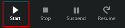

### Veröffentlichen einer grafisch Runbooks

Jede Runbooks in Azure Automatisierung hat einen Entwurf und eine veröffentlichte Version. Steht nur für die veröffentlichte Version ausgeführt werden soll, und nur die Entwurfsversion bearbeitet werden kann. Die veröffentlichte Version ist von Änderungen an der Entwurfsversion nicht betroffen. Wenn die Entwurfsversion zur Verfügung bereit ist, veröffentlichen Sie ihn die veröffentlichte Version mit der Entwurfsversion überschreibt.

Sie können eine grafisch Runbooks Öffnen des Runbooks für bearbeiten und dann auf die Schaltfläche " **Veröffentlichen** " auf veröffentlichen.

Wenn eine Runbooks noch nicht veröffentlicht wurde, hat es den Status **neu**.  Wenn sie veröffentlicht wird, hat er den Status **veröffentlicht**.  Wenn Sie nach dem es veröffentlicht wurde, und die Entwurf und der veröffentlichten Versionen unterscheiden sich des Runbooks bearbeiten, hat des Runbooks den Status **In bearbeiten**.

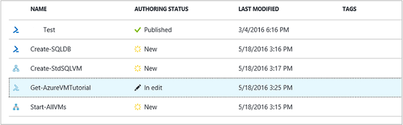 

Sie haben auch die Option, um die veröffentlichte Version des einer Runbooks wiederherzustellen.  Dadurch wird das abwesend Änderungen vorgenommen werden, da des Runbooks zuletzt veröffentlicht wurde, und die Entwurfsversion der des Runbooks durch die veröffentlichte Version ersetzt.

## Aktivitäten

Aktivitäten sind die Bausteine einer Runbooks.  Eine Aktivität kann ein PowerShell-Cmdlet, eine untergeordnete Runbooks oder einer Workflow-Aktivität sein.  Sie hinzufügen eine Aktivität zu des Runbooks rechten Maustaste klicken sie in der Bibliothek Steuerelement und **zu Zeichnungsbereich hinzufügen**.  Sie können dann klicken Sie auf, und ziehen Sie die Aktivität, um sie an beliebiger Stelle in den Zeichenbereich einfügen, die Ihnen gefällt.  Die Position des der von der Aktivität auf den Zeichenbereich hat keinen Einfluss auf die Bedienung des Runbooks in keiner Weise.  Sie können Layout Ihrer Runbooks jedoch Sie am besten geeigneten visualisiert werden sollen, deren Vorgang gefunden. 

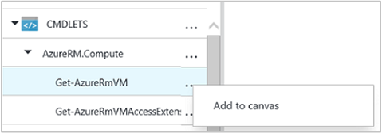

Wählen Sie die Aktivität auf den Zeichenbereich so konfigurieren Sie ihre Eigenschaften und Parameter in der Konfiguration Blade aus.  Sie können die **Bezeichnung** der Aktivität zu ändern, die Sie beschreibende ist.  Mit dem ursprüngliche Cmdlet weiterhin ausgeführt wird, ändern Sie einfach den Anzeigenamen, der im grafischen-Editor verwendet wird.  Die Bezeichnung muss innerhalb des Runbooks eindeutig sein. 

### Parametersätze

Eine Reihe von Parameter definiert die erforderlichen und optionalen Parameter, die Werte für ein bestimmtes Cmdlet akzeptieren.  Alle Cmdlets müssen mindestens einen Parameter festlegen, und einige verfügen über mehrere.  Wenn ein Cmdlet mehrere Parameter Datensätze enthält, müssen Sie die auswählen verwendet werden soll, bevor Sie Parameter konfigurieren können.  Die Parameter, die Sie konfigurieren können, hängt von der Parameter festgelegt ist, die Sie auswählen.  Sie können Parameter festlegen untersuchten durch eine Aktivität auswählen der **Parameter so eingerichtet** , und markieren einen weiteren Satz ändern.  In diesem Fall sind alle Parameterwerte, die so konfiguriert, Sie dass verloren.

Im folgenden Beispiel wurde das Cmdlet "Get-AzureRmVM" drei Parametersätze.  Parameterwerte können nicht konfiguriert werden, bis Sie eines der Parameter ausgewählt ist.  Der ListVirtualMachineInResourceGroupParamSet Parameter festgelegt ist für die Rückgabe von allen virtuellen Computern in einer Ressourcengruppe und hat einen einzelnen optionalen Parameter.  Die GetVirtualMachineInResourceGroupParamSet ist für die Angabe des virtuellen Computers zurückkehren möchten, und verfügt über zwei obligatorisch und ein optionaler Parameter.

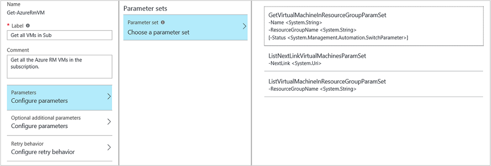

#### Parameterwerte

Wenn Sie einen Wert für einen Parameter angeben möchten, wählen Sie eine Datenquelle, um zu bestimmen, wie der Wert angegeben wird.  Die gültigen Werte für diesen Parameter ist die Datenquellen, die für einen bestimmten Parameter verfügbar sind abhängig.  Null werden beispielsweise nicht verfügbare Option für einen Parameter, die keine Nullwerte zulässt.

| Datenquelle | Beschreibung |
|:---|:---|
|Konstanter Wert|Geben Sie einen Wert für den Parameter ein.  Diese Option ist nur verfügbar, für die folgenden Datentypen: Int32, Int64, String, Boolesch, DateTime, wechseln. |
|Aktivität Ausgabe|Die Ausgabe einer Aktivität, die die aktuelle Aktivität im Workflow vorangestellt ist.  Alle gültige Aktivitäten werden aufgelistet.  Wählen Sie nur die Aktivität deren Ausgabe für den Parameterwert verwendet werden soll.  Wenn die Aktivität ein Objekts mit mehreren Eigenschaften gibt, können Sie den Namen der Eigenschaft nach der Auswahl der Aktivität eingeben.|
|Runbooks Eingabe |Wählen Sie einen Eingabeparameter Runbooks als Eingabe für den Aktivitätsparameter aus.|  
|Variable Anlage|Wählen Sie eine Automatisierung Variable als Eingabe.|  
|Anmeldeinformationen Anlage|Wählen Sie eine Automatisierung Anmeldeinformationen als Eingabe ein.|  
|Zertifikat Anlage|Wählen Sie ein Zertifikat Automatisierung als Eingabe aus.|  
|Verbindung Anlage|Wählen Sie eine Verbindung Automatisierung als Eingabe aus.| 
|PowerShell-Ausdruck|Einfache [PowerShell Ausdruck](#powershell-expressions)angeben.  Bevor Sie die Aktivität und das Ergebnis des Parameterwerts verwendet wird der Ausdruck ausgewertet werden.  Sie können Variablen verwenden, auf die Ausgabe einer Aktivität oder einer Runbooks Eingabeparameter verweisen.|
|Nicht konfiguriert|Löscht alle Werte, die zuvor konfiguriert wurde.|

#### Optionale zusätzliche Parameter

Alle Cmdlets haben die Option zusätzliche Parameter angeben.  Dies sind allgemeine PowerShell-Parameter oder anderen benutzerdefinierten Parameter.  Es wird ein Textfeld angezeigt, in dem Sie Parameter mit PowerShell Syntax bereitgestellt werden.  Beispielsweise, um den allgemeinen **ausführlich** -Parameter verwenden möchten, geben Sie **"-ausführlich: $True"**.

### Wiederholen Sie die Aktivität

**Wiederholen Sie Verhalten** ermöglicht eine Aktivität mehrmals ausgeführt werden, bis eine bestimmte Bedingung erfüllt ist, wie viel endlos wiedergegeben wird.  Sie können dieses Feature für Aktivitäten, die mehrmals ausgeführt werden soll, sind störanfällig und möglicherweise müssen mehrere für Erfolg versuchen oder testen die Ausgabeinformationen für die Aktivität für gültige Daten.    

Wenn Sie nach einer Aktivität wiederholen aktivieren, können Sie eine Verzögerung und eine Bedingung festlegen.  Die Verzögerung ist die Zeit (gemessen in Sekunden oder Minuten), dass die Runbooks wartet, bevor die Aktivität erneut ausgeführt wird.  Wenn keine Verzögerung angegeben ist, wird die Aktivität erneut ausgeführt, sofort nach Beendigung. 

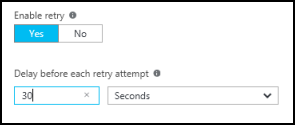

Die Bedingung "Wiederholen" ist ein PowerShell-Ausdruck, der nach jedem ausgewertet wird, wenn die Aktivität ausgeführt wird.  Wenn der Ausdruck true ergibt, wird die Aktivität erneut.  Wenn der Ausdruck False ergibt dann die Aktivität nicht erneut ausgeführt wird, und des Runbooks wechselt zum nächsten Aktivität. 

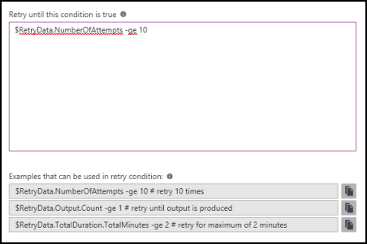

Die Bedingung "Wiederholen" können eine Variable namens $RetryData, die Zugriff auf Informationen über die Aktivität Wiederholungsversuche bereitstellt.  Diese Variable verfügt über die Eigenschaften in der folgenden Tabelle.

| Eigenschaft | Beschreibung |
|:--|:--|
| NumberOfAttempts | Anzahl der Fälle, in denen die Aktivität ausgeführt wurde.              |
| Die Ausgabe           | Die Ausgabe der Aktivität der letzten ausführen.                    |
| TotalDuration    | Zeitlich sind, da die Aktivität zum ersten Mal gestartet wurde. |
| StartedAt        | Zeit im UTC-Format, die die Aktivität zuerst eingeleitet wurde.           |

Im folgenden sind Beispiele für Aktivitäten wiederholen Bedingungen.

    # Run the activity exactly 10 times.
    $RetryData.NumberOfAttempts -ge 10 

    # Run the activity repeatedly until it produces any output.
    $RetryData.Output.Count -ge 1 

    # Run the activity repeatedly until 2 minutes has elapsed. 
    $RetryData.TotalDuration.TotalMinutes -ge 2

Nachdem Sie eine Bedingung "Wiederholen" für eine Aktivität konfigurieren, enthält die Aktivität zwei visuelle Hinweise, um Sie zu erinnern.  Eine der in die Aktivität dargestellt wird, und das andere ist, wenn Sie die Konfiguration der Aktivität überprüfen.

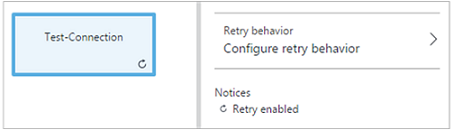

### Workflow-Skript-Steuerelement

Ein Code-Steuerelement ist eine spezielle Aktivität, die akzeptiert PowerShell oder PowerShell Workflow Skript je nach Typ der grafisch Runbooks, die verfasst, um die Funktionalität bereit, die andernfalls möglicherweise nicht verfügbar sind.  Es kann keine Parameter annehmen, aber es Variablen für Aktivität Ausgabe und Runbooks Eingabeparameter verwenden.  Der Databus wird keine Ausgabe der Aktivität hinzugefügt, es sei denn, sie hat keine ausgehenden verknüpfen, wobei das Ergebnis des Runbooks hinzugefügt wurde.

Der folgende Code führt beispielsweise Datum Berechnungen mit einer Variablen der Runbooks Eingabewerte $NumberOfDays bezeichnet.  Dann wird einen berechnete Uhrzeit sendet, in der Ausgabe von nachfolgenden Aktivitäten in des Runbooks verwendet werden soll.

    $DateTimeNow = (Get-Date).ToUniversalTime()
    $DateTimeStart = ($DateTimeNow).AddDays(-$NumberOfDays)}
    $DateTimeStart

## Links und den workflow

Einen **Link** in einer grafisch Runbooks verbindet zwei Aktivitäten.  Es wird als eine aus der Quelle Aktivität die Zielaktivität zeigender Pfeil auf den Zeichenbereich angezeigt.  Führen Sie die Aktivitäten in die Richtung des Pfeils mit dem Zielaktivität beginnen, nachdem die Quelle Aktivität abgeschlossen ist.  

### Erstellen eines Links

Erstellen einer Verknüpfung zwischen zwei Aktivitäten, indem Sie die Quelle Aktivität und durch Klicken auf den Kreis am unteren Rand der Form.  Ziehen Sie den Pfeil, um die Ziel-Aktivitäten und Freigabe.

Wählen Sie den Link, um die Konfiguration Blade dessen Eigenschaften konfigurieren.  Dazu gehören die Verknüpfungsart die beschrieben wird in der folgenden Tabelle.

| Verknüpfungsart | Beschreibung |
|:---|:---|
| Verkaufspipeline | Die Zielaktivität wird einmal für jedes Objektausgabe aus der Quelle Aktivität ausgeführt.  Die Zielaktivität wird nicht ausgeführt, wenn die Quelle Aktivität keine Ausgabe ergibt.  Ergebnisse der Quelle Aktivität steht als Objekt.  |
| Sequenz | Die Zielaktivität wird nur einmal ausgeführt.  Sie empfängt ein Array von Objekten aus der Quelle Aktivität.  Ergebnisse der Quelle Aktivität wird als ein Array von Objekten zur Verfügung. |

### Beginnt mit Aktivität

Eine grafisch Runbooks beginnt mit einem beliebigen Aktivitäten, die nicht über einen eingehenden Link verfügen.  Dies ist oft nur eine Aktivität werden die als die erste Aktivität für des Runbooks fungieren möchten.  Wenn mehrere Aktivitäten nicht über einen eingehenden Link verfügen, wird des Runbooks gestartet, indem Sie sie parallel ausführen.  Es wird dann führen Sie die Links, um andere Aktivitäten ausführen, während der Vorgang abgeschlossen ist.

### Bedingungen

Wenn Sie eine Bedingung auf einen Link angeben, wird die Zielaktivität nur ausgeführt, wenn die Bedingung zu aufgelöst wahr.  Sie werden in der Regel eine $ActivityOutput-Variable in einer Bedingung verwendet, zum Abrufen der Ausgabe aus der Quelle Aktivität.  

Für eine Verknüpfung Verkaufspipeline Geben Sie eine Bedingung für ein einzelnes Objekt, und die Bedingung für jedes Objektausgabe von der Quelle Aktivität ausgewertet wird.  Die Zielaktivität wird dann für jedes Objekt ausgeführt, das die Bedingung erfüllt.  Beispielsweise konnte mit einer Quelle Aktivität der Get-AzureRmVm, die folgende Syntax für eine bedingte Verkaufspipeline Link verwendet werden nur virtuellen Computern in der Ressourcengruppe mit dem Namen *Gruppe1*abgerufen.  

    $ActivityOutput['Get Azure VMs'].Name -match "Group1"

Für einen Link Sequenz ist die Bedingung nur einmal ausgewertet, da ein einzelnes Array zurückgegeben wird, enthält alle Objekte Ergebnisse der Quelle Aktivität.  Aus diesem Grund ein Link Sequenz kann nicht zum Filtern von wie Verkaufspipeline Link verwendet werden, jedoch wird einfach bestimmen, ob die nächste Aktivität ausgeführt wird. Nehmen Sie zum Beispiel den folgenden Satz von Aktivitäten in unseren Runbooks Starten virtueller Computer.  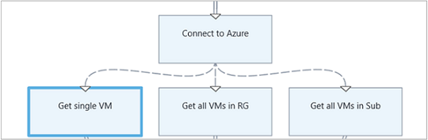 
Es gibt drei verschiedene Sequenz Links, die Werte wurden bereitgestellt, um zwei Runbooks Eingabeparameter darstellt, Name des virtuellen Computers und Ressourcengruppe Namen bei der Feststellung also die entsprechende Aktion - überprüfenden ein einzelnes virtuellen Computers zu starten, starten Sie alle virtuellen Computern in der Gruppe von Ressourcen oder alle virtuellen Computern in ein Abonnement.  Für die Sequenz Verknüpfung zwischen mit Azure verbinden und Get einzelnen virtuellen Computer sieht die Bedingung Logik aus:

    <# 
    Both VMName and ResourceGroupName runbook input parameters have values 
    #>
    (
    (($VMName -ne $null) -and ($VMName.Length -gt 0))
    ) -and (
    (($ResourceGroupName -ne $null) -and ($ResourceGroupName.Length -gt 0))
    )

Wenn Sie einen Link bedingten verwenden, werden die Daten aus der Quelle Aktivität zu anderen Aktivitäten in dieser Verzweigung verfügbar nach der Bedingung gefiltert werden.  Ist eine Aktivität der Datenquelle verfügen, um mehrere Links, werden die verfügbaren Aktivitäten in jeder Verzweigung Daten auf die Bedingung in der Herstellen einer Verbindung mit diesen Zweig Verknüpfung abhängig sind.

Beispielsweise wird die **Start-AzureRmVm** Aktivität in der nachstehenden Runbooks allen virtuellen Computern gestartet.  Es hat zwei bedingten Links.  Der erste bedingte Link verwendet den Ausdruck *$ActivityOutput ['Start-AzureRmVM']. IsSuccessStatusCode - Eq $true* zum Filtern, wenn die Aktivität Start-AzureRmVm erfolgreich abgeschlossen wurde.  Die zweite verwendet den Ausdruck *$ActivityOutput ['Start-AzureRmVM']. IsSuccessStatusCode - neuer $true* zum Filtern, wenn die Aktivität Start-AzureRmVm Fehler beim Starten des virtuellen Computers.  

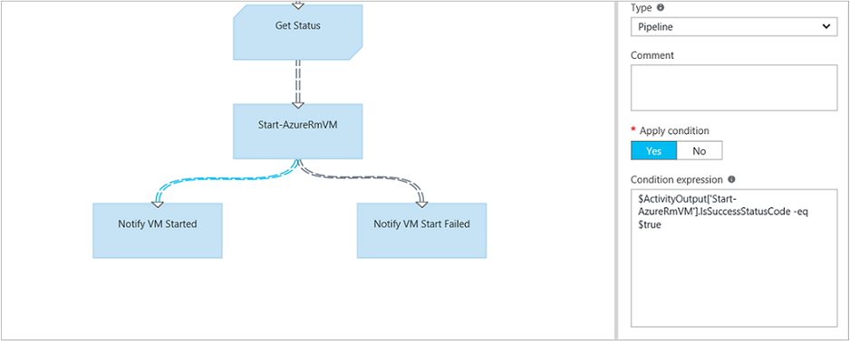

Jede Tätigkeit folgt, die den ersten Link und verwendet die Aktivität Ausgabe von Get-AzureVM nur den virtuellen Computern erhalten, die zum Zeitpunkt gestartet wurden, die Get-AzureVM ausgeführt wurde.  Alle Aktivitäten, die die zweite Verknüpfung folgt erhalten nur die den virtuellen Computern, die zum Zeitpunkt gestoppt wurden, der Get-AzureVM ausgeführt wurde.  Folgen den Link dritten Aktivitäten erhalten alle virtuellen Computern unabhängig vom laufenden Status.

### Kabelanschlüsse

Eine Verbindung ist eine spezielle Aktivitäten, die erst alle eingehende Verzweigungen abgeschlossen haben.  So können Sie mehrere Aktivitäten parallel ausgeführt werden, und stellen Sie sicher, dass alle abgeschlossen haben, bevor Sie fortfahren.

Eine Verbindung eine unbegrenzte Anzahl von eingehende Hyperlinks kann zwar haben, kann nicht mehr als eins der diese Links eine Verkaufspipeline sein.  Die Anzahl der eingehenden Sequenz Links ist nicht eingeschränkt.  Sie können verwendet werden, um sich die Verbindung mit mehreren eingehende Verkaufspipeline Links erstellen und Speichern des Runbooks, aber es schlägt fehl, wenn er ausgeführt wird.

Im folgenden Beispiel ist Teil einer Runbooks, die eine Reihe von virtuellen Computern beginnt, während gleichzeitig herunterladen von Patches auf diesen Computern angewendet werden.  Eine Verbindung wird verwendet, um sicherzustellen, dass beide Prozesse abgeschlossen sind, bevor die Runbooks fortgesetzt wird.

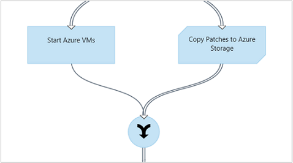

### Zyklen

Ein Zyklus ist bei einem Ziel Aktivität Links wieder an seine Quelle Aktivität oder an eine andere Aktivität, die später Links zur Quelle zurück.  Zyklen werden beim Verfassen von grafisch derzeit nicht zulässig.  Wenn Ihre Runbooks ein Zyklus enthält, ordnungsgemäß speichern wird jedoch erhalten eine Fehlermeldung, wenn es ausgeführt wird.

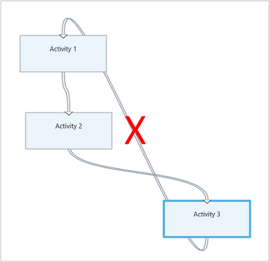

### Freigeben von Daten zwischen Aktivitäten

Alle Daten, die durch eine Aktivität mit einer Verknüpfung mit ausgehenden ausgegeben werden, werden in der *Databus* für des Runbooks geschrieben.  In der Runbooks keine Aktivitäten können Daten auf der Databus zum Füllen Parameterwerte oder zum Einschließen in Skriptcode.  Eine Aktivität kann die Ausgabe alle vorherigen Aktivität im Workflow zugreifen.     

Wie die Daten in die Databus geschrieben werden, hängt von den Typ des Links auf der Aktivität ab.  Für eine **Verkaufspipeline**sind die Daten Ausgabe als Vielfache Objekte an.  Für einen Link **Sequenz** sind die Daten Ausgabe als Array.  Ist nur einen Wert, wird es als Array mit einem einzelnen Element ausgegeben werden.

Sie können Daten in der Databus mithilfe einer der beiden Methoden zugreifen.  Zunächst wird eine **Aktivität Ausgabe** als Datenquelle verwenden, ein Parameters einer anderen Aktivität gefüllt wird.  Wenn die Ausgabe eines Objekts ist, können Sie eine einzelne Eigenschaft angeben.

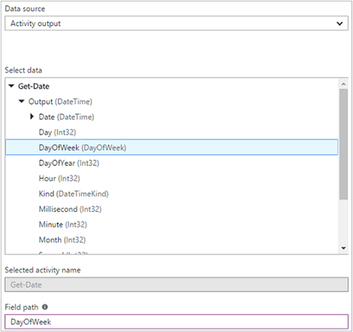

Sie können auch die Ausgabe einer Aktivität in einer Datenquelle **PowerShell Ausdruck** oder einen **Workflowskript** Aktivität mit einer Variablen ActivityOutput abrufen.  Wenn die Ausgabe eines Objekts ist, können Sie eine einzelne Eigenschaft angeben.  ActivityOutput Variablen verwenden Sie die folgende Syntax.

    $ActivityOutput['Activity Label']
    $ActivityOutput['Activity Label'].PropertyName 

### Kontrollpunkten

Sie können in einer Runbooks grafisch PowerShell-Workflow [Kontrollpunkten](automation-powershell-workflow.md#checkpoints) festlegen, indem Sie auf eine beliebige Aktivität *Wissensstand Runbooks* auswählen.  Dadurch wird eine Wissensstand festgelegt werden, nachdem die Aktivität ausgeführt wird.

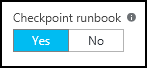

Kontrollpunkten nur Runbooks grafisch PowerShell-Workflow aktiviert sind, es ist nicht verfügbar in grafisch Runbooks.  Wenn des Runbooks Azure Cmdlets verwendet, befolgen Sie alle geprüfte Aktivitäten mit einer hinzufügen-AzureRMAccount Fall des Runbooks die App angehalten wird und neu gestartet wurde aus dieser Wissensstand auf einem anderen Arbeitskollegen. 

## Authentifizierung für Azure Ressourcen

Runbooks in Azure Automatisierung, mit denen Azure Ressourcen verwaltet werden Azure-Authentifizierung erforderlich.  Das neue [Konto ausführen als](automation-sec-configure-azure-runas-account.md) Feature (auch als Hauptbenutzer Dienst bezeichnet) ist die Standardmethode, um Ihr Abonnement mit Automatisierung Runbooks Azure Ressourcenmanager Ressourcen zugreifen.  Sie können dieses Feature einer grafisch Runbooks hinzufügen durch Hinzufügen der **AzureRunAsConnection** Verbindung Anlage, die der PowerShell [Get-AutomationConnection](https://technet.microsoft.com/library/dn919922%28v=sc.16%29.aspx) -Cmdlet, und klicken Sie auf [Add-AzureRmAccount](https://msdn.microsoft.com/library/mt619267.aspx) -Cmdlet zum den Zeichenbereich verwendet wird. Dies wird im folgenden Beispiel veranschaulicht. 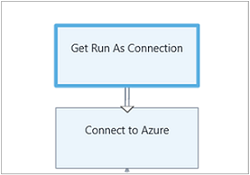 
Die erste Ausführen als Verbindung Aktivität (d. h. Get-AutomationConnection), wird ein konstanter Wert für die Datenquelle mit dem Namen AzureRunAsConnection konfiguriert. 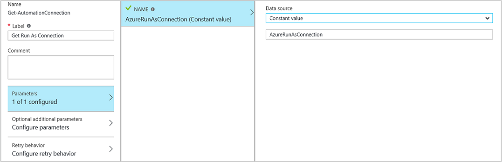 
Die nächste Aktivität, AzureRmAccount-hinzufügen, fügt der authentifizierten Ausführen als Konto für die Verwendung des Runbooks hinzu. 
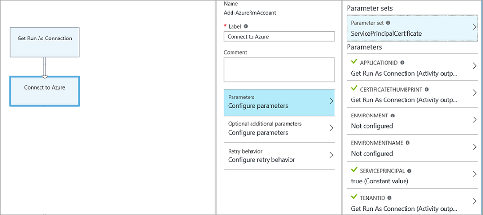 
Für die Parameter **p**, **CERTIFICATETHUMBPRINT**und **TENANTID** müssen Sie den Namen der Eigenschaft für das Feldpfad angeben, da die Aktivität ein Objekts mit mehreren Eigenschaften ausgegeben.  Andernfalls tritt sie beim Ausführen des Runbooks Authentifizierung ein.  Dies ist, was Sie zumindest müssen Ihre Runbooks durch das Konto ausführen als authentifiziert.

Wenn Abwärtskompatibilität Kompatibilität für Abonnenten beibehalten möchten, die ein Automatisierung Konto mithilfe eines [Azure AD-Benutzerkonto](automation-sec-configure-aduser-account.md) zum Verwalten von Azure Service Management (ASM) oder Azure Ressourcenmanager Ressourcen erstellt haben, ist die Methode zum Authentifizieren des Cmdlets hinzufügen-AzureAccount mit einer [Anlage Anmeldeinformationen](http://msdn.microsoft.com/library/dn940015.aspx) , die Active Directory-Benutzer mit Zugriff auf das Konto Azure darstellt.

Sie können dieses Feature zu einer grafisch Runbooks durch Hinzufügen einer Anlage Anmeldeinformationen auf den Zeichenbereich, gefolgt von einer Aktivität hinzufügen-AzureAccount hinzufügen.  Hinzufügen von AzureAccount verwendet die Aktivität Anmeldeinformationen für die Eingabe.  Dies wird im folgenden Beispiel veranschaulicht.

Sie müssen am Anfang des Runbooks und nach jeder Wissensstand authentifizieren.  Dies bedeutet eine Erweiterung hinzufügen-AzureAccount Aktivität nach Handlungen Wissensstand-Workflow hinzufügen. Nicht benötigen eine Erweiterung Anmeldeinformationen Aktivität, da Sie die gleiche verwenden können 

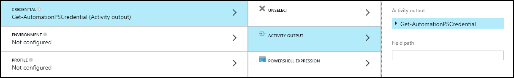

## Runbooks ein- und Ausgabe

### Runbooks Eingabe

Eine Runbooks möglicherweise die Eingabe von einem Benutzer beim Starten von des Runbooks über das Azure-Portal oder aus einer anderen Runbooks benötigen, wenn der aktuellen Zeile als untergeordnetes Element verwendet wird.
Wenn Sie eine Runbooks, die einen virtuellen Computern erstellt wird verfügen, müssen Sie Informationen wie den Namen des virtuellen Computers und andere Eigenschaften jedes Mal, dass Sie Starten des Runbooks bereitstellen.  

Sie akzeptieren Eingabe für eine Runbooks, indem Sie definieren eine oder mehrere Eingabeparameter aufweisen.  Sie geben Sie Werte für diesen Parameter jedes Mal, wenn die Runbooks gestartet wird.  Wenn Sie eine Runbooks mit dem Portal Azure beginnen, fordert es Sie Werte für die einzelnen des Runbooks für den Eingabeparameter angeben.

Sie können mit der **Eingabe und Ausgabe** Schaltfläche auf der Symbolleiste Runbooks Eingabeparameter für eine Runbooks zugreifen.  

 

Daraufhin wird das Steuerelement **ein- und Ausgabe** in dem vorhandenen Eingabeparameter bearbeiten oder einen neuen erstellen, indem Sie auf **Eingabesprache hinzufügen**. 

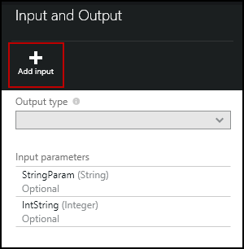

Jeder Eingabeparameter wird durch die Eigenschaften in der folgenden Tabelle definiert.

|Eigenschaft|Beschreibung|
|:---|:---|
| Namen | Der eindeutige Name des Parameters.  Dies kann nur alpha numerische Zeichen enthalten und darf ein Leerzeichen enthalten. |
| Beschreibung | Eine optionale Beschreibung für den Eingabeparameter.  |
| Typ | Der Datentyp für den Parameterwert erwartet.  Azure-Portal bietet geeignete Steuerelemente für den Datentyp für jeden Parameter Wenn zur Eingabe aufgefordert werden. |
| Obligatorisch | Gibt an, ob ein Wert für den Parameter angegeben werden muss.  Des Runbooks kann nicht gestartet werden, wenn Sie einen Wert nicht für jeden obligatorische Parameter angeben, die nicht über ein Standardwert definiert verfügt. |
| Standardwert | Gibt an, welcher Wert für den Parameter verwendet wird, wenn eine nicht bereitgestellt wird.  Dies kann entweder Null oder einen bestimmten Wert sein. |

### Runbooks Ausgabe

Die [Ausgabe des Runbooks](http://msdn.microsoft.com/library/azure/dn879148.aspx)werden Daten aller Aktivitäten, die nicht über eine ausgehende Verbindung verfügt erstellte hinzugefügt werden.  Die Ausgabe wird mit dem Runbooks Auftrag gespeichert und steht für einen übergeordneten Runbooks Wenn als untergeordnetes Element des Runbooks verwendet wird.  

## PowerShell-Ausdrücke

Einer der Vorteile der grafisch authoring ist für Sie die Möglichkeit zum Erstellen einer Runbooks mit minimalen Kenntnisse PowerShell bereit.  Aktuell, müssen Sie ein bisschen PowerShell für Auffüllen von bestimmter [Parameterwerte](#activities) und zum Einrichten der [Link Bedingungen](#links-and-workflow)kennen.  Dieser Abschnitt enthält eine kurze Einführung in PowerShell-Ausdrücke für die Benutzer, die möglicherweise nicht vertraut sind.  Detaillierte Informationen zur PowerShell sind unter [Skripting mit Windows PowerShell](http://technet.microsoft.com/library/bb978526.aspx)verfügbar. 

### PowerShell Ausdruck-Datenquelle

Einen Ausdruck PowerShell können als Datenquelle Sie den Wert eines [Parameters Aktivitäten](#activities) mit den Ergebnissen der PowerShell-Code gefüllt wird.  Dies kann eine einzelne Zeile mit Code sein, die führt einige einfache Funktion oder mehrere Zeilen, die eine komplexe Logik ausführen.  Alle Ausgabe eines Befehls, das nicht zu einer Variablen zugeordnet ist wird an den Parameterwert. 

Beispielsweise würde mit dem folgende Befehl das aktuelle Datum ausgeben. 

    Get-Date

Die folgenden Befehle erstellen eine Zeichenfolge ab dem aktuellen Datum und einer Variablen zuweisen.  Der Inhalt der Variablen werden dann an die Ausgabe gesendet. 

    $string = "The current date is " + (Get-Date)
    $string

Die folgenden Befehle ausgewertet werden das aktuelle Datum und eine Zeichenfolge, die angibt, ob das aktuelle Datum ein Wochenende oder Weekday ist zurückgeben. 

    $date = Get-Date
    if (($date.DayOfWeek = "Saturday") -or ($date.DayOfWeek = "Sunday")) { "Weekend" }
    else { "Weekday" }
    
 
### Aktivität Ausgabe

Wenn die Ausgabe von einer früheren Aktivität in des Runbooks verwenden möchten, verwenden Sie die Variable $ActivityOutput mit der folgenden Syntax ein.

    $ActivityOutput['Activity Label'].PropertyName

Angenommen, Sie müssen möglicherweise eine Aktivität mit einer Eigenschaft, die den Namen eines virtuellen Computers erforderlich sind in diesem Fall könnten Sie den folgenden Ausdruck verwenden.

    $ActivityOutput['Get-AzureVm'].Name

Wenn die Eigenschaft, die den virtuellen Computern erforderlich statt nur eine Eigenschaft Objekt, möchten Sie das gesamte Objekt mithilfe der folgenden Syntax zurück.

    $ActivityOutput['Get-AzureVm']

Sie können auch die Ausgabe einer Aktivität in eine komplexere Ausdruck wie den folgenden verwenden, die Text, der Name des virtuellen Computers verkettet.

    "The computer name is " + $ActivityOutput['Get-AzureVm'].Name

### Bedingungen

Verwenden Sie [Vergleichsoperatoren](https://technet.microsoft.com/library/hh847759.aspx) zum Vergleichen von Werten oder feststellen, ob ein Wert mit einem bestimmten Muster entspricht.  Ein Vergleich gibt einen Wert entweder $true oder $false.

Beispielsweise bestimmt die folgende Bedingung an, ob die virtuellen Computern aus einer Aktivität mit dem Namen *Get-AzureVM* derzeit *beendet*ist. 

    $ActivityOutput["Get-AzureVM"].PowerState –eq "Stopped"

Die folgende Bedingung überprüft, ob die gleichen virtuellen Computern in einem anderen Status als *beendet*.

    $ActivityOutput["Get-AzureVM"].PowerState –ne "Stopped"

Sie können mehrere Konditionen, die mit einem [logischen Operator](https://technet.microsoft.com/library/hh847789.aspx) wie teilnehmen **- und** oder **- oder**.  Beispielsweise überprüft die folgende Bedingung an, ob die gleichen virtuellen Computern im vorherigen Beispiel in einem Zustand *angehalten* oder *beendet*ist.

    ($ActivityOutput["Get-AzureVM"].PowerState –eq "Stopped") -or ($ActivityOutput["Get-AzureVM"].PowerState –eq "Stopping") 

### Hashtables

[Hashtables](http://technet.microsoft.com/library/hh847780.aspx) sind Name/Wert-Paare, die für einen Satz von Werten zurückgeben hilfreich sind.  Eigenschaften für bestimmte Aktivitäten möglicherweise Hashtable anstelle einer einfachen Wert erwartet.  Möglicherweise wird auch als Hashtable genannt ein Wörterbuch angezeigt. 

Erstellen Sie eine Hashtabelle mit der folgenden Syntax.  Hashtable kann beliebig viele Einträge enthalten, aber jede wird durch einen Namen und einen Wert definiert.

    @{ <name> = <value>; [<name> = <value> ] ...}

Der folgende Ausdruck erstellt z. B. Hashtable in der Datenquelle für eine Aktivitätsparameter verwendet werden, die Hashtable mit Werten für eine Internetsuche erwartet.

    $query = "Azure Automation"
    $count = 10
    $h = @{'q'=$query; 'lr'='lang_ja';  'count'=$Count}
    $h

Im folgende Beispiel wird Ergebnisse einer Aktivität *Abrufen Twitter-Verbindung* genannt Hashtable gefüllt wird verwendet.

    @{'ApiKey'=$ActivityOutput['Get Twitter Connection'].ConsumerAPIKey;
      'ApiSecret'=$ActivityOutput['Get Twitter Connection'].ConsumerAPISecret;
      'AccessToken'=$ActivityOutput['Get Twitter Connection'].AccessToken;
      'AccessTokenSecret'=$ActivityOutput['Get Twitter Connection'].AccessTokenSecret}

## Nächste Schritte

- Um mit PowerShell Workflow Runbooks anzufangen, finden Sie unter [Meine erste PowerShell Workflow Runbooks](automation-first-runbook-textual.md) 
- Um mit grafisch Runbooks anzufangen, finden Sie unter [Meine erste grafisch Runbooks](automation-first-runbook-graphical.md)
- Weitere Informationen zu Datentypen Runbooks, deren vor- und Nachteile zu erhalten, finden Sie unter [Azure Automatisierung Runbooks Typen](automation-runbook-types.md)
- Wie für die Authentifizierung mithilfe des Automatisierung ausführen als Kontos finden Sie unter [Konfigurieren von Azure ausführen als Konto](automation-sec-configure-azure-runas-account.md)
 
