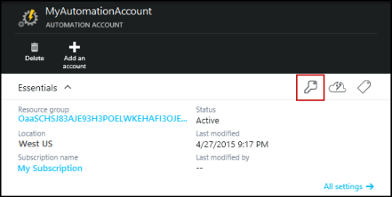
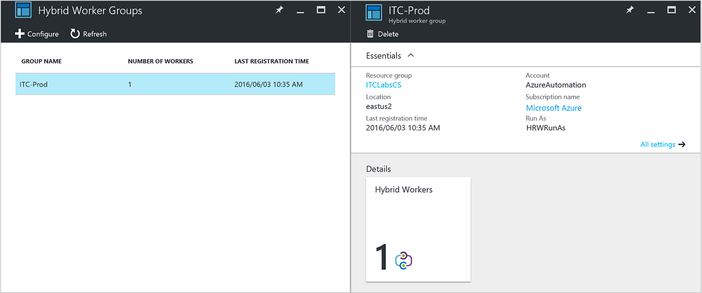
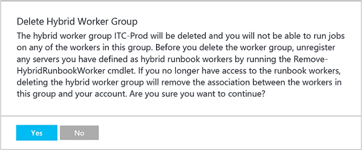

<properties
   pageTitle="Azure Automatisierung Hybrid Runbooks Worker | Microsoft Azure"
   description="Dieser Artikel enthält Informationen zum Installieren und Verwenden von Hybrid Runbooks Worker, eine Funktion der Azure-Automatisierung, die Sie Runbooks auf Computern in Ihrem lokalen Data Center ausführen können."
   services="automation"
   documentationCenter=""
   authors="mgoedtel"
   manager="jwhit"
   editor="tysonn" />
<tags
   ms.service="automation"
   ms.devlang="na"
   ms.topic="article"
   ms.tgt_pltfrm="na"
   ms.workload="infrastructure-services"
   ms.date="10/14/2016"
   ms.author="bwren" />

# Azure Automatisierung Hybrid Runbooks Kollegen

Runbooks in Azure Automatisierung zugreifen nicht Ressourcen in Ihrem lokalen Data Center, da diese in der Cloud Azure ausgeführt werden.  Das Feature Hybrid Runbooks Worker der Azure-Automatisierung können Sie Runbooks auf Computern, die in Ihrem Data Center und lokale Ressourcen verwalten ansässig ausführen. Die Runbooks gespeichert und verwaltet in Azure Automatisierung und klicken Sie dann auf eine oder mehrere lokalen Computer übermittelt.  

Dieses Feature ist in der folgenden Abbildung dargestellt.   

Sie können einem oder mehreren Computern in Ihrem Data Center dienen als eines Hybrid Runbooks Arbeitskollegen und Ausführen von Runbooks aus Azure Automatisierung festlegen.  Jeder Worker erfordert Microsoft Management Agent mit einer Verbindung mit Microsoft Operations Management Suite und der Azure Automatisierung Runbooks Umgebung.  Vorgänge Management Suite dient nur zum Installieren und Verwalten des Management Agents und die Funktionalität der der Worker zu überwachen.  Die Bereitstellung Runbooks und die Anweisung ausführen, werden durch Azure Automatisierung durchgeführt.

Es gibt keine eingehenden Firewall-Anforderungen zur Unterstützung von Hybrid Runbooks Kollegen aus. Der Agent auf dem lokalen Computer initiiert alle Kommunikation mit Azure Automatisierung in der Cloud. Wenn eine Runbooks gestartet wird, erstellt Azure Automatisierung eine Anweisung, die vom Agent abgerufen werden. Der Agent lädt dann herunter des Runbooks und alle Parameter vor dem Ausführen.  Es wird auch abgerufen werden alle [Ressourcen](http://msdn.microsoft.com/library/dn939988.aspx) , die durch die Runbooks aus Azure Automatisierung verwendet werden.

>[AZURE.NOTE] Hybrid Runbooks Kollegen unterstützen derzeit nicht [DSC Konfigurationen](automation-dsc-overview.md).

## Hybrid Runbooks Worker Gruppen

Jede Hybrid Runbooks Worker ist ein Mitglied einer Gruppe Hybrid Runbooks Worker, die Sie bei der Installation des Agents angeben.  Eine Gruppe kann einen einzelnen Agent enthalten, aber Sie können mehrere Agents installieren, in der Gruppe für eine hohe Verfügbarkeit.

Wenn Sie eine Runbooks eines Hybrid Runbooks Arbeitskollegen beginnen, geben Sie die Gruppe aus, die ausgeführt werden soll.  Die Mitglieder der Gruppe legt fest, welche Worker die Anforderung bedienen soll.  Sie können kein bestimmtes Arbeitskollegen angeben.

## Hybrid Runbooks Worker Anforderungen

Sie müssen mindestens einen lokalen Computer Hybrid Runbooks Auftrag ausführen festlegen.  Dieser Computer muss folgende Elemente aufweisen:

- WindowsServer 2012 oder höher
- Windows PowerShell 4.0 oder höher
- Mindestens zwei Kerne und 4 GB RAM

Folgende Punkte für Hybrid Kollegen: 

- Bestimmen Sie mehrere Hybrid Kollegen in jeder Gruppe hohen Verfügbarkeit.  
- Hybrid Kollegen können zusammen mit Service Management Automatisierung oder System Center Orchestrator Runbooks-Servern verwendet werden.
- Erwägen Sie einen Computer physisch befindet sich in oder in der Nähe der Region Ihres Kontos Automatisierung, da die Position Daten zurück zur Azure Automatisierung gesendet werden, bei Abschluss eines Auftrags aus.

>[AZURE.NOTE] Hybrid Runbooks Worker Version 7.2.11136.0 unterstützt zurzeit Kommunikation über einen Proxyserver nur mit PowerShell-Skripts.  Unterstützung für Skripts PowerShell-Workflow in zukünftigen Versionen zur Verfügung.  

### Konfigurieren von Proxy und Firewall-Einstellungen

Für die lokal Hybrid Runbooks Worker zum Herstellen einer Verbindung mit und mit dem Dienst Microsoft Operations Management Suite (OMS) registrieren müssen sie Zugriff auf die Nummer des Ports und die nachfolgend beschriebenen URLs.  Dies ist zusätzlich zu den [Ports und URLs für die Überwachung Microsoft Agent erforderlichen](../log-analytics/log-analytics-proxy-firewall.md#configure-proxy-and-firewall-settings-with-the-microsoft-monitoring-agent) Verbindung zum OMS. Wenn Sie einen Proxyserver für die Kommunikation zwischen dem Agent und OMS-Dienst verwenden, müssen Sie sicherstellen, dass die geeigneten Ressourcen zugegriffen werden kann. Wenn Sie eine Firewall zum Einschränken des Zugriffs mit dem Internet verwenden, müssen Sie zum Konfigurieren der Firewall, um den Zugriff gewähren. 

Die folgenden Informationen finden Sie im Anschluss und URLs, die für die Hybrid Runbooks Worker zur Kommunikation mit Automatisierung erforderlich sind.

- Port: Nur TCP 443 ist für ausgehende Internetzugang erforderlich
- Globale URL: *.azure-automation.net

Wenn Sie ein Automatisierung Konto für eine bestimmte Region definiert haben und Sie Kommunikation mit diesen regionale Datenzentrum einschränken möchten, bietet in der folgenden Tabelle den DNS-Eintrag für die einzelnen Regionen an.

|**Region**|**DNS-Eintrag**|
|--------------|--------------|
|Süd zentralen US|Scus-Jobruntimedata-Prod-su1.azure-automation.net|
|Ostasiatische USA 2|eus2-Jobruntimedata-Prod-su1.azure-automation.net|
|Westen Europa|Wir-Jobruntimedata-Prod-su1.azure-automation.net|
|North Europa|Neuer-Jobruntimedata-Prod-su1.azure-automation.net|
|Kanada Central|cc-Jobruntimedata-Prod-su1.azure-automation.net|
|Süd Ostasien|beringsee-Jobruntimedata-Prod-su1.azure-automation.net|
|Zentrale Indien|CID-Jobruntimedata-Prod-su1.azure-automation.net|
|Japan OST|Jpe-Jobruntimedata-Prod-su1.azure-automation.net|
|Australien Süden Osten|ASE-Jobruntimedata-Prod-su1.azure-automation.net|

## Installieren von Hybrid Runbooks Worker

Im folgenden Verfahren beschreibt das Installieren und Konfigurieren von Hybrid Runbooks Arbeitskollegen.  Führen Sie die ersten beiden Schritte einmal für Ihre Umgebung Automatisierung, und wiederholen Sie dann die verbleibenden Schritte für jeden Worker Computer.

### 1. Vorgänge Management Suite Arbeitsbereich erstellen

Wenn Sie noch nicht über ein Arbeitsbereich Vorgänge Management Suite verfügen, erstellen Sie eine mithilfe der Anweisungen am [Richten Sie den Arbeitsbereich](https://technet.microsoft.com/library/mt484119.aspx). Wenn Sie bereits über eine verfügen, können Sie einen vorhandenen Arbeitsbereich verwenden.

### 2. Automatisierung Lösung Vorgänge Management Suite Arbeitsbereich hinzufügen

Lösungen hinzugefügt Vorgänge Management Suite Funktionalität.  Die Lösung Automatisierung Fügt Funktionalität für Azure Automatisierung, einschließlich der Unterstützung für Hybrid Runbooks Worker hinzu.  Wenn Sie die Lösung zu dem Arbeitsbereich hinzufügen, wird es automatisch unten Worker-Komponenten auf dem Agentcomputer schieben, die Sie im nächsten Schritt installieren möchten.

Folgen Sie den Anweisungen bei [eine Lösung im Lösungskatalog mit hinzufügen](../log-analytics/log-analytics-add-solutions.md) die **Automatisierung** -Lösung in Ihrer Vorgänge Management Suite Arbeitsbereich hinzufügen.

### 3: Installieren Sie das Microsoft Agent für die Überwachung

Microsoft Agent Überwachung verbindet Computer mit Vorgänge Management Suite.  Wenn Sie den Agent auf dem lokalen Computer installieren und verbinden Sie es mit dem Arbeitsbereich, wird es für Hybrid Runbooks Worker erforderlichen Komponenten automatisch herunterladen.

Folgen Sie den Anweisungen bei [Computern unter Windows Verbinden zur Log Analytics](../log-analytics/log-analytics-windows-agents.md) den Agent auf dem lokalen Computer installieren.  Wiederholen Sie diesen Prozess für mehrere Computer, um zu Ihrer Umgebung mehrere Kollegen hinzufügen.

Wenn der Agent Vorgänge Management Suite erfolgreich eine Verbindung hergestellt wurde, wird es auf der Registerkarte **Datenquellen verbunden** Bereich Vorgänge Management Suite **Einstellungen** aufgelistet.  Sie können überprüfen, dass der Agent die Lösung Automatisierung ordnungsgemäß heruntergeladen wurde, wenn sie einen Ordner namens **AzureAutomationFiles** in c:\Programme\Microsoft c:\Programme\Microsoft Überwachung Agent\Agent hat.  Klicken Sie zum Bestätigen der Version der Hybrid Runbooks Worker können Sie zu c:\Programme c:\Programme\Microsoft Überwachung Agent\Agent\AzureAutomation\ und Notizen navigieren, die \\ *Version* Unterordner.   

### 4: Installieren der Umgebung Runbooks und Verbinden mit Azure Automatisierung

Wenn Sie einen Agent Vorgänge Management Suite hinzufügen, legt die Lösung Automatisierung unten das **HybridRegistration** PowerShell-Modul, das das Cmdlet **Hinzufügen-HybridRunbookWorker** enthält.  Sie verwenden dieses Cmdlet die Umgebung Runbooks auf dem Computer installieren und mit Azure Automatisierung zu registrieren.

Öffnen Sie eine PowerShell-Sitzung im Modus Administrator, und führen Sie folgende Befehle aus, um das Modul zu importieren.

    cd "C:\Program Files\Microsoft Monitoring Agent\Agent\AzureAutomation\<version>\HybridRegistration"
    Import-Module HybridRegistration.psd1

Führen Sie dann das **Hinzufügen HybridRunbookWorker** Cmdlet mithilfe der folgenden Syntax ein:

    Add-HybridRunbookWorker –Name <String> -EndPoint <Url> -Token <String>

Sie können die Informationen für dieses Cmdlet aus vorher **Schlüssel verwalten** in der Azure-Portal erhalten.  Öffnen Sie diese Blade, indem Sie auf das Key-Symbol auf dem Bedienfeld "Elemente" für das Konto Automatisierung.

- **Name** ist der Name der Hybrid Runbooks Worker Gruppe. Wenn Sie diese Gruppe in der Automatisierung Konto bereits vorhanden ist, wird der aktuelle Computer darauf hinzugefügt.  Wenn es nicht bereits vorhanden ist, wird er hinzugefügt.
- **Endpunkt** ist das Feld **URL** in das Blade **Schlüssel verwalten** .
- **Token** ist der **Access-Primärschlüssel** in das Blade **Schlüssel verwalten** .  

Verwenden der **-ausführliche** mit **Hinzufügen-HybridRunbookWorker** erhalten Sie detaillierte Informationen zur Installation wechseln.

### 5: Installieren Sie PowerShell-Module

Runbooks verwenden Sie eine der Aktivitäten und Cmdlets definiert die Module in Ihrer Umgebung Azure Automatisierung installiert sein.  Diese Module werden nicht automatisch auf dem lokalen Computer jedoch bereitgestellt, damit Sie manuell installieren müssen.  Eine Ausnahme ist der Azure-Modul die standardmäßig Bereitstellen des Zugriffs auf Cmdlets für alle Azure Dienste und Aktivitäten für Azure Automatisierung installiert ist.

Da der primäre Zweck des Hybrid Runbooks Worker Features zum Verwalten von lokaler Ressourcen ist, müssen Sie wahrscheinlich die Module zu installieren, die diese Ressourcen unterstützen.  Sie können Informationen zum Installieren von Windows PowerShell-Module auf [Module installieren](http://msdn.microsoft.com/library/dd878350.aspx) verweisen.

## Hybrid Runbooks Worker entfernen

Sie können eine oder mehrere Hybrid Runbooks Kollegen aus einer Gruppe entfernen oder Sie können die Gruppe entfernen, je nach Ihren Anforderungen.  Zum Entfernen eines Hybrid Runbooks Arbeitskollegen aus einer lokalen Computer öffnen Sie PowerShell-Sitzung im Modus Administrator, und führen Sie den folgenden Befehl - Cmdlet **HybridRunbookWorker entfernen** .  Verwenden der **-ausführliche** für eine detaillierte Protokollierung des Löschvorgangs wechseln. 

Dies wird die Überwachung Microsoft Agent nicht vom Computer, nur die Funktionen und Konfiguration der Rolle Hybrid Runbooks Worker entfernt.  

Um eine Gruppe zu entfernen, müssen Sie zuerst die Hybrid Runbooks Worker von allen Computern entfernen, die ein Mitglied der Gruppe mithilfe des Befehls zuvor dargestellt ist, und klicken Sie dann führen Sie die folgenden Schritte aus, um die Gruppe zu entfernen.  

1. Öffnen Sie das Konto Automatisierung Azure-Portal an.
2. Wählen Sie die Kachel **Hybrid Worker Gruppen** aus, und wählen Sie in das Blade **Hybrid Worker Gruppen** die Gruppe aus, die Sie löschen möchten.  Nach dem Sie die bestimmte Gruppe auswählen, wird das **Hybrid Worker Gruppe** Eigenschaften Blade angezeigt.     
3. Klicken Sie auf das Blade der Eigenschaften für die ausgewählten Gruppe klicken Sie auf **Löschen**.  Eine Meldung wird angezeigt, in denen Sie zur Bestätigung des Vorgangs, und wählen Sie **Ja** , wenn Sie sicher sind, dass Sie fortfahren möchten.    Dieser Vorgang kann einige Sekunden dauern, und können Sie den Fortschritt unter **Benachrichtigungen** über das Menü verfolgen.  

## Starten von Runbooks auf Hybrid Runbooks Worker

[Starten einer Runbooks in Azure Automatisierung](automation-starting-a-runbook.md) beschreibt verschiedene Methoden zum Starten einer Runbooks.  Hybrid Runbooks Worker Fügt eine **RunOn** aus, in dem Sie den Namen einer Hybrid Runbooks Worker Gruppe angeben können.  Wenn eine Gruppe angegeben wird, ist des Runbooks abgerufen und mit den Kollegen in dieser Gruppe auszuführen.  Wenn diese Option nicht angegeben ist, wird es im Azure Automatisierung wie gewohnt ausgeführt.

Wenn Sie eine Runbooks Azure-Portal beginnen, wird mit der Option **ausgeführt** angezeigt, in dem Sie **Azure** oder **Hybrid Worker**auswählen.  Wenn Sie **Hybrid Worker**auswählen, können Sie die Gruppe aus einer Dropdownliste auswählen.

Verwenden Sie den **RunOn** -Parameter, die Sie mit dem folgenden Befehl Starten einer Runbooks mit dem Namen Test-Runbooks einer Hybrid Runbooks Worker Gruppe mit dem Namen MyHybridGroup mithilfe der Windows PowerShell verwenden können.

    Start-AzureRmAutomationRunbook –AutomationAccountName "MyAutomationAccount" –Name "Test-Runbook" -RunOn "MyHybridGroup"

>[AZURE.NOTE] Mit dem **Start-AzureAutomationRunbook** -Cmdlet in Microsoft Azure PowerShell-Version 0.9.1 wurde der **RunOn** Parameter hinzugefügt.  Sie sollten [Laden Sie die neueste Version](https://azure.microsoft.com/downloads/) , wenn Sie eine frühere haben eine installiert.  Sie müssen nur diese Version auf einem Computer installieren, wo Sie des Runbooks von Windows PowerShell starten werden werden.  Sie müssen nicht auf dem Computer Worker installiert werden, wenn Sie beabsichtigen, Runbooks von diesem Computer zu starten.  Sie können keine aktuell beginnen einer Runbooks eines Hybrid Runbooks Arbeitskollegen aus einem anderen Runbooks, da dies die neueste Version von Azure Powershell in Ihr Konto Automatisierung installiert werden müssten.  Die neueste Version wird automatisch nach unten verschoben für die Worker bald und in Azure Automatisierung automatisch aktualisiert werden.

## Runbooks Berechtigungen

Ausführen auf einem Hybriden Runbooks Worker Runbooks kann nicht der gleichen [Methode, die in der Regel für Runbooks verwendeten, authentifizieren zu Azure Ressourcen](automation-configuring.md#configuring-authentication-to-azure-resources) verwendet werden, da Ressourcen außerhalb Azure zugreifen werden.  Des Runbooks kann entweder eine eigene Authentifizierung auf lokale Ressourcen bieten, oder Sie können angeben, dass ein Konto "runas", um einen Benutzerkontext für alle Runbooks bereitzustellen.

### Runbooks Authentifizierung

Standardmäßig wird Runbooks im Zusammenhang mit dem lokalen Systemkonto auf dem lokalen Computer ausgeführt, damit sie eigene Authentifizierung zu Ressourcen bieten müssen, die sie zugreifen können.  

[Anmelde-](http://msdn.microsoft.com/library/dn940015.aspx) und [Zertifikat](http://msdn.microsoft.com/library/dn940013.aspx) Anlagen können in Ihrem Runbooks mit Cmdlets, mit denen Sie Anmeldeinformationen angeben, damit Sie auf andere Ressourcen authentifizieren können.  Das folgende Beispiel zeigt einen Teil einer Runbooks, die einen Computer neu gestartet wurde.  Anmeldeinformationen aus einer Anlage Anmeldeinformationen und den Namen des Computers von einer Variable Anlage abgerufen und anschließend diese Werte verwendet, mit dem Cmdlet Computer neu starten.

    $Cred = Get-AzureRmAutomationCredential -ResourceGroupName "ResourceGroup01" -Name "MyCredential"
    $Computer = Get-AzureRmAutomationVariable -ResourceGroupName "ResourceGroup01" -Name  "ComputerName"

    Restart-Computer -ComputerName $Computer -Credential $Cred

Sie können auch [InlineScript auf](automation-powershell-workflow.md#inline-script) nutzen, mit denen Sie Blöcke von Code auf einem anderen Computer mit Anmeldeinformationen, die vom [PSCredential allgemeine Parameter](http://technet.microsoft.com/library/jj129719.aspx)angegebenen ausgeführt werden können.

### RunAs-Konto

Anstatt Runbooks eigene Authentifizierung auf lokale Ressourcen bereitstellen, können Sie ein Konto **RunAs** für eine Hybrid Worker Gruppe angeben.  Geben Sie eine [Anlage Anmeldeinformationen](automation-credentials.md) , die auf lokale Ressourcen zugreifen können, und alle Runbooks diese Anmeldeinformationen beim Ausführen auf einem Hybriden Runbooks Worker in der Gruppe ausgeführt wird.  

Der Benutzername für die Anmeldeinformationen muss in einem der folgenden Formate:

- domaene\benutzername 
- username@domain
- Benutzername (für Konten lokal auf dem lokalen Computer)

Verwenden Sie das folgende Verfahren, um ein Konto RunAs für eine Hybrid Worker Gruppe anzugeben:

1. Erstellen Sie eine [Anlage Anmeldeinformationen](automation-credentials.md) mit Zugriff auf lokale Ressourcen.
2. Öffnen Sie das Konto Automatisierung Azure-Portal an.
2. Wählen Sie die Kachel **Hybrid Worker Gruppen** aus, und wählen Sie dann die Gruppe aus.
3. Wählen Sie **Alle Einstellungen** und dann **Hybrid Worker Gruppe**ein.
4. **Führen Sie als** von **Standard** in **Benutzerdefiniert**ändern.
5. Wählen Sie die Anmeldeinformationen ein, und klicken Sie auf **Speichern**.

## Erstellen von Runbooks für Hybrid Runbooks Worker

Es gibt keine Unterschied in der Struktur des Runbooks, die in Azure Automatisierung und solche, die auf einem Hybriden Runbooks Worker ausführen ausgeführt werden. Runbooks, die bei jeder verwendet, wird erheblich wahrscheinlich durch unterscheiden, da Runbooks für Hybrid Runbooks Worker normalerweise, lokale Ressourcen in Ihrem Data Center verwalten werden während Runbooks in Azure Automatisierung normalerweise Ressourcen in der Cloud Azure verwalten. 

Sie können eine Runbooks für Hybrid Runbooks Worker in Azure Automatisierung bearbeiten, aber möglicherweise müssen Sie Probleme, wenn Sie versuchen, Testen des Runbooks im Editor.  Der PowerShell-Module, die Zugriff auf die lokalen Ressourcen möglicherweise nicht in diesem Fall in Ihrer Umgebung Azure Automatisierung installiert werden, sollte der Test fehl.  Wenn Sie die erforderlichen Module installieren, es ist nicht möglich Zugriff auf lokale Ressourcen für eine vollständige Überprüfung des Runbooks führen Sie dann

## Problembehandlung bei Runbooks auf Hybrid Runbooks Worker

[Runbooks Ausgabe und Nachrichten](automation-runbook-output-and-messages.md) gesendet wird Azure Automatisierung aus Hybrid Worker wie Runbooks Einzelvorgänge ausführen, in der Cloud.  Sie können auch aktivieren die ausführlich und den Fortschritt Streams die gleiche Weise, wie dies bei anderen Runbooks.  

Protokolle sind lokal auf jede Hybrid Worker am C:\ProgramData\Microsoft\System Center\Orchestrator\7.2\SMA\Sandboxes gespeichert.

Wenn Ihre Runbooks nicht erfolgreich Completeing sind und der Auftrag Zusammenfassung zeigt den Status **angehalten**, überprüfen Sie den Artikel zur Problembehandlung [Hybrid Runbooks Worker: ein Auftrags Runbooks beendet wird mit dem Status angehalten](automation-troubleshooting-hrw-runbook-terminates-suspended.md).   

## Beziehung zu Service Management Automatisierung

[Service Management Automatisierung (SMA)](https://technet.microsoft.com/library/dn469260.aspx) können Sie die gleichen Runbooks ausführen, die von der Azure-Automatisierung in Ihrem lokalen Data Center unterstützt werden. SMA ist im Allgemeinen in Verbindung mit Windows Azure Pack, bereitgestellt, wie Windows Azure Pack eine Benutzeroberfläche für die Verwaltung von SMA enthält. Im Gegensatz zu Azure-Automatisierung erfordert SMA eine lokale Installation, die Webserver, um die API, eine Datenbank zum Runbooks und SMA Konfiguration enthalten und Runbooks Arbeitskräften um Runbooks Aufträge ausführen hosten einschließt. Azure Automatisierung bietet die folgenden Dienste in der Cloud und nur müssen Sie die Hybrid Runbooks Kollegen in Ihrer lokalen Umgebung verwalten.

Wenn Sie einen vorhandenen SMA Benutzer sind, können Sie Ihre Runbooks verschieben, zu Azure Automatisierung mit Hybrid Runbooks Worker mit keine Änderungen verwendet werden soll, unter der Voraussetzung, dass sie eigene Authentifizierung zu Ressourcen als ausführen [Runbooks für Hybrid Runbooks Worker erstellen](#creating-runbooks-for-hybrid-runbook-worker)beschrieben.  Runbooks in SMA im Kontext des Dienstkontos auf dem Worker-Server, der vorsehen, dass die Authentifizierung für die Runbooks ausführen.

Die folgenden Kriterien können Sie feststellen, ob Azure Automatisierung mit Hybrid Runbooks Worker oder Dienst Management Automatisierung für Ihren Anforderungen besser geeignet ist.

- SMA erfordert eine lokale Installation von zugrunde liegenden Komponenten, die auf Windows Azure Pack verbunden sind, wenn eine grafischen Management-Schnittstelle erforderlich ist. Weitere lokalen Ressourcen werden mit höheren Wartungskosten als Azure-Automatisierung erforderlich sein, die nur auf lokale Runbooks Kollegen einen Agent installiert benötigt. Die Agents werden von Vorgänge Management Suite, weiteren Verringern der Wartungskosten verwaltet.
- Azure Automatisierung seine Runbooks in der Cloud gespeichert und liefert sie auf lokale Hybrid Runbooks Kollegen. Wenn Ihre Sicherheitsrichtlinie dieses Verhalten nicht zulässt, sollten Sie SMA verwenden.
- SMA ist im Lieferumfang von System Center; und daher erfordert eine Lizenz für System Center 2012 R2. Azure Automatisierung basiert auf ein Abonnementmodell gestufte.
- Azure Automatisierung verfügt über Features wie grafisch Runbooks erweiterte, die nicht in SMA verfügbar sind.

## Nächste Schritte

- Weitere Informationen zu den verschiedenen Methoden, die zum Starten einer Runbooks verwendet werden können, finden Sie in [einem Runbooks in Azure Automatisierung ab](automation-starting-a-runbook.md)
- Die verschiedenen Verfahren für das Arbeiten mit PowerShell und PowerShell Workflow Runbooks in Azure Automatisierung mit dem Text-Editor finden Sie unter [Bearbeiten einer Runbooks in Azure Automatisierung](automation-edit-textual-runbook.md)

 
