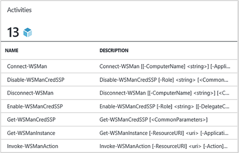
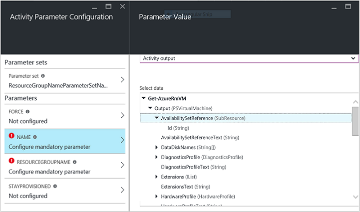
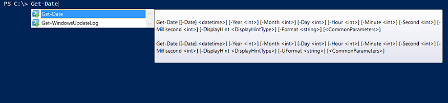

<properties
   pageTitle="Erstellen einer Azure Automatisierung Integration Module | Microsoft Azure"
   description="Lernprogramm führt, die Sie durch die Erstellung, testen und Beispiel Verwendung von Integrationsmodule in Azure Automatisierung."
   services="automation"
   documentationCenter=""
   authors="mgoedtel"
   manager="jwhit"
   editor="" />

<tags
   ms.service="automation"
   ms.workload="tbd"
   ms.tgt_pltfrm="na"
   ms.devlang="na"
   ms.topic="get-started-article"
   ms.date="09/12/2016"
   ms.author="magoedte" />

# <a name="azure-automation-integration-modules"></a>Azure Automatisierung Integrationsmodule

PowerShell ist die grundlegende Technologie hinter Azure Automatisierung. Da Azure Automatisierung PowerShell erstellt wird, sind PowerShell-Module-Taste, um die Erweiterbarkeit Azure-Automatisierung aus. In diesem Artikel leitet wir Sie durch die Einzelheiten Azure-Automatisierung Verwendung der PowerShell-Module, die so genannte "Integrationsmodule" und bewährte Methoden zum Erstellen Ihrer eigenen PowerShell-Module, um sicherzustellen, dass sie als Integrationsmodule in Azure Automatisierung funktionieren. 

## <a name="what-is-a-powershell-module"></a>Was ist ein PowerShell-Modul?

Ein PowerShell-Modul ist eine Gruppe von PowerShell-Cmdlets, wie **Get-Datum** oder **Element kopieren**, die verwendet werden können, aus der PowerShell-Konsole, Skripts, Workflows, Runbooks und PowerShell DSC Ressourcen wie WindowsFeature oder Datei, die von der Konfiguration der PowerShell DSC verwendet werden kann. Alle Funktionen der PowerShell wird über die Cmdlets und DSC Ressourcen verfügbar gemacht, und jeder Ressource Cmdlet/DSC Sicherung durch den PowerShell-Modul, die im Lieferumfang von PowerShell selbst viele. Angenommen, die Cmdlet " **Get-Date** " ist Teil der Microsoft.PowerShell.Utility PowerShell-Modul, und **Element kopieren** Cmdlet ist Bestandteil des Moduls Microsoft.PowerShell.Management PowerShell und Paket DSC Ressource ist Teil der PSDesiredStateConfiguration PowerShell-Modul. Beide Module im Lieferumfang der PowerShell. Aber viele PowerShell-Module werden nicht als Teil der PowerShell geliefert und stattdessen mit dem ersten oder Drittanbieter-Produkte wie System Center 2012-Konfigurations-Manager, oder indem Sie die große PowerShell-Community Orte wie PowerShell-Katalog verteilt werden.  Die Module sind nützlich, da sie komplexe Vorgänge ganz einfach über gekapselte Funktionalität vornehmen.  Sie erhalten weitere Informationen zu [PowerShell-Module auf MSDN](https://msdn.microsoft.com/library/dd878324%28v=vs.85%29.aspx). 

## <a name="what-is-an-azure-automation-integration-module"></a>Was ist eine Azure Automatisierung Integration Module?

Integration-Modul ist nicht sehr PowerShell-Modul abweicht. Seine einfach ein PowerShell-Modul, optional eine zusätzliche Datei - eine Datei mit Metadaten angeben einen Azure Automatisierung Verbindungstyp mit des Moduls Cmdlets in Runbooks verwendet werden enthält. Optional Dateien oder nicht, diese PowerShell Module in Azure-Automatisierung, um deren Cmdlets für die Verwendung innerhalb Runbooks und deren DSC Ressourcen verfügbar für die Verwendung innerhalb DSC Konfigurationen zur Verfügung stellen importiert werden können. Hintergrundinformationen Azure Automatisierung speichert diese Module und am Runbooks Position und DSC Compiliation Auftrag Ausführung dauert lädt sie in der Azure Automatisierung Sandboxen, wo Runbooks werden ausgeführt und DSC Konfigurationen werden kompiliert.  DSC Ressourcen in Module werden auch automatisch auf dem Server Automatisierung DSC Abruf platziert, sodass von Computern, die bei dem Versuch, DSC Konfigurationen anwenden per verschoben werden können.  Liefern wir eine Anzahl von Azure PowerShell-Module aus im Feld Azure Automatisierung für Ihre Verwendung, damit Sie können erste Schritte Azure Management sofort zu automatisieren, aber Sie können ganz einfach PowerShell-Module importieren, für jeden System, Dienst- oder Tool aus mit integriert werden soll. 

>[AZURE.NOTE] Bestimmte Module werden als "globalen Module" im Dienst Automatisierung geliefert. Im Paket, wenn Sie ein Konto Automatisierung erstellen, und wir kann manchmal aktualisieren die automatisch diese bei Ihrem Konto Automatisierung legt stehen Ihnen diese globalen Module zur Verfügung. Wenn Sie nicht, dass sie automatisch aktualisiert werden möchten, Sie können immer das gleiche Modul selbst importieren, und die hat Vorrang gegenüber der globalen Modul-Version von diesem Modul, das im Dienst wir liefern. 

Das Format, in dem Sie ein Paket Integration Module importieren, ist eine komprimierte Datei mit demselben Namen wie das Modul und eine ZIP-Erweiterung. Es enthält das Windows PowerShell-Modul und alle Hilfsdateien, einschließlich einer Manifestdatei (.psd1) aus, wenn das Modul eine hat.

Wenn das Modul einen Verbindungstyp Azure Automatisierung enthalten soll, müssen sie auch eine Datei mit dem Namen enthalten *<ModuleName>*-Automation.json, die die Typ Verbindungseigenschaften angibt. Dies ist eine Json-Datei in dem Ordner Module Ihrer komprimierten ZIP-Datei eingefügt und die Felder einer "Verbindung" enthält, die für die Verbindung zu den System oder den Dienst, der das Modul darstellt, erforderlich ist. Dies wird erstellen einen Verbindungstyp in Azure Automatisierung einhandeln. Mithilfe dieser Datei können Sie die Feldnamen festlegen eingibt, und gibt an, ob die Felder verschlüsselte und / oder optionale, für den Verbindungstyp des Moduls werden soll. Im folgenden finden eine Vorlage in das Json-Dateiformat:

```
{ 
   "ConnectionFields": [
   {
      "IsEncrypted":  false,
      "IsOptional":  false,
      "Name":  "ComputerName",
      "TypeName":  "System.String"
   },
   {
      "IsEncrypted":  false,
      "IsOptional":  true,
      "Name":  "Username",
      "TypeName":  "System.String"
   },
   {
      "IsEncrypted":  true,
      "IsOptional":  false,
      "Name":  "Password",
   "TypeName":  "System.String"
   }],
   "ConnectionTypeName":  "DataProtectionManager",
   "IntegrationModuleName":  "DataProtectionManager"
}
```

Wenn Sie haben Service Management Automatisierung bereitgestellt und Integrationsmodule-Paketen für Ihre Automatisierung Runbooks erstellt, sollte Ihnen sehr vertraut aussehen. 


## <a name="authoring-best-practices"></a>Bewährte Methoden für die Erstellung

Nur weil Integration-Module im Wesentlichen PowerShell-Module sind, bedeutet, die nicht, dass wir eine Reihe von Methoden, um diese authoring besitzen. Es gibt immer noch eine Reihe von Aktionen, die es empfiehlt sich, dass Sie während der Erstellung eines PowerShell-Modul berücksichtigen, damit es in Azure Automatisierung am häufigsten verwendet werden. Einige davon sind bestimmte Azure-Automatisierung, und einige davon eignen sich nur, damit Ihre Module funktionieren gut PowerShell-Workflow, unabhängig davon, ob Sie Automatisierung verwenden. 

1. Einschließen eine Zusammenfassung, Beschreibung und Hilfe URI für jedes Cmdlet im Modul. In PowerShell können Sie bestimmte Hilfeinformationen für Cmdlets für die Verwaltung der Benutzer erhalten Hilfe zur Verwendung von mit dem **Hilfe** Cmdlet kann definieren. Hier ist beispielsweise, wie Sie eine Zusammenfassung definieren und URI für ein in einer Datei .psm1 geschrieben PowerShell-Modul helfen können.<br>  

    ```
    <#
        .SYNOPSIS
         Gets all outgoing phone numbers for this Twilio account 
    #>
    function Get-TwilioPhoneNumbers {
    [CmdletBinding(DefaultParameterSetName='SpecifyConnectionFields', `
    HelpUri='http://www.twilio.com/docs/api/rest/outgoing-caller-ids')]
    param(
       [Parameter(ParameterSetName='SpecifyConnectionFields', Mandatory=$true)]
       [ValidateNotNullOrEmpty()]
       [string]
       $AccountSid,

       [Parameter(ParameterSetName='SpecifyConnectionFields', Mandatory=$true)]
       [ValidateNotNullOrEmpty()]
       [string]
       $AuthToken,

       [Parameter(ParameterSetName='UseConnectionObject', Mandatory=$true)]
       [ValidateNotNullOrEmpty()]
       [Hashtable]
       $Connection
    )

    $cred = CreateTwilioCredential -Connection $Connection -AccountSid $AccountSid -AuthToken $AuthToken

    $uri = "$TWILIO_BASE_URL/Accounts/" + $cred.UserName + "/IncomingPhoneNumbers"
    
    $response = Invoke-RestMethod -Method Get -Uri $uri -Credential $cred

    $response.TwilioResponse.IncomingPhoneNumbers.IncomingPhoneNumber
    }
    ```
<br> 
Bereitstellen dieser Informationen nicht nur diese Hilfe mithilfe des **Hilfe** Cmdlets in der PowerShell-Konsole angezeigt wird, wird auch diese Hilfefunktionalität in Azure Automatisierung, z. B. beim Einfügen von Aktivitäten Authoring Runbooks verfügbar machen. Klicken Sie auf "Ansicht ausführliche Hilfe" wird der URI-Hilfe in einer anderen Registerkarte des Webbrowsers geöffnet, die Sie verwenden, um Azure Automatisierung zugreifen zu können.<br>
2. Wenn das Modul für ein remote-System ausgeführt wird ein. Es sollte eine Integration Module-Metadaten-Datei enthalten, die Verbindung zu diesem remote-System, d. h., den Verbindungstyp erforderliche Informationen zu definiert. b. Jedes Cmdlet im Modul sollte eine Verbindungsobjekt (eine Instanz von diesem Verbindungstyp) als Parameter teilnehmen können.  
    Cmdlets im Modul machen einfacher in Azure Automatisierung verwendet werden soll, wenn Sie zulassen ein Objekts mit der Felder vom Verbindungstyp als Parameter an das Cmdlet übergeben. Diese Methode Benutzer keine Parameter der Anlage Verbindung des Cmdlets entsprechenden Parameter jedes Mal zuordnen er ein Cmdlet anrufen. Basierend auf der oben genannten Beispiel Runbooks verwendet es eine Twilio Verbindung Objekt namens CorpTwilio Twilio zugreifen und die Telefonnummern in das Konto zurückgegeben.  Beachten Sie, wie sie die Felder der Verbindung auf die Parameter des Cmdlets Zuordnung ist?<br>

    ```
    workflow Get-CorpTwilioPhones
    {
      $CorpTwilio = Get-AutomationConnection -Name 'CorpTwilio'
    
      Get-TwilioPhoneNumbers 
        -AccountSid $CorpTwilio.AccountSid  
        -AuthToken $CorptTwilio.AuthToken
    }
    ```
<br>
Eine Möglichkeit einfachere und bessere dies fast ist das Verbindungsobjekt direkt an das Cmdlet übergeben-

    ```
    workflow Get-CorpTwilioPhones
    {
      $CorpTwilio = Get-AutomationConnection -Name 'CorpTwilio'

      Get-TwilioPhoneNumbers -Connection $CorpTwilio
    }
    ```
<br>
Sie können Verhalten wie folgt für Ihre Cmdlets für die Verwaltung von Dokumenten, indem sie ein Verbindungsobjekt direkt als Parameter, statt nur Verbindung Felder für Parameter annehmen aktivieren. Normalerweise sollten Sie Parameter für jede, festlegen, damit ein Benutzer nicht mit Azure Automatisierung der Cmdlets aufrufen kann, ohne bauen Hashtable als das Verbindungsobjekt fungieren. Parameter festlegen, die unten **SpecifyConnectionFields** verwendet wird, um die Verbindung zu Feldeigenschaften nacheinander übergeben. **UseConnectionObject** können Sie die Verbindung durch geraden übergeben. Wie Sie sehen können, können Sie das Cmdlet senden-TwilioSMS im [Twilio PowerShell-Modul](https://gallery.technet.microsoft.com/scriptcenter/Twilio-PowerShell-Module-8a8bfef8) manuell übergeben: 

    ```
    function Send-TwilioSMS {
      [CmdletBinding(DefaultParameterSetName='SpecifyConnectionFields', `
      HelpUri='http://www.twilio.com/docs/api/rest/sending-sms')]
      param(
         [Parameter(ParameterSetName='SpecifyConnectionFields', Mandatory=$true)]
         [ValidateNotNullOrEmpty()]
         [string]
         $AccountSid,

         [Parameter(ParameterSetName='SpecifyConnectionFields', Mandatory=$true)]
         [ValidateNotNullOrEmpty()]
         [string]
         $AuthToken,

         [Parameter(ParameterSetName='UseConnectionObject', Mandatory=$true)]
         [ValidateNotNullOrEmpty()]
         [Hashtable]
         $Connection

       )
    }
    ```
<br>
3. Definieren Sie Ausgabe für alle Cmdlets im Modul. Definieren eines Ausgabetyps für ein Cmdlet ermöglicht es IntelliSense zur Entwurfszeit helfen festzustellen, des-Cmdlets für die Verwendung während der Erstellung die Ausgabeeigenschaften aus. Es ist besonders hilfreich beim Automatisierung Runbooks grafisch authoring, wo finde ich Entwurf Zeit Knowledge-Taste, um eine einfache Benutzerfunktionalität durch ein Modul.<br> <br> Dies ist ähnlich wie die Funktionalität "anstehen Geben Sie" der Ausgabe eines Cmdlet PowerShell ISE des ohne, um Sie auszuführen.<br> <br>
4. Cmdlets im Modul darf keine komplexe Objekttypen für Parameter übernehmen. PowerShell-Workflow unterscheidet sich von PowerShell darin, dass sie komplexe Typen deserialisierte Formular speichert. Grundtypen als Primitives verbleibt, aber komplexe Datentypen in ihren deserialisierten Versionen im Wesentlichen Eigenschaftensammlungen sind konvertiert. Wenn Sie das Cmdlet " **Get-Process** " in einer Runbooks (oder einen PowerShell Workflow für diese Angelegenheit) verwendet haben, möchten sie ein Objekt vom Typ [Deserialized.System.Diagnostic.Process], nicht die erwarteten Typ [System.Diagnostic.Process] zurück. Dieses Typs weist dieselben Eigenschaften wie den Typ nicht deserialisiert, jedoch keine der Methoden. Und wenn Sie versuchen, übergeben dieser Wert als Parameter an ein Cmdlet, wo das Cmdlet für diesen Parameter einen Wert [System.Diagnostic.Process] erwartet, wird die folgende Fehlermeldung: *Argument Transformation auf Parameter "Prozess" können nicht verarbeitet werden. Fehler: "nicht den Wert"System.Diagnostics.Process (CcmExec)"vom Typ"Deserialized.System.Diagnostics.Process"Eingabe"System.Diagnostics.Process"konvertieren.*   Dies ist, da es ein Typenkonflikt zwischen der erwarteten [System.Diagnostic.Process] und [Deserialized.System.Diagnostic.Process] angegebenen Typ ist. Die Möglichkeit, um dieses Problem ist Stellen Sie sicher, dass die Cmdlets des Moduls nicht komplexe Datentypen für Parameter akzeptieren. Hier ist die falsche Methode zum erledigen.

    ```
    function Get-ProcessDescription {
      param (
            [System.Diagnostic.Process] $process
      )
      $process.Description
    }
    ``` 
<br>
Und so sieht vom richtigen Umgang, aufzeichnen in ein Basiselement, die intern kann durch das Cmdlet verwendet werden umgibt das komplexe Objekt, und verwenden möchten. Da Cmdlets im Zusammenhang mit PowerShell ausgeführt werden, wird nicht PowerShell Workflow innerhalb des Cmdlets $process die richtige Art von [System.Diagnostic.Process].  

    ```
    function Get-ProcessDescription {
      param (
            [String] $processName
      )
      $process = Get-Process -Name $processName

      $process.Description
    }
    ```
<br>
Verbindung Anlagen in Runbooks sind Hashtables, die eine komplexe Art sind, und diese Hashtables noch scheint, kann in-Cmdlets für die zu übergebenden deren – Datenverbindungsparameter völlig, mit Ausnahme für keine Umwandlung. Technisch, einige PowerShell-Typen sind in der Lage, deren deserialisierte Formular ordnungsgemäß aus ihrer serialisierten Form umgewandelt, und können daher für Parameter akzeptiert nicht deserialisierten Typ in Cmdlets übergeben werden. Hashtable ist ein solcher. Es ist möglich, dass ein Modul des Autors definierte Typen so implementiert werden, die ordnungsgemäß ebenfalls deserialisieren kann, aber es gibt einige Nachteile. Der Typ muss über einen Standardkonstruktor verfügen, haben alle ihre öffentlichen Eigenschaften und eine PSTypeConverter haben. Jedoch für bereits definiert Typen, die der Autor des Moduls nicht besitzt, gibt es keine Möglichkeit, "diese daher zu beheben" empfohlen komplexe Datentypen für Parameter aller zusammen zu vermeiden. Tipp Runbooks Authoring: ist für einige Gründe der Cmdlets müssen einen komplexen Typparameter akzeptieren, oder Sie verwenden die Person-Modul, das einen komplexen Typparameter benötigt, können in PowerShell Workflow Runbooks und PowerShel Workflows in lokalen PowerShell umgehen, indem das Cmdlet umbrochen, der den komplexen Typ und das Cmdlet, der den komplexen Typ in der gleichen InlineScript auf Aktivität generiert. Da InlineScript auf deren Inhalt PowerShell, sondern als PowerShell Workflow ausgeführt wird, wird das Cmdlet Generieren von komplexen Typs mit die richtige Art, nicht deserialisierten komplexen Typs erstellt.
5. Nehmen Sie alle Cmdlets im Modul statusfreie. PowerShell-Workflow wird jedes Namens im Workflow in einer anderen Sitzung Cmdlet ausgeführt. Dies bedeutet, dass alle Cmdlets, die Sitzungszustand erstellt / geändert von anderen Cmdlets im selben Modul abhängig sind nicht in der PowerShell-Workflow Runbooks funktionieren.  Hier ist ein Beispiel für was nicht zu tun ist.

    ```
    $globalNum = 0
    function Set-GlobalNum {
       param(
           [int] $num
       )
      
       $globalNum = $num
    }
    function Get-GlobalNumTimesTwo {
       $output = $globalNum * 2
     
       $output
    }
    ```
<br>
6. Das Modul sollten vollständig in einem Xcopy können-Paket enthalten sein. Da Runbooks ausführen müssen Azure Automatisierung Module in die Automatisierung Sandboxen verteilt werden, müssen sie unabhängig von den Host arbeiten, die sie ausgeführt werden. Was dies bedeutet besteht darin, dass Sie Zip können soll das Paket Modul, ziehen Sie es an einem beliebigen anderen Host mit PowerShell dieselbe oder eine neuere Version, und sie die Funktion wie gewohnt, wenn des Hosts PowerShell-Umgebung importiert haben. Das Modul sollten nacheinander zu diesem Zweck nicht abhängen, auf Dateien außerhalb der Modul Ordner (der Ordner, die beim Importieren von in Azure Automatisierung von ZIP ruft) oder auf alle eindeutigen registrierungseinstellungen auf einem Host, z. B. festlegen, indem Sie die Installation eines Produkts. Bewährte Methode nicht folgen, wird das Modul nicht in Azure Automatisierung verwendbar sein.  

## <a name="next-steps"></a>Nächste Schritte

- Um mit PowerShell Workflow Runbooks anzufangen, finden Sie unter [Meine erste PowerShell Workflow Runbooks](automation-first-runbook-textual.md)
- Weitere Informationen zum Erstellen von PowerShell-Module finden Sie unter [einem Windows PowerShell-Modul schreiben](https://msdn.microsoft.com/library/dd878310%28v=vs.85%29.aspx)