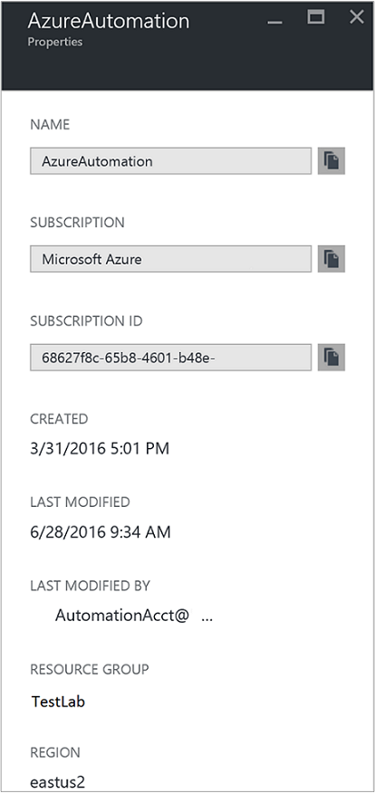
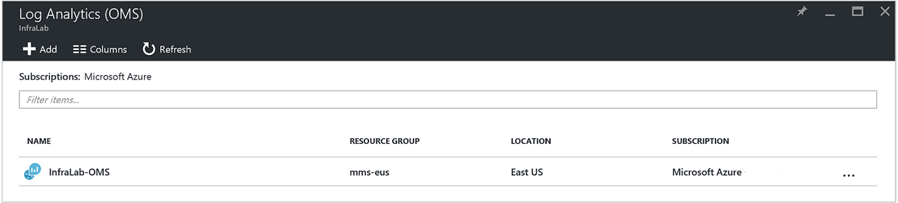
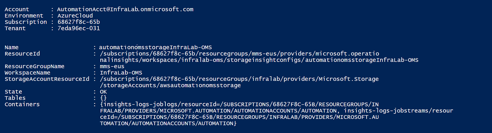
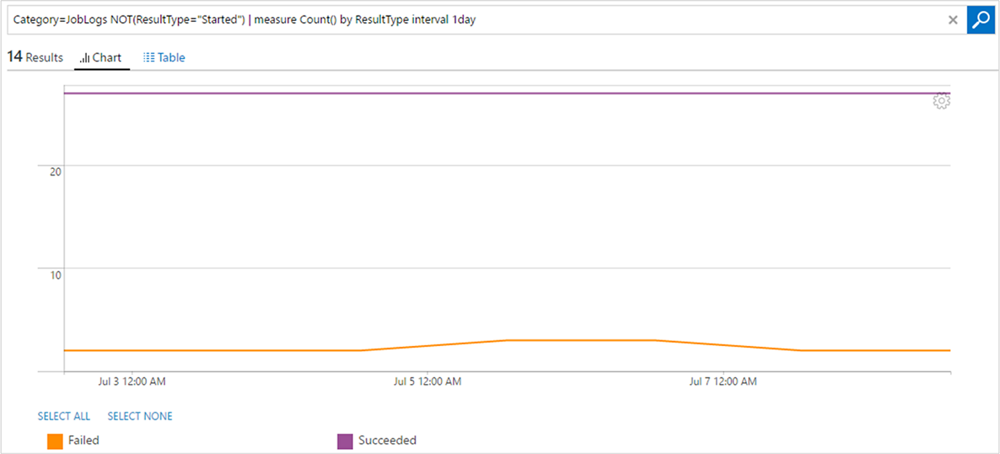

<properties
    pageTitle="Weiterleiten von Projektstatus und Position Streams von Automatisierung zu Log Analytics (OMS) | Microsoft Azure"
    description="Dieser Artikel beschreibt, wie Projektstatus und Runbooks Auftrag Streams an Microsoft Operations Management Suite Log Analytics zusätzlichen Einblick vorführen und Verwaltung gesendet."
    services="automation"
    documentationCenter=""
    authors="MGoedtel"
    manager="jwhit"
    editor="tysonn" />
<tags
    ms.service="automation"
    ms.devlang="na"
    ms.topic="article"
    ms.tgt_pltfrm="na"
    ms.workload="infrastructure-services"
    ms.date="09/22/2016"
    ms.author="magoedte" />

# Weiterleiten von Projektstatus und Position Streams von Automatisierung zu Log Analytics (OMS)

Automatisierung senden Runbooks zu dem Arbeitsbereich Microsoft Operations Management Suite (OMS) Log Analytics Job Status und Position Streams.  Während Sie diese Informationen im Azure-Portal oder mit PowerShell durch einzelne Projektstatus oder alle Aufträge nach einem bestimmten Automatisierung Konto anzeigen können, erfordert nichts erweiterte Ihren Anforderungen Betrieb unterstützt Sie zum Erstellen von benutzerdefinierten PowerShell Skripts.  Mit Log Anaytics können Sie jetzt:

- Einsichten Sie für Ihre Projekte Automatisierung 
- Auslösen basieren, eine e-Mail- oder Benachrichtigung über den Status Ihrer Runbooks-Position (z. B. Fehler oder angehalten) 
- Erweiterte Abfragen über Ihre Position Streams schreiben 
- Zu koordinieren Aufträge über Automatisierung Konten hinweg 
- Visualisieren der Historie über einen Zeitraum     

## Erforderliche Komponenten und -Bereitstellung

Zum Senden Ihrer Automatisierung Protokolle zu Log Analytics beginnen möchten, benötigen Sie Folgendes:

1. Ein OMS-Abonnement. Weitere Informationen finden Sie unter [Erste Schritte mit Log Analytics](../log-analytics/log-analytics-get-started.md).  

    >[AZURE.NOTE]Der Arbeitsbereich OMS und Automatisierung Konto müssen werden im selben Azure-Abonnement in Reihenfolge für diese Konfiguration, damit Sie ordnungsgemäß funktioniert. 
  
2. Ein [Azure-Speicher-Konto](../storage/storage-create-storage-account.md).  
   
    >[AZURE.NOTE]Im Speicher Konto *muss* werden in derselben Region als das Konto Automatisierung. 
 
3. Azure PowerShell mit Version 1.0.8 oder höher Betrieb Einsichten Cmdlets. Informationen zu dieser Version und wie Sie diese installieren finden Sie unter [Informationen zum Installieren und konfigurieren Azure PowerShell](../powershell-install-configure.md).
4. Azure Diagnostic and Log Analytics PowerShell.  Weitere Informationen zu dieser Version und zur Installation finden Sie unter [Azure Diagnostic and Log Analytics](https://www.powershellgallery.com/packages/AzureDiagnosticsAndLogAnalytics/0.1).  
5. Herunterladen des PowerShell-Skripts **Aktivieren-AzureDiagnostics.ps1** aus der [PowerShell-Katalog](https://www.powershellgallery.com/packages/Enable-AzureDiagnostics/1.0/DisplayScript). Dieses Skript wird Folgendes konfigurieren:
 - Ein Speicherkonto für die Runbooks Job Status und Stream Daten für ein Konto Automatisierung, den Sie angeben.
 - Aktivieren der Sammlung von Daten aus Ihrem Konto Automatisierung in ein Azure Blob-Speicher-Konto im JSON-Format speichern.
 - Sammeln von Daten aus Ihrem Blob-Speicher-Konto zu OMS Log Analytics zu konfigurieren.
 - Aktivieren Sie der Lösung Automatisierung Log Analytics OMS Arbeitsbereich.   

Das Skript **Aktivieren-AzureDiagnostics.ps1** erfordert die folgenden Parameter während der Ausführung an:

- *AutomationAccountName* – den Namen Ihres Kontos Automatisierung
- *LogAnalyticsWorkspaceName* – den Namen Ihres OMS-Arbeitsbereichs

Um die Werte für *AutomationAccountName*finden Sie im Portal Azure wählen Sie Ihr Konto Automatisierung aus dem Blade **Automatisierung Konto** aus, und wählen Sie **Alle Einstellungen**.  Wählen Sie **Eigenschaften**aus dem Blade **Alle Einstellungen** unter **Konten-Einstellungen** aus.  In das Blade **Eigenschaften** Beachten Sie die folgenden Werte.  .

## Integration in Log Analytics Einrichtung

1. Starten Sie **Windows PowerShell** auf Ihrem Computer aus **den Startbildschirm** .  
2. Navigieren Sie über die Befehlszeile PowerShell-Shell zu dem Ordner, der das Skript enthält, das Sie heruntergeladen haben, und führen sie die Werte für Parameter ändern, *AutomationAccountName -* und *- LogAnalyticsWorkspaceName*.

    >[AZURE.NOTE] Sie werden aufgefordert, mit Azure authentifizieren, nachdem Sie das Skript ausführen.  Melden Sie sich, **müssen** Sie sich mit einem Konto, das Mitglied der Rolle des Abonnements Administratoren und gemeinsame Administrator des Abonnements ist.   
    
        .\Enable-AzureDiagnostics -AutomationAccountName <NameofAutomationAccount> `
        -LogAnalyticsWorkspaceName <NameofOMSWorkspace> `

3. Nach dem Ausführen dieses Skripts sollten Sie Datensätze in Log Analytics sehen etwa 30 Minuten nach neue diagnostische Daten in Speicher geschrieben werden.  Wenn keine Datensätze verfügbar sind, nachdem Sie diesmal finden Sie im Abschnitt zur Problembehandlung in [JSON-Dateien in Blob-Speicher](../log-analytics/log-analytics-azure-storage-json.md#troubleshooting-configuration-for-azure-diagnostics-written-to-blob-in-json).

### Überprüfen Sie die Konfiguration

Um zu bestätigen, dass das Skript erfolgreich Ihr Automatisierung-Konto und OMS Wokspace konfiguriert, können Sie die folgenden Schritte in der PowerShell ausführen.  Notieren Sie den Wert für **Name** und **Ressourcengruppe**, bevor Sie tun, wenn Sie feststellen, dass die Werte für Ihre OMS Arbeitsbereich und Ressourcengruppennamen, vom Azure-Portal, navigieren Sie zu Log Analytics (OMS) und in das Blade Log Analytics (OMS).   wir verwenden diese beiden Werte Wenn wir überprüfen Sie die Konfiguration im Arbeitsbereich OMS mithilfe des PowerShell-Cmdlets [Get-AzureRmOperationalInsightsStorageInsight](https://msdn.microsoft.com/library/mt603567.aspx).

1.  Navigieren Sie aus dem Azure-Portal zu Speicher-Konten und suchen Sie nach den folgenden Speicher-Konto, das Benennungskonvention - *AutomationAccountNameomsstorage*verwendet.  Nach einer Runbooks Auftragsabschluss, kurz danach auftreten zwei Blob erstellte Container - **Einsichten-Protokolle-Joblogs** und **Einblicken-Protokolle-Jobstreams**.  

2.  Führen Sie den folgenden PowerShell-Code, ändern die Werte für die Parameter **ResourceGroupName** und **ein** , die Sie kopiert oder zuvor erwähnt von PowerShell.  

    Login-AzureRmAccount Get-AzureRmSubscription - SubscriptionName 'SubscriptionName' | Set-AzureRmContext Get-AzureRmOperationalInsightsStorageInsight - ResourceGroupName "OMSResourceGroupName" '-Arbeitsbereich "OMSWorkspaceName" 

    Dadurch wird die Einblicke Speicherplatz für den angegebenen OMS Arbeitsbereich zurückgegeben.  Wir möchten die Einblicke Speicher für das wir zuvor angegebene Automatisierung Konto vorhanden ist, und das Objekt **Zustand** weist einen Wert von **OK**bestätigen.  .

## Analytics Protokolldatensätze

Automatisierung erstellt zwei Arten von Datensätzen in der OMS Repository an.

### Position von Protokollen

Eigenschaft | Beschreibung|
----------|----------|
Zeit | Datum und Uhrzeit, wann die Position des Runbooks ausgeführt.|
resourceId | Gibt an, welche Ressource in Azure.  Für die Automatisierung ist der Wert des Runbooks zugeordnete Automatisierung Konto an.|
operationName | Gibt den Typ des Vorgangs in Azure ausgeführt.  Für die Automatisierung wird der Wert Auftrag sein.|
ResultType-Wert | Der Status des Runbooks Auftrags.  Mögliche Werte sind: -Schritte -Beendet -Unterbrochen -Fehler -Wurde erfolgreich abgeschlossen|
resultDescription | Beschreibt den Runbooks Auftrag Ergebniszustand.  Mögliche Werte sind: -Auftrag wird gestartet. -Auftrag fehlgeschlagen ist -Projekt abgeschlossen|
CorrelationId | GUID, die die Korrelations-Id des Runbooks Auftrags ist.|
Kategorie | Klassifizierung von den Typ der Daten.  Für die Automatisierung ist der Wert JobLogs.|
RunbookName | Der Name des Runbooks.|
Auftrags-IDs | GUID, die die Id des Projekts Runbooks ist.|
Anrufer |  Wer initiiert den Vorgang.  Mögliche Werte sind entweder eine e-Mail-Adresse oder System für geplante Aufgaben.|

### Position Streams
Eigenschaft | Beschreibung|
----------|----------|
Zeit | Datum und Uhrzeit, wann die Position des Runbooks ausgeführt.|
resourceId | Gibt an, welche Ressource in Azure.  Für die Automatisierung ist der Wert des Runbooks zugeordnete Automatisierung Konto an.|
operationName | Gibt den Typ des Vorgangs in Azure ausgeführt.  Für die Automatisierung wird der Wert Auftrag sein.|
ResultType-Wert | Der Status des Runbooks Auftrags.  Mögliche Werte sind: -In Bearbeitung|
resultDescription | Enthält den Ausgabestream aus des Runbooks an.|
CorrelationId | GUID, die die Korrelations-Id des Runbooks Auftrags ist.|
Kategorie | Klassifizierung von den Typ der Daten.  Für die Automatisierung ist der Wert JobStreams.|
RunbookName | Der Name des Runbooks.|
Auftrags-IDs | GUID, die die Id des Projekts Runbooks ist.|
Anrufer | Wer initiiert den Vorgang.  Mögliche Werte sind entweder eine e-Mail-Adresse oder System für geplante Aufgaben.| 
StreamType | Die Art des Streams Position. Mögliche Werte sind: -Status -Ausgabe -Warnung -Fehler -Debuggen -Ausführliche|

## Log Analytics anmeldet Automatisierung anzeigen 

Jetzt, da Sie begonnen haben, senden Ihre Automatisierung Auftrag Protokolle an Log Analytics, lassen Sie uns finden Sie unter Mögliche Aktionen mit diesen Protokollen innerhalb OMS.   

### Senden einer e-Mail, wenn ein Runbooks-Auftrag fehlschlägt oder ausgesetzt 

Eine der obersten Kunde gefragt werden, wird für den Zugriff auf eine e-Mail-Nachricht oder einen Textplatzhalter senden, wenn ein Problem mit einem Auftrag Runbooks auftritt.   

Um eine Regel zu erstellen, zunächst erstellen Sie eine Log-Suche für die Runbooks Auftrag Datensätze, die die Benachrichtigung aufrufen soll.  Die Schaltfläche " **Benachrichtigung** " wird dann verfügbar sein, damit Sie können erstellen und konfigurieren die Regel.

1.  Klicken Sie auf **Log suchen**, von der Seite Übersicht OMS.
2.  Eine Suchabfrage Log für eine Warnung erstellen, indem Sie mit der Eingabe in die folgenden im Abfragefeld: `Category=JobLogs (ResultType=Failed || ResultType=Suspended)`.  Sie können auch nach dem RunbookName gruppieren, mithilfe von: `Category=JobLogs (ResultType=Failed || ResultType=Suspended) | measure Count() by RunbookName_s`.   
  
    Wenn Sie Protokolle aus mehreren Automatisierung Firmen- oder Abonnement zu dem Arbeitsbereich eingerichtet haben, können Sie auch interessiert gruppieren die Benachrichtigungen von dem Abonnement oder Automatisierung Konto wenden.  Automatisierung Kontonamen kann aus dem Feld Ressource in das Feld Suchen von JobLogs abgeleitet werden.  

3.  Klicken Sie auf **Benachrichtigen** am oberen Rand der Seite um den Bildschirm **Benachrichtigen Regel hinzufügen** zu öffnen.  Weitere Informationen zu den Installationsoptionen so konfigurieren Sie die Benachrichtigung finden Sie unter [Warnungen im Log Analytics](../log-analytics/log-analytics-alerts.md#creating-an-alert-rule).

### Suchen Sie aller Projekte, die mit Fehlern abgeschlossen haben 

Zusätzlich zu warnen, wobei ein Fehler, Sie wahrscheinlich möchte wissen, wann ein Auftrags Runbooks einen Fehler nicht beendet hatte (PowerShell erzeugt einen Stream zurück, aber nicht beenden Fehler führen Ihre Arbeit unterbrechen oder ein Fehler auftreten, nicht).    

1. Klicken Sie im Portal OMS auf **Log suchen**.
2. Geben Sie im Feld Abfrage `Category=JobStreams StreamType_s=Error | measure count() by JobId_g` , und klicken Sie dann auf **Suchen**.

### Ansicht Auftrag Streams für ein Projekt  

Wenn Sie ein Projekt debuggen, sollten Sie auch in den Auftrag Streams suchen.  Die folgende Abfrage zeigt alle Streams für ein einzelnes Projekt mit GUID 2ebd22ea-e05e-4eb9 - 9d 76-d73cbd4356e0:   

`Category=JobStreams JobId_g="2ebd22ea-e05e-4eb9-9d76-d73cbd4356e0" | sort TimeGenerated | select ResultDescription` 

### Anzeigen des Status zurückliegenden Position 

Schließlich sollten Sie Ihre Historie über einen Zeitraum darstellen.  Sie können diese Abfrage verwenden, um den Status Ihrer Aufträge über einen Zeitraum suchen. 

`Category=JobLogs NOT(ResultType="started") | measure Count() by ResultType interval 1day`  
   

## Zusammenfassung

Per die Automatisierung Job Status und Stream-Daten zu Log Analytics können Sie besseren Einblick in den Status Ihrer Aufträge Automatisierung, indem Sie Benachrichtigungen einrichten, damit Sie benachrichtigt werden, wenn es ist ein Problem und benutzerdefinierte Dashboards mithilfe von Erweiterte Abfragen Ihrer Runbooks Ergebnisse visualisiert werden sollen, Runbooks des Projektstatus, und andere verwandte Key Indikatoren oder Kennzahlen erhalten.  Dadurch wird größer Betrieb Sichtbarkeit und Adresse Fälle schneller bereitstellen.  

## Nächste Schritte

- Weitere Informationen zu anderen Suchabfragen erstellen, und überprüfen die Protokolle der Automatisierung Auftrag mit Log Analytics finden Sie unter [Log durchsucht Log Analytics](../log-analytics/log-analytics-log-searches.md)
- So erstellen und Ausgabe und Fehlermeldungen aus Runbooks finden Sie unter [Runbooks Ausgabe und Nachrichten](automation-runbook-output-and-messages.md) 
- Erfahren Sie mehr über Runbooks Ausführung, wie Aufträge Runbooks überwachen und andere technische Details finden Sie unter [Nachverfolgen eines Auftrags Runbooks](automation-runbook-execution.md)
- Weitere Informationen zum OMS Log Analytics und Datenquellen für die Websitesammlung finden Sie unter [Sammeln Azure-Speicherdaten in Log Analytics (Übersicht)](../log-analytics/log-analytics-azure-storage.md)