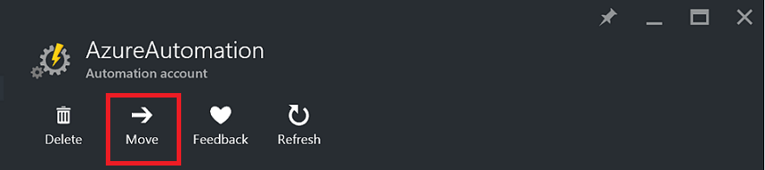
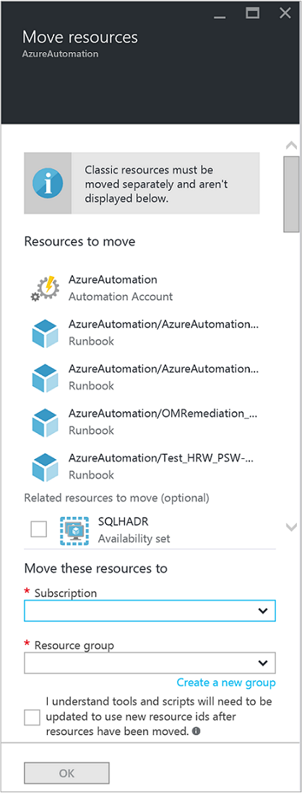

<properties
   pageTitle="Migrieren von Automatisierung Konto und Ressourcen | Microsoft Azure"
   description="Dieser Artikel beschreibt, wie Sie ein Konto Automatisierung in Azure Automatisierung und die zugeordneten Ressourcen aus einem Abonnement zu einem anderen zu verschieben."
   services="automation"
   documentationCenter=""
   authors="MGoedtel"
   manager="jwhit"
   editor="tysonn" />
<tags
   ms.service="automation"
   ms.devlang="na"
   ms.topic="article"
   ms.tgt_pltfrm="na"
   ms.workload="infrastructure-services"
   ms.date="07/07/2016"
   ms.author="magoedte" />

# <a name="migrate-automation-account-and-resources"></a>Migrieren von Automatisierung Konto und Ressourcen

Automatisierung Konten und die zugehörigen Ressourcen (d. h. Posten, Runbooks, Module usw.), die Sie in der Azure-Portal erstellt haben und aus einer Ressourcengruppe zu einem anderen oder von einem Abonnement zu einem anderen migriert werden soll, lässt sich dies leicht mit dem Feature [Verschieben von Ressourcen](../resource-group-move-resources.md) zur Verfügung, in dem Azure-Portal realisieren. Bevor Sie mit dieser Aktion fortfahren, sollten jedoch zuerst die folgende [Checkliste vor dem Verschieben von Ressourcen](../resource-group-move-resources.md#Checklist-before-moving-resources) und darüber hinaus in der Liste unter speziell für Automatisierung überprüfen werden.   

1.  Die Ziel-Abonnement/Ressourcengruppe muss sich in derselben Region als Quelle.  D. h., können nicht Automatisierung Konten über die Regionen verschoben werden.
2.  Beim Verschieben von Ressourcen (z. B. Runbooks, Aufträge usw.), sind die Quellgruppe und die Zielgruppe für die Dauer des Vorgangs gesperrt. Schreiben und Löschvorgängen werden auf der Gruppen blockiert, bis das Verschieben abgeschlossen ist.  
3.  Alle Runbooks oder Variablen, die eine Ressource oder das Abonnement-ID aus dem vorhandenen Abonnement verwiesen werden nach Abschluss der Migration aktualisiert werden müssen.   


>[AZURE.NOTE] Dieses Feature unterstützt keine verschieben klassischen Automatisierung Ressourcen.

## <a name="to-move-the-automation-account-using-the-portal"></a>Automatisierung Konto mithilfe des Portals verschieben

1. Klicken Sie auf am oberen Rand der Blade **Verschieben** , über Ihr Konto Automatisierung.<br> <br> 
2. Beachten Sie in der Blade **Ressourcen verschieben** , dass es sich bei Ressourcen, die im Zusammenhang mit Ihr Konto Automatisierung und der Ressource nach Gruppen Sicherheitsstandards.  Wählen Sie aus dem **Abonnement** und **Ressourcengruppe** aus den Dropdown-Listen, oder wählen Sie die Option **Erstellen einer neuen Ressourcengruppe** , und geben Sie einen neuen Gruppe Ressourcennamen in das bereitgestellte Feld ein.  
3. Überprüfen Sie, und wählen Sie das Kontrollkästchen, damit Sie erkennen an *verstehen Tools und Skripts müssen aktualisiert werden, um die neue Ressourcen-IDs verwenden, nachdem Ressourcen verschoben wurden* , und klicken Sie dann auf **OK**.<br> <br>   

Diese Aktion werden mehrere Minuten dauern.  In **Benachrichtigungen**, werden Sie mit dem Status jede Aktion, die - Überprüfung, Migration stattfindet präsentiert werden und schließlich Wenn es abgeschlossen ist.     

## <a name="to-move-the-automation-account-using-powershell"></a>So verschieben Sie die Automatisierung Konto mithilfe der PowerShell

Um die vorhandene Automatisierung Ressourcen zu einem anderen Ressourcengruppe oder-Abonnement zu verschieben, führen Sie das Cmdlet " **Get-AzureRmResource** ", die bestimmte Automatisierung-Konto und dann auf **Verschieben-AzureRmResource** -Cmdlet für den Umzug gelangen.

Das erste Beispiel zeigt, wie Sie ein Konto Automatisierung auf einer neuen Ressourcengruppe verschieben.

   ```
    $resource = Get-AzureRmResource -ResourceName "TestAutomationAccount" -ResourceGroupName "ResourceGroup01"
    Move-AzureRmResource -ResourceId $resource.ResourceId -DestinationResourceGroupName "NewResourceGroup"
   ``` 

Nachdem Sie das oben genannten Codebeispiel ausführen, werden Sie aufgefordert, stellen Sie sicher, dass Sie diese Aktion ausführen möchten.  Sobald Sie klicken Sie auf **Ja** , und das Skript ermöglichen, um den Vorgang fortzusetzen, erhalten Sie während die Migration Leistung keine Benachrichtigungen.  

Wenn Sie ein neues Abonnement verschieben möchten, einbeziehen Sie einen Wert für den Parameter *DestinationSubscriptionId*

   ```
    $resource = Get-AzureRmResource -ResourceName "TestAutomationAccount" -ResourceGroupName "ResourceGroup01"
    Move-AzureRmResource -ResourceId $resource.ResourceId -DestinationResourceGroupName "NewResourceGroup" -DestinationSubscriptionId "SubscriptionId"
   ``` 

Wie beim vorherigen Beispiel, werden Sie aufgefordert, das Verschieben zu bestätigen.  

## <a name="next-steps"></a>Nächste Schritte

- Weitere Informationen zum Verschieben von Ressourcen zu neuen Ressourcengruppe oder-Abonnement finden Sie unter [Verschieben von Ressourcen zu neuen Ressourcengruppe oder-Abonnement](../resource-group-move-resources.md)
- Weitere Informationen zu rollenbasierte Access Control in Azure Automatisierung finden Sie in [Access rollenbasierte Steuerelement in Azure Automatisierung](../automation/automation-role-based-access-control.md).
- Informationen zu PowerShell-Cmdlets für die Verwaltung Ihres Abonnements finden Sie unter [Verwenden von Azure PowerShell mit Ressourcenmanager](../powershell-azure-resource-manager.md)
- Weitere Informationen zu Portal Features für die Verwaltung Ihres Abonnements finden Sie unter [Using the Azure-Portal zum Verwalten von Ressourcen](../azure-portal/resource-group-portal.md). 
