<properties 
   pageTitle="Rollenbasierte Access Steuerelement in Azure Automatisierung | Microsoft Azure"
   description="Rollenbasierte Access-Steuerelements (RBAC) ermöglicht die Verwaltung von Access für Azure Ressourcen. Dieser Artikel beschreibt, wie RBAC in Azure Automatisierung einrichten."
   services="automation"
   documentationCenter=""
   authors="mgoedtel"
   manager="jwhit"
   editor="tysonn"
   keywords="Automatisierung Rbac, Zugriffssteuerung Rolle, Azure rbac" />
<tags 
   ms.service="automation"
   ms.devlang="na"
   ms.topic="get-started-article"
   ms.tgt_pltfrm="na"
   ms.workload="infrastructure-services"
   ms.date="09/12/2016"
   ms.author="magoedte;sngun"/>

# Rollenbasierte Access Steuerelement in Azure Automatisierung

## Rollenbasierte Access-Steuerelement

Rollenbasierte Access-Steuerelements (RBAC) ermöglicht die Verwaltung von Access für Azure Ressourcen. [RBAC](../active-directory/role-based-access-control-configure.md)können Sie Aufgaben innerhalb Ihres Teams aufteilen und gewähren nur das Ausmaß des Zugriffs für Benutzer, Gruppen und Anwendungen, die sie zum Erfüllen ihrer Aufgaben benötigen. Für Benutzer von der Azure-Portal, Azure Befehlszeile Tools oder Azure Management-APIs kann rollenbasierte Zugriff erteilt werden.

## RBAC in Automatisierung Konten

In Azure Automatisierung wird der Zugriff gewährt, indem Sie die entsprechende RBAC-Rolle zuweisen Benutzer, Gruppen und Applikationen am Umfang Automatisierung-Konto. Im folgenden sind die integrierten Rollen von einem Konto Automatisierung unterstützt:  

|**Rolle** | **Beschreibung** |
|:--- |:---|
| Besitzer | Die Besitzerrolle ermöglicht Zugriff auf alle Ressourcen und Aktionen in einem einschließlich gewähren des Zugriffs auf andere Benutzer, Gruppen und zum Verwalten des Kontos Automatisierung Applications Automatisierung-Konto an. |
| Mitwirkenden | Die Rolle "Mitwirkender" können Sie alles außer Ändern der Zugriffsberechtigungen für ein Konto Automatisierung eines anderen Benutzers zu verwalten. |
| Reader | Die Rolle Leser können Sie alle Ressourcen, die in einem Konto Automatisierung anzeigen, aber keine Änderungen vornehmen.|
| Automatisierung Operator | Die Rolle des Automatisierung Operator können Sie ausführen Betriebsaufgaben z. B. starten, beenden, anzuhalten, fortzusetzen und Planen von Aufträgen. Diese Funktion ist hilfreich, wenn Sie schützen Konto Automatisierung Ressourcen wie Anmeldeinformationen Bestand und Runbooks zurzeit angezeigt oder bearbeitet, aber weiterhin zulassen, dass Mitglieder Ihrer Organisation diese Runbooks ausführen möchten. |
| Access-Administrator für Benutzer | Die Benutzer Access-Administratorrolle können Sie zur Verwaltung des Benutzerzugriffs auf Automatisierung Azure-Konten. |

>[AZURE.NOTE] Sie können keine Zugriffsrechte zu einer bestimmten Runbooks oder Runbooks, nur für die Ressourcen und Aktionen innerhalb der Automatisierung Konto gewähren.  

In diesem Artikel werden wir Sie zum Einrichten von RBAC in Azure Automatisierung durchzuführen. Jedoch zunächst werfen wir Detail die einzelnen Berechtigungen gewährt Mitwirkender, Reader, Automatisierung Operator und Benutzer Access-Administrator, damit wir eine gute vor jeder Rechte das Konto Automatisierung erteilen zu verstehen.  Andernfalls kann es unbeabsichtigte oder unerwünschte Folgen führen.     

## Rolle Teilnehmerberechtigungen

Die folgende Tabelle zeigt die Aktionen aus, die durch die Rolle "Mitwirkender" Automatisierung ausgeführt werden können.

| **Ressourcenart** | **Lesen** | **Schreiben** | **Löschen** | **Andere Aktionen** |
|:--- |:---|:--- |:---|:--- |
| Automatisierung Azure-Konto |  |  |  | | 
| Automatisierung Zertifikat Anlage |  |  |  | |
| Automatisierung Verbindung Anlage |  |  |  | | 
| Automatisierung Verbindung Typ Anlage |  |  |  | | 
| Automatisierung Anmeldeinformationen Anlage |  |  |  | |
| Automatisierung Terminplan Anlage |  |  |  | |
| Automatisierung Variable Anlage |  |  |  | |
| Automatisierung gewünscht staatliche Konfiguration | | | |  |
| Hybrid Runbooks Worker Ressourcenart |  | |  | | 
| Azure Automatisierung Position |  |  | |  | 
| Automatisierung Auftrag Stream |  | | | | 
| Automatisierung Projektplan |  |  |  | |
| Automatisierung-Modul |  |  |  | |
| Azure Automatisierung Runbooks |  |  |  |  |
| Automatisierung Runbooks Entwurf |  | | |  |
| Automatisierung Runbooks Entwurf Test Position |  |  | |  | 
| Automatisierung Webhook |  |  |  |  |

## Leseberechtigungen für Rolle

Die folgende Tabelle zeigt die Aktionen aus, die durch die Rolle Leser Automatisierung ausgeführt werden können.

| **Ressourcenart** | **Lesen** | **Schreiben** | **Löschen** | **Andere Aktionen** |
|:--- |:---|:--- |:---|:--- |
| Klassische Abonnementadministrator |  | | | 
| Management Sperren |  | | | 
| Berechtigung |  | | |
| Anbieter-Vorgänge |  | | | 
| Rollenzuweisung |  | | | 
| Rollendefinition |  | | | 

## Automatisierung Operator Rollenberechtigungen

Die folgende Tabelle zeigt die Aktionen aus, die durch die Rolle Automatisierung Operator Automatisierung ausgeführt werden können.

| **Ressourcenart** | **Lesen** | **Schreiben** | **Löschen** | **Andere Aktionen** |
|:--- |:---|:--- |:---|:--- |
| Automatisierung Azure-Konto |  | | | 
| Automatisierung Zertifikat Anlage | | | |
| Automatisierung Verbindung Anlage | | | |
| Automatisierung Verbindung Typ Anlage | | | |
| Automatisierung Anmeldeinformationen Anlage | | | |
| Automatisierung Terminplan Anlage |  |  | | |
| Automatisierung Variable Anlage | | | |
| Automatisierung gewünscht staatliche Konfiguration | | | | |
| Hybrid Runbooks Worker Ressourcenart | | | | | 
| Azure Automatisierung Position |  |  | |  | 
| Automatisierung Auftrag Stream |  | | |  
| Automatisierung Projektplan |  |  | | |
| Automatisierung-Modul | | | |
| Azure Automatisierung Runbooks |  | | | |
| Automatisierung Runbooks Entwurf | | | |
| Automatisierung Runbooks Entwurf Test Position | | | |  
| Automatisierung Webhook | | | |

Weitere Details Listet die [Automatisierung Operator Aktionen](../active-directory/role-based-access-built-in-roles.md#automation-operator) die Aktionen, die durch die Automatisierung Operator Rolle auf das Konto Automatisierung und seine Ressourcen unterstützt.

## Benutzer Access Administratorberechtigungen Rolle

Die folgende Tabelle zeigt die Aktionen aus, die von der Benutzer Access-Administratorrolle in Automatisierung durchgeführt werden können.

| **Ressourcenart** | **Lesen** | **Schreiben** | **Löschen** | **Andere Aktionen** |
|:--- |:---|:--- |:---|:--- |
| Automatisierung Azure-Konto |  | | | |
| Automatisierung Zertifikat Anlage |  | | | |
| Automatisierung Verbindung Anlage |  | | | |
| Automatisierung Verbindung Typ Anlage |  | | | |
| Automatisierung Anmeldeinformationen Anlage |  | | | |
| Automatisierung Terminplan Anlage |  | | | |
| Automatisierung Variable Anlage |  | | | |
| Automatisierung gewünscht staatliche Konfiguration | | | | |
| Hybrid Runbooks Worker Ressourcenart |  | | | | 
| Azure Automatisierung Position |  | | | | 
| Automatisierung Auftrag Stream |  | | | | 
| Automatisierung Projektplan |  | | | |
| Automatisierung-Modul |  | | | |
| Azure Automatisierung Runbooks |  | | | |
| Automatisierung Runbooks Entwurf |  | | | |
| Automatisierung Runbooks Entwurf Test Position |  | | | | 
| Automatisierung Webhook |  | | |

## Konfigurieren von RBAC für Ihr Automatisierung Konto mithilfe von Azure-Portal

1.  Melden Sie sich bei der [Azure-Portal](https://portal.azure.com/) , und öffnen Sie Ihr Konto Automatisierung aus dem Blade Automatisierung Konten.  

2.  Klicken Sie in der oberen rechten Ecke des **Access** -Steuerelements auf. Daraufhin wird das **Benutzer** Blade, in dem Sie Hinzufügen neuer Benutzer, Gruppen und Anwendungen, Ihr Konto Automatisierung zu verwalten und Anzeigen von vorhandenen Rollen, die für das Konto Automatisierung konfiguriert werden können.  

      

>[AZURE.NOTE] **Abonnement Administratoren** bereits als Standard-Benutzer. Abonnement Administratoren active Directory-Gruppe umfasst die Service-Administratoren und Co-administrator(s) für Ihr Abonnement Azure. Der Dienstadministrator ist der Besitzer der Ihr Abonnement Azure und seine Ressourcen, und wird die Besitzerrolle vererbten für die Automatisierung Konten zu. Dies bedeutet, dass der Zugriff für **Dienstadministratoren und co-Administratoren** ein Abonnement und es **zugewiesen** für alle Benutzer **vererbt** ist. Klicken Sie auf **Abonnement Administratoren** , um weitere Details zu den Berechtigungen anzuzeigen.  

### Hinzufügen eines neuen Benutzers und Zuweisen einer Rolle

1.  Klicken Sie aus dem Benutzer Blade auf **Hinzufügen** , um das **Access-Blade hinzufügen** zu öffnen, wo Sie Hinzufügen eines Benutzers, einer Gruppe oder einer Anwendung und zuweisen eine Rolle zu können.  

    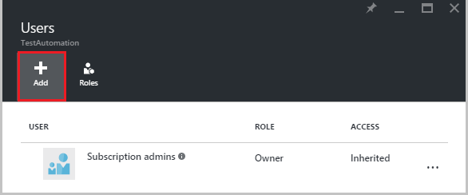  

2.  Wählen Sie eine Rolle aus der Liste der verfügbaren Rollen aus. Wir werden die Rolle **Leser** auswählen, aber Sie können auswählen, eine der verfügbaren integrierten Rollen, die ein Konto Automatisierung unterstützt oder eine benutzerdefinierte Rolle, die Sie möglicherweise definiert haben.  

    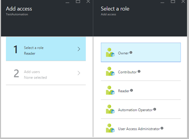  

3.  Klicken Sie auf **Benutzer hinzufügen** , das **Hinzufügen von Benutzern** Blade zu öffnen. Wenn Sie alle Benutzer, Gruppen oder Anwendungen, um Ihr Abonnement zu verwalten, und klicken Sie dann diese Benutzer sind und Sie auswählen können, damit Access hinzufügen hinzugefügt haben. Wenn es keine Benutzer aufgelistet sind oder wenn der Benutzer, die Sie interessiert sind hinzufügen nicht aufgeführt wird, klicken Sie dann auf **einladen** , um das Blade **einladen Gast** zu öffnen, in dem Sie einen Benutzer mit einer gültigen Microsoft-Konto-e-Mail-Adresse wie Outlook.com, OneDrive oder Xbox Live Ids einladen können. Nachdem Sie die e-Mail-Adresse des Benutzers eingegeben haben, klicken Sie auf **auswählen** , um den Benutzer hinzuzufügen, und klicken Sie dann auf **OK**. 

    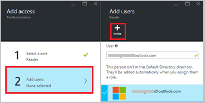  
 
    Nun sollte den Benutzer mit der Rolle **Leser** zugewiesen an die **Benutzer** Blade hinzugefügt angezeigt werden.  

      

    Sie können auch eine Rolle für den Benutzer aus dem Blade **Rollen** zuweisen. 

1. Klicken Sie auf **Rollen** aus dem Blade Benutzer, um die **Rollen Blade**zu öffnen. Aus diesem Blade sehen Sie den Namen der Rolle, die Anzahl der Benutzer und Gruppen, die diese Rolle zugewiesen ist.

    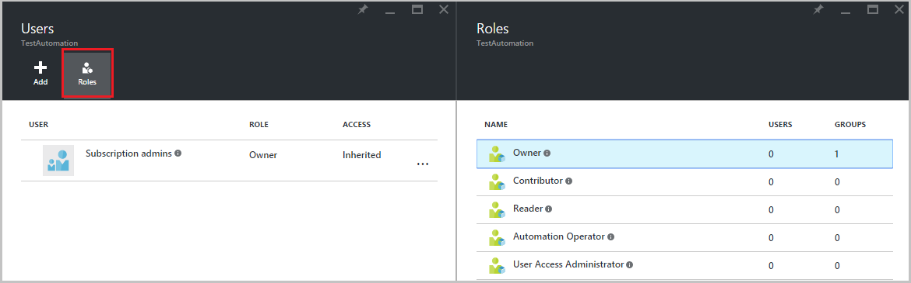  
   
    >[AZURE.NOTE] Steuerung des Benutzerzugriffs rollenbasierte kann nur Ebene der Automatisierung Konto und nicht auf eine beliebige Ressource unterhalb des Kontos Automatisierung festgelegt werden.

    Sie können einem Benutzer, die Gruppe oder die Anwendung mehr als eine Rolle zuweisen. Angenommen, wenn wir die **Automatisierung Operator** Rolle zusammen mit der **Rolle Leser** für den Benutzer hinzufügen, können klicken Sie dann diese alle Automatisierung Ressourcen anzuzeigen, als auch die Runbooks Einzelvorgänge ausführen. Erweitern Sie die Dropdownliste, um eine Liste der Benutzer zugewiesenen Rollen anzeigen.  

    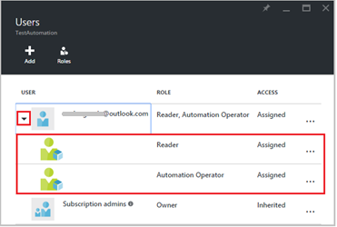  
 
### Entfernen eines Benutzers

Wer kann nicht das Konto Automatisierung verwalten und wer funktioniert nicht mehr für die Organisation, können Sie die Zugriffsberechtigung für einen Benutzer entfernen. Im folgenden werden die Schritte zum Entfernen eines Benutzers: 

1.  Wählen Sie aus dem Blade **Benutzer** der rollenzuweisung, die Sie entfernen möchten.

2.  Klicken Sie auf die Schaltfläche " **Entfernen** " in der Zuordnung Details Blade.

3.  Klicken Sie auf **Ja,** um den Löschvorgang zu bestätigen. 

    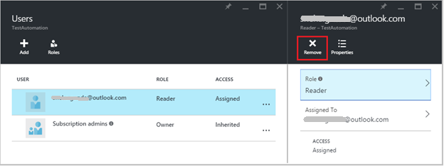  

## Rolle zugewiesene Benutzer

Wenn ein Benutzer zugewiesen eine Rolle meldet sich bei ihrem Konto Automatisierung, der Besitzer des Kontos aufgeführt, die in der Liste der **Standard-Verzeichnisse**können jetzt angezeigt. Akzeptieren, um das Konto Automatisierung anzeigen, dem sie hinzugefügt wurden, müssen Benutzer der Besitzer des standardmäßigen Verzeichnis standardmäßigen Verzeichnis umschalten.  

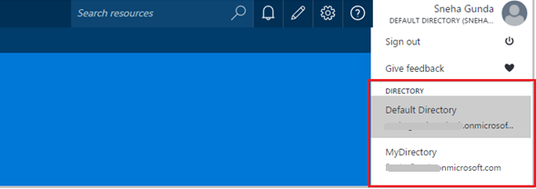  

### Benutzerfunktionalität für Automatisierung Operator Rolle

Wenn ein Benutzer auf die Automatisierung Operator Rolle Ansichten Automatisierung-Konto zugeordnet ist, die, dem Sie zugeordnet sind, sie können nur Anzeigen der Liste der Runbooks, Runbooks Aufträge und Terminpläne erstellt, in dem Konto Automatisierung jedoch ihre Definition können nicht anzeigen. Sie können beginnen, beenden, anhalten, fortsetzen oder planen Sie den Auftrag Runbooks. Der Benutzer keinen Zugriff auf andere Ressourcen Automatisierung wie Konfigurationen, Hybrid Worker Gruppen oder DSC-Knoten.  

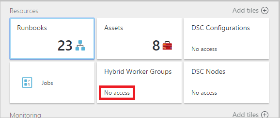  

Wenn der Benutzer auf die Runbooks klickt, werden die Befehle in der Quelle anzeigen oder Bearbeiten des Runbooks wie die Rolle des Automatisierung Operator darauf zugreifen kann nicht nicht bereitgestellt.  

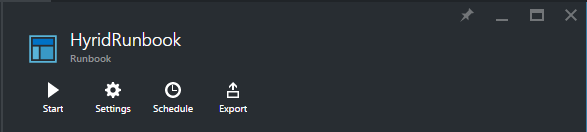  

Der Benutzer haben Zugriff auf anzeigen und Zeitpläne erstellen, aber keinen Zugriff auf alle anderen Ressourcentypen.  

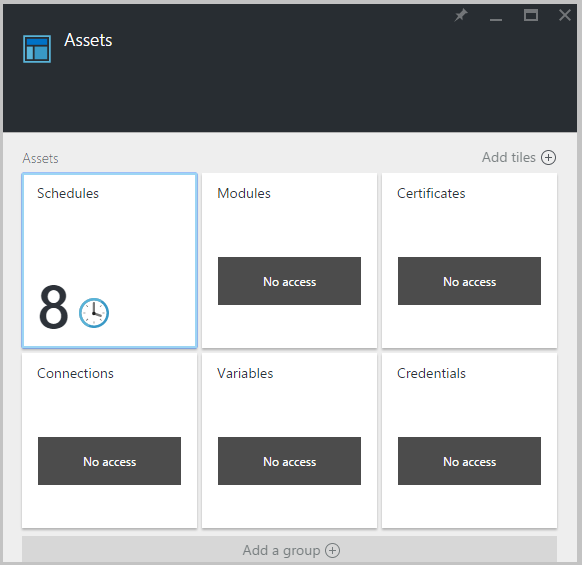  

Diese Benutzer keinen Zugriff auf die Webhooks einer Runbooks zugeordnet anzeigen auch

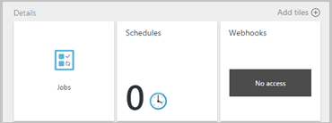  

## Konfigurieren von RBAC für Ihr Automatisierung Konto mithilfe der PowerShell Azure

Rollenbasierte Zugriff kann auch mit einer Automatisierung Firma, die mit den folgenden [Azure PowerShell-Cmdlets](../active-directory/role-based-access-control-manage-access-powershell.md)konfiguriert werden.

• [Get-AzureRmRoleDefinition](https://msdn.microsoft.com/library/mt603792.aspx) Listet alle RBAC-Rollen, die in Azure Active Directory verfügbar sind. Verwenden Sie diesen Befehl zusammen mit der **Name** -Eigenschaft können Sie alle Aktionen aufgelistet, die von einer bestimmten Rolle durchgeführt werden können.  
    **Beispiel:**  
    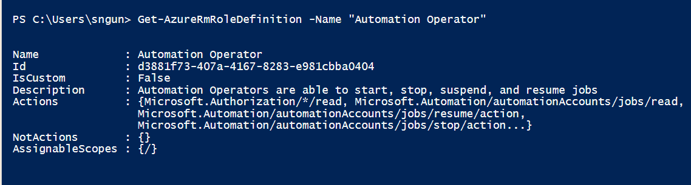  

• [Get-AzureRmRoleAssignment](https://msdn.microsoft.com/library/mt619413.aspx) Listen Azure AD RBAC rollenzuweisungen am angegebenen Bereich. Ohne Parameter gibt dieser Befehl alle rollenzuweisungen, die unter dem Abonnement vorgenommen. Verwenden Sie den Parameter **ExpandPrincipalGroups** Liste Access Zuordnungen für die angegebene Benutzer als auch die Gruppen, die, denen der Benutzer ein Mitglied ist.  
    **Beispiel:** Verwenden Sie den folgenden Befehl aus, um alle Benutzer und ihre Rollen in einem Konto Automatisierung aufzulisten.

    Get-AzureRMRoleAssignment -scope “/subscriptions/<SubscriptionID>/resourcegroups/<Resource Group Name>/Providers/Microsoft.Automation/automationAccounts/<Automation Account Name>” 

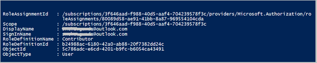

• [Neu AzureRmRoleAssignment](https://msdn.microsoft.com/library/mt603580.aspx) Zugriffs für Benutzer, Gruppen und Applikationen an einen bestimmten Bereich zuweisen.  
    **Beispiel:** Verwenden Sie den folgenden Befehl aus, um die Rolle "Automatisierung Operator" für einen Benutzer im Bereich Automatisierung Konto zuzuweisen.

    New-AzureRmRoleAssignment -SignInName <sign-in Id of a user you wish to grant access> -RoleDefinitionName "Automation operator" -Scope “/subscriptions/<SubscriptionID>/resourcegroups/<Resource Group Name>/Providers/Microsoft.Automation/automationAccounts/<Automation Account Name>”  

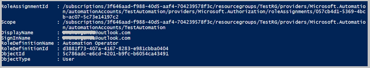

• Mit [Entfernen-AzureRmRoleAssignment](https://msdn.microsoft.com/library/mt603781.aspx) können um Zugriff auf eine angegebene Benutzer, die Gruppe oder die Anwendung aus einem bestimmten Bereich zu entfernen.  
    **Beispiel:** Verwenden Sie den folgenden Befehl, um den Benutzer aus der Rolle "Automatisierung Operator" in den Bereich Automatisierung Konto entfernen.

    Remove-AzureRmRoleAssignment -SignInName <sign-in Id of a user you wish to remove> -RoleDefinitionName "Automation Operator" -Scope “/subscriptions/<SubscriptionID>/resourcegroups/<Resource Group Name>/Providers/Microsoft.Automation/automationAccounts/<Automation Account Name>”

Ersetzen Sie in den Beispielen oben **Id anmelden**, **Abonnement-Id**, **Gruppe Ressourcenname** und **Automatisierung Kontonamen** mit Angaben zu Ihrem Konto ein. Wählen Sie auf **Ja,** Wenn Sie dazu aufgefordert werden, um zu bestätigen, bevor Sie fortfahren rollenzuweisung Benutzer entfernen.   

## Nächste Schritte
-  Informationen zum Konfigurieren von RBAC für Azure Automatisierung verschiedene Arten finden Sie in der [RBAC mit Azure PowerShell verwalten](../active-directory/role-based-access-control-manage-access-powershell.md).
- Details auf verschiedenen Methoden zum Starten einer Runbooks finden Sie unter [Starten eines Runbooks](automation-starting-a-runbook.md)
- Informationen zu den verschiedenen Runbooks Datentypen finden Sie in [Azure Automatisierung Runbooks Dateitypen](automation-runbook-types.md)

