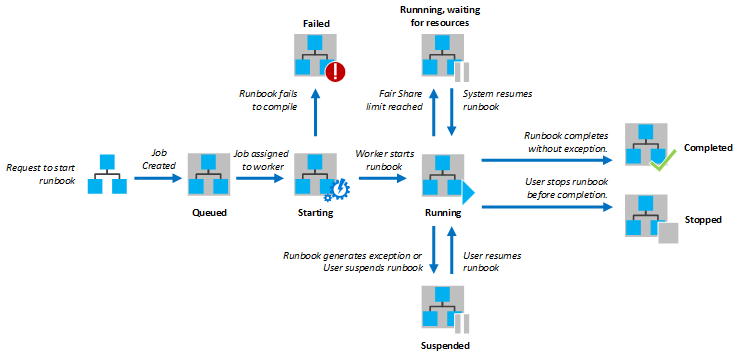
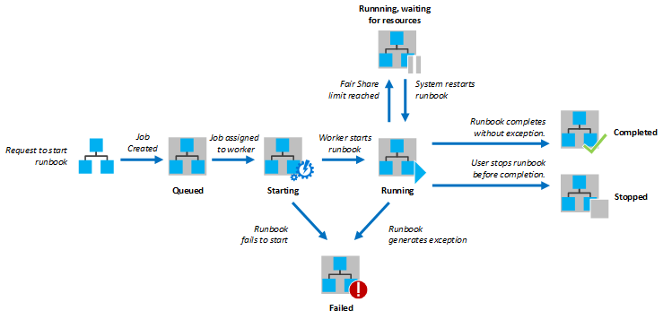

<properties
   pageTitle="Runbooks Ausführung in Azure Automatisierung"
   description="Beschreibt die Details des wie eine Runbooks in Azure Automatisierung verarbeitet wird."
   services="automation"
   documentationCenter=""
   authors="mgoedtel"
   manager="stevenka"
   editor="tysonn" />
<tags
   ms.service="automation"
   ms.devlang="na"
   ms.topic="article"
   ms.tgt_pltfrm="na"
   ms.workload="infrastructure-services"
   ms.date="03/21/2016"
   ms.author="bwren" />

# Runbooks Ausführung in Azure Automatisierung

Wenn Sie eine Runbooks in Azure Automatisierung beginnen, wird ein Auftrag erstellt. Ein Job ist eine IMAP-Instanz von einer Runbooks. Ein Azure Automatisierung Worker zugeordnet ist jede Auftrag ausgeführt werden. Während der Kollegen von mehreren Azure-Konten gemeinsam verwendet werden, sind Aufträge von verschiedenen Automatisierung Konten voneinander isoliert. Sie haben keine Kontrolle über die welche Worker Dienst die Anfrage für den Job wird.  Eine einzelne Runbooks kann mehrere Aufträge auf einmal ausgeführt haben. Wenn Sie die Liste der Runbooks Azure-Portal anzeigen, wird den Status der letzten des Projekts angegeben werden, die für jeden Runbooks eingeleitet wurde. Sie können die Liste der Aufträge für jede Runbooks anzeigen, um den Status der einzelnen überwachen. Eine Beschreibung der Status der verschiedenen finden Sie unter [Position Status](#job-statuses).

Das folgende Diagramm veranschaulicht den Lebenszyklus eines Auftrags Runbooks für [grafisch Runbooks](automation-runbook-types.md#graphical-runbooks) und [PowerShell Workflow Runbooks](automation-runbook-types.md#powershell-workflow-runbooks).

Das folgende Diagramm veranschaulicht den Lebenszyklus eines Auftrags Runbooks für [PowerShell Runbooks](automation-runbook-types.md#powershell-runbooks).

Ihre Aufträge haben Zugriff auf Ihre Azure Ressourcen durch Herstellen einer Verbindung mit Ihrem Azure-Abonnement. Sie haben Zugriff auf Ressourcen nur in der Mitte der Daten, wenn diese Ressourcen aus der Cloud öffentlich zugänglich sind.

## Status der Position

Die folgende Tabelle beschreibt die verschiedenen Status, die für ein Projekt möglich sind.

| Status| Beschreibung|
|:---|:---|
|Abgeschlossen|Der Auftrag wurde erfolgreich abgeschlossen angezeigt wird.|
|Fehler beim| Fehler beim für [Graphical und PowerShell Workflow Runbooks](automation-runbook-types.md)des Runbooks kompilieren.  [PowerShell-Skript Runbooks](automation-runbook-types.md)des Runbooks konnte nicht gestartet oder der Auftrag Ausnahme. |
|Fehler beim Warten auf Ressourcen|Der Auftrag fehlgeschlagen, da es der erreicht [gleich großen Anteil](#fairshare) dreimal und von den gleichen Wissensstand oder ab Beginn des Runbooks jedes Mal gestartet.|
|In der Warteschlange|Im Auftrag wartet für Ressourcen auf ein Worker Automatisierung verfügbar kommen, damit er gestartet werden kann.|
|Starten|Die Position eines Arbeitskollegen zugewiesen wurde, und das System wird derzeit ihn zu starten.|
|Fortsetzen|Das System wird derzeit den Auftrag fortsetzen, nachdem er angehalten wurde.|
|Ausführen|Der Auftrag wird ausgeführt.|
|Ausgeführt, warten auf Ressourcen|Das Projekt wurde entfernt, da die [gleich großen Anteil](#fairshare) erreicht. Es wird in Kürze an seiner letzten Prüfpunkt fortgesetzt.|
|Beendet|Der Auftrag wurde vom Benutzer beendet, bevor sie durchgeführt wurde.|
|Beenden|Das System wird derzeit der Auftrag gestoppt wird.|
|Unterbrochen|Der Auftrag wurde durch den Benutzer, durch das System oder von einem Befehl in des Runbooks angehalten. Ein Auftrags, das unterbrochen wurde erneut gestartet werden kann und wird aus den letzten Prüfpunkt oder vom Anfang des des Runbooks fortgesetzt werden, wenn es keine Kontrollpunkten verfügt. Des Runbooks wird nur vom System im Fall einer Ausnahme angehalten. Standardmäßig ist ErrorActionPreference auf **Continue** festgelegt Bedeutung, die der Auftrag auf ein Fehler weiterhin ausgeführt wird. Wenn diese Einstellung Variable **Beenden** festgelegt ist wird die Position auf ein Fehler ausgesetzt.  Gilt nur für [Graphical und PowerShell Workflow Runbooks](automation-runbook-types.md) .|
|Aussetzen|Das System versucht, den Auftrag an die Anfrage des Benutzers zu unterbrechen. Des Runbooks muss den nächsten Prüfpunkt erreicht haben, bevor er angehalten werden kann. Wenn die letzten Prüfpunkt Vergangenheit liegt, wird er fertig gestellt, bevor er angehalten werden kann.  Gilt nur für [Graphical und PowerShell Workflow Runbooks](automation-runbook-types.md) .|

## Anzeigen des Projektstatus mithilfe der Azure-Verwaltungsportal

### Automatisierung Dashboard

Die Automatisierung Dashboard zeigt eine Zusammenfassung aller der Runbooks für ein bestimmtes Automatisierung-Konto an. Darüber hinaus einen Überblick Verwendung für das Konto. Das Zusammenfassung Diagramm zeigt die Anzahl der Aufträge insgesamt für alle Runbooks, die jeder Status über eine angegebene Anzahl von Tagen oder Stunden eingegeben. Sie können den Zeitbereich auf der oberen rechten Ecke des Diagramms auswählen. Zeitachse des Diagramms ändert sich entsprechend dem Typ des Zeitraums, den Sie auswählen. Sie können auswählen, ob die Zeile für den aktuellen Status eines angezeigt werden, indem sie am oberen Bildschirmrand darauf klicken.

Die folgenden Schritte können Sie die Automatisierung Dashboard anzuzeigen.

1. Aktivieren Sie im Verwaltungsportal Azure **Automatisierung,** und klicken Sie dann auf den Namen eines Kontos Automatisierung.
1. Wählen Sie die Registerkarte **Dashboard** aus.

### Runbooks Dashboard

Das Dashboard Runbooks zeigt eine Zusammenfassung für eine einzelne Runbooks. Das Zusammenfassung Diagramm zeigt die Anzahl der Aufträge insgesamt für des Runbooks, die jeder Status über eine angegebene Anzahl von Tagen oder Stunden eingegeben. Sie können den Zeitbereich auf der oberen rechten Ecke des Diagramms auswählen. Zeitachse des Diagramms ändert sich entsprechend dem Typ des Zeitraums, den Sie auswählen. Sie können auswählen, ob die Zeile für den aktuellen Status eines angezeigt werden, indem sie am oberen Bildschirmrand darauf klicken.

Die folgenden Schritte können Sie das Runbooks Dashboard anzuzeigen.

1. Aktivieren Sie im Verwaltungsportal Azure **Automatisierung,** und klicken Sie dann auf den Namen eines Kontos Automatisierung.
1. Klicken Sie auf den Namen einer Runbooks.
1. Wählen Sie die Registerkarte **Dashboard** aus.

### Zusammenfassung der Position

Sie können eine Liste aller Einzelvorgänge anzeigen, die für einen bestimmten Runbooks und deren Status zuletzt erstellt wurden. Sie können diese Liste nach Position Status und den Datumsbereich für die letzte Änderung an der Position filtern. Klicken Sie auf den Namen eines Projekts in deren detaillierte Informationen und deren Ausgabe anzeigen. Die Detailansicht der den Auftrag enthält die Werte für die Runbooks Parameter, die den Auftrag zur Verfügung gestellt wurden.

Die folgenden Schritte können Sie die Einzelvorgänge für eine Runbooks anzuzeigen.

1. Aktivieren Sie im Verwaltungsportal Azure **Automatisierung,** und klicken Sie dann auf den Namen eines Kontos Automatisierung.
1. Klicken Sie auf den Namen einer Runbooks.
1. Wählen Sie auf der Registerkarte **Aufträge** aus.
1. Klicken Sie auf die Spalte **Auftrag erstellt** für ein Projekt, um deren Details und Ausgabe anzuzeigen.

## Abrufen von Projektstatus mithilfe von Windows PowerShell

Der [Get-AzureAutomationJob](http://msdn.microsoft.com/library/azure/dn690263.aspx) können Sie für eine Runbooks und die Details eines bestimmten Auftrags erstellten Aufträge abzurufen. Wenn Sie mit Windows PowerShell [- AzureAutomationRunbook beginnen](http://msdn.microsoft.com/library/azure/dn690259.aspx)mit einer Runbooks starten, gibt es die resultierende Position zurück. [Get-AzureAutomationJob](http://msdn.microsoft.com/library/azure/dn690263.aspx)-Ausgabe eines Auftrags Ausgabe zu verwenden.

Im folgenden Beispielbefehle Ruft die letzte Position für eine Stichprobe Runbooks und zeigt es den Status, die Werte für die Parameter Runbooks und deren Ausgabe aus dem Auftrag bereitstellen.

    $job = (Get-AzureAutomationJob –AutomationAccountName "MyAutomationAccount" –Name "Test-Runbook" | sort LastModifiedDate –desc)[0]
    $job.Status
    $job.JobParameters
    Get-AzureAutomationJobOutput –AutomationAccountName "MyAutomationAccount" -Id $job.Id –Stream Output

## ' Wissenschaftsmesse ' freigeben

Um Ressourcen für alle Runbooks in der Cloud zu teilen, wird Azure Automatisierung einen beliebigen Auftrag vorübergehend entfernen, nachdem er für 3 Stunden ausgeführt wurde, ist.    [Graphical](automation-runbook-types.md#graphical-runbooks) und [PowerShell Workflow](automation-runbook-types.md#powershell-workflow-runbooks) Runbooks wird aus den letzten [Wissensstand](http://technet.microsoft.com/library/dn469257.aspx#bk_Checkpoints)fortgesetzt. Während dieses Zeitraums zeigt der Auftrag Status wird ausgeführt, warten auf Ressourcen. Wenn die Runbooks keine Kontrollpunkten weist oder der Auftrag hatten nicht die erste Wissensstand vor entladenen erreicht, wird es am Anfang neu.  [PowerShell](automation-runbook-types.md#powershell-runbooks) Runbooks werden immer ab dem Anfang neu gestartet, da diese Kontrollpunkten nicht unterstützen.

>[AZURE.NOTE] Die gleich großen Anteil Beschränkung gilt nicht Runbooks Einzelvorgänge zum Ausführen auf Hybrid Runbooks Kollegen.

Wenn die Runbooks vom gleichen Prüfpunkt oder ab dem Anfang des Runbooks aufeinander folgenden dreimal neu gestartet wurde, wird es mit dem Status Fehler "," Warten auf Ressourcen beendet. Dies ist Runbooks endlos ausgeführt, ohne durchführen, wie es in der nächsten Prüfpunkt vorzunehmen, ohne erneut entladenen stehen keine schützen. In diesem Fall erhalten Sie die folgende Ausnahme mit dem Fehler an.

*Die Position kann nicht ausgeführt werden, da es wiederholt vom gleichen Prüfpunkt entfernt wurde fortgesetzt. Stellen Sie sicher, dass Ihre Runbooks langer Vorgänge ohne beibehalten Zustand nicht durchgeführt wird.*

Wenn Sie eine Runbooks erstellen, sollten Sie sicherstellen, dass die Zeit zum Ausführen von Aktivitäten, die zwischen zwei Kontrollpunkten 3 Stunden nicht überschreiten wird. Möglicherweise müssen Sie das Hinzufügen von Kontrollpunkten zu Ihrer Runbooks, um sicherzustellen, dass es nicht erreicht haben, diese Beschränkung 3 Stunden ab oder lange aufteilen Vorgänge ausgeführt. Ihre Runbooks möglicherweise beispielsweise eine indizieren auf einer großen SQL-Datenbank ausführen. Wenn dieser einzelnen Vorgang nicht innerhalb der Obergrenze gleich großen Anteil abgeschlossen wird, klicken Sie dann der Auftrag entladen und ab dem Beginn neu gestartet. Sie sollten in diesem Fall teilen Sie den Vorgang Indizieren in mehreren Schritten, z. B. neu rekonstruieren einer Tabelle gleichzeitig anzeigt, und klicken Sie dann eine Wissensstand nach jedem Vorgang einfügen, sodass die Position nach dem letzten nach Abschluss des Vorgangs fortsetzen konnte.

## Nächste Schritte

- [Starten Sie eine Runbooks in Azure Automatisierung](automation-starting-a-runbook.md)
