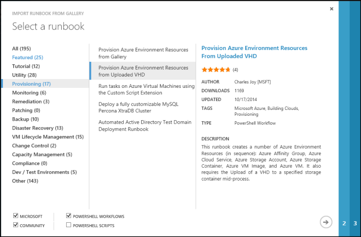
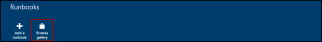
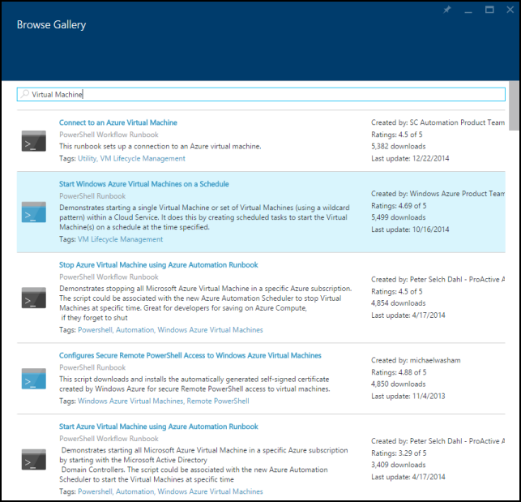
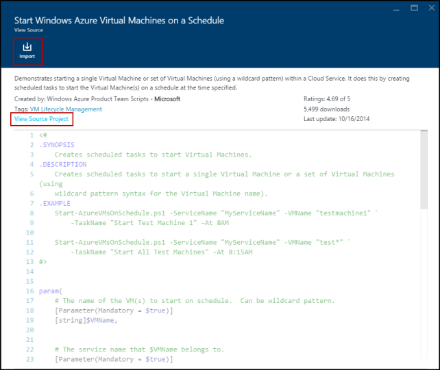
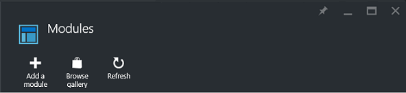
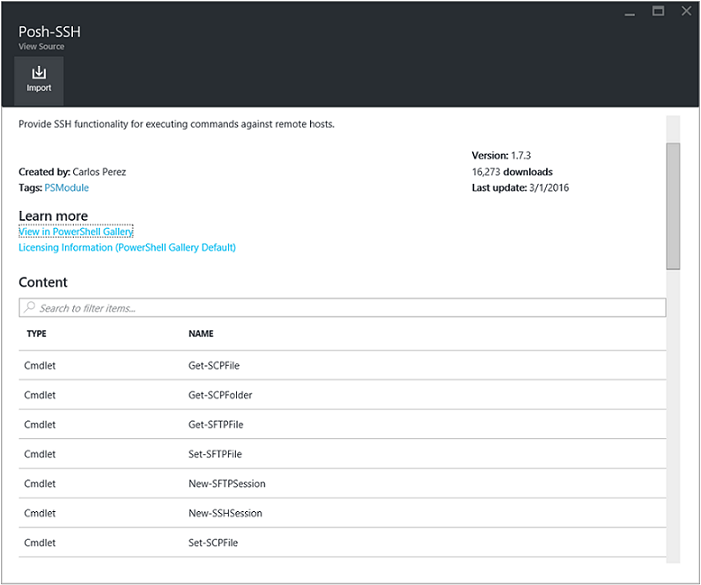
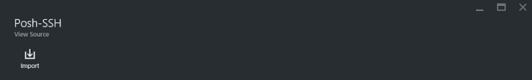
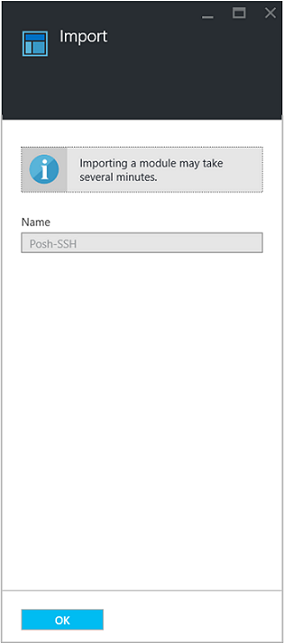

<properties
    pageTitle="Runbooks und Modul Kataloge für Azure Automatisierung | Microsoft Azure"
    description="Runbooks und Module von Microsoft und der Community sind für Sie installieren und verwenden Sie in Ihrer Umgebung Azure Automatisierung verfügbar.  Dieser Artikel beschreibt, wie Sie diese Ressourcen zugreifen können und Ihre Runbooks, um den Katalog zu beteiligen."
    services="automation"
    documentationCenter=""
    authors="mgoedtel"
    manager="jwhit"
    editor="tysonn" />
<tags
    ms.service="automation"
    ms.devlang="na"
    ms.topic="article"
    ms.tgt_pltfrm="na"
    ms.workload="infrastructure-services"
    ms.date="09/18/2016"
    ms.author="magoedte;bwren" />

# Runbooks und Modul Kataloge für Azure Automatisierung

Anstatt eigene Runbooks und Module in Azure Automatisierung zu erstellen, können Sie eine Vielzahl von Szenarien zugreifen, die bereits von Microsoft und der Community erstellt wurden.  Möglicherweise können diese Szenarios ohne Änderung oder können Sie diese als Ausgangspunkt verwenden und für Ihren spezifischen Anforderungen bearbeiten.

Sie können Runbooks aus dem [Katalog Runbooks](#runbooks-in-runbook-gallery) und Module aus dem [Katalog PowerShell](#modules-in-powerShell-gallery)erhalten.  Sie können auch auf der Community mitwirken, durch die gemeinsame Nutzung von Szenarien, die Sie entwickeln.

## Runbooks Runbooks-Katalog

Klicken Sie im [Katalog Runbooks](http://gallery.technet.microsoft.com/scriptcenter/site/search?f[0].Type=RootCategory&f[0].Value=WindowsAzure&f[1].Type=SubCategory&f[1].Value=WindowsAzure_automation&f[1].Text=Automation) bietet eine Vielzahl von Runbooks von Microsoft und der Community, die Sie in Azure Automatisierung importieren können. Sie können entweder Download einer Runbooks aus dem Katalog der im [TechNet Script Center](http://gallery.technet.microsoft.com/)gehostet wird, oder Sie können Runbooks direkt aus dem Katalog aus dem Azure klassischen Portal oder Azure-Portal importieren.

Sie können nur direkt aus dem Katalog Runbooks importieren mit dem Azure klassischen Portal oder Azure-Portal. Diese Funktion mithilfe der Windows PowerShell ist nicht möglich.

>[AZURE.NOTE] Sie müssen den Inhalt von einem beliebigen Runbooks, die Sie aus dem Katalog Runbooks erhalten, und verwenden Sie vorsichtig in installieren und Ausführen von in einer Umgebung für die Herstellung überprüfen. |

### So importieren Sie eine Runbooks aus dem Katalog Runbooks mit dem klassischen Azure-portal

1. Im Portal Azure klicken Sie auf, **neue** **App Services**, **Automatisierung**, **Runbooks**, **Aus der Katalog**.
2. Wählen Sie eine Kategorie aus, um verwandte Runbooks anzuzeigen, und wählen Sie eine Runbooks, um die Details anzuzeigen. Bei der Auswahl des Runbooks gewünschten, klicken Sie auf den Pfeil nach rechts.

    

3. Überprüfen Sie den Inhalt des Runbooks, und notieren Sie alle Anforderungen in der Beschreibung. Wenn Sie fertig sind, klicken Sie auf den Pfeil nach rechts.
4. Geben Sie die Details des Runbooks, und klicken Sie dann auf die Schaltfläche mit dem Häkchen. Der Name des Runbooks wird bereits ausgefüllt werden.
5. Des Runbooks wird auf der Registerkarte **Runbooks** für das Konto Automatisierung angezeigt.

### So importieren Sie eine Runbooks aus dem Katalog Runbooks mit Azure-portal

1. Öffnen Sie Ihr Konto Automatisierung im Portal Azure.
2. Klicken Sie auf die Kachel **Runbooks** zum Öffnen der Liste von Runbooks.
3. Klicken Sie auf die Schaltfläche **Katalog durchsuchen** .

    

4. Suchen Sie das Katalogelement, das Sie möchten, und wählen Sie ihn um seine Details anzuzeigen.

    

4. Klicken Sie auf **Ansicht Quellprojekt** , um das Element im [TechNet Script Center](http://gallery.technet.microsoft.com/)anzeigen.
5. Um ein Element zu importieren, klicken Sie darauf, um die entsprechenden Details anzeigen, und klicken Sie dann auf die Schaltfläche **Importieren** auf.

    

6. Optional ändern Sie des Namens des Runbooks, und klicken Sie dann auf **OK** , um die Runbooks importieren.
5. Des Runbooks wird auf der Registerkarte **Runbooks** für das Konto Automatisierung angezeigt.

### Hinzufügen einer Runbooks zum Katalog "Runbooks"

Microsoft fordert Sie so im Katalog Runbooks Runbooks hinzu, die Sie für andere Kunden nützlich wäre vorstellen.  Sie können eine Runbooks durch [Hochladen er im Script Center](http://gallery.technet.microsoft.com/site/upload) die folgenden Details unter Berücksichtigung hinzufügen.

- Sie müssen *Windows Azure* angeben, für die **Kategorie** und *Automatisierung* für die **Unterkategorie** für des Runbooks im Assistenten angezeigt werden.  

- Der Upload muss sich auf einer einzelnen ps1 oder .graphrunbook-Datei.  Des Runbooks alle Module, untergeordnete Runbooks oder Ressourcen benötigt, sollten Sie die in der Beschreibung der Übermittlung und im Kommentarbereich des des Runbooks auflisten.  Wenn Sie ein Szenario mit mehreren Runbooks Anforderung verfügen, jede separat hochladen, und listet die Namen der zugehörigen Runbooks in allen ihren Beschreibungen. Stellen Sie sicher, dass Sie denselben Tags verwenden, sodass Sie nicht in der gleichen Kategorie angezeigt werden. Lesen Sie die Beschreibung, wenn Sie wissen, dass andere Runbooks erforderlich sind, ein Benutzer müssen dem Szenario entwickelt.

- Fügen Sie der Kategorie "GraphicalPS" hinzu, wenn Sie ein **grafisch Runbooks** (nicht grafisch Workflow) veröffentlichen. 

- Fügen Sie entweder eine PowerShell oder einen PowerShell Workflow Codeausschnitt in die Beschreibung mithilfe eines Symbols **Codeabschnitt einfügen** .

- Zusammenfassung für den Upload wird in den Ergebnissen Runbooks Katalog angezeigt, sodass Sie detaillierten Informationen bereitstellen sollten, der einen Benutzer die Funktionalität der des Runbooks identifizieren helfen.

- Sie sollten die Upload bis zu drei der folgenden Tags zuweisen.  Des Runbooks werden im Assistenten unter den Kategorien aufgelistet, die seine Tags entsprechen.  Beliebige Tags nicht in dieser Liste werden vom Assistenten ignoriert. Wenn Sie alle entsprechenden Kategorien nicht angeben, werden unter der Kategorie andere des Runbooks aufgelistet.

 - Sicherung
 - Kapazität Management
 - Ändern des Steuerelements
 - Compliance
 - Entwickler / Test-Umgebungen
 - Wiederherstellung
 - Für die Überwachung
 - Patch
 - Bereitgestellt
 - Behebung
 - Verwaltung von virtuellen Computern Lebenszyklus

- Automatisierung aktualisiert im Katalog pro Stunde, damit Sie Ihre Beiträge nicht sofort angezeigt.

## Module PowerShell-Katalog

PowerShell-Module enthalten Cmdlets, mit denen Sie in Ihrem Runbooks, und vorhandene Module, die Sie in Azure Automatisierung installieren können in der [PowerShell-Katalog](http://www.powershellgallery.com)verfügbar sind.  Sie können diesem Katalog vom Azure-Portal zu starten, und installieren Sie sie direkt in Azure Automatisierung oder können Sie diese herunterladen und manuell installieren.  Sie können keine Module direkt aus dem Azure klassischen Portal installieren, jedoch können Sie sie herunterladen wie bei einem beliebigen anderen Modul zu installieren.

### So importieren Sie ein Modul aus dem Katalog Automatisierung Modul, mit dem Azure-portal

1. Öffnen Sie Ihr Konto Automatisierung im Portal Azure.
2. Klicken Sie auf die Kachel **Posten** , um die Liste der Anlagen zu öffnen.
3. Klicken Sie auf die Kachel **Module** , um die Liste der Module zu öffnen.
4. Klicken Sie auf die Schaltfläche **Durchsuchen Katalog** und das Durchsuchen Katalog Blade wird gestartet.

      
5. Nachdem Sie das Durchsuchen Katalog Blade gestartet haben, können Sie durch die folgenden Felder suchen:

   - Name des Moduls
   - Kategorien
   - Autor
   - Cmdlet/DSC Ressourcenname

6. Suchen Sie ein Modul, das Sie interessiert, und wählen Sie ihn um seine Details anzuzeigen.  
Wenn Sie einen Drilldown in einem bestimmten Modul durchführen, können Sie anzeigen, dass weitere Informationen über das Modul, einschließlich eines Links zu den PowerShell-Katalog wieder alle erforderlichen Abhängigkeiten, und alle des Cmdlets und/oder DSC-Ressourcen, die das Modul enthält.

      

7. Um das Modul direkt in Azure Automatisierung installiert haben, klicken Sie auf die Schaltfläche **Importieren** .

    

8. Wenn Sie auf die Schaltfläche "Importieren" klicken, sehen Sie den Namen des Moduls, die Sie importieren. Wenn alle die Abhängigkeiten installiert sind, wird die Schaltfläche **OK** aktiv sein. Wenn Sie Abhängigkeiten fehlt, müssen Sie die importieren, bevor Sie dieses Modul importiert werden können.
9. Klicken Sie auf **OK** , um das Modul, importieren und das Modul Blade wird gestartet. Wenn Azure Automatisierung ein Moduls in Ihr Konto importiert hat, werden Metadaten für das Modul und die Cmdlets extrahiert.

    

    Dies kann einige Minuten dauern, da jede Aktivität extrahiert werden muss.
10. Sie erhalten eine Benachrichtigung, dass das Modul bereitgestellt wird und eine Benachrichtigung, wenn sie durchgeführt wurde.
11. Nachdem das Modul importiert wurde, werden die verfügbaren Aktivitäten angezeigt, und seine Ressourcen in Ihren Runbooks und Konfiguration des gewünschten können.

## Anfordern einer Runbooks oder Modul

Sie können Anfragen an [Benutzer Voicemail](https://feedback.azure.com/forums/246290-azure-automation/)senden.  Wenn Sie oder benötigen Sie Hilfe beim Schreiben einer Runbooks zu PowerShell Fragen, stellen Sie eine Frage in unseren [Forum](http://social.msdn.microsoft.com/Forums/windowsazure/en-US/home?forum=azureautomation&filter=alltypes&sort=lastpostdesc).

## Nächste Schritte

- Um mit Runbooks anzufangen, finden Sie unter [Erstellen oder Importieren einer Runbooks in Azure Automatisierung](automation-creating-importing-runbook.md)
- Die Unterschiede zwischen PowerShell und PowerShell-Workflow mit Runbooks finden Sie unter [Schulung PowerShell-workflow](automation-powershell-workflow.md)
