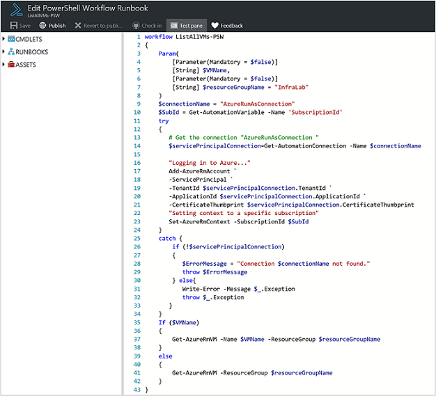
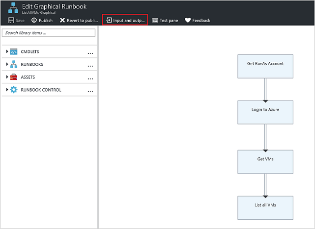
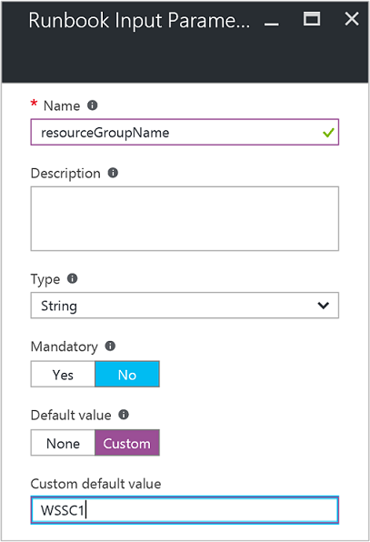
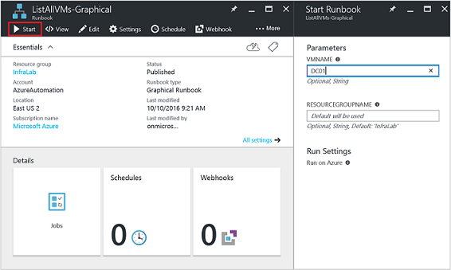
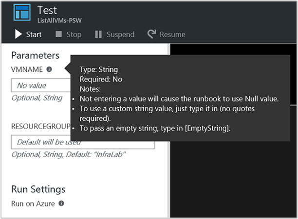
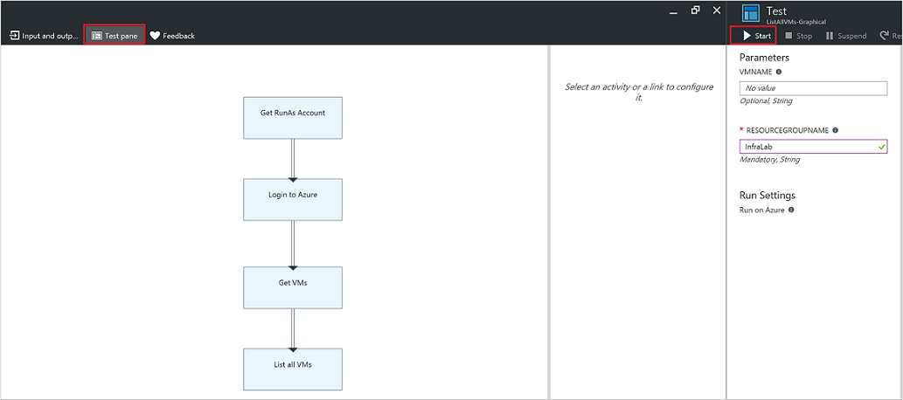
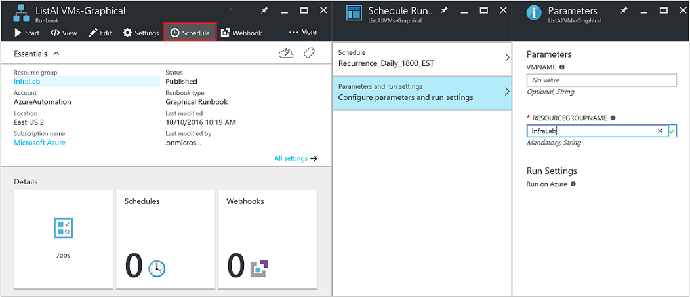
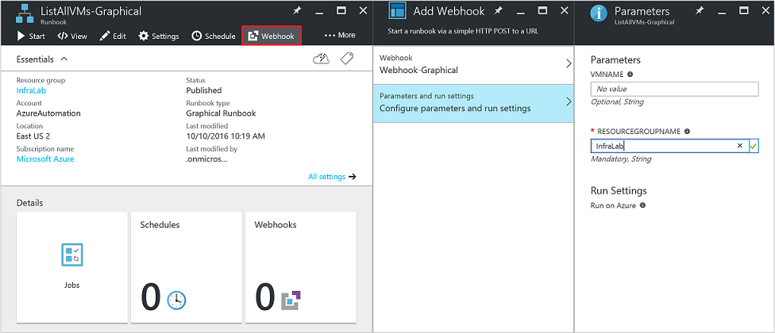
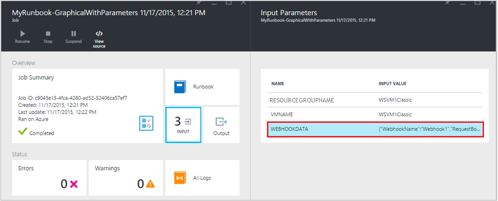

<properties
   pageTitle="Runbooks Eingabeparameter | Microsoft Azure"
   description="Eingabeparameter Runbooks erhöhen Sie die Flexibilität von Runbooks, sodass Sie Daten in einer Runbooks übergeben, wenn er gestartet wird. In diesem Artikel werden die verschiedenen Szenarios Eingabeparameter in Runbooks verwendet werden."
   services="automation"
   documentationCenter=""
   authors="MGoedtel"
   manager="jwhit"
   editor="tysonn" />
<tags
   ms.service="automation"
   ms.devlang="na"
   ms.topic="article"
   ms.tgt_pltfrm="na"
   ms.workload="infrastructure-services"
   ms.date="10/11/2016"
   ms.author="sngun"/>

# <a name="runbook-input-parameters"></a>Runbooks Eingabeparameter

Eingabeparameter Runbooks erhöhen Sie die Flexibilität von Runbooks, sodass Sie Daten an diesen weitergegeben werden, wenn er gestartet wird. Der Parameter ermöglichen die Aktionen Runbooks für bestimmte Szenarien und Umgebungen abgestimmt sein. In diesem Artikel werden wir Sie durch geführt verschiedenen Szenarios, in dem Eingabeparameter in Runbooks verwendet.

## <a name="configure-input-parameters"></a>Konfigurieren der Eingabeparameter

Eingabeparameter können in PowerShell, PowerShell-Workflows und grafisch Runbooks konfiguriert sein. Eine Runbooks kann mehrere Parameter mit unterschiedlichen Datentypen oder keine Parameter überhaupt verfügen. Eingabeparameter obligatorisch oder optional sein können, und Sie können einen Standardwert für optionale Parameter zuweisen. Sie können die Eingabeparameter für eine Runbooks Werte zuweisen, beim Starten durch eine der Methoden zur Verfügung. Diese Methoden umfassen eine Runbooks beginnend mit dem Portal oder einem Webdienst. Sie können auch eine als eine untergeordnete Runbooks starten, die in einem anderen Runbooks Inline aufgerufen wird.

## <a name="configure-input-parameters-in-powershell-and-powershell-workflow-runbooks"></a>Konfigurieren der PowerShell und PowerShell Workflow Runbooks Eingabeparameter

PowerShell und [PowerShell Workflow Runbooks](automation-first-runbook-textual.md) in Azure-Automatisierung unterstützt Eingabeparameter, die durch die folgenden Attribute definiert sind.  

| **Eigenschaft** | **Beschreibung** |
|:--- |:---|
| Typ | Erforderlich. Der Datentyp für den Parameterwert erwartet. Beliebiger ist gültig. |
| Namen | Erforderlich. Der Name des Parameters. Dies muss innerhalb des Runbooks, eindeutig sein und können nur Buchstaben, Zahlen oder Unterstriche. Sie müssen mit einem Buchstaben beginnen. |
| Obligatorisch | Optional. Gibt an, ob ein Wert für den Parameter angegeben werden muss. Wenn Sie dies auf **$true**festgelegt, muss ein Wert angegeben werden, wenn des Runbooks gestartet wird. Wenn Sie dies auf **$false**festgelegt haben, ist ein Wert optional. |
| Standardwert | Optional.  Gibt einen Wert, der für den Parameter verwendet wird, wenn ein Wert ist nicht in übergeben, wenn des Runbooks gestartet wird. Ein Standardwert für jeden Parameter festgelegt werden kann, und wird automatisch erfolgen soll den Parameter optional unabhängig von der Einstellung obligatorisch. |

Windows PowerShell unterstützt weitere Attribute der Eingabeparameter als die hier, wie bei der Validierung Aliases aufgeführten, und legt diesen Parameter fest. Azure-Automatisierung unterstützt aktuell jedoch nur die oben aufgeführten Eingabeparameter.

Parameterdefinition in PowerShell Workflow Runbooks weist die folgende allgemeine Form, wobei mehrere Parameter durch Kommas getrennt werden.

   ```
     Param
     (
         [Parameter (Mandatory= $true/$false)]
         [Type] Name1 = <Default value>,

         [Parameter (Mandatory= $true/$false)]
         [Type] Name2 = <Default value>
     )
   ```

>[AZURE.NOTE] Wenn Sie Parameter, definieren, wenn Sie das **obligatorische** Attribut nicht angeben, wird dann standardmäßig der Parameter optional angesehen. Auch wenn Sie einen Standardwert für einen Parameter in PowerShell Workflow Runbooks festlegen, wird es von PowerShell als optionalen Parameter, unabhängig vom **obligatorische** Attributwert Stundenwert behandelt.

Konfigurieren Sie beispielhaft lassen Sie uns die Eingabeparameter für einen PowerShell Workflow Runbooks, die Details zu virtuellen Computern, entweder eines einzelnen virtuellen Computers oder alle virtuellen Computern innerhalb einer Ressourcengruppe gibt. Diese Runbooks verfügt über zwei Parameter aus, wie im folgenden Screenshot gezeigt: der Name des virtuellen Computers und den Namen der Ressourcengruppe.



In diesem Parameter sind Definition, die Parameter **$VMName** und **$resourceGroupName** einfache Parameter des Typs String. PowerShell und PowerShell Workflow Runbooks unterstützen jedoch alle einfache und komplexe Typen, z. B. **Objekt** oder **PSCredential** für Eingabeparameter.

Wenn Ihre Runbooks Eingabeparameter ein Objekt enthält, verwenden Sie PowerShell Hashtable mit (Name, Wert) paarweise angegeben werden, um einen Wert zu übergeben. Angenommen, Sie haben den folgenden Parameter ein Runbooks:

     [Parameter (Mandatory = $true)]
     [object] $FullName

Dann können Sie den folgenden Wert an den Parameter übergeben:

    @{"FirstName"="Joe";"MiddleName"="Bob";"LastName"="Smith"}


## <a name="configure-input-parameters-in-graphical-runbooks"></a>Konfigurieren der Eingabeparameter grafisch runbooks

[Konfigurieren eines grafischen Runbooks](automation-first-runbook-graphical.md) mit Eingabeparameter erstellen wir eine grafisch Runbooks, die Details zu virtuellen Computern, entweder eines einzelnen virtuellen Computers oder alle virtuellen Computern innerhalb einer Ressourcengruppe gibt ein. Konfigurieren eines Runbooks besteht aus zwei wichtigen Aktivitäten, wie unten beschrieben.

[**Authentifizieren Runbooks mit Azure ausführen als Konto**](automation-sec-configure-azure-runas-account.md) mit Azure authentifizieren.

[**Get-AzureRmVm**](https://msdn.microsoft.com/library/mt603718.aspx) können Sie die Eigenschaften eines virtuellen Computern zu gelangen.

Die [**Ausgabe eines schreiben**](https://technet.microsoft.com/library/hh849921.aspx) Aktivität können Sie die Namen von virtuellen Computern ausgeben. Die Aktivität **Get-AzureRmVm** akzeptiert zwei Parameter, der **Name des virtuellen Computers** und den **Ressourcengruppennamen**an. Da diese Parameter unterschiedliche Werte jedes Mal Sie des Runbooks beginnen erfordern könnten, können Sie Ihrer Runbooks Eingabeparameter hinzufügen. Hier werden die Schritte zum Hinzufügen von Eingabeparameter aus:

1. Wählen Sie aus dem Blade **Runbooks** des grafisch Runbooks aus, und klicken Sie dann auf [**Bearbeiten**](automation-graphical-authoring-intro.md) sie.

2. Klicken Sie aus dem Runbooks-Editor auf **Eingabe und Ausgabe** um das Blade **ein- und Ausgabe** zu öffnen.

    

3. Das Blade **Eingabe- und** zeigt eine Liste der Eingabeparameter, die für die Runbooks definiert sind. In diesem Blade können Sie einen neuen Eingabeparameter hinzufügen oder bearbeiten Sie die Konfiguration der vorhandenen Eingabeparameter. Wenn Sie einen neuen Parameter für des Runbooks hinzufügen möchten, klicken Sie auf **Eingabesprache hinzufügen** , um das Blade **Runbooks Eingabeparameter** zu öffnen. Es ist, können Sie die folgenden Parameter konfigurieren:

  	| **Eigenschaft** | **Beschreibung** |
  	|:--- |:---|
  	| Namen | Erforderlich.  Der Name des Parameters. Dies muss innerhalb des Runbooks, eindeutig sein und können nur Buchstaben, Zahlen oder Unterstriche. Sie müssen mit einem Buchstaben beginnen. |
  	| Beschreibung | Optional. Beschreibung zum Zweck der Eingabeparameter. |
  	| Typ | Optional. Der Datentyp, der für den Parameterwert erwartet wird. Unterstützte Parametertypen sind **Zeichenfolge**, **Int32**, **Int64**, **Decimal**, **Boolean**, **DateTime**und **Object**. Wenn Sie ein Datentyp nicht ausgewählt ist, wird standardmäßig **Zeichenfolge**. |
  	| Obligatorisch | Optional. Gibt an, ob ein Wert für den Parameter angegeben werden muss. Wenn Sie **Ja**auswählen, muss ein Wert angegeben werden, wenn die Runbooks gestartet wird. Wenn Sie **keine**auswählen, muss dann ein Wert nicht wenn des Runbooks gestartet wird, und ein Standardwert festgelegt werden kann. |
  	| Standardwert | Optional. Gibt einen Wert, der für den Parameter verwendet wird, wenn ein Wert ist nicht in übergeben, wenn des Runbooks gestartet wird. Für einen Parameter, die nicht obligatorisch ist, kann ein Standardwert festgelegt werden. Wenn Sie einen Standardwert festlegen möchten, wählen Sie **Benutzerdefiniert**aus. Dieser Wert wird verwendet, es sei denn, ein anderer Wert bereitgestellt wird, wenn die Runbooks gestartet wird. Wählen Sie **keine** , wenn Sie keine Standardwert bereitstellen möchten. |  

    

4. Erstellen Sie zwei Parametern mit den folgenden Eigenschaften, die von der **Get-AzureRmVm** Aktivität verwendet werden:

    - **1. Parameter:**
      - Name - VMName
      - Typ - Zeichenfolge
      - Obligatorisch - Nr.

    - **2. Parameter:**
      - Name - resourceGroupName
      - Typ - Zeichenfolge
      - Obligatorisch - Nr.
      - Standardwert - benutzerdefinierte
      - Benutzerdefinierte Standardwert - \<Name der Ressourcengruppe, die den virtuellen Computern enthält >

5. Nachdem Sie die Parameter hinzugefügt haben, klicken Sie auf **OK**.  Sie können nun anzeigen in der **Eingabe und Ausgabe Blade**. Klicken Sie erneut auf **OK** , und klicken Sie dann auf **Speichern** und **Veröffentlichen** der Runbooks.

## <a name="assign-values-to-input-parameters-in-runbooks"></a>Zuweisen von Werten, die in Runbooks Eingabeparameter

Sie können Werte in Runbooks in den folgenden Szenarien Eingabeparameter übergeben.

### <a name="start-a-runbook-and-assign-parameters"></a>Starten einer Runbooks und Zuweisen von Parametern

Eine Runbooks vielem gestartet werden kann: durch die Azure-Portal mit einer Webhook, mit PowerShell-Cmdlets, mit die REST-API oder mit dem SDK. Im folgenden Diskutieren wir verschiedene Methoden zum Starten einer Runbooks und Parameter zuweisen.

#### <a name="start-a-published-runbook-by-using-the-azure-portal-and-assign-parameters"></a>Starten einer veröffentlichten Runbooks mithilfe des Azure-Portals und Zuweisen von Parametern

Wenn Sie [Starten des Runbooks](automation-starting-a-runbook.md#starting-a-runbook-with-the-azure-portal), das Blade **Runbooks starten** wird geöffnet, und Sie können Werte für die Parameter, die Sie soeben erstellte konfigurieren.



In der Beschriftung unterhalb der Eingabefeld sehen Sie die Attribute aus, die für den Parameter festgelegt wurden. Einbeziehen von Attributen obligatorisch oder optional, Typ und Standardwert. In der Hilfe Sprechblase neben dem Namen des Parameters sehen Sie alle wichtige Informationen, dass Sie über die Eingabewerte Parameter Entscheidungen treffen müssen. Diese Informationen enthält, ob ein Parameter obligatorisch oder optional ist. Darüber hinaus den Typ und Standardwert (falls vorhanden) und andere nützliche Notizen.



>[AZURE.NOTE] Zeichenfolge Typparameter unterstützen **leere** Zeichenfolgenwerte.  **[Leer Zeichenfolge]** in das Feld Eingabeparameter eingeben, wird eine leere Zeichenfolge an den Parameter übergeben. Darüber hinaus unterstützen nicht Zeichenfolge Typparameter übergebene **Null** -Werte. Wenn Sie einen beliebigen Wert in der Zeichenfolgenparameter übergeben, dann interpretiert PowerShell es als null.

#### <a name="start-a-published-runbook-by-using-powershell-cmdlets-and-assign-parameters"></a>Starten Sie einer veröffentlichten Runbooks mithilfe der PowerShell-Cmdlets und weisen Parameter zu

  - **Azure Ressourcenmanager Cmdlets:** Sie können eine Automatisierung Runbooks beginnen, die in einer Ressourcengruppe mithilfe des [Start-AzureRmAutomationRunbook](https://msdn.microsoft.com/library/mt603661.aspx)erstellt wurde.

    **Beispiel:**

   ```
    $params = @{“VMName”=”WSVMClassic”;”resourceGroupeName”=”WSVMClassicSG”}
 
    Start-AzureRmAutomationRunbook -AutomationAccountName “TestAutomation” -Name “Get-AzureVMGraphical” –ResourceGroupName $resourceGroupName -Parameters $params
   ```

  - **Cmdlets für die Verwaltung von Azure Service:** Sie können eine Automatisierung Runbooks beginnen, die in einer Ressource Standardgruppe mithilfe des [Start-AzureAutomationRunbook](https://msdn.microsoft.com/library/dn690259.aspx)erstellt wurde.

    **Beispiel:**

   ```
    $params = @{“VMName”=”WSVMClassic”; ”ServiceName”=”WSVMClassicSG”}

    Start-AzureAutomationRunbook -AutomationAccountName “TestAutomation” -Name “Get-AzureVMGraphical” -Parameters $params
   ```

>[AZURE.NOTE] Beim Starten eines Runbooks mithilfe eines Parameters Standard PowerShell-Cmdlets wird mit dem Wert **PowerShell** **MicrosoftApplicationManagementStartedBy** erstellt. Sie können für diesen Parameter in das Blade **Job-Details** anzeigen.  

#### <a name="start-a-runbook-by-using-an-sdk-and-assign-parameters"></a>Starten einer Runbooks mithilfe eines SDK und Zuweisen von Parametern

  - **Azure Ressourcenmanager Methode:** Sie können eine Runbooks mit dem SDK einer Programmiersprache starten. Es folgt ein C#-Codeausschnitt zum Starten einer Runbooks in Ihr Konto Automatisierung. Sie können die gesamte Code bei unseren [GitHub Repository](https://github.com/Azure/azure-sdk-for-net/blob/master/src/ResourceManagement/Automation/Automation.Tests/TestSupport/AutomationTestBase.cs)anzeigen.  

   ```
     public Job StartRunbook(string runbookName, IDictionary<string, string> parameters = null)
        {
          var response = AutomationClient.Jobs.Create(resourceGroupName, automationAccount, new JobCreateParameters
           {
              Properties = new JobCreateProperties
               {
                  Runbook = new RunbookAssociationProperty
                   {
                     Name = runbookName
                   },
                     Parameters = parameters
               }
           });
        return response.Job;
        }
   ```

  - **Azure Servicemanagement Methode:** Sie können eine Runbooks mit dem SDK einer Programmiersprache starten. Es folgt ein C#-Codeausschnitt zum Starten einer Runbooks in Ihr Konto Automatisierung. Sie können die gesamte Code bei unseren [GitHub Repository](https://github.com/Azure/azure-sdk-for-net/blob/master/src/ServiceManagement/Automation/Automation.Tests/TestSupport/AutomationTestBase.cs)anzeigen.

   ```      
    public Job StartRunbook(string runbookName, IDictionary<string, string> parameters = null)
      {
        var response = AutomationClient.Jobs.Create(automationAccount, new JobCreateParameters
      {
        Properties = new JobCreateProperties
           {
             Runbook = new RunbookAssociationProperty
           {
             Name = runbookName
                },
                  Parameters = parameters
                }
         });
        return response.Job;
      }
   ```

  Wenn Sie diese Methode beginnen möchten, erstellen Sie ein Wörterbuch zum Speichern der Parameter Runbooks, **VMName** und **ResourceGroupName**und deren Werte aus. Beginnen des Runbooks. Im folgenden finden Sie der C#-Codeausschnitt zum Aufrufen der Methode, die über definiert ist.

   ```
    IDictionary<string, string> RunbookParameters = new Dictionary<string, string>();

    // Add parameters to the dictionary.
    RunbookParameters.Add("VMName", "WSVMClassic");
    RunbookParameters.Add("resourceGroupName", "WSSC1");

    //Call the StartRunbook method with parameters
    StartRunbook(“Get-AzureVMGraphical”, RunbookParameters);
   ```

#### <a name="start-a-runbook-by-using-the-rest-api-and-assign-parameters"></a>Starten einer Runbooks mithilfe der REST-API und Zuweisen von Parametern

Ein Auftrags Runbooks kann erstellt und Automatisierung REST API Azure mithilfe der Methode **setzen Sie** mit der folgenden Anforderung URI gestartet werden.

    https://management.core.windows.net/<subscription-id>/cloudServices/<cloud-service-name>/resources/automation/~/automationAccounts/<automation-account-name>/jobs/<job-id>?api-version=2014-12-08`

Ersetzen Sie in der Besprechungsanfrage URI die folgenden Parameter ein:

  - **Abonnement-Id:** Ihre Azure-Abonnement-ID an.  
  - **Cloud-Dienst-Name:** Der Name des Cloud-Dienst, den die Anforderung gesendet werden soll.  
  - **Automatisierung Kontoname:** Der Name Ihres Kontos von Automatisierung, die innerhalb der angegebenen Cloud-Dienst gehostet wird.  
  - **Job-Id:** Die GUID für das Projekt. GUIDs in PowerShell können erstellt werden, mithilfe der **[GUID]::NewGuid(). ToString()** Befehl.

Um Parameter an den Auftrag Runbooks übergeben, verwenden Sie den Hauptteil der Anforderung aus. Es dauert die folgenden beiden Eigenschaften im JSON-Format bereitgestellt:

  - **Runbooks Namen:** Erforderlich. Der Name des Runbooks für das Projekt zu starten.  
  - **Runbooks Parameter:** Optional. Ein Wörterbuch von der Parameterliste (Name, Wert) formatieren, in dem Namen sollten Zeichenfolgentyp und Wert kann einen beliebigen gültigen JSON-Wert.

Wenn der **Get-AzureVMTextual** Runbooks beginnen, die mit **VMName** und **ResourceGroupName** einer früheren Version, als Parameter erstellt wurde werden soll, verwenden Sie das folgende JSON-Format für den Hauptteil der Anforderung.

   ```
    {
      "properties":{
        "runbook":{
        "name":"Get-AzureVMTextual"},
      "parameters":{
         "VMName":"WSVMClassic",
         "resourceGroupName":”WSCS1”}
        }
    }
   ```

Wenn Sie der Auftrag erfolgreich erstellt wurde, wird ein HTTP-Statuscode 201 zurückgegeben. Weitere Informationen zu Antwort Überschriften und Textkörper Antwort, finden Sie im Artikel Informationen zum [erstellen ein Auftrags Runbooks mithilfe der REST-API.](https://msdn.microsoft.com/library/azure/mt163849.aspx)

### <a name="test-a-runbook-and-assign-parameters"></a>Testen einer Runbooks und Zuweisen von Parametern

Wenn Sie über die Testoption [die Entwurfsversion der Ihrer Runbooks testen](automation-testing-runbook.md) , **Testen** Blades wird geöffnet und Sie können die Werte für die Parameter, die Sie soeben erstellte konfigurieren.



### <a name="link-a-schedule-to-a-runbook-and-assign-parameters"></a>Verknüpfen Sie einen Zeitplan mit einem Runbooks und Zuweisen von Parametern

Sie können einen Zeitplan mit [Verknüpfen Ihrer Runbooks](automation-schedules.md) , um die Runbooks zu einem bestimmten Zeitpunkt zu starten. Weisen Sie Eingabeparameter, wenn Sie den Zeitplan zu erstellen und des Runbooks werden diese Werte verwenden, wenn es durch den Zeitplan gestartet wird. Zeitplan können nicht gespeichert werden, bis alle obligatorisch Parameterwerte bereitgestellt werden.



### <a name="create-a-webhook-for-a-runbook-and-assign-parameters"></a>Erstellen einer Webhook für eine Runbooks und Zuweisen von Parametern

Sie können eine [Webhook](automation-webhooks.md) für Ihre Runbooks erstellen und Konfigurieren von Runbooks Eingabeparameter. Die Webhook können nicht gespeichert werden, bis alle obligatorisch Parameterwerte bereitgestellt werden.



Beim Ausführen einer Runbooks mithilfe einer Webhook, den vordefinierten Eingabeparameter, die **[Webhookdata](automation-webhooks.md#details-of-a-webhook)** zusammen mit der Eingabeparameter gesendet wird, die Sie definiert. Sie können klicken, um den Parameter **WebhookData** Weitere Details zu erweitern.




## <a name="next-steps"></a>Nächste Schritte

- Weitere Informationen zum Runbooks ein- und Ausgabe, finden Sie unter [Azure Automatisierung: Runbooks Eingabe, Ausgabe und verschachtelte Runbooks](https://azure.microsoft.com/blog/azure-automation-runbook-input-output-and-nested-runbooks/).
- Weitere Informationen zu verschiedenen Methoden zum Starten einer Runbooks finden Sie unter [Starten eines Runbooks](automation-starting-a-runbook.md).
- Um eine Textform Runbooks bearbeiten zu können, finden Sie in [Textform Runbooks bearbeiten](automation-edit-textual-runbook.md).
- Zum Bearbeiten einer grafisch Runbooks finden Sie unter [Graphical authoring in Azure Automatisierung](automation-graphical-authoring-intro.md).
