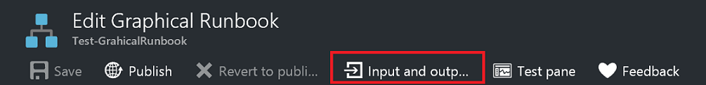
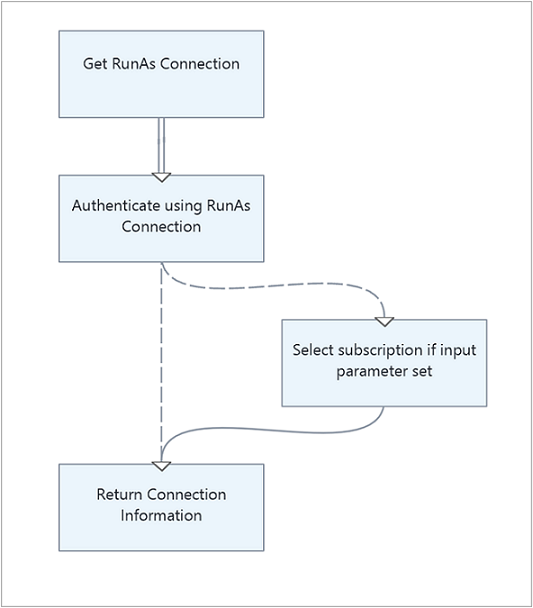
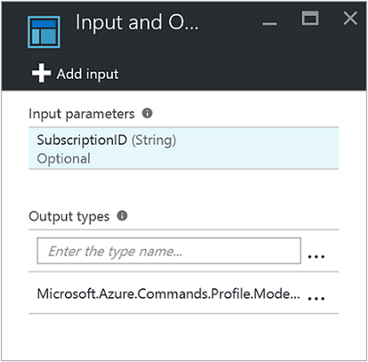
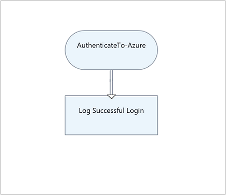
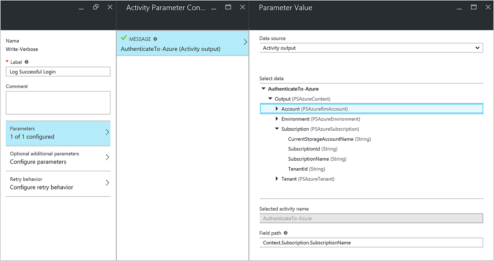
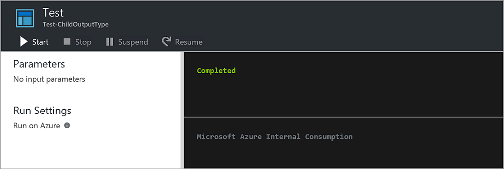
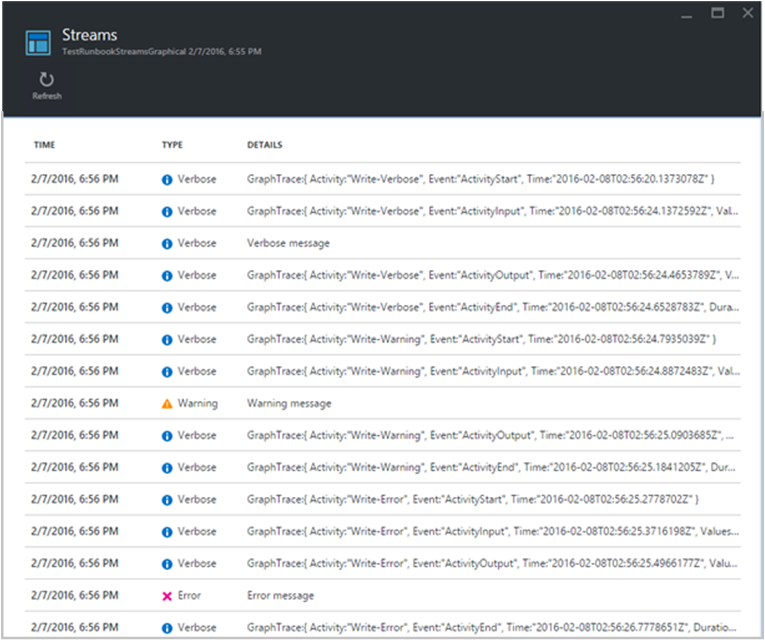
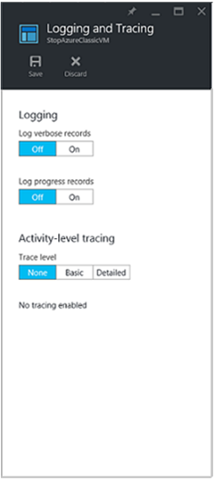

<properties
   pageTitle="Runbooks Ausgabe und Nachrichten in Azure Automatisierung | Microsoft Azure"
   description="Werden folgende Vorgänge zum Erstellen und Abrufen und den Fehlerinformationen von Runbooks in Azure Automatisierung Nachrichten."
   services="automation"
   documentationCenter=""
   authors="mgoedtel"
   manager="jwhit"
   editor="tysonn" />
<tags
   ms.service="automation"
   ms.devlang="na"
   ms.topic="article"
   ms.tgt_pltfrm="na"
   ms.workload="infrastructure-services"
   ms.date="08/24/2016"
   ms.author="magoedte;bwren" />

# Runbooks Ausgabe und Nachrichten in Azure Automatisierung

Die meisten Azure Automatisierung Runbooks haben einige Formular Ausgabe wie eine Fehlermeldung angezeigt, die dem Benutzer oder ein komplexes Objekt von einem anderen Workflow verwendet werden soll. Windows PowerShell bietet [mehrere Streams](http://blogs.technet.com/heyscriptingguy/archive/2014/03/30/understanding-streams-redirection-and-write-host-in-powershell.aspx) zur Ausgabe eines Skripts oder Workflows senden. Azure Automatisierung funktioniert mit jeder dieser Streams anders, und befolgen Sie bewährte Methoden für die einzelnen verwenden, wenn Sie einer Runbooks erstellen.

Die folgende Tabelle enthält eine kurze Beschreibung der einzelnen Streams und deren Verhalten im Verwaltungsportal Azure beim Ausführen einer veröffentlichten Runbooks und wenn [ein Runbooks testen](automation-testing-runbook.md). In den folgenden Abschnitten werden weitere Details zu einzelnen Stream bereitgestellt.

| Stream | Beschreibung | Veröffentlicht | Test|
|:---|:---|:---|:---|
|Die Ausgabe|Objekte, die von anderen Runbooks verwendet werden soll.|In der Historie geschrieben werden.|Im Ausgabebereich Test angezeigt.|
|Warnung|Warnmeldung für den Benutzer bestimmte.|In der Historie geschrieben werden.|Im Ausgabebereich Test angezeigt.|
|Fehler|Fehlermeldung für den Benutzer bestimmte. Im Gegensatz zu einer Ausnahme weiterhin des Runbooks standardmäßig nach eine Fehlermeldung angezeigt.|In der Historie geschrieben werden.|Im Ausgabebereich Test angezeigt.|
|Ausführliche|Nachrichten, die allgemeine oder Debuggen Informationen.|Auf Historie nur geschrieben, wenn ausführlicher Protokollierung für des Runbooks aktiviert ist.|Im Test Ausgabebereich nur angezeigt, wenn $VerbosePreference auf Continue in des Runbooks festgelegt ist.|
|Fortschritt|Datensätze, die automatisch generierte vor und nach jeder Aktivität in des Runbooks. Des Runbooks sollten nicht versuchen, eine eigene Fortschritt Datensätze zu erstellen, da diese für ein interaktiver Benutzer vorgesehen sind.|Geschrieben auf Historie nur, wenn Sie den Fortschritt Protokollierung für des Runbooks aktiviert ist.|Im Ausgabebereich Test nicht angezeigt.|
|Debuggen|Nachrichten, die einem interaktiven Benutzer gerichtet sind. Sollte nicht in Runbooks verwendet werden.|Nicht in Historie geschrieben.|Nicht in Test Ausgabebereich geschrieben.|

## Die Ausgabestream

Der Ausgabestream richtet sich Ausgabe von Objekten durch ein Skript oder ein Workflow erstellt wird, wenn sie ordnungsgemäß funktioniert. In Azure Automatisierung wird dieser Stream hauptsächlich für Objekte, die von der [übergeordneten Runbooks, die das aktuelle Runbooks anrufen,](automation-child-runbooks.md)verwendet werden soll. Wenn liefert Sie von einer übergeordneten Runbooks [Anrufen eine Runbooks Inline](automation-child-runbooks.md#InlineExecution) , Daten aus dem Ausgabestream an das übergeordnete Element. Sie sollten nur den Ausgabestream verwenden, kommunizieren Sie allgemeine Informationen an den Benutzer aus, wenn Sie wissen, dass die Runbooks nie durch ein anderes Runbooks aufgerufen werden kann. Als bewährte Methode sollte jedoch normalerweise [ausführlichen Stream](#Verbose) verwendet zur Kommunikation allgemeine Informationen für den Benutzer.

Sie können Daten in der Ausgabestream [Schreiben-Ausgabe](http://technet.microsoft.com/library/hh849921.aspx) verwenden oder indem Sie das Objekt auf eine eigene Zeile in der Runbooks platzieren schreiben.

    #The following lines both write an object to the output stream.
    Write-Output –InputObject $object
    $object

### Die Ausgabe einer Funktion

Wenn Sie in der Ausgabestream in einer Funktion, die in Ihrem Runbooks enthalten ist schreiben, wird die Ausgabe an des Runbooks zurückgegeben. Wenn des Runbooks die Ausgabe einer Variablen zuordnet, wird es nicht in der Ausgabestream geschrieben. Das Schreiben in alle anderen Streams aus innerhalb der Funktion wird in den entsprechenden Stream für des Runbooks geschrieben werden.

Erwägen Sie das folgende Beispiel Runbooks.

    Workflow Test-Runbook
    {
        Write-Verbose "Verbose outside of function" -Verbose
        Write-Output "Output outside of function"
        $functionOutput = Test-Function
        $functionOutput

    Function Test-Function
     {
        Write-Verbose "Verbose inside of function" -Verbose
        Write-Output "Output inside of function"
      }
    }

Der Ausgabestream für das Projekt Runbooks wäre:

    Output inside of function
    Output outside of function

Ausführliche Streams für das Projekt Runbooks wäre:

    Verbose outside of function
    Verbose inside of function

Nachdem Sie die Runbooks veröffentlicht haben und vor dem start auch schalten Sie ausführliche Protokollierung in den Einstellungen Runbooks, um die ausführliche Streamausgabe erhalten.

### Deklarieren Ausgabe-Datentyp

Ein Workflow kann deren Ausgabe mit dem [Attribut OutputType](http://technet.microsoft.com/library/hh847785.aspx)des Datentyps angeben. Dieses Attribut hat keine Auswirkung, wenn während der Laufzeit, aber bietet einen Überblick über die Autoren Runbooks zur Entwurfszeit an der die erwarteten Ergebnis des Runbooks. Während der Satz von Tools zum Runbooks wächst ständig, wird die Wichtigkeit einer Ausgabedatentypen zur Entwurfszeit deklarieren in Wichtigkeit erhöhen. Daher ist es eine bewährte Methode, diese Deklaration in einem beliebigen Runbooks aufnehmen möchten, die Sie erstellen.

Hier ist eine Liste der Beispiel Ausgabe Arten:

-   System.String
-   Int32
-   System.Collections.Hashtable
-   Microsoft.Azure.Commands.Compute.Models.PSVirtualMachine

  
Im folgenden Beispiel Runbooks gibt eine Zeichenfolgenobjekt und umfasst die Deklaration eines seinen Ausgabetyp. Wenn Ihre Runbooks ein Array eines bestimmten Typs gibt, sollten Sie immer noch den Typ im Gegensatz zu einem Array des Typs angeben.

    Workflow Test-Runbook
    {
       [OutputType([string])]

       $output = "This is some string output."
       Write-Output $output
    }

Um einen Ausgabetyp in Grapical oder grafisch PowerShell Workflow Runbooks deklarieren möchten, können Sie die **Eingabe und Ausgabe** Menüoption und geben Sie den Namen der Typ auswählen.  Es empfiehlt sich, dass Sie den vollständigen .NET Klassennamen verwenden, um leicht zu identifizieren, wenn es von einer übergeordneten Runbooks verweisen auf.  Alle Eigenschaften dieser Klasse mit den Daten in der Runbooks verfügbar gemacht werden, und bietet viele Flexibilität, wenn sie für bedingte Logik, Protokollierung und als Werte für andere Aktivitäten in des Runbooks verweisen auf verwenden.  

Im folgenden Beispiel haben wir zwei grafisch Runbooks, um dieses Feature zu veranschaulichen.  Wenn wir das modulare Runbooks Entwurfsmodell anwenden möchten, müssen wir eine Runbooks, die als die *Authentifizierung Runbooks Vorlage* dient Verwalten der Authentifizierung mit Azure mithilfe des Kontos ausführen als aus.  Unsere zweite Runbooks, mit denen sich normalerweise die grundlegende Logik zum Automatisieren eines bestimmten Szenarios ausführen möchten, ist in diesem Fall zum Ausführen der *Authentifizierung Runbooks Vorlage* und Anzeigen der Ergebnisse an Ihre Ausgabebereich **Test** gezeigt.  Klicken Sie unter normalen Umständen müssten wir diese Runbooks Aktionen für eine Ressource, die das Ergebnis aus der untergeordneten Runbooks Nutzung vornehmen.    

Hier sind die grundlegende Logik der des Runbooks **Azure-AuthenticateTo** aus.  .  

Er enthält den Ausgabetyp *Microsoft.Azure.Commands.Profile.Models.PSAzureContext*, das die Authentifizierung Profileigenschaften zurückgibt.   

Diese Runbooks recht einfach ist, gibt aber es eine Konfigurationselement an dieser Stelle ab.  Die letzte Aktivität mit dem **Schreiben-Ausgabe** -Cmdlet ausgeführt wird und schreibt die Profildaten in einer $_-Variable mit einem PowerShell-Ausdruck für den Parameter **Eingabeobjekt** , der für das Cmdlet erforderlich ist.  

Für die zweite Runbooks in diesem Beispiel, mit dem Namen *Test-ChildOutputType*verfügen wir einfach zwei Aktivitäten.   

Die erste Aktivität ruft des Runbooks **Azure-AuthenticateTo** und die zweite Aktivität mit dem **Schreiben ausführlichen** Cmdlet mit der **Datenquelle** der **Ausgabe Aktivität** ausgeführt wird und der Wert für das **Feldpfad** ist **Context.Subscription.SubscriptionName**, die die Ausgabe des Runbooks **AuthenticateTo Azure** Kontext angeben, wird.      

Die Ausgabe ist der Name des Abonnements.  

Eine Notiz über das Verhalten des Steuerelements Ausgabetyp.  Wenn Sie einen Wert im Feld Typ "Ausgabe" auf das Eingabe- und Eigenschaften Blade eingeben, müssen Sie außerhalb des Steuerelements klicken Sie auf nach der Eingabe, in der Reihenfolge für die Eingabe, um die vom Steuerelement erkannt werden.  

## Nachricht streams

Im Gegensatz zu den Ausgabestream dienen Nachricht Streams kommunizieren von Informationen für den Benutzer. Es gibt mehrere Nachricht Streams für unterschiedliche Arten von Information, und jeder Azure Automatisierung anders gehandhabt wird.

### Warnung und Fehler streams

Die Streams Warnung und Fehler bei der Anmeldung Probleme, die auftreten einer Runbooks beim dienen. Sie werden in der Historie geschrieben, wenn eine Runbooks ausgeführt wird und bei einer Runbooks getestet wird im Ausgabebereich Test im Verwaltungsportal Azure enthalten sind. Standardmäßig wird des Runbooks fortgesetzt werden, nachdem eine Warnung oder ein Fehler. Sie können angeben, dass des Runbooks auf eine Warnung oder ein Fehler angehalten werden soll, durch eine [Einstellung Variable](#PreferenceVariables) im des Runbooks festlegen, bevor Sie die Nachricht erstellen. Angenommen, damit eine Runbooks, klicken Sie auf ein Fehler anzuhalten, als würde eine Ausnahme, richten Sie **$ErrorActionPreference** zu beenden.

Erstellen Sie eine Warnung oder Fehlermeldung an, die mit dem [Schreiben-Warnung](https://technet.microsoft.com/library/hh849931.aspx) oder [Schreibfehler](http://technet.microsoft.com/library/hh849962.aspx) Cmdlet. Aktivitäten möglicherweise auch auf diese Streams geschrieben werden.

    #The following lines create a warning message and then an error message that will suspend the runbook.

    $ErrorActionPreference = "Stop"
    Write-Warning –Message "This is a warning message."
    Write-Error –Message "This is an error message that will stop the runbook because of the preference variable."

### Ausführliche stream

Die ausführliche Streams ist für allgemeine Informationen zum Vorgang Runbooks. Da das [Debuggen Stream](#Debug) nicht in einem Runbooks verfügbar ist, sollte die ausführliche Meldungen Debuggen Informationen verwendet werden. Standardmäßig werden veröffentlichten Runbooks ausführliche Nachrichten nicht in der Historie gespeichert werden. Konfigurieren Sie veröffentlichten Runbooks zu ausführlichen Protokolldatensätze wenn ausführliche Nachrichten speichern möchten, klicken Sie auf der Registerkarte Konfigurieren des Runbooks im Verwaltungsportal Azure. In den meisten Fällen sollten Sie die Standardeinstellung der Protokollierung nicht ausführlichen Einträge für eine Runbooks aus Gründen der Leistungsfähigkeit behalten. Aktivieren Sie diese Option nur zu beheben oder eine Runbooks Fehler aus.

Wenn [eine Runbooks testen](automation-testing-runbook.md), ausführliche Meldungen werden nicht angezeigt, auch wenn ausführliche festgehalten des Runbooks konfiguriert ist. Wenn ausführliche Meldungen beim [Testen einer Runbooks](automation-testing-runbook.md)anzeigen möchten, müssen Sie die Variable $VerbosePreference auf Weiter festlegen. Für diese Variable festgelegt ist werden im Ausgabebereich Testen des Portals Azure ausführliche Nachrichten angezeigt.

Erstellen Sie eine ausführliche Nachricht mithilfe des Cmdlets [Schreiben ausführlichen](http://technet.microsoft.com/library/hh849951.aspx) .

    #The following line creates a verbose message.

    Write-Verbose –Message "This is a verbose message."

### Stream Debuggen

Der Debuggen Stream ist für die Verwendung mit einem interaktiven Benutzer vorgesehen und sollte nicht in Runbooks verwendet werden.

## Fortschritt Datensätze

Wenn Sie Konfigurieren einer Runbooks zum Melden des Vorgangsfortschritts Einträge (auf der Registerkarte Konfigurieren des Runbooks Azure-Portal) und dann ein Datensatz wird in der Historie geschrieben, vor und nach jeder Aktivität ausgeführt wird. In den meisten Fällen sollten Sie die Standardeinstellung der Protokollierung nicht den Fortschritt-Einträge für eine Runbooks für einen maximalen Leistung behalten. Aktivieren Sie diese Option nur zu beheben oder eine Runbooks Fehler aus. Wenn Sie eine Runbooks testen, werden Fortschritt Nachrichten nicht angezeigt, auch wenn des Runbooks Fortschritt festgehalten konfiguriert ist.

Das Cmdlet [Schreiben Bearbeitung](http://technet.microsoft.com/library/hh849902.aspx) ist ungültig in einer Runbooks, da dies für die Verwendung mit einem interaktiven Benutzer vorgesehen ist.

## Voreinstellung Variablen

Windows PowerShell wird mit [Voreinstellung Variablen](http://technet.microsoft.com/library/hh847796.aspx) bestimmt so reagieren Sie auf Daten in anderen Ausgabe Streams gesendet. Sie können diese Variablen in einer Runbooks so steuern Sie, wie er auf Daten in anderen Streams gesendet reagiert festlegen.

Die folgende Tabelle enthält die Einstellung Variablen, die in Runbooks mit ihren gültigen und Standardwerten verwendet werden können. Beachten Sie, dass diese Tabelle nur die Werte enthält, die in einer Runbooks gültig sind. Weitere Werte sind für die Einstellung Variablen bei Verwendung in Windows PowerShell außerhalb Azure Automatisierung gültig.

| Variable| Standardwert| Gültige Werte|
|:---|:---|:---|
|WarningPreference|Fortsetzen|Beenden Fortsetzen SilentlyContinue|
|ErrorActionPreference|Fortsetzen|Beenden Fortsetzen SilentlyContinue|
|VerbosePreference|SilentlyContinue|Beenden Fortsetzen SilentlyContinue|

Die folgende Tabelle enthält das Verhalten für den Variablenwerten Voreinstellung, die Runbooks gültig sind.

| Wert| Verhalten|
|:---|:---|
|Fortsetzen|Die Meldung protokolliert und setzt die Ausführung des Runbooks.|
|SilentlyContinue|Ausführung des Runbooks ohne Anmeldung die Nachricht wird fortgesetzt. Dies hat den Effekt, ignorieren Sie die Nachricht.|
|Beenden|Die Meldung protokolliert und des Runbooks ausgesetzt.|

## Abrufen von Runbooks Ausgabe und Nachrichten

### Azure-portal

Sie können die Details eines Auftrags Runbooks im Azure-Portal über die Registerkarte Aufträge einer Runbooks aus anzeigen. Zusammenfassung des Projekts werden die Eingabeparameter und der [Ausgabe-Stream](#Output) sowie allgemeine Informationen zu den Auftrag und alle Ausnahmen angezeigt, wenn sie aufgetreten sind. Der Verlauf werden Nachrichten aus dem [Ausgabestream](#Output) und [Warnung und Fehlerstreams](#WarningError) zusätzlich zu den [ausführlichen Stream](#Verbose) und [Des Vorgangsfortschritts Datensätze](#Progress) einbeziehen, sofern des Runbooks ausführlich protokollieren und des Vorgangsfortschritts Einträge konfiguriert ist.

### Windows PowerShell

In Windows PowerShell können Sie Ausgabe und Nachrichten aus einer Runbooks mithilfe des Cmdlets [Get-AzureAutomationJobOutput](https://msdn.microsoft.com/library/mt603476.aspx) abrufen. Dieses Cmdlet erfordert die ID des Projekts, und wurde ein Parameters aufgerufen, in dem Sie, welcher Stream angeben zurückzugebenden, Stream. Sie können eine aller Streams für den Auftrag zur Rückkehr angeben.

Im folgende Beispiel wird eine Stichprobe Runbooks gestartet und wartet dann, bis er abgeschlossen. Nachdem abgeschlossen ist, werden deren Ausgabestream aus den Auftrag erfasst.

    $job = Start-AzureRmAutomationRunbook -ResourceGroupName "ResourceGroup01" `
    –AutomationAccountName "MyAutomationAccount" –Name "Test-Runbook"

    $doLoop = $true
    While ($doLoop) {
       $job = Get-AzureRmAutomationJob -ResourceGroupName "ResourceGroup01" `
       –AutomationAccountName "MyAutomationAccount" -Id $job.JobId
       $status = $job.Status
       $doLoop = (($status -ne "Completed") -and ($status -ne "Failed") -and ($status -ne "Suspended") -and ($status -ne "Stopped")
    }

    Get-AzureRmAutomationJobOutput -ResourceGroupName "ResourceGroup01" `
    –AutomationAccountName "MyAutomationAccount" -Id $job.JobId –Stream Output

### Grafische Authoring

Für grafisch Runbooks steht zusätzliche Protokollierung in Form von Aktivitäten Ebene Tracing.  Es gibt zwei Ebenen der Protokollierung: Basic und Details.  Grundlegende Tracing, sehen Sie am Anfang und endet für jede Aktivität in den Runbooks sowie Informationen, die im Zusammenhang mit Aktivität Wiederholungsversuche, beispielsweise die Anzahl der versucht und die Startzeit der Aktivität.  In ausführliche Protokollierung erhalten Sie grundlegende Tracing Pluszeichen Eingabemethoden und Ausgabedaten für jede Aktivität ein.  Beachten Sie, dass aktuell die Spur Einträge geschrieben werden unter Verwendung des ausführlichen Streams, aus, damit ausführliche Protokollierung, wenn Sie die Protokollierung aktivieren aktiviert werden müssen.  Für grafisch Runbooks mit Tracing aktiviert keine Notwendigkeit zum Fortschritt Einträge nicht anmelden, da die grundlegende Tracing den gleichen Zweck erfüllt und aufschlussreichere ist besteht.

Sie können aus den oben genannten Screenshot sehen, dass beim Aktivieren ausführlich anmelden und grafisch Runbooks tracing viel mehr Informationen bei der Herstellung Auftrag Streams Ansicht verfügbar ist.  Diese zusätzliche Informationen kann für die Problembehandlung bei der Herstellung mit einer Runbooks grundlegende werden, und daher sollten nur aktiviert werden für diesen Zweck und grundsätzlich nicht.    
Die Einträge Spur können besonders zahlreichen sein.  Mit grafisch Runbooks können Sie Spur erhalten zwei bis vier Datensätze pro Aktivität, je nachdem, ob Sie Basic oder detailliert Tracing konfiguriert haben.  Es sei denn, Sie diese Informationen verfolgen des Fortschritts von einer Runbooks zur Behandlung dieses Problems benötigen, sollten Sie beibehalten Spur deaktiviert.

**Um Aktivität Ebene Protokollierung zu aktivieren, führen Sie die folgenden Schritte aus.**

 1. Öffnen Sie Ihr Konto Automatisierung im Portal Azure.

 2. Klicken Sie auf die Kachel **Runbooks** zum Öffnen der Liste von Runbooks.

 3. Klicken Sie auf das Blade Runbooks auf zum Auswählen eines grafischen Runbooks aus der Liste der Runbooks.

 4. Klicken Sie in den Einstellungen Blade für den ausgewählten Runbooks auf **Protokollierung, und zu verfolgen**.

 5. Klicken Sie auf die Protokollierung und Spur Blade klicken Log ausführliche Datensätze, Sie unter **auf** aktivieren Sie ausführliche Protokollierung und Udner Aktivität Ebene gezeichnet, ändern die Ebene Spur auf **Basis** oder **detailliert** basierend auf der Ebene der Spur Sie erforderlich. 

    

## Nächste Schritte

- Erfahren Sie mehr über Runbooks Ausführung, wie Aufträge Runbooks überwachen und andere technische Details finden Sie unter [Nachverfolgen eines Auftrags Runbooks](automation-runbook-execution.md)
- Um zu verstehen, wie entwerfen und untergeordneten Runbooks verwenden, finden Sie unter [untergeordneten Runbooks in Azure Automatisierung](automation-child-runbooks.md)
