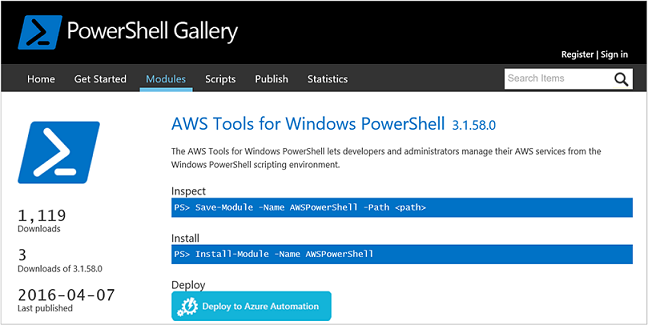
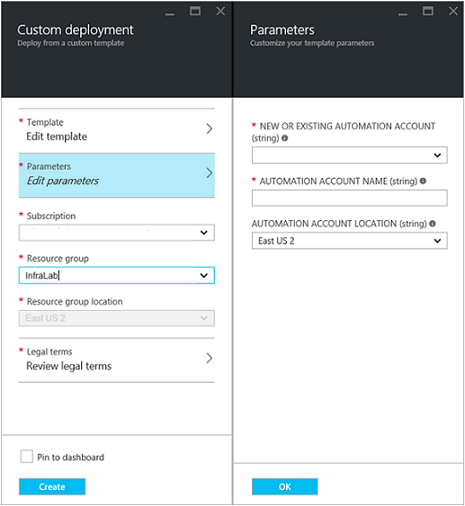
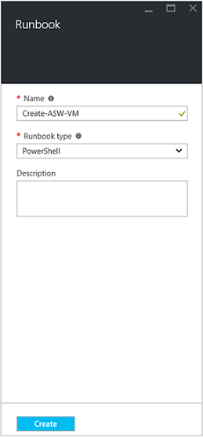
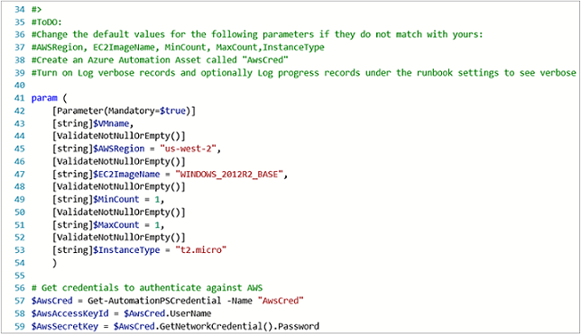
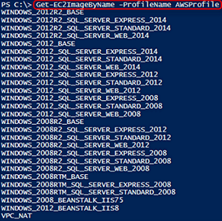
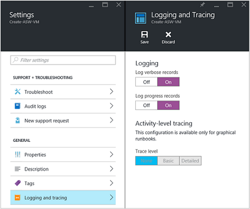
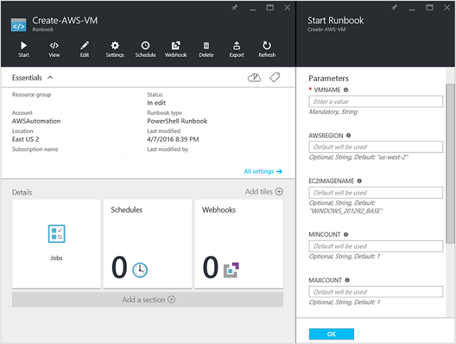
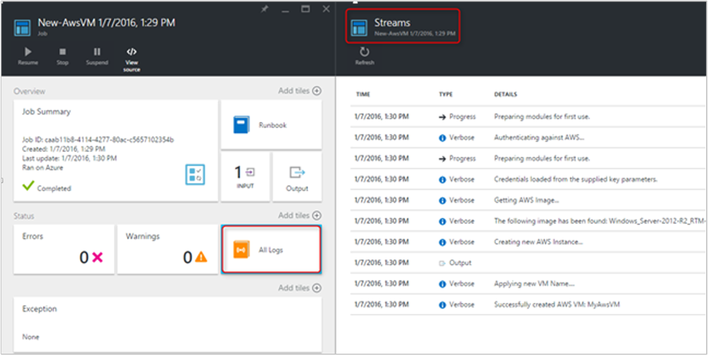
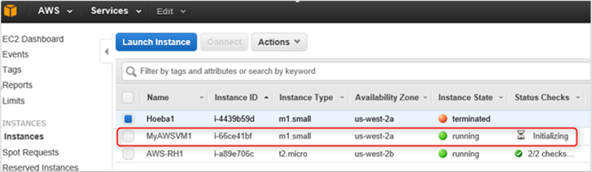

<properties
   pageTitle="Automatisierung der Bereitstellung eines virtuellen Computers in Amazon-Webdiensten | Microsoft Azure"
   description="In diesem Artikel wird veranschaulicht, wie Azure Automatisierung verwenden, um die Erstellung einer Amazon Web Service virtueller Computer automatisieren"
   services="automation"
   documentationCenter=""
   authors="mgoedtel"
   manager="jwhit"
   editor="" />
<tags
   ms.service="automation"
   ms.devlang="na"
   ms.topic="article"
   ms.tgt_pltfrm="na"
   ms.workload="na"
   ms.date="08/17/2016"
   ms.author="tiandert; bwren" />

# <a name="azure-automation-scenario---provision-an-aws-virtual-machine"></a>Azure Automatisierung Szenario - Bereitstellen einer AWS virtuellen Computern 

In diesem Artikel zeigen wir, wie Sie Azure Automatisierung zum Bereitstellen eines virtuellen Computers in Ihrem Abonnement Amazon Web Service (AWS), und benennen Sie diesen virtuellen Computer bestimmte – AWS bezieht sich auf als "tagging" aus den virtuellen Computer nutzen können.

## <a name="prerequisites"></a>Erforderliche Komponenten

Im Sinne dieses Artikels müssen Sie ein Konto Azure Automatisierung und einem AWS-Abonnement haben. Weitere Informationen zu einem Automatisierung Azure-Konto einrichten und konfigurieren, dass er mit Ihre Anmeldeinformationen ein Abonnement AWS überprüfen Sie [Authentifizierung mit Amazon-Webdiensten konfigurieren](../automation/automation-sec-configure-aws-account.md).  Dieses Konto sollte erstellt oder aktualisiert mit Ihren Anmeldeinformationen AWS Abonnement, bevor Sie fortfahren, wie wir dieses Konto in den folgenden Schritten verweisen wird werden.


## <a name="deploy-amazon-web-services-powershell-module"></a>Bereitstellen von Amazon Web Services PowerShell-Modul

Unsere virtuellen Computer Runbooks bereitgestellt wird das AWS PowerShell-Modul, um seine Arbeit erledigen nutzen. Führen Sie die folgenden Schritte aus, um das Modul bei Ihrem Konto Automatisierung hinzuzufügen, die mit Ihre Anmeldeinformationen ein Abonnement AWS konfiguriert ist.  

1. Öffnen Sie Ihren Browser, und navigieren Sie zu der [PowerShell-Katalog](http://www.powershellgallery.com/packages/AWSPowerShell/) , und klicken Sie auf die **Schaltfläche Azure Automatisierung bereitstellen**.<br> 

2. Sie werden entnommen zur Azure Anmeldeseite und nach der Authentifizierung, Azure-Portal weitergeleitet werden und werden mit dem folgenden Blade präsentiert werden.<br> 

3. Wählen Sie aus der Ressourcengruppe der **Ressourcengruppe** Dropdown-Liste, und klicken Sie auf das Parameter Blade, Angaben Sie folgende:
   * Wählen Sie aus der Dropdownliste **neue oder vorhandene Automatisierung-Konto (String)** **vorhanden**.  
   * Geben Sie im Feld **Automatisierung Kontonamen (String)** in den genauen Namen des Kontos Automatisierung, die die Anmeldeinformationen für Ihr Abonnement AWS enthält.  Wenn Sie ein spezielles Konto mit dem Namen **AWSAutomation**erstellt, beträgt beispielsweise dann, die Eingabe in das Feld ein.
   * Wählen Sie die entsprechende Region aus der Dropdownliste **Automatisierung Konto Speicherort** aus.

4. Wenn Sie die erforderliche Informationen eingeben abgeschlossen haben, klicken Sie auf **Erstellen**.

    >[AZURE.NOTE]Während der PowerShell-Modul in Azure Automatisierung importieren, es ist auch extrahieren die Cmdlets und diese Aktivitäten werden nicht angezeigt, bis das Modul importieren und extrahieren die Cmdlets vollständig eingegeben hat. Dieser Vorgang kann einige Minuten dauern.  
<br>
5. Öffnen Sie im Portal Azure Ihr in Schritt 3 erwähnten Automatisierung-Konto ein.
6. Klicken Sie auf die Kachel **Posten** und das Blade **Posten** , wählen Sie die Kachel **Module** .
7. Klicken Sie auf das Blade **Module** wird das Modul **AWSPowerShell** in der Liste angezeigt.

## <a name="create-aws-deploy-vm-runbook"></a>Erstellen von AWS Bereitstellen virtueller Computer Runbooks

Nachdem das AWS PowerShell-Modul bereitgestellt wurde, können wir nun eine Runbooks zum Automatisieren von Bereitstellung eines virtuellen Computers in AWS mithilfe eines PowerShell-Skripts verfassen. Die folgenden Schritte aus, wie systemeigene PowerShell-Skript in Azure Automatisierung nutzen wird..  

>[AZURE.NOTE] Weitere Optionen und Informationen zu diesem Skript finden Sie auf der [PowerShell-Katalog](https://www.powershellgallery.com/packages/New-AwsVM/DisplayScript).


1. Herunterladen des PowerShell-Skripts AwsVM neu aus dem Katalog PowerShell, öffnen eine Sitzung PowerShell und geben Folgendes an:<br>
   ```
   Save-Script -Name New-AwsVM -Path \<path\>
   ```
<br>
2. Öffnen Sie Ihr Konto Automatisierung Azure-Portal und klicken Sie auf die Kachel **Runbooks** .  
3. Wählen Sie aus dem Blade **Runbooks** **Hinzufügen einer Runbooks**aus.
4. Wählen Sie auf das **Hinzufügen einer Runbooks** Blade **Schnellen Erstellen** (Erstellen einer neuen Runbooks) ein.
5. Klicken Sie auf das Blade **Runbooks** Eigenschaften geben Sie einen Namen im Feld Name für Ihre Runbooks und aus dem **Typ des Runbooks** Dropdown-Listenfeld **PowerShell**wählen Sie aus, und klicken Sie dann auf **Erstellen**.<br> 
6. Wenn das Bearbeiten PowerShell Runbooks Blade angezeigt wird, kopieren Sie, und fügen Sie des PowerShell-Skripts, in den Zeichenbereich authoring Runbooks.<br> <br>

    >[AZURE.NOTE] Bitte beachten Sie Folgendes bei der Arbeit mit der PowerShell-Skript-Beispiel:
    >
    > - Des Runbooks enthält eine Anzahl von Standardwerten für Parameter. Werten Sie alle Standardwerte aus, und aktualisieren Sie gegebenenfalls.
    > - Wenn Sie Ihre Anmeldeinformationen AWS als Anmeldeinformationen Vermögenswerte mit dem Namen anders als **AWScred**gespeichert haben, müssen Sie das Skript in Zeile 57 entsprechend entsprechend zu aktualisieren.  
    > - Bei der Arbeit mit AWS CLI-Befehle in PowerShell, insbesondere mit diesem Beispiel Runbooks, müssen Sie den Bereich AWS angeben. Andernfalls tritt die Cmdlets.  AWS Thema [Angeben AWS Region](http://docs.aws.amazon.com/powershell/latest/userguide/pstools-installing-specifying-region.html) die AWS Tools für PowerShell Dokument Weitere Details anzeigen.  
<br>
7. Abrufen eine Liste von Bildnamen aus Ihrem Abonnement AWS PowerShell ISE starten, und das AWS PowerShell-Modul importieren.  Authentifizieren gegen AWS, indem Sie **Get-AutomationPSCredential** in Ihrer Umgebung ISE mit **AWScred = Get-Credential**.  Dies werden Sie aufgefordert, Ihre Anmeldeinformationen ein, und können Sie Ihre **Access-Schlüssel-ID** für das Kennwort für den Benutzernamen und das **Geheim Zugriffstaste** bereitstellen.  Siehe folgendes Beispiel:

        #Sample to get the AWS VM available images
        #Please provide the path where you have downloaded the AWS PowerShell module
        Import-Module AWSPowerShell
        $AwsRegion = "us-west-2"
        $AwsCred = Get-Credential
        $AwsAccessKeyId = $AwsCred.UserName
        $AwsSecretKey = $AwsCred.GetNetworkCredential().Password

        # Set up the environment to access AWS
        Set-AwsCredentials -AccessKey $AwsAccessKeyId -SecretKey $AwsSecretKey -StoreAs AWSProfile
        Set-DefaultAWSRegion -Region $AwsRegion

        Get-EC2ImageByName -ProfileName AWSProfile
   Die folgende Ausgabe zurückgegeben wird:<br>
     
8. Kopieren Sie und fügen Sie der ein Bild Namen in einer Automatisierungsvariablen als in des Runbooks als **$InstanceType**verwiesen wird ein. Da in diesem Beispiel wir werden mit dem kostenlosen AWS Abonnement gestuft, wir **t2.micro** für Runbooks Beispiel verwenden.
9. Speichern Sie des Runbooks, und klicken Sie auf **Veröffentlichen** des Runbooks veröffentlichen und dann auf **Ja,** Wenn Sie dazu aufgefordert werden.


### <a name="testing-the-aws-vm-runbook"></a>Testen des Runbooks AWS VM
Bevor wir Testen des Runbooks fort, müssen wir einige Dinge zu überprüfen. Insbesondere:

   -  Eine Anlage für das Authentifizieren anhand AWS bezeichnet **AWScred** erstellt wurde, oder das Skript wurde aktualisiert, um den Namen Ihrer Anmeldeinformationen Ressource verweisen.  
   -  Das AWS PowerShell-Modul wurde in Azure Automatisierung importiert
   -  Eine neue Runbooks eingerichtet wurde und Parameterwerte überprüft und bei Bedarf aktualisiert wurden
   -  **Ausführliche Protokolldatensätze** und optional **den Fortschritt Protokolldatensätze** unter des Runbooks festlegen **Protokollierung und Tracing** wurden zu **im**festgelegt.<br> 

1. Wir möchten Starten des Runbooks, also klicken Sie auf **Start** , und klicken Sie dann auf **OK** , wenn das Starten Runbooks Blade wird geöffnet.
2. Stellen Sie auf das Blade Runbooks beginnen eine **VMname**aus.  Übernehmen Sie die Standardwerte für die anderen Parameter, die Sie zuvor im Skript vorkonfiguriert.  Klicken Sie auf **OK** , um den Auftrag Runbooks zu starten.<br> 
3. Klicken Sie im Bereich Auftrag wird für das Projekt Runbooks geöffnet, die wir gerade erstellt haben. In diesem Bereich zu schließen.
4. Wir können den Fortschritt des Projekts anzeigen und Ansicht ausgeben **Streams** , indem Sie die Kachel **Alle Protokolle** aus dem Runbooks Auftrag Blade auswählen.<br> 
5. Um zu bestätigen, dass der virtuellen Computer bereitgestellt wird, melden Sie sich bei der AWS-Verwaltungskonsole, wenn Sie derzeit nicht angemeldet sind.<br> 

## <a name="next-steps"></a>Nächste Schritte
-   Um mit grafisch Runbooks anzufangen, finden Sie unter [Meine erste grafisch Runbooks](automation-first-runbook-graphical.md)
-   Um mit PowerShell Workflow Runbooks anzufangen, finden Sie unter [Meine erste PowerShell Workflow Runbooks](automation-first-runbook-textual.md)
-   Weitere Informationen zu Datentypen Runbooks, deren vor- und Nachteile zu erhalten, finden Sie unter [Azure Automatisierung Runbooks Typen](automation-runbook-types.md)
-   Weitere Informationen zu PowerShell-Skript unterstützen Sie Feature, finden Sie unter [Native PowerShell-Skript in Azure-Automatisierung unterstützt](https://azure.microsoft.com/blog/announcing-powershell-script-support-azure-automation-2/)
