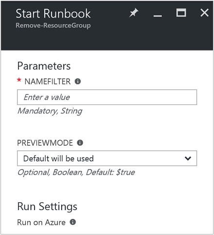
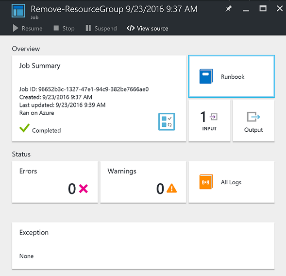
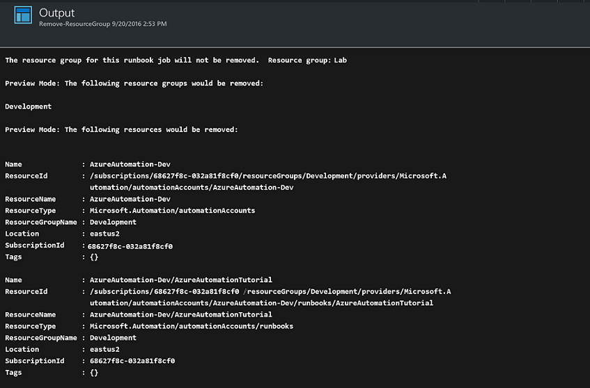

<properties
    pageTitle="Entfernen von Ressourcengruppen automatisieren | Microsoft Azure"
    description="PowerShell Workflowversion für ein Azure Automatisierung Szenario einschließlich Runbooks, um alle Ressourcengruppen in Ihrem Abonnement entfernen."
    services="automation"
    documentationCenter=""
    authors="MGoedtel"
    manager="jwhit"
    editor=""
    />
<tags
    ms.service="automation"
    ms.workload="tbd"
    ms.tgt_pltfrm="na"
    ms.devlang="na"
    ms.topic="get-started-article"
    ms.date="09/26/2016"
    ms.author="magoedte"/>

# Azure Automatisierung Szenario - automatisieren freistellen Ressource Gruppen

Viele Kunden erstellen mehrere Ressourcengruppe. Einige möglicherweise für die Verwaltung von Applications Herstellung verwendet werden, und andere möglicherweise als Entwicklung, testen und staging-Umgebungen verwendet werden. Automatisieren der Bereitstellung dieser Ressourcen ist eine Sache, aber die Möglichkeit zu eine Ressourcengruppe durch Klicken auf die Schaltfläche x ist ein anderes. Sie können diese allgemeine Management-Aufgabe mithilfe von Azure Automatisierung optimieren. Dies ist hilfreich, wenn Sie mit einem Azure-Abonnement arbeiten, die bis ein Mitglied Angebot wie MSDN- oder der Microsoft Partner Network Cloud Essentials-Programm Ausgaben maximal verfügt.

Dieses Szenario basiert auf einer PowerShell Runbooks und dient dazu, eine oder mehrere Ressourcengruppen zu entfernen, die Sie aus Ihrem Abonnement angeben. Die Standardeinstellung der des Runbooks ist testen, bevor Sie fortfahren. Dadurch wird sichergestellt, dass die Ressourcengruppe versehentlich löschen nicht, bevor Sie dieses Verfahren ausführen möchten.   

## Erste das Szenario

Dieses Szenario besteht aus einer PowerShell Runbooks, die Sie aus dem [Katalog PowerShell](https://www.powershellgallery.com/packages/Remove-ResourceGroup/1.0/DisplayScript)herunterladen können. Sie können auch direkt aus dem [Katalog Runbooks](automation-runbook-gallery.md) Azure-Portal importieren.  

Runbooks | Beschreibung|
----------|------------|
Entfernen-ResourceGroup | Entfernt eine oder mehrere Azure Ressourcengruppen und die zugeordneten Ressourcen aus dem Abonnement.  
 
Die folgenden Eingabeparameter sind für diese Runbooks definiert:

Parameter | Beschreibung|
----------|------------|
NameFilter (erforderlich) | Gibt einen Namensfilter, um die Ressourcengruppen zu beschränken, die Sie löschen möchten. Sie können mehrere Werte mithilfe einer durch Trennzeichen getrennte Liste übergeben. Der Filter wird nicht beachtet und entspricht einer beliebigen Ressourcengruppe, die Zeichenfolge enthält.|
PreviewMode (Optional) | H. des Runbooks, um anzuzeigen, welche Ressourcengruppen gelöscht, aber keine Aktion. Die Standardeinstellung ist **Wahr** um unbeabsichtigtes Löschen von einer oder mehreren Ressourcengruppen an des Runbooks übergeben zu vermeiden.  

## Installieren Sie und konfigurieren Sie dieses Szenario

### Erforderliche Komponenten

Diese Runbooks authentifiziert [Azure ausführen als Konto](automation-sec-configure-azure-runas-account.md).    

### Installieren und Veröffentlichen der runbooks

Nachdem Sie die Runbooks heruntergeladen haben, können Sie es mithilfe der Prozedur im [Importieren Runbooks Verfahren](automation-creating-importing-runbook.md#importing-a-runbook-from-a-file-into-Azure-Automation)importieren. Veröffentlichen des Runbooks, nachdem sie in Ihr Konto Automatisierung erfolgreich importiert wurde.

## Verwenden des Runbooks

Die folgenden Schritte führen Sie durch die Ausführung dieser Runbooks und helfen Ihnen, die Sie mit der Funktionsweise vertraut. Sie werden nur des Runbooks in diesem Beispiel testen werden nicht tatsächlich Löschen der Ressourcengruppe.  

1. Öffnen Sie Ihr Konto Automatisierung und **Runbooks**klicken Sie auf des Azure-Portals.
2. Wählen Sie die **Entfernen-ResourceGroup** Runbooks aus, und klicken Sie auf **Start**.
3. Beim Starten des Runbooks, öffnet das Blade **Runbooks starten** und Sie können die Parameter konfigurieren. Geben Sie die Namen der Ressourcengruppen in Ihrem Abonnement können Sie zum Testen und werden keine Schaden verursachen, wenn Sie versehentlich gelöscht.  

    >[AZURE.NOTE] Stellen Sie sicher, dass **Previewmode** auf **true** festgelegt ist, um zu vermeiden, löschen die ausgewählte Ressourcengruppen.  **Beachten Sie** , dass diese Runbooks die Ressourcengruppe nicht entfernen, die Automatisierung Konto enthält, das diese Runbooks ausgeführt wird.  

4. Nachdem Sie alle den Parameter konfiguriert haben Werte, klicken Sie auf **OK**, und des Runbooks für die Ausführung von Warteschlange möglich wird.  

Um die Details des Auftrags Runbooks **Entfernen-ResourceGroup** Azure-Portal anzeigen möchten, wählen Sie in der Runbooks **Einzelvorgänge** . Der Auftrag Zusammenfassung zeigt die Eingabeparameter und der Ausgabestream sowie allgemeine Informationen zu den Auftrag und alle Ausnahmen, die aufgetreten sind.  .

**Zusammenfassung der Position** enthält Nachrichten aus der Ausgabe, Warnung und Fehlerstreams. Wählen Sie **die Ausgabe** detaillierte Ergebnisse der Ausführung des Runbooks anzeigen.  

## Nächste Schritte

- Um anzufangen Erstellen eigener Runbooks, finden Sie unter [Erstellen oder Importieren einer Runbooks in Azure Automatisierung](automation-creating-importing-runbook.md).
- Um mit PowerShell Workflow Runbooks anzufangen, finden Sie unter [Meine erste PowerShell Workflow Runbooks](automation-first-runbook-textual.md).
