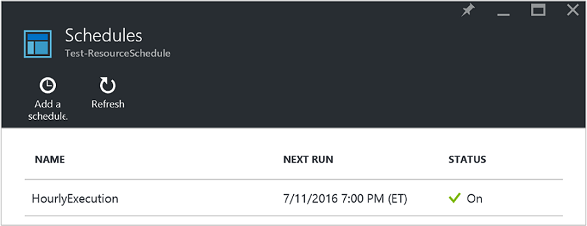
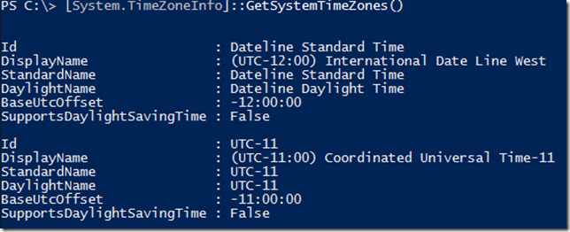
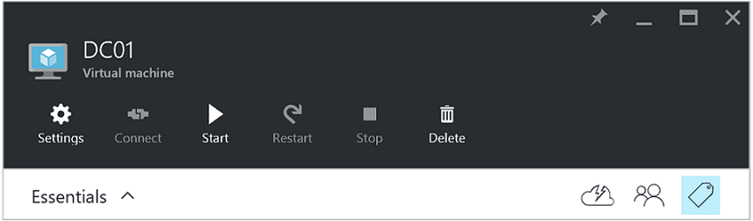
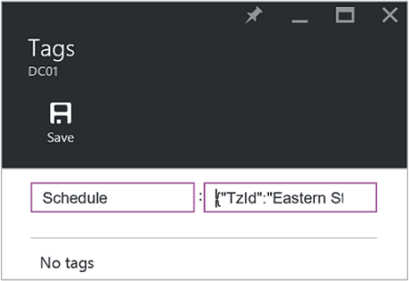
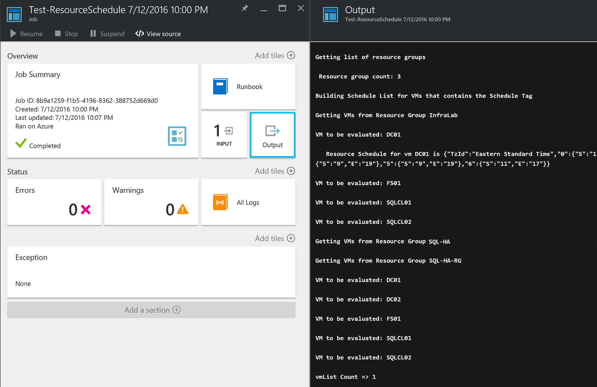

<properties
   pageTitle="Verwenden zum Erstellen eines Zeitplans für Azure-virtuellen Computer beim Starten und beenden JSON-formatierte Kategorien | Microsoft Azure"
   description="In diesem Artikel veranschaulicht, wie JSON-Zeichenfolgen auf Kategorien um zu automatisieren, die Planung des virtuellen Computer beim Starten und beenden."
   services="automation"
   documentationCenter=""
   authors="MGoedtel"
   manager="jwhit"
   editor="tysonn" />
<tags
   ms.service="automation"
   ms.devlang="na"
   ms.topic="article"
   ms.tgt_pltfrm="na"
   ms.workload="infrastructure-services"
   ms.date="07/18/2016"
   ms.author="magoedte;paulomarquesc" />

# Azure Automatisierung Szenario: Verwenden von Kategorien JSON-formatierte zum Erstellen eines Zeitplans für Azure-virtuellen Computer beim Starten und beenden

Kunden möchten häufig planen, das Starten und Beenden von virtuellen Computern, mit deren Hilfe Abonnements senken oder geschäftlichen und technischen Belangen unterstützen.  

Das folgende Szenario ermöglicht es Ihnen zum Einrichten von automatischen Starten und Beenden von Ihrer virtuellen Computer mithilfe einer Kategorie Terminplan auf einer Ressource Gruppenebene oder virtuellen Computern in Azure bezeichnet. Dieser Zeitplan kann mit einem Startzeit und die Endzeit von Sonntag-Samstag konfiguriert sein.  

Wir haben einige Out-of-Box-Optionen. Hierzu gehören:
-  [Virtuellen Computern Maßstab legt fest](../virtual-machine-scale-sets/virtual-machine-scale-sets-overview.md) , mit Einstellungen automatisch skalieren, mit die Sie vergrößern oder skalieren können.
- [DevTest Labs](../devtest-lab/devtest-lab-overview.md) -Dienst, der weist integrierte Funktion zum Planen von beim Starten und beenden.

Diese Optionen unterstützen jedoch nur bestimmte Szenarien und kann nicht auf Infrastructure-as-a-Service (IaaS) virtuellen Computern angewendet werden.   

Wenn die Kategorie Terminplan einer Ressourcengruppe angewendet wird, ist es auch auf allen virtuellen Computern innerhalb dieser Ressourcengruppe angewendet. Wenn Sie ein Zeitplan auch direkt auf einen virtuellen angewendet wird, hat der letzte Terminplan Vorrang in der folgenden Reihenfolge aus:

1.  Planen einer Ressourcengruppe angewendet
2.  Planen einer Ressourcengruppe und virtuellen Computern in der Ressourcengruppe angewendet
3.  Planen eines virtuellen Computers angewendet

Dieses Szenario im Wesentlichen verwendet eine JSON-Zeichenfolge mit einem angegebenen Format und fügt es als Wert für eine Kategorie Terminplan bezeichnet. Klicken Sie dann eine Runbooks aufgeführt, alle Ressourcengruppen und virtuellen Computern und die Zeitpläne für jeden virtuellen Computer basierend auf den oben aufgeführten Szenarien. Als Nächstes werden durchläuft den virtuellen Computern, die Zeitpläne angefügt aufweisen und wertet, welche Aktion ausgeführt werden soll. Beispielsweise bestimmt die virtuellen Computern beendet, fahren oder ignoriert werden müssen.

Diese Runbooks Authentifizierung über das [Konto Azure ausführen als](../automation/automation-sec-configure-azure-runas-account.md).

## Herunterladen der Runbooks für das Szenario

Dieses Szenario besteht aus vier PowerShell Workflow Runbooks, die von der [TechNet-Katalog](https://gallery.technet.microsoft.com/Azure-Automation-Runbooks-84f0efc7) oder [GitHub](https://github.com/paulomarquesdacosta/azure-automation-scheduled-shutdown-and-startup) Repository für dieses Projekt heruntergeladen werden kann.

Runbooks | Beschreibung
----------|----------
Test-ResourceSchedule | Jeder virtuellen Computern Terminplan überprüft und führt war(en) oder Start je nach den Terminplan.
Hinzufügen von ResourceSchedule | Fügt die Kategorie Terminplan zu einer Gruppe virtuellen Computers oder Ressource an.
Update-ResourceSchedule | Ändert die vorhandene Terminplan Kategorie sie durch eine neue ersetzen.
Entfernen-ResourceSchedule | Entfernt die Kategorie Terminplan aus einer Gruppe virtuellen Computers oder Ressource an.

## Installieren Sie und konfigurieren Sie dieses Szenario

### Installieren und Veröffentlichen der runbooks

Nach dem Herunterladen der Runbooks, können Sie sie mithilfe des Verfahrens [Erstellen](automation-creating-importing-runbook.md#importing-a-runbook-from-a-file-into-Azure-Automation)oder Importieren einer Runbooks in Azure Automatisierung importieren.  Veröffentlichen Sie jede Runbooks, nachdem sie in Ihr Konto Automatisierung erfolgreich importiert wurde.

### Hinzufügen eines Projektplans zu des Runbooks Test-ResourceSchedule

Wie folgt vor, um den Zeitplan für die Test-ResourceSchedule Runbooks aktivieren. Hierbei handelt es sich um des Runbooks, mit dem überprüft wird, welche virtuellen Computer gestartet, fahren Sie oder unverändert werden sollte.

1. Klicken Sie im Portal Azure öffnen Sie Ihr Konto Automatisierung, und klicken Sie dann auf die Kachel **Runbooks** .
2. Klicken Sie auf das Blade **Test-ResourceSchedule** auf die Kachel **Zeitpläne** .
3. Klicken Sie auf das Blade **Zeitpläne** **hinzufügen einen Zeitplan**aus.
4. Wählen Sie in der **Zeitpläne** Blade **Link einen Zeitplan für Ihre Runbooks**aus. Wählen Sie dann **Erstellen eines neuen Projektplans**.
5.  In der **neuen Projektplan** Blade, geben Sie den Namen dieser Zeitplan, zum Beispiel: *HourlyExecution*.
6. Legen Sie für die Planung **beginnen**die Startzeit auf ein Inkrement Stunde aus.
7. Wählen Sie **Serie**aus, und wählen Sie dann für **jedes Intervall wiederholenden**, **1 Stunde**.
8. Überprüfen Sie, ob **festlegen Ablauf** auf **Nein**festgelegt ist, und klicken Sie dann auf **Erstellen** , um Ihren neuen Terminplan zu speichern.
9. Wählen Sie in den **Terminplan Runbooks** Optionen Blade **Parameter und Ausführen Einstellungen**aus. Geben Sie in das Blade Test-ResourceSchedule **Parameter** den Namen Ihres Abonnements in das Feld **SubscriptionName** ein.  Dies ist der einzige Parameter, der für die Runbooks erforderlich ist.  Wenn Sie fertig sind, klicken Sie auf **OK**.  

Zeitplan Runbooks sollte wie folgt aussehen, wenn sie erledigt ist:

 

## Formatieren Sie die JSON-Zeichenfolge

Diese Lösung bezeichnet im Wesentlichen hat eine JSON-Zeichenfolge mit einem bestimmten Format und fügt es als Wert für eine Kategorie Terminplan. Klicken Sie dann eine Runbooks aufgeführt, alle Ressourcengruppen und virtuellen Computern und die Zeitpläne für jeden virtuellen Computer.

Des Runbooks durchlaufen, die den virtuellen Computern, die Zeitpläne angefügt haben und überprüft wird, welche Aktionen ausgeführt werden soll. Im folgenden finden ein Beispiel für wie die Lösungen formatiert werden sollen:

    {
       "TzId": "Eastern Standard Time",
        "0": {  
           "S": "11",
           "E": "17"
        },
        "1": {
           "S": "9",
           "E": "19"
        },
        "2": {
           "S": "9",
           "E": "19"
        },
    }

Hier sind einige ausführliche Informationen zu dieser Struktur ein:

1. Das Format der JSON-Struktur ist die 256 Zeichen bestehende Einschränkung eines einzigen Kennzeichens Werts in Azure umgehen optimiert.

2. *TZID-Wert* darstellt die Zeitzone des virtuellen Computers. Diese ID abgerufen werden kann, mithilfe der Klasse TimeZoneInfo .NET in eine Sitzung PowerShell -**[System.TimeZoneInfo]:: GetSystemTimeZones()**.

    

    - Wochentage werden mit einem numerischen Wert 0 (null) bis 6 dargestellt. Der Wert 0 (null) ist gleich Sonntag.
    - Die Startzeit wird mit dem Attribut **S** dargestellt, und deren Wert wird in einem 24-Stunden-Format.
    - Die Uhrzeit Ende oder war(en) wird mit dem Attribut **E** dargestellt, und deren Wert wird in einem 24-Stunden-Format.

    Wenn die Attribute **S** und **E** jeweils einen Wert von 0 (null) haben, des virtuellen Computers im präsentieren Zustand zum Zeitpunkt der Auswertung verbleibt.   

3. Wenn Sie eine Bewertung für einen bestimmten Tag der Woche überspringen möchten, fügen Sie keinen Abschnitt für den Tag der Woche hinzu. Im folgenden Beispiel wird nur Montag ausgewertet, und die anderen Wochentage werden ignoriert:

        {
          "TzId": "Eastern Standard Time",
           "1": {
             "S": "11",
             "E": "17"
           }
        }

## Kategorie Ressourcengruppen oder virtuellen Computern

Um virtuelle Computer zu beenden, müssen Sie markieren entweder den virtuellen Computern oder die Ressourcengruppen, in denen sie sich befinden. Virtuellen Computern, die eine Kategorie Terminplan besitzen, werden nicht ausgewertet. Daher werden nicht diese gestartet oder beendet.

Es gibt zwei Verfahren zum Kategorisieren Ressourcengruppen oder virtuellen Computern mit dieser Lösung. Sie können es direkt aus dem Portal ausführen. Oder Sie können der hinzufügen-ResourceSchedule, Update-ResourceSchedule und Runbooks entfernen-ResourceSchedule verwenden.

### Über das Portal kategorisieren

Wie folgt vor, um einen virtuellen Computer oder Ressourcengruppe im Portal kategorisieren:

1. Reduzieren der JSON-Zeichenfolge, und stellen Sie sicher, dass es keine Leerzeichen.  Die JSON-Zeichenfolge sollte wie folgt aussehen:

        {"TzId":"Eastern Standard Time","0":{"S":"11","E":"17"},"1":{"S":"9","E":"19"},"2": {"S":"9","E":"19"},"3":{"S":"9","E":"19"},"4":{"S":"9","E":"19"},"5":{"S":"9","E":"19"},"6":{"S":"11","E":"17"}}

2. Wählen Sie aus dem Symbol **Kategorie** für eine Gruppe virtuellen Computers oder Ressourcen zum Anwenden dieser Zeitplan.

    
3. Kategorien werden die folgenden Schlüssel/Wert-Paar definiert. Geben Sie im Feld **Schlüssel** **Terminplan** ein, und fügen Sie die JSON-Zeichenfolge in das Feld **Wert** . Klicken Sie auf **Speichern**. Ihre neue Kategorie sollte jetzt in der Liste der Kategorien für die Ressource angezeigt werden.

### Kategorisieren von PowerShell

Alle importierten Runbooks enthalten Hilfeinformationen am Anfang des Skripts, das beschreibt, wie die Runbooks direkt von PowerShell ausgeführt. Sie können die Runbooks-ScheduleResource hinzufügen und aktualisieren-ScheduleResource von PowerShell aufrufen. Dazu erforderlichen Parameter, mit denen Sie zum Erstellen oder aktualisieren die Kategorie Terminplan einer Gruppe virtuellen Computers oder Ressource außerhalb des Portals übergeben.  

Zum Erstellen, hinzufügen und Löschen von Tags über PowerShell, müssen Sie zunächst [Ihre PowerShell-Umgebung für Azure einrichten](../powershell-install-configure.md). Nachdem Sie die Einrichtung abgeschlossen haben, können Sie mit den folgenden Schritten fortfahren.

### Erstellen einer Kategorie Terminplan mit PowerShell

1. Öffnen Sie eine PowerShell-Sitzung ein. Verwenden Sie dann im folgenden Beispiel wird ein, um mit Ihrem Konto ausführen als authentifiziert und ein Abonnement anzugeben:   

        Conn = Get-AutomationConnection -Name AzureRunAsConnection
        Add-AzureRMAccount -ServicePrincipal -Tenant $Conn.TenantID `
        -ApplicationId $Conn.ApplicationID -CertificateThumbprint $Conn.CertificateThumbprint
        Select-AzureRmSubscription -SubscriptionName "MySubscription"

2. Definieren einer Tabelle Terminplan. Hier ist ein Beispiel für wie diese erstellt werden soll:

        $schedule= @{ "TzId"="Eastern Standard Time"; "0"= @{"S"="11";"E"="17"};"1"= @{"S"="9";"E"="19"};"2"= @{"S"="9";"E"="19"};"3"= @{"S"="9";"E"="19"};"4"= @{"S"="9";"E"="19"};"5"= @{"S"="9";"E"="19"};"6"= @{"S"="11";"E"="17"}}

3. Legen Sie die Parameter, die durch die Runbooks erforderlich sind. Im folgenden Beispiel werden wir ein virtuellen Computers verwendet:

        $params = @{"SubscriptionName"="MySubscription";"ResourceGroupName"="ResourceGroup01"; `
        "VmName"="VM01";"Schedule"=$schedule}

    Wenn Sie eine Ressourcengruppe kategorisieren sind, entfernen Sie den Parameter *VMName* aus der Tabelle $params wie folgt:

        $params = @{"SubscriptionName"="MySubscription";"ResourceGroupName"="ResourceGroup01"; `
        "Schedule"=$schedule}

4. Ausführen des Runbooks hinzufügen-ResourceSchedule mit den folgenden Parametern, um die Kategorie Terminplan zu erstellen:

        Start-AzureRmAutomationRunbook -Name "Add-ResourceSchedule" -Parameters $params `
        -AutomationAccountName "AutomationAccount" -ResourceGroupName "ResourceGroup01"

5. Führen Sie zum Aktualisieren einer Ressourcengruppe oder virtuellen Computern Tag des Runbooks **Update-ResourceSchedule** mit den folgenden Parametern aus:

        Start-AzureRmAutomationRunbook -Name "Update-ResourceSchedule" -Parameters $params `
        -AutomationAccountName "AutomationAccount" -ResourceGroupName "ResourceGroup01"

### Entfernen einer Kategorie Terminplan mit PowerShell

1. Öffnen Sie eine Sitzung PowerShell, und führen Sie Folgendes mit Ihrem Konto ausführen als authentifizieren und um auszuwählen, und geben Sie ein Abonnement:

        Conn = Get-AutomationConnection -Name AzureRunAsConnection
        Add-AzureRMAccount -ServicePrincipal -Tenant $Conn.TenantID `
        -ApplicationId $Conn.ApplicationID -CertificateThumbprint $Conn.CertificateThumbprint
        Select-AzureRmSubscription -SubscriptionName "MySubscription"

2. Legen Sie die Parameter, die durch die Runbooks erforderlich sind. Im folgenden Beispiel werden wir ein virtuellen Computers verwendet:

        $params = @{"SubscriptionName"="MySubscription";"ResourceGroupName"="ResourceGroup01" `
        ;"VmName"="VM01"}

    Wenn Sie eine Kategorie aus einer Ressourcengruppe entfernen möchten, entfernen Sie den Parameter *VMName* aus der Tabelle $params wie folgt:

        $params = @{"SubscriptionName"="MySubscription";"ResourceGroupName"="ResourceGroup01"}

3. Ausführen des Runbooks entfernen-ResourceSchedule, um die Kategorie Terminplan zu entfernen:

        Start-AzureRmAutomationRunbook -Name "Remove-ResourceSchedule" -Parameters $params `
        -AutomationAccountName "AutomationAccount" -ResourceGroupName "ResourceGroup01"

4. Führen Sie zum Aktualisieren einer Ressourcengruppe oder virtuellen Computern Tag des Runbooks entfernen-ResourceSchedule mit den folgenden Parametern aus:

        Start-AzureRmAutomationRunbook -Name "Remove-ResourceSchedule" -Parameters $params `
        -AutomationAccountName "AutomationAccount" -ResourceGroupName "ResourceGroup01"

>[AZURE.NOTE] Wir empfehlen, dass Sie die vorausschauende diese Runbooks (und den virtuellen Computern Staaten), um sicherzustellen, dass Ihre virtuellen Computern beendet werden nach unten überwachen und entsprechend gestartet.  

Wählen Sie die Kachel **Aufträge** von des Runbooks aus, um die Details des Auftrags Runbooks Test-ResourceSchedule Azure-Portal anzuzeigen. Der Auftrag Zusammenfassung zeigt den Eingabeparameter und das Ausgabestream sowie allgemeine Informationen zu den Auftrag und alle Ausnahmen, wenn sie aufgetreten sind.  

**Zusammenfassung der Position** enthält Nachrichten aus der Ausgabe, Warnung und Fehlerstreams. Wählen Sie die Kachel **Ausgabe** detaillierte Ergebnisse der Ausführung des Runbooks anzeigen.

  

## Nächste Schritte

-  Um mit PowerShell Workflow Runbooks anzufangen, finden Sie unter [Meine erste PowerShell Workflow Runbooks](automation-first-runbook-textual.md).
-  Weitere Informationen zu Datentypen Runbooks, und deren vor- und Nachteile finden Sie unter [Azure Automatisierung Runbooks Typen](automation-runbook-types.md).
-  Weitere Informationen zu PowerShell-Skript unterstützen Sie Features, finden Sie unter [Native PowerShell-Skript in Azure-Automatisierung unterstützt](https://azure.microsoft.com/blog/announcing-powershell-script-support-azure-automation-2/).
-  Wenn Sie weitere Informationen zur Protokollierung Runbooks und Ausgabe finden Sie unter [Runbooks Ausgabe und Nachrichten in Azure Automatisierung](automation-runbook-output-and-messages.md).
-  Erfahren Sie mehr über ein Konto Azure ausführen als und so Ihre Runbooks Authentifizierung zu verwenden, finden Sie unter [authentifizieren Runbooks mit Azure ausführen als Konto](../automation/automation-sec-configure-azure-runas-account.md).
