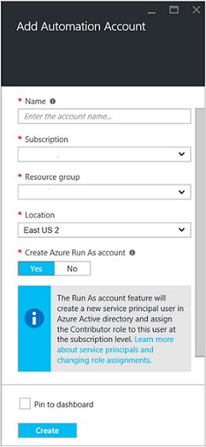
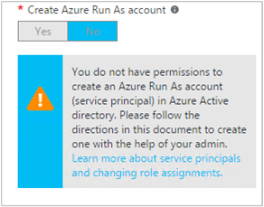

<properties
   pageTitle="Konfigurieren von Azure AD-Benutzerkonto | Microsoft Azure"
   description="Dieser Artikel beschreibt, wie Azure AD-Benutzer der Anmeldeinformationen für Runbooks Azure Automatisierung Cloud und ASM authentifizieren konfigurieren."
   services="automation"
   documentationCenter=""
   authors="MGoedtel"
   manager="jwhit"
   editor="tysonn"
   keywords="Azure-active Directory Benutzer Azure Service Verwaltung Azure Ad-Benutzerkonto" />
<tags
   ms.service="automation"
   ms.devlang="na"
   ms.topic="get-started-article"
   ms.tgt_pltfrm="na"
   ms.workload="infrastructure-services"
   ms.date="09/12/2016"
   ms.author="magoedte" />

# Authentifizieren Sie Runbooks mit Azure Servicemanagement und Ressourcenmanager

In diesem Artikel werden die Schritte beschrieben, die Sie ausführen müssen, um ein Azure AD-Benutzerkonto für Azure Automatisierung Runbooks ausführen für Azure Service Management (ASM) oder Azure Ressource-Manager (Cloud) Ressourcen zu konfigurieren.  Während dies eine Authentifizierungsidentität unterstützte für Ihre Cloud Runbooks basierend auf werden weiterhin, ist die empfohlene Methode das neue Konto Azure ausführen als verwenden.       

## Erstellen Sie einen neuen Azure Active Directory-Benutzer

1. Melden Sie sich im klassischen Azure-Portal als ein Dienstadministrator für Azure Abonnements, das Sie verwalten möchten.
2. Wählen Sie aus **Active Directory**, und wählen Sie dann auf den Namen Ihrer Organisationsverzeichnis.
3. Wählen Sie die Registerkarte **Benutzer** aus, und wählen Sie dann im Bereich Befehl **Benutzer hinzufügen**.
4. Wählen Sie auf der Seite **Teilen Sie uns zu diesem Benutzer** unter **Typ des Benutzers** **neuen Benutzer in Ihrer Organisation**ein.
5. Geben Sie einen Benutzernamen ein.  
6. Wählen Sie den Namen des Verzeichnisses, der mit Ihrem Azure-Abonnement auf der Seite Active Directory verknüpft ist.
7. Geben Sie auf der Seite **Benutzerprofil** ein vor- und Nachnamen Name, einen benutzerfreundlichen Namen und Benutzer aus der Liste **Rollen** .  Führen Sie nicht **kombinierte Authentifizierung aktivieren**.
8. Beachten Sie vollständigen Namen des Benutzers und ein temporäres Kennwort ein.
9. Wählen Sie **Einstellungen > Administratoren > Hinzufügen**.
10. Geben Sie den vollständigen Benutzernamen des Benutzers, die Sie erstellt haben.
11. Wählen Sie das Abonnement, das der Benutzer zum verwalten soll.
12. Melden Sie sich aus Azure, und melden Sie sich dann wieder mit dem Konto aus, die, das Sie soeben erstellt haben. Sie werden aufgefordert, das Kennwort des Benutzers ändern.

## Erstellen Sie ein Konto Automatisierung klassischen Azure-Portal
In diesem Abschnitt führen Sie die folgenden Schritte aus, um ein neues Automatisierung Azure-Konto im Azure-Portal zu erstellen, die mit der Verwaltung von Ressourcen im Modus ASM und Cloud Runbooks verwendet werden.  

>[AZURE.NOTE] Automatisierung Konten erstellt, mit dem klassischen Azure-Portal von Azure klassischen und Azure-Portal sowohl entweder verwaltet Satz von Cmdlets. Es spielt keine Rolle, die das Erstellen und Verwalten von Ressourcen innerhalb des Kontos, nachdem das Konto erstellt wurde. Wenn Sie planen, weiterhin im klassischen Azure-Portal zu verwenden, sollten Sie es anstelle des Portals Azure verwenden, um alle Konten Automatisierung zu erstellen.

1. Melden Sie sich im klassischen Azure-Portal als ein Dienstadministrator für Azure Abonnements, das Sie verwalten möchten.
2. Aktivieren Sie **Automatisierung**.
3. Wählen Sie auf der Seite **Automatisierung** **eine Automatisierung-Konto erstellen**aus.
4. Geben Sie in das Feld **Erstellen Sie ein Konto Automatisierung** einen Namen für Ihr neues Konto der Automatisierung, und wählen Sie eine **Region** aus der Dropdownliste aus.  
5. Klicken Sie auf **OK** , um Ihre Einstellungen übernehmen und das Konto zu erstellen.
6. Nachdem sie erstellt wurde, wird es auf der Seite **Automatisierung** aufgeführt sein.
7. Klicken Sie auf das Konto, und sie gelangen Sie zu der Seite "Dashboard".  
8. Wählen Sie auf der Seite Dashboard Automatisierung **Posten**.
9. Wählen Sie auf der Seite **Posten** **Einstellungen hinzufügen** am unteren Rand der Seite aus.
10. Wählen Sie auf der Seite **Einstellungen hinzufügen** **Anmeldeinformationen hinzufügen**aus.
11. Klicken Sie auf der Seite **Anmeldeinformationen definieren** wählen Sie **Windows PowerShell Anmeldeinformationen** aus der Dropdownliste **Typ Anmeldeinformationen** , und geben Sie einen Namen für die Anmeldeinformationen.
12. Geben Sie auf der folgenden **Anmeldeinformationen definieren** Seite in der Benutzername des Benutzerkontos AD erstellt zuvor im Feld **Benutzername** und das Kennwort in die Felder **Kennwort** und **Kennwort bestätigen** . Klicken Sie auf **OK** , um die Änderungen zu speichern.

## Erstellen Sie ein Konto Automatisierung Azure-Portal

In diesem Abschnitt führen Sie die folgenden Schritte aus, um ein neues Automatisierung Azure-Konto Azure-Portal zu erstellen, die mit Ihrem Runbooks für die Verwaltung von Ressourcen in der Cloud-Modus verwendet wird.  

1. Melden Sie sich bei der Azure-Portal als ein Dienstadministrator für Azure Abonnements, das Sie verwalten möchten.
2. Wählen Sie die **Automatisierung Konten**aus.
3. Klicken Sie in das Blade Automatisierung Konten auf **Hinzufügen**. 
2. In **Automatisierung Konto hinzufügen** vorher, in das Feld **Name** , geben Sie einen Namen für Ihr neues Konto für die Automatisierung.
5. Wenn Sie mehr als ein Abonnement besitzen, geben Sie den einen für das neue Konto, als auch einen neuen oder vorhandenen **Ressourcengruppe** und eine Azure Datacenter **Speicherort**aus.
3. Wählen Sie den Wert **Nein** für die Option **Erstellen Azure ausführen als Konto** aus, und klicken Sie auf die Schaltfläche **Erstellen** .  

    >[AZURE.NOTE] Wenn Sie auswählen, um das Konto ausführen als nicht zu erstellen, indem Sie die Option **Nein**auswählen, wird eine Warnung angezeigt, in dem Blade **Automatisierung Konto hinzufügen** angezeigt werden.  Während des Kontos erstellt und für die Rolle " **Mitwirkender** " in das Abonnement zugewiesen ist, wird sie keine entsprechende Authentifizierungsidentität innerhalb Ihrer Abonnements Verzeichnisdienst und daher keinen Zugriff auf Ressourcen in Ihrem Abonnement haben.  Dadurch wird verhindert, dass alle Runbooks verweisen auf diesem Konto daran hindern, sich authentifizieren und Ausführen von Aufgaben für die Cloud-Ressourcen.

    

4. Während der Azure-Konto die Automatisierung erstellt hat, können Sie den Fortschritt unter **Benachrichtigungen** über das Menü nachverfolgen.

Wenn die Erstellung der Anmeldeinformationen abgeschlossen ist, müssen Sie dann erstellen eine Anlage Anmeldeinformationen, um das Konto Automatisierung der zuvor erstellten AD-Benutzerkonto zuzuordnen.  Beachten Sie, dass wir nur das Konto Automatisierung erstellt und eine Authentifizierungsidentität zugeordnet ist.  Führen Sie die Schritte in der [Anmeldeinformationen Anlagen in Azure Automatisierung Artikel](../automation/automation-credentials.md#creating-a-new-credential) , und geben Sie den Wert für den **Benutzernamen** im Format **Domäne\Benutzer**.

## Verwenden Sie die Anmeldeinformationen in einem Runbooks

Können Sie die Anmeldeinformationen in einem Runbooks mithilfe der [Get-AutomationPSCredential](http://msdn.microsoft.com/library/dn940015.aspx) Aktivität abrufen und verwenden sie dann die Verbindung zu Ihrem Abonnement Azure mit [AzureAccount hinzufügen](http://msdn.microsoft.com/library/azure/dn722528.aspx) . Ist die Anmeldeinformationen ein Administrator von mehreren Azure-Abonnements, und [Wählen Sie-AzureSubscription](http://msdn.microsoft.com/library/dn495203.aspx) verwendet werden sollen, um den richtigen Arbeitsbereich anzugeben. Dies ist in der Stichprobe Windows PowerShell unten dargestellt, die in der Regel am oberen Rand der meisten Azure Automatisierung Runbooks angezeigt wird.

    $cred = Get-AutomationPSCredential –Name "myuseraccount.onmicrosoft.com"
    Add-AzureAccount –Credential $cred
    Select-AzureSubscription –SubscriptionName "My Subscription"

Sie soll diese Zeilen nach einem beliebigen [Kontrollpunkten](http://technet.microsoft.com/library/dn469257.aspx#bk_Checkpoints) in Ihrem Runbooks wiederholt werden. Wenn des Runbooks angehalten, und klicken Sie dann auf ein anderes Worker Lebensläufen, müssen sie die Authentifizierung erneut ausführen.

## Nächste Schritte
* Überprüfen Sie die Schritte zum Erstellen Ihrer eigenen Runbooks aus dem folgenden Artikel [Azure Automatisierung Runbooks Typen](../automation/automation-runbook-types.md) und der Runbooks verschiedene Typen
