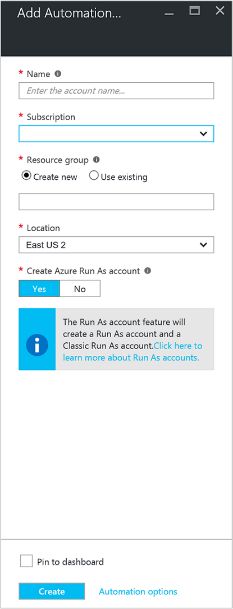
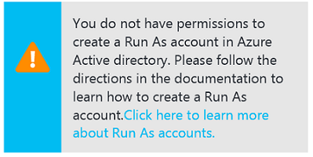
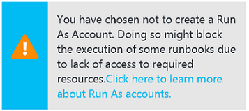
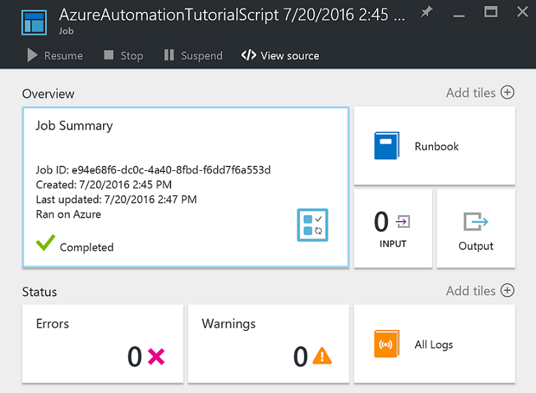
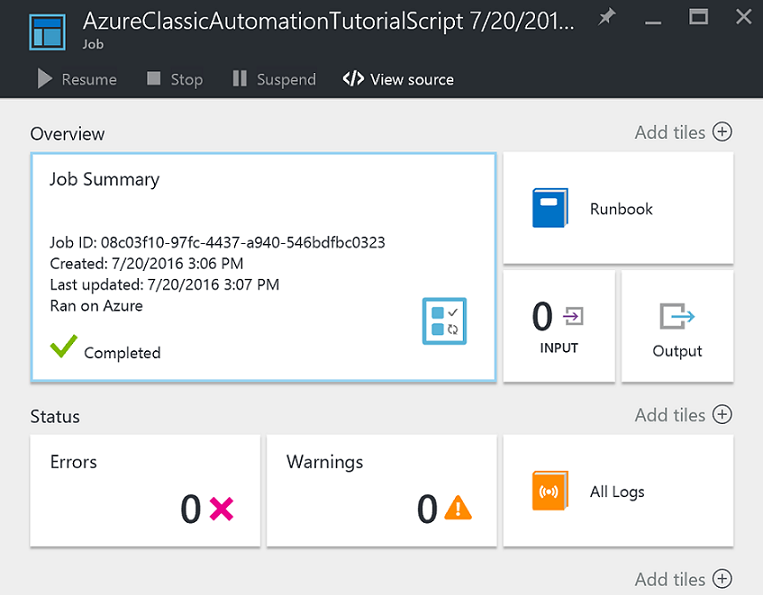
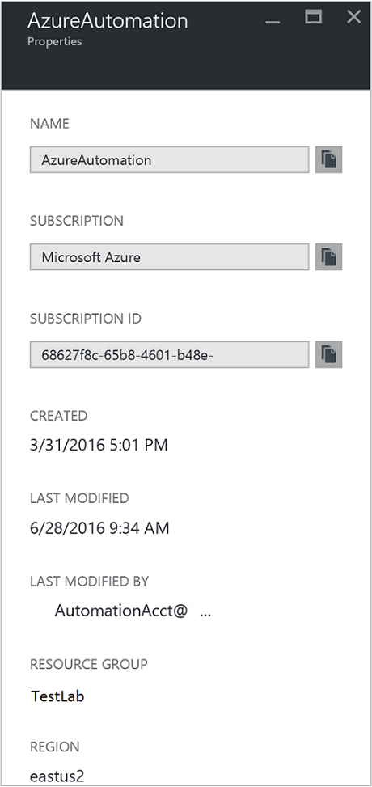

<properties
    pageTitle="Konfigurieren von Azure ausführen als Konto | Microsoft Azure"
    description="Lernprogramm führt, die Sie durch die Erstellung, testen und Beispiel Verwendung von Sicherheit Hauptbenutzer Authentifizierung in Azure Automatisierung."
    services="automation"
    documentationCenter=""
    authors="mgoedtel"
    manager="jwhit"
    editor=""
    keywords="Dienst Benutzerprinzipalnamen, Setspn, Azure-Authentifizierung"/>
<tags
    ms.service="automation"
    ms.workload="tbd"
    ms.tgt_pltfrm="na"
    ms.devlang="na"
    ms.topic="get-started-article"
    ms.date="08/17/2016"
    ms.author="magoedte"/>

# Authentifizieren Sie Runbooks mit Azure ausführen als Konto

In diesem Thema wird gezeigt, wie Konfigurieren eines Kontos Automatisierung vom Azure-Portal mithilfe des Features Ausführen als Konto Runbooks Verwalten von Ressourcen in Azure Ressourcenmanager oder Azure Servicemanagement authentifizieren werden.

Wenn Sie ein neues Konto für die Automatisierung der Azure-Portal erstellen, wird automatisch erstellt:

- Führen Sie als Konto erstellt eine neue Dienst Tilgungsanteile in Azure Active Directory, ein Zertifikat, und weist das Mitwirkender rollenbasierte Access-Steuerelement (RBAC), die zum Verwalten von Ressourcenmanager Ressourcen mithilfe des Runbooks verwendet wird.   
- Klassische Ausführen als Konto durch Hochladen eines Zertifikats Management, die zum Verwalten von Azure Service oder klassische Runbooks mit Ressourcen verwendet wird.  

Dies vereinfacht das für Sie und hilft, schnell und einfach erstellen und Bereitstellen von Runbooks Indexeigenschaften Automatisierung unterstützt starten.      

Verwenden eines Kontos ausführen als und klassischen ausführen, können Sie die folgenden Schritte ausführen:

- Möglichkeit, eine standardisierte mit Azure authentifizieren beim Azure Ressourcenmanager oder Azure Servicemanagement Ressourcen aus Runbooks Azure-Portal zu verwalten.  
- Die Verwendung der globalen Runbooks konfiguriert Azure Benachrichtigungen zu automatisieren.

>[AZURE.NOTE] Die Azure [Benachrichtigen Integrationsfeature](../monitoring-and-diagnostics/insights-receive-alert-notifications.md) mit Automatisierung globale Runbooks erfordert eine Automatisierung, die mit Ausführen als konfiguriert ist und klassischen Ausführen als Konto. Sie können, die bereits ein definierten Kontos ausführen als und klassischen Ausführen als Automatisierung Konto auswählen oder wählen Sie zum Erstellen eines neuen Kontos aus.

Wir wird gezeigt, wie das Konto Automatisierung vom Azure-Portal erstellen, aktualisieren ein Automatisierung Konto mithilfe der PowerShell, und führen Sie in Ihrem Runbooks authentifizieren vor.

Bevor wir dies tun, gibt es ein paar Punkte, die Sie sollten verstehen und berücksichtigen, bevor Sie fortfahren.

1. Dies wirkt sich nicht auf vorhandene Automatisierung Konten bereits in der klassischen oder im Modell zur Bereitstellung von Ressourcenmanager erstellt.  
2. Dies funktioniert nur für Automatisierung Konten über das Portal Azure erstellt.  Versuchen, erstellen ein Konto aus dem klassischen Portal repliziert nicht die Kontokonfiguration Ausführen als.
3. Wenn Sie aktuell arbeiten, Runbooks und zuvor erstellten klassische Ressourcen zum Verwalten von Anlagen (d. h. Terminpläne, Variablen usw.), und diese Runbooks mit dem neuen klassischen Ausführen als Konto authentifiziert werden soll, müssen Sie in das neue Automatisierung-Konto migrieren oder aktualisieren Ihr vorhandene Konto mit dem folgenden PowerShell-Skript.  
4. Für die Authentifizierung mit dem neuen Ausführen als Konto und klassischen Ausführen als Automatisierung Konto müssen Sie Ihre vorhandene Runbooks durch den folgenden Beispielcode zu ändern.  **Bitte beachten Sie** , die das Konto ausführen als für die Authentifizierung gegen Ressourcenmanager Ressourcen, die mit den wichtigsten Zertifikat-basierten Dienst und das klassische Ausführen als Konto ist ist für das Authentifizieren anhand Servicemanagement Ressourcen mit dem Management Zertifikat.     

## Erstellen eines neuen Kontos mit Automatisierung vom Azure-Portal

In diesem Abschnitt führen Sie die folgenden Schritte aus, um ein neues Automatisierung Azure-Konto vom Azure-Portal zu erstellen.  Dies erstellt Ausführen als sowohl die klassischen Ausführen als Konto ein.  

>[AZURE.NOTE] Der Benutzer, die Durchführung dieser Schritte *muss* ein Mitglied der Rolle Abonnement Administratoren und gemeinsame Administrator des Abonnements, die den Zugriff auf das Abonnement für den Benutzer erteilt werden.  Der Benutzer muss auch als Benutzer, die Abonnements Active Directory Standard hinzugefügt werden; das Konto muss nicht, eine Rolle Stufe zugewiesen werden soll.

1. Melden Sie sich mit einem Konto, ein Mitglied der Rolle Abonnement Administratoren und gemeinsame Administrator des Abonnements ist, Azure-Portal an.
2. Wählen Sie die **Automatisierung Konten**aus.
3. Klicken Sie in das Blade Automatisierung Konten auf **Hinzufügen**. 

    >[AZURE.NOTE]Wenn Sie in das Blade **Automatisierung Konto hinzufügen** folgende Warnung angezeigt wird, ist dies, da Ihr Konto kein Mitglied der Rolle Abonnement Administratoren und co-Administrator des Abonnements ist. 

4. In **Automatisierung Konto hinzufügen** vorher, in das Feld **Name** , geben Sie einen Namen für Ihr neues Konto für die Automatisierung.
5. Wenn Sie mehr als ein Abonnement besitzen, geben Sie eine für das neue Konto, als auch einen neuen oder vorhandenen **Ressourcengruppe** und eine Azure Datacenter **Speicherort**.
6. Überprüfen Sie den Wert für die Option **Erstellen Azure ausführen als Konto** **Ja** aktiviert ist, und klicken Sie auf die Schaltfläche **Erstellen** .  

    >[AZURE.NOTE] Wenn Sie auswählen, um das Konto ausführen als nicht zu erstellen, indem Sie die Option **Nein**auswählen, wird eine Warnung angezeigt, in dem Blade **Automatisierung Konto hinzufügen** angezeigt werden.  Während der Azure-Portal das Konto erstellt wurde, wird es keine entsprechende Authentifizierungsidentität innerhalb der Classic oder Ressourcenmanager Abonnement-Verzeichnisdienst und daher keinen Zugriff auf Ressourcen in Ihrem Abonnement haben.  Dadurch wird verhindert, dass alle Runbooks verweisen auf diesem Konto daran hindern, sich authentifizieren und Ausführen von Aufgaben für Ressourcen in diesen Bereitstellungsmodellen.

    > 
Beim Erstellen die Tilgungsanteile Dienst nicht wird nicht die Rolle "Mitwirkender" zugewiesen werden.

7. Während der Azure-Konto die Automatisierung erstellt hat, können Sie den Fortschritt unter **Benachrichtigungen** über das Menü nachverfolgen.

### Im Lieferumfang von Ressourcen

Wenn das Konto Automatisierung erfolgreich erstellt wurde, werden mehrere Ressourcen automatisch für Sie erstellt.  Die folgende Tabelle enthält eine Übersicht über die Ressourcen für das Konto ausführen als. 

Ressource|Beschreibung
--------|-----------
AzureAutomationTutorial Runbooks|Ein Beispiel für PowerShell Runbooks, die veranschaulicht, wie Sie mit dem Konto ausführen als authentifiziert und ruft alle Ressourcenmanager Ressourcen ab.
AzureAutomationTutorialScript Runbooks|Ein Beispiel für PowerShell Runbooks, die veranschaulicht, wie Sie mit dem Konto ausführen als authentifiziert und ruft alle Ressourcenmanager Ressourcen ab.
AzureRunAsCertificate|Zertifikat Anlage automatisch während der Erstellung des Kontos Automatisierung erstellt oder verwenden das folgende PowerShell-Skript für ein vorhandenes Konto.  Sie können Sie mit Azure authentifizieren, damit Sie von Runbooks Azure Ressourcenmanager Ressourcen verwalten können.  Das Zertifikat hat eine Lebensdauer ein Jahr.
AzureRunAsConnection|Verbindung Anlage automatisch während der Erstellung des Kontos Automatisierung erstellt oder verwenden das folgende PowerShell-Skript für ein vorhandenes Konto.

In der folgenden Tabelle werden die Ressourcen für das Konto klassischen Ausführen als zusammengefasst. 

Ressource|Beschreibung
--------|-----------
AzureClassicAutomationTutorial Runbooks|Ein Beispiel Runbooks Ruft alle klassischen virtuellen Computern in einem Abonnement mit dem klassischen Ausführen als Konto (Zertifikat), und gibt dann den Namen des virtuellen Computers und Status.
AzureClassicAutomationTutorial Skript Runbooks|Ein Beispiel Runbooks Ruft alle klassischen virtuellen Computern in einem Abonnement mit dem klassischen Ausführen als Konto (Zertifikat), und gibt dann den Namen des virtuellen Computers und Status.
AzureClassicRunAsCertificate|Zertifikat Anlage automatisch erstellt, mit der Authentifizierung mit Azure, damit Sie von Runbooks Azure klassische Ressourcen verwalten können.  Das Zertifikat hat eine Lebensdauer ein Jahr.
AzureClassicRunAsConnection|Verbindung Anlage automatisch erstellt, mit der Authentifizierung mit Azure, damit Sie von Runbooks Azure klassische Ressourcen verwalten können.  

## Führen Sie unter Authentifizierung überprüfen

Als Nächstes werden wir eine small testen, um zu bestätigen, dass Sie mit dem neuen Ausführen als Konto authentifiziert sind ausführen.     

1. Öffnen Sie im Portal Azure das zuvor erstellte Automatisierung-Konto ein.  
2. Klicken Sie auf die Kachel **Runbooks** zum Öffnen der Liste von Runbooks.
3. Wählen Sie aus der **AzureAutomationTutorialScript** Runbooks, und klicken Sie dann auf **Starten** , um die Runbooks starten.  Sie erhalten eine Aufforderung Überprüfung, dass die Runbooks beginnen soll.
4. Ein [Runbooks Auftrag](automation-runbook-execution.md) wird erstellt, den Auftrag Blade angezeigt wird, und der Status in der Kachel **Auftrag Zusammenfassung** angezeigt.  
5. Der Status wird als *Ausgabe bereit* , die angibt, dass sie eine Runbooks Worker in der Cloud verfügbar wird wartet gestartet. Dann wird zum *Starten* verschoben, wenn ein Worker Ansprüche das Projekt, und klicken Sie dann *ausgeführt* , wenn des Runbooks tatsächlich gestartet wird.  
6. Bei Auftragsabschluss Runbooks, sollte Status **abgeschlossen**angezeigt werden.   
7. Um die ausführliche Ergebnisse des Runbooks anzuzeigen, klicken Sie auf die Kachel der **Ausgabe** .
8. In der **Ausgabe** Blade sollten Sie sehen, hat erfolgreich authentifiziert und eine Liste aller Ressourcen zur Verfügung, in der Ressourcengruppe zurückgegeben.
9. Schließen Sie das Blade **Ausgabe** an die **Position Zusammenfassung** Blade zurück.
13. **Zusammenfassung der Position** und dem entsprechenden **AzureAutomationTutorialScript** Runbooks Blade zu schließen.

## Vergewissern Sie sich klassischen Ausführen als Authentifizierung

Als Nächstes werden wir eine small testen, um zu bestätigen, dass Sie mit dem neuen klassischen Ausführen als Konto authentifiziert sind ausführen.     

1. Öffnen Sie im Portal Azure das zuvor erstellte Automatisierung-Konto ein.  
2. Klicken Sie auf die Kachel **Runbooks** zum Öffnen der Liste von Runbooks.
3. Wählen Sie aus der **AzureClassicAutomationTutorialScript** Runbooks, und klicken Sie dann auf **Starten** , um die Runbooks starten.  Sie erhalten eine Aufforderung Überprüfung, dass die Runbooks beginnen soll.
4. Ein [Runbooks Auftrag](automation-runbook-execution.md) wird erstellt, den Auftrag Blade angezeigt wird, und der Status in der Kachel **Auftrag Zusammenfassung** angezeigt.  
5. Der Status wird als *Ausgabe bereit* , die angibt, dass sie eine Runbooks Worker in der Cloud verfügbar wird wartet gestartet. Dann wird zum *Starten* verschoben, wenn ein Worker Ansprüche das Projekt, und klicken Sie dann *ausgeführt* , wenn des Runbooks tatsächlich gestartet wird.  
6. Bei Auftragsabschluss Runbooks, sollte Status **abgeschlossen**angezeigt werden.   
7. Um die ausführliche Ergebnisse des Runbooks anzuzeigen, klicken Sie auf die Kachel der **Ausgabe** .
8. In der **Ausgabe** Blade sollten Sie es wurde erfolgreich authentifiziert und zurückgegeben wird, ist eine Liste aller klassischen virtueller Computer in das Abonnement sehen.
9. Schließen Sie das Blade **Ausgabe** an die **Position Zusammenfassung** Blade zurück.
13. **Zusammenfassung der Position** und dem entsprechenden **AzureClassicAutomationTutorialScript** Runbooks Blade zu schließen.

## Aktualisieren einer Automatisierung-Konto mithilfe der PowerShell

Hier bieten wir Ihnen die Möglichkeit, PowerShell verwenden, um Ihre vorhandene Automatisierung Konto aktualisieren, wenn:

1. Sie ein Konto Automatisierung erstellt, aber zum Erstellen des Kontos ausführen als abgelehnt
2. Sie bereits ein Konto Automatisierung Ressourcenmanager Ressourcen verwalten und, um das Konto ausführen als für die Authentifizierung Runbooks einschließen aktualisiert werden sollen
2. Sie bereits ein Konto Automatisierung zum klassische Ressourcen verwalten und, um die klassische Ausführen als verwenden, statt ein neues Konto erstellen und Ihre Runbooks und Ressourcen zu migrieren aktualisiert werden sollen   

Bevor Sie fortfahren, stellen Sie Folgendes sicher:

1. Sie haben heruntergeladen und installiert [Windows Management Framework 4.0 (WMF)](https://www.microsoft.com/download/details.aspx?id=40855) aus, wenn Sie Windows 7 ausführen.   
    Wenn Sie Windows Server 2012 R2, Windows Server 2012, Windows 2008 R2, Windows 8.1 und Windows 7 SP1 ausgeführt werden, ist [Windows Management Framework 5.0](https://www.microsoft.com/download/details.aspx?id=50395) für die Installation verfügbar.
2. Azure PowerShell 1.0. Informationen zu dieser Version und wie Sie diese installieren finden Sie unter [Informationen zum Installieren und konfigurieren Azure PowerShell](../powershell-install-configure.md).
3. Sie haben ein Konto Automatisierung erstellt.  Dieses Konto wird als Wert für Parameter verwiesen werden – AutomationAccountName und -%ApplicationDisplayName% in beiden folgenden Skripts.

Um die Werte für das *SubscriptionID* *ResourceGroup*und *AutomationAccountName*zu gelangen, wählen Sie Ihr Konto Automatisierung aus dem **Konto Automatisierung** Blade und wählen Sie **Alle Einstellungen**die erforderlichen Parameter für die Skripts, in dem Azure-Portal sind.  Wählen Sie **Eigenschaften**aus dem Blade **Alle Einstellungen** unter **Konten-Einstellungen** aus.  Das Blade **Eigenschaften** können Sie diese Werte beachten.    

### Erstellen von Ausführen als Konto PowerShell-Skript

Das folgende PowerShell-Skript wird Folgendes konfigurieren:

- Eine Azure AD-Anwendung, die mit der selbst signiertes Zertifikat authentifiziert wird ein Hauptbenutzer Dienstkontos für diese Anwendung in Azure AD erstellen und der Teilnehmerrolle (Sie könnten in Besitzer oder eine beliebige andere Rolle dies ändern) für dieses Konto in Ihrem aktuellen Abonnement zugewiesen.  Weitere Informationen finden Sie im Artikel [Access rollenbasierte Steuerelement in Azure Automatisierung](../automation/automation-role-based-access-control.md) .
- Eine Automatisierung Zertifikat Anlage in der angegebenen Automatisierung Konto namens **AzureRunAsCertificate**, die das Zertifikat vom Dienst Hauptbenutzer enthält.
- Eine Automatisierung Verbindung Anlage in der angegebenen Automatisierung Konto namens **AzureRunAsConnection**, die die p, TenantId, SubscriptionId und Fingerabdruck des Zertifikats enthält.    

Die folgenden Schritte aus, die Sie durch das Verfahren ausführen des Skripts durchlaufen werden.

1. Speichern Sie das folgende Skript auf Ihrem Computer.  In diesem Beispiel speichern Sie es mit den Dateinamen **Neu-AzureServicePrincipal.ps1**aus.  

        #Requires -RunAsAdministrator
        Param (
        [Parameter(Mandatory=$true)]
        [String] $ResourceGroup,

        [Parameter(Mandatory=$true)]
        [String] $AutomationAccountName,

        [Parameter(Mandatory=$true)]
        [String] $ApplicationDisplayName,

        [Parameter(Mandatory=$true)]
        [String] $SubscriptionId,

        [Parameter(Mandatory=$true)]
        [String] $CertPlainPassword,

        [Parameter(Mandatory=$false)]
        [int] $NoOfMonthsUntilExpired = 12
        )

        Login-AzureRmAccount
        Import-Module AzureRM.Resources
        Select-AzureRmSubscription -SubscriptionId $SubscriptionId

        $CurrentDate = Get-Date
        $EndDate = $CurrentDate.AddMonths($NoOfMonthsUntilExpired)
        $KeyId = (New-Guid).Guid
        $CertPath = Join-Path $env:TEMP ($ApplicationDisplayName + ".pfx")

        $Cert = New-SelfSignedCertificate -DnsName $ApplicationDisplayName -CertStoreLocation cert:\LocalMachine\My -KeyExportPolicy Exportable -Provider "Microsoft Enhanced RSA and AES Cryptographic Provider"

        $CertPassword = ConvertTo-SecureString $CertPlainPassword -AsPlainText -Force
        Export-PfxCertificate -Cert ("Cert:\localmachine\my\" + $Cert.Thumbprint) -FilePath $CertPath -Password $CertPassword -Force | Write-Verbose

        $PFXCert = New-Object -TypeName System.Security.Cryptography.X509Certificates.X509Certificate -ArgumentList @($CertPath, $CertPlainPassword)
        $KeyValue = [System.Convert]::ToBase64String($PFXCert.GetRawCertData())

        $KeyCredential = New-Object  Microsoft.Azure.Commands.Resources.Models.ActiveDirectory.PSADKeyCredential
        $KeyCredential.StartDate = $CurrentDate
        $KeyCredential.EndDate= $EndDate
        $KeyCredential.KeyId = $KeyId
        $KeyCredential.Type = "AsymmetricX509Cert"
        $KeyCredential.Usage = "Verify"
        $KeyCredential.Value = $KeyValue

        # Use Key credentials
        $Application = New-AzureRmADApplication -DisplayName $ApplicationDisplayName -HomePage ("http://" + $ApplicationDisplayName) -IdentifierUris ("http://" + $KeyId) -KeyCredentials $keyCredential

        New-AzureRMADServicePrincipal -ApplicationId $Application.ApplicationId | Write-Verbose
        Get-AzureRmADServicePrincipal | Where {$_.ApplicationId -eq $Application.ApplicationId} | Write-Verbose

        $NewRole = $null
        $Retries = 0;
        While ($NewRole -eq $null -and $Retries -le 6)
        {
           # Sleep here for a few seconds to allow the service principal application to become active (should only take a couple of seconds normally)
           Sleep 5
           New-AzureRMRoleAssignment -RoleDefinitionName Contributor -ServicePrincipalName $Application.ApplicationId | Write-Verbose -ErrorAction SilentlyContinue
           Sleep 10
           $NewRole = Get-AzureRMRoleAssignment -ServicePrincipalName $Application.ApplicationId -ErrorAction SilentlyContinue
           $Retries++;
        }

        # Get the tenant id for this subscription
        $SubscriptionInfo = Get-AzureRmSubscription -SubscriptionId $SubscriptionId
        $TenantID = $SubscriptionInfo | Select TenantId -First 1

        # Create the automation resources
        New-AzureRmAutomationCertificate -ResourceGroupName $ResourceGroup -AutomationAccountName $AutomationAccountName -Path $CertPath -Name AzureRunAsCertificate -Password $CertPassword -Exportable | write-verbose

        # Create a Automation connection asset named AzureRunAsConnection in the Automation account. This connection uses the service principal.
        $ConnectionAssetName = "AzureRunAsConnection"
        Remove-AzureRmAutomationConnection -ResourceGroupName $ResourceGroup -AutomationAccountName $AutomationAccountName -Name $ConnectionAssetName -Force -ErrorAction SilentlyContinue
        $ConnectionFieldValues = @{"ApplicationId" = $Application.ApplicationId; "TenantId" = $TenantID.TenantId; "CertificateThumbprint" = $Cert.Thumbprint; "SubscriptionId" = $SubscriptionId}
        New-AzureRmAutomationConnection -ResourceGroupName $ResourceGroup -AutomationAccountName $AutomationAccountName -Name $ConnectionAssetName -ConnectionTypeName AzureServicePrincipal -ConnectionFieldValues $ConnectionFieldValues

2. Starten Sie **Windows PowerShell** auf Ihrem Computer aus **den Startbildschirm mit höheren Zugriffsrechten** .
3. Navigieren Sie über die erweiterten Befehlszeile PowerShell-Shell zu dem Ordner, enthält das Skript in Schritt 1 erstellt haben, und führen Sie das Skript, ändern die Werte für Parameter *– ResourceGroup*, *- AutomationAccountName*, *- %ApplicationDisplayName%*, *SubscriptionId -*und *- CertPlainPassword*. 

    >[AZURE.NOTE] Sie werden aufgefordert, mit Azure authentifizieren, nachdem Sie das Skript ausführen. Sie müssen sich mit einem Konto anmelden, die Mitglied der Rolle des Abonnements Administratoren und co-Administrator des Abonnements ist.

        .\New-AzureServicePrincipal.ps1 -ResourceGroup <ResourceGroupName>
        -AutomationAccountName <NameofAutomationAccount> `
        -ApplicationDisplayName <DisplayNameofAutomationAccount> `
        -SubscriptionId <SubscriptionId> `
        -CertPlainPassword "<StrongPassword>"  
 

Nachdem das Skript erfolgreich abgeschlossen wurde, finden Sie in der [Stichprobe Code](#sample-code-to-authenticate-with-resource-manager-resources) unten, um mit Ressourcenmanager Ressourcen authentifizieren, und überprüfen Sie die Konfiguration der Anmeldeinformationen.

### Erstellen von klassischen Ausführen als Konto PowerShell-Skript

Das folgende PowerShell-Skript wird Folgendes konfigurieren:

- Eine Automatisierung Zertifikat Anlage in der angegebenen Automatisierung Konto namens **AzureClassicRunAsCertificate**, die das Zertifikat verwendet, um Ihre Runbooks authentifizieren enthält.
- Eine Automatisierung Verbindung Anlage in der angegebenen Automatisierung Konto namens **AzureClassicRunAsConnection**, die das Abonnementname, SubscriptionId und Zertifikat Anlage enthält.

Das Skript wird ein selbst signiertes Management Zertifikat erstellen und speichern Sie sie in den Ordner temporäre Dateien auf Ihrem Computer unter dem Benutzerprofil verwendet, um die PowerShell-Sitzung - *%USERPROFILE%\AppData\Local\Temp*auszuführen.  Nach dem Skript ausführen müssen Sie das Zertifikat Azure Management in den Management-Speicher für das Abonnement hochladen, die in das Automatisierung Konto erstellt wurde.  Schritte führt Sie durch das Verfahren ausführen des Skripts und das Zertifikat hochladen.  

1. Speichern Sie das folgende Skript auf Ihrem Computer.  In diesem Beispiel speichern Sie es mit den Dateinamen **Neu-AzureClassicRunAsAccount.ps1**aus.

        #Requires -RunAsAdministrator
        Param (
        [Parameter(Mandatory=$true)]
        [String] $ResourceGroup,

        [Parameter(Mandatory=$true)]
        [String] $AutomationAccountName,

        [Parameter(Mandatory=$true)]
        [String] $ApplicationDisplayName,

        [Parameter(Mandatory=$true)]
        [String] $SubscriptionId,

        [Parameter(Mandatory=$true)]
        [String] $CertPlainPassword,

        [Parameter(Mandatory=$false)]
        [int] $NoOfMonthsUntilExpired = 12
        )

        Login-AzureRmAccount
        Import-Module AzureRM.Resources
        $Subscription = Select-AzureRmSubscription -SubscriptionId $SubscriptionId
        $SubscriptionName = $subscription.Subscription.SubscriptionName

        $CurrentDate = Get-Date
        $EndDate = $CurrentDate.AddMonths($NoOfMonthsUntilExpired)
        $KeyId = (New-Guid).Guid
        $CertPath = Join-Path $env:TEMP ($ApplicationDisplayName + ".pfx")
        $CertPathCer = Join-Path $env:TEMP ($ApplicationDisplayName + ".cer")

        $Cert = New-SelfSignedCertificate -DnsName $ApplicationDisplayName -CertStoreLocation cert:\LocalMachine\My -KeyExportPolicy Exportable -Provider "Microsoft Enhanced RSA and AES Cryptographic Provider"

        $CertPassword = ConvertTo-SecureString $CertPlainPassword -AsPlainText -Force
        Export-PfxCertificate -Cert ("Cert:\localmachine\my\" + $Cert.Thumbprint) -FilePath $CertPath -Password $CertPassword -Force | Write-Verbose
        Export-Certificate -Cert ("Cert:\localmachine\my\" + $Cert.Thumbprint) -FilePath $CertPathCer -Type CERT | Write-Verbose

        # Create the automation resources
        $ClassicCertificateAssetName = "AzureClassicRunAsCertificate"
        New-AzureRmAutomationCertificate -ResourceGroupName $ResourceGroup -AutomationAccountName $AutomationAccountName -Path $CertPath -Name $ClassicCertificateAssetName  -Password $CertPassword -Exportable | write-verbose

        # Create a Automation connection asset named AzureClassicRunAsConnection in the Automation account. This connection uses the ClassicCertificateAssetName.
        $ConnectionAssetName = "AzureClassicRunAsConnection"
        Remove-AzureRmAutomationConnection -ResourceGroupName $ResourceGroup -AutomationAccountName $AutomationAccountName -Name $ConnectionAssetName -Force -ErrorAction SilentlyContinue
        $ConnectionFieldValues = @{"SubscriptionName" = $SubscriptionName; "SubscriptionId" = $SubscriptionId; "CertificateAssetName" = $ClassicCertificateAssetName}
        New-AzureRmAutomationConnection -ResourceGroupName $ResourceGroup -AutomationAccountName $AutomationAccountName -Name $ConnectionAssetName -ConnectionTypeName AzureClassicCertificate -ConnectionFieldValues $ConnectionFieldValues

        Write-Host -ForegroundColor red "Please upload the cert $CertPathCer to the Management store by following the steps below."
        Write-Host -ForegroundColor red "Log in to the Microsoft Azure Management portal (https://manage.windowsazure.com) and select Settings -> Management Certificates."
        Write-Host -ForegroundColor red "Then click Upload and upload the certificate $CertPathCer"

2. Starten Sie **Windows PowerShell** auf Ihrem Computer aus **den Startbildschirm mit höheren Zugriffsrechten** .  
3. Navigieren Sie über die erweiterten Befehlszeile PowerShell-Shell zu dem Ordner, enthält das Skript in Schritt 1 erstellt haben, und führen Sie das Skript, ändern die Werte für Parameter *– ResourceGroup*, *- AutomationAccountName*, *- %ApplicationDisplayName%*, *SubscriptionId -*und *- CertPlainPassword*. 

    >[AZURE.NOTE] Sie werden aufgefordert, mit Azure authentifizieren, nachdem Sie das Skript ausführen. Sie müssen sich mit einem Konto anmelden, die Mitglied der Rolle des Abonnements Administratoren und co-Administrator des Abonnements ist.

        .\New-AzureClassicRunAsAccount.ps1 -ResourceGroup <ResourceGroupName>
        -AutomationAccountName <NameofAutomationAccount> `
        -ApplicationDisplayName <DisplayNameofAutomationAccount> `
        -SubscriptionId <SubscriptionId> `
        -CertPlainPassword "<StrongPassword>"

Nachdem das Skript erfolgreich abgeschlossen wurde, müssen Sie das Zertifikat erstellt haben, in Ihrem Benutzerprofil **Temp** -Ordner zu kopieren.  Führen Sie die Schritte für das [Hochladen eines Management API Zertifikats](../azure-api-management-certs.md) klassischen Azure-Portal, und Lesen Sie dann in der [Stichprobe Code](#sample-code-to-authenticate-with-service-management-resources) Anmeldeinformationen Konfiguration mit Servicemanagement Ressourcen zu überprüfen.

## Beispiel-Code zum Authentifizieren mit Ressourcenmanager Ressourcen

Sie können den aktualisierten Stichprobe Code unten, entnommen des Runbooks **AzureAutomationTutorialScript** Beispiel, für die Authentifizierung mithilfe des Kontos ausführen als Ressourcenmanager Ressourcen mit Ihrem Runbooks verwalten.   

    $connectionName = "AzureRunAsConnection"
    $SubId = Get-AutomationVariable -Name 'SubscriptionId'
    try
    {
       # Get the connection "AzureRunAsConnection "
       $servicePrincipalConnection=Get-AutomationConnection -Name $connectionName         

       "Logging in to Azure..."
       Add-AzureRmAccount `
         -ServicePrincipal `
         -TenantId $servicePrincipalConnection.TenantId `
         -ApplicationId $servicePrincipalConnection.ApplicationId `
         -CertificateThumbprint $servicePrincipalConnection.CertificateThumbprint
       "Setting context to a specific subscription"  
       Set-AzureRmContext -SubscriptionId $SubId             
    }
    catch {
        if (!$servicePrincipalConnection)
        {
           $ErrorMessage = "Connection $connectionName not found."
           throw $ErrorMessage
         } else{
            Write-Error -Message $_.Exception
            throw $_.Exception
         }
    }

Das Skript enthält zwei zusätzliche Codezeilen zur Unterstützung von Verweisen auf ein Abonnement Kontext, sodass Sie problemlos zwischen mehreren Abonnements arbeiten können. Eine Variable Objekt mit dem Namen SubscriptionId enthält die ID des Abonnements und nach der hinzufügen-AzureRmAccount-Cmdlet-Anweisung das [Cmdlet "Set-AzureRmContext"](https://msdn.microsoft.com/library/mt619263.aspx) angegeben ist, mit der Parameter so eingerichtet *- SubscriptionId*. Wenn der Variablenname zu allgemein ist, können Sie den Namen der Variablen ein Präfix oder andere Benennungskonvention zu identifizieren für Ihre Zwecke erleichtern einbezogen werden sollen überarbeiten. Alternativ können Sie der Parameter - SubscriptionName statt - SubscriptionId festlegen, mit einem entsprechenden Variable Anlage.  

Beachten Sie, dass das Cmdlet für die Authentifizierung in des Runbooks - **Add-AzureRmAccount**, die Menge der *ServicePrincipalCertificate* Parameter verwendet wird.  Sie authentifiziert mit Service Hauptbenutzer Zertifikat, keine Anmeldeinformationen.  

## Beispiel-Code zum Authentifizieren mit Ressourcen Servicemanagement

Sie können den aktualisierten Stichprobe Code unten, entnommen des Runbooks **AzureClassicAutomationTutorialScript** Beispiel, für die Authentifizierung mithilfe des Kontos klassischen Ausführen als klassische Ressourcen mit Ihrem Runbooks verwalten.

    $ConnectionAssetName = "AzureClassicRunAsConnection"
    # Get the connection
    $connection = Get-AutomationConnection -Name $connectionAssetName        

    # Authenticate to Azure with certificate
    Write-Verbose "Get connection asset: $ConnectionAssetName" -Verbose
    $Conn = Get-AutomationConnection -Name $ConnectionAssetName
    if ($Conn -eq $null)
    {
       throw "Could not retrieve connection asset: $ConnectionAssetName. Assure that this asset exists in the Automation account."
    }

    $CertificateAssetName = $Conn.CertificateAssetName
    Write-Verbose "Getting the certificate: $CertificateAssetName" -Verbose
    $AzureCert = Get-AutomationCertificate -Name $CertificateAssetName
    if ($AzureCert -eq $null)
    {
       throw "Could not retrieve certificate asset: $CertificateAssetName. Assure that this asset exists in the Automation account."
    }

    Write-Verbose "Authenticating to Azure with certificate." -Verbose
    Set-AzureSubscription -SubscriptionName $Conn.SubscriptionName -SubscriptionId $Conn.SubscriptionID -Certificate $AzureCert
    Select-AzureSubscription -SubscriptionId $Conn.SubscriptionID

## Nächste Schritte

- Weitere Informationen zu Service Hauptbenutzer finden Sie in der [Anwendung und Dienst Tilgungsanteile Objekte](../active-directory/active-directory-application-objects.md).
- Weitere Informationen zu rollenbasierte Access Control in Azure Automatisierung finden Sie in [Access rollenbasierte Steuerelement in Azure Automatisierung](../automation/automation-role-based-access-control.md).
- Weitere Informationen über Zertifikate und Azure Services finden Sie unter [Zertifikate Overview für Azure Cloud Services](../cloud-services/cloud-services-certs-create.md)
