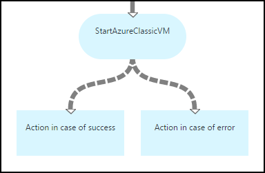
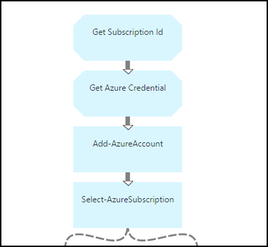
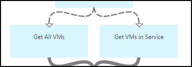
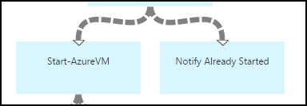
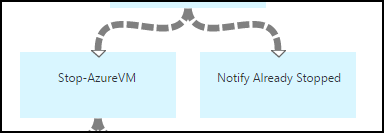
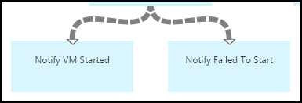
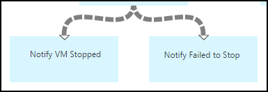

<properties 
    pageTitle="Starten und Beenden von virtuellen Computern - Graph | Microsoft Azure"
    description="PowerShell Workflowversion Azure Automatisierung Szenarios einschließlich Runbooks zum Starten und Beenden von klassischen virtuellen Computern."
    services="automation"
    documentationCenter=""
    authors="mgoedtel"
    manager="jwhit"
    editor="tysonn" />
<tags 
    ms.service="automation"
    ms.devlang="na"
    ms.topic="article"
    ms.tgt_pltfrm="na"
    ms.workload="infrastructure-services"
    ms.date="07/06/2016"
    ms.author="bwren" />

# Azure Automatisierung Szenario - starten und Beenden von virtuellen Computern

Dieses Szenario Azure Automatisierung enthält Runbooks zum Starten und Beenden von klassischen virtuellen Computern an.  Sie können dieses Szenario für eine der folgenden Aktionen aus:  

- Verwenden Sie die Runbooks ohne Änderung in Ihrer eigenen Umgebung. 
- Ändern der Runbooks, um benutzerdefinierte Funktionen ausführen.  
- Rufen Sie die Runbooks aus einem anderen Runbooks als Teil eines gesamten Lösung. 
- Anhand der Runbooks als Lernprogramme um Runbooks authoring Konzepte zu erfahren. 

> [AZURE.SELECTOR]
- [Grafische](automation-solution-startstopvm-graphical.md)
- [PowerShell-Workflow](automation-solution-startstopvm-psworkflow.md)

Dies ist der grafischen Runbooks Version dieses Szenario. Es ist auch mithilfe der [PowerShell-Workflow Runbooks](automation-solution-startstopvm-psworkflow.md)zur Verfügung.

## Erste das Szenario

Dieses Szenario besteht aus zwei zwei grafisch Runbooks, die von den folgenden Links heruntergeladen werden kann.  Anzeigen der [PowerShell Workflowversion](automation-solution-startstopvm-psworkflow.md) dieses Szenario für Links zu den Runbooks PowerShell-Workflow an.

| Runbooks | Link | Typ | Beschreibung |
|:---|:---|:---|:---|
| StartAzureClassicVM | [Starten Sie grafisch Runbooks Azure klassischen virtueller Computer](https://gallery.technet.microsoft.com/scriptcenter/Start-Azure-Classic-VM-c6067b3d) | Grafische | Startet alle klassischen virtuellen Computern in einer Azure-Abonnements oder von allen virtuellen Computern mit einem bestimmten Dienstnamen. |
| StopAzureClassicVM | [Beenden Sie grafisch Runbooks Azure klassischen virtueller Computer](https://gallery.technet.microsoft.com/scriptcenter/Stop-Azure-Classic-VM-397819bd) | Grafische | Beendet alle virtuellen Computer in ein Konto Automatisierung oder alle virtuellen Computer mit einem bestimmten Dienstnamen.  |

## Installieren und Konfigurieren des Szenarios

### 1: Installieren Sie die runbooks

Nach dem Herunterladen der Runbooks, können Sie diese mit dem Verfahren im [Grafischen Runbooks Verfahren](automation-graphical-authoring-intro.md#graphical-runbook-procedures)importieren.

### 2. Überprüfen Sie die Beschreibung und Anforderungen
Die Runbooks enthalten eine Aktivität namens **Infodatei** , die eine Beschreibung und erforderlichen Ressourcen enthält.  Sie können diese Informationen anzeigen, indem Sie die Aktivität **Infodatei** und klicken Sie dann auf den **Workflowskript** Parameter.  Sie können auch die gleiche Informationen aus diesem Artikel abrufen. 

### 3 Konfigurieren von Anlagen
Die Runbooks erfordern die folgenden Ressourcen, die Sie erstellen und mit den entsprechenden Werten füllen müssen.  Die Namen werden standardmäßig erstellt.  Sie können Anlagen mit unterschiedlichen Namen verwenden, wenn Sie lediglich die Namen in den [Eingabeparameter](#using-the-runbooks) beim Starten des Runbooks angeben.

| Objekt-Datentyp | Standardnamen | Beschreibung |
|:---|:---|:---|:---|
| [Anmeldeinformationen](automation-credentials.md) | AzureCredential | Enthält die Anmeldeinformationen für ein Konto, das verfügt über die Berechtigung zum Starten und Beenden von virtuellen Computern im Azure-Abonnement.  |
| [Variable](automation-variables.md) | AzureSubscriptionId | Enthält die Abonnement-ID Ihres Abonnements Azure. |

## Verwenden des Szenarios

### Parameter

Die Runbooks haben die folgenden [Eingabeparameter](automation-starting-a-runbook.md#runbook-parameters)an.  Sie müssen Werte für alle erforderlichen Parameter angeben und Werte für andere Parameter je nach Ihren Anforderungen können optional bereitstellen.

| Parameter | Typ | Obligatorisch | Beschreibung |
|:---|:---|:---|:---|
| ServiceName | Zeichenfolge | Nein | Wenn ein Wert angegeben wird, werden alle virtuellen Computer mit dem Namen Service gestartet oder beendet.  Wenn kein Wert angegeben wird, werden alle klassischen virtuellen Computern im Azure-Abonnement gestartet oder beendet. |
| AzureSubscriptionIdAssetName | Zeichenfolge | Nein | Enthält den Namen der [Variable Anlage](#installing-and-configuring-the-scenario) , die die Abonnement-ID Ihres Abonnements Azure enthält.  Wenn Sie keinen Wert angeben, wird *AzureSubscriptionId* verwendet.  |
| AzureCredentialAssetName | Zeichenfolge | Nein | Enthält den Namen der [Anlage Anmeldeinformationen](#installing-and-configuring-the-scenario) , die die Anmeldeinformationen für die Runbooks mit enthält.  Wenn Sie keinen Wert angeben, wird *AzureCredential* verwendet.  |

### Starten der runbooks

Sie können eine der Methoden starten [einer Runbooks in Azure Automatisierung](automation-starting-a-runbook.md) verwenden, um entweder von der Runbooks in diesem Artikel zu beginnen.

Im folgenden Beispielbefehle mithilfe Windows PowerShell ausgeführt **StartAzureClassicVM** , um alle virtuellen Computer mit dem Dienstnamen *MyVMService*zu starten.

    $params = @{"ServiceName"="MyVMService"}
    Start-AzureAutomationRunbook –AutomationAccountName "MyAutomationAccount" –Name "StartAzureClassicVM" –Parameters $params

### Die Ausgabe

Die Runbooks wird [eine Nachricht ausgeben](automation-runbook-output-and-messages.md) für jedes virtuellen Computern, die angibt, und zwar unabhängig davon, ob die Start- oder beenden-Anweisung erfolgreich übermittelt wurde.  Sie können nach einer bestimmten Zeichenfolge in der Ausgabe das Ergebnis für jede Runbooks bestimmen aussehen.  In der folgenden Tabelle sind die möglichen Ausgabezeichenfolgen aufgeführt.

| Runbooks | Bedingung | Nachricht |
|:---|:---|:---|
| StartAzureClassicVM | Virtuellen Computern wird bereits ausgeführt.  | "MyVM" wird bereits ausgeführt. |
| StartAzureClassicVM | Starten Sie Anfrage für virtuellen Computern erfolgreich übermittelten | "MyVM" wurde gestartet |
| StartAzureClassicVM | Fehler bei Start Anforderung virtuellen Computern  | "MyVM" konnte nicht gestartet werden |
| StopAzureClassicVM | Virtuellen Computern wird bereits ausgeführt.  | "MyVM" wurde bereits beendet. |
| StopAzureClassicVM | Starten Sie Anfrage für virtuellen Computern erfolgreich übermittelten | "MyVM" wurde gestartet |
| StopAzureClassicVM | Fehler bei Start Anforderung virtuellen Computern  | "MyVM" konnte nicht gestartet werden |

Im folgenden sehen ein Bild von der **StartAzureClassicVM** als eine [untergeordnete Runbooks](automation-child-runbooks.md) in einer Stichprobe grafisch Runbooks verwenden.  Diese verwendet bedingte Hyperlinks in der folgenden Tabelle.

| Link | Kriterien |
|:---|:---|
| Erfolg link | $ActivityOutput [StartAzureClassicVM]-wie "\* gestartet wurde"    |
| Fehler beim Verknüpfen   | $ActivityOutput [StartAzureClassicVM]-notlike "\* gestartet wurde" |

## Ausführliche Projektstrukturplan-Codes

Es folgt eine ausführliche Analyse der der Runbooks in diesem Szenario.  Diese Informationen können Sie entweder die Runbooks anpassen oder um nur um für die Erstellung Ihrer eigenen Szenarios für die Automatisierung daraus zu lernen.
 

### Authentifizierung

Des Runbooks beginnt mit Aktivitäten legen Sie die [Anmeldeinformationen](automation-configuring.md#configuring-authentication-to-azure-resources) und Azure-Abonnement, die für die restlichen des Runbooks verwendet wird.

Die ersten beiden Aktivitäten, **Abonnement-Id abrufen** und **Azure-Anmeldeinformationen erhalten**, Abrufen der [Objekte](#installing-the-runbook) , die von den beiden nächsten Aktivitäten verwendet werden.  Diese Aktivitäten können die Anlagen direkt angeben, aber die Elementnamen benötigten.  Da wir lediglich die Namen in den [Eingabeparameter](#using-the-runbooks)angeben den Benutzer zulassen, benötigen wir die folgenden Aktivitäten zum Abrufen von Anlagen mit einem Namen durch ein Eingabeparameter angegeben.

**Hinzufügen-AzureAccount** legt die Anmeldeinformationen, die für die restlichen des Runbooks verwendet werden soll.  Die Anmeldeinformationen-Anlage, die sie aus der **Erste Azure Anmeldeinformationen** abruft muss Zugriff auf Starten und Beenden von virtuellen Computern im Azure-Abonnement verfügen.  Das Abonnement, das verwendet wird ist in der **Select-AzureSubscription** aktiviert die verwendet die Abonnement-Id aus dem **Abonnement-Id abrufen**.

### Abrufen von virtuellen Computern

Des Runbooks muss feststellen, welche virtuellen Computer mit arbeiten sollen, und gibt an, ob sie bereits gestartet oder (je nach des Runbooks beendet).   Eine von zwei Aktivitäten wird die virtuellen Computern abgerufen werden.  **Abrufen von virtuellen Computern in Dienst** wird ausgeführt, wenn der *ServiceName* Eingabeparameter für des Runbooks einen Wert enthält.  **Alle virtuellen Computern abrufen** wird ausgeführt, wenn der *ServiceName* Eingabeparameter für des Runbooks keinen Wert enthält.  Diese Logik wird durch die bedingte Links vor jeder Aktivität durchgeführt.

Beide Aktivitäten verwenden Sie das Cmdlet " **Get-AzureVM** ".  **Alle virtuellen Computern abrufen** verwendet den **ListAllVMs** -Parameter festgelegt, dass alle virtuellen Computern zurückgegeben.  **Abrufen von virtuellen Computern in Service** verwendet die Parameter **GetVMByServiceAndVMName** sowie den **ServiceName** Eingabeparameter für den Parameter **ServiceName** .  

### Zusammenführen von virtuellen Computern

Die Aktivität **Zusammenführen virtuellen Computern** ist erforderlich, um Eingabe für **Start-AzureVM** bereitzustellen, die von den Namen und Service Name des der Vm(s) zum Starten benötigt.  Diese Eingabe konnte aus **Allen virtuellen Computern erhalten** oder **Abrufen von virtuellen Computern in Dienst**stammen, aber **Start-AzureVM** können nur für die Eingabe einer Aktivität angeben.   

Das Szenario ist das **Zusammenführen von virtuellen Computern** erstellen, der mit dem **Schreiben-Ausgabe** -Cmdlet ausgeführt wird.  Der **Eingabeobjekt** Parameter für das Cmdlet ist ein PowerShell-Ausdruck, der die Eingabe der vorherigen zwei Aktivitäten kombiniert.  Nur von einem dieser Aktivitäten wird ausgeführt, nur eine Reihe von Ausgabe erwartet wird.  **Start-AzureVM** können die Ausgabe für seine Eingabeparameter verwenden. 

### Start/Stopp virtuellen Computern

 

Je nach des Runbooks versuchen Sie die nächsten Aktivitäten, starten und Beenden des Runbooks mit **Start-AzureVM** oder **Beenden-AzureVM**aus.  Da die Aktivität einen Link Verkaufspipeline vorangestellt ist, wird für jedes Objekt aus **Zusammenführen virtuellen Computern**zurückgegeben einmal ausgeführt.  Die Verknüpfung ist bedingte, sodass nur die Aktivität ausgeführt wird, ist die *RunningState* des virtuellen Computers *weiterspielen* für **Start-AzureVM** und *Schritte* für **Die Option zum Beenden-AzureVM**. Wenn diese Bedingung nicht erfüllt ist, wird dann **Benachrichtigen bereits gestartet** oder **Bereits beendet benachrichtigen** ausgeführt zum Senden einer Nachricht mithilfe der **Ausgabe eines schreiben**.

### Senden der Ausgabe

 

Im letzte Schritt des Runbooks wird die Ausgabe gesendet, ob die Anforderung starten oder beenden, für jeden virtuellen Computer erfolgreich übermittelt wurde. Es gibt eine Separate **Schreiben-Ausgabe** Aktivität für jede, und wir bestimmen, welche eine mit bedingten Links ausführen.  **Benachrichtigen virtueller Computer gestartet** oder **Benachrichtigen virtueller Computer beendet** wird ausgeführt, wenn *OperationStatus* *erfolgreich*ist.  Wenn *OperationStatus* mit einem anderen Wert belegt, wird dann **Benachrichtigen Fehler zu beginnen** oder **Beenden konnte benachrichtigen** ausgeführt.

## Nächste Schritte

- [Grafische in Azure Automatisierung authoring](automation-graphical-authoring-intro.md)
- [Untergeordnete Runbooks in Azure Automatisierung](automation-child-runbooks.md) 
- [Runbooks Ausgabe und Nachrichten in Azure Automatisierung](automation-runbook-output-and-messages.md)