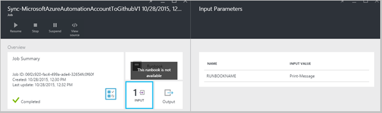

<properties 
    pageTitle=" Steuern der Integration in Azure Automatisierung Datenquelle | Microsoft Azure"
    description="In diesem Artikel werden die Quelle Steuern der Integration mit GitHub in Azure Automatisierung."
    services="automation"
    documentationCenter=""
    authors="mgoedtel"
    manager="jwhit"
    editor="tysonn" />    
<tags 
    ms.service="automation"
    ms.devlang="na"
    ms.topic="article"
    ms.tgt_pltfrm="na"
    ms.workload="infrastructure-services"
    ms.date="09/12/2016"
    ms.author="magoedte;sngun" />

# Steuern der Integration in Azure Automatisierung Quelle

Steuern der Integration Quelle können Sie Runbooks in Ihr Konto Automatisierung zu einem GitHub Quelle Steuerelement Repository zugeordnet werden soll. Datenquellen-Steuerelement können Sie problemlos gemeinsam mit Ihrem Team, Nachverfolgen von Änderungen und auf früheren Versionen von Ihrem Runbooks zurücksetzen. Beispielsweise können mit Datenquellen-Steuerelements Sie andere Verzweigungen in Ihre Entwicklung, Test- oder Automatisierung Konten, sodass sie mühelos Code Höherstufen, die in Ihrer Entwicklungsumgebung Ihrer Herstellung Automatisierung Konto getestet wurde Datenquellen-Steuerelement zu synchronisieren.

Datenquellen-Steuerelement können Sie Pushbenachrichtigungen Code aus Azure Automatisierung an Datenquellen-Steuerelement, oder ziehen Sie Ihre Runbooks von Datenquellen-Steuerelements zu Azure Automatisierung. Dieser Artikel beschreibt, wie Datenquellen-Steuerelements in Ihrer Umgebung Azure Automatisierung einrichten. Beginnen wir mit dem Konfigurieren von Azure Automatisierung zum Zugriff auf Ihre GitHub Repository und durchgehen, unterschiedliche Vorgänge, die ausgeführt werden können Quelle Steuern der Integration verwenden. 

>[AZURE.NOTE]Datenquellen-Steuerelement unterstützt herausziehen und [PowerShell Workflow Runbooks](automation-runbook-types.md#powershell-workflow-runbooks) ebenso wie [PowerShell Runbooks](automation-runbook-types.md#powershell-runbooks)drücken. [Grafische Runbooks](automation-runbook-types.md#graphical-runbooks) werden noch nicht unterstützt.  

Es gibt zwei einfache Schritte erforderlich, um die Datenquellen-Steuerelements für Ihr Konto Automatisierung, und nur eine konfigurieren, wenn Sie bereits ein Konto GitHub haben. Sie sind:
## Schritt 1 – erstellen Sie ein Repository GitHub

Wenn Sie bereits ein Konto GitHub und ein Repository, das Sie verwenden möchten, link zur Azure Automatisierung, und klicken Sie dann auf Anmelden bei Ihrem Konto vorhandene, und beginnen Sie mit Schritt 2 weiter unten. Navigieren Sie andernfalls zu [GitHub](https://github.com/), melden Sie sich von für ein neues Konto und [Erstellen Sie ein neues Repository](https://help.github.com/articles/create-a-repo/).

## Schritt 2 – Einrichten von Datenquellen-Steuerelements in Azure Automatisierung

1. Automatisierung Konto vorher in der Azure-Portal, klicken Sie auf **Datenquellen-Steuerelement.** 
 
    

2. Das **Datenquellen-Steuerelement** Blade geöffnet wird, können Sie die Details Ihrer GitHub Konto konfigurieren. Es folgt eine Liste der Parameter so konfigurieren:  

  	|**Parameter**            |**Beschreibung** |
  	|:---|:---| 
  	|Auswählen der Quelle   | Wählen Sie aus der Quelle. Aktuell wird nur **GitHub** unterstützt. |
  	|Autorisierung | Klicken Sie auf die Schaltfläche **Autorisieren** , um Azure Automatisierung Zugriff auf Ihr GitHub Repository gewähren. Wenn Sie bereits bei Ihrem Konto GitHub in einem separaten Fenster angemeldet sind, haben, werden die Anmeldeinformationen für dieses Konto verwendet. Sobald die Autorisierung erfolgreich ist, wird das Blade Ihren Benutzernamen GitHub unter **Autorisierung Eigenschaft**angezeigt. |
  	|Wählen Sie Repository aus. | Wählen Sie aus der Liste der verfügbaren Repositorys ein Repository GitHub aus. |
  	|Wählen Sie Zweig aus. | Wählen Sie in der Liste der verfügbaren Verzweigungen eine Verzweigung. Nur die **master** Verzweigung wird angezeigt, wenn Sie alle Verzweigungen erstellt haben. |
  	|Runbooks Ordnerpfad | Der Pfad des Runbooks gibt den Pfad im GitHub Repository Pushbenachrichtigungen oder ziehen Sie den Code werden soll. Sie müssen in das Format **/foldername/subfoldername**eingegeben werden. Bei Ihrem Konto Automatisierung wird nur Runbooks im Ordnerpfad Runbooks synchronisiert werden. Runbooks in Unterordnern des der Runbooks Ordner Pfad wird **nicht** synchronisiert werden. Verwenden Sie **/** alle Runbooks unter Repository synchronisieren. |

3. Angenommen, wenn Sie ein Repository mit dem Namen **PowerShellScripts** , die einen Ordner namens **RootFolder**enthält haben, der einen Ordner enthält benannte **Unterordner**. Die folgenden Zeichenfolgen können Sie jede Ordnerebene synchronisieren:

    1. Wenn Runbooks aus **Repository**synchronisieren möchten, ist Runbooks Ordnerpfad*/*
    2. Wenn Runbooks aus **RootFolder**synchronisieren möchten, ist Runbooks Ordnerpfad */RootFolder*
    3. Wenn Runbooks aus **Unterordner**synchronisieren möchten, ist Runbooks Ordnerpfad */RootFolder/SubFolder*.
  

4. Nachdem Sie die Parameter konfiguriert haben, werden diese angezeigt, auf die **Datenquellen-Steuerelements Blade.**  
 
    

5. Nachdem Sie auf OK klicken, wird Quelle Steuern der Integration ist jetzt für Ihr Konto Automatisierung konfiguriert und durch Ihre GitHub Daten aktualisiert werden sollen. Sie können nun auf diesen Teil alle Ihre Quelle Steuerelement synchronisieren Historie anzeigen klicken.  

    

6. Nach dem Einrichten Datenquellen-Steuerelement, werden die folgenden Ressourcen für die Automatisierung in Ihr Konto Automatisierung erstellt:  
 Es werden zwei [Variablen Posten](automation-variables.md) erstellt.  
      
    * Die Variable **Microsoft.Azure.Automation.SourceControl.Connection** enthält die Werte der Verbindungszeichenfolge, wie unten dargestellt.  

  	|**Parameter**            |**Wert** |
  	|:---|:---|
  	| Namen  | Microsoft.Azure.Automation.SourceControl.Connection |
  	| Typ | Zeichenfolge |
  	| Wert  | {"Zweigstelle":\<*Ihren Namen Verzweigung*>, "RunbookFolderPath":\<*Runbooks Ordnerpfad*>, "ProviderType":\<*hat den Wert 1 für GitHub*>, "Repository":\<*Name des Repositorys*>, "Username":\<*GitHub Ihr Benutzername*>} |   

    * Die Variable **Microsoft.Azure.Automation.SourceControl.OAuthToken**enthält den sicheren verschlüsselten Wert des Ihrer OAuthToken.  

  	|**Parameter**            |**Wert** |
  	|:---|:---|
  	| Namen  | Microsoft.Azure.Automation.SourceControl.OAuthToken |
  	| Typ | Unknown(Encrypted) |
  	| Wert | <*Verschlüsselte OAuthToken*> |  

      

    * **Automatisierung Datenquellen-Steuerelement** wird als eine autorisierte Anwendung mit Ihrem Konto GitHub hinzugefügt. Zum Anzeigen der Anwendung: von der Homepage GitHub, navigieren Sie zu Ihrem **Profil** > **Einstellungen** > **Applikationen**. Diese Anwendung ermöglicht Azure Automatisierung Ihrer GitHub Repository mit einer Firma Automatisierung synchronisieren.  

    

## Verwenden von Datenquellen-Steuerelements in Automatisierung

### Einchecken einer Runbooks aus Azure Automatisierung an Datenquellen-Steuerelement

Einchecken Runbooks ermöglicht Ihnen, drücken Sie die Änderungen zu einer Runbooks in Azure Automatisierung in Ihrer Datenquelle Steuerelement Repository vorgenommenen haben. Im folgenden sind die Schritte zum einer Runbooks einzuchecken:

1. Von der Automatisierung Firmen-, [Erstellen Sie eine neue Textform Runbooks](automation-first-runbook-textual.md)oder [Bearbeiten einer vorhandenen, Textform Runbooks](automation-edit-textual-runbook.md). Diese Runbooks kann ein PowerShell Workflow oder eines PowerShell-Skript Runbooks sein.  

2. Nachdem Sie Ihre Runbooks bearbeiten, speichern Sie es, und klicken Sie auf **Einchecken** aus dem Blade **Bearbeiten** .  

    

     >[AZURE.NOTE] Einchecken von Azure Automatisierung überschrieben den Code, der derzeit in der Datenquellen-Steuerelements befindet. Die Git entspricht Befehlszeile Anweisung-Einchecken ist **Git hinzufügen + Git Commit + Git Pushbenachrichtigungen**  

3. Wenn Sie auf **Einchecken**klicken, wird Sie mit einer Meldung zur Bestätigung aufgefordert werden, klicken Sie auf Ja, um den Vorgang fortzusetzen.  

    

4. Einchecken beginnt der Quelle Steuerelement Runbooks: **Synchronisieren-MicrosoftAzureAutomationAccountToGitHubV1**. Diese Runbooks GitHub her und legt Änderungen aus Azure Automatisierung an Ihrem Repository. Zum Anzeigen des Auftragsverlaufs Einchecken kehren Sie zur Registerkarte **Quelle Steuern der Integration** , und klicken Sie auf, um das Blade Repository-Synchronisierung zu öffnen. Diese Blade zeigt alle Ihre Quelle Steuerelement Aufträge.  Wählen Sie den Auftrag, den Sie anzeigen möchten, und klicken Sie auf, um die Details anzuzeigen.  

    

    >[AZURE.NOTE] Quelle Steuerelement Runbooks sind spezielle Automatisierung Runbooks, die Sie anzeigen oder bearbeiten können. Während sie sich in der Liste Runbooks nicht angezeigt werden, sehen Sie synchronisieren Einzelvorgänge in der Liste der Aufträge angezeigt.
 
5. Der Namen des geänderten Runbooks wird als Eingabeparameter an des Runbooks Einchecken gesendet. Sie können [die Details anzeigen](automation-runbook-execution.md#viewing-job-status-using-the-azure-management-portal) , indem Sie Runbooks in **Repository-Synchronisierung** Blade erweitern.  

    

6. Aktualisieren Sie Ihrer GitHub Repository an, sobald der Auftrag abgeschlossen ist, um die Änderungen anzuzeigen.  Es sollten ein Commit in Ihrem Repository mit einer Nachricht Commit: * *Aktualisierten *Runbooks Namen* in Azure Automation.* *  

### Synchronisieren von Runbooks aus Datenquellen-Steuerelement auf Azure-Automatisierung 

Die Schaltfläche "Synchronisieren" auf das Repository-Synchronisierung Blade können Sie bei Ihrem Konto Automatisierung der Pfad des Repositorys Runbooks alle die Runbooks abonnierte. Dasselbe Repository kann auf mehrere Automatisierung-Konto synchronisiert werden. Im folgenden werden die Schritte zum Synchronisieren einer Runbooks aus:

1. Klicken Sie aus dem Konto Automatisierung, wo Sie Einrichten von Datenquellen-Steuerelements, öffnen Sie die **Synchronisierung von Quelle Steuerelement Integration/Repository Blade** und klicken Sie auf **Synchronisieren** , und klicken Sie dann mit einer Meldung zur Bestätigung aufgefordert werden auf **Ja,** um den Vorgang fortzusetzen.  

    

2. Synchronisierung beginnt des Runbooks: **Synchronisieren-MicrosoftAzureAutomationAccountFromGitHubV1**. Diese Runbooks GitHub her, und die Änderungen aus Ihrem Repository zu Azure Automatisierung abruft. Klicken Sie auf das **Repository-Synchronisierung** Blade für diese Aktion sollte ein neues Projekt angezeigt werden. Klicken Sie zum Anzeigen von Details zu den Auftrag synchronisieren, um das Projekt Details Blade zu öffnen.  
 
    

 
    >[AZURE.NOTE] Eine Synchronisierung von Datenquellen-Steuerelements überschreibt die Entwurfsversion der der Runbooks, die derzeit in Ihrem Konto Automatisierung für **Alle** Runbooks vorhanden sind, die aktuell im Datenquellen-Steuerelement sind. Die Git entspricht Befehlszeile Anweisung synchronisieren ist **Git Abruf**

## Problembehandlung bei der Quelle-Steuerelement

Wenn Fehler mit einem Projekt einchecken oder Synchronisieren vorhanden sind, sollte der Status unterbrochen werden und können Sie weitere Details zu dem Fehler in der Position Blade anzeigen.  Das Webpart **Alle Protokolle** zeigt Ihnen alle dieser Auftrag zugeordneten PowerShell Streams. Dies wird mit den Details erforderlich, damit Sie beheben Probleme mit dem Einchecken oder synchronisieren können bereitgestellt werden. Es werden auch die Abfolge von Aktionen angezeigt, die während der Synchronisierung oder Auschecken in einer Runbooks aufgetreten sind.  

## Trennen von Datenquellen-Steuerelements

Trennen von Ihrem Konto GitHub, öffnen Sie das Blade Repository-Synchronisierung, und klicken Sie auf **Trennen**. Nachdem Sie die Datenquellen-Steuerelements trennen, Runbooks, die zuvor synchronisiert wurden bleibt weiterhin in Ihr Konto Automatisierung, aber das Blade Repository-Synchronisierung ist nicht aktiviert.  

  

## Nächste Schritte

Weitere Informationen zum Steuern der Integration Quelle finden Sie unter den folgenden Ressourcen:  
- [Azure Automatisierung: Quelle Steuern der Integration in Azure Automatisierung](https://azure.microsoft.com/blog/azure-automation-source-control-13/)  
- [Stimmen Sie für Ihre bevorzugten Quelle Steuerelement-system](https://www.surveymonkey.com/r/?sm=2dVjdcrCPFdT0dFFI8nUdQ%3d%3d)  
- [Azure Automatisierung: Integration mit Visual Studio Team Services Runbooks Datenquellen-Steuerelements](https://azure.microsoft.com/blog/azure-automation-integrating-runbook-source-control-using-visual-studio-online/)  
