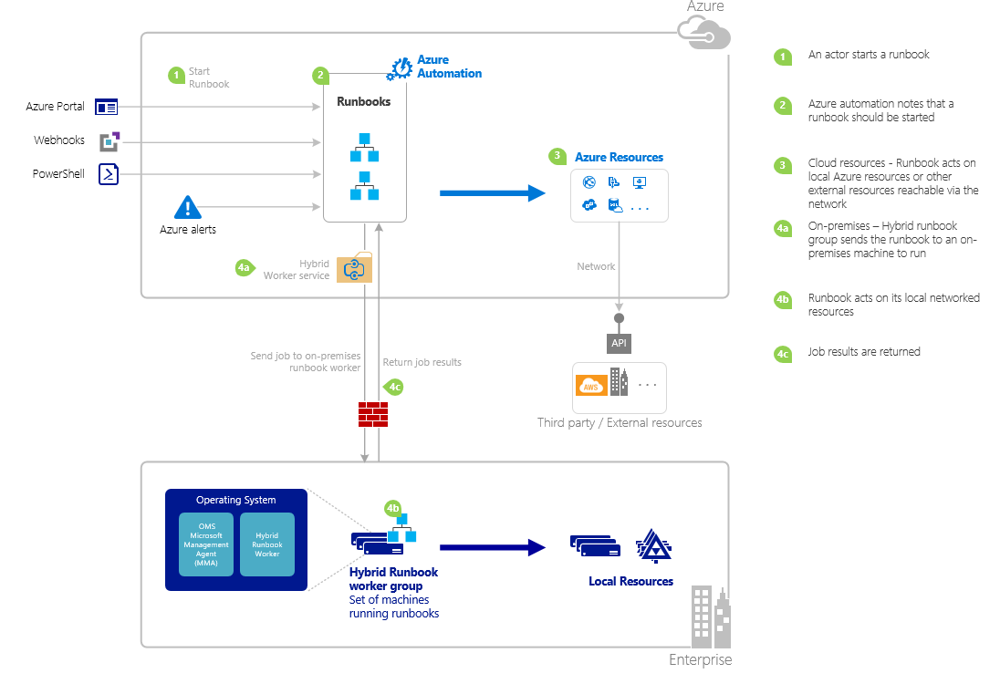

<properties
   pageTitle="Starten eine Runbooks in Azure Automatisierung | Microsoft Azure"
   description="Enthält eine Übersicht über die unterschiedlichen Methoden, die zum Starten einer Runbooks in Azure Automatisierung verwendet werden können und enthält Informationen zur Verwendung der Azure-Portal und die Windows PowerShell."
   services="automation"
   documentationCenter=""
   authors="mgoedtel"
   manager="jwhit"
   editor="tysonn" />
<tags
   ms.service="automation"
   ms.devlang="na"
   ms.topic="article"
   ms.tgt_pltfrm="na"
   ms.workload="infrastructure-services"
   ms.date="10/08/2016"
   ms.author="magoedte;bwren"/>

# <a name="starting-a-runbook-in-azure-automation"></a>Starten Sie eine Runbooks in Azure Automatisierung

In der folgenden Tabelle können Sie bestimmen die Methode, um eine Runbooks in Azure Automatisierung zu beginnen, die für das spezifische Szenario am besten geeignet ist. Dieser Artikel enthält Details zum Starten einer Runbooks, mit Windows PowerShell und Azure-Portal an. Details zu den anderen Methoden werden in andere Dokumentation bereitgestellt, die Sie aus den nachstehenden Links zugreifen können.

| **METHODE**                                                                    | **MERKMALE**                                                                                                                                                                                                                                                                                                                                                |
|-------------------------------------------------------------------------------|--------------------------------------------------------------------------------------------------------------------------------------------------------------------------------------------------------------------------------------------------------------------------------------------------------------------------------------------------------------------|
| [Azure-Portal](#starting-a-runbook-with-the-azure-portal)                     | <li>Einfachste Methode mit interaktiven Benutzeroberfläche.<br> <li>Formular zum einfachen Parameterwerte bereitstellen.<br> <li>Nachverfolgen Sie einfaches Job-Status aus.<br> <li>Zugriff mit Azure Anmeldung authentifiziert.                                                                                                                                                                               |
| [Windows PowerShell](https://msdn.microsoft.com/library/dn690259.aspx)        | <li>Rufen Sie über die Befehlszeile mit Windows PowerShell-Cmdlets.<br> <li>Können in automatisierte Lösung mit mehreren Schritten enthalten sein.<br> <li>Anforderung mit Zertifikat oder OAuth Benutzer Hauptbenutzer / Dienstleistung authentifiziert wird Hauptbenutzer.<br> <li>Bieten Sie einfache und komplexe Parameterwerte ein.<br> <li>Nachverfolgen von Job-Status.<br> <li>Client für die Unterstützung von PowerShell-Cmdlets erforderlich sind. |
| [Azure Automation API](https://msdn.microsoft.com/library/azure/mt662285.aspx) | <li>Die meisten flexible Methode aber auch die meisten komplexen.<br> <li>Rufen Sie von einem beliebigen benutzerdefinierten Code, der HTTP-Anfragen vornehmen kann.<br> <li>Anforderung mit Zertifikat oder Oauth Benutzer Hauptbenutzer / Dienstleistung authentifiziert Hauptbenutzer.<br> <li>Bieten Sie einfache und komplexe Parameterwerte ein.<br> <li>Nachverfolgen von Job-Status.                                                                          |
| [Webhooks](automation-webhooks.md)                                            | <li>Starten Sie Runbooks von einzelnen HTTP-Anforderung an.<br> <li>Authentifiziert mit Sicherheitstoken in URL ein.<br> <li>Client kann nicht überschreiben Parameterwerte, die beim Erstellen von Webhook angegeben. Runbooks kann einzelnen Parameter definieren, der mit den Details der Anforderung HTTP ausgefüllt wird.<br> <li>Keine Möglichkeit, den Auftrag Zustand über Webhook URL zu verfolgen.                                      |
| [Antworten auf Azure Benachrichtigung](../log-analytics/log-analytics-alerts.md)               | <li>Starten Sie eine Runbooks Reaktion auf Azure Warnung aus.<br> <li>Konfigurieren von Webhook für Runbooks und Link zum benachrichtigen.<br> <li>Authentifiziert mit Sicherheitstoken in URL ein.<br> <li>Derzeit unterstützt nur Benachrichtigung auf Kennzahlen.                                                                                                                                                       |
| [Zeitplan](automation-schedules.md)                                | <li>Automatisch gestartet Runbooks termingerecht stündlich, täglich oder wöchentlich fest.<br> <li>Terminplan durch Azure-Portal, PowerShell-Cmdlets oder Azure-API zu bearbeiten.<br> <li>Bieten Sie Parameterwerte mit Zeitplan verwendet werden.                                                                                                                                               |
| [Aus einem anderen Runbooks](automation-child-runbooks.md)                          | <li>Verwenden einer Runbooks als Aktivität in ein anderes Runbooks an.<br> <li>Nützlich für die Funktionen, die von mehreren Runbooks verwendet.<br> <li>Stellen Sie Parameterwerte zu untergeordneten Runbooks und verwenden Sie die Ausgabe in übergeordnete Runbooks.                                                                                                                                                               |

Die folgende Abbildung zeigt die detaillierte Anleitung im Lebenszyklus von einem Runbooks. Sie enthält verschiedene Arten, die einer Runbooks auszuführende Azure Automatisierung Runbooks und Interaktionen zwischen verschiedenen Komponenten Azure-Automatisierung gestartet wird Komponenten für Hybrid Runbooks Worker erforderlich. Weitere Informationen zur Automatisierung Runbooks im Datencenter ausführen, finden Sie unter [Hybrid Runbooks Kollegen](automation-hybrid-runbook-worker.md)



## <a name="starting-a-runbook-with-the-azure-portal"></a>Starten einer Runbooks mit Azure-portal

1.  Aktivieren Sie **Automatisierung,** und klicken Sie dann auf den Namen eines Kontos Automatisierung, im Azure-Portal.
2.  Wählen Sie die Registerkarte **Runbooks** aus.
3.  Wählen Sie eine Runbooks aus, und klicken Sie dann auf **Start**.
4.  Wenn des Runbooks Parameter verfügt, werden Sie aufgefordert, Werte mit einem Textfeld für jeden Parameter einzugeben. Weitere Informationen zu den Parametern finden Sie unter [Runbooks Parameter](#Runbook-parameters) unter.
5.  Wählen Sie **Ansicht Position** neben der **Felder starten** Runbooks Nachricht oder wählen Sie die Registerkarte **Aufträge** für des Runbooks Runbooks des Projektstatus anzeigen aus.

## <a name="starting-a-runbook-with-the-azure-portal"></a>Starten einer Runbooks mit Azure-portal

1.  Klicken Sie über Ihr Konto Automatisierung auf das Webpart **Runbooks** , um das Blade **Runbooks** zu öffnen.
2.  Klicken Sie auf eine Runbooks, um deren **Runbooks** Blade zu öffnen.
3.  Klicken Sie auf **Start**.
4.  Wenn die Runbooks keine Parameter besitzt, werden Sie aufgefordert, zu bestätigen, ob Sie starten möchten. Wenn des Runbooks Parameter verfügt, wird das Blade **Runbooks starten** geöffnet werden, damit Sie Parameterwerte bereitstellen können. Weitere Informationen zu den Parametern finden Sie unter [Runbooks Parameter](#Runbook-parameters) unter.
5.  Das **Projekt** Blade kann geöffnet werden, damit Sie den Status nachverfolgen können.

## <a name="starting-a-runbook-with-windows-powershell"></a>Starten einer Runbooks mit Windows PowerShell

Der [Start-AzureRmAutomationRunbook](https://msdn.microsoft.com/library/mt603661.aspx) können Sie eine Runbooks mit Windows PowerShell beginnen. Der folgende Code startet eine Runbooks Test-Runbooks bezeichnet.

```
Start-AzureRmAutomationRunbook -AutomationAccountName "MyAutomationAccount" -Name "Test-Runbook" -ResourceGroupName "ResourceGroup01"
```

Start-AzureRmAutomationRunbook gibt ein Position-Objekt, das Sie verwenden können, um ihren Status zu verfolgen, nachdem die Runbooks gestartet wird. Diese Job-Objekts können mit [Get-AzureRmAutomationJob](https://msdn.microsoft.com/library/mt619440.aspx) Sie um den Status der Position und [Get-AzureRmAutomationJobOutput](https://msdn.microsoft.com/library/mt603476.aspx) deren Ausgabe zu ermitteln. Der folgende Code startet eine Runbooks Test-Runbooks, wartet, bis er abgeschlossen ist, und klicken Sie dann deren Ausgabe zeigt bezeichnet.

```
$runbookName = "Test-Runbook"
$ResourceGroup = "ResourceGroup01"
$AutomationAcct = "MyAutomationAccount"

$job = Start-AzureRmAutomationRunbook –AutomationAccountName $AutomationAcct -Name $runbookName -ResourceGroupName $ResourceGroup

$doLoop = $true
While ($doLoop) {
   $job = Get-AzureRmAutomationJob –AutomationAccountName $AutomationAcct -Id $job.JobId -ResourceGroupName $ResourceGroup
   $status = $job.Status
   $doLoop = (($status -ne "Completed") -and ($status -ne "Failed") -and ($status -ne "Suspended") -and ($status -ne "Stopped"))
}

Get-AzureRmAutomationJobOutput –AutomationAccountName $AutomationAcct -Id $job.JobId -ResourceGroupName $ResourceGroup –Stream Output
```

Wenn des Runbooks Parameter erforderlich sind, müssen Sie angeben, als eine [Hashtable](http://technet.microsoft.com/library/hh847780.aspx) , wo der Schlüssel Hashtable entspricht dem Namen des Parameters und der Wert entspricht dem Parameterwert. Im folgenden Beispiel wird gezeigt, wie eine Runbooks mit zwei Zeichenfolgenparameter FirstName und LastName, eine ganze Zahl, die mit dem Namen RepeatCount und den booleschen Parameter anzeigen beginnt. Weitere Informationen zu Parametern finden Sie unter folgenden [Runbooks Parameter](#Runbook-parameters) .

```
$params = @{"FirstName"="Joe";"LastName"="Smith";"RepeatCount"=2;"Show"=$true}
Start-AzureRmAutomationRunbook –AutomationAccountName "MyAutomationAccount" –Name "Test-Runbook" -ResourceGroupName "ResourceGroup01" –Parameters $params
```

## <a name="runbook-parameters"></a>Runbooks Parameter

Wenn Sie eine Runbooks aus dem Azure-Portal oder Windows PowerShell beginnen, wird die Anweisung über den Azure Automatisierung Webdienst gesendet. Dieser Dienst unterstützt keine Parameter komplexer Datentypen. Wenn Sie einen Wert für eine komplexe Parameter angeben müssen, müssen Sie es Inline aus einem anderen Runbooks Aufrufen in [untergeordneten Runbooks in Azure Automatisierung](automation-child-runbooks.md)beschriebenen.

Der Webdienst Azure Automatisierung bietet spezielle Funktionen für Parameter, die mithilfe von bestimmter Datentypen wie in den folgenden Abschnitten beschrieben.

### <a name="named-values"></a>Benannte Werte

Der Parameter ist Datentyp [Object], und Sie können das folgende JSON-Format zum Senden einer Liste von benannten Werten: *{Name1: "Wert1", Name2: "Wert2", Name3: 'Wert3'}*. Diese Werte müssen einfache Typen sein. Des Runbooks erhalten den Parameter als eine [PSCustomObject](https://msdn.microsoft.com/library/system.management.automation.pscustomobject%28v=vs.85%29.aspx) mit Eigenschaften, die den Wert jeder benannten entsprechen.

Erwägen Sie die folgenden Test Runbooks, die einen Parameter namens Benutzer akzeptiert.

```
Workflow Test-Parameters
{
   param (
      [Parameter(Mandatory=$true)][object]$user
   )
    $userObject = $user | ConvertFrom-JSON
    if ($userObject.Show) {
        foreach ($i in 1..$userObject.RepeatCount) {
            $userObject.FirstName
            $userObject.LastName
        }
    }
}
```

Der folgende Text konnte für den Benutzerparameter verwendet werden.

```
{FirstName:'Joe',LastName:'Smith',RepeatCount:'2',Show:'True'}
```

Dadurch wird die folgende Ausgabe.

```
Joe
Smith
Joe
Smith
```

### <a name="arrays"></a>Matrizen zurück.

Wenn der Parameter ein Array z. B. [Array] ist oder [Zeichenfolge: []], können Sie das folgende JSON-Format zum Senden einer Liste mit Werten verwenden: *[Wert1, Wert2 Wert3]*. Diese Werte müssen einfache Typen sein.

Erwägen Sie die folgenden Test Runbooks, die einen Parameter namens *Benutzer*akzeptiert.

```
Workflow Test-Parameters
{
   param (
      [Parameter(Mandatory=$true)][array]$user
   )
    if ($user[3]) {
        foreach ($i in 1..$user[2]) {
            $ user[0]
            $ user[1]
        }
    }
}
```

Der folgende Text konnte für den Benutzerparameter verwendet werden.

```
["Joe","Smith",2,true]
```

Dadurch wird die folgende Ausgabe.

```
Joe
Smith
Joe
Smith
```

### <a name="credentials"></a>Anmeldeinformationen

Wenn der Parameter-Datentyp **PSCredential**ist, können Sie den Namen eines Azure Automatisierung [Anmeldeinformationen Anlage](automation-credentials.md)bereitstellen. Des Runbooks werden die Anmeldeinformationen mit dem Namen abrufen, die Sie angeben.

Erwägen Sie die folgenden Test Runbooks, die einen Parameter namens Anmeldeinformationen akzeptiert.

```
Workflow Test-Parameters
{
   param (
      [Parameter(Mandatory=$true)][PSCredential]$credential
   )
   $credential.UserName
}
```

Der folgende Text konnte für den Benutzerparameter unter der Voraussetzung, dass es wurde ein Anmeldeinformationen Objekt namens *Meine Anmeldeinformationen*verwendet werden.

```
My Credential
```

Unter der Voraussetzung, dass der Benutzername in den Anmeldeinformationen *Jsmith*war, führt dies in der folgenden Ausgabe.

```
jsmith
```

## <a name="next-steps"></a>Nächste Schritte

-   Die Runbooks Architektur im aktuellen Artikel bietet einen detaillierten Überblick über die Verwaltung von Ressourcen in Azure und lokal mit dem Hybrid Runbooks Worker Runbooks.  Weitere Informationen zur Automatisierung Runbooks im Datencenter ausführen, finden Sie unter [Hybrid Runbooks Kollegen](automation-hybrid-runbook-worker.md).
-   Erfahren Sie mehr über das Erstellen von modulare Runbooks von anderen Runbooks für bestimmte oder allgemeine Funktionen verwendet werden, finden Sie unter [Untergeordneten Runbooks](automation-child-runbooks.md).
