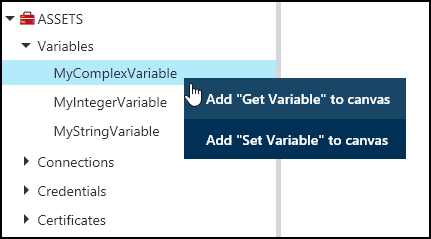
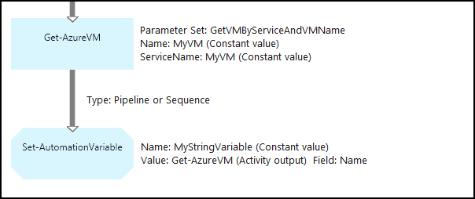
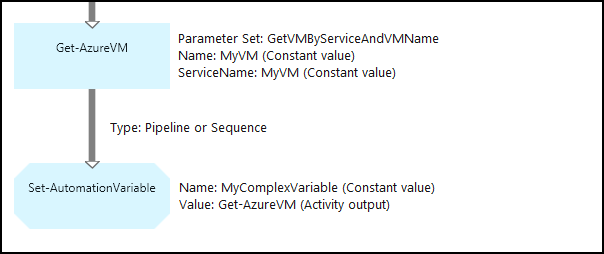
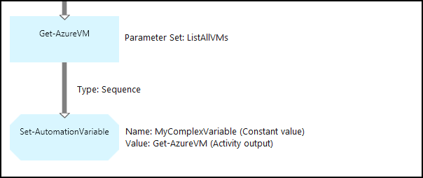
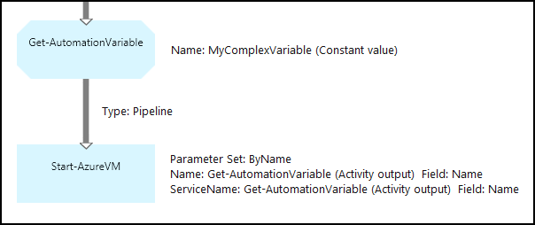
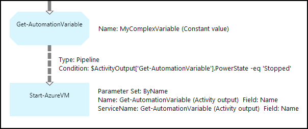

<properties 
   pageTitle="Variable Anlagen in Azure Automatisierung | Microsoft Azure"
   description="Variable Vermögenswerte sind Werte, die alle Runbooks und DSC Konfigurationen in Azure Automatisierung zur Verfügung stehen.  In diesem Artikel wird erläutert, die Details der Variablen und zum Verfassen von Text und Grafiken mit ihnen zu arbeiten."
   services="automation"
   documentationCenter=""
   authors="mgoedtel"
   manager="jwhit"
   editor="tysonn" />
<tags 
   ms.service="automation"
   ms.devlang="na"
   ms.topic="article"
   ms.tgt_pltfrm="na"
   ms.workload="infrastructure-services"
   ms.date="05/24/2016"
   ms.author="magoedte;bwren" />

# Variable Anlagen in Azure Automatisierung

Variable Vermögenswerte sind Werte, die alle Runbooks und DSC Konfigurationen in Ihr Konto Automatisierung zur Verfügung stehen. Sie können erstellt, geändert, und abgerufen werden vom Azure-Portal, Windows PowerShell und innerhalb einer Runbooks oder DSC Konfiguration. Automatisierung Variablen sind nützlich für die folgenden Szenarien:

- Geben Sie einen Wert zwischen mehreren Runbooks oder DSC Konfigurationen frei.

- Geben Sie einen Wert zwischen mehrere Aufträge in der gleichen Runbooks oder DSC Konfiguration frei.

- Verwalten Sie einen Wert aus dem Portal oder aus der Windows PowerShell-Befehlszeile, die von Runbooks oder DSC Konfigurationen verwendet wird.

Automatisierung Variablen beibehalten werden, damit, dass sie wieder zur Verfügung, auch wenn die Runbooks oder DSC Konfiguration fehlschlägt.  Dies ermöglicht außerdem einen Wert, der festgelegt werden, indem eine Runbooks, die von einem anderen anschließend wird, oder wird verwendet, von dem gleichen Runbooks oder DSC Konfiguration das nächste Mal, das es ausgeführt wird.

Wenn eine Variable erstellt wurde, können Sie angeben, dass es gespeichert werden verschlüsselte.  Wenn eine Variable verschlüsselt ist, sicher in Azure Automatisierung gespeichert ist, und deren Wert nicht aus dem [Get-AzureAutomationVariable](http://msdn.microsoft.com/library/dn913772.aspx) -Cmdlet, das als Teil der Azure-PowerShell-Modul geliefert wird abgerufen werden.  Die Aktivität **Get-AutomationVariable** in einer Runbooks oder DSC Konfiguration steht die einzige Möglichkeit, ein verschlüsselter Wert abgerufen werden kann.

>[AZURE.NOTE]Sichere Anlagen in Azure Automatisierung beziehen Sie Anmeldeinformationen, Zertifikate, Verbindungen und verschlüsselte Variablen. Diese Ressourcen werden verschlüsselt und bei der Azure-Automatisierung mit einem eindeutigen Schlüssel ist für jedes Konto Automatisierung gespeichert. Dieser Schlüssel ist von einem master Zertifikat verschlüsselt und im Azure Automatisierung gespeichert. Vor dem Speichern einer sicheren Anlage, die Taste für das Konto Automatisierung ist mit dem master Zertifikat entschlüsselt und dann verwendet, um die Anlage verschlüsseln.

## Variable Typen

Wenn Sie eine Variable mit dem Portal Azure erstellen, müssen Sie einen Datentyp aus der Dropdownliste angeben, damit das entsprechende Steuerelement zum Eingeben der Werts des Variablen im Portal angezeigt werden kann. Die Variable ist nicht auf diesen Datentyp beschränkt müssen, aber Sie die Variable mithilfe von Windows PowerShell, wenn Sie einen Wert eines anderen Typs angeben möchten. Wenn Sie **nicht definiert**angeben, dann wird der Wert der Variablen auf **$null**festgelegt, und müssen Sie den Wert mit dem Cmdlet " [Set-AzureAutomationVariable](http://msdn.microsoft.com/library/dn913767.aspx) " oder der **Satz-AutomationVariable** Aktivität festlegen.  Keine erstellen oder ändern Sie den Wert für einen Typ komplexen Variable im Portal, aber Sie können einen Wert eines beliebigen Typs mithilfe von Windows PowerShell bereitstellen. Komplexe Typen werden als eine [PSCustomObject](http://msdn.microsoft.com/library/system.management.automation.pscustomobject.aspx)zurückgegeben.

Sie können mehrere Werte in einer einzelnen Variable durch Erstellen einer Matrix oder einem Hashtable und speichern diese auf die Variable speichern.

## Cmdlets und Workflowaktivitäten

Die Cmdlets in der folgenden Tabelle werden zum Erstellen und Verwalten von Automatisierung Variablen mit Windows PowerShell. Diese liefern als Teil des [Azure PowerShell-Modul](../powershell-install-configure.md) für die Verwendung in Automatisierung Runbooks und DSC Konfiguration verfügbar ist.

|Cmdlets|Beschreibung|
|:---|:---|
|[Get-AzureAutomationVariable](http://msdn.microsoft.com/library/dn913772.aspx)|Der Wert einer vorhandenen Variablen abgerufen.|
|[Neue AzureAutomationVariable](http://msdn.microsoft.com/library/dn913771.aspx)|Erstellt eine neue Variable und deren Wert festgelegt.|
|[Entfernen-AzureAutomationVariable](http://msdn.microsoft.com/library/dn913775.aspx)|Entfernt eine vorhandene Variable an.|
|[Set-AzureAutomationVariable](http://msdn.microsoft.com/library/dn913767.aspx)|Legt den Wert für eine vorhandene Variable.|

Die Workflowaktivitäten in der folgenden Tabelle werden verwendet, um die Automatisierung von Variablen in einer Runbooks zugreifen. Sie sind nur für die Verwendung in einem Runbooks oder DSC Konfiguration verfügbar und werden nicht als Teil der Azure-PowerShell-Modul geliefert.

|Workflowaktivitäten|Beschreibung|
|:---|:---|
|Get-AutomationVariable|Der Wert einer vorhandenen Variablen abgerufen.|
|Set-AutomationVariable|Legt den Wert für eine vorhandene Variable.|

>[AZURE.NOTE] Vermeiden Sie die Verwendung von Variablen in – Parameter Name der **Get-AutomationVariable** in einer Runbooks oder DSC-Konfiguration, da dies erkennen von Abhängigkeiten zwischen Runbooks oder DSC Konfiguration und Automatisierung Variablen zur Entwurfszeit erschweren kann.

## Erstellen einer neuen Automatisierungsvariablen

### So erstellen eine neue Variable mit dem Azure-portal

1. Klicken Sie auf **Posten** am oberen Rand des Fensters, über Ihr Konto Automatisierung.
1. Am unteren Rand des Fensters klicken Sie auf **Hinzufügen**.
1. Klicken Sie auf **Variable hinzufügen**.
1. Schließen Sie des Assistenten ab aus, und klicken Sie auf das Kontrollkästchen, um die neue Variable zu speichern.

### So erstellen eine neue Variable mit dem Azure-portal

1. Klicken Sie über Ihr Konto Automatisierung auf das Webpart **Posten** , um das Blade **Anlagen** zu öffnen.
1. Klicken Sie auf das Webpart **Variablen** , um das Blade **Variablen** zu öffnen.
1. Klicken Sie auf **Hinzufügen, eine Variable** am oberen Rand der Blade.
1. Füllen Sie das Formular, und klicken Sie auf **Erstellen** , um die neue Variable zu speichern.

### So erstellen eine neue Variable mit Windows PowerShell

Das Cmdlet [AzureAutomationVariable neu](http://msdn.microsoft.com/library/dn913771.aspx) erstellt eine neue Variable und legt den Anfangswert. Sie können den Wert mithilfe der [Get-AzureAutomationVariable](http://msdn.microsoft.com/library/dn913772.aspx)abrufen. Wenn der Wert ein einfacher Typ ist, wird dieser desselben Typs zurückgegeben. Wenn es sich um einen komplexen Typ ist, wird eine **PSCustomObject** zurückgegeben.

Im folgenden Beispielbefehle anzeigen zum Erstellen einer Variablen vom Typ "String" und dann den Wert zurückgeben.

    New-AzureAutomationVariable –AutomationAccountName "MyAutomationAccount" –Name 'MyStringVariable' –Encrypted $false –Value 'My String'
    $string = (Get-AzureAutomationVariable –AutomationAccountName "MyAutomationAccount" –Name 'MyStringVariable').Value

Im folgenden Beispielbefehle anzeigen So erstellen Sie eine Variable mit einem komplexen Typ und dessen Eigenschaften dann zurück. In diesem Fall wird ein Objekt virtuellen Computern aus **Get-AzureVM** verwendet.

    $vm = Get-AzureVM –ServiceName "MyVM" –Name "MyVM"
    New-AzureAutomationVariable –AutomationAccountName "MyAutomationAccount" –Name "MyComplexVariable" –Encrypted $false –Value $vm
    
    $vmValue = (Get-AzureAutomationVariable –AutomationAccountName "MyAutomationAccount" –Name "MyComplexVariable").Value
    $vmName = $vmValue.Name
    $vmIpAddress = $vmValue.IpAddress

## Verwenden einer Variablen in einer Runbooks oder DSC-Konfiguration

Verwenden Sie die Aktivität **AutomationVariable festlegen** , um den Wert einer Automatisierungsvariablen in einer Runbooks oder DSC-Konfiguration, und der **Get-AutomationVariable** Abrufen dieser festzulegen.  Verwenden Sie nicht die Cmdlets **Set-AzureAutomationVariable** oder **Get-AzureAutomationVariable** in einer Runbooks oder DSC-Konfiguration, da sie weniger als die Workflowaktivitäten effizient sind.  Sie können nicht auch den Wert von secure Variablen mit **Get-AzureAutomationVariable**abrufen.  Die einzige Möglichkeit zum Erstellen einer neuen Variable aus in einer Runbooks oder DSC Konfiguration besteht darin, das Cmdlet " [New-AzureAutomationVariable](http://msdn.microsoft.com/library/dn913771.aspx) " verwenden.

### Beispiele für textbasierte Runbooks

#### Festlegen und Abrufen von einen einfachen Wert aus einer Variablen

Im folgenden Beispielbefehle anzeigen zum Festlegen und Abrufen einer Variablen in einer Textform Runbooks In diesem Beispiel wird davon ausgegangen, dass Variablen des Typs Integer mit dem Namen *NumberOfIterations* und *NumberOfRunnings* und eine Variable vom Typzeichenfolge benannte *SampleMessage* bereits erstellt wurden.

    $NumberOfIterations = Get-AutomationVariable -Name 'NumberOfIterations'
    $NumberOfRunnings = Get-AutomationVariable -Name 'NumberOfRunnings'
    $SampleMessage = Get-AutomationVariable -Name 'SampleMessage'
    
    Write-Output "Runbook has been run $NumberOfRunnings times."
    
    for ($i = 1; $i -le $NumberOfIterations; $i++) {
       Write-Output "$i`: $SampleMessage"
    }
    Set-AutomationVariable –Name NumberOfRunnings –Value ($NumberOfRunnings += 1)

#### Festlegen und Abrufen eines komplexen Objekts in einer Variablen

Der folgende Code veranschaulicht, wie eine Variable mit einem komplexen Wert in einer Textform Runbooks aktualisieren. In diesem Beispiel wird eine Azure-virtuellen Computern mit **Get-AzureVM** abgerufen und in eine vorhandene Automatisierung Variable gespeichert.  Wie unter [Variable Datentypen](#variable-types)erläutert, werden diese als eine PSCustomObject gespeichert.

    $vm = Get-AzureVM -ServiceName "MyVM" -Name "MyVM"
    Set-AutomationVariable -Name "MyComplexVariable" -Value $vm

Im folgenden Code wird der Wert aus der Variablen abgerufen und zum Starten des virtuellen Computers verwendet.

    $vmObject = Get-AutomationVariable -Name "MyComplexVariable"
    if ($vmObject.PowerState -eq 'Stopped') {
       Start-AzureVM -ServiceName $vmObject.ServiceName -Name $vmObject.Name
    }

#### Festlegen und Abrufen einer Websitesammlungs in einer Variablen

Der folgende Code veranschaulicht, wie eine Variable mit einer Sammlung von komplexe Werte in einem Textform Runbooks verwenden. In diesem Beispiel werden mehrere Azure-virtuellen Computern mit **Get-AzureVM** abgerufen und in eine vorhandene Automatisierung Variable gespeichert.  Wie unter [Variable Datentypen](#variable-types)erläutert, werden diese als eine Zusammenstellung von PSCustomObjects gespeichert.

    $vms = Get-AzureVM | Where -FilterScript {$_.Name -match "my"}     
    Set-AutomationVariable -Name 'MyComplexVariable' -Value $vms

In den folgenden Code der Websitesammlung aus der Variablen abgerufen und verwendet, um jeden virtuellen Computer zu starten.

    $vmValues = Get-AutomationVariable -Name "MyComplexVariable"
    ForEach ($vmValue in $vmValues)
    {
       if ($vmValue.PowerState -eq 'Stopped') {
          Start-AzureVM -ServiceName $vmValue.ServiceName -Name $vmValue.Name
       }
    }

### Grafische Runbooks Beispiele

In einem grafischen Runbooks fügen Sie die **Get-AutomationVariable** oder **AutomationVariable festlegen** , indem Sie mit der rechten Maustaste auf die Variable im Bereich des grafischen-Editors Bibliothek, und markieren die gewünschte Aktivität hinzu.

#### Festlegen von Werten in einer Variablen

Die folgende Abbildung zeigt die Stichprobe Aktivitäten mit einem einfachen Wert in einem grafischen Runbooks eine Variable zu aktualisieren. In diesem Beispiel wird eine einzelne Azure-virtuellen Computern mit **Get-AzureVM** abgerufen und den Namen des Computers auf eine vorhandene Automatisierung Variable mit einem Typ Zeichenfolge gespeichert ist.  Es spielt keine Rolle, ob die [Verknüpfung ist eine Verkaufspipeline oder Sequenz](automation-graphical-authoring-intro.md#links-and-workflow) da wir nur ein einzelnes Objekt in der Ausgabe erwartet.

Die folgende Abbildung zeigt die Aktivitäten verwendet, um eine Variable mit einem komplexen Wert in einem grafischen Runbooks aktualisieren. Die einzige Änderung aus dem vorherigen Beispiel ist kein **Feldpfad** für die **Aktivität Ausgabe** auf die Aktivität **Festlegen-AutomationVariable** zurück, der angibt, dass das Objekt nur eine Eigenschaft des Objekts gespeichert ist.  Wie unter [Variable Datentypen](#variable-types)erläutert, werden diese als eine PSCustomObject gespeichert.

Die folgende Abbildung zeigt eine ähnliche Funktionalität wie im vorherigen Beispiel, mit mehreren virtuellen Computern der Variablen gespeichert.  [Sequenz Link](automation-graphical-authoring-intro.md#links-and-workflow) muss hier verwendet werden, damit die Aktivität **Festlegen-AutomationVariable** den ganzen Satz von virtuellen Computern als eine Auflistung empfängt.  Wenn [Verkaufspipeline Link](automation-graphical-authoring-intro.md#links-and-workflow) verwendet wurde, klicken Sie dann führen die Aktivität **Festlegen – AutomationVariable** separat für jedes Objekt mit dem Ergebnis, dass nur die letzten virtuellen Computern in der Websitesammlung gespeichert werden sollte.  Wie unter [Variable Datentypen](#variable-types)erläutert, werden diese als eine Zusammenstellung von PSCustomObjects gespeichert.

#### Abrufen von Werten aus einer Variablen

Die folgende Abbildung zeigt die Stichprobe Aktivitäten, die abrufen und Variable in einem grafisch Runbooks verwenden.  Die erste Aktivität Ruft den virtuellen Computern, die auf die Variable im vorherigen Beispiel gespeichert wurden.  Der Link muss eine [Verkaufspipeline](automation-graphical-authoring-intro.md#links-and-workflow) sein, damit die Aktivität **Start-AzureVM** für jedes Objekt aus der **Get-AutomationVariable** Aktivität gesendet einmal ausgeführt wird.  Dieses Verfahren funktioniert gleich, ob eine ein einzelnes Objekt oder mehrere Objekte in der Variablen gespeichert werden.  Die **Start-AzureVM** Aktivität verwendet Eigenschaften der PSCustomObject, die jeder virtuellen Computern darstellt. 

Die folgende Abbildung zeigt, wie Sie die Objekte zu filtern, die einer Variablen in einer grafisch Runbooks gespeichert werden.  Eine [Bedingung](automation-graphical-authoring-intro.md#links-and-workflow) ist mit dem Link im vorherigen Beispiel nur diese virtuelle Computer filtern, die Festlegung der Variablen gestoppt wurden hinzugefügt.

## Nächste Schritte

- Weitere Informationen zum Verbinden von Aktivitäten in grafisch authoring, finden Sie unter [Links grafisch authoring](automation-graphical-authoring-intro.md#links-and-workflow)
- Um mit grafisch Runbooks anzufangen, finden Sie unter [Meine erste grafisch Runbooks](automation-first-runbook-graphical.md) 
