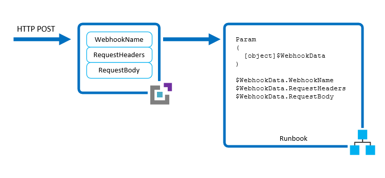

<properties
   pageTitle="Azure Automatisierung Webhooks | Microsoft Azure"
   description="Eine Webhook, mit dem einen Client eine Runbooks in Azure Automatisierung aus einem HTTP-Anruf beginnen kann.  Dieser Artikel beschreibt, wie zum Erstellen einer Webhook und wie Sie eine zum Starten einer Runbooks aufrufen."
   services="automation"
   documentationCenter=""
   authors="mgoedtel"
   manager="jwhit"
   editor="tysonn" />
<tags
   ms.service="automation"
   ms.devlang="na"
   ms.topic="article"
   ms.tgt_pltfrm="na"
   ms.workload="infrastructure-services"
   ms.date="09/12/2016"
   ms.author="magoedte;bwren;sngun"/>

# Azure Automatisierung webhooks

Eine *Webhook* können Sie einen bestimmten Runbooks in Azure Automatisierung durch eine einzelne HTTP-Anforderung zu starten. Dadurch wird die externe Diensten wie Visual Studio Team Services, GitHub oder benutzerdefinierten Programmen Runbooks starten, ohne eine vollständige Lösung mithilfe der Azure Automation API implementieren.  

Sie können an andere Methoden zum Starten einer Runbooks in [einer Runbooks in Azure Automatisierung starten](automation-starting-a-runbook.md) Webhooks vergleichen.

## Details zu einer webhook

Die folgende Tabelle beschreibt die Eigenschaften, die Sie für eine Webhook konfigurieren müssen.

| Eigenschaft | Beschreibung |
|:---|:---|
|Namen | Sie können einen beliebigen Namen bereitstellen, die Sie für eine Webhook, da diese nicht an den Kunden verfügbar gemacht wird.  Sie wird nur für Sie zum Identifizieren des Runbooks in Azure Automatisierung.    Als bewährte Methode sollten Sie die Webhook geben einen Namen im Zusammenhang mit dem Client, der sie verwendet werden. |
|URL |Die URL der Webhook ist eine eindeutige Adresse, die einem Client aufgerufen wird mit einer HTTP-POST zum Starten des Runbooks mit der Webhook verknüpft sind.  Es wird automatisch generiert, wenn Sie die Webhook erstellen.  Sie können keine benutzerdefinierte URL angeben.      Die URL enthält ein Sicherheitstoken, mit dem des Runbooks durch eine Drittanbieter-System ohne weiteren Authentifizierung aufgerufen werden kann. Daher sollten sie wie ein Kennwort behandelt werden.  Aus Gründen der Sicherheit können Sie nur die URL der Azure-Portal gleichzeitig anzeigen, wenn die Webhook erstellt wird. Beachten Sie die URL an einem sicheren Ort für eine zukünftige Verwendung.   |
|Ablaufdatum | Wie ein Zertifikat weist jede Webhook ein Ablaufdatum, welche gleichzeitig es nicht mehr verwendet werden kann.  Diese Ablaufdatum kann nicht geändert werden, nachdem die Webhook wird erstellt, und die Webhook auch kann nicht wieder aktiviert werden, nachdem das Ablaufdatum erreicht ist.  In diesem Fall müssen Sie ein anderes Webhook zum Ersetzen der aktuellen Zeile und aktualisieren Sie den Client zum Verwenden der neuen Webhook erstellen. |
| Aktiviert | Eine Webhook ist standardmäßig aktiviert, wenn er erstellt wird.  Falls Sie es deaktiviert, werden keine Client Möglichkeit zur gemeinsamen Nutzung wäre.  Beim Erstellen der Webhook oder einem beliebigen Zeitpunkt einmal sie erstellt wurde, können Sie die Eigenschaft **aktiviert** festlegen. |

### Parameter
Eine Webhook kann Werte für Parameter Runbooks definieren, die verwendet werden, wenn durch die Webhook des Runbooks gestartet wird. Die Webhook kann muss Werte für alle Parameter obligatorisch des Runbooks enthalten und Werte für optionale Parameter. Ein Parameterwert so konfiguriert, dass eine Webhook kann auch nach dem Erstellen der Webhoook geändert werden. Mehrere Webhooks mit einer einzelnen Runbooks verknüpft sind, können jede verschiedene Parameterwerte verwenden.

Wenn ein Client eine Runbooks mit einem Webhook gestartet wird, können sie nicht in der Webhook definierten Parameterwerte überschreiben.  Zum Empfangen von Daten aus dem Client kann des Runbooks einen einzelnen Parameter namens **$WebhookData** vom Typ [Object], die Daten enthalten sollen, die der Kunden in die POST-Anforderung umfasst akzeptieren.

Das **$WebhookData** -Objekt hat die folgenden Eigenschaften:

| Eigenschaft | Beschreibung |
|:--- |:---|
| WebhookName | Der Name der Webhook.  |
| RequestHeader | Hashtabelle, enthält die Kopfzeilen der eingehenden Anforderung bereitstellen. |
| RequestBody | Der Text des BEITRAGS eingehende anfordern.  Behält diese Formatierung, wie die Zeichenfolge, JSON, XML, oder Formular-codierte Daten. Des Runbooks muss mit dem Datenformat arbeiten, die möglicherweise geschrieben werden.|

Es ist keine Konfiguration für die Webhook erforderlich, um den Parameter **$WebhookData** unterstützen, und des Runbooks ist nicht erforderlich, um es zu übernehmen.  Wenn die Runbooks den Parameter nicht festgelegt wird, klicken Sie dann alle Details der Anforderung vom Client gesendet wird ignoriert.

Wenn Sie einem Wert für $WebhookData beim Erstellen der Webhook angeben Wert überschrieben werden kann, die beim Start von der Webhook des Runbooks mit den Daten aus der Anforderung Client bereitstellen, auch wenn der Client keine Daten im Hauptteil Anforderung enthalten ist.  Wenn Sie eine Runbooks starten, verwenden eine andere Methode als eine Webhook $WebhookData hat, können Sie einen Wert für $Webhookdata bereitstellen, die durch die Runbooks erkannt werden.  Dieser Wert sollte eines Objekts mit der gleichen [Eigenschaften](#details-of-a-webhook) wie $Webhookdata sein, damit des Runbooks ordnungsgemäß zur Verfügung steht, als wäre sie mit der tatsächlichen WebhookData einer Webhook übergebener gearbeitet hat.

Angenommen, wenn Sie das Azure-Portal die folgenden Runbooks beginnend werden und einige Beispiele für WebhookData zum Testen, übergeben, da WebhookData Objekt ist möchten, sollte es als JSON in der Benutzeroberfläche übergeben werden.

Für die oben genannten Runbooks, wenn Sie die folgenden Eigenschaften für den Parameter WebhookData haben:

1. WebhookName: *MyWebhook*
2. RequestHeader: *= Teststatistik eines Benutzers*
3. RequestBody: *["VM1", "VM2"]*

Sie möchten den folgenden JSON-Wert in der Benutzeroberfläche für den Parameter WebhookData übergeben:  

* {"WebhookName": "MyWebhook", "RequestHeader": {"Von": "Benutzer Test"}, "RequestBody": "[\"VM1\",\"VM2\"]"}

>[AZURE.NOTE] Die Werte für alle Eingabeparameter werden mit den Auftrag Runbooks protokolliert.  Dies bedeutet, dass eine Eingabe vom Client in der Anforderung Webhook bereitgestellten werden protokollierte und jede Person mit Zugriff auf den Auftrag Automatisierung zur Verfügung.  Daher sollten Sie überlegen, einschließlich vertraulichen Informationen in Webhook aufrufen.

## Sicherheit

Die Sicherheit von einer Webhook basiert auf den Datenschutz für die URL, die ein Sicherheitstoken, die enthält mit dem aufgerufen werden können. Azure Automatisierung führt keine Authentifizierung auf die Anforderung, solange sie die richtige URL gestellt wird. Daher sollten Webhooks nicht für Runbooks verwendet werden, die hoch sensible Funktionen ausführen, ohne eine alternative Möglichkeit für die Anfrage überprüfen.

Sie können die Logik innerhalb des Runbooks, um festzustellen, dass es von einer Webhook aufgerufen wurde, indem Sie die Eigenschaft **WebhookName** des Parameters $WebhookData einbeziehen. Des Runbooks konnte weiteren Überprüfung anhand bestimmter Informationen in den Eigenschaften **RequestHeader** oder **RequestBody** ausgeführt werden.

Eine andere Strategie besteht darin, des Runbooks Validierung einige einer externen Bedingung, wenn es sich um eine Anforderung Webhook empfangen haben.  Angenommen Sie, eine Runbooks, die durch GitHub aufgerufen wird, wenn ein neuer Commit zu einem GitHub Repository vorhanden ist.  Des Runbooks möglicherweise verbinden, um zu überprüfen, ob ein neuer Commit tatsächlich nur, bevor Sie fortfahren stattgefunden GitHub.

## Erstellen einer webhook

Verwenden Sie das folgende Verfahren zum Erstellen einer neuen Webhook mit einer Runbooks Azure-Portal verknüpft sind.

1. Klicken Sie aus dem **Runbooks Blade** Azure-Portal auf die Runbooks, die die Webhook gestartet werden kann, deren Blade Details anzeigen.
3. Klicken Sie auf **Webhook** am oberen Rand der Blade um das Blade **Webhook hinzufügen** zu öffnen.  

4. Klicken Sie auf **neue Webhook erstellen** , um das **Erstellen Webhook Blade**zu öffnen.
5. Geben Sie einen **Namen**, **Ablaufdatum** für die Webhook und gibt an, ob es aktiviert werden soll. [Details zu einer Webhook](#details-of-a-webhook) Weitere Informationen finden Sie diese Eigenschaften.
6. Klicken Sie auf das Symbol "Kopieren", und drücken Sie STRG + C, um die URL der Webhook zu kopieren.  Zeichnen Sie es dann an einem sicheren Ort ein.  **Nach dem Erstellen der Webhook abrufen keine erneut die URL.**  

3. Klicken Sie auf **Parameter** , um Werte für die Parameter Runbooks bereitzustellen.  Wenn des Runbooks obligatorische Parameter aufweist, werden dann Sie nicht möglicherweise die Webhook zu erstellen, es sei denn, Werte bereitgestellt werden.
1. Klicken Sie auf **Erstellen** , um die Webhook zu erstellen.

## Verwenden einer webhook

Wenn Sie eine Webhook verwenden, nachdem er erstellt wurde, muss die Clientanwendung HTTP POST mit der URL für die Webhook ausgeben.  Die Syntax der Webhook werden in folgendem Format.

    http://<Webhook Server>/token?=<Token Value>

Der Client erhält eine der folgenden Codes zurückgegeben aus der Anforderung bereitstellen.  

| Code | Text | Beschreibung |
|:---|:----|:---|
| 202 | Akzeptiert | Die Anforderung wurde angenommen, und des Runbooks wurde erfolgreich in der Warteschlange. |
| 400 | Ungültige Anforderung | Die Anforderung wurde für eine der folgenden Gründe nicht akzeptiert. <ul> <li>Die Webhook ist abgelaufen.</li> <li>Die Webhook ist deaktiviert.</li> <li>Das Token in der URL ist ungültig.</li>  </ul>|
| 404 | Nicht gefunden |  Die Anforderung wurde für eine der folgenden Gründe nicht akzeptiert. <ul> <li>Die Webhook wurde nicht gefunden.</li> <li>Des Runbooks wurde nicht gefunden.</li> <li>Das Konto wurde nicht gefunden.</li>  </ul> |
| 500 | Interner Serverfehler | Die URL war gültig, doch ist ein Fehler aufgetreten.  Senden Sie die Anfrage erneut.  |

Vorausgesetzt, dass die Anforderung erfolgreich ist, enthält die Antwort Webhook die Auftrags-Id im JSON-Format wie folgt. Es wird eine einzelne Auftrags-Id enthalten, aber das JSON-Format für potenziellen zukünftigen Erweiterungen ermöglicht.

    {"JobIds":["<JobId>"]}  

Der Client kann nicht bestimmen, wann Runbooks Auftragsabschluss oder deren Fertigstellung Status aus der Webhook.  Sie können diese Informationen verwenden die Auftrags-Id, mit einer anderen Methode wie [Windows PowerShell](http://msdn.microsoft.com/library/azure/dn690263.aspx) oder der [Azure Automation API](https://msdn.microsoft.com/library/azure/mt163826.aspx)ermitteln.

### Beispiel

Im folgende Beispiel wird mit Windows PowerShell eine Runbooks mit einem Webhook gestartet.  Beachten Sie, dass jede Sprache, die eine HTTP-Anforderung vornehmen kann eine Webhook; Windows PowerShell ist gerade verwendeten hier als Beispiel.

Eine Liste von virtuellen Computern formatiert JSON im Textkörper der Anfrage erwartet des Runbooks. Wir werden auch einschließlich Informationen, die des Runbooks und das Datum und die Uhrzeit gestartet wird, dass es in der Kopfzeile der Anfrage gestartet wird.      

    $uri = "https://s1events.azure-automation.net/webhooks?token=8ud0dSrSo%2fvHWpYbklW%3c8s0GrOKJZ9Nr7zqcS%2bIQr4c%3d"
    $headers = @{"From"="user@contoso.com";"Date"="05/28/2015 15:47:00"}

    $vms  = @(
                @{ Name="vm01";ServiceName="vm01"},
                @{ Name="vm02";ServiceName="vm02"}
            )
    $body = ConvertTo-Json -InputObject $vms

    $response = Invoke-RestMethod -Method Post -Uri $uri -Headers $headers -Body $body
    $jobid = ConvertFrom-Json $response

Die folgende Abbildung zeigt die Kopfzeileninformationen (mit einer Spur [Fiddler](http://www.telerik.com/fiddler) ) aus dieser Anforderung. Dies umfasst standard Header einer HTTP-Anforderung zusätzlich benutzerdefinierte Datums- und von Überschriften, die wir hinzugefügt.  Jeder dieser Werte ist des Runbooks in der Eigenschaft **RequestHeaders** **WebhookData**zur Verfügung.

Die folgende Abbildung zeigt den Hauptteil der Anforderung (mit einer Spur [Fiddler](http://www.telerik.com/fiddler) ), die die Runbooks in der Eigenschaft **RequestBody** **WebhookData**zur Verfügung steht. Dies wird als JSON formatiert, da, die das Format wurde, das in den Textkörper der Anfrage enthalten.     

Die folgende Abbildung zeigt die Anforderung von Windows PowerShell und die resultierende Antwort gesendet werden.  Die Auftrags-Id aus der Antwort extrahiert und in eine Zeichenfolge konvertiert.

Im folgenden Beispiel Runbooks nimmt die vorherigen Beispiel an, und startet den virtuellen Computern im Hauptteil Anforderung angegeben.

    workflow Test-StartVirtualMachinesFromWebhook
    {
        param (
            [object]$WebhookData
        )

        # If runbook was called from Webhook, WebhookData will not be null.
        if ($WebhookData -ne $null) {

            # Collect properties of WebhookData
            $WebhookName    =   $WebhookData.WebhookName
            $WebhookHeaders =   $WebhookData.RequestHeader
            $WebhookBody    =   $WebhookData.RequestBody

            # Collect individual headers. VMList converted from JSON.
            $From = $WebhookHeaders.From
            $VMList = ConvertFrom-Json -InputObject $WebhookBody
            Write-Output "Runbook started from webhook $WebhookName by $From."

            # Authenticate to Azure resources
            $Cred = Get-AutomationPSCredential -Name 'MyAzureCredential'
            Add-AzureAccount -Credential $Cred

            # Start each virtual machine
            foreach ($VM in $VMList)
            {
                $VMName = $VM.Name
                Write-Output "Starting $VMName"
                Start-AzureVM -Name $VM.Name -ServiceName $VM.ServiceName
            }
        }
        else {
            Write-Error "Runbook mean to be started only from webhook."
        }
    }

## Starten Sie als Antwort auf Azure Benachrichtigungen runbooks

Webhook aktiviert Runbooks kann auf [Azure Benachrichtigungen](../monitoring-and-diagnostics/insights-receive-alert-notifications.md)reagieren verwendet werden. Ressourcen in Azure können durch die Erfassung von Statistiken wie Leistung, Verfügbarkeit und Verwendung mit Hilfe der Azure Benachrichtigungen überwacht werden. Sie können eine Benachrichtigung basierend auf Kriterien für die Überwachung erhalten oder Ereignisse für Ihre Azure-Ressourcen derzeit Automatisierung Konten unterstützt nur Kennzahlen. Wenn der Wert einer angegebenen Metrik den zugewiesen überschreitet oder das konfigurierte Ereignis ausgelöst wird, und dann eine Benachrichtigung zur Dienstadministrator oder co-Administratoren gesendet wird, um die Warnung zu beheben, Weitere Informationen zum Maße und Ereignisse Näheres [Azure Benachrichtigungen](../monitoring-and-diagnostics/insights-receive-alert-notifications.md).

Neben der Verwendung von Azure Benachrichtigungen als Benachrichtigungssystem, können Sie auch deaktivieren Runbooks Reaktion auf Benachrichtigungen Starten eines. Automatisierung Azure ermöglicht das Webhook aktiviert Runbooks mit Azure Benachrichtigungen ausführen. Wenn eine Metrik überschreitet der konfigurierten Schwellenwert klicken Sie dann die Regel aktiv, und löst das Webhook Automatisierung, das wiederum des Runbooks ausgeführt wird.

### Kontext der Warnung

Erwägen Sie eine Azure Ressource z. B. eines virtuellen Computers, CPU-Auslastung des Computers ist eine der Key Performance Metrik. Ist die CPU-Auslastung 100 % oder mehr als einem bestimmten Zeitraum für längere Zeit, empfiehlt es sich, die virtuellen Computern zum Beheben des Problems neu zu starten. Dies gelöst werden kann, indem Sie eine Benachrichtigung Regel des virtuellen Computers konfigurieren und diese Regel dauert Prozentsatz der CPU als deren Metrisch. Prozentsatz der CPU-hier ist nur als Beispiel durchgeführt, aber es gibt viele anderer Größen, die Sie, zu Ihrer Azure Ressourcen konfigurieren können und einen Neustart des virtuellen Computers ist eine Aktion, um dieses Problem zu beheben ist, können Sie Konfigurieren des Runbooks, um andere Aktionen auszuführen.

Wenn dies die Regel aktiv, und löst des Runbooks Webhook aktiviert, sendet den Kontext der Warnung an des Runbooks. [Kontext der Warnung](../monitoring-and-diagnostics/insights-receive-alert-notifications.md) enthält Details einschließlich **SubscriptionID**, **ResourceGroupName**, **Ressourcenname**, **ResourceType**, **ResourceId** und **Timestamp** für des Runbooks zum Identifizieren der Ressource, an der sie die Aktion aufzeichnen, erforderlich sind. Kontext der Warnung in den Textkörper Teil des Runbooks gesendet **WebhookData** Objekts eingebettet ist und **Webhook.RequestBody** Eigenschaft zugegriffen werden kann

### Beispiel

Erstellen Sie einer Azure-virtuellen Computern im Rahmen Ihres Abonnements, und ordnen Sie eine [Benachrichtigung CPU Prozentsatz Metrisch überwachen](../monitoring-and-diagnostics/insights-receive-alert-notifications.md). Stellen Sie beim Erstellen der Benachrichtigung sicher, dass Sie das Feld "Webhook" mit der URL der Webhook auffüllen, die beim Erstellen der Webhook generiert wurde.

Im folgenden Beispiel Runbooks wird ausgelöst, wenn die Regel aktiviert wird, und die Kontext der Warnung Parameter für des Runbooks zum Identifizieren der Ressource sammelt, an der sie die Aktion aufzeichnen, erforderlich sind.

    workflow Invoke-RunbookUsingAlerts
    {
        param (     
            [object]$WebhookData
        )

        # If runbook was called from Webhook, WebhookData will not be null.
        if ($WebhookData -ne $null) {   
            # Collect properties of WebhookData.
            $WebhookName    =   $WebhookData.WebhookName
            $WebhookBody    =   $WebhookData.RequestBody
            $WebhookHeaders =   $WebhookData.RequestHeader

            # Outputs information on the webhook name that called This
            Write-Output "This runbook was started from webhook $WebhookName."

            # Obtain the WebhookBody containing the AlertContext
            $WebhookBody = (ConvertFrom-Json -InputObject $WebhookBody)
            Write-Output "`nWEBHOOK BODY"
            Write-Output "============="
            Write-Output $WebhookBody

            # Obtain the AlertContext     
            $AlertContext = [object]$WebhookBody.context

            # Some selected AlertContext information
            Write-Output "`nALERT CONTEXT DATA"
            Write-Output "==================="
            Write-Output $AlertContext.name
            Write-Output $AlertContext.subscriptionId
            Write-Output $AlertContext.resourceGroupName
            Write-Output $AlertContext.resourceName
            Write-Output $AlertContext.resourceType
            Write-Output $AlertContext.resourceId
            Write-Output $AlertContext.timestamp

            # Act on the AlertContext data, in our case restarting the VM.
            # Authenticate to your Azure subscription using Organization ID to be able to restart that Virtual Machine.
            $cred = Get-AutomationPSCredential -Name "MyAzureCredential"
            Add-AzureAccount -Credential $cred
            Select-AzureSubscription -subscriptionName "Visual Studio Ultimate with MSDN"

            #Check the status property of the VM
            Write-Output "Status of VM before taking action"
            Get-AzureVM -Name $AlertContext.resourceName -ServiceName $AlertContext.resourceName
            Write-Output "Restarting VM"

            # Restart the VM by passing VM name and Service name which are same in this case
            Restart-AzureVM -ServiceName $AlertContext.resourceName -Name $AlertContext.resourceName
            Write-Output "Status of VM after alert is active and takes action"
            Get-AzureVM -Name $AlertContext.resourceName -ServiceName $AlertContext.resourceName
        }
        else  
        {
            Write-Error "This runbook is meant to only be started from a webhook."  
        }  
    }

## Nächste Schritte

- Details auf verschiedenen Methoden zum Starten einer Runbooks finden Sie unter [Starten eines Runbooks](automation-starting-a-runbook.md)
- Informationen zum Anzeigen des Status einer Runbooks Job finden Sie [in Azure Automatisierung Runbooks](automation-runbook-execution.md) -auszuführen
- Wie Azure Automatisierung bezüglich Azure Benachrichtigungen finden Sie unter [Beheben Azure virtueller Computer Benachrichtigungen mit Automatisierung Runbooks](automation-azure-vm-alert-integration.md)
