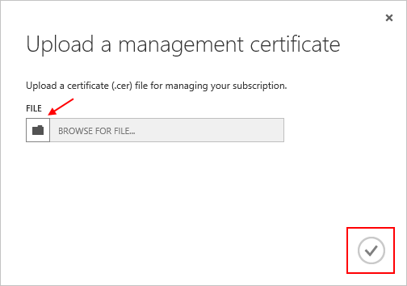

<properties 
    pageTitle="Hochladen einer Azure Management API Zertifikat | Microsoft Azure" 
    description="Erfahren Sie, wie eine Management-API Zertifikat für das klassische Azure-Portal hochladen." 
    services="cloud-services" 
    documentationCenter=".net" 
    authors="Thraka" 
    manager="timlt" 
    editor=""/>

<tags 
    ms.service="na" 
    ms.workload="tbd" 
    ms.tgt_pltfrm="na" 
    ms.devlang="na" 
    ms.topic="article" 
    ms.date="04/18/2016"
    ms.author="adegeo"/>

# Hochladen einer Azure Management-API Management Zertifikat

Verwaltung von Zertifikaten können Sie mit der Verwaltung von Azure bereitgestellten API authentifizieren. Viele Programme und Tools (z. B. Visual Studio oder das Azure SDK) werden diese Zertifikate Vorlagen zum Automatisieren von Konfiguration und Bereitstellung von verschiedenen Azure Services verwenden. **Dies gilt nur für klassische Azure-Portal**an. 

>[AZURE.WARNING] Sei vorsichtig! Diese Arten von Zertifikaten zulassen jede Person, die authentifiziert mit ihnen das Abonnement zu verwalten, denen, dem Sie zugeordnet sind. 

Weitere Informationen zu Azure Zertifikate (einschließlich Erstellen eines selbstsignierten Zertifikats) ist [verfügbar](cloud-services/cloud-services-certs-create.md#what-are-management-certificates) für Sie bei Bedarf.

[Azure Active Directory](/services/active-directory/) können Sie auch ein Client-Code aus Gründen der Automatisierung authentifiziert wird.

## Hochladen eines Zertifikats management

Nachdem Sie eine Management Zertifikat erstellt, (CER-Datei mit nur den öffentlichen Schlüssel) haben, können Sie diese in das Portal hochladen. Wenn das Zertifikat im Portal verfügbar ist, kann jede Person mit einem übereinstimmenden Certficiate (privater Schlüssel) Verbinden über die Management-API und Zugriff auf die Ressourcen für das Abonnement verknüpft.

1. Melden Sie sich bei der [Azure klassischen Portal](http://manage.windowsazure.com)werden soll.

2. Vergewissern Sie sich, um das richtige Abonnement auszuwählen, dem Sie ein Zertifikat mit zuordnen möchten. Drücken Sie in der oberen rechten Ecke des Portals **Abonnements** Text ein.

    

3. Nachdem Sie das richtige Abonnement ausgewählt haben, drücken Sie die **Einstellungen** auf der linken Seite des Portals (möglicherweise müssen einen Bildlauf nach unten). 
    
    

4. Drücken Sie die Registerkarte **Verwaltungszertifikate** aus.

    
    
5. Drücken Sie die Schaltfläche **Hochladen** aus.

    
    
6. Füllen Sie im Dialogfeld Informationen ein, und drücken Sie die Fertig **Häkchen**.

    

## Nächste Schritte

Jetzt, da Sie eine Management Zertifikat ein Abonnement zugeordnet haben, können (nachdem Sie das passende Zertifikat lokal installiert haben) Programmgesteuertes Verbinden mit dem [Dienst Management REST-API](https://msdn.microsoft.com/library/azure/mt420159.aspx) und automatisieren die verschiedenen Azure Ressourcen, die auch die Abonnement zugeordnet sind. 