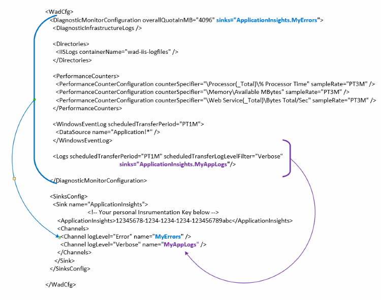

<properties
   pageTitle="Konfigurieren von Azure-Diagnose zum Senden von Daten an die Anwendung Einsichten | Microsoft Azure"
   description="Aktualisieren der öffentlichen Azure-Diagnose-Konfigurations zum Senden von Daten an die Anwendung Einsichten an."
   services="multiple"
   documentationCenter=".net"
   authors="sbtron"
   manager="douge"
   editor="" />
<tags
   ms.service="application-insights"
   ms.devlang="na"
   ms.topic="article"
   ms.tgt_pltfrm="na"
   ms.workload="na"
   ms.date="12/15/2015"
   ms.author="saurabh" />

# Konfigurieren von Azure-Diagnose zum Senden von Daten an die Anwendung Einsichten

Azure Diagnose werden Daten in Tabellen Azure Storage gespeichert.  Allerdings können Sie auch alle Pipe oder eine Teilmenge der Daten Anwendung Einsichten durch "senken" und "Kanäle" in der Konfiguration konfigurieren, wenn Azure-Diagnose Erweiterung 1.5 oder höher verwenden.

In diesem Artikel beschrieben, wie Sie die öffentliche Konfiguration für die Erweiterung Azure-Diagnose erstellen, damit deren konfigurierten zum Senden von Daten in der Anwendung Einblicken.

## Konfigurieren von Anwendung Einblicken als ein Empfänger

Die Erweiterung Azure Diagnose 1,5 führt die **<SinksConfig>** Element im öffentlichen Konfiguration. Definiert die zusätzliche *Empfänger* , in dem die Diagnosedaten Azure gesendet werden kann. Sie können angeben, dass die Details der Anwendung Einsichten Ressource, an der Sie die Azure-Diagnosedaten im Rahmen dieser senden möchten **<SinksConfig>**.
Beispiel für sieht **SinksConfig** -  

    <SinksConfig>
        <Sink name="ApplicationInsights">
          <ApplicationInsights>{Insert InstrumentationKey}</ApplicationInsights>
          <Channels>
            <Channel logLevel="Error" name="MyTopDiagData"  />
            <Channel logLevel="Verbose" name="MyLogData"  />
          </Channels>
        </Sink>
      </SinksConfig>

Für das Element **Empfänger** gibt das Attribut *Name* einen Zeichenfolgenwert aus, der an den Empfänger eindeutig verweisen verwendet werden.
Das Element **ApplicationInsights** gibt Instrumentation Schlüssel der Anwendung Einsichten Ressource, in dem die Diagnosedaten Azure gesendet wird. Wenn Sie eine vorhandene Anwendung Einsichten Ressource besitzen, finden Sie unter [Erstellen einer neuen Anwendung Einsichten Ressource](./application-insights/app-insights-create-new-resource.md) für Weitere Informationen zum Erstellen einer Ressource und erste Instrumentation-Taste.

Wenn Sie ein Projekt Cloud-Dienst mit Azure SDK 2,8 entwickeln wird dieser Taste Instrumentation im öffentlichen Konfiguration basierend auf Zusammenstellen von **APPINSIGHTS_INSTRUMENTATIONKEY** , wenn das Projekt für den Cloud-Dienst Verpacken automatisch ausgefüllt. Finden Sie unter [Verwenden Anwendung Einsichten mit Azure-Diagnose von Problemen mit Cloud-Dienst](./cloud-services/cloud-services-dotnet-diagnostics-applicationinsights.md).

Das Element **Kanäle** können Sie eine oder mehrere **Channel** -Elemente für die Daten zu definieren, die an den Empfänger gesendet wird. Der Kanal verhält sich wie ein Filter und ermöglicht es Ihnen, bestimmte Log Ebenen markieren möchten, auf den Empfänger zu senden. Beispiel Sie ausführliche Protokolle sammeln und an Speicher gesendet werden konnte, doch stehen auch zum Definieren von eines Kanals mit einer Logebene des Fehlers und beim Senden von Protokollen durch, dass nur Fehlerprotokolle Kanal an die Empfänger gesendet werden.
Für einen **Kanal** wird das Attribut *Namen* verwendet, eindeutig auf diesen Channel verweisen.
Das Attribut *Loglevel* können Sie die Ebene angeben, die der Kanal verwendet werden kann. Verfügbare Protokollebenen in der Reihenfolge der am häufigsten mindestens Informationen werden
 - Ausführliche
 - Informationen
 - Warnung
 - Fehler
 - Kritische

## Senden von Daten an den Empfänger Anwendung Einblicken
Nachdem Sie der Anwendung Einsichten Empfänger definiert haben können Sie Daten an die Empfänger senden, durch das Attribut *Empfänger* auf die Elemente unter dem **DiagnosticMonitorConfiguration** Knoten hinzufügen. Hinzufügen des Elements *senken* an jeden Knoten gibt an, die Daten aus, und alle Knoten darunter an den angegebenen Empfänger gesendet werden soll.

Beispielsweise wenn Sie alle Daten, die von der Azure-Diagnose gesammelt, senden möchten können dann Sie das Attribut *Empfänger* direkt auf den **DiagnosticMonitorConfiguration** Knoten hinzufügen. Legen Sie den Wert von den *Empfängern* auf den Empfänger Namen, der in der **SinkConfig**angegeben wurde.

    <DiagnosticMonitorConfiguration overallQuotaInMB="4096" sinks="ApplicationInsights">

Wenn Sie nur Fehlerprotokolle, um die Anwendung Einsichten empfangen, können Sie den Wert *senken* Name der Empfänger, gefolgt vom Channelnamen durch einen Punkt getrennt sein festlegen senden wollten ("."). Verwenden Sie beispielsweise nur Fehlerprotokolle an die Anwendung Einsichten senden Empfänger den MyTopDiagdata erstellen die in der obigen SinksConfig definiert wurde.  

    <DiagnosticMonitorConfiguration overallQuotaInMB="4096" sinks="ApplicationInsights.MyTopDiagdata">

Wenn Sie ausführliche Anwendungsprotokolle an Anwendung Einsichten senden wollten, möchten Sie das Attribut *senken* auf den Knoten **Protokolle** hinzufügen.

    <Logs scheduledTransferPeriod="PT1M" scheduledTransferLogLevelFilter="Verbose" sinks="ApplicationInsights.MyLogData"/>

Sie können auch mehrere senken in der Konfiguration auf verschiedenen Ebenen in der Hierarchie einbeziehen. In diesem Fall fungiert der Empfänger auf der obersten Ebene der Hierarchie angegebenen als eine globale Einstellung und eine bei der einzelnes Element Element verhält sich wie eine überschreibt die globale Einstellung angegeben.    

Hier ist ein vollständiges Beispiel der öffentlichen Konfigurationsdatei, die alle Fehler Anwendung Einsichten (am **DiagnosticMonitorConfiguration** Knoten angegeben) und darüber hinaus ausführliche Ebene Protokolle für die Anwendungsprotokolle (bei den Knoten **Protokolle** angegeben) sendet ein.

    <WadCfg>
      <DiagnosticMonitorConfiguration overallQuotaInMB="4096"
           sinks="ApplicationInsights.MyTopDiagData"> <!-- All info below sent to this channel -->
        <DiagnosticInfrastructureLogs />
        <PerformanceCounters>
          <PerformanceCounterConfiguration counterSpecifier="\Processor(_Total)\% Processor Time" sampleRate="PT3M" sinks="ApplicationInsights.MyLogData/>
          <PerformanceCounterConfiguration counterSpecifier="\Memory\Available MBytes" sampleRate="PT3M" />
          <PerformanceCounterConfiguration counterSpecifier="\Web Service(_Total)\Bytes Total/Sec" sampleRate="PT3M" />
        </PerformanceCounters>
        <WindowsEventLog scheduledTransferPeriod="PT1M">
          <DataSource name="Application!*" />
        </WindowsEventLog>
        <Logs scheduledTransferPeriod="PT1M" scheduledTransferLogLevelFilter="Verbose"
                sinks="ApplicationInsights.MyLogData"/> <!-- This specific info sent to this channel -->
      </DiagnosticMonitorConfiguration>

    <SinksConfig>
        <Sink name="ApplicationInsights">
          <ApplicationInsights>{Insert InstrumentationKey}</ApplicationInsights>
          <Channels>
            <Channel logLevel="Error" name="MyTopDiagData"  />
            <Channel logLevel="Verbose" name="MyLogData"  />
          </Channels>
        </Sink>
      </SinksConfig>
    </WadCfg>

Es bestehen einige Einschränkungen mithilfe dieser Funktion berücksichtigen

- Kanäle sind nur für die Arbeit mit Log Typ und nicht-Datenquellen auffällt. Wenn Sie einen Kanal mit einem Element der Leistung Zähler angeben wird es ignoriert.
- Die Ebene für einen Kanal kann die Ebene für die von der Azure-Diagnose gesammelt wird nicht überschreiten. Beispielsweise: nicht möglich Anwendung protokollieren Fehler in das Element Protokolle sammeln und versuchen Sie, ausführlich senden an den Empfänger Anwendung Einblicke Protokolle. Das Attribut *ScheduledTransferLogLevelFilter* muss immer gleich erfassen oder weitere Protokolle als die Protokolle Sie versuchen, zu einem Empfänger zu senden.
- Sie können keine Anwendung Einsichten BLOB-Daten von Azure Diagnose Erweiterung zusammengestellten senden. Beispielsweise alles, was unter den Knoten *Verzeichnisse* angegeben. Für Absturz sichert wird die tatsächliche Absturzabbild weiterhin an BLOB-Speicher gesendet werden, und nur eine Benachrichtigung, dass das Absturzspeicherabbild generiert wurde an Anwendung Einsichten gesendet.

## Nächste Schritte

- Verwenden Sie [PowerShell](./cloud-services/cloud-services-diagnostics-powershell.md) , um die Erweiterung Azure Diagnose für eine Anwendung zu aktivieren. 
- Verwenden Sie [Visual Studio](vs-azure-tools-diagnostics-for-cloud-services-and-virtual-machines.md) , um die Erweiterung Azure Diagnose für eine Anwendung zu aktivieren
