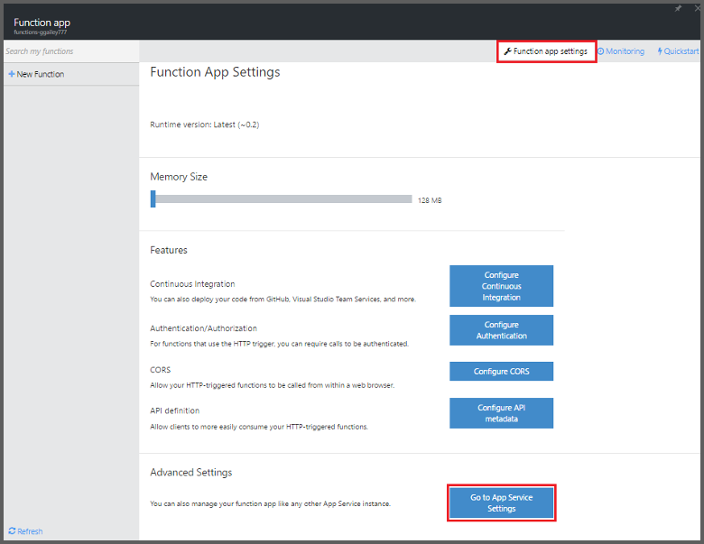

<properties
    pageTitle="Azure Funktionen Mobile-Apps Bindungen | Microsoft Azure"
    description="Verstehen Sie, wie Azure Mobile-Apps Bindungen in Azure-Funktionen verwenden."
    services="functions"
    documentationCenter="na"
    authors="ggailey777"
    manager="erikre"
    editor=""
    tags=""
    keywords="Azure-Funktionen, Funktionen Verarbeitung von Ereignissen, dynamische berechnen, ohne Server Architektur"/>

<tags
    ms.service="functions"
    ms.devlang="multiple"
    ms.topic="reference"
    ms.tgt_pltfrm="multiple"
    ms.workload="na"
    ms.date="08/30/2016"
    ms.author="glenga"/>

# Azure Funktionen Mobile-Apps Bindungen

[AZURE.INCLUDE [functions-selector-bindings](../../includes/functions-selector-bindings.md)]

In diesem Artikel wird erläutert, wie so konfigurieren Sie Code Azure Mobile-Apps Bindungen in Azure-Funktionen. 

[AZURE.INCLUDE [intro](../../includes/functions-bindings-intro.md)] 

Azure App Dienst Mobile-Apps können Sie die Tabelle Endpunktdaten für mobile Clients verfügbar zu machen. Diese derselben Tabellendaten mit beide Eingaben verwendet werden können und ausgeben Bindungen in Azure-Funktionen. Da dynamische Schema unterstützt wird, ist eine Node.js Back-End-mobile-app ideal für Tabellendaten mit Ihrer Funktionen verfügbar zu machen. Dynamische Schema ist standardmäßig aktiviert und deaktiviert werden sollen, in eine Herstellung mobile-app. Weitere Informationen zu Tabelle Endpunkten in einem Node.js Back-End-finden Sie unter [Übersicht: Tabelle Vorgänge](../app-service-mobile/app-service-mobile-node-backend-how-to-use-server-sdk.md#TableOperations). Mobile-Apps unterstützt die Node.js Back-End-im Portal durchsuchen und Bearbeiten von Tabellen. Weitere Informationen finden Sie im Thema Node.js SDK [im Portal bearbeiten](../app-service-mobile/app-service-mobile-node-backend-how-to-use-server-sdk.md#in-portal-editing) . Wenn Sie eine .NET Back-End-mobile-app mit Azure-Funktionen verwenden, müssen Sie Ihr Datenmodell nach Bedarf durch die Funktion manuell aktualisieren. Weitere Informationen zu Tabelle Endpunkten in einer .NET Back-End-mobile-app finden Sie unter [wie: definieren einen Tabelle Controller](../app-service-mobile/app-service-mobile-dotnet-backend-how-to-use-server-sdk.md#define-table-controller) im Thema .NET Back-End-SDK. 

## Erstellen Sie eine Umgebungsvariable für Ihre mobile-app Back-End-URL

Mobile-Apps Bindungen erfordern aktuell eine Umgebungsvariable zu erstellen, die die URL der mobilen app Back-End-selbst zurückgibt. Diese URL kann im [Azure-Portal](https://portal.azure.com) durch mobile-app suchen und öffnen das Blade gefunden werden.

So legen Sie diese URL als eine Umgebungsvariable-, die in Ihrer app (Funktion) fest:

1. In der Funktion app im [Portal Azure-Funktionen](https://functions.azure.com/signin), klicken Sie auf **Einstellungen für die Funktion app** > **App-Service-Einstellungen**. 

    

2. Klicken Sie in Ihrer app (Funktion) auf **Alle Einstellungen**, einen Bildlauf zum **Anwendungseinstellungen**, klicken Sie dann unter **Einstellungen für die App** -Typ einen neuen **Namen** für die Umgebungsvariable, fügen Sie die URL in **Wert**sicherzustellen, verwenden Sie das HTTPS-Schema, und klicken Sie dann auf **Speichern** und schließen Sie das app-Blade (Funktion), um zu den Funktionen Portal zurückzukehren.   

    

Sie können jetzt in der Bindungen dieser neuen Umgebungsvariable als Feld *Verbindung* festlegen.

## Verwenden Sie eine API-Taste, um den sicheren Zugriff auf Ihre Mobile-Apps Tabelle Endpunkte.

In Azure-Funktionen lassen Sie mit mobilen Tabelle Bindungen ein API Key angeben, d. h. einen geheimen, der verhindern, dass unerwünschte Access-apps als Ihre Funktionen verwendet werden können. Integrierten Unterstützung für die API Key Authentifizierung keinen Mobile-Apps. Allerdings können Sie, indem Sie die Beispiele in [Azure App Dienst Mobile-Apps Back-End-Implementieren eines API-Schlüssels](https://github.com/Azure/azure-mobile-apps-node/tree/master/samples/api-key)einen API-Schlüssel in Ihrer Node.js Back-End-mobile-app implementieren. Sie können einen API-Schlüssel auf ähnliche Weise in eine [.NET Back-End-mobile-app](https://github.com/Azure/azure-mobile-apps-net-server/wiki/Implementing-Application-Key)implementieren.

>[AZURE.IMPORTANT] API Schlüssel muss nicht mit Ihrem mobilen app-Clients verteilt werden, sie sollten nur an verteilt werden sicher angeordneten Service-Clients, wie Azure-Funktionen. 

## Azure Mobile-Apps Eingabemethoden Bindung

Eingabe Bindungen können Laden ein Datensatzes aus einer Tabelle mobile-Endpunkt und direkt an Ihre Bindung zu übergeben. Der Eintrag, den ID bestimmt wird, auf der Grundlage des Triggers, der die Funktion aufgerufen. In einer C#-Funktion werden alle Änderungen vorgenommen werden, um den Eintrag automatisch wieder in der Tabelle gesendet, wenn die Funktion erfolgreich beendet wird.

#### Function.JSON für die Eingabewerte Bindung Mobile-Apps

Die Datei *function.json* unterstützt die folgenden Eigenschaften:

- `name`: Variablenname Funktion Code für den neuen Datensatz verwendet.
- `type`: Biding Typ muss *MobileTable*festgelegt werden.
- `tableName`: Die Tabelle, in der neue Datensatz erstellt werden soll.
- `id`: Die ID des Datensatzes, abgerufen werden soll. Diese Eigenschaft unterstützt Bindungen ähnlich wie `{queueTrigger}`, welche wird den Zeichenfolgenwert der Warteschlange Nachricht als den Eintrag ID verwenden
- `apiKey`: Zeichenfolge, die die anwendungseinstellung ist, die angibt, den optionalen API Schlüssel für die mobile-app. Dies ist erforderlich, wenn Ihre mobile-app eine API-Taste zum Einschränken des Clientzugriffs verwendet.
- `connection`: Zeichenfolge, die den Namen der Umgebungsvariablen-, die in den Anwendungseinstellungen ist, die den URL für Ihre mobile-app Back-End-angibt.
- `direction`: Bindung Richtung, die *im*festgelegt werden muss.

Beispiel *function.json* -Datei:

    {
      "bindings": [
        {
          "name": "record",
          "type": "mobileTable",
          "tableName": "MyTable",
          "id" : "{queueTrigger}",
          "connection": "My_MobileApp_Url",
          "apiKey": "My_MobileApp_Key",
          "direction": "in"
        }
      ],
      "disabled": false
    }

#### Azure Beispiels Mobile-Apps für eine C#-Warteschlange auslösen

Basierend auf der oben genannten, für das function.json von Beispiel die Eingabewerte Bindung übernimmt der Eintrag aus einer Mobile-Apps Tabelle Endpunkt die ID, die Zeichenfolge der Warteschlange entspricht, und übergibt an den *Eintrag* Parameter. Wenn Sie der Eintrag nicht gefunden wird, ist der Parameter null. Der Eintrag wird dann mit *dem neuen Textwert* aktualisiert, wenn die Funktion beendet wird.

    #r "Newtonsoft.Json"    
    using Newtonsoft.Json.Linq;
    
    public static void Run(string myQueueItem, JObject record)
    {
        if (record != null)
        {
            record["Text"] = "This has changed.";
        }    
    }

#### Azure Beispiels Mobile-Apps für einen Node.js Warteschlange trigger

Basierend auf der oben genannten, für das function.json von Beispiel die Eingabewerte Bindung übernimmt der Eintrag aus einer Mobile-Apps Tabelle Endpunkt die ID, die Zeichenfolge der Warteschlange entspricht, und übergibt an den *Eintrag* Parameter. In Node.js-Funktionen sind aktualisierte Datensätzen nicht wieder in der Tabelle gesendet. In diesem Codebeispiel schreibt den abgerufenen Datensatz in das Protokoll.

    module.exports = function (context, input) {    
        context.log(context.bindings.record);
        context.done();
    };

## Azure Mobile-Apps ausgeben Bindung

Die Funktion kann einen Datensatz zu einem Mobile-Apps Tabelle Endpunkt mithilfe einer Bindung Ausgabe geschrieben werden. 

#### Function.JSON für Mobile-Apps ausgeben Bindung

Die Datei function.json unterstützt die folgenden Eigenschaften:

- `name`: Variablenname Funktion Code für den neuen Datensatz verwendet.
- `type`: Bindung Geben Sie die *MobileTable*festgelegt werden muss.
- `tableName`: Die Tabelle, in dem neue Datensatz erstellt wird.
- `apiKey`: Zeichenfolge, die die anwendungseinstellung ist, die angibt, den optionalen API Schlüssel für die mobile-app. Dies ist erforderlich, wenn Ihre mobile-app eine API-Taste zum Einschränken des Clientzugriffs verwendet.
- `connection`: Zeichenfolge, die den Namen der Umgebungsvariablen-, die in den Anwendungseinstellungen ist, die den URL für Ihre mobile-app Back-End-angibt.
- `direction`: Bindung Richtung, die auf *sich*festgelegt werden muss.

Beispiel für function.json:

    {
      "bindings": [
        {
          "name": "record",
          "type": "mobileTable",
          "tableName": "MyTable",
          "connection": "My_MobileApp_Url",
          "apiKey": "My_MobileApp_Key",
          "direction": "out"
        }
      ],
      "disabled": false
    }

#### Azure Mobile-Apps Beispiels für ein C#-Warteschlange trigger

In diesem C#-Codebeispiel fügt einen neuen Datensatz in einer Mobile-Apps Tabelle Endpunkt mit einer *Text* -Eigenschaft in der Tabelle in der obigen Bindung angegeben.

    public static void Run(string myQueueItem, out object record)
    {
        record = new {
            Text = $"I'm running in a C# function! {myQueueItem}"
        };
    }

#### Azure Beispiels Mobile-Apps für eine Node.js Warteschlange auslösen

In diesem Beispiel der Node.js Code Fügt einen neuen Datensatz in einer Mobile-Apps Tabelle Endpunkt mit einer *Text* -Eigenschaft in der Tabelle in der obigen Bindung angegeben.

    module.exports = function (context, input) {
    
        context.bindings.record = {
            text : "I'm running in a Node function! Data: '" + input + "'"
        }   
    
        context.done();
    };

## Nächste Schritte

[AZURE.INCLUDE [next steps](../../includes/functions-bindings-next-steps.md)]
