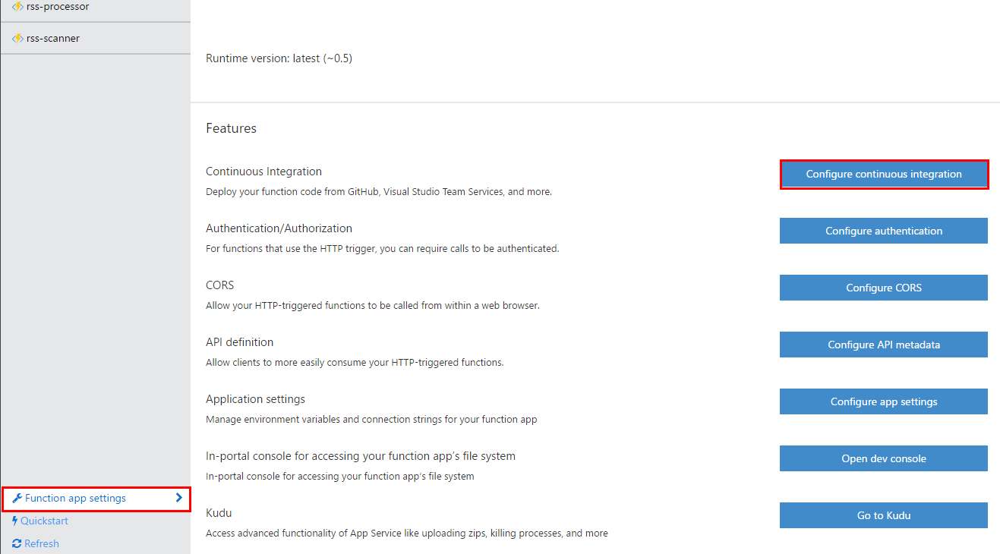
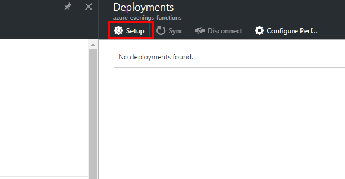
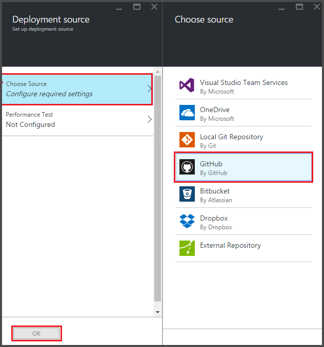
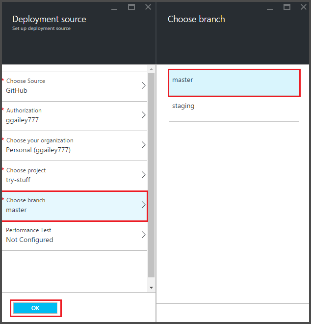
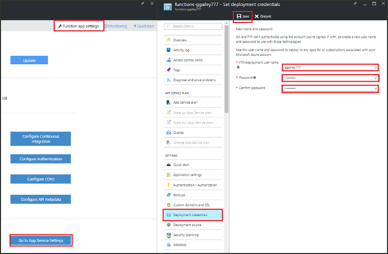
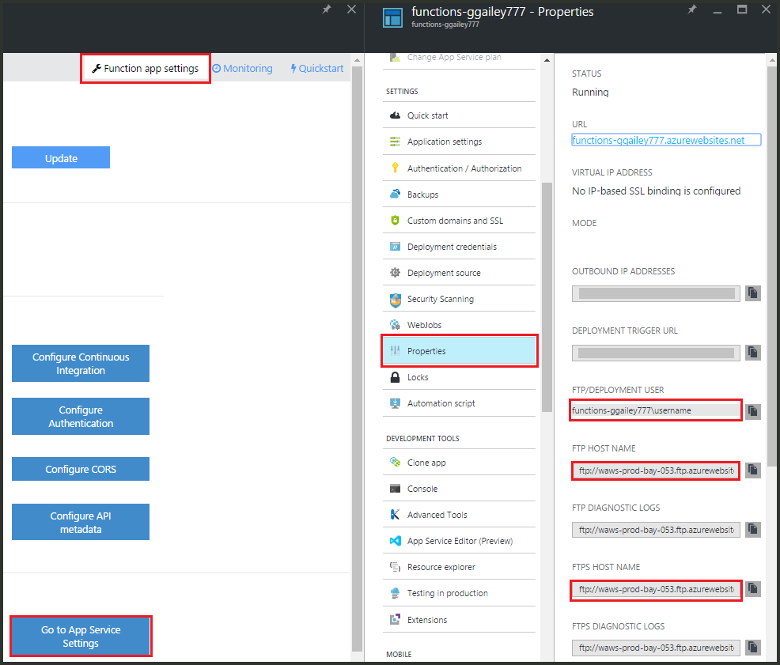
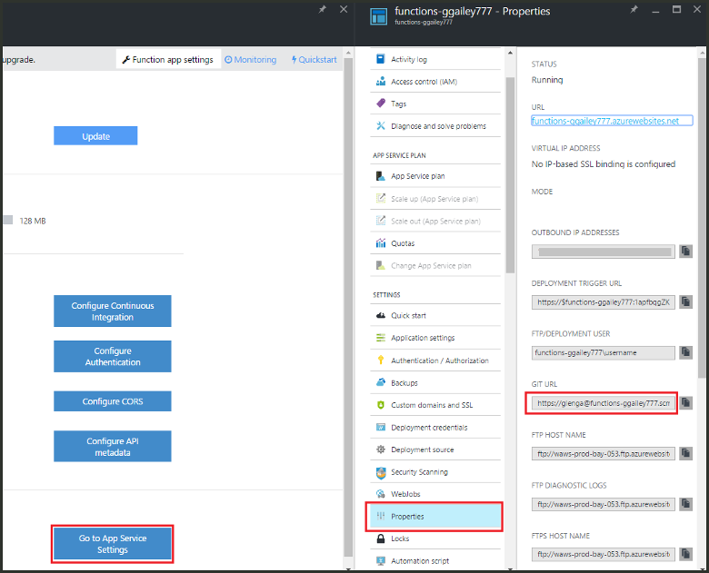

<properties
   pageTitle="Fortlaufender Bereitstellung für Azure Funktionen | Microsoft Azure"
   description="Verwenden Sie kontinuierliche Bereitstellung Fertigungsanlagen der App-Verwaltungsdienst Azure, um Ihre Azure-Funktionen zu veröffentlichen."
   services="functions"
   documentationCenter="na"
   authors="ggailey777"
   manager="erikre"
   editor=""
   tags=""
   />

<tags
   ms.service="functions"
   ms.devlang="multiple"
   ms.topic="article"
   ms.tgt_pltfrm="multiple"
   ms.workload="na"
   ms.date="09/25/2016"
   ms.author="glenga"/>

# Fortlaufender Bereitstellung für Azure-Funktionen 

Azure Funktionen erleichtert die kontinuierliche Bereitstellung für Ihre app Funktion konfigurieren. Funktionen nutzt Azure-App-Verwaltungsdienst-Integration in BitBucket Dropbox, GitHub und Visual Studio Team Services (VSTS) So aktivieren Sie einen kontinuierlichen Bereitstellungsworkflow, Azure, wenn sie auf einen der folgenden Dienste veröffentlicht werden die Updates dem Code Funktionen abruft. Wenn Sie neu bei Azure-Funktionen sind, beginnen Sie mit [Übersicht über Azure-Funktionen](functions-overview.md).

Fortlaufender Bereitstellung ist eine gute Option für Projekte, in dem mehrere und häufig verwendeten Spenden integriert sind. Außerdem können Sie die Datenquellen-Steuerelement für den Code der Funktionen zu verwalten. Die folgenden Quellen Bereitstellung werden derzeit unterstützt:

+ [Bitbucket](https://bitbucket.org/)
+ [Dropbox](https://bitbucket.org/)
+ [Lokale Repo Git](../app-service-web/app-service-deploy-local-git.md)
+ Externe Repo Git
+ [GitHub]
+ Weshalb externen repo
+ [OneDrive](https://onedrive.live.com/)
+ Visual Studio Team Services

Bereitstellungen sind für pro-Funktion-app konfiguriert. Nachdem fortlaufender Bereitstellung aktiviert ist, den Zugriff auf die Funktionscode im Portal auf festgelegt ist *schreibgeschützt*.

## Fortlaufender Bereitstellung Anforderungen

Sie müssen Ihre Bereitstellung Quelle konfiguriert und Code Funktionen in der Quelle Bereitstellung, bevor Sie ansetzen fortlaufender Bereitstellung verfügen. In einer bestimmten Funktion app-Bereitstellung jede Funktion befindet sich in einem benannten Unterverzeichnis, es ist der Name des Verzeichnisses den Namen der Funktion. Diese Ordnerstruktur ist im Wesentlichen die Code Ihrer Website an. 

[AZURE.INCLUDE [functions-folder-structure](../../includes/functions-folder-structure.md)]

## Fortlaufender Bereitstellung einrichten

Verwenden Sie das folgende Verfahren, um kontinuierliche Bereitstellung für eine vorhandene Funktion app zu konfigurieren:

1. In der Funktion app im [Portal Azure-Funktionen](https://functions.azure.com/signin), klicken Sie auf **Einstellungen für die Funktion app** > **Konfigurieren fortlaufende Integration** > **Einrichten**.

    
    
    
    
    Sie können auch an die Bereitstellungen Blade aus den Funktionen Schnellstart abrufen, indem Sie auf **Start aus Datenquellen-Steuerelement**.

2. Klicken Sie in der Blade-Bereitstellungen auf **Quelle auswählen**, dann Fill-in die Informationen für die Bereitstellung der ausgewählten Datenquelle, und klicken Sie auf **OK**.

    

Nach der Bereitstellung fortlaufender konfiguriert ist, werden alle Änderungen Dateien in der Quelle für die Bereitstellung mit der Funktion kopiert und eine vollständige Website-Bereitstellung ausgelöst. Die Website wird erneut bereitgestellt werden, wenn Dateien in der Quelle aktualisiert werden.

##Optionen für die Bereitstellung

Es folgen einige typische Bereitstellungsszenarien:

+ 

###Erstellen einer staging bereitstellungs

Funktion Apps unterstützt keine noch Bereitstellung Steckplätze. Allerdings können Sie weiterhin separate Staging und Herstellung Bereitstellungen mit fortlaufender Integration verwalten.

Der Prozess zum Konfigurieren von und Arbeiten mit einer staging Bereitstellung sieht grundsätzlich wie folgt aus:

1. Erstellen Sie zwei Funktion apps in Ihrem Abonnement, eine für die Herstellung Code und eine für das Staging aus. 

2. Erstellen einer Quelle Bereitstellung an, wenn Sie eine bereits besitzen. Wir verwenden [GitHub].
 
3. Führen Sie für Ihre app Herstellung (Funktion) die obigen Schritte in **fortlaufender Bereitstellung einrichten** und Festlegen der Bereitstellung Verzweigung in den master Zweig von Ihrem GitHub Repo.

    

4. Wiederholen Sie diesen Schritt für das staging Funktion app, jedoch diesmal wählen Sie die staging Verzweigung in Ihrer GitHub Repo aus. Wenn Ihre Bereitstellung Quelle Verzweigen unterstützt, verwenden Sie einen anderen Ordner aus.
 
5. Stellen Sie Updates auf den Code in das staging Zweig oder den Ordner, und stellen Sie sicher, dass diese Änderungen in der staging Bereitstellung angezeigt werden.

6. Nach dem Testen von Änderungen zusammenführen aus der staging Verzweigung in der Gestaltungsvorlage Verzweigung. Dadurch wird die Bereitstellung mit der Funktion Herstellung ausgelöst. Wenn Ihre Bereitstellung Quelle Verzweigungen nicht unterstützt, durch überschrieben Sie die Dateien im Ordner Herstellung mit den Dateien aus dem Stagingordner.

###Verschieben einer vorhandene Funktionen in fortlaufender Bereitstellung

Wenn Sie vorhandene Funktionen, die Sie erstellt haben, und im Portal verwaltet werden, müssen Sie Ihre vorhandene Funktion Code-Dateien über FTP Herunterladen oder lokale Git Repository vor dem ansetzen fortlaufender Bereitstellung können, wie zuvor beschrieben haben. Sie können in der App-Service-Einstellungen für Ihre app Funktion ausführen. Nachdem Sie Ihre Dateien heruntergeladen werden, können Sie diese zu Ihrer ausgewählten fortlaufender Bereitstellung hinzufügen hochladen.

>[AZURE.NOTE]Nachdem Sie fortlaufenden Integration konfiguriert haben, werden Sie nicht mehr möglich, Ihre Quelldateien im Portal Funktionen zu bearbeiten.

####So: Konfigurieren der Anmeldeinformationen für die Bereitstellung
Bevor Sie die Dateien aus der Funktion app herunterladen können, müssen Sie Ihre Anmeldeinformationen ein, um die Website aufzurufen, die Sie aus dem Portal ausführen können konfigurieren. Anmeldeinformationen sind auf der Ebene der Funktion app festgelegt.

1. In der Funktion app im [Portal Azure-Funktionen](https://functions.azure.com/signin), klicken Sie auf **Einstellungen für die Funktion app** > **Wechseln Sie zu der App-diensteinstellungen** > **Bereitstellung Anmeldeinformationen**.

    

2. Geben Sie Ihren Benutzernamen und Ihr Kennwort ein, und klicken Sie auf **Speichern**. Diese Anmeldeinformationen können jetzt die Funktion app FTP- oder die integrierten Git Repo zugreifen.

####So: Herunterladen von Dateien mit FTP

1. In der Funktion app im [Portal Azure-Funktionen](https://functions.azure.com/signin), klicken Sie auf **Einstellungen für die Funktion app** > **Wechseln Sie zu der App-diensteinstellungen** > **Eigenschaften** und kopieren Sie die Werte für **Benutzer FTP-/ Bereitstellung**, **FTP-Hostname**und **FTPS Host Name**.  
**FTP-Bereitstellung/Benutzer** müssen eingegeben werden, wie im Portal, einschließlich den Namen der Anwendung, um richtige Kontext für den FTP-Server bereitstellen angezeigt.

    
    
2. Von der FTP-Client, verwenden Sie die Verbindungsinformationen gesammelt werden, um eine Verbindung mit Ihrer app und die Quelldateien für Ihre Funktionen herunterladen.

####So: Herunterladen von Dateien mit lokalen Git Repository

1. In der Funktion app im [Portal Azure-Funktionen](https://functions.azure.com/signin), klicken Sie auf **Einstellungen für die Funktion app** > **Konfigurieren fortlaufende Integration** > **Einrichten**.

2. Klicken Sie in der Blade-Bereitstellungen auf **Quelle auswählen**, **lokale Git Repository**, dann auf **OK**.
 
3. Klicken Sie auf **Gehe zu App diensteinstellungen** > **Eigenschaften** und beachten Sie den Wert der Git URL. 
    
    

4. Klonen der Repo auf Ihrem lokalen Computer mit einer Git-fähige Befehlszeile oder Ihre bevorzugten Git Tool an. Der Befehl Git Klonen sieht wie folgt aus:

        git clone https://username@my-function-app.scm.azurewebsites.net:443/my-function-app.git

5. Zum Abrufen von Dateien aus der Funktion app zu den Klonen auf Ihrem lokalen Computer, wie im folgenden Beispiel:

        git pull origin master

    Wenn Sie aufgefordert werden, geben Sie den Benutzernamen und das Kennwort für die Bereitstellung der Funktion app aus.  

[GitHub]: https://github.com/
