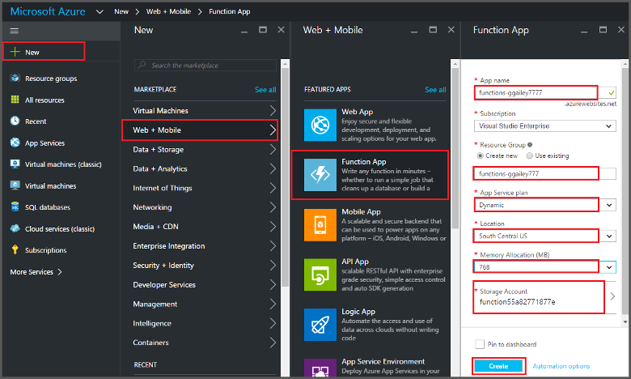
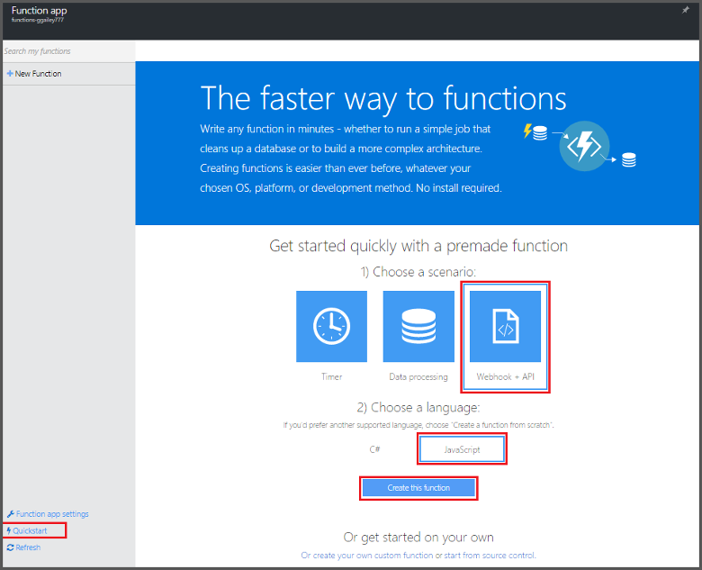
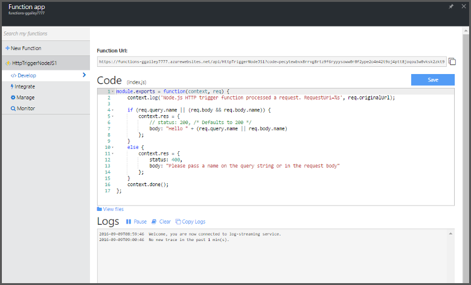

<properties
   pageTitle="Erstellen Sie eine Funktion aus dem Portal Azure | Microsoft Azure"
   description="Erstellen Sie Ihrer ersten Azure-Funktion, einer ohne Server-Anwendung in weniger als zwei Minuten."
   services="functions"
   documentationCenter="na"
   authors="ggailey777"
   manager="erikre"
   editor=""
   tags=""
/>

<tags
   ms.service="functions"
   ms.devlang="multiple"
   ms.topic="article"
   ms.tgt_pltfrm="multiple"
   ms.workload="na"
   ms.date="09/08/2016"
   ms.author="glenga"/>

#Erstellen Sie eine Funktion aus dem Azure-portal

##(Übersicht)
Azure Funktionen ist eine ereignisgesteuerten, berechnen bei Bedarf, die erweitert die vorhandene Azure-Anwendungsplattform mit Funktionen, die von Ereignissen ausgelöst in anderen Azure Services, SaaS Produkte und lokale Systeme Code implementiert wird. Ihre Applikationen skalieren basierend auf Demand Azure-Funktionen und Zahlen Sie nur für die Ressourcen, die Sie nutzen. Azure Funktionen ermöglicht Ihnen das Erstellen geplant oder Einheiten von Code in verschiedenen Sprachen implementiert ausgelöst. Um weitere Informationen zur Azure-Funktionen finden Sie unter [Übersicht über Azure-Funktionen](functions-overview.md).

In diesem Thema wird gezeigt, wie das Azure Portal verwenden, um das Erstellen eines einfachen "Hallo Welt" Node.js Azure-Funktion, die von einem HTTP-Trigger aufgerufen wird. Bevor Sie eine Funktion im Azure-Portal erstellen können, müssen Sie eine Funktion app explizit in Azure-App-Verwaltungsdienst erstellen. Um die Funktion app automatisch für Sie erstellt haben, finden Sie unter [der anderen Funktionen Azure Schnellstart-Lernprogramm](functions-create-first-azure-function.md), das ist ein einfacher Schnellstart und ein Video enthält.

##Erstellen Sie eine app (Funktion)

Eine Funktion app hostet die Ausführung der Funktionen in Azure. Wie folgt vor, um eine Funktion app Azure-Portal zu erstellen.

Bevor Sie Ihre erste Funktion erstellen können, müssen Sie ein aktives Azure-Konto haben. Wenn Sie bereits über ein Azure-Konto, [stehen kostenlose Konten](https://azure.microsoft.com/free/)besitzen.

1. Wechseln Sie zu der [Azure-Portal](https://portal.azure.com) und mit Ihrem Azure-Konto anmelden.

2. Klicken Sie auf **+ neue** > **Web + Mobile** > **App (Funktion)**, wählen Sie Ihr **Abonnement**, geben Sie einen eindeutigen **Namen Anwendung** , die Ihre app Funktion identifiziert und geben Sie dann die folgenden Einstellungen:

    + **[Ressourcengruppe](../azure-portal/resource-group-portal.md/)**: Wählen Sie **neu erstellen** aus, und geben Sie einen Namen für die neue Ressourcengruppe. Sie können auch eine vorhandene Ressourcengruppe auswählen, doch Sie möglicherweise nicht mehr zum Erstellen eines dynamischen App Serviceplan für Ihre app (Funktion).
    + **[App-Serviceplan](../app-service/azure-web-sites-web-hosting-plans-in-depth-overview.md)**: Wählen Sie entweder *dynamische* oder *klassische*. 
        + **Dynamische**: der Standardtyp Plan für Azure-Funktionen. Wenn Sie einen dynamischen Plan auswählen, müssen Sie auch wählen Sie den **Speicherort** und Festlegen der **Arbeitsspeicherzuteilung** (in MB). Informationen über den Einfluss arbeitsspeicherzuteilung Kosten, finden Sie unter [Preise Azure-Funktionen](https://azure.microsoft.com/pricing/details/functions/). 
        + **Klassische**: ein klassischer App Serviceplan erfordert, dass Sie eine **App-Dienst Plan/Speicherort** erstellen oder ein vorhandenes Layout auszuwählen. Diese Einstellungen bestimmen den [Speicherort, Features, Kosten und Berechnen von Ressourcen](https://azure.microsoft.com/pricing/details/app-service/) Ihre app zugeordnet.  
    + **Speicher-Konto**: jede Funktion app Speicherkonto erforderlich. Sie können ein vorhandenes Speicherkonto auswählen oder erstellen Sie eine. 

    

3. Klicken Sie auf **Erstellen** , bereitstellen und Bereitstellen Sie die neue Funktion app.  

Nachdem Sie nun die Funktion app bereitgestellt wird, können Sie Ihre erste Funktion erstellen.

## Erstellen einer Funktion

Erstellen Sie eine Funktion folgendermaßen aus den Schnellstart Azure-Funktionen.

1. Klicken Sie auf der Registerkarte **Schnellstart** klicken Sie auf **WebHook + API** und **JavaScript**und dann auf **Erstellen einer Funktion**. Eine neue vordefinierte Node.js-Funktion wird erstellt. 

    

2. (Optional) An diesem Punkt im Schnellstart können Sie eine kurze Übersicht über Funktionen Azure-Features im Portal ausführen.   Nachdem Sie die Tour übersprungen oder abgeschlossen haben, können Sie die neue Funktion mithilfe des HTTP-Triggers testen.

##Testen Sie die Funktion

Da der Azure-Funktionen Schnellstart funktionsübergreifendes Code enthalten, können Sie die neue Funktion sofort testen.

1. Überprüfen Sie im **Codefenster** der Registerkarte **Entwicklung** und beachten Sie, dass dieser Code Node.js eine HTTP-Anforderung mit einem Wert für *Name* im Nachrichtentext oder in einer Abfragezeichenfolge übergeben erwartet. Wenn die Funktion ausgeführt wird, wird dieser Wert in der Antwortnachricht zurückgegeben.

    

2. Führen Sie einen Bildlauf nach unten, bis das Textfeld **Textkörper anfordern** , ändern Sie den Wert der *Name* -Eigenschaft auf Ihren Namen, und klicken Sie auf **Ausführen**. Sie sehen, dass die Ausführung von einem Test HTTP-Anforderung ausgelöst wird, ist das streaming Protokolle Informationen geschrieben, und die Antwort "Hallo" in der **Ausgabe**angezeigt wird. 

3. Um die Ausführung der gleichen Funktion aus einem anderen Browserfenster oder Registerkarte ausgelöst wird, kopieren Sie den Wert für die **Funktion URL** , auf der Registerkarte **Entwicklung** und fügen Sie ihn in der Adressleiste des Browsers und dann den Wert der Abfragezeichenfolge Anfügen `&name=yourname` und drücken Sie die EINGABETASTE. Die gleiche Informationen werden in die Protokolle geschrieben und "Hallo" Antwort als vor dem wird im Browser angezeigt.

##Nächste Schritte

Dieser Schnellstart wird eine sehr einfache Ausführung einer einfachen HTTP-ausgelöste-Funktion veranschaulicht. Finden Sie unter folgenden Themen Weitere Informationen zu der Leistungsfähigkeit von Azure-Funktionen in Ihrer apps.

+ [Azure Funktionen Entwicklerreferenz](functions-reference.md)  
Programmierer Verweis für Codieren von Funktionen und Trigger und Bindungen definieren.
+ [Testen der Azure-Funktionen](functions-test-a-function.md)  
Beschreibt verschiedene Tools und Verfahren zum Testen der Funktionen.
+ [Zum Skalieren Azure-Funktionen](functions-scale.md)  
Werden Servicepläne erhältlich Azure-Funktionen, einschließlich der dynamischen Serviceplan und wie Sie den richtigen Plan auswählen. 
+ [Was ist die App-Verwaltungsdienst Azure?](../app-service/app-service-value-prop-what-is.md)  
Azure Funktionen verwendet die App-Verwaltungsdienst Azure-Plattform für Kernfunktionalität wie Bereitstellungen, Umgebungsvariablen und Diagnose. 

[AZURE.INCLUDE [Getting Started Note](../../includes/functions-get-help.md)]
