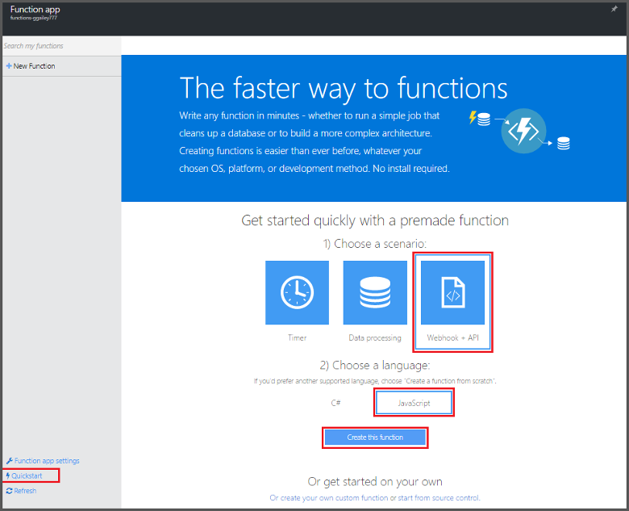
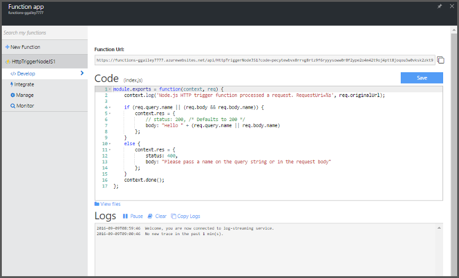

<properties
   pageTitle="Erstellen Ihrer ersten Azure-Funktion | Microsoft Azure"
   description="Erstellen Sie Ihrer ersten Azure-Funktion, einer ohne Server-Anwendung in weniger als zwei Minuten."
   services="functions"
   documentationCenter="na"
   authors="ggailey777"
   manager="erikre"
   editor=""
   tags=""
/>

<tags
   ms.service="functions"
   ms.devlang="multiple"
   ms.topic="hero-article"
   ms.tgt_pltfrm="multiple"
   ms.workload="na"
   ms.date="09/08/2016"
   ms.author="glenga"/>

#Erstellen Sie Ihrer ersten Azure-Funktion

##(Übersicht)
Azure Funktionen ist eine ereignisgesteuerten, berechnen bei Bedarf, die erweitert die vorhandene Azure-Anwendungsplattform mit Funktionen, die von Ereignissen ausgelöst in anderen Azure Services, SaaS Produkte und lokale Systeme Code implementiert wird. Ihre Applikationen skalieren basierend auf Demand Azure-Funktionen und Zahlen Sie nur für die Ressourcen, die Sie nutzen. Azure Funktionen ermöglicht Ihnen das Erstellen geplant oder Einheiten von Code in einer Vielzahl von Sprachen implementiert ausgelöst. Um weitere Informationen zur Azure-Funktionen finden Sie unter [Übersicht über Azure-Funktionen](functions-overview.md).

In diesem Thema wird gezeigt, wie den Schnellstart Azure-Funktionen im Portal verwenden, um eine einfache "Hallo Welt" Node.js-Funktion zu erstellen, die von einem HTTP-Trigger aufgerufen wird. Sie können auch in einem kurzen Video wird um anzuzeigen, wie diese Schritte im Portal ausgeführt werden.

## Video ansehen

Das folgende Video anzeigen, wie Sie die grundlegenden Schritte in diesem Lernprogramm ausführen. 

[AZURE.VIDEO create-your-first-azure-function-simple]

##Erstellen Sie eine Funktion aus den Schnellstart

Eine Funktion app hostet die Ausführung der Funktionen in Azure. Wie folgt vor, um eine neue Funktion app als auch die neue Funktion zu erstellen. Die neue Funktion app wird mit einer Standardkonfiguration erstellt. Ein Beispiel für die Funktion app explizit zu erstellen finden Sie unter [der anderen Funktionen Azure Schnellstart-Lernprogramm](functions-create-first-azure-function-azure-portal.md).

Bevor Sie Ihre erste Funktion erstellen können, müssen Sie ein aktives Azure-Konto haben. Wenn Sie bereits über ein Azure-Konto, [stehen kostenlose Konten](https://azure.microsoft.com/free/)besitzen.

1. Wechseln Sie zu dem [Portal Azure-Funktionen](https://functions.azure.com/signin) und mit Ihrem Azure-Konto anmelden.

2. Geben Sie einen eindeutigen **Namen** für Ihre neue Funktion app oder akzeptieren Sie die generierten ein, wählen Sie Ihr bevorzugtes **Region**und dann auf **Erstellen + erste Schritte**. 

3. Klicken Sie auf der Registerkarte **Schnellstart** klicken Sie auf **WebHook + API** und **JavaScript**und dann auf **Erstellen einer Funktion**. Eine neue vordefinierte Node.js-Funktion wird erstellt. 

    

4. (Optional) An diesem Punkt im Schnellstart können Sie eine kurze Übersicht über Funktionen Azure-Features im Portal ausführen.   Nachdem Sie die Tour übersprungen oder abgeschlossen haben, können Sie die neue Funktion mithilfe des HTTP-Triggers testen.

##Testen Sie die Funktion

Da der Azure-Funktionen Schnellstart funktionsübergreifendes Code enthalten, können Sie die neue Funktion sofort testen.

1. Überprüfen Sie im **Codefenster** der Registerkarte **Entwicklung** und beachten Sie, dass dieser Code Node.js eine HTTP-Anforderung mit einem Wert für *Name* im Nachrichtentext oder in einer Abfragezeichenfolge übergeben erwartet. Wenn die Funktion ausgeführt wird, wird dieser Wert in der Antwortnachricht zurückgegeben.

    

2. Führen Sie einen Bildlauf nach unten, bis das Textfeld **Textkörper anfordern** , ändern Sie den Wert der *Name* -Eigenschaft auf Ihren Namen, und klicken Sie auf **Ausführen**. Sehen Sie, dass Ausführung durch eine Test HTTP-Anforderung ausgelöst wird, ist das streaming Protokolle Informationen geschrieben, und die Antwort "Hallo" in der **Ausgabe**angezeigt wird. 

3. Um die Ausführung der gleichen Funktion aus einem anderen Browserfenster oder Registerkarte ausgelöst wird, kopieren Sie den Wert für die **Funktion URL** , auf der Registerkarte **Entwicklung** und fügen Sie ihn in der Adressleiste des Browsers und dann den Wert der Abfragezeichenfolge Anfügen `&name=yourname` und drücken Sie die EINGABETASTE. Die gleiche Informationen werden in die Protokolle geschrieben und "Hallo" Antwort als vor dem wird im Browser angezeigt.

##Nächste Schritte

Dieser Schnellstart wird eine sehr einfache Ausführung einer einfachen HTTP-ausgelöste-Funktion veranschaulicht. Finden Sie unter folgenden Themen für Weitere Informationen zur Nutzung der Azure-Funktionen in Ihrer apps.

+ [Azure Funktionen Entwicklerreferenz](functions-reference.md)  
Programmierer Verweis für Codieren von Funktionen und Trigger und Bindungen definieren.
+ [Testen der Azure-Funktionen](functions-test-a-function.md)  
Beschreibt verschiedene Tools und Verfahren zum Testen der Funktionen.
+ [Zum Skalieren Azure-Funktionen](functions-scale.md)  
Werden Servicepläne erhältlich Azure-Funktionen, einschließlich der dynamischen Serviceplan und wie Sie den richtigen Plan auswählen. 
+ [Was ist die App-Verwaltungsdienst Azure?](../app-service/app-service-value-prop-what-is.md)  
Azure-Funktionen verwendet, die App-Verwaltungsdienst Azure-Plattform für Kernfunktionalität wie Bereitstellungen, Umgebungsvariablen und Diagnose wird. 

[AZURE.INCLUDE [Getting Started Note](../../includes/functions-get-help.md)]
