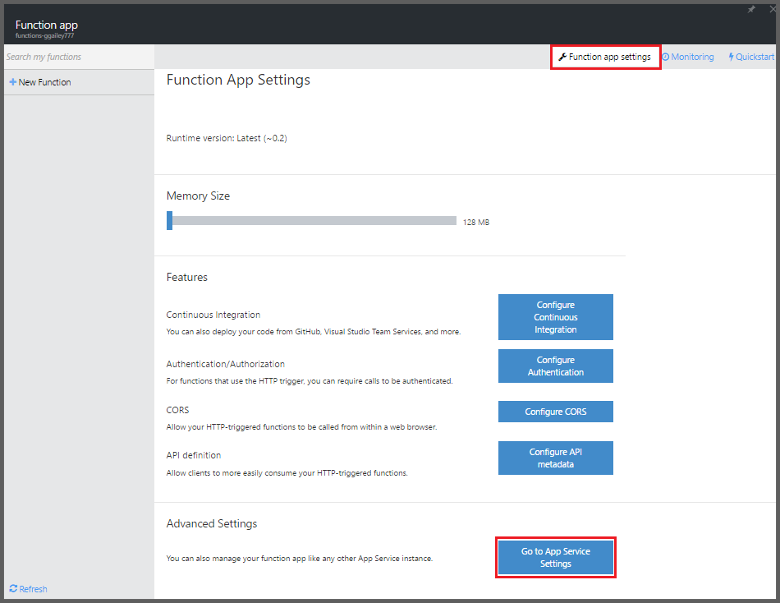
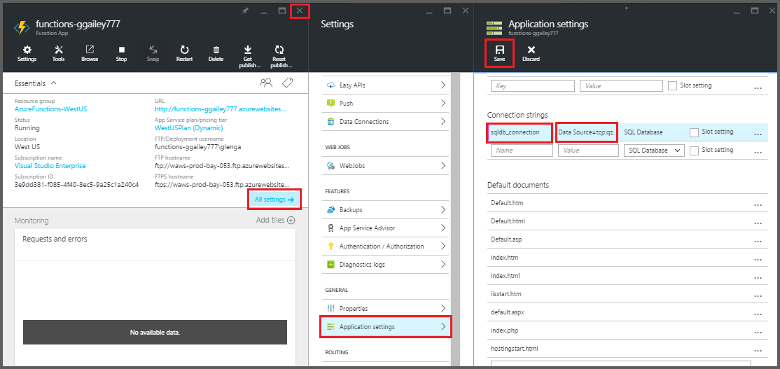
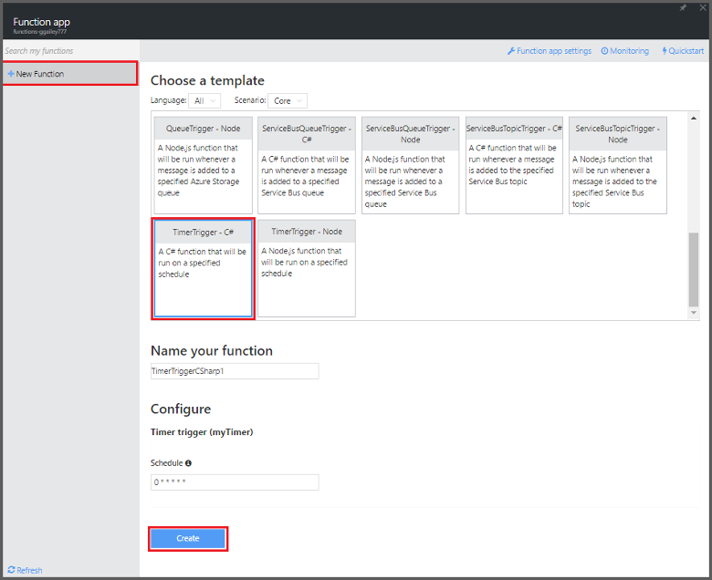

<properties
   pageTitle="Verwenden Sie zum Ausführen einer geplanten bereinigen Aufgabe Azure Funktionen | Microsoft Azure"
   description="Azure-Funktionen verwenden erstellen Sie eine C#-Funktion, die basierend auf ein Ereignis Timer ausgeführt wird."
   services="functions"
   documentationCenter="na"
   authors="ggailey777"
   manager="erikre"
   editor=""
   tags=""
   />

<tags
   ms.service="functions"
   ms.devlang="multiple"
   ms.topic="article"
   ms.tgt_pltfrm="multiple"
   ms.workload="na"
   ms.date="09/26/2016"
   ms.author="glenga"/>
   
# Verwenden Sie zum Ausführen einer geplanten bereinigen Aufgabe Azure-Funktionen

In diesem Thema wird gezeigt, wie Azure-Funktionen verwenden, um eine neue Funktion in c# zu erstellen, basierend auf ein Ereignis Timer zu bereinigen ausgeführt wird, Zeilen in einer Datenbanktabelle. Die neue Funktion wird basierend auf einer vordefinierten Vorlage im Portal Azure Funktionen erstellt. Um dieses Szenario zu unterstützen, müssen Sie auch eine Datenbank-Verbindungszeichenfolge als App-Dienst festlegen in der Funktion app festlegen. 

## Erforderliche Komponenten 

Bevor Sie eine Funktion erstellen können, müssen Sie ein aktives Azure-Konto haben. Wenn Sie bereits über ein Azure-Konto, [stehen kostenlose Konten](https://azure.microsoft.com/free/)besitzen.

Dieses Thema veranschaulicht einen Transact-SQL-Befehl, der eine Masse Aufräumen Operation Tabelle mit dem Namen *TodoItems* in einer SQL-Datenbank ausgeführt wird. In derselben TodoItems Tabelle wird erstellt, wenn Sie das [Schnellstart-Lernprogramm Azure App Dienst Mobile-Apps](../app-service-mobile/app-service-mobile-ios-get-started.md)abschließen. Sie können auch eine Beispieldatenbank verwenden, wenn Sie eine andere Tabelle verwenden, müssen Sie den Befehl ändern.

Sie können die Verbindungszeichenfolge von einer Back-End-für Mobile-App im Portal unter **Alle Einstellungen**verwendeten abrufen > **Anwendungseinstellungen** > **Verbindungszeichenfolgen** > **Werte der Verbindungszeichenfolge anzeigen** > **MS_TableConnectionString**. Sie können die Verbindungszeichenfolge direkte aus einer SQL-Datenbank im Portal unter **Alle Einstellungen**auch abrufen > **Eigenschaften** > **Datenbank Verbindungszeichenfolgen anzeigen** > **ADO.NET (SQL-Authentifizierung)**.

Dieses Szenario verwendet einen Massenvorgang mit der Datenbank. Damit Ihre Funktion Prozess einzelne Vorgänge in einer Tabelle Mobile-Apps, sollten Sie stattdessen die Mobile Tabelle Bindung verwenden.

## Einrichten einer Verbindungszeichenfolge SQL-Datenbank in der app (Funktion)

Eine Funktion app hostet die Ausführung der Funktionen in Azure. Es ist eine bewährte Methode zum Speichern von Verbindungszeichenfolgen und anderen vertraulichen in Ihren app-Einstellungen (Funktion). Dies verhindert unbeabsichtigte Veröffentlichung, wenn der Funktionscode endet in einer Repo dort auszurichten. 

1. Wechseln Sie zu dem [Portal Azure-Funktionen](https://functions.azure.com/signin) und mit Ihrem Azure-Konto anmelden.

2. Wenn Sie eine vorhandenen Funktion app zu verwenden, wählen Sie es in **Ihre apps Funktion** haben klicken Sie dann auf **Öffnen**. Zum Erstellen einer neuen Funktion app, geben Sie einen eindeutigen **Namen** für Ihre neue Funktion app oder übernehmen Sie die generierten, wählen Ihr bevorzugtes **Region**und dann auf **Erstellen + erste Schritte**. 

3. Klicken Sie in Ihrer app (Funktion) auf **Einstellungen für die Funktion app** > **App-Service-Einstellungen**. 

    

4. In Ihrer app (Funktion), klicken Sie auf **Alle Einstellungen**, führen Sie einen Bildlauf nach unten bis zum **Anwendungseinstellungen**, und klicken Sie dann unter Typ **Verbindungszeichenfolgen** `sqldb_connection` für **Name**, fügen Sie die Verbindungszeichenfolge in **Wert**, klicken Sie auf **Speichern**und dann schließen Sie das Funktion app Blade Funktionen-Portal zurück.

    

Nun können Sie den C#-Code (Funktion) hinzufügen, der eine Verbindung zu Ihrer SQL-Datenbank herstellt.

## Erstellen Sie eine Funktion Timer-ausgelöst wurde aus der Vorlage

1. Klicken Sie in Ihrer app (Funktion) auf **+ neue Funktion** > **TimerTrigger - C#-** > **Erstellen**. Dies erstellt eine Funktion mit einem Standardnamen, der für den standardmäßigen Zeitplan der einmal pro Minute ausgeführt wird. 

    

2. Fügen Sie im Bereich **Code** der **Entwicklung** Registerkarte am oberen Rand der vorhandenen Funktionscode Verweise auf die folgenden Assemblys hinzu:

        #r "System.Configuration"
        #r "System.Data"

3. Fügen Sie den folgenden `using` Anweisungen für die Funktion:

        using System.Configuration;
        using System.Data.SqlClient;
        using System.Threading.Tasks; 

4. Ersetzen Sie die vorhandene **Ausführen** -Funktion mit den folgenden Code ein:

        public static async Task Run(TimerInfo myTimer, TraceWriter log)
        {
            var str = ConfigurationManager.ConnectionStrings["sqldb_connection"].ConnectionString;
            using (SqlConnection conn = new SqlConnection(str))
            {
                conn.Open();
                var text = "DELETE from dbo.TodoItems WHERE Complete='True'";
                using (SqlCommand cmd = new SqlCommand(text, conn))
                {
                    // Execute the command and log the # rows deleted.
                    var rows = await cmd.ExecuteNonQueryAsync();
                    log.Info($"{rows} rows were deleted");
                }
            }
        }

5. Klicken Sie auf **Speichern**, schauen Sie sich die **Protokolle** Fenster für die Ausführung der nächsten (Funktion), und notieren Sie die Anzahl der Zeilen aus der Tabelle TodoItems gelöscht.

6. (Optional) Mit [Mobile-Apps Schnellstart app](../app-service-mobile/app-service-mobile-ios-get-started.md), kennzeichnen Sie weitere Elemente wie "abgeschlossen" dann **Protokolle** zurückzukehren und überwachen die gleiche Anzahl von Zeilen Abrufen von der Funktion während der Ausführung des nächsten gelöscht. 

##Nächste Schritte

Finden Sie unter folgenden Themen für Weitere Informationen zu Azure-Funktionen.

+ [Azure Funktionen Entwicklerreferenz](functions-reference.md)  
Programmierer Verweis für Codieren von Funktionen und Trigger und Bindungen definieren.
+ [Testen der Azure-Funktionen](functions-test-a-function.md)  
Beschreibt verschiedene Tools und Verfahren zum Testen der Funktionen.
+ [Zum Skalieren Azure-Funktionen](functions-scale.md)  
Werden Servicepläne erhältlich Azure-Funktionen, einschließlich der dynamischen Serviceplan und wie Sie den richtigen Plan auswählen.  

[AZURE.INCLUDE [Getting Started Note](../../includes/functions-get-help.md)]