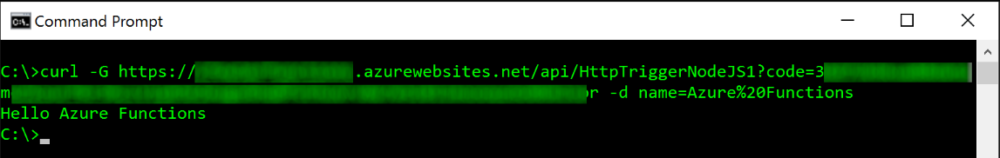
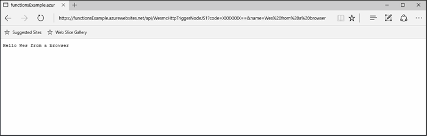
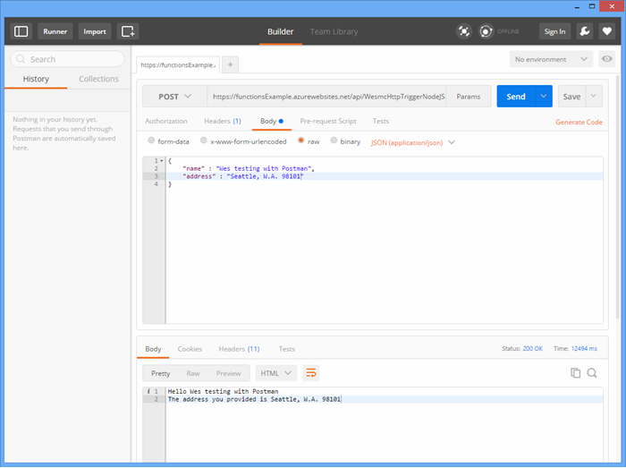
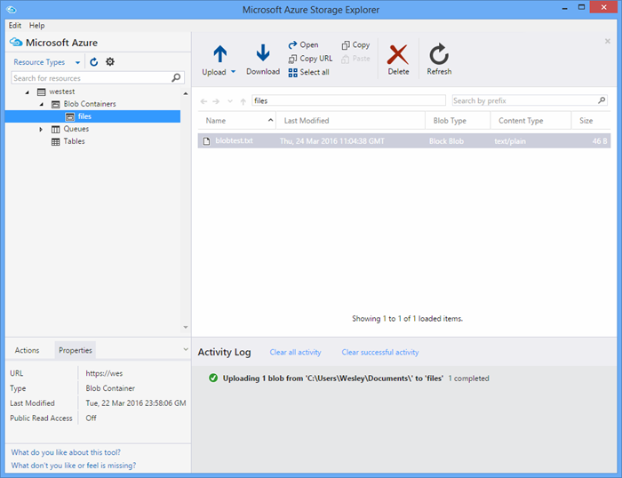

<properties
   pageTitle="Testen der Funktionen Azure | Microsoft Azure"
   description="Testen Sie Ihre Azure-Funktionen, die mit Postman, cURL und Node.js."
   services="functions"
   documentationCenter="na"
   authors="wesmc7777"
   manager="erikre"
   editor=""
   tags=""
   keywords="Azure-Funktionen, Funktionen, Ereignisse zu verarbeiten, Webhooks, dynamische berechnen, ohne Server-Architektur testen"/>

<tags
   ms.service="functions"
   ms.devlang="multiple"
   ms.topic="article"
   ms.tgt_pltfrm="multiple"
   ms.workload="na"
   ms.date="08/19/2016"
   ms.author="wesmc"/>

# Testen der Azure-Funktionen

## (Übersicht)

In diesem Lernprogramm werden wir verschiedene Ansätze zum Testen der Funktionen durchzuführen. Definieren wir eine http-Funktion auslösen, die durch ein Abfrageparameter der Zeichenfolge und den Hauptteil der Anforderung akzeptiert. Unterstützt der standardmäßigen **HttpTrigger Node.js Funktion** Vorlagencode ein `name` Abfrage Zeichenfolgenparameter. Wir auch fügen Code hinzu, um Unterstützung für diesen Parameter zusammen mit `address` Informationen für den Benutzer im Hauptteil Anforderung.

## Erstellen Sie eine Funktion zum Testen

Für die meisten dieses Lernprogramms wird eine leicht abgewandelte Version der Vorlage **HttpTrigger Nodejs-Funktion** verwendet, die beim Erstellen einer neuen Funktion zur Verfügung steht.  Sie können das [Erstellen Ihrer ersten Azure-Funktion Lernprogramm](functions-create-first-azure-function.md) ansehen, wenn Sie Hilfe zum Erstellen einer neuen Funktion benötigen.  Wählen Sie nur die Vorlage **HttpTrigger Nodejs Funktion** beim Erstellen der Testfunktion der [Azure-Portal]aus.

Die Standardvorlage für die Funktion ist im Grunde eine Hallo Welt-Funktion, die den Namen aus der Anfrage Textkörper oder Abfrage Zeichenfolgenparameter, wieder wiedergegeben `name=<your name>`.  Wir aktualisieren Sie den Code, damit auch Sie den Namen und eine Adresse als JSON-Inhalt in den Hauptteil der Anforderung bereitstellen können. Dann wird die Funktion diese zurück an den Client, wenn verfügbar auf dem Bildschirm.   

Aktualisieren Sie die Funktion mit den folgenden Code, den wir zum Testen verwenden möchten:

    module.exports = function(context, req) {
        context.log("Node.js HTTP trigger function processed a request. RequestUri=%s", req.originalUrl);
        context.log("Request Headers = " + JSON.stringify(req.headers));    
    
        if (req.query.name || (req.body && req.body.name)) {
            if (typeof req.query.name != "undefined") {
                context.log("Name was provided as a query string param..."); 
                ProcessNewUserInformation(context, req.query.name);
            }
            else {
                context.log("Processing user info from request body..."); 
                ProcessNewUserInformation(context, req.body.name, req.body.address);
            }
        }
        else {
            context.res = {
                status: 400,
                body: "Please pass a name on the query string or in the request body"
            };
        }
        context.done();
    };
    
    function ProcessNewUserInformation(context, name, address)
    {    
        context.log("Processing User Information...");            
        context.log("name = " + name);            
        echoString = "Hello " + name;
        
        if (typeof address != "undefined")
        {
            echoString += "\n" + "The address you provided is " + address;
            context.log("address = " + address);            
        }
        
        context.res = {
                // status: 200, /* Defaults to 200 */
                body: echoString
            };
    }

## Testen Sie eine Funktion mit Tools

### Testen mit Kringel

Häufig wird beim Testen der Software, es ist nicht erforderlich, eine weitere als die Befehlszeile können Sie die Anwendung debuggen zu suchen, Dies unterscheidet sich nicht mit Funktionen.

Klicken Sie zum Testen der Funktion oben kopieren Sie die **Funktion Url** aus dem Portal ein. Haben sie das folgende Format ein: 

    https://<Your Function App>.azurewebsites.net/api/<Your Function Name>?code=<your access code>
    
Dies ist die Url für das Auslösen der Funktion, wir können dies testen, indem Sie mit der cURL-Befehl in der Befehlszeile können einen Get (`-G` oder `--get`) Anfrage anhand unserer (Funktion):

    curl -G https://<Your Function App>.azurewebsites.net/api/<Your Function Name>?code=<your access code>
    
In diesem Beispiel oben erfordert Abfrageparameter die als Daten weitergegeben werden können (`-d`) in den Befehl cURL:

    curl -G https://<Your Function App>.azurewebsites.net/api/<Your Function Name>?code=<your access code> -d name=<Enter a name here>
    
Geben Sie Treffer und erhalten Sie die Ausgabe der Funktion in der Befehlszeile.

Klicken Sie im Portal **Protokolle** wird ähnlich wie der folgende Ausgabe während der Ausführung der Funktion protokolliert:

    2016-04-05T21:55:09  Welcome, you are now connected to log-streaming service.
    2016-04-05T21:55:30.738 Function started (Id=ae6955da-29db-401a-b706-482fcd1b8f7a)
    2016-04-05T21:55:30.738 Node.js HTTP trigger function processed a request. RequestUri=https://functionsExample.azurewebsites.net/api/HttpTriggerNodeJS1?code=XXXXXXX&name=Azure Functions
    2016-04-05T21:55:30.738 Function completed (Success, Id=ae6955da-29db-401a-b706-482fcd1b8f7a)

### Testen Sie mit einem browser

Funktionen, die keine Parameter erfordern, oder benötigen Sie nur die Parameter der Abfragezeichenfolge, können mithilfe eines Browsers getestet werden.

Zum Testen der Funktion, die, der wir über definiert, kopieren Sie die **Funktion Url** aus dem Portal ein. Haben sie das folgende Format ein:

    https://<Your Function App>.azurewebsites.net/api/<Your Function Name>?code=<your access code>

Anfügen der `name` Abfragen von Zeichenfolgenparameter wie folgt berechnet, verwenden einen ist-Namen für die `<Enter a name here>` Platzhalter.

    https://<Your Function App>.azurewebsites.net/api/<Your Function Name>?code=<your access code>&name=<Enter a name here>

Fügen Sie die URL in Ihrem Browser, und Sie sollten eine Antwort ähnlich wie der folgende abrufen.

Klicken Sie im Portal **Protokolle** wird ähnlich wie der folgende Ausgabe während der Ausführung der Funktion protokolliert:

    2016-03-23T07:34:59  Welcome, you are now connected to log-streaming service.
    2016-03-23T07:35:09.195 Function started (Id=61a8c5a9-5e44-4da0-909d-91d293f20445)
    2016-03-23T07:35:10.338 Node.js HTTP trigger function processed a request. RequestUri=https://functionsExample.azurewebsites.net/api/WesmcHttpTriggerNodeJS1?code=XXXXXXXXXX==&name=Wes from a browser
    2016-03-23T07:35:10.338 Request Headers = {"cache-control":"max-age=0","connection":"Keep-Alive","accept":"text/html","accept-encoding":"gzip","accept-language":"en-US"}
    2016-03-23T07:35:10.338 Name was provided as a query string param.
    2016-03-23T07:35:10.338 Processing User Information...
    2016-03-23T07:35:10.369 Function completed (Success, Id=61a8c5a9-5e44-4da0-909d-91d293f20445)

### Mit Postman testen

Das empfohlene Tool zum Testen die meisten der Funktionen ist Postman. Um Postman zu installieren, finden Sie unter [Abrufen von Postman](https://www.getpostman.com/). Postman ermöglicht die Steuerung viele weitere Attribute einer HTTP-Anforderung.

> [AZURE.TIP] Verwenden Sie den REST-Client, in dem Sie vertraut sind. Hier sind einige Alternativen zu Postman aus:  
> 
> * [Fiddler](http://www.telerik.com/fiddler)  
> * [Kralle](https://luckymarmot.com/paw)  

So testen die Funktion mit einer Besprechungsanfrage für Text in Postman: 

1. Starten Sie über die Schaltfläche **Apps** in der linken oberen Ecke des Fensters einer Chrome-Browser Postman.
2. Kopieren Sie der **Url (Funktion)** , und fügen Sie ihn in Postman. Er enthält den Access-Code Abfragezeichenfolge-Parameter.
3. Ändern Sie die HTTP-Methode zum **Bereitstellen**.
4. Klicken Sie auf **Nachrichtentext** > **unformatierten** und JSON-Anforderungstexts wie folgt hinzufügen:

        {
            "name" : "Wes testing with Postman",
            "address" : "Seattle, W.A. 98101"
        }

5. Klicken Sie auf **Senden**.

Die folgende Abbildung zeigt im einfachen Echo-Funktion wird in diesem Lernprogramm testen. 

Klicken Sie im Portal **Protokolle** wird ähnlich wie der folgende Ausgabe während der Ausführung der Funktion protokolliert:

    2016-03-23T08:04:51  Welcome, you are now connected to log-streaming service.
    2016-03-23T08:04:57.107 Function started (Id=dc5db8b1-6f1c-4117-b5c4-f6b602d538f7)
    2016-03-23T08:04:57.763 Node.js HTTP trigger function processed a request. RequestUri=https://functions841def78.azurewebsites.net/api/WesmcHttpTriggerNodeJS1?code=XXXXXXXXXX==
    2016-03-23T08:04:57.763 Request Headers = {"cache-control":"no-cache","connection":"Keep-Alive","accept":"*/*","accept-encoding":"gzip","accept-language":"en-US"}
    2016-03-23T08:04:57.763 Processing user info from request body...
    2016-03-23T08:04:57.763 Processing User Information...
    2016-03-23T08:04:57.763 name = Wes testing with Postman
    2016-03-23T08:04:57.763 address = Seattle, W.A. 98101
    2016-03-23T08:04:57.795 Function completed (Success, Id=dc5db8b1-6f1c-4117-b5c4-f6b602d538f7)
    
### Testen der Trigger BLOB-Speicher-Explorer verwenden

Sie können eine Blob-Trigger-Funktion mit [Microsoft Azure-Speicher-Explorer](http://storageexplorer.com/)testen.

1. Im [Portal Azure] für Ihre app Funktionen erstellen Sie eine neue c#, F Nr. oder Knoten Blob Trigger Funktion. Legen Sie den Pfad zum Überwachen der auf den Namen des Containers Blob in ein. Beispiel:

        files

2. Klicken Sie auf die **+** Schaltfläche auswählen oder erstellen das Speicherkonto, das Sie verwenden möchten. Klicken Sie dann auf **Erstellen**.

3. Erstellen Sie eine Textdatei mit den folgenden Text ein, und speichern Sie ihn:

        A text file for blob trigger function testing.

4. [Microsoft Azure-Speicher-Explorer](http://storageexplorer.com/) ausführen, und Verbinden mit den Container Blob im Speicherkonto überwacht wird.

5. Klicken Sie auf die Schaltfläche **Hochladen** , und Hochladen Sie die Datei.

    

    Der Standard Blob auslösen Funktionscode meldet die Verarbeitung von der Blob in den Protokollen auf:

        2016-03-24T11:30:10  Welcome, you are now connected to log-streaming service.
        2016-03-24T11:30:34.472 Function started (Id=739ebc07-ff9e-4ec4-a444-e479cec2e460)
        2016-03-24T11:30:34.472 C# Blob trigger function processed: A text file for blob trigger function testing.
        2016-03-24T11:30:34.472 Function completed (Success, Id=739ebc07-ff9e-4ec4-a444-e479cec2e460)

## Testen einer Funktion innerhalb von Funktionen

### Testen Sie mit der Schaltfläche "ausführen" Funktionen-portal

Das Portal bietet eine Schaltfläche **Ausführen** , die wodurch Sie einige wenige Tests ausführen kann. Sie können eine Anforderungstexts mithilfe der Schaltfläche "ausführen" bereitstellen, aber, keine Zeichenfolge Abfrageparameter bereitstellen oder Anforderungsheader aktualisieren.

Testen der HTTP-auslösen-Funktion, die wir zuvor erstellt haben, durch Hinzufügen einer JSON-Zeichenfolge ähnlich der folgenden im Feld **Textkörper anfordern** , und klicken Sie dann klicken Sie auf die Schaltfläche **Ausführen** .

    {
        "name" : "Wes testing Run button",
        "address" : "USA"
    } 

Klicken Sie im Portal **Protokolle** wird ähnlich wie der folgende Ausgabe während der Ausführung der Funktion protokolliert:

    2016-03-23T08:03:12  Welcome, you are now connected to log-streaming service.
    2016-03-23T08:03:17.357 Function started (Id=753a01b0-45a8-4125-a030-3ad543a89409)
    2016-03-23T08:03:18.697 Node.js HTTP trigger function processed a request. RequestUri=https://functions841def78.azurewebsites.net/api/wesmchttptriggernodejs1
    2016-03-23T08:03:18.697 Request Headers = {"connection":"Keep-Alive","accept":"*/*","accept-encoding":"gzip","accept-language":"en-US"}
    2016-03-23T08:03:18.697 Processing user info from request body...
    2016-03-23T08:03:18.697 Processing User Information...
    2016-03-23T08:03:18.697 name = Wes testing Run button
    2016-03-23T08:03:18.697 address = USA
    2016-03-23T08:03:18.744 Function completed (Success, Id=753a01b0-45a8-4125-a030-3ad543a89409)

### Testen Sie mit einer Timer trigger

Wirklich einige Funktionen kann nicht getestet werden mit den Tools, die zuvor erwähnt. Angenommen, eine Warteschlange Trigger Funktion, die ausgeführt wird, wenn eine Nachricht in der [Warteschlange-Speicher Azure](../storage/storage-dotnet-how-to-use-queues.md)gelöscht wird. Sie könnten immer Schreiben von Code so, dass eine Nachricht in der Warteschlange verwirft und ein Beispiel dafür in einem Projekt Console wird unten bereitgestellt. Es ist jedoch eine andere Methode, die Sie verwenden können, um direkt mit Funktionen zu testen.  

Sie können einen Timer Trigger mit einer Warteschlange konfiguriert Bindung ausgeben. Die Zeitmessung Auslösungscode konnte die Textnachrichten klicken Sie dann in der Warteschlange schreiben. In diesem Abschnitt wird anhand eines Beispiels durchgehen. 

Weitere ausführliche Informationen zum Verwenden von Bindungen mit Azure-Funktionen finden Sie unter den [Entwicklerreferenz Azure-Funktionen](functions-reference.md). 

#### Erstellen der Warteschlange Trigger zum Testen

Um diese Vorgehensweise zu veranschaulichen, erstellen wir zunächst eine Warteschlange Trigger-Funktion, die wir für eine Warteschlange mit dem Namen testen möchten `queue-newusers`. Diese Funktion verarbeitet Namens- und Informationen für einen neuen Benutzer in der Azure-Warteschlangenspeicher abgelegt. 

> [AZURE.NOTE] Wenn Sie den Namen einer anderen Warteschlange verwenden, stellen Sie sicher, dass der Name, den Sie verwenden den Regeln [Warteschlangen benennen und Metadaten](https://msdn.microsoft.com/library/dd179349.aspx) entspricht.  Andernfalls erhalten Sie einen Code HTTP-Status 400: Ungültige Anforderung. 

1. Klicken Sie im [Portal Azure] für Ihre app Funktionen auf **Neuen Funktion** > **QueueTrigger - c#**.
2. Geben Sie den Warteschlangennamen, die von der Funktion Warteschlange überwacht werden 

        queue-newusers 

3. Klicken Sie auf die **+** ' (hinzufügen) klicken, wählen Sie aus, oder erstellen das Speicherkonto, das Sie verwenden möchten. Klicken Sie dann auf **Erstellen**.
4. Lassen Sie dieses Portal Browserfenster geöffnet, damit Sie die Protokolleinträge für die Vorlage Codes Standard Warteschlange Funktion überwachen können.

#### Erstellen eines Triggers Zeitgeber, um eine Nachricht in der Warteschlange ablegen

1. Öffnen Sie das [Azure-Portal] in einem neuen Browserfenster, und navigieren Sie zu Ihrer Anwendung (Funktion).
2. Klicken Sie auf **neue Funktion** > **TimerTrigger - c#**. Geben Sie einen Cron-Ausdruck, um festzulegen, wie oft der Timercode ausgeführt wird, Testen der Warteschlange-Funktion. Klicken Sie dann auf **Erstellen**. Wenn Sie den Test alle 30 Sekunden ausführen möchten, können Sie die folgenden [CRON-Ausdruck](https://wikipedia.org/wiki/Cron#CRON_expression):

        */30 * * * * *

2. Klicken Sie auf der Registerkarte **integrieren** für Ihre neue Timer auslösen.
3. Aktivieren Sie unter **Ausgabe**klicken Sie auf die Schaltfläche **+ neue darstellt** . Klicken Sie dann auf die Schaltfläche **auswählen** und **Warteschlange** .
4. Beachten Sie, dass der angegebene Name für die **Warteschlange Nachrichtenobjekt** Sie dies im Timercode-Funktion verwenden.

        myQueue

4. Geben Sie den Namen der Warteschlange ein, in dem die Nachricht gesendet werden: 

        queue-newusers 

3. Klicken Sie auf die **+** ' (hinzufügen) klicken, wählen Sie das Speicherkonto zuvor mit dem Trigger Warteschlange verwendet. Klicken Sie dann auf **Speichern**.
4. Klicken Sie auf der Registerkarte **Entwicklung** Ihrer Zeitgeber auslösen.
5. Im folgenden Code können für die C#-Timer-Funktion, solange Sie die gleichen Warteschlange Nachricht zu verwendenden Objektnamen abgebildet verwendet haben. Klicken Sie dann auf **Speichern**

        using System;
        
        public static void Run(TimerInfo myTimer, out String myQueue, TraceWriter log)
        {
            String newUser = 
            "{\"name\":\"User testing from C# timer function\",\"address\":\"XYZ\"}";
        
            log.Verbose($"C# Timer trigger function executed at: {DateTime.Now}");   
            log.Verbose($"{newUser}");   
            
            myQueue = newUser;
        }

C#-Timer-Funktion wird zu diesem Zeitpunkt alle 30 Sekunden ausgeführt, wenn Sie den Beispiel Cron-Ausdruck verwendet. Die Protokolle für die Timer-Funktion meldet jede Ausführung:

    2016-03-24T10:27:02  Welcome, you are now connected to log-streaming service.
    2016-03-24T10:27:30.004 Function started (Id=04061790-974f-4043-b851-48bd4ac424d1)
    2016-03-24T10:27:30.004 C# Timer trigger function executed at: 3/24/2016 10:27:30 AM
    2016-03-24T10:27:30.004 {"name":"User testing from C# timer function","address":"XYZ"}
    2016-03-24T10:27:30.004 Function completed (Success, Id=04061790-974f-4043-b851-48bd4ac424d1)

Finden Sie im Browserfenster für die Warteschlange-Funktion die jeder Nachricht, die verarbeitet:

    2016-03-24T10:27:06  Welcome, you are now connected to log-streaming service.
    2016-03-24T10:27:30.607 Function started (Id=e304450c-ff48-44dc-ba2e-1df7209a9d22)
    2016-03-24T10:27:30.607 C# Queue trigger function processed: {"name":"User testing from C# timer function","address":"XYZ"}
    2016-03-24T10:27:30.607 Function completed (Success, Id=e304450c-ff48-44dc-ba2e-1df7209a9d22)
    
## Testen Sie eine Funktion mit Code

### Testen Sie die Funktion eine HTTP Trigger mit Code: Node.js

Sie können Node.js Code beim Ausführen einer http-Anforderung zum Testen der Azure-Funktion verwenden. 

Vergewissern Sie sich, um festzulegen:

- Die `host` in der Anfrage-Optionen können Sie Ihre app-Host (Funktion)
- Ihre Funktionsnamen in die `path`.
- Ihre Access-Code (`<your code>`) in der `path`.

Codebeispiel:

    var http = require("http");
    
    var nameQueryString = "name=Wes%20Query%20String%20Test%20From%20Node.js";
    
    var nameBodyJSON = {
        name : "Wes testing with Node.JS code",
        address : "Dallas, T.X. 75201"
    };
    
    var bodyString = JSON.stringify(nameBodyJSON);
    
    var options = {
      host: "functions841def78.azurewebsites.net",
      //path: "/api/HttpTriggerNodeJS2?code=sc1wt62opn7k9buhrm8jpds4ikxvvj42m5ojdt0p91lz5jnhfr2c74ipoujyq26wab3wk5gkfbt9&" + nameQueryString,
      path: "/api/HttpTriggerNodeJS2?code=sc1wt62opn7k9buhrm8jpds4ikxvvj42m5ojdt0p91lz5jnhfr2c74ipoujyq26wab3wk5gkfbt9",
      method: "POST",
      headers : {
          "Content-Type":"application/json",
          "Content-Length": Buffer.byteLength(bodyString)
        }    
    };
    
    callback = function(response) {
      var str = ""
      response.on("data", function (chunk) {
        str += chunk;
      });
    
      response.on("end", function () {
        console.log(str);
      });
    }
    
    var req = http.request(options, callback);
    console.log("*** Sending name and address in body ***");
    console.log(bodyString);
    req.end(bodyString);

Ergebnis:

    C:\Users\Wesley\testing\Node.js>node testHttpTriggerExample.js
    *** Sending name and address in body ***
    {"name" : "Wes testing with Node.JS code","address" : "Dallas, T.X. 75201"}
    Hello Wes testing with Node.JS code
    The address you provided is Dallas, T.X. 75201
        
Klicken Sie im Portal **Protokolle** wird ähnlich wie der folgende Ausgabe während der Ausführung der Funktion protokolliert:

    2016-03-23T08:08:55  Welcome, you are now connected to log-streaming service.
    2016-03-23T08:08:59.736 Function started (Id=607b891c-08a1-427f-910c-af64ae4f7f9c)
    2016-03-23T08:09:01.153 Node.js HTTP trigger function processed a request. RequestUri=http://functionsExample.azurewebsites.net/api/WesmcHttpTriggerNodeJS1/?code=XXXXXXXXXX==
    2016-03-23T08:09:01.153 Request Headers = {"connection":"Keep-Alive","host":"functionsExample.azurewebsites.net"}
    2016-03-23T08:09:01.153 Name not provided as query string param. Checking body...
    2016-03-23T08:09:01.153 Request Body Type = object
    2016-03-23T08:09:01.153 Request Body = [object Object]
    2016-03-23T08:09:01.153 Processing User Information...
    2016-03-23T08:09:01.215 Function completed (Success, Id=607b891c-08a1-427f-910c-af64ae4f7f9c)
    

### Testen Sie die Funktion eine Warteschlange Trigger mit Code: C# #

Wir erwähnt, dass mithilfe von Code zu eine Nachricht in der Warteschlange ablegen ein Triggers Warteschlange getestet werden konnte. Im folgenden Beispielcode ist je nachdem, wie der C#-Code in das [Erste Schritte mit Azure Warteschlange Speicher](../storage/storage-dotnet-how-to-use-queues.md) Lernprogramm. Code für andere Sprachen steht auch über diesen Link.

Um diesen Code in eine Console-app zu testen, Sie müssen:

- [Konfigurieren der Verbindungszeichenfolge von Speicher in der App](../storage/storage-dotnet-how-to-use-queues.md#setup-a-storage-connection-string).
- In diesem Code akzeptiert den Namen und die Adresse für einen neuen Benutzer als Befehlszeilenargumente während der Laufzeit. Übergeben einer `name` und `address` als Parameter für die app. Beispielsweise`C:\myQueueConsoleApp\test.exe "Wes testing queues" "in a console app"`

Beispiel für C#-Code:

    static void Main(string[] args)
    {
        string name = null;
        string address = null;
        string queueName = "queue-newusers";
        string JSON = null;

        if (args.Length > 0)
        {
            name = args[0];
        }
        if (args.Length > 1)
        {
            address = args[1];
        }

        // Retrieve storage account from connection string
        CloudStorageAccount storageAccount = CloudStorageAccount.Parse(ConfigurationManager.AppSettings["StorageConnectionString"]);

        // Create the queue client
        CloudQueueClient queueClient = storageAccount.CreateCloudQueueClient();

        // Retrieve a reference to a queue
        CloudQueue queue = queueClient.GetQueueReference(queueName);

        // Create the queue if it doesn't already exist
        queue.CreateIfNotExists();

        // Create a message and add it to the queue.
        if (name != null)
        {
            if (address != null)
                JSON = String.Format("{{\"name\":\"{0}\",\"address\":\"{1}\"}}", name, address);
            else
                JSON = String.Format("{{\"name\":\"{0}\"}}", name);
        }

        Console.WriteLine("Adding message to " + queueName + "...");
        Console.WriteLine(JSON);

        CloudQueueMessage message = new CloudQueueMessage(JSON);
        queue.AddMessage(message);
    }

Finden Sie im Browserfenster für die Warteschlange-Funktion die jeder Nachricht, die verarbeitet:

    2016-03-24T10:27:06  Welcome, you are now connected to log-streaming service.
    2016-03-24T10:27:30.607 Function started (Id=e304450c-ff48-44dc-ba2e-1df7209a9d22)
    2016-03-24T10:27:30.607 C# Queue trigger function processed: {"name":"Wes testing queues","address":"in a console app"}
    2016-03-24T10:27:30.607 Function completed (Success, Id=e304450c-ff48-44dc-ba2e-1df7209a9d22)

<!-- URLs. -->

[Azure-Portal]: https://portal.azure.com
