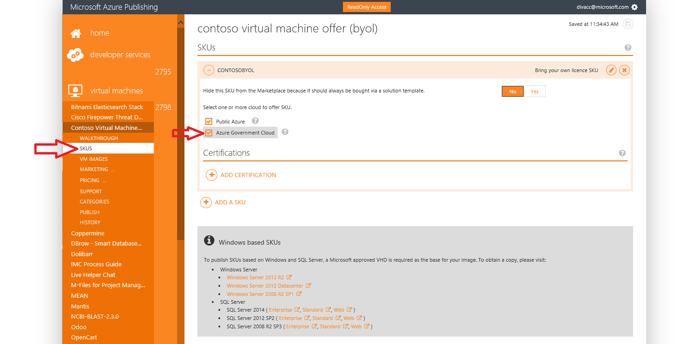
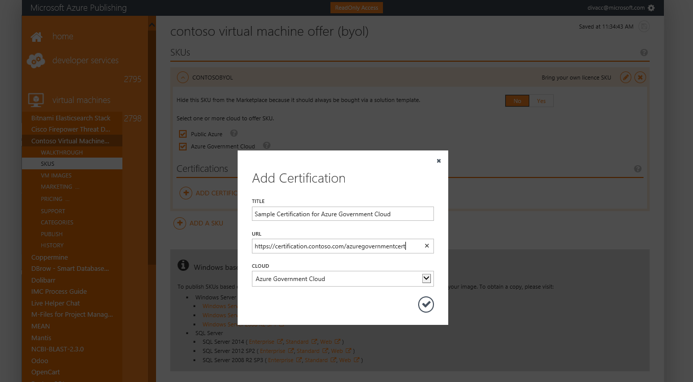
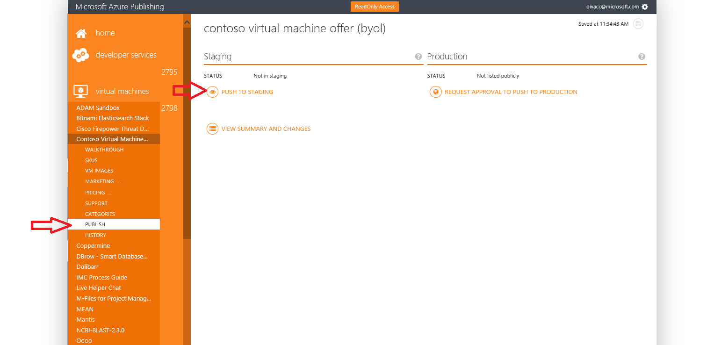
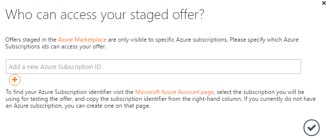
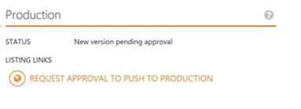

<properties
            pageTitle="Azure Government Dokumentation | Microsoft Azure"
            description="Dies stellt einen Vergleich der Features und Anleitungen zur Entwicklung von Applications für Azure Government."
            services="Azure-Government"
            cloud="gov"
            documentationCenter=""
            authors="tsingh"
            manager="asimm"
            editor=""/>
 
<tags    ms.service="multiple"
            ms.devlang="na"
            ms.topic="article"
            ms.tgt_pltfrm="na"
            ms.workload="azure-government"
            ms.date="10/20/2016"
            ms.author="zakramer;tsingh;divacc"/> 

# Government Azure Marketplace
Finden Sie für Partner veröffentlichen Ihre Angebote auf Azure Marketplace für Government interessiert die folgenden Details ein.

## Veröffentlichen
>[AZURE.NOTE] Führen Sie die Schritte aus, wenn Sie nicht bereits Azure zertifiziert Marketplace Partner sind, [hier](../marketplace-publishing/marketplace-publishing-getting-started.md) bevor Sie fortfahren.

### Schritt 1  
Melden Sie sich bei [https://publish.windowsazure.com](https://publish.windowsazure.com)

### Schritt 2
Klicken Sie auf das Angebot, die, das Sie veröffentlichen möchten.

### Schritt 3
Klicken Sie auf **SKUS** , und klicken Sie auf das Azure Government Cloud

>[AZURE.NOTE] Es werden nur wieder abrufen Ihrer eigenen Lizenz (BYOL) SKUs unterstützt.  Diese Option ist nicht verfügbar für SKUs nutzungsbasierte (PayG).

### Schritt 4
Klicken Sie auf das + Hinzufügen Zertifizierung-Link zum Hinzufügen von Links zu einem beliebigen Zertifizierung für Ihr Angebot.

### Schritt 5
Anfrage für ein Testkonto in Microsoft Azure Government Cloud aktivieren Sie das Bild in den Veröffentlichungsportal testen: [https://azuregov.microsoft.com/trial/azuregovtrial](https://azuregov.microsoft.com/trial/azuregovtrial)

Ihre Berechtigung als einen Partner, der US federal, staatliche, lokale oder tribal Einheiten werden überprüft und Bestätigung erfolgt per e-Mail dient.  Ihr Testkonto stehen zur Verfügung innerhalb ist 3 bis 5 Arbeitstagen.

### Schritt 6
Klicken Sie auf veröffentlichen, und klicken Sie auf Pushbenachrichtigungen zu Staging. 

Sie werden aufgefordert, ein Abonnement auf der weißen Liste eingeben, die auf die bereitgestellte anbieten zugreifen kann. Geben Sie die Abonnement-ID aus Ihrem neu erworbenen Testversion Government Azure-Konto an.

### Schritt 7
Nachdem das Angebot erfolgreich bereitgestellt wird, können Sie das Bild durch Anmelden an [https://portal.azure.us](https://portal.azure.us) mit Ihrem Konto Azure-Testversion an Government testen.

### Schritt 8
Nachdem Sie das Bild, das Testabonnement überprüft haben, können Sie das Angebot live von klicken Sie auf Veröffentlichen und Anfordern einer Genehmigung, fahren Sie mit der Herstellung verfügbar machen. 

## Nächste Schritte

Abonnieren Sie zusätzliche Informationen und Updates die [Microsoft Azure Government Blog](https://blogs.msdn.microsoft.com/azuregov/)aus.
