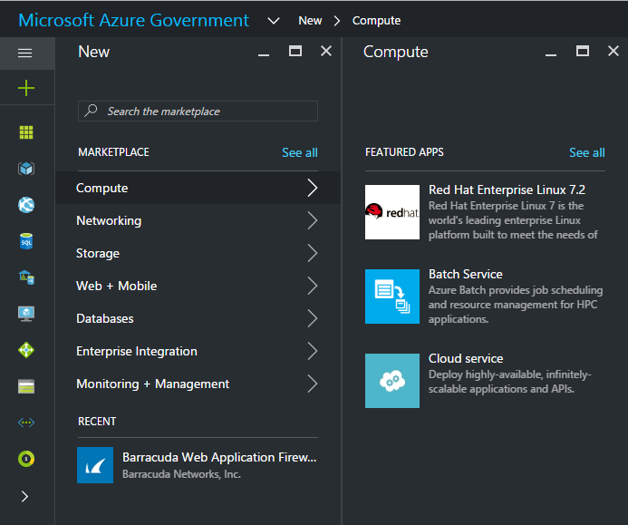
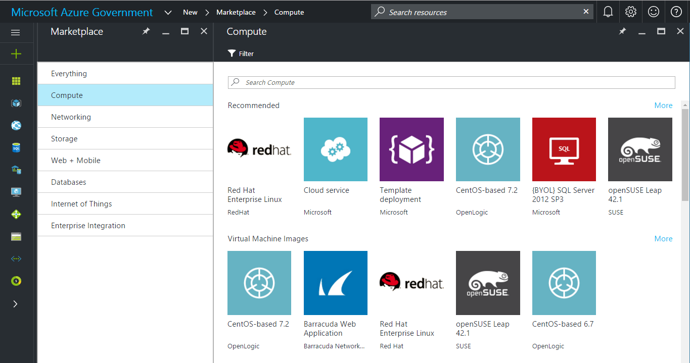
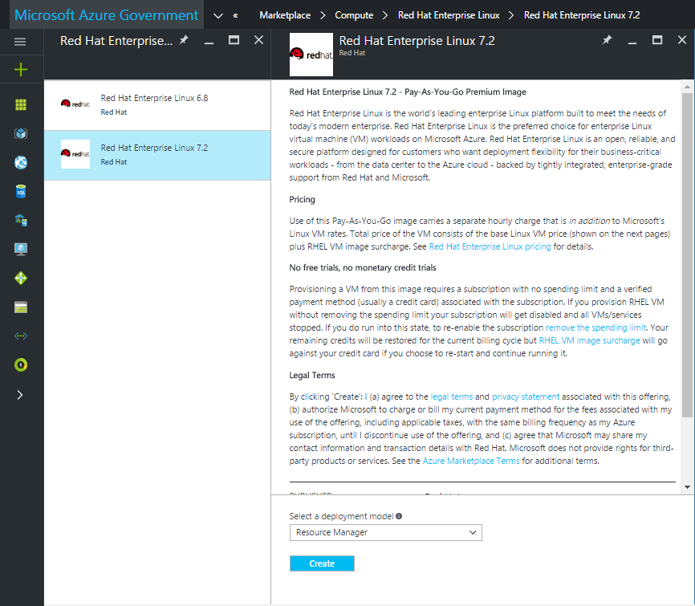
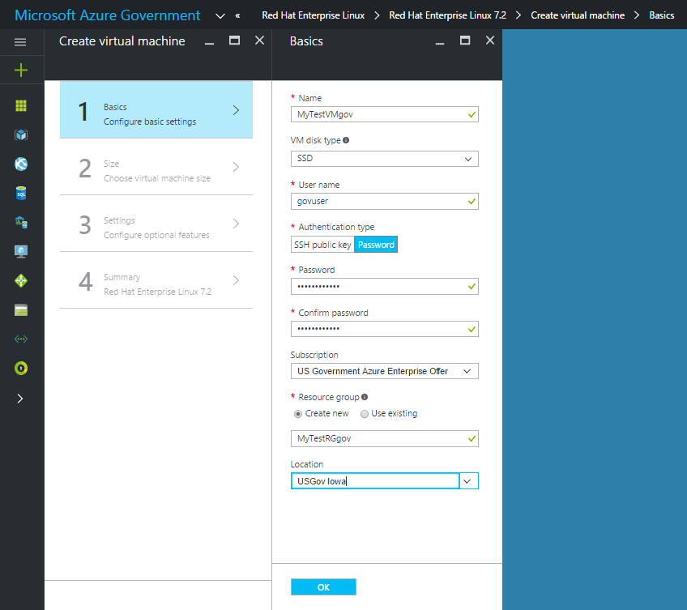
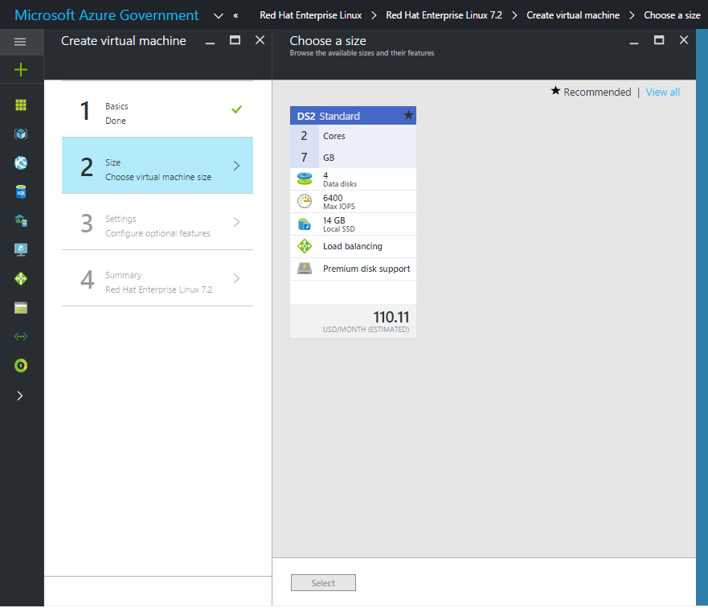

 <properties
    pageTitle="Azure Government Dokumentation | Microsoft Azure"
    description="Dies stellt einen Vergleich der Features und Anleitungen zur Entwicklung von Applications für Azure Government."
    services="Azure-Government"
    cloud="gov"
    documentationCenter=""
    authors="VybavaRamadoss"
    manager="asimm"
    editor=""/>

<tags   ms.service="multiple"
    ms.devlang="na"
    ms.topic="article"
    ms.tgt_pltfrm="na"
    ms.workload="azure-government"
    ms.date="10/20/2016"
    ms.author="zakramer;vybavar"/>

# Azure Marketplace für Government
Die Azure Marketplace steht für Azure Government mit einer aktualisierten Liste von Bildern aus unserem Marketplace Herausgeber. 

## Variationen
Im folgenden sind einige Überlegungen Azure Marketplace für Government verwenden:

- Nur die Bilder wieder abrufen Ihrer eigenen Lizenz (BYOL) sind verfügbar. Sie können nicht keine Bilder zugreifen, die erfordern erwerben Transaktionen über ein Azure Marketplace
- Nur eine Teilmenge der Bilder steht derzeit im Vergleich zu den öffentlichen Marketplace. Die Liste der verfügbaren Bilder finden Sie [hier](../azure-government-image-gallery.md) 
- Vor der Bereitstellung eines Bilds, müssen Unternehmensadministrator Marketplace Einkäufe für Ihr Abonnement Azure aktivieren.
  - Melden Sie sich mit dem Portal als Unternehmensadministrator an
  - Navigieren Sie zu *Verwalten*
  - Klicken Sie unter *Registrierungs-Details* auf das Bleistiftsymbol neben den Artikel *Azure Marketplace*
  - Schalten Sie je nach Bedarf *Aktiviert/deaktiviert*
  - Klicken Sie auf *Speichern*

>[AZURE.NOTE] Wenn Sie machen möchten finden Sie Ihre Bilder in Azure Government verfügbar, [Partner Onboarding Richtlinien](documentation-government-manage-marketplace-partners.md) für Weitere Informationen.

### Schritt 1
Starten Sie den Marketplace

  

### Schritt 2
Durchsuchen Sie verschiedene finden der richtigen-Produkte aus.

Der Marketplace-Publisher bietet eine Liste der Zertifizierung als Teil der produktbeschreibung bei der richtigen Entscheidung helfen. 

### Schritt 3
Wählen Sie eine Product\image aus.

### Schritt 4
Starten Sie des Ablaufs erstellen, und geben Sie die erforderlichen Parameter für Bereitstellung

>[AZURE.NOTE] Wählen Sie in der Dropdownliste Speicherort sind nur Azure Government Speicherorte sichtbar

### Schritt 5
Beachten Sie die Preise

### Schritt 6
Führen Sie alle Schritte aus, und klicken Sie auf Ok, um die Bereitstellung zu starten

## Nächste Schritte

Abonnieren Sie zusätzliche Informationen und Updates die [Microsoft Azure Government Blog](https://blogs.msdn.microsoft.com/azuregov/)aus.
