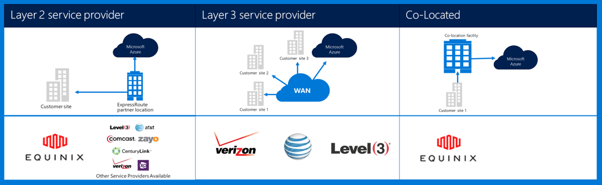
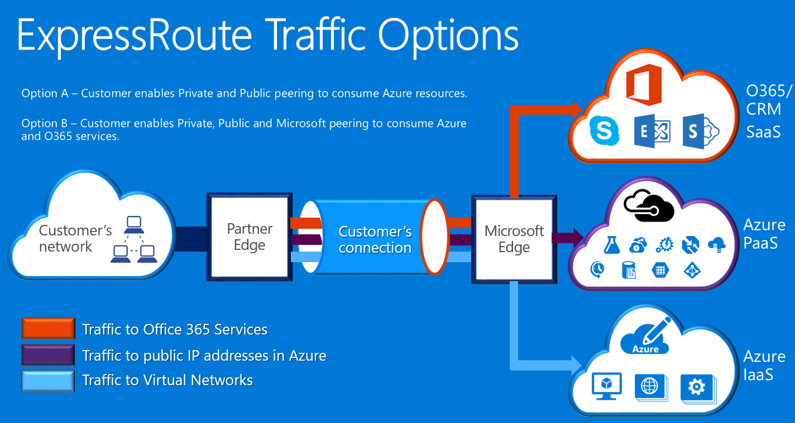

<properties
    pageTitle="Azure Governmenmt Dokumentation | Microsoft Azure"
    description="Dies stellt einen Vergleich der Features und Anleitungen für private Verbindung zu e Government"
    services="Azure-Government"
    cloud="gov" 
    documentationCenter=""
    authors="ryansoc"
    manager="zakramer"
    editor=""/>

<tags
    ms.service="multiple"
    ms.devlang="na"
    ms.topic="article"
    ms.tgt_pltfrm="na"
    ms.workload="azure-government"
    ms.date="09/28/2016"
    ms.author="ryansoc"/>

#  Azure Government Netzwerke

##  ExpressRoute (Private Connectivity)

ExpressRoute steht in der Regel in Azure Government aus. Weitere Informationen (einschließlich Partner und peering Speicherorte) finden Sie unter der <a href="https://azure.microsoft.com/en-us/documentation/services/expressroute/">ExpressRoute öffentliche Dokumentation </a>.

###  Variationen

ExpressRoute ist in Azure Government allgemein verfügbar (GA). 

- Government Kunden über eine dedizierte Azure Regierung (Gov) ExpressRoute (ER) Verbindung herstellen einer Verbindung eine physisch isoliert Kapazität mit

- Azure gov – bietet höhere Verfügbarkeit und Zuverlässigkeit durch die Nutzung von mehreren Region Paare ansässig mindestens 500 Meilen auseinander 

- Standardmäßig alle Azure gov – ER Connectivity konfigurierten aktive redundante mit Unterstützung für trennen und bietet bis zu 10 G Verbindung Kapazität (kleinsten ist 50MB)

- Azure gov – ER Speicherorte bieten optimierte Pfade (geschätzte Abschnitte, Niedrig Wartezeit, hohe Leistung usw.) für Kunden und Azure Gov Geo redundante Regionen

- Die Azure gov – ER private Verbindung keinen Gebrauch, durchlaufen oder im Internet abhängig sind

- Azure Gov physische und logische Infrastruktur physisch dedizierter und getrennt und Zugriff auf US Personen beschränkt ist

- Microsoft zugegriffen und alle Verbindungslinie Infrastruktur zwischen Azure Gov Regionen und Azure gov – ER entsprechen arbeitet-mich Speicherorte

- Azure gov – ER stellt eine Verbindung mit Microsoft Azure, Office 365 und CRM Cloud services

### Aspekte

Es gibt zwei grundlegende Dienste, die als "Privat" Netzwerkkonnektivität in Azure Government bereitstellen: VPN (Standort-zu-Standort für eine typische Organisation) und ExpressRoute.

Azure ExpressRoute wird verwendet, um private Verbindungen zwischen Azure Government Rechenzentren und Ihre Infrastruktur lokal oder in einer Umgebung Colocation zu erstellen. ExpressRoute Verbindungen gehen Sie nicht über das öffentliche Internet – sie bieten weitere Zuverlässigkeit, höhere Geschwindigkeit und unteren Wartezeiten als normalen Internet-Verbindungen. In einigen Fällen wird verhindert ExpressRoute Verbindungen zum Übertragen von Daten zwischen auf lokale Systeme und Azure Erträge signifikante Vorteile Kosten.   

Mit ExpressRoute Sie Verbindungen zu Azure an einem Standort ExpressRoute (beispielsweise ein Exchange-Dienstanbieters) herstellen, oder Sie direkt Herstellen einer Verbindung mit Azure vorhandenen WAN-Netzwerks (z. B. einer Multiprotocol beschriften Switch (MPLS) VPN, bereitgestellt hat einen Netzwerk-Dienstanbieter).

    

Netzwerk-Dienste Azure Government Kunden Applikationen und Lösungen unterstützen wird dringend empfohlen, dass ExpressRoute (private Connectivity) zum Verbinden mit Azure Government implementiert wird. Wenn VPN-Verbindungen verwendet werden, sollte Folgendes berücksichtigt werden:

- Kunden sollten wenden, deren autorisieren offiziellen/Stelle, um festzustellen, ob private Connectivity oder auf andere Weise sichere Verbindung erforderlich ist und zusätzlichen Einschränkungen zu berücksichtigen ist zu identifizieren.

- Kunden sollte entscheiden, ob festgelegt werden, dass das Website-zu-Standort VPN über eine private Connectivity Zone weitergeleitet werden.

- Kunden sollten entweder eine Verbindung MPLS oder VPN mit einer Access-Anbieter lizenzierte private Connectivity beziehen.

Alle Benutzer, die eine private Connectivity-Architektur nutzen sollten überprüfen, dass eine entsprechende Implementierung ist eingerichtet ist und werden, für die Kunden-Verbindung zu dem Gateway Netzwerk/Internet verwaltet (GN / ich) Router Abgrenzung Punkt für Azure Government Kanten. Ihre Organisation muss auf ähnliche Weise Netzwerkkonnektivität zwischen Ihrem lokalen Umgebung und Gateway Netzwerk-Kunden (GN/C) Kante Router Abgrenzung Punkt für Azure Government herstellen.

## Nächste Schritte

Für zusätzliche Informationen und Updates Bitte abonnieren der <a href="https://blogs.msdn.microsoft.com/azuregov/">Microsoft Azure Government Blog.</a>
