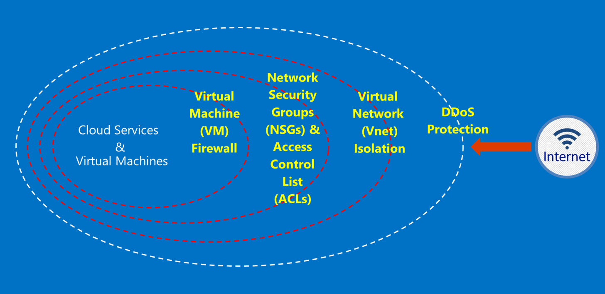

<properties
    pageTitle="Azure Government Dokumentation | Microsoft Azure"
    description="Dies stellt einen Vergleich der Features und Hinweise zur Entwicklung von Applications für Azure Government"
    services="Azure-Government"
    cloud="gov" 
    documentationCenter=""
    authors="ryansoc"
    manager="zakramer"
    editor=""/>

<tags
    ms.service="multiple"
    ms.devlang="na"
    ms.topic="article"
    ms.tgt_pltfrm="na"
    ms.workload="azure-government"
    ms.date="08/25/2016"
    ms.author="ryansoc"/>

#  Azure Government Dokumentation (Übersicht)

##  Einführung in Azure Government Dokumentation

Diese Website beschreibt die Funktionen von [Microsoft Azure Government](https://azure.microsoft.com/features/gov/) Services und bietet einen allgemeinen Leitfaden an alle Kunden. Bevor Sie speziell regulierte Daten in Ihr Abonnement Azure Government einschließen, sollten Sie Vertrautmachen mit den Funktionen Azure Government und wenden Sie sich an Ihr Team Konto, wenn Sie Fragen haben.

Lesen Sie die [Microsoft Azure für das Trust Center Compliance-Seite](http://www.microsoft.com/en-us/TrustCenter/Compliance/default.aspx) für aktuelle Informationen zu den Azure Government-Diensten, die bestimmte Akkreditierungen und Vorschriften abgedeckt. Weitere Microsoft-Dienste möglicherweise auch zur Verfügung, aber befinden sich nicht in den Bereich der Dienste Azure Government verdeckt und werden durch dieses Dokument nicht berücksichtigt. Azure Government Services möglicherweise auch gestatten, Ihre Verwendung eine Vielzahl von zusätzlichen Ressourcen, Applikationen oder Diensten, die von Drittanbietern bereitgestellt werden – oder von Microsoft unter getrennte Begriffe verwenden und Ihre Privatsphäre Richtlinien – die fallen nicht unter den Umfang dieses Dokuments. Sie sind verantwortlich für die Begriffe alle solche "Add-on" Angebote, wie z. B. Angebote Marketplace, um sicherzustellen, dass sie Ihren hinsichtlich Compliance Anforderungen überprüfen.

Azure Government ist für Personen, die Daten zu verarbeiten, die werden unterliegen bestimmte gesetzlichen Vorschriften und Anforderungen (z. B. NIST 800.171 (DIB), ITAR, IRS 1075, DoD L4 und CJIS), in dem mit Azure Government erforderlich ist die Einhaltung von Vorschriften, verfügbar. Azure Government Kunden unterliegen Überprüfung der Berechtigung aus.

Personen mit Fragen zu Berechtigung für Azure Government sollten ihre Kunden-Team sprechen.

##  Grundsätze für die Kundendaten in Azure Government Schutz

Azure Government bietet es sich um eine Reihe von Features und Dienste, mit denen Sie Cloudlösungen Ihren Anforderungen geregelt/gesteuert Daten erstellen. Eine Lösung kompatiblen Programm ist nicht mehr als die effektive Implementierung von Out-of-Box-Government Azure-Funktionen, in Verbindung mit einer Volltonfarbe Daten aus Sicherheitsgründen.
Wenn Sie eine Lösung in Azure Government gehostet, übernimmt Microsoft zahlreiche diese Anforderungen Ebene Infrastruktur der Cloud.

Das folgende Diagramm veranschaulicht das Azure Verteidigung Modell. Microsoft bietet beispielsweise grundlegende Cloud-Infrastruktur DDOS, zusammen mit den Funktionen für Kunden wie Wertpapiers Einheiten nach Kunden-Anwendung, die DDOS benötigt.

Auf dieser Seite werden die grundlegenden Prinzipien zum Sichern Ihrer Dienste und Anwendungen, Bereitstellen von Leitfäden und bewährte Methoden zum Anwenden dieser Grundsätze; Kurzum, wie Kunden nutzen sollten smart Azure Government zu entsprechen, die Verpflichtung und Aufgaben, die für eine Lösung erforderlich sind, die ITAR Informationen behandelt.

Die übergreifende Prinzipien zum Sichern von Kundendaten sind:
* Schützen von Daten mithilfe von Verschlüsselung
* Verwaltung von vertraulichen Daten
* Grad der Isolation zum Einschränken des Zugriffs auf Daten

##  Schützen von Kundendaten mithilfe von Verschlüsselung

Risiken minimieren und gesetzliche Vorschriften Besprechung sind die zunehmenden Fokus und Wichtigkeit Daten-Verschlüsselung steuernde. Verwenden Sie eine effektive Verschlüsselung Implementierung aktuelle Sicherheitsmaßnahmen Netzwerk- und verbessern – und das allgemeine Risiko Ihrer Cloud-Umgebung zu verringern.

### Verschlüsselung statisch
Die Verschlüsselung von Daten bei Rest gilt für den Schutz von Kunden-Inhalten in Festplattenspeicher frei. Es gibt mehrere Methoden, dies kann, ein:

### Speicher-Service-Verschlüsselung

Azure-Speicher-Service-Verschlüsselung ist auf die Speichergrenze Konto aktiviert was blockieren Blobs und Seitenblobs automatisch verschlüsselt werden, wenn in den Azure-Speicher geschrieben. Wenn Sie die Daten aus Azure-Speicher lesen, wird es von der Speicherdienst entschlüsselt werden, vor dem zurückgegeben wird. Verwenden Sie diese Option zum Sichern Sie Ihre Daten ohne zu ändern oder Hinzufügen von Code zu einem beliebigen Applications.

### Azure Datenträger-Verschlüsselung
Verwenden Sie Azure Datenträger Verschlüsselung zum Verschlüsseln der OS Datenträger und Daten Datenträger durch eine Azure-virtuellen Computern verwendet. Integration in Azure-Taste Tresor bietet Ihnen Steuerelement und Verwalten von Datenträger Schlüssel für die Verschlüsselung hilft.

### Clientseitige Verschlüsselung
Clientseitige Verschlüsselung integriert die Java und .NET Speicher Clientbibliotheken, die Azure-Taste Tresor APIs, wodurch dies einfach implementieren verwenden können. Verwenden Sie Azure-Taste Tresor, um Zugriff auf die vertrauliche Informationen in Azure-Taste Tresor für bestimmte Einzelpersonen mit Azure Active Directory zu erhalten.

### Bei der Übertragung Verschlüsselung

Die grundlegende Verschlüsselung verfügbar für eine Verbindung zu Azure Government unterstützt Sicherheit TLS (Transport Level) 1.2 Protokoll und x. 509-Zertifikate. Bundes-Informationen Verarbeitung FIPS (Standard) 140-2 Ebene 1 cryptographic Algorithmen auch für Infrastruktur Netzwerk Verbindungen zwischen Azure Government Rechenzentren verwendet werden.  Windows Server 2012 R2 und Windows Azure-Dateifreigaben und 8-plus virtuellen Computern können SMB 3.0 für Verschlüsselung zwischen den virtuellen Computer und die Dateifreigabe verwenden. Verschlüsseln Sie die Daten ein, bevor sie in Speicher in einer Clientanwendung übertragen werden, und zum Entschlüsseln der Daten dahinter Speicher ausgegangenen Formular clientseitige Verschlüsselung mit.

### Bewährte Methoden für die Verschlüsselung

* IaaS virtuellen Computern: Verwenden Sie Verschlüsselung Azure Festplatten. Aktivieren Sie die Verschlüsselung der Speicher Service so verschlüsseln Sie die virtuelle Festplatte Dateien, die verwendet werden, um diese Datenträger in Azure-Speicher zu sichern, aber dies verschlüsselt nur Daten, die neu geschriebene. Dies bedeutet, dass, wenn Sie ein virtuellen Computers erstellen und dann Speicher Dienst Verschlüsselung des Speicher-Kontos, der die Datei virtuelle Festplatte aktivieren, werden nur die Änderungen verschlüsselt werden, nicht die Originaldatei virtuelle Festplatte.
* Clientseitige Verschlüsselung: Dies ist die sicherste Methode für Ihre Daten verschlüsseln, da sie es vor der Übertragung verschlüsselt und die Daten statisch sind verschlüsselt. Es ist jedoch erforderlich, dass Sie Code hinzufügen, um Ihre Anwendung mit Speicher, die Sie vielleicht nicht tun möchten. In diesen Fällen können HTTPs für Ihre Daten bei der Übertragung und Speicher-Service-Verschlüsselung Sie zum Verschlüsseln der Daten statisch sind. Clientseitige Verschlüsselung umfasst auch weitere Auslastung der Client – müssen Sie diese in Ihre Pläne Skalierbarkeit berücksichtigt insbesondere dann, wenn Sie verschlüsseln und große Datenmengen übertragen werden.

Weitere Informationen zu den Verschlüsselungsoptionen in Azure finden Sie im [Speicher Security Guide](/storage-security-guide).

##  Schützen von Kundendaten durch die Verwaltung von vertraulichen Daten

Verwalten von sicheren Schlüsseln unbedingt zum Schutz von Daten in der Cloud. Kunden sollten bemüht Key-Verwaltung zu vereinfachen und Kontrolle über die Tasten von Cloudanwendungen und Dienste verwendet, um Daten zu verschlüsseln.

### Bewährte Methoden für die Verwaltung von vertraulichen Daten

* Verwenden Sie Tresor-Taste, um der Kennwörter verfügbar gemacht werden, bis codierten Konfigurationsdateien, Skripts, oder im Quellcode Risiken minimieren. Azure-Taste Tresor verschlüsselt Tasten (z. B. die Verschlüsselung für die Verschlüsselung der Azure Datenträger) und Kennwörter (zum Beispiel Kennwörter), indem Sie speichern diese im FIPS 140-2 Ebene 2 überprüft Hardware Security Module (HSMs). Für zusätzliche Sicherheit können Sie importieren oder in diese HSMs Schlüssel generieren.
* Anwendungscode und Vorlagen sollten nur URI-Verweise auf das Geheimnis enthalten (d. h., dass die tatsächliche Schlüssel nicht Repositorys Code, Konfiguration oder Quellcode sind). Dadurch wird verhindert, dass Key Phishing-Angriffen auf internen oder externen Repogeschäfte, wie z. B. Ernte-Bots in GitHub.
* Signifikante RBAC Steuerelemente in Schlüssel Tresor zu nutzen. Wenn ein vertrauenswürdiger Operator die Firma oder die Übertragung zu einer neuen Gruppe innerhalb des Unternehmens lässt, sollte diese Weise daran hindern, sich das Geheimnis Zugriff verhindert werden.  

Weitere Informationen finden Sie unter [Key Tresor für Azure Government](/azure-government/azure-government-tech-keyvault)

##  Grad der Isolation zum Einschränken des Zugriffs auf Daten

Grad der Isolation geht mit Begrenzung, Segmentierung und Container Daten den nur autorisierte Benutzer, Dienste und Applikationen beschränken. Die Trennung zwischen Mandanten beträgt beispielsweise eine grundlegende Sicherheit-Methode zum mandantenfähigen Cloud Plattformen wie Microsoft Azure. Logische Isolation verhindert, dass eine Mandanten stören die Vorgänge von einem beliebigen anderen Mandanten.

### Grad der Isolation Umgebung
Die Government Azure-Umgebung ist eine physische Instanz, die von den Rest der Microsoft Netzwerk getrennt ist. Dies wird durch eine Reihe von physischen und logischen-Steuerelemente, die unter anderem: Schutz der physische Hindernisse biometrische Geräte und Kameras verwenden.  Verwenden von bestimmter Anmeldeinformationen und die kombinierte Authentifizierung von Microsoft Personal logischen Zugriff auf dieser Umgebung benötigen.  Alle Service-Infrastruktur für Azure Government befindet sich innerhalb der USA.

#### Grad der Isolation pro Kunden
Azure implementiert Access steuern und Trennung bis VLAN Isolation, ACLs, laden Balancers und IP-Filter

Kunden können ihre Ressourcen weiter über Abonnements, Ressourcengruppen, virtuelle Netzwerke und Subnetze eingrenzen.

Weitere Informationen zum Grad der Isolation in Microsoft Azure finden Sie unter der [Isolation Abschnitt des Handbuchs Sicherheit Azure](/azure-security-getting-started/#isolation).

Für zusätzliche Informationen und Updates Bitte abonnieren der <a href="https://blogs.msdn.microsoft.com/azuregov/">Microsoft Azure Government Blog.</a>
