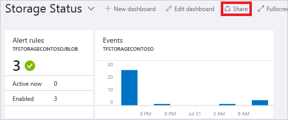
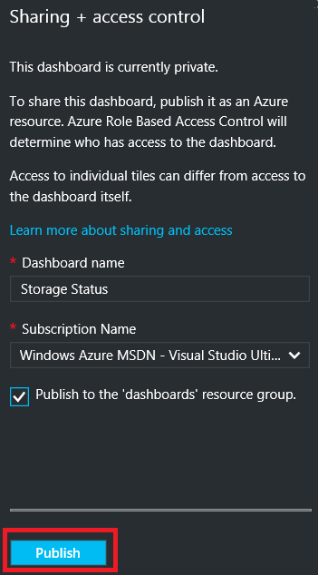
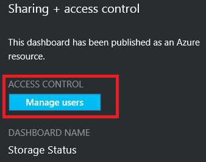
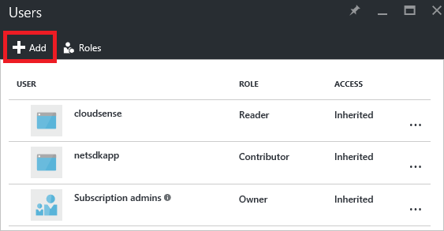
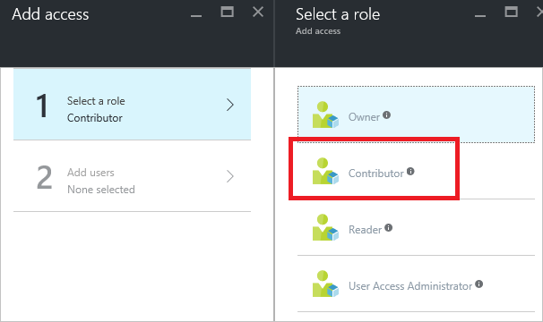
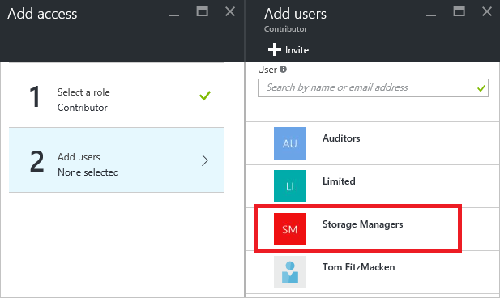
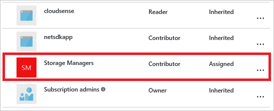

<properties
   pageTitle="Access Azure Portals Dashboard | Microsoft Azure"
   description="In diesem Artikel wird erläutert, wie auf ein Dashboard im Azure-Portal zugreifen."
   services="azure-portal"
   documentationCenter=""
   authors="tfitzmac"
   manager="timlt"
   editor="tysonn"/>

<tags
   ms.service="multiple"
   ms.devlang="NA"
   ms.topic="article"
   ms.tgt_pltfrm="NA"
   ms.workload="na"
   ms.date="08/01/2016"
   ms.author="tomfitz"/>

# Freigabe Azure-dashboards

Nachdem ein Dashboard konfiguriert haben, können Sie veröffentlichen und für andere Benutzer in Ihrer Organisation teilen. Sie gestatten, des Dashboards mithilfe von Azure [Rolle basierend Access Control](../active-directory/role-based-access-control-configure.md)Zugang zu verschaffen. Sie einen Benutzer oder eine Gruppe von Benutzern zu einer Rolle zuweisen, und die Rolle definierten, ob diese Benutzer anzeigen oder ändern das veröffentlichte Dashboard. 

Alle veröffentlichten Dashboards werden als Azure Ressourcen, implementiert, d. h., sie als verwaltbare Elemente innerhalb Ihres Abonnements vorhanden und in einer Ressourcengruppe enthalten sind.  Aus Access-Steuerelement Perspektive unterscheiden sich Dashboards nicht als weitere Ressourcen, wie z. B. eines virtuellen Computers oder einem Speicherkonto.

> [AZURE.TIP] Einzelne Kacheln auf dem Dashboard erzwingen eigene Access Steuerelement Anforderungen basierend auf den Ressourcen, die diese angezeigt werden.  Daher können Sie ein Dashboard entwerfen, die gestreut während weiterhin Schutz der Daten auf einzelne Kacheln freigegeben ist.

## Grundlegendes zu Access-Steuerelement für dashboards

Mit rollenbasierte Access Control können Sie Benutzer, die auf drei verschiedenen Ebenen des Gültigkeitsbereichs Rollen zuweisen:

- Abonnement
- Ressourcengruppe
- Ressource

Die Ihnen zugewiesenen Berechtigungen werden vom Abonnement nach unten zu der Ressource geerbt. Im veröffentlichte Dashboard ist eine Ressource an. Daher möglicherweise bereits Benutzer zugewiesenen Rollen für das Abonnement dies funktioniert auch bei der veröffentlichten Dashboard. 

Hier ist ein Beispiel für ein.  Angenommen, Sie haben ein Azure-Abonnement und verschiedenen Mitgliedern Ihres Teams die Rollen von **Besitzer**, **Mitwirkender**oder **Reader** für das Abonnement zugewiesen wurden. Benutzer, die Besitzer oder Mitwirkenden sind können Listen, anzeigen, erstellen, ändern oder Löschen von Dashboards innerhalb des Abonnements.  Benutzer, die Leser sind können Listen- und Anzeigen von Dashboards, aber nicht ändern oder löschen können.  Benutzer mit Lesezugriff werden lokale Bearbeitungen zu einem veröffentlichten Dashboard vorzunehmen (wie bei der Problembehandlung für eines Problems), können aber nicht auf diese Änderungen wieder auf dem Server veröffentlichen.  Sie haben die Möglichkeit, eine private Kopie des Dashboards für sich selbst zu erstellen

Jedoch können Sie auch Zuweisen von Berechtigungen der Ressourcengruppe, die mehrere Dashboards enthält oder ein einzelnes Dashboard. Beispielsweise können Sie entscheiden, dass eine Gruppe von Benutzern Berechtigungen über das Abonnement jedoch größer Zugriff auf ein bestimmtes Dashboard zugänglich gemacht, sollte. Sie können diese Benutzer zu einer Rolle für die Dashboard zuweisen. 

## Dashboard veröffentlichen

Nehmen wir an, dass Sie ein Dashboard, die Sie für eine Gruppe von Benutzern in Ihrem Abonnement freigeben möchten konfiguriert haben. Schritte darzustellen, eine benutzerdefinierte Gruppe namens-Manager, aber Sie können die Gruppe benennen beliebig würden. Informationen zum Erstellen einer Active Directory-Gruppe und Hinzufügen von Benutzern zu dieser Gruppe finden Sie unter [Verwalten von Gruppen in Azure Active Directory](../active-directory/active-directory-accessmanagement-manage-groups.md).

1. Wählen Sie im Dashboard **Freigeben**.

     

2. Vor dem Zuweisen des Zugriffs, müssen Sie das Dashboard veröffentlichen. Standardmäßig wird das Dashboard in einer Ressourcengruppe mit dem Namen **Dashboards**veröffentlicht werden. Wählen Sie auf **Veröffentlichen**.

     

Ihr Dashboard wird nun veröffentlicht. Wenn aus dem Abonnement vererbten Berechtigungen geeignet sind, müssen Sie nicht mehr nichts. Andere Benutzer in Ihrer Organisation werden auf zugreifen und das Dashboard basierend auf deren Ebene Abonnement ändern. Jedoch für dieses Lernprogramm uns Zuweisen einer Gruppe von Benutzern zu einer Rolle für die Dashboard.

## Zuweisen von Access zu einem dashboard

1. Wählen Sie nach dem Veröffentlichen des Dashboards, **Verwalten von Benutzern**.

     

2. Sie sehen eine Liste der vorhandenen Benutzer, die bereits eine Rolle für das Dashboard zugewiesen sind. Die Liste der vorhandenen Benutzer wird im Bild unten abweichen. In den meisten Fällen werden die Zuordnungen aus dem Abonnement übernommen. Wenn Sie einen neuen Benutzer oder eine Gruppe hinzufügen möchten, wählen Sie **Hinzufügen**aus.

     

3. Wählen Sie die Rolle aus, die die Berechtigungen darstellt, die Sie gewähren möchten. Wählen Sie in diesem Beispiel **Mitwirkender**aus.

     

4. Wählen Sie die Benutzer oder eine Gruppe aus, die Sie zur Rolle zuweisen möchten. Wenn Sie dem Benutzer oder der Gruppe, die Sie in der Liste Suchen nicht angezeigt werden, verwenden Sie das Suchfeld ein. Die Liste der verfügbaren Gruppen hängt von den Gruppen, die Sie in Ihrem Active Directory erstellt haben.

      

5. Wenn Sie das Hinzufügen von Benutzern oder Gruppen abgeschlossen haben, wählen Sie **OK**aus. 

6. Die neue Zuordnung wird die Liste der Benutzer hinzugefügt. Beachten Sie, dass deren **Zugriff** **zugewiesen** , sondern als **geerbt**aufgelistet ist.

     

## Nächste Schritte

- Eine Liste der Rollen, finden Sie unter [RBAC: Standardrollen](../active-directory/role-based-access-built-in-roles.md).
- Weitere Informationen zum Verwalten von Ressourcen, finden Sie unter [Verwalten von Azure Ressourcen über Portal](resource-group-portal.md).