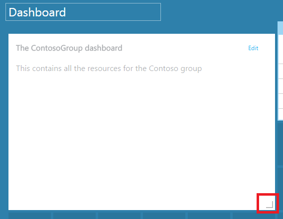
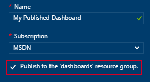

<properties
   pageTitle="Azure Portals Dashboards | Microsoft Azure"
   description="In diesem Artikel wird erläutert, wie Sie Dashboards Azure-Portal erstellen und bearbeiten."
   services="azure-portal"
   documentationCenter=""
   authors="sewatson"
   manager="timlt"
   editor="tysonn"/>

<tags
   ms.service="multiple"
   ms.devlang="NA"
   ms.topic="article"
   ms.tgt_pltfrm="NA"
   ms.workload="na"
   ms.date="09/06/2016"
   ms.author="sewatson"/>

# Erstellen und Freigeben von Dashboards Azure-Portal

Sie können mehrere Dashboards erstellen und mit anderen, die Benutzern den Zugriff auf Ihre Azure-Abonnements haben frei.  Diesen Beitrag durchläuft die Grundlagen zum Erstellen/Bearbeiten, veröffentlichen und Verwalten des Zugriffs auf Dashboards aus.

## Anpassen von Dashboards im Vergleich zu blades

Seit ebenso Dashboards vor ein paar Monaten, wurde es ein konstanter Rückgang Blade Anpassungen und eine schnelle Erhöhung Dashboard Anpassungen. Dieser Trend signifikante Verwendung zeigt, dass Sie bevorzugen Dashboards über Blades anpassen. Um diesen Trend unterstützen, werden wir die Möglichkeit zum Anpassen der Blades und reserviert sein soll unsere Aktivitäten zur Verbesserung der Dashboard-Funktion entfernt. Wenn Sie eine Blade angepasst haben, werden Ihre Anpassung bald entfernt. Um die Anpassung zu erhalten, Fixieren Sie die angepassten Kacheln zu einem Dashboard. Klicken Sie einfach mit der rechten Maustaste in der Kachel, und wählen Sie **Pin zum Dashboard** , wie in der folgenden Abbildung gezeigt.

## Erstellen Sie ein dashboard

Wählen Sie zum Erstellen eines Dashboards, die Schaltfläche **Neues Dashboard** neben dem Namen des Dashboards an.  

Diese Aktion erstellt ein neues, leeres, private Dashboard und Sie in der der Anpassungsmodus, in dem Sie einen Namen des Dashboards und hinzufügen oder neu anordnen können Kacheln, verschoben.  In diesem Modus, klicken Sie im linken Navigationsmenü übernimmt im Katalog reduzierbare Kachel.  Der Kachel Katalog können Sie die Kacheln für Azure Ressourcen auf verschiedene Weise finden: Sie können nach [Ressourcengruppe](../azure-resource-manager/resource-group-overview.md#resource-groups), indem Ressourcenart, nach [Kategorie](../resource-group-using-tags.md), durchsuchen oder für die Ressource ein namentlich durchsuchen.  

Fügen Sie per Drag & Drop, wo Sie möchten auf die Dashboard-Oberfläche Kacheln.

Es wird eine neue Kategorie aufgerufen **Allgemeine** für Kacheln, die keine bestimmte Ressource zugeordnet sind.  In diesem Beispiel anheften wir die Kachel Abzug.  Sie verwenden diese Kachel, um zum Dashboard benutzerdefinierten Inhalt hinzufügen.  Die Kachel unterstützt nur-Text, [Abzug Syntax](https://daringfireball.net/projects/markdown/syntax)und eine begrenzte Anzahl von HTML.  (Für Sicherheit, können Sie beispielsweise einfügen nicht `<script>` tags oder bestimmte Sucherergebnisse Element von CSS, die mit dem Portal beeinträchtigen könnten verwenden.) 

## Bearbeiten eines Dashboards

Nach dem Erstellen des Dashboards, können Sie die Kacheln der Kachel-Katalog oder die Kachel-Darstellung Blades anheften. Lassen Sie uns anheften die Darstellung der unsere Ressourcengruppe aus. Sie können entweder Pin beim Durchsuchen des Elements oder aus dem Ressource Gruppe Blade. Beide Methoden zu Fehlern im anheften und der Darstellung der Kachel der Ressourcengruppe.

Nach dem Fixieren des Elements, wird er auf dem Dashboard angezeigt.

Jetzt, da wir haben eine Abzug Kachel und eine Ressourcengruppe angehefteten zum Dashboard, können wir die Größe und Anordnung von Kacheln in ein geeignetes Layout.

Durch Bewegen und "..." auswählen oder mit der rechten Maustaste auf einer Kachel können Sie die kontextbezogene Befehle für die Kachel anzeigen. Standardmäßig gibt es zwei Elemente:

1. **Lösen von Dashboard** – entfernt die Kachel aus dem dashboard
2.  **Anpassen** – gibt Modus anpassen

Durch Auswahl anpassen, können Sie die Größe und Neuanordnen von Kacheln. Wählen Sie zum Ändern der Größe einer Kachel die neue Größe aus dem Kontextmenü, wie in der folgenden Abbildung gezeigt.

Oder, wenn die Kachel beliebige Größe unterstützt, können Sie die untere rechte Ecke auf die gewünschte Größe ziehen.

Nach dem Ändern der Größe von Kacheln, zeigen Sie das Dashboard.

Sobald Sie fertig sind Anpassen eines Dashboards, wählen Sie einfach die **Anpassung fertig** zu beenden Modus anpassen oder diesen mit der rechten Maustaste und wählen Sie aus dem Kontextmenü aus **Fertig anpassen** .

## Veröffentlichen eines Dashboards und Verwalten von Access-Steuerelement

Wenn Sie ein Dashboard erstellen, ist es private standardmäßig, was bedeutet, dass Sie die einzige Person sind, die angezeigt werden kann.  Um ihn an andere Personen sichtbar zu machen, verwenden Sie die Schaltfläche ' **Freigeben** ', die neben anderen Dashboard-Befehle angezeigt wird.

Sie werden aufgefordert, wählen Sie ein Abonnement und Ressourcengruppe für das Dashboard veröffentlicht werden soll. Um Dashboards nahtlos mit Teil des Netzwerks integriert werden, haben wir freigegebenen Dashboards als Azure Ressourcen implementiert, (, damit Sie freigeben können, indem Sie eine e-Mail-Adresse eingeben).  Zugriff auf die von den meisten der Kacheln im Portal angezeigten Informationen unterliegen [Azure Rolle basierend Access Control](../active-directory/role-based-access-control-configure.md ). Aus Access-Steuerelement Perspektive unterscheiden sich freigegebenen Dashboards nicht von eines virtuellen Computers oder einem Speicherkonto.  

Angenommen, Sie haben ein Azure-Abonnement und Mitgliedern Ihres Teams die Rollen von **Besitzer**, **Mitwirkender**oder **Reader** des Abonnements zugewiesen wurden.  Benutzer, die Besitzer oder Mitwirkenden sind können Listen, anzeigen, erstellen, ändern oder Dashboards innerhalb dieses Abonnement löschen.  Benutzer, die Leser sind können Listen- und Anzeigen von Dashboards, aber nicht ändern oder löschen können.  Benutzer mit Lesezugriff werden lokale Bearbeitungen zu einem freigegebenen Dashboard vorzunehmen, aber Sie können nicht auf diese Änderungen wieder auf dem Server veröffentlichen.  Sie können jedoch eine private Kopie des Dashboards zur eigenen Verwendung vornehmen.  Wie immer erzwingen einzelne Kacheln auf dem Dashboard eigene Access Steuerelement Regeln basierend auf den Ressourcen, die, denen Sie entsprechen.  

Zur Vereinfachung begleitet des Portals publishing Erfahrung Sie rechts ein Muster, in denen Sie Dashboards in einer Ressourcengruppe aufgerufen **Dashboards**platzieren.  

Sie können auch auswählen, ein Dashboards auf einer bestimmten Ressourcengruppe zu veröffentlichen.  Das Access-Steuerelement, um die Dashboard entspricht das Access-Steuerelement für die Ressourcengruppe.  Benutzer, die die Ressourcen in dieser Ressourcengruppe verwalten können, müssen auch Zugriff auf die Dashboards.

Nachdem Ihr Dashboard veröffentlicht wurde, wird der **Freigabe + Access** Steuerelement Bereich aktualisieren, und zeigen Sie Informationen zu dem veröffentlichten Dashboard, einschließlich einen Link, um die Verwaltung des Benutzerzugriffs auf dem Dashboard.  Dieser Link startet den standardmäßigen Rolle basierend Access Bibliothekssteuerungsblade zum Verwalten des Zugriffs für alle Azure Ressource verwendet.  Sie können immer wieder auf diese Ansicht erhalten, indem Sie **Freigabe**auswählen.

## Nächste Schritte

- Zum Verwalten von Ressourcen finden Sie unter [Verwalten von Azure Ressourcen über Portal](resource-group-portal.md).
- Zum Bereitstellen von Ressourcen finden Sie unter [Bereitstellen von Ressourcen mit Ressourcenmanager Vorlagen und Azure-Portal](../resource-group-template-deploy-portal.md).