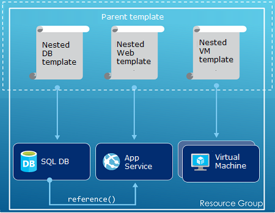

<properties
   pageTitle="Übersicht über die Azure Ressourcenmanager | Microsoft Azure"
   description="Beschreibt, wie Azure Ressourcenmanager für Bereitstellung, Verwaltung und Steuerung von Ressourcen auf Azure zugreifen."
   services="azure-resource-manager"
   documentationCenter="na"
   authors="tfitzmac"
   manager="timlt"
   editor="tysonn"/>

<tags
   ms.service="azure-resource-manager"
   ms.devlang="na"
   ms.topic="get-started-article"
   ms.tgt_pltfrm="na"
   ms.workload="na"
   ms.date="10/21/2016"
   ms.author="tomfitz"/>

# Azure Ressourcenmanager (Übersicht)

Die Infrastruktur für eine Anwendung wird in der Regel viele Komponenten – vielleicht eines virtuellen Computers, Speicherkonto und virtuelles Netzwerk oder eine Web app, Datenbank, Datenbankserver und 3rd Party Services zusammen. Diese Komponenten als separate Einheiten werden nicht angezeigt, stattdessen Sie sehen, wie verwandte und voneinander Teile einer einzelnen Entität. Sie möchten die bereitstellen, verwalten und als Gruppe zu überwachen. Azure Ressourcenmanager können Sie für die Arbeit mit den Ressourcen in Ihre Lösung als Gruppe. Sie können bereitstellen, aktualisieren oder löschen alle Ressourcen, die für Ihre Lösung in einem einzigen, koordinierte Vorgang. Verwenden Sie eine Vorlage für Bereitstellung und dieser Vorlage für die verschiedenen Umgebungen wie testen, Staging oder Fertigung arbeiten kann. Ressourcenmanager bietet Sicherheit, Überwachung und thematischen Sie Ressourcen nach der Bereitstellung verwalten können. 

## Terminologie

Wenn Sie zum Azure Ressourcenmanager nicht vertraut sind, sind einige Ausdrücke, die Sie möglicherweise nicht vertraut.

- **Ressourcen** - eine verwaltbare Element, das über Azure verfügbar ist. Einige allgemeinen Ressourcen sind eine virtuellen Computern Speicher-Konto, Online, Datenbank und virtuelle Netzwerk, aber es gibt viele weitere.
- **Ressourcengruppe** - ein Container, der zugehörige Ressourcen für eine Azure-Lösung. Alle Ressourcen für die Lösung oder nur die Ressourcen, die Sie als Gruppe verwalten möchten, kann die Ressourcengruppe enthalten. Sie entscheiden, wie Zuordnen von Ressourcen zu Ressourcengruppen basierend auf am sinnvollsten für Ihre Organisation Besonderheiten werden soll. Finden Sie unter [Gruppen für Ressourcen](#resource-groups).
- **Anbieter für Ressourcen** - ein Dienst, die Ressourcen liefert bereitstellen und bis Ressourcenmanager verwaltet werden können. Jeder Anbieter für Ressourcen bietet Vorgänge für das Arbeiten mit den Ressourcen, die bereitgestellt werden. Einige allgemeine Ressourcenanbieter sind Microsoft.Compute, die die Ressource virtuellen Computern bereitstellt, Microsoft.Storage, der Ressource Konto Speicher bereitstellt, und Microsoft.Web, die im Zusammenhang mit Web apps Ressourcen bereitstellt. Finden Sie unter [Ressourcenanbieter](#resource-providers).
- **Ressourcenmanager Vorlage** - A JavaScript Object Notation (JSON)-Datei, die eine oder mehrere Ressourcen bereitstellen einer Ressourcengruppe definiert. Darüber hinaus werden die Abhängigkeiten zwischen den bereitgestellten Ressourcen definiert. Die Vorlage kann verwendet werden, die Ressourcen einheitlich und wiederholt bereitstellen. Finden Sie unter [Vorlage Bereitstellung](#template-deployment).
- **Deklarationssyntax** - Syntax, die ermöglicht, die Sie state "Hier ich beabsichtigen, erstellen" ohne die Reihenfolge der Programmierung schreiben Befehle, um sie zu erstellen. Die Vorlage Ressourcenmanager ist ein Beispiel für Deklarationssyntax. Klicken Sie in der Datei definieren Sie die Eigenschaften für die Infrastruktur für die Bereitstellung auf Azure. 

## Die Vorteile von Ressourcenmanager

Ressourcenmanager bietet mehrere Vorteile:

- Sie können bereitstellen, verwalten und überwachen alle Ressourcen, die für Ihre Lösung als eine Gruppe, anstatt einzeln, diese Ressourcen zu behandeln.
- Wiederholt können Sie Ihre Lösung während des Entwicklungszyklus bereitstellen und KONFIDENZ, die in einem konsistenten Zustand Ressourcen bereitgestellt werden müssen.
- Sie können Ihre Infrastruktur über deklarative Vorlagen statt Skripts verwalten.
- Sie können festlegen, dass die Abhängigkeiten zwischen Ressourcen, damit sie in der richtigen Reihenfolge bereitgestellt werden.
- Sie können Access-Steuerelement auf alle Dienste in der Ressourcengruppe anwenden, da rollenbasierte Access Control (RBAC) systembedingt in der Management-Plattform integriert ist.
- Sie können Tags zu Ressourcen, die alle Ressourcen, die in Ihrem Abonnement logisch organisieren anwenden.
- Sie können Ihrer Organisation Abrechnung verdeutlichen möchten, durch die Kosten für eine Gruppe von Ressourcen, die Freigabe des gleichen Tags anzuzeigen.  

Ressourcenmanager bietet eine neue Möglichkeit zum Bereitstellen und Verwalten Ihrer Lösungen. Wenn Sie die Bereitstellung ältere verwendet und die Änderungen erfahren möchten, finden Sie unter [Grundlegendes zu Ressourcenmanager und klassischen Bereitstellung](../resource-manager-deployment-model.md).

## Konsistente Management layer

Ressourcenmanager bietet eine konsistente Management-Ebene für die Aufgaben, die Sie durch Azure PowerShell, Azure CLI, Azure-Portal, REST-API und Entwicklungstools ausführen. Alle Tools verwenden eine allgemeine Reihe von Vorgängen. Verwenden Sie die Tools, die eignen sich am besten für Sie und können diese Synonym ohne Verwirrung. 

Das folgende Bild zeigt, wie alle Tools mit derselben Azure Ressourcenmanager API interagieren. Die-API übergibt Anfragen an den Ressourcenmanager, die authentifiziert und autorisiert die Anforderungen an. Ressourcenmanager leitet die Anforderungen klicken Sie dann auf die entsprechende Ressourcenanbieter.

## Anleitung

Die folgenden Vorschläge helfen Ihnen die Vorteile der Ressourcenmanager zu nutzen, bei der Arbeit mit Ihrem Lösungen.

1. Definieren und Ihre Infrastruktur durch die Deklarationssyntax in Ressourcenmanager Vorlagen und nicht über die Befehle bereitstellen.
2. Definieren Sie alle Schritte für Bereitstellung und Konfiguration in der Vorlage ein. Sie sollten keine manuelle Schritte zum Einrichten Ihrer Lösung verfügen.
3. Führen Sie die Befehle zum Verwalten von Ressourcen, wie das Starten und Beenden einer app oder Computer.
4. Ordnen Sie Ressourcen mit dem gleichen Lebenszyklus in einer Ressourcengruppe aus. Verwenden von Kategorien für alle anderen Organisieren von Ressourcen.

Weitere Empfehlungen finden Sie unter [bewährte Methoden zum Erstellen von Azure Ressourcenmanager Vorlagen](../resource-manager-template-best-practices.md).

## Ressourcengruppen

Es gibt einige wichtigen Faktoren berücksichtigen, wenn Sie Ihre Ressourcengruppe definieren:

1. Alle Ressourcen in der Gruppe sollte den gleichen Lebenszyklus freigeben. Sie bereitstellen, aktualisieren und löschen ist möglich zusammen. Wenn eine Ressource, beispielsweise einem Datenbankserver auf einem anderen Bereitstellungszyklus vorhanden sein muss sollte in einer anderen Ressourcengruppe sein.
2. Jeder Ressource kann nur in einer Ressourcengruppe vorhanden.
3. Sie können hinzufügen oder Entfernen einer Ressourcengruppe für eine Ressource zu einem beliebigen Zeitpunkt.
4. Sie können eine Ressource aus einer Ressourcengruppe in eine andere Gruppe verschieben. Weitere Informationen finden Sie unter [Verschieben von Ressourcen zu neuen Ressourcengruppe oder das Abonnement](../resource-group-move-resources.md).
4. Eine Ressourcengruppe kann Ressourcen enthalten, die in unterschiedlichen Regionen befinden.
5. Eine Ressourcengruppe kann in Access-Steuerelement für administrative Vorgänge Bereich verwendet werden.
6. Eine Ressource kann mit Ressourcen in anderen Ressourcengruppen interagieren. Diese Interaktion ist üblich, wenn die beiden Ressourcen beziehen sich aber nicht den gleichen Lebenszyklus (z. B. Web apps Herstellen einer Verbindung mit einer Datenbank) freigeben.

Wenn Sie eine Ressourcengruppe erstellen möchten, müssen Sie einen Speicherort für die Ressourcengruppe bereitzustellen. Sie vielleicht, "Warum eine Ressourcengruppe einen Speicherort erforderlich? Und wenn die Ressourcen unterschiedliche Standorten als der Ressourcengruppe können, warum die Ressource Gruppe Position spielt überhaupt?" Die Ressourcengruppe speichert die Metadaten für die Ressourcen. Daher, wenn Sie einen Speicherort für die Ressourcengruppe angeben, geben Sie an, dass Metadaten gespeichert ist. Aus Gründen der Compliance müssen Sie sicherstellen, dass Ihre Daten in einem bestimmten Bereich gespeichert sind.

## Ressourcenanbieter

Jeder Ressourcenanbieter bietet eine Reihe von Ressourcen und Operationen für das Arbeiten mit einer Azure Service. Wenn Sie Schlüssel und Kennwörter speichern möchten, arbeiten Sie beispielsweise mit der **Microsoft.KeyVault** -Anbieter für Ressourcen. Anbieter für diese Ressourcen bietet einen Ressourcentyp **Depots** zum Erstellen der wichtigsten Tresor und einen Ressourcentyp aufgerufen **Depots/Schlüssel** zum Erstellen einer geheim im Key Tresor bezeichnet. 

Bevor Sie erste Schritte mit der Bereitstellung von Ressourcen, sollten Sie die verfügbaren Ressourcenanbieter vertraut. Wenn die Namen der Ressourcenanbieter und Ressourcen leichter Ressourcen zu definieren, die Sie in Azure bereitstellen möchten.

Alle Ressourcenanbieter mit dem folgenden PowerShell-Cmdlet abgerufen werden:

    Get-AzureRmResourceProvider -ListAvailable

Oder mit Azure-CLI abrufen Sie alle Ressourcenanbieter mit den folgenden Befehl aus:

    azure provider list

Sie können über die zurückgegebene Liste für die Ressourcenanbieter suchen möchten, die Sie verwenden müssen.

Fügen Sie den Anbieternamespace auf den Befehl, um Details zu einer Ressourcenanbieter zu erhalten. Der Befehl gibt die unterstützten Ressourcentypen für den Ressourcenanbieter und der unterstützten Orte und Versionen für jeden Ressourcentyp-API. Das folgende PowerShell-Cmdlet ruft Details Microsoft.Compute:

    (Get-AzureRmResourceProvider -ProviderNamespace Microsoft.Compute).ResourceTypes

Oder mit Azure CLI, Abrufen der unterstützten Ressourcentypen, Positionen und API Versionen für Microsoft.Compute, mit den folgenden Befehl aus:

    azure provider show Microsoft.Compute --json > c:\Azure\compute.json

Weitere Informationen finden Sie unter [Ressourcenmanager Anbieter, Regionen, API Versionen und Schemas](../resource-manager-supported-services.md).

## Vorlage-Bereitstellung

Mit Ressourcen-Manager können Sie eine Vorlage (im JSON-Format) erstellen, die die Infrastruktur und die Konfiguration von Azure-Lösung definiert. Mithilfe einer Vorlage können Sie wiederholt Bereitstellen Ihrer Lösung während des gesamten Lebenszyklus und KONFIDENZ, die in einem konsistenten Zustand Ressourcen bereitgestellt werden müssen. Wenn Sie eine Lösung aus dem Portal erstellen, enthält die Lösung automatisch eine Vorlage für die Bereitstellung. Sie verfügen nicht zum Erstellen einer Vorlage von Grund auf, da Sie mit der Vorlage für Ihre Lösung starten und, um Ihre individuellen Bedürfnisse anpassen können. Sie können eine Vorlage für eine vorhandene Ressourcengruppe abrufen, indem Sie entweder den aktuellen Status der Ressourcengruppe exportieren oder die Vorlage für eine bestimmte Bereitstellung anzeigen. Anzeigen der [exportierten Vorlage](../resource-manager-export-template.md) ist eine nützliche Möglichkeit lernen die Vorlagensyntax.

Weitere Informationen über das Format der Vorlage und wie Sie erstellen, finden Sie unter [Authoring Azure Ressourcenmanager Vorlagen](../resource-group-authoring-templates.md) und [Ressourcenmanager Vorlage Exemplarische Vorgehensweise](../resource-manager-template-walkthrough.md).

Ressourcenmanager verarbeitet die Vorlage wie jede andere Anforderung ( [Layer konsistente Management](#consistent-management-layer)finden Sie unter dem Bild). Die Vorlage analysiert und seine Syntax in REST-API Vorgänge für die entsprechende Ressourcenanbieter konvertiert. Wenn erhält Ressourcenmanager beispielsweise eine Vorlage mit der Ressourcendefinition der folgenden:

    "resources": [
      {
        "apiVersion": "2016-01-01",
        "type": "Microsoft.Storage/storageAccounts",
        "name": "mystorageaccount",
        "location": "westus",
        "sku": {
          "name": "Standard_LRS"
        },
        "kind": "Storage",
        "properties": {
        }
      }
      ]

Konvertiert die Definition in folgenden REST-API Operation an den Microsoft.Storage Ressourcenanbieter gesendet werden:

    PUT
    https://management.azure.com/subscriptions/{subscriptionId}/resourceGroups/{resourceGroupName}/providers/Microsoft.Storage/storageAccounts/mystorageaccount?api-version=2016-01-01
    REQUEST BODY
    {
      "location": "westus",
      "properties": {
      }
      "sku": {
        "name": "Standard_LRS"
      },   
      "kind": "Storage"
    }

Wie Sie Vorlagen und Ressourcengruppen definieren, bleibt Sie und wie Sie Ihre Lösung verwalten möchten. Beispielsweise können Sie Ihre Anwendung drei Ebene über eine einzelne Vorlage zu einer einzigen Ressourcengruppe bereitstellen.

Aber Sie haben keinen Ihre gesamte Infrastruktur in einer Vorlage definieren. Häufig Sie es sinnvoll, Ihren Anforderungen Bereitstellung in eine Reihe von Vorlagen für gezielte, Zweck-spezifische dividiert wird. Sie können diese Vorlagen für andere Lösungen problemlos wiederverwenden. Um eine bestimmte Lösung bereitstellen möchten, erstellen Sie eine master-Vorlage, die alle erforderlichen Vorlagen links aus. Die folgende Abbildung zeigt, wie Sie eine Lösung drei Ebenen über eine Vorlage übergeordneten bereitstellen, die drei geschachtelte Vorlagen enthält.

Wenn Sie beabsichtigen, das Ihre Probleme separaten Stunden-Ebenen, können Sie Ihre drei Ebenen, um Ressourcengruppen zu trennen bereitstellen. Beachten Sie, dass die Ressourcen noch auf Ressourcen in anderen Ressourcengruppen verknüpft werden können.

Weitere Vorschläge zum Entwerfen Ihre Vorlagen finden Sie unter [Muster zum Entwerfen von Azure Ressourcenmanager Vorlagen](../best-practices-resource-manager-design-templates.md). Informationen zu verschachtelten Vorlagen finden Sie unter [Verwenden von verknüpften Vorlagen Azure Ressourcenmanager](../resource-group-linked-templates.md).

Azure Ressourcenmanager analysiert Abhängigkeiten, um sicherzustellen, dass die Ressourcen in der richtigen Reihenfolge erstellt werden. Wenn eine Ressource einen Wert aus einer anderen Ressource (z. B. eines virtuellen Computers, benötigen ein Speicherkonto für Datenträger) erforderlich ist, legen Sie eine Abhängigkeit. Weitere Informationen finden Sie unter [Definieren von Abhängigkeiten in Azure Ressourcenmanager Vorlagen](../resource-group-define-dependencies.md).

Sie können auch die Vorlage nach Updates suchen, um die Infrastruktur verwenden. Sie können beispielsweise Hinzufügen einer Ressource zu Ihrer Lösung und Hinzufügen von von Konfigurationsregeln für die Ressourcen, die bereits bereitgestellt werden. Wenn die Vorlage gibt an, erstellen eine Ressource aus, aber, dass die Ressource bereits vorhanden ist, führt Ressourcenmanager Azure ein Update statt eine neue Anlage zu erstellen. Azure Ressourcenmanager aktualisiert die bestehende Anlage auf den gleichen Zustand, wie es als neue wäre.  

Ressourcenmanager bietet Erweiterungen für Szenarios an, wenn Sie benötigen zusätzliche JOIN-Operationen wie der Installation von bestimmter Software, die nicht in der Einrichtung enthalten ist. Wenn Sie bereits eine Konfiguration Verwaltungsdienst, wie DSC, Verwaltungsangestellte oder Marionette, verwenden können Sie die Arbeit mit diesen Dienst mithilfe von Erweiterungen fortsetzen. Informationen zu virtuellen Computern Extensions finden Sie unter [Informationen zu virtuellen Computern Extensions und Features](../virtual-machines/virtual-machines-windows-extensions-features.md). 

Die Vorlage wird schließlich Teil des Quellcodes für Ihre app. Sie können an der Quelle Code Repository Einchecken und aktualisieren sie Ihre app Weiterentwicklung. Sie können die Vorlage über Visual Studio bearbeiten.

Nach dem definieren Ihre Vorlage, sind Sie bereit sind, die Ressourcen Azure bereitstellen. Für die Befehle zum Bereitstellen von Ressourcen finden Sie unter:

- [Bereitstellen von Ressourcen mit Ressourcenmanager Vorlagen und Azure-PowerShell](../resource-group-template-deploy.md)
- [Bereitstellen von Ressourcen mit Ressourcenmanager Vorlagen und Azure CLI](../resource-group-template-deploy-cli.md)
- [Bereitstellen von Ressourcen mit Ressourcenmanager Vorlagen und Azure-portal](../resource-group-template-deploy-portal.md)
- [Bereitstellen von Ressourcen mit Ressourcenmanager Vorlagen und Ressourcenmanager REST-API](../resource-group-template-deploy-rest.md)

## Kategorien

Ressourcenmanager bietet ein tagging Feature, das Sie Ressourcen nach Ihren Anforderungen zu verwalten oder Abrechnung kategorisieren kann. Verwenden Sie Kategorien, wenn Sie eine komplexe von Ressourcen- und Ressourcen Sammlung und müssen diese Posten verarbeitet visualisiert werden sollen, die für Sie am sinnvollsten ist. Beispielsweise könnten Sie Ressourcen markieren, die eine ähnliche Rolle in Ihrer Organisation dienen oder zu derselben Abteilung gehören. Ohne Tags können Benutzer in Ihrer Organisation mehrere Ressourcen erstellen, die möglicherweise schwierig zu einem späteren Zeitpunkt identifizieren und verwalten. Möglicherweise möchten Sie beispielsweise alle Ressourcen für ein bestimmtes Projekt zu löschen. Wenn diese Ressourcen für das Projekt nicht markiert sind, müssen Sie manuell problemlos finden. Kategorisieren von kann eine wichtige Möglichkeit, unnötige Kosten in Ihr Abonnement zu verringern. 

Ressourcen müssen nicht in derselben Ressourcengruppe zum Freigeben einer Kategorie befinden. Sie können eigene Taxonomie Kategorie, um sicherzustellen, dass alle Benutzer in Ihrer Organisation Benutzer versehentlich weicht Kategorien (beispielsweise "Abteilung" statt "Abteilung") anwenden, anstatt häufig verwendete Tags verwenden erstellen.

Im folgenden Beispiel wird eine Kategorie zu einer virtuellen Computern angewendet.

    "resources": [    
      {
        "type": "Microsoft.Compute/virtualMachines",
        "apiVersion": "2015-06-15",
        "name": "SimpleWindowsVM",
        "location": "[resourceGroup().location]",
        "tags": {
            "costCenter": "Finance"
        },
        ...
      }
    ]

Verwenden Sie das folgende PowerShell-Cmdlet, um alle Ressourcen, die mit einem Wert Kategorie abzurufen:

    Find-AzureRmResource -TagName costCenter -TagValue Finance

Oder den folgenden Befehl aus Azure CLI:

    azure resource list -t costCenter=Finance --json

Sie können auch über das Portal Azure kategorisierte Ressourcen anzeigen.

[Verwendungsbericht](../billing/billing-understand-your-bill.md) für Ihr Abonnement umfasst Tagnamen und Werte, womit Sie Kosten durch Tags aufgehoben werden können. Weitere Informationen zu Kategorien finden Sie unter [Verwenden von Kategorien, um Ihre Azure Ressourcen zu organisieren](../resource-group-using-tags.md).

## Steuerung des Benutzerzugriffs

Ressourcenmanager können Sie steuern, wer Zugriff auf bestimmte Aktionen für Ihre Organisation verfügt. Systembedingt rollenbasierte Access-Steuerelements (RBAC) in der Management-Plattform integriert, und bezieht sich dieses Steuerelement Zugriff auf alle Dienste in der Ressourcengruppe. 

Es gibt zwei wichtigsten Konzepte zu verstehen, bei der Arbeit mit Access rollenbasierte Steuerelement:

- Rollendefinitionen - beschreiben ein Satzes von Berechtigungen und in vielen Aufgaben verwendet werden können.
- Rollenzuweisungen - zuordnen eine Definition für eine Identität (Benutzer oder Gruppe) für einen bestimmten Bereich (Abonnement, Ressourcengruppe oder Ressource). Die Zuordnung wird durch unteren Bereiche geerbt.

Sie können Benutzer vordefinierte Plattform und Ressourcen-spezifische Funktionen hinzufügen. Beispielsweise können Sie nutzen der vordefinierte Rolle aufgerufen Reader, die ermöglicht Benutzern das Anzeigen von Ressourcen, aber nicht ändern können. Hinzufügen von Benutzern in Ihrer Organisation, die diese Art von Zugriff auf die Rolle Leser benötigen und die Rolle auf das Abonnement, Ressourcengruppe oder Ressource anwenden.

Azure bietet die folgenden vier Plattform Rollen:

1.  Besitzer - können alles, einschließlich Zugriff verwalten
2.  Mitwirkender - können alles außer Zugriff verwalten
3.  Reader - können alles anzeigen, jedoch können keine Änderungen vornehmen
4.  Access-Administrator Benutzer - können Verwalten des Benutzerzugriffs auf Azure Ressourcen

Azure enthält auch mehrere Ressource-spezifische Funktionen. Einige allgemeinen Spalten sind:

1.  Virtuellen Computern Mitwirkender - virtuellen Computern verwalten können, aber nicht erteilen darauf zugreifen und das virtuelle Netzwerk oder Speicher-Konto, mit dem sie verbunden sind, nicht verwalten
2.  Netzwerk-Mitwirkender - können alle Netzwerk-Ressourcen verwalten, aber nicht erteilen Zugriff darauf
3.  Speicher Konto Mitwirkender - können Speicherkonten verwalten, aber nicht erteilen Zugriff darauf
4. Mitwirkender für SQL Server - verwalten können, SQL Server und Datenbanken, aber nicht ihre Sicherheits-Richtlinien
5. Website Mitwirkender - verwalten können, Websites, aber nicht die Web-Pläne, die mit dem sie verbunden sind

Die vollständige Liste der Rollen und zulässige Aktionen, finden Sie unter [RBAC: integrierte Rollen](../active-directory/role-based-access-built-in-roles.md). Weitere Informationen zu Access rollenbasierte Steuerelement finden Sie unter [Rollenbasierte Azure Access Control](../active-directory/role-based-access-control-configure.md). 

In einigen Fällen in Code oder Skripts, die Ressourcen greift auf ausgeführt werden sollen, aber nicht unter Anmeldeinformationen des Benutzers ausführen möchten. Sie möchten stattdessen so erstellen eine Identität einen Dienst für die Anwendung Hauptbenutzer bezeichnet, und weisen die geeignete Rolle für den Dienst, die wichtigsten. Ressourcenmanager können Sie Anmeldeinformationen für die Anwendung erstellen und programmgesteuert Authentifizierung der Anwendung. Weitere Informationen zum Erstellen von Dienst Hauptbenutzer, finden Sie unter folgenden Themen:

- [Erstellen einer Tilgungsanteile Dienst, den Zugriff auf Ressourcen mithilfe von Azure PowerShell](../resource-group-authenticate-service-principal.md)
- [Verwenden Sie zum Erstellen einer Tilgungsanteile Dienst, den Zugriff auf Ressourcen Azure CLI](../resource-group-authenticate-service-principal-cli.md)
- [Erstellen von Active Directory-Anwendung und Dienst Tilgungsanteile, die Ressourcen zugreifen kann mithilfe von portal](../resource-group-create-service-principal-portal.md)

Sie können auch explizit kritische Ressourcen, um zu verhindern, dass Benutzer löschen oder ändern diese Sperren. Weitere Informationen finden Sie unter [Sperrenressourcen Azure Ressourcenmanager](../resource-group-lock-resources.md).

## Von Aktivitätsprotokollen

Ressourcenmanager protokolliert alle Vorgänge, die erstellen, ändern oder Löschen einer Ressource an. Sie können die Aktivitätsprotokolle verwenden, um ein Fehler bei der Problembehandlung zu finden oder überwachen, wie ein Benutzer in Ihrer Organisation eine Ressource geändert. Wählen Sie die Protokolle finden Sie in das Blade **Einstellungen** für eine Ressourcengruppe **Aktivitätsprotokolle** aus. Sie können die Protokolle nach viele verschiedene Werte, einschließlich der Benutzer den Vorgang initiiert filtern. Informationen zum Arbeiten mit der Aktivitätsprotokolle finden Sie unter [Audit Vorgänge mit Ressourcen-Manager](../resource-group-audit.md).

## Benutzerdefinierte Richtlinien

Ressourcenmanager können Sie benutzerdefinierte Richtlinien für die Verwaltung von Ressourcen zu erstellen. Die Typen von Richtlinien, die Sie erstellen können unterschiedliche Szenarien enthalten. Sie können erzwingen, dass eine Benennungskonvention auf Ressourcen, Grenzwert, welche Typen und Instanzen von Ressourcen bereitgestellt werden kann, oder Grenzwert für welche Bereiche einen Typ von Ressource gehostet werden können. Sie können einen Kategorie Wert Ressourcen Abrechnung nach Abteilungen organisieren erforderlich. Sie erstellen Richtlinien zur Reduzierung Kosten und Konsistenz in Ihr Abonnement. 

Definieren von Richtlinien mit JSON und wenden Sie dann diesen Richtlinien über Ihr Abonnement oder innerhalb einer Ressourcengruppe. Richtlinien sind Access rollenbasierte Steuerelement unterscheiden, da Ressourcentypen zugewiesen werden.

Im folgenden Beispiel wird eine Richtlinie, die gewährleistet Konsistenz durch angeben, dass alle Ressourcen eine Kategorie CostCenter enthalten.

    {
      "if": {
        "not" : {
          "field" : "tags",
          "containsKey" : "costCenter"
        }
      },
      "then" : {
        "effect" : "deny"
      }
    }

Es gibt viele weitere Typen von Richtlinien, die Sie erstellen können. Weitere Informationen finden Sie unter [Verwenden von Richtlinien zum Verwalten von Ressourcen und Steuern des Zugriffs](../resource-manager-policy.md).

## SDKs

Azure SDKs stehen für mehrere Sprachen und Plattformen.
Jeder diese Sprache Implementierungen ist durch das Netz-Paket-Manager und den GitHub zur Verfügung.

Der Code in jedem der folgenden SDKs wird aus Azure REST API-Spezifikationen generiert.
Diese Spezifikationen sind Quelle öffnen und basierend auf der Swagger 2.0-Spezifikation.
Der SDK Code wird über eine Open Source-Projekt namens AutoRest generiert.
AutoRest transformiert diese Spezifikationen REST-API in Client-Bibliotheken in mehreren Sprachen.
Wenn Sie alle Aspekte des generierten Codes in den SDKs verbessern möchten, die der ganze Satz von Tools zum Erstellen der SDKs sind, öffnen, kostenlos verfügbar und basierend auf einem angenommenen API Specification-Format.

Hier sind unsere Open Quelle SDK Repositorys aus. Wir Willkommen Feedback, Probleme, und ziehen Sie Besprechungsanfragen.

[.NET](https://github.com/Azure/azure-sdk-for-net) | [Java](https://github.com/Azure/azure-sdk-for-java) | [Node.js](https://github.com/Azure/azure-sdk-for-node) | [PHP](https://github.com/Azure/azure-sdk-for-php) | [Python](https://github.com/Azure/azure-sdk-for-python) | [Ruby](https://github.com/Azure/azure-sdk-ruby)

> [AZURE.NOTE]Falls das SDK die erforderliche Funktionen zur Verfügung steht, können Sie auch direkt an die [Azure REST-API](https://msdn.microsoft.com/library/azure/dn790568.aspx) aufrufen.

## Beispiele

### .NET

- [Verwalten von Azure Ressourcen und Ressourcengruppe](https://azure.microsoft.com/documentation/samples/resource-manager-dotnet-resources-and-groups/)
- [Bereitstellen einer SSH aktiviert virtueller Computer mit einer Vorlage](https://azure.microsoft.com/documentation/samples/resource-manager-dotnet-template-deployment/)

### Java

- [Verwalten von Azure Ressourcen](https://azure.microsoft.com/documentation/samples/resources-java-manage-resource/)
- [Verwalten von Azure-Ressourcengruppen](https://azure.microsoft.com/documentation/samples/resources-java-manage-resource-group/)
- [Bereitstellen einer SSH aktiviert virtueller Computer mit einer Vorlage](https://azure.microsoft.com/documentation/samples/resources-java-deploy-using-arm-template/)

### Node.js

- [Verwalten von Azure Ressourcen und Ressourcengruppe](https://azure.microsoft.com/documentation/samples/resource-manager-node-resources-and-groups/)
- [Bereitstellen einer SSH aktiviert virtueller Computer mit einer Vorlage](https://azure.microsoft.com/documentation/samples/resource-manager-node-template-deployment/)

### Python

- [Verwalten von Azure Ressourcen und Ressourcengruppe](https://azure.microsoft.com/documentation/samples/resource-manager-python-resources-and-groups/)
- [Bereitstellen einer SSH aktiviert virtueller Computer mit einer Vorlage](https://azure.microsoft.com/documentation/samples/resource-manager-python-template-deployment/)

### Ruby

- [Verwalten von Azure Ressourcen und Ressourcengruppe](https://azure.microsoft.com/documentation/samples/resource-manager-ruby-resources-and-groups/)
- [Bereitstellen einer SSH aktiviert virtueller Computer mit einer Vorlage](https://azure.microsoft.com/documentation/samples/resource-manager-ruby-template-deployment/)

Zusätzlich zu diesen Beispielen können Sie durch den Katalog Beispielen suchen.

[.NET](https://azure.microsoft.com/documentation/samples/?service=azure-resource-manager&platform=dotnet) | [Java](https://azure.microsoft.com/documentation/samples/?service=azure-resource-manager&platform=java) | [Node.js](https://azure.microsoft.com/documentation/samples/?service=azure-resource-manager&platform=nodejs) | [Python](https://azure.microsoft.com/documentation/samples/?service=azure-resource-manager&platform=python) | [Ruby](https://azure.microsoft.com/documentation/samples/?service=azure-resource-manager&platform=ruby)

## Nächste Schritte

- Eine einfache Einführung in die für die Arbeit mit Vorlagen finden Sie unter [Exportieren eine Ressourcenmanager Azure-Vorlage von vorhandenen Ressourcen](../resource-manager-export-template.md).
- Eine ausführlichere Exemplarische Vorgehensweise zum Erstellen einer Vorlage finden Sie unter [Exemplarische Vorgehensweise Ressourcenmanager-Vorlage](../resource-manager-template-walkthrough.md).
- Um die Funktionen zu verstehen, die Sie in eine Vorlage verwenden können, finden Sie unter [Vorlagenfunktionen](../resource-group-template-functions.md)
- Informationen zur Verwendung von Visual Studio mit Ressourcenmanager finden Sie unter [Erstellen und Bereitstellen von Azure-Ressourcengruppen über Visual Studio](../vs-azure-tools-resource-groups-deployment-projects-create-deploy.md).
- Informationen zur Verwendung von Code im Vergleich mit Ressourcenmanager finden Sie unter [Arbeiten mit Azure Ressourcenmanager Vorlagen in Visual Studio-Code](../resource-manager-vs-code.md).

Hier ist eine Videodemonstration dieser Übersicht:

[AZURE.VIDEO azure-resource-manager-overview]

[powershellref]: https://msdn.microsoft.com/library/azure/dn757692(v=azure.200).aspx
