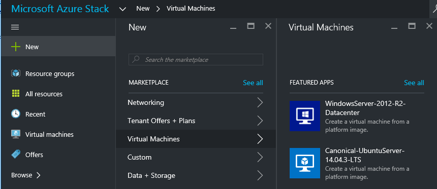
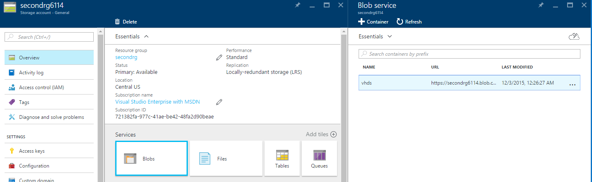
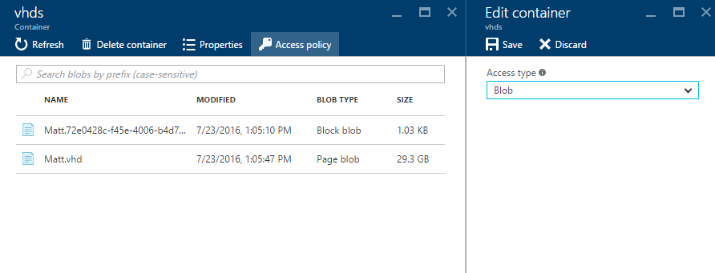
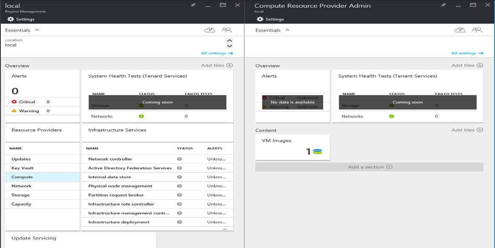
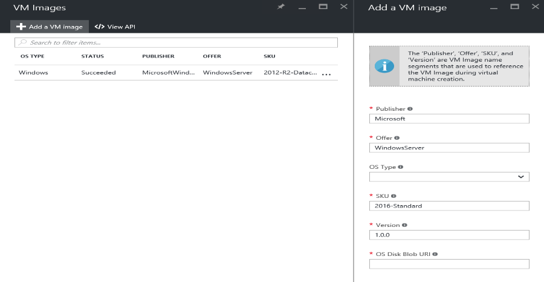

<properties
    pageTitle="Ein Bild virtueller Computer Azure Stapel hinzufügen | Microsoft Azure"
    description="Fügen Sie Ihrer Organisation benutzerdefinierte Windows oder Linux VM für den Mandanten verwenden hinzu"
    services="azure-stack"
    documentationCenter=""
    authors="mattmcg"
    manager="darmour"
    editor=""/>

<tags
    ms.service="azure-stack"
    ms.workload="na"
    ms.tgt_pltfrm="na"
    ms.devlang="na"
    ms.topic="get-started-article"
    ms.date="09/26/2016"
    ms.author="mattmcg"/>

# <a name="make-a-custom-virtual-machine-image-available-in-azure-stack"></a>Bereitstellen eines benutzerdefinierten virtuellen Computern Bilds in Azure Stapel


Azure Stapel kann Administratoren virtueller Computer Bilder, wie ihre Organisation benutzerdefinierte virtuelle Festplatte, deren Mandanten zur Verfügung stellen. Bilder können optimiert Azure Ressourcenmanager Vorlagen oder zur Azure Marketplace-Benutzeroberfläche mit der Erstellung eines Elements Marketplace hinzugefügt werden. Ein Bild von Windows Server 2012 R2 ist standardmäßig in der Azure Stapel Technical Preview enthalten.

> [AZURE.NOTE] Virtueller Computer Bildern mit Marketplace Elemente können, indem **neu** in der Benutzeroberfläche, dann auswählen die Kategorie **virtuellen Computern** und bereitgestellt werden. Die virtuellen Computer Bild Elemente aufgelistet.


## <a name="add-a-vm-image-to-marketplace-with-powershell"></a>Hinzufügen eines virtuellen Computer zu Marketplace mit PowerShell

Wenn das Bild virtueller Computer virtuelle Festplatte lokal auf die Verwaltungskonsole virtueller Computer (oder ein anderes extern angeschlossenen Gerät) verfügbar ist, gehen Sie folgendermaßen vor:

1. Vorbereiten einer Windows oder Linux Betriebssystem virtuelle Festplattenabbild im virtuelle Festplatte-Format (nicht VHDX).
    -   Für Windows-Bilder enthält im Artikel [Hochladen eines Bilds virtuellen Windows-Computer in Azure für Ressourcenmanager Bereitstellungen](virtual-machines-windows-upload-image.md) Bild Vorbereitung Anweisungen im Abschnitt **Vorbereiten der virtuellen Festplatte für hochladen** .
    -   Führen Sie für Linux Bilder die Schritte zum Vorbereiten des Bilds oder verwenden Sie ein vorhandenes Azure Stapel Linux Bild aus, wie im Artikel [Bereitstellen Linux virtuellen Computern Azure Stapel](azure-stack-linux.md)beschrieben.

2. Klonen Sie [Repository Azure Stapel-Tools](https://aka.ms/azurestackaddvmimage), und importieren das Modul **ComputeAdmin**

    ```powershell
    Import-Module .\ComputeAdmin\AzureStack.ComputeAdmin.psm1
    ```

3. Fügen Sie das Bild virtueller Computer, indem Sie das Cmdlet VMImage hinzufügen.
    -  Beziehen Sie die Publisher, Angebot, SKU und Version für das Bild virtueller Computer. Diese Parameter werden von Azure Ressourcenmanager Vorlagen verwendet, die auf das Bild virtueller Computer verweisen.
    -  Geben Sie OsType als Windows oder Linux.
    -  Ihre Azure Active Directory-Mandanten-ID in das Formular einschließen * &lt;Myaadtenant&gt;*. onmicrosoft.com.
    - Es folgt ein Beispiel Aufrufen des Skripts:

    ```powershell
       Add-VMImage -publisher "Canonical" -offer "UbuntuServer" -sku "14.04.3-LTS" -version "1.0.0" -osType Linux -osDiskLocalPath 'C:\Users\AzureStackAdmin\Desktop\UbuntuServer.vhd' -tenantID <myaadtenant>.onmicrosoft.com
    ```

    > [AZURE.NOTE] Das Cmdlet fordert Anmeldeinformationen für die virtuellen Computer Bild hinzufügen. Angeben der Administrator Azure-Active Directory-Anmeldeinformationen wie serviceadmin@ * &lt;Myaadtenant&gt;*. onmicrosoft.com, nach der angezeigt wird.  

Der Befehl führt Folgendes aus:
- Bei den Stapel Azure-Umgebung authentifiziert
- Uploads der lokalen virtuellen Festplatte mit einem neu erstellten temporären Speicherkonto
- Fügt das Bild virtueller Computer Repository Bild virtueller Computer
- Erstellt ein Element Marketplace

Stellen Sie sicher, dass der Befehl erfolgreich ausgeführt wurde, wechseln Sie im Portal Marketplace, und vergewissern Sie sich, dass das Bild virtueller Computer in der Kategorie **virtuellen Computern** verfügbar ist.

> 

Es folgt eine Beschreibung der Befehlsparameter.


| Parameter | Beschreibung |
|----------| ------------ |
|**tenantID** | Ihre Azure Active Directory-Mandanten-ID im Formular * &lt;AADTenantID*. onmicrosoft.com&gt;. |
|**Publisher** | Das Publisher Namen Segment des Bilds virtueller Computer, die Mandanten verwenden, wenn Sie das Bild bereitstellen. Ein Beispiel ist 'Microsoft'. Nehmen Sie kein Leerzeichen oder andere Sonderzeichen in diesem Feld.|
|**Angebot** | Das Angebot Namen Segment des Bilds virtueller Computer, die Mandanten verwenden, wenn Sie das Bild virtueller Computer bereitstellen. Ein Beispiel ist 'WindowsServer'. Nehmen Sie kein Leerzeichen oder andere Sonderzeichen in diesem Feld. |
| **SKU** | Das SKU Name Segment des Bilds virtueller Computer, die Mandanten verwenden, wenn Sie das Bild virtueller Computer bereitstellen. Ein Beispiel ist 'Datacenter2016'. Nehmen Sie kein Leerzeichen oder andere Sonderzeichen in diesem Feld. |
|**Version** | Die Version des Bilds virtueller Computer, die Mandanten verwenden, wenn Sie das Bild virtueller Computer bereitstellen. Diese Version ist im Format * \#.\#. \#*. Ein Beispiel ist '1.0.0'. Nehmen Sie kein Leerzeichen oder andere Sonderzeichen in diesem Feld.|
| **osType** | Die OsType des Bilds muss 'Windows' oder 'Linux'. |
|**osDiskLocalPath** | Der lokale Pfad auf dem Datenträger OS virtuelle Festplatte, die Sie als Bild virtueller Computer zu Azure Stapel hochladen. |
|**dataDiskLocalPaths**| Ein optionales Array der lokalen Pfade für Datenträger, die als Teil des Bilds virtueller Computer hochgeladen werden können.|
|**CreateGalleryItem**| Ein boolescher Kennzeichnung, den bestimmt, ob ein Element auf Marketplace zu erstellen. Die Standardeinstellung True.|
|**Titel**| Der Anzeigename des Elements Marketplace. Publisher-Angebot-Sku des Bilds virtueller Computer werden ist Standard festgelegt.|
|**Beschreibung**| Die Beschreibung des Elements Marketplace. |
|**osDiskBlobURI**| Dieses Skript akzeptiert optional, auch Blob-Speicher URI für OsDisk.|
|**dataDiskBlobURIs**| Dieses Skript akzeptiert ein Array von BLOB-Speicher URIs optional, auch für Datenträger mit Daten zu dem Bild hinzufügen.|


## <a name="add-a-vm-image-through-the-portal"></a>Hinzufügen eines virtuellen Computer über das portal

> [AZURE.NOTE] Diese Methode ist erforderlich, das Element Marketplace separat erstellen.

Eine Anforderung von Bildern ist, dass diese von einer Blob-Speicher URI verwiesen werden können. Bereiten Sie einer Windows oder Linux Betriebssystem virtuelle Festplattenabbild im virtuelle Festplatte-Format (nicht VHDX vor), und Laden Sie das Bild mit einem Speicherkonto in Azure oder Azure Stapel. Wenn das Bild auf Azure oder Stapel Azure Blob-Speicher bereits hochgeladen wird, können Sie diesen Schritt überspringen.

Folgen Sie den Schritten aus dem [Hochladen eines Bilds virtuellen Windows-Computer in Azure für Ressourcenmanager Bereitstellungen](https://azure.microsoft.com/documentation/articles/virtual-machines-windows-upload-image/) Artikel über den Schritt, der **das Bild virtueller Computer mit Ihrem Speicherkonto hochladen**aus. Beachten Sie Folgendes:

-   Ein Bild Linux Anweisungen Sie Vorbereiten des Bilds, oder verwenden Sie ein vorhandenes Azure Stapel Linux Bild aus, wie im Artikel [Bereitstellen Linux virtuellen Computern Azure Stapel](azure-stack-linux.md)beschrieben.

- Es ist effizienter, ein Bild in Azure Stapel Blob-Speicher als Azure Blob-Speicher hochladen, weil sie weniger Zeit, um das Bild virtueller Computer an den Stapel Azure Bild Repository Pushbenachrichtigungen annimmt. Während der Upload Anleitung, sicherstellen Sie den [PowerShell mit Microsoft Azure Stapel authentifizieren](azure-stack-deploy-template-powershell.md) Schritt für den Schritt 'Login to Azure' ersetzt.

- Notieren Sie sich die Blob-Speicher URI Stelle, an der Sie das Bild hochladen. Es weist das folgende Format: * &lt;StorageAccount&gt;/&lt;BlobContainer&gt;/&lt;TargetVHDName&gt;*VHD

2.  Damit das Blob anonym zugegriffen werden kann, wechseln Sie zum Container BLOB-Speicher Konto Stelle, an der das Bild virtueller Computer virtuelle Festplatte zu **Blob,** hochgeladen wurde, und wählen Sie dann **Zugriffsrichtlinie**aus. Wenn Sie möchten, können Sie stattdessen generieren eine freigegebenen Access-Signatur für den Container und diese als Teil der Blob-URI einschließen.





1.  Melden Sie sich beim Azure Stapel als Administrator an. Wechseln Sie zur **Verwaltung der Region**. Wählen Sie dann unter **RPs**, **Berechnen Ressourcenanbieter** > **Virtuellen Computer Bilder** > **hinzufügen.**

    

2.  Geben Sie in den folgenden Blade Publisher, Angebot, SKU sowie Version des Bilds virtueller Computer an. Diese Namen Segmente beziehen sich auf das Bild virtueller Computer in Azure Ressourcenmanager Vorlagen. Vergewissern Sie sich, um die **OsType** ordnungsgemäß auszuwählen. Geben Sie für **OsDiskBlobURI**den Stelle, an der das Bild hochgeladen wurde URI in Schritt 1 aus. Klicken Sie auf **Erstellen** , um mit dem Erstellen des Bilds virtueller Computer beginnen.

    

3.  Der virtuellen Computer Bild-Status ändert sich in 'Erfolgreich', wenn das Bild erfolgreich hinzugefügt wurde.

4.  Mandanten können das Bild virtueller Computer Angabe von Publisher, Angebot, SKU und Version des Bilds virtueller Computer in einer Vorlage Ressourcenmanager Azure bereitstellen. Um das Bild virtueller Computer auf der Benutzeroberfläche für die Mandanten Ernährung leichter verfügbar zu machen, empfiehlt es sich zum [Erstellen eines Elements Marketplace](azure-stack-create-and-publish-marketplace-item.md).
